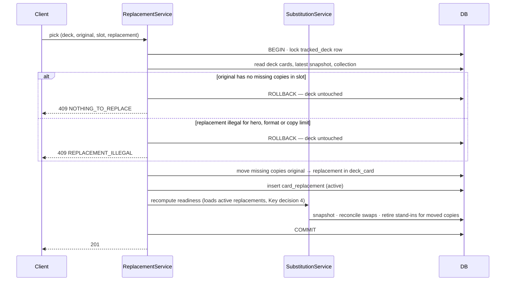
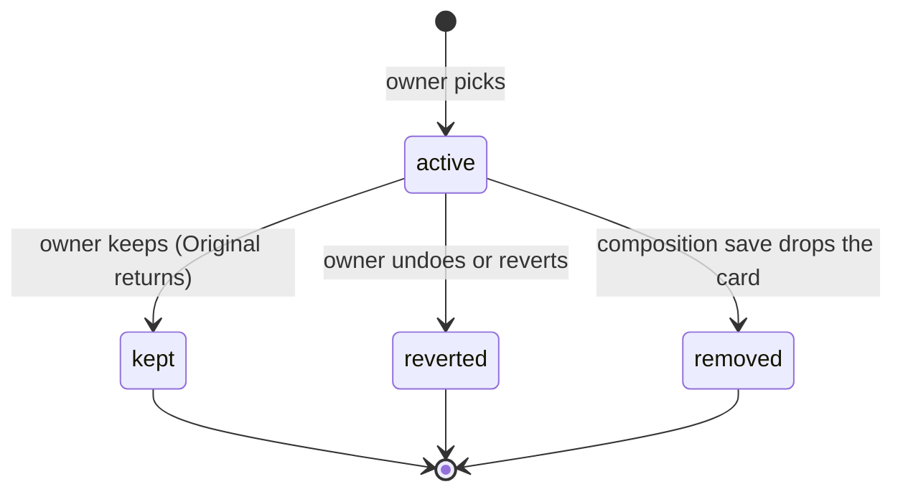

# Card alternatives and recommendations

> Plan from this document. Each slice below carries its own shape - copy it, do not re-derive it.
> Status: confirmed by Rodrigo, 2026-10-04 - build Alternatives, Replacement and Original returns now; Recommendations waits on the Synergy spike.

## Situation

- Project: in steady use, with one user (the owner).
- Decision: open until this session; the owner made it here.
- In flight: copies the deck's existing lock and readiness recompute from the swap lifecycle (AD-006), and the copy grouping from AD-007; the Phase 1c Discover page and the store-alternatives idea in R29 of the April brainstorm stay out.
- At stake: medium - one new table and a small engine input, in areas with one author (one to two commits in 90 days in the engine, swaps and stores; ten in the deck detail screen, where the marker goes); being wrong costs a migration and a rewrite of one screen, not data loss.

## Problem

When a deck is missing a card, the site proposes exactly one stand-in from the collection, and only when it clears strict rules (same class, same pitch, a shared type and talent).
To find anything else, the owner browses the library or Fabrary by hand, reading card text and loosening filters until something fits, and judges in his head whether a card has synergy with the rest of the deck.
He would rather buy a card that has clearly more synergy with the deck than settle for a close stand-in, and the site never shows a card he does not own.
Nothing proactive exists either: the site never suggests a card that would make the deck play better when nothing is missing.
Under today's rules, 78.7% of the 4,390 Classic Constructed cards (counting name plus pitch) have six or more acceptable stand-ins in the catalog, and the site shows one of them; measured over the full catalog with the engine's own scoring, because production numbers would only be the owner's own decks and his account already covers them.

## Success

- Worked if: across the owner's next two or three decks, missing cards are resolved inside the site (a replacement picked or a swap approved) without opening the library or Fabrary to search by hand.
- Going wrong: most picks come from the name search instead of the groups (`card_replacement.pickedFrom`), or the owner notices himself opening alternatives and leaving without a pick.
- Synergy spike passes if: for three of the owner's decks, at least 5 of the top 10 suggestions per deck are cards he would consider putting in that deck.
- Review: after the owner builds his next two or three decks - Rodrigo.

## Boundary

In: alternatives for a missing card, opened from the deck; picking one (owned or to buy) as a replacement in the deck; the prompt when the original card later enters the collection; a spike on judging synergy; proactive per-deck recommendations once the spike passes.

Out: the Discover page - a separate decision on Phase 1c.
Out: changing the headline readiness - it still counts only owned cards.
Out: per-copy partial picks - a pick covers every missing copy, as AD-007 does for swaps.
Out: more than one store - only Cúpula DT exists; prices come from it alone.
Out: approved swaps that silently stop counting when the engine's best stand-in changes - a known defect of the swap lifecycle, separate work.
Out: re-syncing a deck from Fabrary - no such flow exists.
Out: engine stand-ins that push a card past the format's copy limit - the substitution search never checks it today; separate work.

Unchanged: `swap_suggestion` and the `/api/swaps` routes; the tier 1 and tier 2 scoring constants validated against the Gate 4 gold set; `GET /api/catalog/search` (the name search inside Alternatives is its own parameter, not this route); how readiness reserves exact copies before stand-ins.

## Prior art

- Deck builders for Flesh and Blood (FaB TCG Meta, TCG Stacked, the Dragon Shield scanner app) show deck statistics - pitch curve, types, cost - and none suggests cards against the user's collection or by synergy; there is no shape to copy and nothing to buy.

## Shape

A pick is a deck change: the deck list holds the chosen card in place of the original, and a `card_replacement` record remembers which card it replaced and how the pick ended.
Alternatives are computed on request from the in-memory catalog, the collection and the store stock, and are never persisted.
The door is that a pick rewrites `deck_card` at pick time, so fidelity to the imported list drops immediately; undoing that later means turning replacements back into stand-ins, which needs a pinned-substitute input in the engine and user-created rows in swap reconciliation.

The heavier alternative keeps the original in the deck list and treats the pick as a pinned stand-in until the owner confirms; it wins only if the deck list must stay identical to the imported decklist until confirmation, and the owner chose not to need that.

## Key decisions

1. **A pick changes the deck; it is not a swap.** The deck list holds the replacement card, readiness and legality treat it as an ordinary deck card, and the original lives only in `card_replacement`; the owner chose this knowing fidelity drops at pick time.
2. **The replacement record outlives the deck change and is never deleted.** It sits in its own table rather than on `deck_card`, because a composition save rewrites every `deck_card` row; `kept`, `reverted` and `removed` close it, and the closed rows are what Success counts.
3. **A pick covers every missing copy of the original in that slot, and the copies moved equal the copies missing at that moment.** A missing copy is any copy the collection does not cover exactly, whether or not the engine found it a stand-in, pending or approved - the same count the missing panel starts from. It is decided under the same `tracked_deck` lock the swap mutations take, so a second pick racing the first finds nothing left to replace.
4. **No copy covered by an active replacement ever gets an engine stand-in, on every recompute.** Readiness loads active replacements itself, as it already loads swap decisions, so a scan, an import, mark-owned or a deck edit honors them as a pick does. An unowned replacement therefore always appears as missing - in the missing panel and the shopping line - which is how "pick it to buy it" works; and once a pick moves the original's copies, no swap row for those copies stays visible in `/swaps` or the deck, which today's reconciliation does not guarantee, because it retires a row only when the (card, slot) position leaves the deck.
5. **Every alternative is legal for the deck: hero, format and the format's copy limit, counting the copies the deck already holds.** It goes through the engine's existing legality rules, never a separate copy check, because the looser groups drop the class gate, and today's engine stand-ins never check the copy limit, so there is no legality precedent in substitution to copy.
6. **Group order is absolute; ownership only breaks near-ties inside a group.** Groups run strict to loose; inside one, cards order by similarity with a small bonus for owned free copies, and that bonus never moves a card across groups; ownership has two states, and a copy already in this deck counts as not owned.
7. **"You now have the original" is derived when the deck is read, never stored.** It holds when the collection has enough free copies of the original to cover the replaced quantity; keeping makes the replacement definitive, reverting puts the original back.

## Work

| Slice | Delivers | Status |
|---|---|---|
| [Alternatives](#alternatives) | grouped alternatives for one missing card, owned and buyable, legal for the deck | open — 4 defaults taken |
| [Replacement](#replacement) | picking an alternative rewrites the deck and records the original | clear |
| [Original returns](#original-returns) | the prompt to keep or revert when the original enters the collection | open — 2 defaults taken |
| [Synergy spike](#synergy-spike) | an answer on whether synergy can be judged well enough | passed - AD-010 |
| [Recommendations](#recommendations) | proactive per-deck suggestions | design - discovery in progress |

Order: Alternatives → Replacement → Original returns; Synergy spike runs in parallel with all three; Recommendations after the spike.

Already handled by existing code: the original entering the collection by scan, CSV, Fabrary import or mark-owned → every one of those already recomputes readiness, and with Key decision 4 that recompute carries the replacements; an owned replacement counting toward readiness → exact reservation, because it is a deck card.

Derivable from the repository, left to the plan: localized copy and error codes - as AD-003 and the swaps screens do them; deck-scoped authorization and 404 for another user's deck - as `GET /api/decks/:deckId` does it; prices in BRL cents with stale-variant fallback - as the shopping line does it.

### Alternatives

**Delivers** a grouped list of cards that could take a missing card's place, from the whole catalog, each marked owned or not with its store price. **Status: open.**

| State | What should happen | Caller sees |
|---|---|---|
| Missing card in a substitutable slot | `needed` is its missing copies (Key decision 3); four groups, strict to loose (below), each up to 10 cards, ordered by Key decision 6 | `200` with the groups |
| Hero or weapon slot | No alternatives, as stand-ins today | `200` with empty groups |
| Card not missing in that slot | Nothing to replace | `409` `NOTHING_TO_REPLACE` |
| Candidate would break the copy limit or is illegal for hero or format | Never listed (Key decision 5) | absent |
| Owner has free copies covering every missing copy | Marked owned | `freeCopies` ≥ `needed` |
| Owner has some or none free, including copies already in this deck | Marked not owned, with how many are free | `freeCopies` < `needed` |
| Not owned and in stock at the store | Price and link shown | `priceCents`, `productUrl` |
| Not owned and not in stock | Listed, marked out of stock | `priceCents: null` |
| Every group empty, or nothing fits | Name search over the catalog, same legality filter and same card shape | `200` with one group `search` |

Groups, each also legal (Key decision 5), and every group keeps the type gate and the equipment body-slot gate (Arms only for Arms):

| Group | Rules |
|---|---|
| `very_close` | tier 1: same pitch, class and type, a shared talent and keyword when the missing card has them, power and defense within 1 |
| `close` | tier 2: as tier 1 but the shared keyword is a penalty instead of a requirement, power and defense within 2 |
| `other_pitch` | tier 2 with pitch relaxed |
| `generic` | Generic class, same type and pitch, power and defense within 2 |

A card appears once, in the strictest group that accepts it. With `q` (two or more characters), the four groups are replaced by one group `search`: name matches, legality filtered, same fields.

`GET /api/decks/:deckId/alternatives?cardIdentifier=&slot=[&q=]` → `200` `{ needed, groups: [{ group, cards: [{ cardIdentifier, name, pitch, imageUrl, freeCopies, priceCents, productUrl, rationale }] }] }`

Alternatives considered: owner-toggled filters (pitch, class, type) - wins if the groups prove too coarse, which the `search` share of `pickedFrom` would show.

1. Ten cards per group - enough to scan on a phone; raise if picks cluster at the bottom.
2. The owned bonus is small and calibrated against the owner's real decks while building, within Key decision 6.
3. Out-of-stock cards are listed, not hidden - he may buy elsewhere.
4. The rationale reuses the swap rationale vocabulary, plus one line for the relaxed rule of `other_pitch` and `generic`.

### Replacement

**Delivers** picking an alternative: the deck list shows the chosen card with the original beside it, readiness and the shopping line follow, and the pick can be undone. **Status: clear.** Holds the door (Shape).

| State | What should happen | Caller sees |
|---|---|---|
| Pick an owned card | Original's missing copies leave the slot, the replacement takes them, readiness recomputes and the card counts | `201`, deck list shows "in place of" the original |
| Pick a card not owned | Same deck change; the replacement is missing and never gets a stand-in (Key decision 4) | `201`, card in the missing panel and shopping line, marked "in place of" |
| Pick from the name search | Same as a group pick | `201`, `pickedFrom: search` |
| Pick would break legality since the list was fetched | Refused, deck untouched | `409` `REPLACEMENT_ILLEGAL` |
| Another pick or edit already took the missing copies | Refused, deck untouched (Key decision 3) | `409` `NOTHING_TO_REPLACE` |
| Original had an engine stand-in, pending or approved | That stand-in disappears from the deck and `/swaps` (Key decision 4) | not listed |
| Undo before the original arrives | Replacement copies leave, original copies return, readiness recomputes, record `reverted` | `200`, original back as missing or swapped |
| Composition save removes or reduces the replacement card | Record `removed`; no marker shown | marker gone |

`POST /api/decks/:deckId/replacements` `{ originalCardIdentifier, slot, replacementCardIdentifier, pickedFrom }` → `201` `{ replacement }`
`POST /api/replacements/:id/revert` → `200` `{ replacement }`
`GET /api/decks/:deckId` gains `replacements: [{ id, slot, originalCardIdentifier, replacementCardIdentifier, quantity, originalOwned }]`, active ones only.

Table `card_replacement`; no existing table changes.

| Column | Type | Null | References | Note |
|---|---|---|---|---|
| `id` | uuid | no | | primary key |
| `userId` | uuid | no | `user.id` | cascade delete |
| `trackedDeckId` | int | no | `tracked_deck.id` | cascade delete; index with `status` |
| `slot` | varchar(64) | no | | the deck slot both cards occupy |
| `originalCardIdentifier` | varchar(128) | no | | the card the pick replaced |
| `replacementCardIdentifier` | varchar(128) | no | | the card now in the deck |
| `quantity` | int | no | | copies moved, > 0 (Key decision 3) |
| `pickedFrom` | varchar(32) | no | | `very_close` \| `close` \| `other_pitch` \| `generic` \| `search`, varchar plus CHECK as `swap_suggestion` does |
| `status` | varchar(32) | no | | `active` \| `kept` \| `reverted` \| `removed`, varchar plus CHECK |
| `createdAt` | timestamptz | no | | |
| `resolvedAt` | timestamptz | yes | | set when status leaves `active` |

### Original returns

**Delivers** the question "you now have the original - go back to it?" on the deck, and the answer. **Status: open.**

| State | What should happen | Caller sees |
|---|---|---|
| Free copies of the original cover the replaced quantity | Prompt on that card in the deck (Key decision 7) | `originalOwned: true` |
| Owner keeps the replacement | Record `kept`; marker and prompt disappear; the deck keeps the replacement as an ordinary card | `200` |
| Owner goes back | As undo in Replacement; record `reverted` | `200` |
| Owner ignores the prompt | Nothing changes; the prompt stays while the copies remain free | prompt persists |
| Free copies cover only part of the quantity | No prompt | `originalOwned: false` |
| Replacement was never owned and the original arrives | Same prompt - he may no longer want to buy it | `originalOwned: true` |

`POST /api/replacements/:id/keep` → `200` `{ replacement }`
Going back uses `POST /api/replacements/:id/revert` from Replacement.

1. The prompt appears only on the deck page, not on the home tiles or `/swaps`.
2. A partial match shows no prompt; partial reverts are out with per-copy picks.

### Synergy spike

**Delivers** an answer to whether a synergy judgment produces suggestions the owner agrees with. **Status: spike.**

- Spike: can any judgment of synergy - "this card makes the deck's other cards work better and serves its strategy" - give, for three of the owner's decks, top-10 lists where at least 5 are cards he would consider? - Pass: Recommendations is built on that judgment, and the same score replaces similarity as the in-group order in Alternatives, which is what makes "this one is worth buying" possible. Fail: Recommendations shrinks to "cards you own that fit this hero and are not in the deck", ordered by similarity, or is dropped - the owner decides. - Stops when one candidate passes on three decks, or after each candidate below has been tried once on the same three decks.

It runs as a script outside the product; the owner judges the lists himself.
Its first step is exposing each card's rules text, which the catalog package carries and the site's catalog currently drops.

Candidates, for perspective only - the spike picks:
- A language model reading the deck list, the hero and each candidate's rules text - wins if it ranks synergy the way the owner does; costs an API key and per-request spend.
- Co-occurrence in public decklists of the same hero - wins if enough decklists can be collected; that ingestion is part of the deferred Discover work.
- Keyword and subtype heuristics over rules text - cheap and explainable, likely too shallow for "serves the strategy".

**Result, 2026-10-04: passed.** Gemini 3.8 Flash passed on all three decks (5, 7 and 10 of 10) and Opus 5.5 too (5, 7 and 9); the spike stopped on Gemini 3.8 Flash, recorded as AD-010. Plan, checks, verification and outputs: `.specs/features/synergy-spike/`, `scripts/synergy-spike/out/result.md`.
The spike measured a deck-level top 10 drawn from the whole legal pool; ranking the alternatives of one missing card is a different question the spike did not measure.

### Recommendations

**Delivers** proactive suggestions on a deck, from the collection and the store, even when nothing is missing. **Status: spike** - blocked on the Synergy spike; its states and contract are designed with the spike's result as input.

What the spike cannot settle and this slice must, before planning: where the suggestions appear on the deck, and what adopting one does when nothing is missing - add a card or replace a chosen one; Blitz and Silver Age decks are exactly 40 cards, so there adoption must replace, while Classic Constructed and Living Legend only set a 60-card minimum.

## Migration

One new table, no backfill: no deck has replacements before this ships.
API and SPA deploy together as one Railway service, so no old client exists.
The engine's new input is optional; every existing caller keeps today's behavior.

## Sources

- `.specs/STATE.md` AD-003, AD-005, AD-006, AD-007, AD-008 - error codes, copy grouping, the persisted swap lifecycle and its reconciliation risk, atomic collection writes.
- `docs/brainstorms/2026-04-08-fab-deck-readiness-flow-requirements.md` R11-R14, R29 - Discover and store alternatives, both left out.
- `docs/phase-1-followups.md` B1 - Discover not built.
- https://fabtcgmeta.com/en/deck-builder/, https://www.tcgstacked.com/fleshandblood/deck-builder - deck builders with statistics, no collection-aware recommendations.
