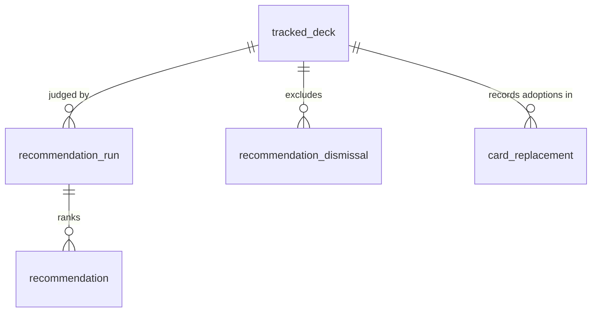
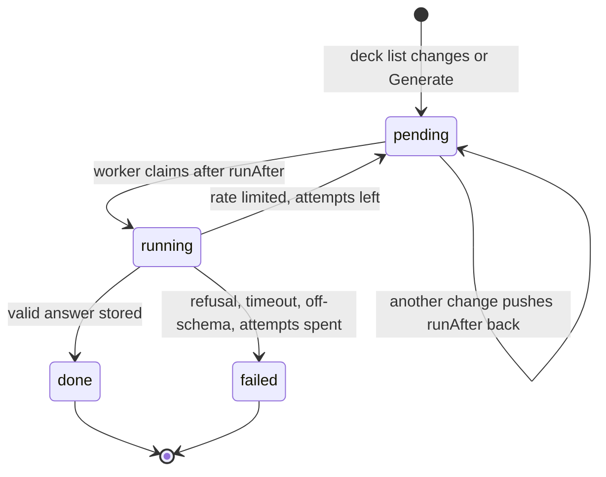

# Card recommendations

> Plan from this document. Each slice below carries its own shape - copy it, do not re-derive it.
> Status: draft - interview with Rodrigo on 2026-10-05; shape awaits his confirmation.

## Situation

- Project: in steady use, with one user (the owner).
- Decision: committed by Rodrigo on 2026-10-04 in `.design/card-alternatives.md` (Recommendations is built once the Synergy spike passes); the spike passed, recorded as AD-010.
- In flight: copies the job table and long-lived worker of the variant fetch queue, the `card_replacement` record and its stand-in protection from card-alternatives (AD-009), and the card shape with ownership and store price from the alternatives sheet; card-alternatives itself is still under verification and is not reopened here.
- At stake: medium - three new tables, a second job kind in the worker and a paid or rate-limited external call; being wrong costs a migration and a rewrite of the deck panel, not data loss.

## Problem

The site tells the owner which cards a deck is missing, but never which cards would make a deck play better, whether or not anything is missing.
To find an upgrade he browses the library or Fabrary by hand, reads rules text and judges in his head whether a card works with the rest of the deck; nothing tells him when a card he already owns, or one the store has, would be a clear improvement.
The synergy spike measured that a language model can make that judgment on his decks: blind-judged, Gemini 3.8 Flash had 5, 7 and 10 of its top 10 accepted on his three decks, against 3, 4 and 4 for a keyword heuristic (AD-010).

## Success

- Worked if: across the owner's next decks, upgrades are found inside the site - clear upgrades get adopted - and he stops browsing Fabrary or the library to look for them.
- Going wrong: most clear upgrades are dismissed rather than adopted, or the deck notice fires on decks where he finds nothing worth changing; both are read from the adoption and dismissal records (slices Adopt and Dismiss).
- Review: after 20 clear-upgrade notices, or four weeks of use, whichever comes first - Rodrigo.

## Boundary

In: per-deck recommendations computed by the language model of AD-010, automatic on deck changes and on request; the notice of a clear upgrade on the home deck tile and the deck page; dismissing and adopting a recommendation; using the deck's recommendations to order card alternatives inside each group.

Out: recommending cards across decks or for a new deck - per deck only. Out: changing which cards count toward readiness - adoption is an ordinary deck change. Out: a second model or provider fallback - one model, per AD-010. Out: validating the clear-upgrade label or the suggested cut by another judging round - measured through use instead (Success). Out: more than one store - only Cúpula DT exists.

Unchanged: `swap_suggestion` and `/api/swaps`; the alternatives groups and their legality rules (only the order inside a group changes); readiness and its stand-in search; `variant_fetch_job` and its drainer.

## Prior art

- Deck builders for Flesh and Blood show statistics and none recommends by synergy (recorded in `.design/card-alternatives.md`); the seam we take is our own variant fetch queue - a database job table drained by a long-lived worker that survives deploys.
- The failure that queue was built to stop - work lost when an in-process task dies on restart - is why recommendations do not run inside the API process (Key decision 2).

## Shape

A recommendation run is one model judgment of one deck, stored with its ranked cards; the deck shows its latest finished run, flagged stale when the deck list has changed since.
Runs are queued as jobs and drained by the existing worker process: automatically, a few minutes after the last change to the deck list, and on request from a button.
The door is the stored run: every surface - the panel, the home notice, the alternatives order - reads that record, and none calls the model itself.
The heavier alternative scores every legal card against every deck, so alternatives could be ordered by synergy for any card; it wins only if the deck's top list turns out too short to reorder alternatives, which the share of alternatives found in it will show.

## Key decisions

1. **The model is never called on a request path.** Every call happens in the worker; requests read stored runs only. A run takes on the order of a minute per deck (the spike's passes took minutes per model for three decks), so no screen waits on it.
2. **Runs are database jobs drained by the existing worker, as the variant fetch queue does; never an in-process task in the API.** A job survives restarts and deploys, an orphaned job is reclaimed, and at most one job per deck is pending or running.
3. **Only a change to the deck list enqueues an automatic run, and changes coalesce.** A composition save, an import, a pick, a revert and an adoption move the deck list; collection changes do not, because synergy depends only on the deck list, the hero and the format. A pending automatic job is pushed back on each change and runs 5 minutes after the last one; decks with status `retired` never get an automatic run.
4. **Ownership and store price are read when the deck is read, never stored with the run.** A recommendation says which card and why; whether the owner has it and what it costs are joined live, as the alternatives sheet does.
5. **A dismissal is permanent for that deck and card, and dismissed cards are removed from the pool before the model sees it.** It is undone only by an explicit undo, and the next run cannot propose the card again.
6. **Adopting a recommendation is a `card_replacement` with `pickedFrom = 'recommendation'`.** It moves every copy of the cut card in that slot to the recommended card, capped by the format's copy limit, protects those copies from engine stand-ins and is undone by revert, exactly as a picked alternative (AD-009). The "you now have the original" prompt never applies to it, because the cut card was never missing.
7. **The run records only what the model says; the server validates it.** A recommended card outside the legal pool, already in the deck or dismissed is dropped; a suggested cut that is not in the deck is stored as no cut. The clear-upgrade label is the model's, unvalidated by the spike, and is judged by the adoption and dismissal records (Success).

## Work

| Slice | Delivers | Status |
|---|---|---|
| [Recommendation run](#recommendation-run) | queued, coalesced runs drained by the worker, storing ranked cards per deck | open — 3 defaults taken |
| [Recommendations panel](#recommendations-panel) | the panel on the deck page, with the generate button and the stale flag | open — 2 defaults taken |
| [Clear upgrade notice](#clear-upgrade-notice) | the marker on the home deck tile and the highlighted upgrades in the panel | clear |
| [Dismiss](#dismiss) | dismissing a recommendation for good, with undo | clear |
| [Adopt](#adopt) | swapping a chosen deck card for the recommended card | clear |
| [Alternatives order](#alternatives-order) | alternatives found in the deck's latest run rise inside their group | open — 1 default taken |

Order: Recommendation run → Recommendations panel → Dismiss → Adopt → Clear upgrade notice → Alternatives order.

Already handled by existing code: the owner acquiring a recommended card → ownership is read live (Key decision 4); a deck deleted → its runs, recommendations and dismissals go with it by cascade, as `card_replacement` does.

Derivable from the repository, left to the plan: localized copy and error codes - as AD-003 and the alternatives sheet do them; deck-scoped authorization and `404` for another user's deck - as `GET /api/decks/:deckId` does it; the card's art, ownership mark and store price - as the alternatives sheet shows them; job claiming, orphan reclaim and worker logging - as `variant_fetch_job` does them.

### Recommendation run

**Delivers** one stored model judgment per deck, queued automatically or on request and run by the worker. **Status: open.** Holds Key decisions 1, 2, 3 and 7.

| State | What should happen | Caller sees |
|---|---|---|
| Deck list changes on a deck not `retired` | An automatic job is created, or the pending one is pushed back to 5 minutes from now | nothing - the panel shows the previous run, flagged stale |
| Owner presses Generate | A manual job is created to run as soon as the worker is free; a pending automatic job is promoted to it | `202` with the run, `status: pending` |
| A job for the deck is already running | No second job; the request returns the running one | `202` with that run |
| Model answers | Ranked cards stored (at most 10), each with its label, reason and suggested cut; run `done` | panel shows the new list |
| Model refuses, times out or answers off-schema | Run `failed` with the reason; the previous `done` run stays current | panel keeps the old list and shows the failure |
| Provider rate limit | Job back to `pending` with a later start, at most 3 attempts | nothing until it runs or fails |
| Deck changes while its run is running | The finished run is stored, then flagged stale; the pending automatic job runs after it | stale flag |

`POST /api/decks/:deckId/recommendations/runs` → `202` `{ run: { id, status, trigger, createdAt } }`

Table `recommendation_run`; no existing table changes.

| Column | Type | Null | References | Note |
|---|---|---|---|---|
| `id` | uuid | no | | primary key |
| `trackedDeckId` | int | no | `tracked_deck.id` | cascade delete; index with `status` |
| `trigger` | varchar(16) | no | | `auto` \| `manual`, varchar plus CHECK |
| `status` | varchar(16) | no | | `pending` \| `running` \| `done` \| `failed`, varchar plus CHECK |
| `runAfter` | timestamptz | no | | when the worker may claim it; pushed back by each deck change |
| `deckFingerprint` | varchar(64) | yes | | hash of the deck list the run judged; stale when it differs from the deck's current one |
| `model` | varchar(64) | yes | | model id used |
| `attempts` | int | no | | default 0 |
| `inputTokens`, `outputTokens` | int | yes | | from the provider's usage |
| `error` | text | yes | | failure reason |
| `createdAt`, `startedAt`, `finishedAt` | timestamptz | `createdAt` no | | |

Table `recommendation`.

| Column | Type | Null | References | Note |
|---|---|---|---|---|
| `id` | uuid | no | | primary key |
| `runId` | uuid | no | `recommendation_run.id` | cascade delete |
| `cardIdentifier` | varchar(128) | no | | the recommended card |
| `rank` | int | no | | 1 to 10; unique with `runId` |
| `strength` | varchar(16) | no | | `clear_upgrade` \| `consider`, varchar plus CHECK |
| `cutCardIdentifier` | varchar(128) | yes | | the deck card the model would replace; null when absent or invalid (Key decision 7) |
| `cutSlot` | varchar(64) | yes | | slot of the suggested cut |
| `reason` | text | no | | one sentence from the model |

Alternatives considered: Google's Batch API at half price - wins if runs stop being wanted within minutes, since batch answers arrive asynchronously over hours.

1. Coalescing delay - 5 minutes after the last deck-list change.
2. Provider - Gemini 3.8 Flash called directly on Google's API with an AI Studio key, free tier first, billing linked only if its limits bite; the key lives only in the worker's environment.
3. Ranked cards kept per run - 10, the size the spike measured.

### Recommendations panel

**Delivers** the panel on the deck page that shows the latest run and the Generate button. **Status: open.**

| State | What should happen | Caller sees |
|---|---|---|
| No run yet | Empty state with Generate | panel with the button |
| Run pending or running, none done before | Waiting state; the page polls until done or failed | "generating" |
| Latest `done` run, deck list unchanged since | The ranked cards, each with art, reason, ownership or store price, and the suggested cut | list |
| Latest `done` run, deck list changed since | Same list, flagged stale, with Generate | list plus stale flag |
| Latest run `failed` | The last `done` list if any, plus the failure and Generate | list or empty, plus error |
| A recommended card is dismissed or adopted | It leaves the list | list without it |

`GET /api/decks/:deckId/recommendations` → `200` `{ run: { id, status, trigger, finishedAt, stale } | null, pending: boolean, recommendations: [{ id, rank, cardIdentifier, name, pitch, imageUrl, strength, reason, cutCardIdentifier, cutSlot, freeCopies, priceCents, productUrl }] }`

1. Placement - in the column of the swaps panel, under it, on the deck page.
2. Polling - every 10 seconds while a run is pending or running, stopping when it ends.

### Clear upgrade notice

**Delivers** the proactive notice: a marker on the home deck tile and the clear upgrades first in the panel. **Status: clear.**

| State | What should happen | Caller sees |
|---|---|---|
| Latest `done` run has at least one `clear_upgrade` not dismissed or adopted | Home deck tile shows "N upgrades suggested"; panel shows clear upgrades first, highlighted | marker and highlight |
| No clear upgrade left | No marker; the panel shows the list without highlight | no marker |
| Deck `retired` | No marker | no marker |

`GET /api/decks` gains `clearUpgradeCount` per deck.

### Dismiss

**Delivers** dismissing a recommendation for good, with undo. **Status: clear.** Holds Key decision 5.

| State | What should happen | Caller sees |
|---|---|---|
| Owner dismisses a recommendation | A dismissal for (deck, card) is recorded; the card leaves the list and the notice count | `201` |
| Same card already dismissed | Nothing new is recorded | `200` |
| Owner undoes the dismissal | The dismissal is removed; the card reappears if the latest run has it | `204` |
| Next run | Dismissed cards are not in the pool the model sees | never proposed again |

`POST /api/decks/:deckId/recommendations/dismissals` `{ cardIdentifier }` → `201` `{ dismissal }`
`DELETE /api/decks/:deckId/recommendations/dismissals/:cardIdentifier` → `204`

Table `recommendation_dismissal`: `id` uuid, `trackedDeckId` int not null → `tracked_deck.id` cascade, `cardIdentifier` varchar(128) not null, `createdAt` timestamptz not null; unique (`trackedDeckId`, `cardIdentifier`).

### Adopt

**Delivers** swapping a deck card for the recommended card. **Status: clear.** Holds Key decision 6.

| State | What should happen | Caller sees |
|---|---|---|
| Owner adopts with the suggested cut | Every copy of the cut card in its slot moves to the recommended card, up to the copy limit; a `card_replacement` with `pickedFrom = 'recommendation'` records it | `201`, deck shows "in place of" with Undo |
| Owner picks another card to cut | Same, with the chosen card | `201` |
| Recommended card would break legality | Refused, deck untouched | `409` `REPLACEMENT_ILLEGAL` |
| Cut card no longer in that slot | Refused, deck untouched | `409` `NOTHING_TO_REPLACE` |
| Owner undoes | As a revert of a picked alternative | `200` |
| Adopted card later owned | No "you now have the original" prompt (Key decision 6) | no prompt |

`POST /api/decks/:deckId/recommendations/:recommendationId/adopt` `{ cutCardIdentifier, cutSlot }` → `201` `{ replacement }`

`card_replacement`: `pickedFrom` gains `recommendation` (CHECK replaced, entity and migration both).

### Alternatives order

**Delivers** synergy as the in-group order of card alternatives. **Status: open.**

| State | What should happen | Caller sees |
|---|---|---|
| Deck has a `done` run, stale or not | Inside each group, alternatives present in the run come first, by run rank; the rest keep the similarity order with the owned bonus | reordered group |
| Deck has no `done` run | Today's order | unchanged |

Groups and their membership never change; only the order inside one does (card-alternatives Key decision 6 still holds).

1. A stale run still orders alternatives - synergy with a slightly older list beats no synergy, and the panel already flags staleness.

## Migration

Three new tables and a replaced CHECK on `card_replacement.pickedFrom`; no backfill - no deck has runs, and no existing row uses the new origin.
The worker service needs the Gemini key in its environment and is redeployed with the API; until the key is set, runs fail with a clear reason and nothing else changes.
API and SPA deploy together, so no old client exists.

## Sources

- `.design/card-alternatives.md` - the committed decision to build Recommendations after the spike, the `card_replacement` record and the alternatives groups.
- `.specs/STATE.md` AD-009 and AD-010 - picks as deck changes; the model that judges synergy and the spike evidence.
- `docs/superpowers/specs/2026-06-03-variant-fetch-queue-design.md` - the job table and worker this copies.
- https://ai.google.dev/gemini-api/docs/pricing and https://ai.google.dev/gemini-api/terms - Gemini 3.8 Flash prices, free tier and its data-use terms (read 2026-10-05).
