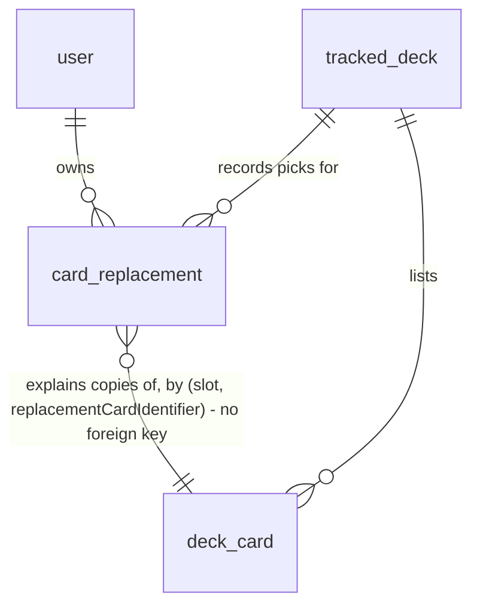

# Card alternatives

## Problem

When a deck is missing a card, the site proposes exactly one stand-in from the collection, and only when it clears strict rules (same class, same pitch, a shared type and talent).
To find anything else, the owner browses the library or Fabrary by hand, reading card text and loosening filters until something fits.
He would rather buy a card that fits the deck better than settle for a close stand-in, and the site never shows a card he does not own.
Under today's rules, 78.7% of the 4,390 Classic Constructed cards (counting name plus pitch) have six or more acceptable stand-ins in the catalog, and the site shows one of them (full-catalog measurement with the engine's own scoring, `.design/card-alternatives.md`).
No usage figure exists beyond that; the owner is the site's only user.

When this ships, a missing card opens a grouped list of cards that could take its place, owned or buyable at Cúpula DT, all legal for the deck.
Picking one puts it in the deck in place of the original, readiness and the shopping line follow, and the site remembers the original: undo returns it, and once the original is in the collection the deck asks whether to keep the replacement or go back.

## Flow

Reuses the engine's tier scoring (`scoreCandidate`, `TIER_1_CONFIG`, `TIER_2_CONFIG`) instead of a second similarity measure, the legality rules inside `computeDeckLegality` instead of a separate copy check, the shopping line's price resolution instead of a second store query, the `tracked_deck` lock the swap mutations take, and `SubstitutionService.computeAndStoreReadiness` as the one recompute path for every write this feature adds.

Alternatives (S1):

1. missing panel row, or approved swap row, "Alternatives" -> `GET /api/decks/:deckId/alternatives` -> `OwnsTrackedDeckGuard` (exists) -> alternatives controller and service (new, no door - placement per conventions)
2. the service reads `deck_card`, the collection through `CollectionReadService.loadOwned` (exists) and the deck's active `card_replacement` rows (door 1), runs `computeEffectiveReadiness` (exists) once to take the slot's `notOwned` quantity, and subtracts the copies active replacements hold there: that is `needed`
3. candidates come from an alternatives search in `packages/engine` substitution (new pure function, no door - placement), which scores with `scoreCandidate` (exists) under four group configs and filters each card through a per-card legality check extracted from `computeDeckLegality` (exists)
4. prices for the listed cards come from `ShoppingLineService` (exists), the same unit-price resolution its shopping line uses
5. out: `200` with the groups, and one `alternatives.listed` log line

Replacement (S2):

6. a card tapped in the alternatives sheet -> `POST /api/decks/:deckId/replacements` -> replacements service (new, no door - placement) opens a transaction and takes the `tracked_deck` `FOR NO KEY UPDATE` lock, as `SwapsService.applyTransition` (exists) does
7. it recomputes `needed` and the candidate's legality inside the lock, moves `needed` copies from the original's `deck_card` row to the replacement's row in the same slot (door 5), inserts `card_replacement` (door 1, doors 2-4), and retires the `swap_suggestion` (exists) rows for (original, slot) that are `pending` or `approved`
8. `SubstitutionService.computeAndStoreReadiness` (exists) runs with the transaction's manager; its `runReadiness` now reads `tracked_deck`, `deck_card` and active `card_replacement` rows through that manager, and passes the active replacements to `computeEffectiveReadiness` (exists) as a new optional count of copies per (card, slot) that get no stand-in
9. commit; out: `201` with the replacement, and one `replacements.picked` log line
10. Undo -> `POST /api/replacements/:id/revert` -> same service: record looked up by id and user, deck lock, copies moved back, status `reverted`, recompute as in hop 8; out `200`

Original returns (S3):

11. `GET /api/decks/:deckId` -> `DecksService.getDetail` (exists) adds the deck's active replacements, each with `originalOwned` derived from the collection on that read (never stored)
12. "Keep" -> `POST /api/replacements/:id/keep` -> same service: deck lock, status `kept`, recompute as in hop 8 (the copies stop being protected from stand-ins); out `200`

Composition save (existing path that must honour replacements):

13. `PUT /api/decks/:deckId` -> `DecksService.updateComposition` (exists): after the new `deck_card` rows are inserted, it closes as `removed` every active record whose slot now holds fewer copies of its replacement card than the records claim, then loads the still-active ones and passes them to both of its `computeEffectiveReadiness` calls

Web:

14. `MissingPanel` (exists) and `SwapsPanel` (exists) open an alternatives sheet (new component, no door - placement); a pick or an undo invalidates the deck detail and swaps queries; `DeckList` (exists) cells show the "in place of" marker, the undo control and the keep-or-go-back prompt

## Impact

| Front | What changes |
| --- | --- |
| domain | new term: `alternative` - a catalog card that could take a missing card's copies in one slot, listed in one of five groups (`very_close`, `close`, `other_pitch`, `generic`, `search`); computed per request, never stored |
| domain | new term: `replacement` - a card the owner picked to take a missing card's copies in a slot; the deck list holds it, `card_replacement` remembers the original |
| domain | existing term: missing copy, as the pick and the alternatives route count it, now excludes copies an active replacement holds - nothing else branches on it; the missing panel and the shopping line keep reading `notOwned`, so an unowned replacement shows there as missing |
| engine | `computeEffectiveReadiness` gains an optional input; called today by `SubstitutionService.runReadiness`, `DecksService.updateComposition` (twice) and `TestDeckService.computeReadiness`; the first two pass active replacements, the test-deck preview has no tracked deck and passes nothing |
| engine | `computeDeckLegality` shares its per-card rules (format, ban, hero scope, Silver Age rarity, copy limit) with the alternatives search; its own verdicts do not change |
| recompute paths | every path that reaches `computeAndStoreReadiness` honours active replacements through `runReadiness`: collection add, batch, decrement and mark-owned, CSV upload, source toggle and delete, Fabrary collection import, deck import, deck list and detail auto-recompute, swap mutations, the swap backfill script; `updateComposition` is the only path that calls the engine directly |
| `SubstitutionService.runReadiness` | reads `tracked_deck` and `deck_card` through the manager when one is passed; today the swap mutations pass one and only change `swap_suggestion`, so their result does not change |
| swaps | a pick retires the `pending` and `approved` rows of the original in that slot; after an undo, reconciliation un-retires a matching row as `pending`, so an approved swap comes back unapproved |
| deck list fidelity | a pick rewrites `deck_card`, so the deck no longer matches its Fabrary decklist from that moment; no re-sync flow exists that would notice |
| API response | `GET /api/decks/:deckId` gains `replacements`; consumed only by this SPA, deployed with it |
| error catalog | new codes `NOTHING_TO_REPLACE`, `REPLACEMENT_ILLEGAL`, `REPLACEMENT_NOT_ACTIVE`, each with an `apiErrors` entry in pt-BR and en-US (AD-003) |
| stored data | one new table, nothing to backfill: no deck has replacements before this ships |
| prior decisions | conforms to AD-003 (error codes), AD-006 (rows never deleted, retire instead), AD-007 (one decision covers every copy); records the pick-is-a-deck-change door as AD-009 |

## Relations

One-way constraints: `status` limited to four values (door 2), `pickedFrom` limited to five values (door 3), `quantity` greater than 0, rows deleted only by cascade from `user` or `tracked_deck` (door 1).
No columns and no types here.

## Surface

Only routes this adds or whose signature changes.

| Route | In | Out | Status |
| --- | --- | --- | --- |
| `GET /api/decks/:deckId/alternatives` | `cardIdentifier`, `slot`, optional `q` | `needed` · `groups[]` of `group`, `cards[]` of `cardIdentifier`, `name`, `pitch`, `imageUrl`, `freeCopies`, `priceCents`, `productUrl`, `rationale` | `200`, `400`, `401`, `404`, `409`, `429` |
| `POST /api/decks/:deckId/replacements` | `originalCardIdentifier`, `slot`, `replacementCardIdentifier`, `pickedFrom` | `replacement` of `id`, `slot`, `originalCardIdentifier`, `replacementCardIdentifier`, `quantity`, `pickedFrom`, `status`, `createdAt`, `resolvedAt` | `201`, `400`, `401`, `404`, `409`, `429` |
| `POST /api/replacements/:id/revert` | `id` in the path | `replacement` | `200`, `400`, `401`, `404`, `409`, `429` |
| `POST /api/replacements/:id/keep` | `id` in the path | `replacement` | `200`, `400`, `401`, `404`, `409`, `429` |
| `GET /api/decks/:deckId` (changed) | unchanged | adds `replacements[]` of `id`, `slot`, `originalCardIdentifier`, `replacementCardIdentifier`, `quantity`, `originalOwned` | `200`, `401`, `404`, `429` |

## Landing

| One-way door | Literal shape | Alternative rejected |
| --- | --- | --- |
| 1. Replacement record | table `card_replacement`, `id` uuid primary key, `userId` → `user.id` and `trackedDeckId` → `tracked_deck.id` both `ON DELETE CASCADE`, index `("trackedDeckId", "status")`; no code path deletes a row - `kept`, `reverted` and `removed` close it, `resolvedAt` set when it leaves `active` | columns on `deck_card` - every composition save deletes and reinserts all `deck_card` rows, so the original and the outcome would be lost on the first edit; a row in `swap_suggestion` - its key is (original, slot, substitute) proposed by the engine, and reconciliation retires rows the engine stops proposing |
| 2. Replacement status values | `status varchar(32) NOT NULL` with `CHECK (status IN ('active','kept','reverted','removed'))` | a Postgres enum type - adding a state later means dropping and recreating the type; same reasoning `swap_suggestion.status` records |
| 3. Pick origin values | `pickedFrom varchar(32) NOT NULL` with `CHECK ("pickedFrom" IN ('very_close','close','other_pitch','generic','search'))` | not storing it - the Success measure (share of picks from `search`) cannot be rebuilt after the fact; a Postgres enum - as door 2 |
| 4. Identifier and slot widths | `originalCardIdentifier` and `replacementCardIdentifier` `varchar(128) NOT NULL`, `slot varchar(64) NOT NULL`, `quantity int NOT NULL CHECK (quantity > 0)` | unbounded `varchar` as `deck_card` has - `swap_suggestion` already bounds the same fields at 128 and 64, and the two tables are read together |
| 5. A pick rewrites the deck list | the pick moves `needed` copies from the original's `deck_card` row to the replacement's row in the same slot (row created when absent, original row deleted at 0); readiness and legality see the replacement as an ordinary deck card | keeping the original in the deck list and treating the pick as a pinned stand-in until confirmed - wins only if the deck list must match the imported decklist until confirmation, which the owner chose not to need; this closes off nothing for Recommendations, but reversing it later needs a pinned-substitute engine input and user-created rows in swap reconciliation (AD-009) |

- Nothing else in this change is hard to reverse

## Criteria

### S1: Grouped alternatives for one missing card (P1)

The owner opens a missing card and sees, in groups from strict to loose, every legal card that could take its place, owned or buyable.

**Acceptance Criteria**

1. WHEN the owner requests `GET /api/decks/:deckId/alternatives` for a card and slot of their deck THEN the API SHALL return `200` with `needed` equal to the slot's `notOwned` quantity for that card in a readiness compute run on that request, minus the copies active replacements of that card hold in that slot
2. WHEN alternatives are returned without `q` THEN the API SHALL list the groups in the order `very_close`, `close`, `other_pitch`, `generic`, leave out a group with no cards, and put at most 10 cards in each group
3. The `very_close` group SHALL accept a candidate when `scoreCandidate(missing, candidate, TIER_1_CONFIG)` is not null and is at least 0.90
4. The `close` group SHALL accept a candidate when `scoreCandidate(missing, candidate, TIER_2_CONFIG)` is not null and is at least 0.70
5. The `other_pitch` group SHALL accept a candidate with a different pitch that `close` would accept if the two cards had the same pitch
6. The `generic` group SHALL accept a candidate whose classes include Generic, with the missing card's pitch, at least one shared type, the same equipment body slot when the missing card is equipment, and power and defense each within 2 of the missing card
7. The API SHALL list a card at most once per response, in the first group of the order in AC 2 that accepts it
8. The API SHALL never list the missing card itself, a Hero card or a Token card
9. IF a candidate is banned in the deck's format, not legal in it, not legal for the deck's hero, or outside the Silver Age rarities in a Silver Age deck THEN the API SHALL not list it, whatever slot it would fill
10. IF the candidate's copies already in the deck, across every slot, plus `needed` exceed the format's copy limit (1 for a Legendary card) THEN the API SHALL not list it
11. The API SHALL order the cards inside a group by score descending, adding 0.05 to the score of a card whose `freeCopies` is at least `needed`, with ties ordered by name ascending
12. The API SHALL report `freeCopies` as the owned quantity of the card across active sources minus its copies already in this deck in any slot, never below 0
13. WHEN the store has a listed card in stock THEN the API SHALL report `priceCents` as the unit price the shopping line computes for that card at quantity `needed`, and `productUrl` as the URL the shopping line validates for it
14. IF the store has no row for a listed card, or its quantity is 0, or its price is null THEN the API SHALL list the card with `priceCents: null` and `productUrl: null`
15. The API SHALL send each card's `rationale` as the swap rationale detail (`tier`, `pitch`, `sharedClasses`, `powerDelta`, `defenseDelta`, `sharedKeywords`) plus `relaxed`: `pitch` in `other_pitch`, `class` in `generic`, `null` otherwise
16. WHEN `q` has 2 to 50 characters after trimming THEN the API SHALL return exactly one group, `search`, with at most 10 cards whose name contains `q` ignoring case, names starting with `q` first, filtered by AC 8, AC 9 and AC 10
17. IF `q` is present with fewer than 2 or more than 50 characters after trimming THEN the API SHALL return `400`
18. WHEN the slot is `hero` or `weapon` THEN the API SHALL return `200` with `groups: []`
19. IF the card has no missing copies in that slot by AC 1, or is not in the deck THEN the API SHALL return `409` with code `NOTHING_TO_REPLACE`
20. IF the deck does not exist or belongs to another user THEN the API SHALL return `404`
21. WHEN the API returns alternatives with status `200` THEN it SHALL log one `alternatives.listed` line with `userId`, `trackedDeckId`, `cardIdentifier`, `slot`, `needed`, the card count per group and whether `q` was sent
22. The missing panel SHALL show an "Alternatives" control on every row whose slot is neither `hero` nor `weapon` and that is not a replacement's own copies
23. The deck's swaps panel SHALL show the same control on every approved swap row
24. WHEN the owner opens the control THEN the screen SHALL show a sheet naming the missing card and `needed`, with each group under its label and each card showing its art, name, pitch and localized rationale
25. The sheet SHALL mark a card "owned" when `freeCopies` is at least `needed`, and otherwise show "N free" with N equal to `freeCopies`
26. WHILE a card is not owned the sheet SHALL show its price with a link to the store when `priceCents` is not null, and an "out of stock" mark when it is null
27. WHILE alternatives are loading the sheet SHALL show a loading state
28. IF the alternatives request fails THEN the sheet SHALL show the localized error with a retry action
29. WHEN every group comes back empty THEN the sheet SHALL show the no-alternatives message and put the focus on the name search
30. WHEN the owner types 2 or more characters in the sheet's name search THEN the sheet SHALL replace the groups with the `search` group for that text

**Independent test:** call the alternatives route from an integration test on a seeded deck and read the groups; in Playwright, open the sheet from the missing panel and see the groups.

### S2: Pick an alternative as a replacement, and undo it (P1)

Picking a card puts it in the deck in place of the original's missing copies; undo puts the original back.

**Acceptance Criteria**

31. WHEN the owner sends `POST /api/decks/:deckId/replacements` for a legal card and a (card, slot) with `needed` copies THEN the API SHALL, in one transaction holding the `tracked_deck` lock, take `needed` copies off the original's `deck_card` row in that slot (deleting it at 0), add them to the replacement's row in that slot (creating it when absent), insert a `card_replacement` row with that quantity, `status: active` and the `pickedFrom` sent, and return `201` with the replacement
32. WHEN a pick commits THEN the deck's newest readiness snapshot SHALL list the replacement's copies in its breakdown and SHALL not list the moved copies of the original
33. WHILE a replacement is active the readiness compute SHALL give no stand-in to the copies of the replacement card it holds in that slot, on every recompute path listed in Impact
34. WHEN `computeEffectiveReadiness` receives a protected count `c` for a (card, slot) with `m` copies not covered exactly THEN at most `max(0, m - c)` of those copies SHALL appear in `breakdown.substituted`, and the rest SHALL appear in `breakdown.missing`
35. WHEN `computeEffectiveReadiness` is called without the protected count THEN it SHALL return the same result as before this change for the same deck, inventory and swap inputs
36. The engine SHALL keep `TIER_1_CONFIG`, `TIER_2_CONFIG`, `TIER_1_FLOOR_SCORE` and `TIER_2_FLOOR_SCORE` at their current values
37. The legality verdict of `computeDeckLegality` SHALL stay the same for every deck after its per-card rules are shared with the alternatives search
38. WHEN a pick commits THEN every `swap_suggestion` row of that deck for (original, slot) in status `pending` or `approved` SHALL be `retired`, and `rejected` rows SHALL stay unchanged
39. IF the replacement fails AC 8, AC 9 or AC 10 at pick time, or the slot is `hero` or `weapon` THEN the API SHALL return `409` with code `REPLACEMENT_ILLEGAL` and change no `deck_card`, `card_replacement` or `swap_suggestion` row
40. IF the original has no missing copies in that slot by AC 1 at pick time THEN the API SHALL return `409` with code `NOTHING_TO_REPLACE` and change no row
41. WHEN two picks for the same deck, card and slot run concurrently THEN exactly one SHALL return `201`, the other SHALL return `409` with code `NOTHING_TO_REPLACE`, and the deck SHALL hold one active replacement for that card and slot
42. IF the body lacks a field, `pickedFrom` is not one of the five group names, or a card identifier is not in the catalog THEN the API SHALL return `400` and change no row
43. WHEN a pick commits THEN the API SHALL log one `replacements.picked` line with `userId`, `trackedDeckId`, both card identifiers, `slot`, `quantity`, `pickedFrom` and whether the replacement was owned
44. WHEN the owner sends `POST /api/replacements/:id/revert` for an active replacement THEN the API SHALL, holding the deck lock, take its quantity off the replacement's row in that slot (deleting it at 0), add it to the original's row in that slot (creating it when absent), set `status: reverted` and `resolvedAt`, recompute readiness inside the transaction, and return `200`
45. WHEN a revert commits THEN the deck's newest readiness snapshot SHALL list the original's returned copies and SHALL not list the reverted copies of the replacement
46. IF revert or keep targets a replacement whose status is not `active` THEN the API SHALL return `409` with code `REPLACEMENT_NOT_ACTIVE` and change no row
47. IF the replacement id does not exist or belongs to another user THEN revert and keep SHALL return `404`
48. WHEN a composition save leaves a slot with fewer copies of a replacement card than the summed quantity of that card's active replacements in that slot THEN those replacements SHALL become `removed` with `resolvedAt` set, in the save's transaction
49. WHILE a composition save leaves at least that many copies the replacements SHALL stay `active` and AC 33 SHALL hold for the save's readiness result
50. The API SHALL never delete a `card_replacement` row; only deleting the user or the deck removes one
51. WHEN the owner taps a card in the alternatives sheet THEN the web app SHALL send the pick with `pickedFrom` set to that card's group, close the sheet, and refresh the deck detail and swaps data
52. IF a pick returns `409` THEN the sheet SHALL show the localized message for its code and refresh the deck detail
53. WHILE a replacement is active the deck list cell of its card SHALL show "in place of" with the original's name and an Undo control
54. WHILE an active replacement's card is missing the missing panel row SHALL show the same "in place of" mark
55. WHEN the owner taps Undo THEN the web app SHALL send the revert and refresh the deck detail and swaps data

**Independent test:** in an integration test, pick an unowned alternative, read the snapshot (replacement missing, no stand-in), undo, read it again (original back).

### S3: The original returns (P2)

Once the collection covers the original again, the deck asks whether to keep the replacement or go back.

**Acceptance Criteria**

56. The deck detail response SHALL list only active replacements, each with `id`, `slot`, `originalCardIdentifier`, `replacementCardIdentifier`, `quantity` and `originalOwned`
57. The API SHALL set `originalOwned` to true when the owned quantity of the original across active sources minus its copies in this deck in any slot is at least the replacement's quantity, and false otherwise
58. WHILE `originalOwned` is true the deck list cell of the replacement SHALL show the prompt "you now have the original" with a Keep control and a Go back control
59. WHILE `originalOwned` is false the deck list cell SHALL show no prompt
60. WHEN the owner sends `POST /api/replacements/:id/keep` for an active replacement THEN the API SHALL, holding the deck lock, set `status: kept` and `resolvedAt`, recompute readiness inside the transaction, and return `200`
61. WHEN a replacement is kept THEN the readiness compute SHALL stop withholding stand-ins from its copies, so a missing copy of a never-owned replacement can get one
62. WHEN the owner taps Go back THEN the web app SHALL send the revert of AC 44 and refresh the deck detail and swaps data
63. The home deck tiles and `/swaps` SHALL show no replacement prompt
64. WHEN keep or revert commits THEN the API SHALL log one `replacements.resolved` line with `userId`, `trackedDeckId`, `replacementId` and the new status
65. The alternatives sheet, the replacement marks, the prompt and the three new error codes SHALL have copy in pt-BR and en-US

**Independent test:** pick a replacement for an unowned card, mark the original owned, reload the deck and see the prompt; Keep makes it disappear.

## Out of scope

| Excluded | Why |
| --- | --- |
| Synergy spike | a script outside the product with the owner judging the lists; planned separately once this ships or in parallel, per the design |
| Proactive recommendations | blocked on the synergy spike; where they appear and what adopting one does are not designed |
| Discover page | a separate Phase 1c decision |
| Counting replacements in the headline readiness | headline readiness still counts only owned cards |
| Per-copy picks and partial reverts | a pick covers every missing copy, as AD-007 does for swaps |
| More than one store | only Cúpula DT exists |
| Approved swaps that stop counting when the engine's best stand-in changes | known defect of the swap lifecycle, separate work |
| Engine stand-ins that break the copy limit | the stand-in search never checks it today, separate work |
| Re-syncing a deck from Fabrary | no such flow exists |
| Owner-toggled filters in the sheet | wins only if the groups prove too coarse, which the `search` share of `pickedFrom` will show |
| Replacing a replacement | the copies an active replacement holds are not missing for a new pick (AC 1); undo first, then pick again |

## Assumptions

| Assumption | Chosen default | Rationale | Confirmed? |
| --- | --- | --- | --- |
| Cards per group | 10 (AC 2) | design default: enough to scan on a phone; raise if picks cluster at the bottom | n |
| Owned bonus inside a group | 0.05 (AC 11) | design default says small and calibrated on real decks; production is not reachable from here, so the build tunes it on the local fixture decks and the check pins the constant | n |
| Out-of-stock cards | listed, marked out of stock (AC 14, AC 26) | design default: he may buy elsewhere | n |
| Rationale wording | the swap rationale detail plus one relaxed-rule line (AC 15) | design default; reuses the localized engine reasons from #117 | n |
| Where the keep-or-go-back prompt appears | deck page only (AC 63) | design default | n |
| Partial match of the original | no prompt (AC 59) | design default; partial reverts are out with per-copy picks | n |
| Copies an approved swap covers | reachable from the swaps panel row (AC 23), since the missing panel hides them | Key decision 3 counts them as missing; without a second entry they could never be picked | n |
| Swap rows after an undo | come back `pending`, losing a previous approval | reconciliation un-retires a matching row as `pending` today; keeping the approval would need a status history | n |
| Legality on undo | no check; the original returns even if the deck now breaks a rule | the original was in the deck before the pick, and the deck's legality badge already reports any rule it breaks | n |
| Equipment and weapon-slot legality for alternatives | per-card format and hero rules apply in every slot, and the copy limit counts every slot (AC 9, AC 10) | the deck verdict checks only the mainboard, but the looser groups drop the class gate, so a candidate needs the hero check wherever it lands | n |
| Name search bounds | 2 to 50 characters, 10 results (AC 16, AC 17) | matches the existing catalog search's minimum; 10 matches the groups | n |
| Price shown for owned cards | hidden; shown only for cards marked not owned (AC 26) | the price answers "what does it cost to buy", which an owned card does not raise | n |
| Confirmation before pick or undo | none | both are undone in one tap from the deck page, and nothing is deleted | n |

**Open questions:** none blocking.

| # | Kind | Question | Until answered |
| --- | --- | --- | --- |
| 1 | open | Is 0.05 the right owned bonus on the owner's real decks? | AC 11 pins 0.05; the Success signal (picks from the bottom of a group or from `search`) shows whether to move it |

## Observable

| Surface | Decision | Landing |
| --- | --- | --- |
| screen: alternatives sheet | loading state | AC 27 |
| screen: alternatives sheet | error state | AC 28, AC 52 |
| screen: alternatives sheet | empty state | AC 29 |
| screen: alternatives sheet | unauthorised | existing - the `_auth` layout redirects to sign-in, and a deck of another user is `404` (AC 20) |
| screen: alternatives sheet | density and ordering | AC 2, AC 11, AC 24 |
| screen: alternatives sheet | destructive action confirms | n/a - a pick deletes nothing and is undone from the deck page (AC 53, AC 55) |
| screen: deck detail, replacement marks | empty state | AC 59 - no replacements, no marks |
| screen: deck detail, replacement marks | error on undo, keep or go back | AC 52 - the same localized-code handling, shown as the existing deck-page toast |
| screen: deck detail, replacement marks | destructive action confirms | n/a - Undo and Go back put back exactly what the pick moved |
| copy: sheet, marks, prompt | tone and locales | AC 65 |
| copy: prompt | what the reader does next | AC 58 - keep or go back |
| collection: groups | grouping criterion and order | AC 2 to AC 7 |
| collection: groups | duplicates | AC 7 |
| collection: groups | the exception that does not fit | AC 16, AC 29 - the name search |
| API `GET /api/decks/:deckId/alternatives` | response shape | AC 1, AC 2, AC 12 to AC 15 |
| API `GET /api/decks/:deckId/alternatives` | error shape and codes | AC 17, AC 19, AC 20 |
| API `POST /api/decks/:deckId/replacements` | response shape | AC 31 |
| API `POST /api/decks/:deckId/replacements` | error shape and codes | AC 39, AC 40, AC 42 |
| API `POST /api/replacements/:id/revert`, `/keep` | response shape and codes | AC 44, AC 46, AC 47, AC 60 |
| API `GET /api/decks/:deckId` | added field | AC 56, AC 57 |
| all new `/api/*` routes | who may call it | existing - global `JwtAuthGuard`; deck routes use `OwnsTrackedDeckGuard`, replacement routes look the record up by id and user (AC 47) |
| all new `/api/*` routes | versioning | n/a - consumed only by this web app, deployed in the same Railway service |
| all new `/api/*` routes | rate limits | existing - global throttler, 120 requests/min per IP; one request per sheet open, per search keystroke after debounce, per pick |

## Sources

- `.design/card-alternatives.md` - the confirmed design: Key decisions 1-7, slice states, `card_replacement` table, the six defaults
- `.specs/STATE.md` AD-003, AD-005 to AD-008 - error codes, copy grouping, the persisted swap lifecycle and its reconciliation risk
