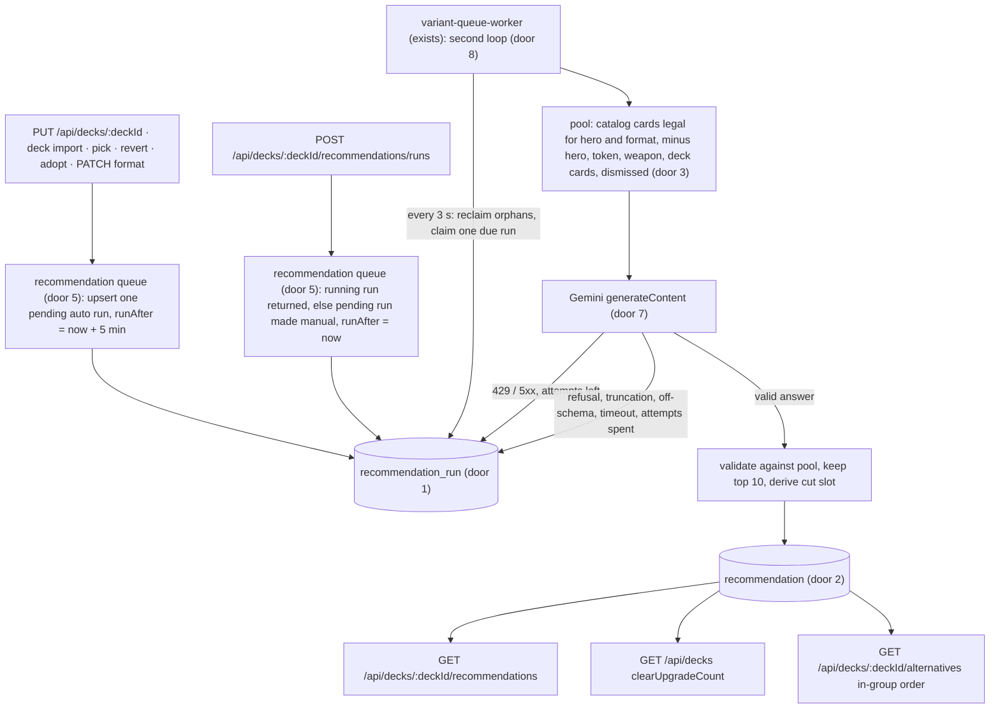
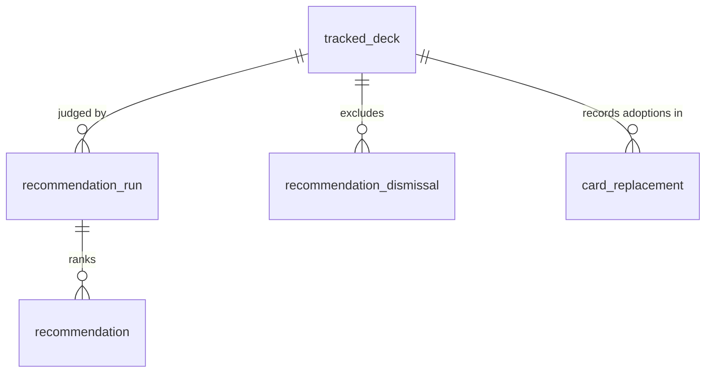

# Card recommendations

## Problem

The site tells the owner which cards a deck is missing, but never which cards would make a deck play better, whether or not anything is missing.
To find an upgrade he browses the library or Fabrary by hand, reads rules text and judges in his head whether a card works with the rest of the deck; nothing tells him when a card he already owns, or one the store has, would be a clear improvement.
The synergy spike measured that a language model can make that judgment on his decks: blind-judged, Gemini 3.8 Flash had 5, 7 and 10 of its top 10 accepted on his three decks, against 3, 4 and 4 for a keyword heuristic (AD-010).
No usage figure exists beyond that; the owner is the site's only user.

When this ships, every deck page has a recommendations panel listing up to 10 cards the model judged to fit the deck, each with one sentence of reason, whether the owner has it or what it costs, and the deck card it would replace.
A run happens on its own five minutes after the deck list stops changing, or at once from a Generate button; the home tile of a deck says when a clear upgrade is waiting.
A recommendation can be dismissed for good (with undo) or adopted, which swaps the cut card for it in the deck and can be undone like a picked alternative.
Card alternatives that the deck's latest run also recommends rise to the top of their group.

## Flow

Reuses the variant fetch queue's pattern (a Postgres job table claimed with `FOR UPDATE SKIP LOCKED` and drained by the long-lived `variant-queue-worker` process) instead of an in-process task, the `card_replacement` record with its lock, copy move, recompute and revert (AD-009) instead of a second deck-edit path, `findCardLegalityViolation` and `getCopyLimit` from the engine instead of the spike's copied predicate, `ShoppingLineService.priceCards` and `CollectionReadService.loadOwned` for price and ownership, and `OwnsTrackedDeckGuard` for deck scope.

1. a deck-list write -> `DecksService.updateComposition` (exists), `DecksImportService.run` (exists), `ReplacementsService.pick` and `.resolve('revert')` (exist), the adopt route (new), `DecksService.updateMeta` (exists) when the format changes -> inside that write's transaction, the recommendation queue (new service, no door - placement) runs one atomic upsert of a pending `auto` run (door 5); a `retired` deck gets none
2. Generate -> `POST /api/decks/:deckId/recommendations/runs` -> `OwnsTrackedDeckGuard` (exists) -> the queue returns the deck's running run if any, otherwise upserts the pending run as `manual` due now; out `202`
3. `variant-queue-worker` (exists) gains a second loop in the same process (door 8): every 3 s it reclaims orphaned runs, claims the oldest due pending run whose deck has no running run, and hands it to the recommendation runner (new, no door - placement)
4. the runner reads `tracked_deck` and `deck_card`, computes the deck fingerprint (door 6), builds the pool (door 3) and the prompt, and calls Gemini 3.8 Flash through a fetch client (new, door 7) with a 180 s abort
5. a valid answer is filtered against the pool, cut at 10, given a cut slot from `deck_card`, and stored as `recommendation` rows (door 2) with the run `done`, token usage and fingerprint, in one transaction; a retryable provider answer puts the run back to `pending` with a later `runAfter`; anything else ends it `failed` with a code
6. `GET /api/decks/:deckId/recommendations` -> recommendations service (new, no door - placement) reads the latest `done` run, drops dismissed cards and cards now in the deck, joins ownership through `CollectionReadService.loadOwned` (exists) and prices through `ShoppingLineService.priceCards` (exists), and compares the run's fingerprint with the deck's current one for `stale`
7. Dismiss and undo -> `POST /api/decks/:deckId/recommendations/dismissals`, `DELETE .../dismissals/:cardIdentifier` -> `recommendation_dismissal` (door 3)
8. Adopt -> `POST /api/decks/:deckId/recommendations/:recommendationId/adopt` -> `ReplacementsService` (exists) under the same `tracked_deck` lock: moves the cut card's copies to the recommended card, inserts `card_replacement` with `pickedFrom = 'recommendation'` (door 4), recomputes readiness, and enqueues an auto run (hop 1); out `201`
9. `GET /api/decks` -> `DecksService.listForUser` (exists) adds `clearUpgradeCount` per deck from the same read as hop 6
10. `GET /api/decks/:deckId/alternatives` -> `AlternativesService` (exists) reorders each group's cards after the engine's 10-per-group cut, putting the deck's latest-run cards first by rank
11. web: a recommendations panel (new component, no door - placement) on the deck page, polling every 10 s while a run is pending or running; `DeckTile` (exists) shows the clear-upgrade marker; the active-replacement mark (exists) covers an adopted card's Undo

## Impact

| Front | What changes |
| --- | --- |
| domain | new term: `recommendation run` - one model judgment of one deck, queued `auto` or `manual`, ending `done` or `failed`; lives in `apps/api/src/recommendations` |
| domain | new term: `recommendation` - one ranked card from a done run, labelled `clear_upgrade` or `consider`, with an optional suggested cut |
| domain | new term: `dismissal` - a (deck, card) the owner never wants recommended again, until undone |
| domain | existing term: `pickedFrom` gains `recommendation`; `buildReplacementViews` branches on it to never raise the "you now have the original" prompt; the alternatives pick DTO keeps its five group names, so the pick route still refuses it |
| domain | existing term: adopted - not stored; a recommendation counts as adopted while its card is in the deck list, so undoing an adoption brings it back |
| deck-list writers | composition save, deck import (each new deck), pick, revert, adopt and a format change now also insert or update a `recommendation_run` row inside their transaction; keep, mark-owned and every collection write do not |
| worker | `variant-queue-worker` runs two loops; the variant drain and URL sync keep their own loop and cadence |
| alternatives | the order inside a group changes for decks with a done run; membership and group order do not |
| API response | `GET /api/decks` gains `clearUpgradeCount`; consumed only by this SPA, deployed with it |
| error catalog | adopt reuses `REPLACEMENT_ILLEGAL` and `NOTHING_TO_REPLACE`; run failure codes (`NO_API_KEY`, `RATE_LIMITED`, `PROVIDER_UNAVAILABLE`, `PROVIDER_ERROR`, `MODEL_TIMEOUT`, `MODEL_REFUSED`, `MODEL_TRUNCATED`, `MODEL_OFF_SCHEMA`, `DECK_INVALID`, `DECK_RETIRED`, `WORKER_LOST`, `SUPERSEDED`) get panel copy in pt-BR and en-US (AD-003) |
| configuration | optional `GEMINI_API_KEY` in the environment schema; read only by the runner; `.env.example` gets a commented entry with no value |
| stored data | three new tables and a replaced CHECK on `card_replacement."pickedFrom"`; no backfill - no deck has runs and no row uses the new origin |
| prior decisions | conforms to AD-003 (codes), AD-008 (atomic upsert), AD-009 (adopt is a deck change), AD-010 (the model); records the second job kind and the direct Gemini dependency as AD-011 |

## Relations

One-way constraints: at most one `pending` run per deck and at most one `running` run per deck (door 5); `trigger` limited to two values and `status` to four (door 1); `rank` unique within a run and `strength` limited to two values (door 2); one dismissal per (deck, card) (door 3); `pickedFrom` limited to six values (door 4); every new row deleted only by cascade from `tracked_deck`.
No columns and no types here.

## Surface

Only routes this adds or whose signature changes.

| Route | In | Out | Status |
| --- | --- | --- | --- |
| `POST /api/decks/:deckId/recommendations/runs` | `deckId` in the path | `run` of `id`, `status`, `trigger`, `createdAt` | `202`, `400`, `401`, `404`, `429` |
| `GET /api/decks/:deckId/recommendations` | `deckId` in the path | `run` of `id`, `trigger`, `finishedAt`, `stale` or null · `pending` · `failure` of `code`, `finishedAt` or null · `recommendations[]` of `id`, `rank`, `cardIdentifier`, `name`, `pitch`, `imageUrl`, `slot` (added during build: the slot an adoption lands in, which the panel's cut selector filters on), `strength`, `reason`, `cutCardIdentifier`, `cutName`, `cutSlot`, `freeCopies`, `priceCents`, `productUrl` | `200`, `400`, `401`, `404`, `429` |
| `POST /api/decks/:deckId/recommendations/dismissals` | `cardIdentifier` | `dismissal` of `cardIdentifier`, `createdAt` | `201`, `200`, `400`, `401`, `404`, `429` |
| `DELETE /api/decks/:deckId/recommendations/dismissals/:cardIdentifier` | path only | empty | `204`, `400`, `401`, `404`, `429` |
| `POST /api/decks/:deckId/recommendations/:recommendationId/adopt` | `cutCardIdentifier`, `cutSlot` | `replacement` (the shape the pick route returns) | `201`, `400`, `401`, `404`, `409`, `429` |
| `GET /api/decks` (changed) | unchanged | each `trackedDecks[]` item adds `clearUpgradeCount` | `200`, `401`, `429` |

## Landing

| One-way door | Literal shape | Alternative rejected |
| --- | --- | --- |
| 1. Run record | table `recommendation_run`: `id` uuid primary key; `trackedDeckId` int → `tracked_deck.id` `ON DELETE CASCADE`; `trigger varchar(16) NOT NULL CHECK (trigger IN ('auto','manual'))`; `status varchar(16) NOT NULL CHECK (status IN ('pending','running','done','failed'))`; `runAfter timestamptz NOT NULL`; `deckFingerprint varchar(64)` null; `model varchar(64)` null; `attempts int NOT NULL DEFAULT 0`; `inputTokens`, `outputTokens` int null (`outputTokens` = `candidatesTokenCount` + `thoughtsTokenCount`); `error varchar(32)` null holding a failure code; `createdAt timestamptz NOT NULL DEFAULT now()`, `startedAt`, `finishedAt`, `claimedAt` timestamptz null; index `("status", "runAfter")`, index `("trackedDeckId", "status")` | a `kind` column on `variant_fetch_job` - its rows carry a user, a store, per-card progress counters and a 2-minute recent-jobs listing the variant queue UI reads, so a second kind changes that screen; a Postgres enum for `trigger`/`status` - adding a value means dropping the type, as `swap_suggestion.status` records |
| 2. Recommendation rows | table `recommendation`: `id` uuid primary key; `runId` uuid → `recommendation_run.id` `ON DELETE CASCADE`; `cardIdentifier varchar(128) NOT NULL`; `rank int NOT NULL CHECK (rank BETWEEN 1 AND 10)`, unique `("runId", "rank")`; `strength varchar(16) NOT NULL CHECK (strength IN ('clear_upgrade','consider'))`; `cutCardIdentifier varchar(128)` null; `cutSlot varchar(64)` null; `reason text NOT NULL` | a jsonb array on the run - Adopt addresses one recommendation by id and the alternatives order joins on card identifier, both of which a row serves and an array does not |
| 3. Dismissal record and the pool it shapes | table `recommendation_dismissal`: `id` uuid primary key; `trackedDeckId` int → `tracked_deck.id` `ON DELETE CASCADE`; `cardIdentifier varchar(128) NOT NULL`; `createdAt timestamptz NOT NULL DEFAULT now()`; unique `("trackedDeckId", "cardIdentifier")`; undo deletes the row. The pool sent to the model is every catalog card with no `findCardLegalityViolation` for the deck's hero and format, minus Hero, Token and Weapon cards, cards in the deck in any slot, and dismissed cards | a `dismissed` flag on `recommendation` rows - the flag dies with its run, so the next run would propose the card again (Key decision 5); keeping weapons in the pool - an adopted weapon would land in the `weapon` slot, which replacements refuse (`NON_REPLACEABLE_SLOTS`), so every weapon recommendation would be unadoptable |
| 4. Adoption origin | `card_replacement` CHECK `CHK_card_replacement_picked_from_valid` becomes `"pickedFrom" IN ('very_close','close','other_pitch','generic','search','recommendation')`, entity and migration; `PickReplacementDto` keeps `@IsIn` over the five group names | a separate adoption table - an adoption must ride the replacement lifecycle (revert, stand-in protection, `removed` on a save); widening the pick DTO - the alternatives route would accept `recommendation` and the alternatives Success measure could no longer tell its picks apart |
| 5. One pending run per deck, coalesced atomically | partial unique indexes `IDX_recommendation_run_one_pending` on `("trackedDeckId") WHERE status = 'pending'` and `IDX_recommendation_run_one_running` on `("trackedDeckId") WHERE status = 'running'`; enqueue is one `INSERT … ON CONFLICT ("trackedDeckId") WHERE status = 'pending' DO UPDATE` that sets an auto run's `runAfter` to now + 5 min, leaves a manual run's `runAfter` alone on an auto change, and turns any pending run into `manual` due now on Generate; the claim takes the oldest due pending run whose deck has no running run, `FOR UPDATE SKIP LOCKED` | read-then-update - loses a push-back under concurrency (AD-008); "at most one pending or running per deck" from the design's Key decision 2 - contradicts its own state table, where a change during a running run leaves a pending auto run behind it |
| 6. Deck fingerprint | `deckFingerprint` = lowercase hex SHA-256 of `heroIdentifier`, `format` and every `deck_card` (slot, card, summed quantity) sorted by slot then card, joined in one canonical string; `stale` = latest done run's fingerprint differs from the deck's current one | comparing `tracked_deck.updatedAt` - it moves on name, notes and tag edits, and a pick does not touch it |
| 7. Provider contract | `POST https://generativelanguage.googleapis.com/v1beta/models/gemini-3.8-flash:generateContent`, header `x-goog-api-key: $GEMINI_API_KEY`, body `systemInstruction`, `contents`, `generationConfig` of `responseMimeType: 'application/json'`, `responseJsonSchema` (an object with `recommendations[]` of `card`, `strength` enum, `cut` - empty string for none - and `reason`, all required), `maxOutputTokens: 32000`; plain `fetch`, no SDK; 25 cards asked, 10 kept | the Interactions API (`POST /v1beta/interactions`, `response_format`) the structured-output guide now shows - the `generateContent` reference documents every field this reads (`finishReason`, `promptFeedback.blockReason`, `usageMetadata`) and carries no deprecation mark, while the Interactions shape would be a second contract nobody here has exercised; the `@google/genai` SDK - a new dependency for one call; OpenRouter, which the spike used - AD-010 left it open and the design chose Google directly, free tier first |
| 8. Second worker loop | `variant-queue-worker`'s `main()` starts the recommendation drain as its own `while (true)` loop beside the existing one, in the same process and service (`scrapper-worker`) | the same sequential loop - a model call of a minute or more would stall variant fetches and owner-triggered URL sync; a separate Railway service - a second deploy unit and environment for one job kind |

- Nothing else in this change is hard to reverse

## Criteria

### S1: Queued, coalesced runs drained by the worker (P1)

A deck-list change or Generate queues a run; the worker judges the deck and stores ranked cards.

**Acceptance Criteria**

1. WHEN a deck-list writer commits for a deck whose status is not `retired` THEN the API SHALL leave exactly one `pending` run for that deck, with `trigger: auto` and `runAfter` 5 minutes after the commit when no pending run existed or the pending one was `auto`
2. WHEN a deck-list writer commits while the deck's pending run is `manual` THEN the API SHALL leave that run `manual` with its `runAfter` unchanged
3. The deck-list writers SHALL be exactly: the composition save, the deck import (once per new deck), a pick, a revert, an adopt, and a metadata update whose `format` differs from the stored one
4. WHEN a keep, a mark-owned, a collection write, a scratch deck create, or a metadata update that changes no format commits THEN the API SHALL create or update no `recommendation_run` row
5. IF the deck's status is `retired` when a deck-list writer commits THEN the API SHALL create or update no `recommendation_run` row
6. WHEN two deck-list writes for the same deck commit concurrently THEN the deck SHALL hold exactly one `pending` run afterwards
7. WHEN the owner sends `POST /api/decks/:deckId/recommendations/runs` and the deck has no running run THEN the API SHALL leave one `pending` run with `trigger: manual` and `runAfter` at most 1 second after the request, reusing the pending run when one existed, and return `202` with that run's `id`, `status`, `trigger` and `createdAt`
8. IF the deck has a running run when Generate is sent THEN the API SHALL return `202` with the running run and create or update no row
9. IF the deck does not exist or belongs to another user THEN Generate SHALL return `404`
10. The worker SHALL claim a pending run only when its `runAfter` has passed and its deck has no running run, setting `status: running`, `startedAt`, `claimedAt` and `attempts` plus 1
11. WHEN the worker claims an `auto` run of a deck whose status is now `retired` THEN it SHALL end the run `failed` with code `DECK_RETIRED` and call no model
12. IF the deck has no hero card in the catalog THEN the worker SHALL end the run `failed` with code `DECK_INVALID` and call no model
13. The pool sent to the model SHALL hold every catalog card with no per-card legality violation for the deck's hero and format, except Hero, Token and Weapon cards, cards in the deck in any slot, and the deck's dismissed cards
14. The prompt SHALL list the hero, the format, every deck card outside the hero slot with its quantity and slot, and every pool card with its identifier, name, type line and rules text, and SHALL ask for 25 ranked cards, each with a strength, a suggested cut from the deck or none, and one sentence of reason
15. IF `GEMINI_API_KEY` is absent or empty THEN the worker SHALL end the run `failed` with code `NO_API_KEY` and send no request
16. WHEN the model answers with `finishReason: STOP` and JSON matching the schema THEN the worker SHALL store the answer's entries in order as `recommendation` rows with ranks 1 to at most 10, dropping an entry whose card is not in the pool, repeats an earlier entry, or has a strength outside `clear_upgrade` and `consider`, and SHALL end the run `done` with `deckFingerprint`, `model: gemini-3.8-flash`, `inputTokens` equal to `promptTokenCount` and `outputTokens` equal to `candidatesTokenCount` plus `thoughtsTokenCount`
17. WHEN a stored entry's cut is a card in the deck in the slot the recommended card would take (`equipment` for an Equipment card, `mainboard` otherwise) THEN the worker SHALL store it with that slot, and otherwise SHALL store `cutCardIdentifier` and `cutSlot` as null
18. WHEN every entry is dropped THEN the worker SHALL end the run `done` with no `recommendation` rows
19. IF the provider answers `429` THEN the worker SHALL put the run back to `pending` with `runAfter` 60 seconds times 2 to the power of (attempts minus 1) after now, until the third attempt, which SHALL end the run `failed` with code `RATE_LIMITED`
20. IF the provider answers `500`, `503` or `504` THEN the worker SHALL retry as in AC 19, ending the third attempt `failed` with code `PROVIDER_UNAVAILABLE`
21. IF the provider answers any other non-2xx status, or the request fails before a response THEN the worker SHALL end the run `failed` with code `PROVIDER_ERROR`
22. IF the provider has not answered 180 seconds after the request was sent THEN the worker SHALL abort it and end the run `failed` with code `MODEL_TIMEOUT`
23. IF the answer carries `promptFeedback.blockReason`, or a `finishReason` of `SAFETY`, `RECITATION`, `LANGUAGE`, `OTHER`, `BLOCKLIST`, `PROHIBITED_CONTENT`, `FINISH_REASON_UNSPECIFIED` or any value not named here THEN the worker SHALL end the run `failed` with code `MODEL_REFUSED`
24. IF the answer's `finishReason` is `MAX_TOKENS` THEN the worker SHALL end the run `failed` with code `MODEL_TRUNCATED`
25. IF the answer's text is not JSON with a `recommendations` array THEN the worker SHALL end the run `failed` with code `MODEL_OFF_SCHEMA`
26. WHEN a run ends `failed` THEN the deck's earlier `done` runs and their recommendations SHALL stay unchanged
27. WHEN a running run has been claimed for more than 10 minutes THEN the worker SHALL put it back to `pending`, or end it `failed` with code `WORKER_LOST` when the deck already holds a pending run
28. IF a retry of AC 19 or AC 20 finds the deck already holding a pending run THEN the worker SHALL end the retried run `failed` with code `SUPERSEDED` and leave the pending run's `runAfter` at the later of its own and the retry's
29. The worker SHALL drain recommendation runs in a loop of its own, so a run in progress never delays the variant fetch loop
30. The worker SHALL log `recommendations.run.claimed`, `.done` (with `trackedDeckId`, `runId`, kept and dropped counts, clear-upgrade count, tokens and duration in ms), `.retry` (with status and next `runAfter`) and `.failed` (with code and attempts), and the API SHALL log `recommendations.enqueued` with `trackedDeckId` and `trigger`

**Independent test:** in an e2e test, save a deck composition and read one pending auto run; run the drain once with a stubbed Gemini fetch and read ranked `recommendation` rows.

### S2: The recommendations panel (P1)

The deck page shows the latest run's cards, a Generate button and whether the list is stale.

**Acceptance Criteria**

31. WHEN the owner requests `GET /api/decks/:deckId/recommendations` THEN the API SHALL return `200` with `run` set to the deck's latest `done` run (`id`, `trigger`, `finishedAt`, `stale`) or null, `pending` true while the deck has a pending or running run, and `failure` set to the code and `finishedAt` of the deck's latest finished run when it is `failed` and newer than `run`, otherwise null
32. The API SHALL set `stale` to true when the run's `deckFingerprint` differs from the deck's current fingerprint, and false otherwise
33. The API SHALL list the run's recommendations except those whose card is dismissed for the deck or is in the deck list in any slot, `clear_upgrade` first, then by rank
34. The API SHALL send for each recommendation `freeCopies` as owned copies across active sources minus its copies in the deck, never below 0, and `priceCents` and `productUrl` as `ShoppingLineService.priceCards` gives them at quantity 1, both null when the store has no stock
35. The API SHALL send `cutCardIdentifier`, `cutName` and `cutSlot` only while that card is still in the deck in that slot, and null otherwise
36. IF the deck does not exist or belongs to another user THEN the read SHALL return `404`
37. WHILE the deck has no done run and no pending run the panel SHALL show the empty state with a Generate button
38. WHILE `pending` is true the panel SHALL show a "generating" state, keep any listed cards, and refetch every 10 seconds, stopping when `pending` turns false
39. WHILE a done run is listed the panel SHALL show each card's art, name, reason, the "owned" mark when `freeCopies` is at least 1 or else the price with a store link or an "out of stock" mark, and "replaces <cut name>" when a cut is present
40. WHILE `run.stale` is true the panel SHALL show a stale notice next to the Generate button
41. WHILE `failure` is not null and `pending` is false the panel SHALL show the localized message for its code and the Generate button, keeping any listed cards
42. WHEN a done run lists no recommendations THEN the panel SHALL show the "no upgrades found" message and the Generate button
43. WHEN the owner presses Generate THEN the web app SHALL send the Generate request and show the "generating" state
44. WHILE the deck is incomplete the panel SHALL sit in the deck page's action-panel row, in the swaps column under the swaps panel; WHILE the deck is complete it SHALL sit alone in that row
45. The panel, its states and every failure code SHALL have copy in pt-BR and en-US

**Independent test:** in Playwright, open a deck with a seeded done run and see the list; press Generate on an empty deck and see the "generating" state.

### S3: Clear upgrade notice (P2)

The home tile says when a clear upgrade waits; the panel puts clear upgrades first, highlighted.

**Acceptance Criteria**

46. The API SHALL send `clearUpgradeCount` on each `GET /api/decks` item as the number of `clear_upgrade` recommendations the deck's `GET .../recommendations` read would list (AC 33), and 0 for a deck with status `retired` or no done run
47. WHILE `clearUpgradeCount` is above 0 the home deck tile SHALL show "N upgrades suggested" with N equal to it, and SHALL show nothing for 0
48. WHILE a listed recommendation is `clear_upgrade` the panel SHALL mark it with the clear-upgrade badge; `consider` rows SHALL carry no badge

**Independent test:** seed a done run with one clear upgrade, load home and see the marker; dismiss it and see the marker go.

### S4: Dismiss (P2)

The owner dismisses a recommendation for good, and can undo.

**Acceptance Criteria**

49. WHEN the owner sends `POST /api/decks/:deckId/recommendations/dismissals` with a catalog card THEN the API SHALL insert one `recommendation_dismissal` for (deck, card) and return `201` with `cardIdentifier` and `createdAt`
50. IF that (deck, card) is already dismissed THEN the API SHALL insert nothing and return `200` with the existing dismissal
51. IF `cardIdentifier` is missing, longer than 128 characters or not in the catalog THEN the API SHALL return `400` and insert nothing
52. WHEN the owner sends `DELETE /api/decks/:deckId/recommendations/dismissals/:cardIdentifier` THEN the API SHALL delete the (deck, card) dismissal if it exists and return `204` either way
53. IF the deck does not exist or belongs to another user THEN both dismissal routes SHALL return `404`
54. WHEN the owner taps Dismiss THEN the web app SHALL send the dismissal, remove the card from the panel, and show a toast with an Undo action that sends the delete
55. The API SHALL log `recommendations.dismissed` and `recommendations.undismissed` with `trackedDeckId` and `cardIdentifier`

**Independent test:** dismiss a listed card through the API, read the panel (gone), queue a run and read the pool (absent), undo and read the panel (back).

### S5: Adopt (P1)

Adopting swaps a deck card for the recommended card, recorded as a replacement that undo reverts.

**Acceptance Criteria**

56. WHEN the owner sends `POST /api/decks/:deckId/recommendations/:recommendationId/adopt` with a cut card and slot holding `k` copies of it THEN the API SHALL, in one transaction holding the `tracked_deck` lock, move `q` = min(`k`, copy limit of the recommended card minus its copies already in the deck in any slot) copies from the cut card's row in that slot to the recommended card's row in that slot, insert a `card_replacement` with that quantity, `status: active` and `pickedFrom: recommendation`, recompute readiness, enqueue an auto run (AC 1), and return `201` with the replacement
57. IF `q` is 0 or below, the recommended card has a per-card legality violation for the deck, the cut slot is `hero` or `weapon`, the cut slot differs from the recommended card's slot (AC 17), or the cut card is the recommended card THEN the API SHALL return `409` with code `REPLACEMENT_ILLEGAL` and change no row
58. IF the cut card has no copies in that slot THEN the API SHALL return `409` with code `NOTHING_TO_REPLACE` and change no row
59. IF the recommendation does not exist or belongs to a run of another deck, or the deck does not exist or belongs to another user THEN the API SHALL return `404`
60. IF the body lacks a field, a field is longer than its column, or the cut card is not in the catalog THEN the API SHALL return `400` and change no row
61. WHEN an adoption is reverted through `POST /api/replacements/:id/revert` THEN the cut card's copies SHALL return as for a picked alternative (card-alternatives AC 44) and the recommendation SHALL be listed again
62. WHILE an adopted replacement is active the deck detail SHALL send it with `originalOwned: false` whatever the collection holds
63. WHEN an adoption commits THEN the API SHALL log `recommendations.adopted` with `trackedDeckId`, `recommendationId`, `rank`, `strength`, both card identifiers, `quantity` and whether the cut was the suggested one
64. WHEN the owner taps Adopt THEN the panel SHALL send the adoption with the cut chosen in the row's cut selector, defaulting to the suggested cut, listing only deck cards in the recommended card's slot, and SHALL refresh the deck detail, swaps, decks list and recommendations
65. IF an adoption returns `409` THEN the panel SHALL show the localized message for its code
66. The alternatives pick route SHALL keep refusing `pickedFrom: recommendation` with `400`

**Independent test:** in an e2e test, adopt a stored recommendation and read `deck_card`, `card_replacement` and the readiness snapshot; revert and read them again.

### S6: Alternatives order (P3)

Alternatives the deck's latest run recommends rise inside their group.

**Acceptance Criteria**

67. WHEN the deck has a `done` run, stale or not THEN the alternatives route SHALL order each group's cards with the cards the deck's latest done run recommends first, by that run's rank, and the rest after them in their existing order
68. WHEN the deck has no `done` run THEN the alternatives route SHALL return each group exactly as before this change
69. The alternatives route SHALL list the same cards in each group, and the same groups, with or without a done run

**Independent test:** in an e2e test, list alternatives, store a done run ranking the group's last card first, and list again.

## Out of scope

| Excluded | Why |
| --- | --- |
| Recommendations across decks or for a new deck | per deck only (design Boundary) |
| A second model or a provider fallback | one model, per AD-010 |
| Validating the clear-upgrade label or the cut by another judging round | measured through the adoption and dismissal records (design Success) |
| Recommending weapons | an adopted weapon would land in a slot replacements refuse; Landing door 3 |
| Changing which cards count toward readiness | adoption is an ordinary deck change |
| Google's Batch API | wins only if runs stop being wanted within minutes |
| More than one store | only Cúpula DT exists |
| Showing run history or token spend in the UI | the run rows and the logs carry it; no screen asks for it |

## Assumptions

| Assumption | Chosen default | Rationale | Confirmed? |
| --- | --- | --- | --- |
| Profile | `standard` | the last two features ran at `standard`; the repo declares no profile, which would mean `light`; the owner was away when this was written | n |
| Format change as a trigger | a `PATCH` that changes `format` enqueues an auto run (AC 3) | the fingerprint includes the format, so the change already makes the run stale; enqueueing keeps "stale" and "a run is coming" in step | n |
| Panel on a complete deck | alone in the action-panel row (AC 44) | the design places it under the swaps panel, which a complete deck does not render, while the Problem wants it whether or not anything is missing | n |
| Retired deck with a queued auto run | the claim ends it `failed`, code `DECK_RETIRED` (AC 11) | the status can change after enqueue; a visible code beats a run that waits forever | n |
| 5xx from the provider | retried like a 429, at most 3 attempts (AC 20) | the design names only the rate limit; Google's error table recommends backoff for `503` and `500` alike | n |
| Cards asked of the model | 25, 10 kept (AC 14, AC 16) | the spike's measured setup asked for 25 and scored the top 10; validation drops some | n |
| Price quantity | 1 copy (AC 34) | a recommendation has no single "needed" count; the unit price answers "what does it cost" | n |
| Dismissed cards and the alternatives order | a dismissed card still rises among alternatives when the latest run has it (AC 67) | the design's rule reads "alternatives present in the run"; a dismissal is about recommendations | n |
| Confirmation before adopt or dismiss | none | both are undone in one tap | n |
| Generate rate limit | 10 requests per minute per client on `POST .../recommendations/runs`, on top of the one-pending-run coalescing (added during build) | a background security review flagged Generate as a way to repeat paid model calls; coalescing already bounds one deck to one call at a time, the limit bounds the number of decks a client can trigger | n |
| Timeout and orphan window | 180 s abort, 10 min reclaim (AC 22, AC 27) | the reclaim must sit well above the abort or a slow call is run twice | n |

**Open questions:**

| # | Kind | Question | Until answered |
| --- | --- | --- | --- |
| 1 | blocks go-live | `GEMINI_API_KEY` must be set on the `scrapper-worker` service | every run ends `failed` with `NO_API_KEY` (AC 15); nothing else changes |
| 2 | blocks go-live | the migration must run on production before the worker drains runs | the API and worker need the three tables |
| 3 | open | Does Gemini 3.8 Flash on the free tier accept this request shape and pool size? No key was available while building | the client is proven against a stubbed `fetch` that follows the documented shape; the first real run is the proof |
| 4 | open | Provider default (design open default): Google directly on the free tier | AC 15 to AC 25 assume Google's API; a switch to OpenRouter replaces the client and door 7 |

## Observable

| Surface | Decision | Landing |
| --- | --- | --- |
| screen: recommendations panel | empty state | AC 37, AC 42 |
| screen: recommendations panel | loading state | AC 38 |
| screen: recommendations panel | error state | AC 41, AC 65 |
| screen: recommendations panel | unauthorised | existing - the `_auth` layout redirects to sign-in, and another user's deck is `404` (AC 36) |
| screen: recommendations panel | density and ordering | AC 33, AC 48 - at most 10 rows, clear upgrades first |
| screen: recommendations panel | destructive action confirms | n/a - dismiss is undone from its toast, adopt from the deck list |
| screen: home deck tile | empty state | AC 47 - no marker at 0 |
| screen: home deck tile | error state | existing - the tile renders from `GET /api/decks`, whose failure the home page already handles |
| copy: panel, marker, failure codes | tone and locales | AC 45 |
| copy: failure message | what the reader does next | AC 41 - press Generate |
| collection: recommendation list | grouping, ordering, duplicates | AC 16 (duplicates dropped), AC 33 (order) |
| collection: recommendation list | the exception that does not fit | AC 18, AC 42 - a run with nothing kept |
| API `POST .../recommendations/runs` | response shape and codes | AC 7, AC 8, AC 9 |
| API `GET .../recommendations` | response shape and codes | AC 31 to AC 36 |
| API dismissal routes | response shape and codes | AC 49 to AC 53 |
| API adopt route | response shape and codes | AC 56 to AC 60 |
| API `GET /api/decks` | added field | AC 46 |
| all new `/api/*` routes | who may call it | existing - global `JwtAuthGuard` and `OwnsTrackedDeckGuard` |
| all new `/api/*` routes | versioning | n/a - consumed only by this web app, deployed in the same Railway service |
| all new `/api/*` routes | rate limits | existing - global throttler, 120 requests/min per IP; the panel polls once per 10 s only while a run is pending |
| worker loop | output and failure | AC 30 - one log line per transition; a thrown error is logged and the loop continues, as the variant loop does |

## Sources

- `.design/card-recommendations.md` - the confirmed design: Key decisions 1-7, slice states, table shapes and the six defaults
- `.specs/STATE.md` AD-003, AD-008, AD-009, AD-010 - error codes, atomic upserts, picks as deck changes, the model
- https://ai.google.dev/api/generate-content and https://ai.google.dev/gemini-api/docs/api-errors - the request and response fields and the status codes this reads (read 2026-10-06)
