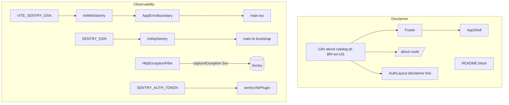

# Pre-Launch Hardening Design

**Spec**: `.specs/features/pre-launch-hardening/spec.md`
**Status**: Draft

---

## Architecture Overview

Two independent workstreams, no shared code:

1. **Disclaimer** — pure presentation + i18n. New `about` locale catalog feeds a persistent `Footer` (mounted in the authenticated `AppShell`), a disclaimer line in the anon `AuthLayout`, and a public self-contained `/about` route. Plus a static block in `README.md`.
2. **Observability (Sentry)** — env-gated SDK init on both apps. Web: `initWebSentry()` + a top-level `AppErrorBoundary` (also the app's first React error boundary). Api: `initApiSentry()` in bootstrap + `Sentry.captureException` inside the existing global `HttpExceptionFilter`, on 5xx/non-HTTP only. Sourcemaps: web uploads via `@sentry/vite-plugin` (build-token-gated); api emits `tsc` sourcemaps consumed at runtime via `--enable-source-maps`.

---

## Code Reuse Analysis

### Existing Components to Leverage

| Component | Location | How to Use |
| --------- | -------- | ---------- |
| `AppShell` | `apps/web/src/components/shell/AppShell.tsx` | Mount `<Footer/>` after `<main>` |
| `AuthLayout` | `apps/web/src/components/auth-layout/AuthLayout.tsx` | Add persistent disclaimer line at layout bottom (covers all 6 anon routes in one edit) |
| i18n catalog pattern | `apps/web/src/i18n/locales/{pt-BR,en-US}/*.ts` + `index.ts` | Add `about.ts` namespace, register in both index files; compile-time parity via `TTranslationResources` (`pt-BR/index.ts`) + `catalog-parity.spec.ts` |
| TanStack `<Link>` | used across `home/EducationalEmptyState` | `/about` navigation (SPA, per UXUI-12 precedent — no bare anchor) |
| File-based route | `apps/web/src/routes/*.tsx` | `about.tsx` auto-registered by `TanStackRouterVite`; falls into `__root.tsx` "plain outlet" bucket (no shell) — public |
| `HttpExceptionFilter` | `apps/api/src/common/filters/http-exception.filter.ts` | Add `Sentry.captureException` in the existing `!isHttp || status>=500` branch (same condition as `logger.error`) |
| `EnvDto` + `validateEnv` | `apps/api/src/config/env.dto.ts` | Add optional `SENTRY_DSN`; reuse the `@IsOptional() @IsString()` pattern (mirrors `FIRECRAWL_API_KEY`) |
| `ConfigService` | `apps/api` (global `ConfigModule`) | Read `SENTRY_DSN` in `bootstrap()` after `NestFactory.create` (`.env` already loaded by then) |
| Vite build sourcemaps | `apps/web/vite.config.ts` (`build.sourcemap: true`) | Already on; `@sentry/vite-plugin` consumes them |

### Integration Points

| System | Integration Method |
| ------ | ------------------ |
| i18next singleton | New `about` namespace nested under `translation` (per AD-001/AD-002) |
| `__root.tsx` route classifier | `/about` is neither an `AUTH_SHELL_PREFIX` nor `AUTH_PAGE_PREFIX` → renders bare (self-contained page) — matches intended public visibility |
| Railway start | `apps/api` `start` script gains `--enable-source-maps`; documented in `scripts/deploy-railway.md` (no `startCommand` in `railway.json` today) |

---

## Components

### `about` i18n catalog
- **Purpose**: Localized disclaimer + `/about` context copy + footer/link labels.
- **Location**: `apps/web/src/i18n/locales/pt-BR/about.ts`, `.../en-US/about.ts`; registered in both `locales/*/index.ts`.
- **Interfaces (keys)**: `about.disclaimer` (verbatim en; localized pt), `about.pageHeading`, `about.fanProjectBody`, `about.footerLinkLabel`, `about.backLink`.
- **Reuses**: existing catalog shape + parity enforcement.

### `Footer`
- **Purpose**: Persistent disclaimer + `/about` link in the authenticated shell.
- **Location**: `apps/web/src/components/shell/Footer.tsx` (+ `Footer.module.css`).
- **Interfaces**: `Footer(): React.ReactElement`.
- **Dependencies**: `useTranslation`, `<Link>`.
- **Reuses**: CSS-module convention; brand tokens (`--ra-fg-secondary`, small body text per `.impeccable.md`). Placed after `<main>` in `AppShell`; CSS adds bottom spacing so the fixed `BottomTabBar` (<960px) never overlaps it.

### `/about` route
- **Purpose**: Public page carrying the full disclaimer + fan-project context.
- **Location**: `apps/web/src/routes/about.tsx` (+ module css).
- **Interfaces**: TanStack route `component`.
- **Reuses**: self-contained layout (no shell); `<Link>` back to `/home`.

### `AuthLayout` disclaimer line (DISC-06)
- **Purpose**: Disclaimer/`/about` link on anon auth pages.
- **Location**: modify `apps/web/src/components/auth-layout/AuthLayout.tsx` (+ css).
- **Reuses**: renders unconditionally at layout bottom (independent of the optional `footer` prop).

### `initWebSentry`
- **Purpose**: Env-gated web Sentry init (errors-only, privacy-minimal).
- **Location**: `apps/web/src/observability/sentry.ts`.
- **Interfaces**: `initWebSentry(): void` — reads `import.meta.env.VITE_SENTRY_DSN`; returns early when empty; else `Sentry.init({ dsn, sendDefaultPii: false, tracesSampleRate: 0, integrations: [] })`.
- **Reuses**: `@sentry/react`.

### `AppErrorBoundary` + `RootErrorFallback`
- **Purpose**: Top-level React error boundary (app's first) with an on-brand fallback; captures to Sentry when initialized.
- **Location**: `apps/web/src/components/error/AppErrorBoundary.tsx`, `RootErrorFallback.tsx`.
- **Interfaces**: `AppErrorBoundary({ children }): React.ReactElement` wrapping `Sentry.ErrorBoundary` with `fallback={<RootErrorFallback/>}`.
- **Dependencies**: `@sentry/react` `ErrorBoundary` (renders fallback regardless of init; `captureException` no-ops without DSN).
- **Wiring**: `main.tsx` calls `initWebSentry()` before render and wraps `<RouterProvider>` in `<AppErrorBoundary>`.

### `sentryWebPlugins` (vite gating helper)
- **Purpose**: Return `[sentryVitePlugin(...)]` only when `SENTRY_AUTH_TOKEN` (+ org/project) is set, else `[]` — build never fails without the token.
- **Location**: small exported helper in `apps/web/vite.config.ts` (or `apps/web/sentry-vite.ts`) so the gate is unit-testable.
- **Reuses**: `@sentry/vite-plugin`; placed **after** other plugins per Sentry docs; sourcemaps deleted after upload (private).

### `initApiSentry`
- **Purpose**: Env-gated api Sentry init.
- **Location**: `apps/api/src/observability/sentry.ts`.
- **Interfaces**: `initApiSentry(dsn: string | undefined): boolean` — returns `false` and skips when empty; else `Sentry.init({ dsn, sendDefaultPii: false, tracesSampleRate: 0 })` and returns `true`.
- **Reuses**: `@sentry/node`.

### `HttpExceptionFilter` (modify)
- **Purpose**: Report server-side unhandled errors.
- **Change**: in the existing `if (!isHttp || status >= 500)` block, add `Sentry.captureException(exception)`. 4xx path unchanged (no capture).
- **Reuses**: existing filter + its exact severity condition.

### `EnvDto` (modify)
- **Change**: add `@IsOptional() @IsString() SENTRY_DSN?: string;`.

---

## Error Handling Strategy

| Error Scenario | Handling | User Impact |
| -------------- | -------- | ----------- |
| No DSN (dev/CI) | `initWebSentry`/`initApiSentry` return early; `captureException` no-ops | None — full no-op |
| Malformed DSN | SDK `init` handles internally; wrapped so boot never throws | None |
| React render crash | `AppErrorBoundary` renders `RootErrorFallback`; capture if initialized | Sees fallback UI, not blank screen |
| 4xx client error | Logged as before; **not** sent to Sentry | None (no noise) |
| Build without `SENTRY_AUTH_TOKEN` | vite plugin omitted | Build succeeds, no upload |

---

## Risks & Concerns

| Concern | Location | Impact | Mitigation |
| ------- | -------- | ------ | ---------- |
| Sentry SDK option names are version-sensitive (`filesToDeleteAfterUpload`, `ErrorBoundary` props, init keys) | new observability files | Wrong option → typecheck/test failure, not silent | Verify against the actually-installed SDK version at Execute; TDD + typecheck gate catches drift before commit (do not fabricate — pin versions on install) |
| Railway prod start command is not in the repo (`railway.json` has no `startCommand`) | `railway.json` | `--enable-source-maps` may not reach prod if the dashboard hardcodes `node dist/main.js` | Change `apps/api` `start` script + document the required Railway start command (`pnpm --filter @rathe-arsenal/api start`) in `scripts/deploy-railway.md` |
| Footer vs fixed `BottomTabBar` overlap (<960px) | `AppShell` / `Footer.module.css` | Footer hidden behind mobile tab bar | CSS bottom spacing on mobile breakpoint; asserted visually, guarded by existing touch-target/layout conventions |
| `import.meta.env` mocking in Vitest for `initWebSentry` test | web unit test | Test can't flip the DSN branch | Read DSN via a tiny indirection (arg or `import.meta.env` accessor) so both branches are unit-reachable |
| Disclaimer is verbatim legal text | catalog + README | A typo weakens the policy compliance | en-US string asserted **verbatim** by a unit test against the exact `ip-posture.md` line |

---

## Tech Decisions (only non-obvious ones)

| Decision | Choice | Rationale |
| -------- | ------ | --------- |
| Api Sentry package | `@sentry/node` + manual capture in existing filter | Avoids `@sentry/nestjs` `SentryGlobalFilter` colliding with the existing global `HttpExceptionFilter`; errors-only needs no auto-instrumentation/`instrument.ts` pre-import |
| Api sourcemaps | `tsc` emit + Node `--enable-source-maps` (no upload) | `nest build`/tsc output is not aggressively minified; runtime flag de-minifies captured stacks without a sentry-cli upload step |
| Web sourcemaps | `@sentry/vite-plugin` upload, token-gated, deleted after upload | Vite/esbuild minifies the client bundle materially; private upload keeps source off the public bundle |
| Error boundary | Add `AppErrorBoundary` regardless of Sentry | The app currently has **no** error boundary; a blank-screen-on-crash is a real UX gap independent of monitoring |
| Init timing (api) | In `bootstrap()` post-`NestFactory.create` | ConfigModule has loaded `.env` by then; errors-only + global process handlers don't need earlier init |

> No new project-level `AD-NNN` needed: the design conforms to active AD-001 (all user-facing strings via i18next) and AD-002 (pt-BR/en-US BCP-47 catalogs). Sentry api captures are server-internal (not user-facing) so no i18n applies.
