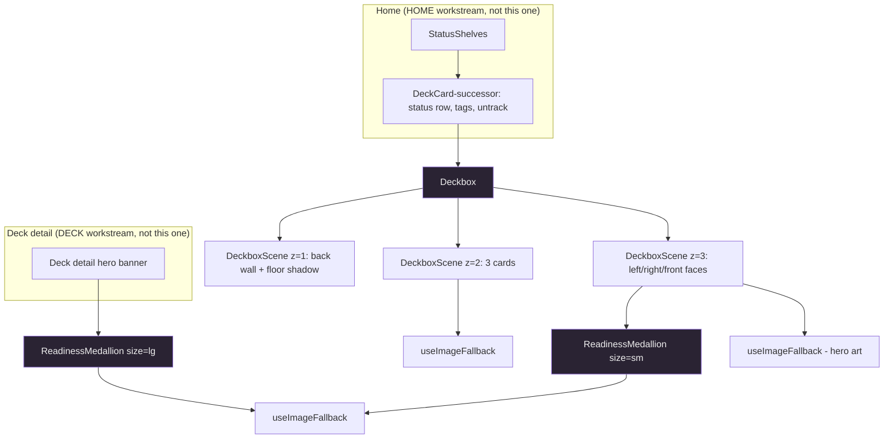

# Core Components Design — Readiness Medallion & Isometric Deckbox

**Spec**: `.specs/features/product-redesign/spec.md` — stories "P2: Readiness medallion" (CMP-01..05) and "P1: Isometric deckbox" (BOX-01..07), plus the two related edge cases ("no hero art" and "readiness exactly 85 or 100").
**Handoff**: `.specs/features/product-redesign/design-handoff.md` — sections "Componente-chave: Deckbox isométrica" and "Componente-chave: Medalhão de prontidão".
**Foundation contract**: `.specs/features/product-redesign/design/01-foundation.md` — every `--ra-*` token name used below is defined there. This document does not introduce new token names outside what foundation already defines, except the deckbox's non-semantic material colors (§5.4), which are intentionally local, not `--ra-*`.
**Status**: Draft

These are the two components every other redesigned screen composes: the deckbox is what Home renders per deck (and, per the handoff, what Sign-in reuses as a static brand mark), and the medallion is embedded inside the deckbox's front face and, at 90px, inside the deck-detail hero banner.

---

## 0. What this workstream supersedes

Both target surfaces already have a shipped, pre-redesign implementation. Superseding them is explicit, not incidental — a future session must not "fix" the old ones back in.

| Existing component | Location | Fate |
|---|---|---|
| `HeroLifeToken` | `apps/web/src/components/home/DeckCard.tsx:495-596` | **Replaced outright.** This is the "100% octagon" the spec's Problem Statement names as a defect to remove (three concentric octagons styled as a FaB life token). `ReadinessMedallion` at `size="sm"` is its direct replacement. |
| `DeckBoxVessel` / `DeckBoxCard` / `UntrackPin` / `HeroImage` (deckbox internals) | `apps/web/src/components/home/DeckCard.tsx:262-700` | **Box geometry replaced.** The SVG hinge-lid box (`DeckBoxVessel`) and its rectangular perspective illusion are replaced by `Deckbox`'s CSS 3D transform stack. `UntrackPin` is HOME-level chrome, not box geometry — it survives, wrapped around the new `Deckbox` by whichever component supersedes `DeckCard` itself (out of this workstream's scope; flagged for HOME). |
| `DeckCard` (outer article: status row, format pill, legality icon, tag chips) | `apps/web/src/components/home/DeckCard.tsx:99-259` | **Not superseded here.** This chrome is HOME-04/HOME-06 territory. `Deckbox` only owns the box + cards + front face + embedded medallion; HOME composes `Deckbox` plus its own status/tag/legality/untrack chrome around it, the same way `DeckCard` today composes `DeckBoxVessel` plus that chrome. |
| `ReadinessHero`'s `.ra-readiness-display` block | `apps/web/src/components/deck-detail/ReadinessHero.tsx:86-106` | **Superseded per DECK-01**, which puts a 90px `ReadinessMedallion` in the hero banner instead. Removing `ReadinessHero`'s own readiness markup is DECK workstream work — flagged, not done here. |
| `DeckboxDecoration` | `apps/web/src/components/shell/DeckboxDecoration.tsx` | **Not superseded here**, but worth flagging: AUTH-01 says Sign-in uses "the branded deckbox on the left" and the handoff is explicit that it's "a mesma [deckbox] do Home... sem cartas" — i.e. `Deckbox` itself, in a cardless/brand mode, not this flat oxblood SVG. That's AUTH's decision to make; see §5.6. |

---

## Architecture Overview



`ReadinessMedallion` has no dependency on `Deckbox` — it's a leaf component consumed independently by both call sites. `Deckbox` depends on `ReadinessMedallion` for its front face's 38px badge. Both depend on the new `useImageFallback` hook (§4).

---

## Code Reuse Analysis

### Existing components to leverage

| Component | Location | How to use |
|---|---|---|
| `setCssVar` | `apps/web/src/lib/dom/setCssVar.ts` | Both new components use this to drive their one continuous numeric value (`--ra-medallion-pct` on the medallion) through a `ref` + `useEffect`, exactly as `ReadinessHero.tsx:57` already does for `--pct`. Keeps `style={{}}` off the components (R3, `.impeccable.md` principle 3). |
| `useTranslation` / catalog convention | `apps/web/src/i18n/locales/{pt-BR,en-US}/*.ts` | New strings follow the existing per-domain flat-object files; see §7. |
| `outline: 2px solid var(--ra-accent); outline-offset: 3px` focus-visible convention | `apps/web/src/components/ui/Button/Button.module.css`, `apps/web/src/components/card-art/CardArt.module.css:38-41` | Applied to `Deckbox`'s root link (BOX-07). Note: `.impeccable.md` principle 5 currently states "2px gap" — the actual codebase convention (Button, CardArt) is 3px. This design follows the code, not the stale doc; foundation §6.2 is already rewriting `.impeccable.md`, so flag this line for that rewrite rather than fixing it here. |
| `min-block-size: 44px; min-inline-size: 44px` touch-target convention (R52) | `apps/web/src/components/ui/Button/Button.module.css:5,29-31` | The `Deckbox` root's clickable area is the whole 120×150 box face, far larger than 44px, so this is satisfied structurally — no explicit min-size rule needed on `Deckbox` itself. |
| `prefers-reduced-motion` component-level override pattern | `apps/web/src/components/home/DeckCard.module.css` (~729-760): pins transforms to their rest/idle values and swaps to opacity-only transitions, rather than relying on the global `* { animation-duration: 0.01ms }` collapse | Direct precedent for BOX-05 — see §5.3, this is not a novel pattern, it's the one already shipped for the component being replaced. |
| `design-guards.spec.ts` fs-read value-pinning pattern | `apps/web/src/styles/__tests__/design-guards.spec.ts` | Used for every literal CSS value this design cannot make DOM-observable in jsdom (geometry, keyframe percentages, filter strings) — see §6. |
| `role="meter"` + `aria-valuenow`/`aria-valuemin`/`aria-valuemax` a11y pattern | `HeroLifeToken`, `apps/web/src/components/home/DeckCard.tsx:519-527`, tested at `apps/web/src/components/home/__tests__/DeckCard.spec.tsx` (`getByRole('meter')`) | `ReadinessMedallion` reuses this exact pattern rather than inventing a new one — see §2.5. |
| `matchMedia` mock factory | `apps/web/src/components/shell/__tests__/AppShell.spec.tsx:101-106` | Reused verbatim for any test that needs to simulate `prefers-reduced-motion` — though see §6.3 for why BOX-05 itself is *not* tested this way. |

### Existing components explicitly NOT reused (with reasons)

| Candidate | Why not |
|---|---|
| `CardArt` (`apps/web/src/components/card-art/CardArt.tsx`) | See §3. Neither the deckbox's 3 mini-cards nor the medallion's hero art route through it. |
| `lightboxSourcesFor` (`apps/web/src/components/card-art/use-lightbox-sources.ts`) | Solves a different shape (`{ small, large, sources }`) than the deck-list payload (`{ small, smallSources }`, see `ITrackedDeckListItem.heroImageUrl` / `IRepresentativeCard.imageUrl` in `apps/web/src/api/decks.ts:106-165`). Not reused; `useImageFallback` (§4) is the shared piece instead, and it's new because none of the three existing hand-rolled cycling implementations (`CardArt`'s internal state, `DeckBoxCard`, `HeroImage`) were extracted as a hook. |

---

## 1. `ReadinessMedallion`

- **Purpose**: A single readiness dial — hero art disc + thin progress ring + number — that supersedes both the octagonal `HeroLifeToken` and, per DECK-01 (not this workstream), `ReadinessHero`'s bare percentage.
- **Location**: `apps/web/src/components/readiness-medallion/ReadinessMedallion.tsx` + `ReadinessMedallion.module.css`
- **Dependencies**: `setCssVar`, `useImageFallback` (§4), `react-i18next`.
- **Reuses**: the `role="meter"` a11y pattern from `HeroLifeToken` (not the component itself — that component is retired).

### 1.1 Props

```typescript
export type TMedallionSize = 'sm' | 'lg'; // sm = 38px (deckbox), lg = 90px (deck-detail hero)

export interface IReadinessMedallionProps {
  /** Readiness percentage, 0-100. Can carry decimals (engine output); the
   * ring sweep uses the exact value, the displayed number is rounded. */
  readonly pct: number;
  readonly size: TMedallionSize;
  /** Hero name — required at all sizes for the accessible label; only
   * rendered as visible text (uppercase sublabel) at size="lg". */
  readonly heroName: string;
  /** Same payload shape as `ITrackedDeckListItem.heroImageUrl` — passed
   * straight through from the deck list / deck detail API response. */
  readonly heroArt: { readonly small: string; readonly smallSources: readonly string[] } | null;
  readonly className?: string;
}
```

### 1.2 Ring color bands (CMP-02) — pure function, independently testable

```typescript
export type TMedallionBand = 'ready' | 'accent' | 'building';

export function resolveMedallionBand(pct: number): TMedallionBand {
  if (pct >= 100) return 'ready';
  if (pct >= 85) return 'accent';
  return 'building';
}
```

Boundaries are inclusive exactly as CMP-02 and the edge case ("readiness exactly 85 or 100") state: `>=100` → `ready`, `[85,100)` → `accent`, `<85` → `building`. Token mapping (per foundation §1.5): `ready` → `--ra-ready-high`, `accent` → `--ra-accent`, `building` → `--ra-status-building`.

### 1.3 Structure and the two dynamic values

The band is a discrete, small-cardinality value — expose it as `data-band="ready"|"accent"|"building"` on the root and let CSS Modules key off it with an attribute selector (`.ring[data-band="ready"] { --medallion-ring-color: var(--ra-ready-high); }`, etc.). This is directly assertable in jsdom without touching computed style.

The sweep is continuous — this is the one value that must be a CSS custom property set imperatively, following the exact precedent `ReadinessHero.tsx:57` already established for its bar fill:

```tsx
const ringRef = useRef<HTMLDivElement>(null);
useEffect(() => {
  setCssVar(ringRef.current, '--ra-medallion-pct', `${Math.max(0, Math.min(100, pct))}%`);
}, [pct]);
```

```css
.ring {
  background: conic-gradient(
    from -90deg,
    var(--medallion-ring-color) 0% var(--ra-medallion-pct),
    var(--ra-border-strong) var(--ra-medallion-pct) 100%
  );
  -webkit-mask: radial-gradient(farthest-side, transparent calc(100% - var(--medallion-ring-w)), #000 calc(100% - var(--medallion-ring-w)));
          mask: radial-gradient(farthest-side, transparent calc(100% - var(--medallion-ring-w)), #000 calc(100% - var(--medallion-ring-w)));
}
```

Reading the mask as the handoff writes it: `transparent` from the center out to `100% - ringWidth`, then `#000` from there to the edge. A `radial-gradient` mask makes transparent areas of the mask hide the layer and opaque (`#000`) areas show it — so this hides the disc's interior and reveals only the outer annulus, `ringWidth` px thick. That polarity is correct as written and matches the handoff's intent (a ring, not a filled disc).

`--medallion-ring-w` is set per size (`3px` at `sm`, `4px` at `lg`, per the handoff's "espessura do anel 4px" note for the 90px variant) and drives both the mask calc and the inner `inset` of the hero-art/darkening layers, so ring width has exactly one source of truth instead of being hand-tuned per size.

**What is not verified.** The handoff's own markup bakes `{pct/100}turn` as a literal per-render template value (it's a static prototype using inline styles). Substituting a `var()` for one of a `conic-gradient`'s stop percentages, and for a `radial-gradient` mask's `calc()` operand, is standard CSS custom-property token substitution (not a typed/`@property` feature) and this exact "numeric value via `--var()` into a positional CSS argument" pattern is already proven in this repo (`ReadinessHero.module.css:190`, `width: var(--pct, 0%)`) — but that precedent is for a plain `width`, not a gradient stop or a mask `calc()`. This design has **not** been rendered in an actual browser as part of this session. Recommend a self-run visual check (dev-browser screenshot at 0/50/85/100%, both sizes, per the project's automated/self-validation-first philosophy) before CMP-01/CMP-02 are marked verified — this is exactly the kind of check that belongs in Execute, not a reason to distrust the technique going in. Vendor-prefixed `-webkit-mask` is kept per the handoff literal; whether it's still required for the target browser matrix was not independently checked in this session.

### 1.4 Sizes (CMP-03)

| Size | Diameter | Ring width | Number | Extra content |
|---|---|---|---|---|
| `sm` | 38px | 3px | 12px, no `%` glyph, no sublabel | — |
| `lg` | 90px | 4px | 30px + `%` glyph at 14px | Hero name, uppercase, 7.5px, `#c6a678` |

`sm` renders **only** the number — no `%` glyph, no sublabel — per CMP-03's literal text. This negative half is the one worth pinning explicitly in tests (see §6.1, L-003): a mutant that always renders the sublabel would still pass a test that only checks `lg`'s presence.

### 1.5 Hero art fallback (CMP-04) and accessible text (CMP-05)

Hero art comes through `useImageFallback` (§4). When `heroArt` is `null` or every source in `smallSources` has errored, the medallion falls back to a gradient rather than breaking the ring or number. The handoff says "pitch-colored gradient" without saying which pitch — this component always represents a *hero*, and the handoff's own pitch table (§1.6 of the foundation doc) adds a `--ra-pitch-hero` token (`#5a8f6b`) specifically for this category. Using it here is a natural, low-risk first consumer of that token and is offered as this design's resolution, flagged as **discretionary** (foundation §9 item 6 leaves hero/weapon/equipment pitch consumption an open item for "a later phase" — this medallion is that phase's first concrete answer, not a mandate for `CardArt` or the decklist group headers, which stay undecided):

```css
.artFallback {
  background: radial-gradient(circle at 50% 30%, color-mix(in oklch, var(--ra-pitch-hero) 55%, white), var(--ra-pitch-hero) 78%);
}
```

CMP-05 ("expose the readiness percentage to assistive technology as text, not only as color") is satisfied independent of size or fallback state, via the `role="meter"` pattern (reused, not reinvented, from `HeroLifeToken`):

```tsx
<div
  role="meter"
  aria-label={t('common.readinessMedallionLabel')}    // static, e.g. "Hero readiness" — never interpolates the band
  aria-valuenow={Math.round(pct)}
  aria-valuemin={0}
  aria-valuemax={100}
  aria-valuetext={t('common.readinessValueText', { pct: Math.round(pct) })}  // "{{pct}}%"
  data-band={resolveMedallionBand(pct)}
  data-testid="readiness-medallion"
>
```

`aria-valuetext` is preferred over letting the screen reader compose a sentence from `aria-valuenow` alone, because it's what most screen readers announce verbatim for a meter/slider role, and it keeps the percent sign in the announcement regardless of size variant — so even `sm` (no visible `%` glyph) still reads as a percentage to assistive tech, closing exactly the gap CMP-05 names. `aria-label` is deliberately static (not `"{{tier}} readiness"` or similar) — `home.readinessMeterAriaLabel`'s existing pattern interpolates an untranslated `{{tier}}` token straight into a localized string (an English word landing inside a Portuguese sentence); this design does not repeat that pattern.

---

## 2. `Deckbox`

- **Purpose**: The three-scene isometric card box — the redesign's identity element (BOX-01..07).
- **Location**: `apps/web/src/components/deckbox/Deckbox.tsx`, `apps/web/src/components/deckbox/DeckboxScene.tsx` (internal, not exported from the module's public surface), `apps/web/src/components/deckbox/Deckbox.module.css`
- **Dependencies**: `ReadinessMedallion` (§1), `useImageFallback` (§4), TanStack `Link`, `react-i18next`.
- **Reuses**: nothing structural from `DeckBoxVessel` (different geometry technique — CSS 3D transforms vs. hand-drawn SVG perspective) but the same `prefers-reduced-motion` override *strategy* as `DeckCard.module.css`.

### 2.1 Props

```typescript
export interface IDeckboxCardSlot {
  readonly cardIdentifier: string;
  readonly imageUrl: { readonly small: string; readonly smallSources: readonly string[] } | null;
}

export interface IDeckboxProps {
  readonly deckId: number;
  readonly deckName: string;
  readonly format: string;
  readonly status: TDeckStatus; // 'idea' | 'building' | 'ready' | 'active' | 'retired'
  readonly heroArt: { readonly small: string; readonly smallSources: readonly string[] } | null;
  /** Up to 3 representative cards. Ignored entirely when status === 'idea'
   * (BOX-03) — pass or omit, it makes no visual difference either way. */
  readonly cards: readonly (IDeckboxCardSlot | null)[];
  /** null renders the box without the embedded medallion (no snapshot yet) —
   * mirrors HeroLifeToken's existing `percent !== null` gating. */
  readonly readinessPct: number | null;
  readonly className?: string;
}
```

Deliberately **not** in this interface: `tags`, `legality`, untrack affordances, status *label* text. Those are HOME-level chrome composed around `Deckbox`, exactly as `DeckCard` today composes them around `DeckBoxVessel` (§0). `Deckbox` owns geometry, hover choreography, status-driven filters, and the embedded 38px medallion — nothing else.

### 2.2 Structure — the mechanism that prevents flattening

The handoff's "critical rule" is that the three scenes share the same `.ib2-box` transform. Concretely this means three **separate** DOM elements (siblings, at different `z-index`) each apply the *identical CSS class* — not one shared node, since a single shared box could not carry three different `z-index` values needed for the "cards read as inside the box" illusion. The risk the handoff is naming is a future edit collapsing that into one tree (e.g. "simplify" the DOM by nesting cards inside the front scene) — which would silently break the z-index ordering that makes the illusion work at all.

The mechanism against that: one internal primitive is the *only* place that emits `.ib2-scene > .ib2-box`, and every scene is a call to it. It is impossible to add a fourth "scene" or merge two scenes without going through this component, and its type signature makes the z-index an explicit, required argument rather than an ambient CSS class someone can forget:

```tsx
// DeckboxScene.tsx — internal, not exported from the module's index
interface IDeckboxSceneProps {
  readonly zIndex: 1 | 2 | 3;
  readonly pointerEventsNone?: boolean; // true for the front scene (BOX-01)
  readonly className?: string; // e.g. styles.backScene, for the ::before floor shadow
  readonly children: React.ReactNode;
}

function DeckboxScene({ zIndex, pointerEventsNone, className, children }: IDeckboxSceneProps): React.ReactElement {
  return (
    <div
      className={[styles.scene, styles[`scene--z${zIndex}`], className].filter(Boolean).join(' ')}
      data-scene-z={zIndex}
    >
      <div className={styles.box}>{children}</div>
    </div>
  );
}
```

`zIndex` maps to a modifier class (`styles[`scene--z${zIndex}`]`, which is where the actual `z-index: 1/2/3;` CSS rule lives) rather than an inline `z-index` style, keeping the "CSS Modules only, zero `style={{}}`" rule (§0 table, `.impeccable.md` principle 3) intact. `data-scene-z` is derived from the same `zIndex` prop that produces the class name, so the two can't drift apart — a test asserting `data-scene-z="2"` on an element is asserting the same source value that put `scene--z2` in its class list, not two independently-settable facts (see §6.2).

`Deckbox.tsx` then reads as three calls, in this exact order, matching the handoff's DOM order (back, cards, front):

```tsx
<div className={styles.deckbox} data-status={status} data-testid="deckbox">
  <DeckboxScene zIndex={1} className={styles.backScene}>
    <DeckboxFace variant="back" />
  </DeckboxScene>

  {status !== 'idea' && (
    <DeckboxScene zIndex={2} className={styles.cardsScene}>
      <DeckboxCards cards={cards} />
    </DeckboxScene>
  )}

  <DeckboxScene zIndex={3} pointerEventsNone className={styles.frontScene}>
    <DeckboxFront
      deckName={deckName}
      format={format}
      status={status}
      heroArt={heroArt}
      readinessPct={readinessPct}
    />
  </DeckboxScene>
</div>
```

BOX-01's test asserts **nesting**, not sibling count: each card slot element is a descendant of the `cardsScene`'s `.box` wrapper (not a sibling of the three scenes), and the three scenes' `data-scene-z` values are `1`, `2`, `3` in that DOM order. A flattened tree that renders three sibling scenes but nests cards directly under the root (bypassing `cardsScene`) would fail the descendant assertion even though a naive "three `.ib2-scene` elements exist" count would pass — this is the concrete difference between an assertion that catches accidental flattening and one that doesn't.

### 2.3 Geometry — reproduced verbatim from the handoff, with token substitutions

All numeric geometry (dimensions, `translateZ`/`rotateX`/`rotateY` values, `perspective: 1300px`, the `cubic-bezier(.3,1,.4,1)` box transition) is copied from the handoff literally — this is hi-fi, and the task brief is explicit that these are not "I think this works" territory but reproduce-exactly territory. Only colors get token substitutions, and only where the handoff's literal hex has a foundation-defined slot:

| Handoff value | Substitution | Note |
|---|---|---|
| `.ib2-c` `box-shadow: 0 10px 20px rgba(0,0,0,.45)` | `var(--ra-shadow)` | Exact match — foundation §4.3 gives `--ra-shadow` this identical literal value. |
| `.ib2-back-scene::before` `background: radial-gradient(50% 50% at 50% 50%, rgba(0,0,0,.6), transparent 70%)` | `var(--ra-shadow-deckbox-floor)` | Foundation §4.3 names this token specifically for this pseudo-element and flags, by name, that it's a `background` value consumed by `.ib2-back-scene::before` — **not** a `box-shadow` property. Wiring it into `box-shadow` here would be the exact mistake foundation warned this workstream about. |
| `.ib2-front::after` gold gradient (boca dourada), `.ib2-front` inset border `rgba(238,207,127,.85)`, `.ib2-right` gradient/shadow, `.ib2-back`/`.ib2-left` purple gradients | **Not substituted** — kept as local custom properties | See §2.4. These hexes (`#eecf7f`, `#1c1526`, `#0d0913`, `#241b30`, `#120c1a`, `#9a7529`, `#5a4315`, `#3a2a0c`) have no foundation slot. `#eecf7f` is close to but distinct from `--ra-accent-hi` (`#f0c060`) — do not alias them; the handoff treats this gold as the deckbox's own material color, separate from the UI accent system. |
| `.ib2-c` `border-radius: 6px` | `var(--ra-radius-xs)` | Foundation §4.1 adds exactly this 6-7px tier for "internal faces" — a near-perfect fit. |
| `.ib2-front`/`.ib2-back` `border-radius: 8px` | **Kept literal**, not `var(--ra-radius-sm)` | Foundation's `--ra-radius-sm` resolves to 9px (its 8-9px handoff tier maps to a single repo value). Geometry here is load-bearing — the box faces must read at the same visual scale as the 6px-radius mini-cards inside them — so this design keeps the handoff's exact 8px rather than accepting a 1px drift from token rounding. Per spec.md's own precedence rule (handoff wins on pixel values), this is the correct call, not a shortcut. |

### 2.4 Local material tokens (not `--ra-*`)

Declared once, scoped to the module, prefixed `--ib2-` to mirror the handoff's own class-name prefix and to make it visually unmistakable that these are NOT foundation design tokens:

```css
.deckbox {
  --ib2-gold: #eecf7f;
  --ib2-gold-glow: rgba(238, 207, 127, .95);
  --ib2-back-1: #1c1526;
  --ib2-back-2: #0d0913;
  --ib2-side-1: #241b30;
  --ib2-side-2: #120c1a;
  --ib2-right-1: #9a7529;
  --ib2-right-2: #5a4315;
  --ib2-right-3: #3a2a0c;
}
```

### 2.5 `--ra-ember` — the reservation is stale

`--ra-ember` (`#b44a2e` dark / `#8b3518` light) is documented in `.impeccable.md` and flagged in foundation §1.7 as "still reserved for the deckbox SVG... owned by the deckbox workstream" — i.e. this one. That reservation describes the *old* deckbox: `DeckboxDecoration.tsx`'s oxblood palette (`#7a2222`→`#3a0f0f`) and `DeckCard.tsx`'s matching oxblood box gradients. The new isometric deckbox's palette (§2.4) is purple-and-gold with zero oxblood or ember-family hue anywhere in the handoff's geometry section. Both of `--ra-ember`'s remaining consumers are superseded by this redesign: `DeckboxDecoration.tsx` by AUTH-01's "same deckbox as Home," `DeckCard.tsx`'s box gradients by `Deckbox` itself.

**Ruling**: `--ra-ember` is not consumed by anything in this workstream's scope, and its "reserved for the deckbox" comment in `.impeccable.md` becomes inaccurate the moment this design ships, independent of whether `--ra-ember` is retired, repurposed, or left alone. This design does not retire the token (that's a token-file change outside this workstream's file scope, same boundary foundation drew for itself) — it only records that the reservation is now stale, for whoever next edits `.impeccable.md`'s palette section.

### 2.6 Status variants (BOX-03, BOX-04)

| Status | Cards scene | Front face filter |
|---|---|---|
| `idea` | Omitted entirely (not rendered, not just hidden) | `brightness(.62) saturate(.7)` |
| `retired` | Rendered normally | `grayscale(1) brightness(.8)` |
| `building`, `ready`, `active` | Rendered normally | none |

Filters apply to `DeckboxFront`'s root, via a `data-status`-keyed CSS Module selector (`.front[data-status='retired'] { filter: grayscale(1) brightness(.8); }`), not inline style.

### 2.7 Hover choreography (BOX-02) — reproduced verbatim

The `.8s` box straighten + 3-card fly-out, the 52% overshoot keyframe, and the 80%-mark z-index swap (`@keyframes ib2z { 0%,79% { z-index:2; } 80%,100% { z-index:9; } }`) are copied from the handoff exactly — dimensions, timing functions, and all three per-card `fly1`/`fly2`/`fly3` keyframes, including their staggered animation-delays (`0s`/`.04s`/`.08s`). The handoff calls the overshoot "essential — several iterations were needed to reach this value" and explicitly says the choreography was client-validated; this design does not second-guess or "smooth out" any of those numbers.

**DOM order note (agent's discretion, flagged)**: the handoff's card DOM order is `c1` (red), `c3` (yellow), `c2` (blue) — not numeric order. This determines paint/stacking order among the three absolutely-positioned cards at rest (no `z-index` set on individual `.ib2-c` elements, so document order decides overlap), and is preserved verbatim: `c2` (center, tallest at rest) paints last and sits visually on top of its neighbors. The handoff does not specify which of a deck's `representativeCards[0..2]` maps to which slot; this design maps index 0→`c1`, 1→`c2`, 2→`c3` (matching the existing `SLOT_CLASSES` convention in the component being replaced) while keeping the DOM emission order `c1, c3, c2` as given. Flagged because it's an inference, not a handoff mandate.

**One asymmetry to describe, not "fix"**: on pointer-leave, `animation: … forwards` is removed (the `:hover` selector stops matching), which snaps `z-index` back to `2` immediately, while `.ib2-c`'s own `transition: transform .55s` continues to ease the cards back to their rest `transform`. The result is a brief window where the cards are mid-flight-back but already behind the front face again — an asymmetric return, not a mirror of the flight-out. This is what the handoff's CSS literally produces; it is not something this design proposes to smooth over, since doing so would mean deviating from validated choreography without a request to do so.

### 2.8 `prefers-reduced-motion` (BOX-05)

The global rule already in `apps/web/src/styles/global.css:45-51` (`* { animation-duration: 0.01ms !important; animation-iteration-count: 1 !important }`) does **not** satisfy BOX-05 — it makes the hover animations complete near-instantly rather than not play, which would leave the cards snapped to their `100%` keyframe (fully splayed, `z-index:9`) the instant hover starts. BOX-05 requires the opposite: rest position, only a subtle lift, no flight, no depth change. So `Deckbox.module.css` must override explicitly, following the exact strategy `DeckCard.module.css` (~729-760) already ships for the component this replaces — pin the hover-state rule to the rest transform and drop the `animation` property entirely, rather than relying on the global collapse:

```css
@media (prefers-reduced-motion: reduce) {
  .deckbox:hover .box {
    transform: translate(-50%, calc(-50% - 4px)) rotateX(-18deg) rotateY(-28deg); /* same rotation as rest, only a 4px lift */
    transition: transform 200ms ease;
  }
  .deckbox:hover .cardsScene {
    animation: none;
    z-index: 2; /* pinned — never swaps to 9 */
  }
  .deckbox:hover .c1 {
    animation: none;
    transform: translate3d(-9px, -20px, 0) rotate(-2deg); /* c1's own rest transform */
  }
  .deckbox:hover .c2 {
    animation: none;
    transform: translate3d(0px, -26px, 0); /* c2's own rest transform */
  }
  .deckbox:hover .c3 {
    animation: none;
    transform: translate3d(9px, -20px, 0) rotate(2deg); /* c3's own rest transform */
  }
}
```

### 2.9 Keyboard activation and focus (BOX-06, BOX-07)

The interactive root is a TanStack `Link` (native anchor semantics). Anchors activate on Enter natively in a real browser, but that native behavior is not something jsdom executes (no navigation side effect to observe), and anchors do **not** natively activate on Space at all (that's button semantics). Rather than lean on an untestable native path for half of BOX-06's requirement, the handler treats Enter and Space identically and explicitly — both are synthesized the same way, so both are deterministically testable and neither depends on jsdom modeling native anchor key-handling:

```tsx
function handleKeyDown(event: React.KeyboardEvent<HTMLAnchorElement>): void {
  if (event.key === 'Enter' || event.key === ' ' || event.key === 'Spacebar') {
    event.preventDefault(); // Space's default is page-scroll; Enter's is redundant but harmless to suppress
    event.currentTarget.click();
  }
}
```

Focus indicator (BOX-07) is placed on the root `Link` element itself — the *untransformed* wrapper, not on any of the 3D-transformed `.box`/`.face` elements inside it, since a `rotateX`/`rotateY`'d ancestor would visually skew an outline drawn on a descendant:

```css
.link:focus-visible {
  outline: 2px solid var(--ra-accent);
  outline-offset: 3px;
}
```

`aria-label` on the root: `t('home.deckboxOpenAriaLabel', { deckName })` — the box's visible front-face text (deck name, format) is presentational content inside an already-labeled link, so it does not need its own separate accessible name.

### 2.10 Hero art in the front face vs. the embedded medallion

The front face's own background (the large image behind the deck name / format / medallion) and the 38px medallion's own hero-art disc are the **same** `heroArt` payload, rendered through two independent `useImageFallback` calls (one full-face `background-image`, one masked-circle ``/gradient inside the medallion) — not one image reused via CSS trickery, since the medallion needs its own darkening/vignette layer independent of whatever overlay the front face applies. This is a minor duplication of network request (browser cache makes it free after the first load) traded for keeping the two rendering paths independent and simple.

---

## 3. Card and hero imagery: why not `CardArt`

`CardArt` (`apps/web/src/components/card-art/CardArt.tsx`) remains the decklist/library grid renderer per DECK-08 — this design does not touch it and no later phase should route the medallion or deckbox through it. Reasons, concretely:

1. **Data shape mismatch.** `CardArt` requires `pitch: 1 | 2 | 3 | null`, `cost: number | null`, and `type: string` to draw its stylized frame (cost diamond, pitch pips, type glyph). `ITrackedDeckListItem.representativeCards` (`apps/web/src/api/decks.ts:106-119`) carries none of those — only `cardIdentifier`, `name`, and `imageUrl`. Routing the deckbox's 3 cards through `CardArt` would require either a new API field the backend doesn't emit today, or fabricating placeholder pitch/cost/type values, both out of scope here.
2. **Visual footprint mismatch.** `CardArt` renders a full card face — frame, cost diamond, pitch pips, name band, flavor-text placeholder lines. The handoff's `.ib2-c` is a plain 66×148 rounded-rect image plate with a single gold border, nothing else. Using `CardArt` inside the isometric scene would visually clash with the handoff's flatter "card silhouette glimpsed through a box opening" treatment.
3. **The medallion isn't card-shaped at all** — it's a circular masked disc, which `CardArt`'s SVG viewBox and fallback machinery have no notion of.

What *is* reused is the **pattern**, not the component: `CardArt`'s internal `sourceIndex` cycling, `DeckBoxCard`'s, and `HeroImage`'s are three independent re-implementations of the identical "try the next URL in an ordered list on ``" logic. This design extracts that once, as `useImageFallback` (§4), and uses it for the two new components. Retrofitting `CardArt`/`DeckBoxCard`/`HeroImage` onto the same hook is a reasonable follow-up but is **not** proposed as part of this workstream's diff — it touches a component (`CardArt`) this workstream doesn't otherwise need to change, and the DECK workstream (which owns `CardArt`'s consumer, DECK-08) hasn't been asked to review that change.

---

## 4. `useImageFallback` — shared hook

- **Purpose**: One implementation of "cycle through an ordered list of candidate URLs on load failure, expose whichever one currently applies" — replacing three independent hand-rolled copies of the same ~15 lines.
- **Location**: `apps/web/src/hooks/useImageFallback.ts` (alongside `useCascadeCheck.ts`, `useFocusTrap.ts` — the existing generic-hooks directory), `apps/web/src/hooks/__tests__/useImageFallback.spec.ts`.
- **Dependencies**: none beyond React.

```typescript
export interface IUseImageFallbackResult {
  /** Current candidate URL to render, or null once every source has failed. */
  readonly src: string | null;
  readonly exhausted: boolean;
  /** Wire to the 's onError. Advances to the next candidate. */
  readonly onError: () => void;
}

export function useImageFallback(sources: readonly string[]): IUseImageFallbackResult {
  const [index, setIndex] = useState(0);

  // Keyed on joined content, not array reference: a caller that derives
  // `sources` inline on every render (a fresh array, same URLs) must not
  // reset the cycle it's already mid-way through.
  useEffect(() => {
    setIndex(0);
  }, [sources.join('|')]);

  const exhausted = sources.length === 0 || index >= sources.length;
  return {
    src: exhausted ? null : (sources[index] ?? null),
    exhausted,
    onError: () => setIndex((i) => i + 1),
  };
}
```

Callers that already hold a stable `sources` array (e.g. memoized upstream) pay no extra cost from the `.join('|')` key; callers that don't are protected from an infinite mid-cycle reset loop rather than assuming reference stability. This is an implementation detail, not handoff-specified — flagged as agent's discretion.

---

## 5. Data models — summary

```typescript
// ReadinessMedallion
export type TMedallionSize = 'sm' | 'lg';
export type TMedallionBand = 'ready' | 'accent' | 'building';

export interface IReadinessMedallionProps {
  readonly pct: number;
  readonly size: TMedallionSize;
  readonly heroName: string;
  readonly heroArt: { readonly small: string; readonly smallSources: readonly string[] } | null;
  readonly className?: string;
}

// Deckbox
export interface IDeckboxCardSlot {
  readonly cardIdentifier: string;
  readonly imageUrl: { readonly small: string; readonly smallSources: readonly string[] } | null;
}

export interface IDeckboxProps {
  readonly deckId: number;
  readonly deckName: string;
  readonly format: string;
  readonly status: TDeckStatus;
  readonly heroArt: { readonly small: string; readonly smallSources: readonly string[] } | null;
  readonly cards: readonly (IDeckboxCardSlot | null)[];
  readonly readinessPct: number | null;
  readonly className?: string;
}

// Shared hook
export interface IUseImageFallbackResult {
  readonly src: string | null;
  readonly exhausted: boolean;
  readonly onError: () => void;
}
```

`TDeckStatus` is imported from the existing `apps/web/src/api/decks.ts`, not redefined.

**Relationships**: `Deckbox` composes one `ReadinessMedallion` (`size="sm"`) internally when `readinessPct !== null`. The deck-detail hero banner (DECK workstream, not built here) composes a standalone `ReadinessMedallion` (`size="lg"`) directly, with no `Deckbox` involved.

---

## 6. Test strategy

jsdom is the binding constraint on every test decision below: no CSS Module rule is applied, no media query evaluates, no `conic-gradient`/`mask` is computed. Every assertion has to be either a DOM/attribute fact the component itself produces, or a source-text fact read directly off the `.module.css` file.

### 6.1 `ReadinessMedallion.spec.tsx`

- **CMP-01/02 (ring sweep + band boundaries, L-per-CMP)**: render at `pct` = 0, 84, 85, 99, 100, both sizes. Assert `data-band` equals `building`/`building`/`accent`/`accent`/`ready` respectively (inclusive boundary at exactly 85 and exactly 100 — the two edge cases named in spec.md). Assert the `--ra-medallion-pct` custom property (read via `element.style.getPropertyValue('--ra-medallion-pct')`, since `setCssVar` sets it as an inline style property, not a class) equals the expected `${pct}%` string.
- **CMP-03 (size content, L-003 pattern)**: at `size="sm"`, assert the `%` glyph text node and the hero-name sublabel are **absent** (`queryByText` returns null) — not just that `size="lg"` shows them. Both halves tested independently, per L-003's finding that a collapsed/negative branch is where an untested mutant survives.
- **CMP-04 (fallback)**: render with `heroArt={null}`; assert the fallback gradient element renders (`data-testid="readiness-medallion-art-fallback"`) and the ring/number still render normally (band/number unaffected by the fallback path). Then render with `heroArt` present but simulate an `` `onError` via `useImageFallback`'s exposed handler and assert the same fallback appears once `smallSources` is exhausted.
- **CMP-05 (a11y)**: `getByRole('meter')`; assert `aria-valuenow`, `aria-valuemin={0}`, `aria-valuemax={100}`, and `aria-valuetext` contains the percent value as text — independent of `size`, so a mutant that only wires the a11y attributes into the `lg` branch is caught (per L-004's "assert the derived a11y count/text directly" pattern).
- **Pure function unit test**: `resolveMedallionBand` gets its own `.spec.ts` (not `.spec.tsx`) covering the same five boundary values without a render, since it's a pure function and the render-level test above already re-derives the same values as an integration check.

### 6.2 `Deckbox.spec.tsx`

- **BOX-01 (structure, cannot-flatten)**: render one deck with 3 cards. Assert: three elements with `data-scene-z` = `1`, `2`, `3` exist in that DOM order; the 3 card-slot elements are descendants of the `data-scene-z="2"` element's box wrapper (`within(cardsScene).getAllByTestId('deckbox-card')`), not siblings of the scenes. A flattened implementation (cards hoisted to be a direct sibling of the three scenes) fails the descendant assertion even if it still produces "three scenes" superficially.
- **BOX-02 (choreography values, not DOM behavior)**: hover/flight timing and the overshoot cannot be observed via jsdom (no animation execution model). Covered instead by a `design-guards.spec.ts` addition (L-006 pattern) that reads `Deckbox.module.css`'s source text and asserts the literal presence of: the `52%` keyframe stop in each of `fly1`/`fly2`/`fly3`, the `@keyframes ib2z { 0%,79% { z-index:2; } 80%,100% { z-index:9; } }` block, and the `.8s` box transition duration. This pins the exact numbers the handoff calls "essential" without pretending jsdom can execute the animation.
- **BOX-03 (idea omits cards)**: render with `status="idea"` and 3 non-null cards supplied; assert `queryByTestId('deckbox-card')` (or the cards-scene container) is entirely absent from the DOM — not just visually hidden (`display:none` would still be a DOM node; the AC says "omitted entirely").
- **BOX-04 (status filters)**: render each status; assert `data-status` on the front-face root matches, and add a `design-guards.spec.ts` entry pinning the two literal filter strings (`grayscale(1) brightness(.8)` for `retired`, `brightness(.62) saturate(.7)` for `idea`) against the `[data-status='...']` selectors in the CSS source — the filter itself is invisible to jsdom, only the selector/value pair in source is checkable.
- **BOX-05 (reduced motion)**: **not** testable as "mock `matchMedia`, assert no animation ran" — with a CSS-only `@media (prefers-reduced-motion: reduce)` mechanism (the correct approach; see §2.8) there is no DOM or JS-observable difference to assert against in jsdom, since the override lives entirely in a stylesheet jsdom never applies. This is stated explicitly so the Tasks phase does not write an assertion that always passes regardless of whether the CSS rule exists. Covered by a `design-guards.spec.ts` entry: read `Deckbox.module.css` source, assert a `@media (prefers-reduced-motion: reduce)` block exists and contains `animation: none` for the cards-scene and all three `.c1`/`.c2`/`.c3` selectors.
- **BOX-06 (activation)**: mock TanStack `Link` (per L-008 — assert the mocked `Link` component was invoked with the right `to`/`params`, not just that a DOM node with an `href` exists, since a raw `<a>` and a mocked `<Link>` render identically in a shallow DOM check). Because the handler (§2.9) treats Enter and Space identically and explicitly, both are tested the same, deterministic way rather than leaning on native anchor behavior jsdom doesn't execute: spy on the rendered anchor's `click()` method, `fireEvent.keyDown(link, { key: 'Enter' })` and assert `click` was called once, then repeat with `{ key: ' ' }` and additionally assert `preventDefault` was called on that event (Space's default is page-scroll; Enter's `preventDefault` call is harmless but not load-bearing, so only Space's is asserted).
- **BOX-07 (focus indicator)**: not a computed-style assertion (jsdom + CSS Modules don't resolve `outline` color at runtime meaningfully) — instead, a `design-guards.spec.ts` entry pins the `outline: 2px solid var(--ra-accent); outline-offset: 3px;` declaration inside a `:focus-visible` selector scoped to the root link class, matching the Button/CardArt convention (§0), so a future edit can't silently drop or weaken it.
- **Data-mapping / null handling**: `readinessPct={null}` renders `Deckbox` without a `ReadinessMedallion` child (`queryByTestId('readiness-medallion')` absent); a `cards` array with fewer than 3 non-null entries pads correctly (existing `DeckBoxCard`/silhouette-fallback precedent, ported to the new geometry).

### 6.3 `useImageFallback.spec.ts`

- Initial `src` is `sources[0]`; each `onError()` call advances one index; after `sources.length` calls, `src === null` and `exhausted === true`.
- Changing the `sources` prop (new array, same joined content) does **not** reset `index` (guards against the `.join('|')` key producing spurious resets); changing to genuinely different content does reset to `0`.
- Empty `sources` array: `exhausted === true` and `src === null` from the first render, no `onError` call needed.

---

## 7. i18n — new catalog keys (both `pt-BR` and `en-US`, per Cross-Cutting Requirement 1)

Kept deliberately minimal — the string surface these two components need is small, and each key is placed in the domain file that already owns its context, following the existing per-domain flat-file convention (`apps/web/src/i18n/locales/{pt-BR,en-US}/*.ts`).

| Key | File | English value | Notes |
|---|---|---|---|
| `common.readinessMedallionLabel` | `common.ts` | `"Hero readiness"` | Static `aria-label` for the `role="meter"` — used at both sizes, both call sites (deckbox + deck-detail hero), so it belongs in `common`, not `home` or `decks`. |
| `common.readinessValueText` | `common.ts` | `"{{pct}}%"` | `aria-valuetext`. Interpolates only a number — no word needs translation, but both catalogs still carry the key per the catalog-completeness test (`i18n/__tests__/catalog-parity.spec.ts`). |
| `home.deckboxOpenAriaLabel` | `home.ts` | `"Open {{deckName}}"` | The deckbox's own accessible name — home-specific because this is where `Deckbox` is embedded; the deck-detail hero has no equivalent link (it's not itself a navigation target). |

No key interpolates an untranslated enum/band value into a translated sentence (the anti-pattern flagged in §1.5 against `home.readinessMeterAriaLabel`'s existing shape).

---

## 8. Error handling strategy

| Scenario | Handling | User impact |
|---|---|---|
| `heroArt` is `null` (no hero image at all) | `useImageFallback([])` → `exhausted=true` immediately | Medallion/front-face render their gradient fallback from first paint, no flash of a broken image. |
| `heroArt.smallSources` all 404/error | `useImageFallback` cycles through every candidate via `onError`, then `exhausted=true` | Same gradient fallback, reached after N failed network requests rather than immediately — matches existing `HeroImage`/`DeckBoxCard` behavior, not a regression. |
| `cards` has fewer than 3 entries (or all `null`) | Missing slots render the existing silhouette/crest placeholder pattern, ported to the new `.ib2-c` geometry | Box still reads as "a deck," hover choreography still plays on all 3 slots (placeholders fly too). |
| `readinessPct === null` (no snapshot yet) | `Deckbox` renders with no medallion child at all (not a 0%/empty medallion) | Matches existing `HeroLifeToken`'s `percent !== null` gate — a deck with no computed readiness doesn't lie with a 0% dial. |
| `status === 'idea'` with non-empty `cards` prop | Cards scene is unconditionally omitted regardless of `cards` content (BOX-03 has no exception) | Caller doesn't need to remember to pass `cards={[]}` for idea decks — the component enforces the rule itself. |

---

## 9. Tech decisions (non-obvious calls, summarized)

| Decision | Choice | Rationale |
|---|---|---|
| Medallion hero-art fallback color | `--ra-pitch-hero` gradient | Discretionary but grounded: the handoff says "pitch-colored," a medallion is always hero-scoped, and the token already exists for exactly this category (§1.5). |
| Medallion's `%`/number color | Fixed `#f0e4cc`-family cream, not `var(--ra-accent)` | The handoff's ring already carries the tier signal; the number stays a neutral cream at every band so the two channels (ring color = status, number = value) don't compete. This also means the medallion does **not** reuse the `.ra-readiness-display` class (whose defined color is `var(--ra-accent)`, tier-blind) — see §1.3/§0. |
| `.ra-readiness-display` / R7 "signature treatment" | Not reused by the medallion; flagged as now-orphaned for `.impeccable.md` to resolve | Per DECK-01 (not this workstream), the medallion is what replaces `ReadinessHero`'s use of the class; once that lands, `.ra-readiness-display` has no remaining `effectivePercent` consumer, and R7's premise needs restating, not silent obsolescence. |
| Deckbox shared-transform mechanism | A dedicated `DeckboxScene` primitive that always emits `.ib2-scene > .ib2-box`, invoked exactly 3 times with a required `zIndex` prop | Makes "flatten by accident" a type-level impossibility rather than a code-review vigilance item — directly answers the handoff's "do not flatten this" warning with a mechanism. |
| `--ra-ember` reservation | Ruled stale, not retired | Both of its remaining consumers (`DeckboxDecoration.tsx`, old `DeckCard.tsx` box gradients) are superseded by this redesign; retiring the token itself is a `tokens.css` edit outside this workstream's file scope (§2.5). |
| Deckbox material colors | Local `--ib2-*` custom properties, not `--ra-*` aliases | No foundation token matches these hexes; aliasing to a near-miss token (`--ra-accent-hi` for `#eecf7f`) would visibly deviate from the handoff. |
| Card→slot mapping (`representativeCards[0..2]` → `c1`/`c2`/`c3`) | Index order, DOM emission order preserved as `c1,c3,c2` | Handoff specifies DOM order and per-card keyframes but not a data-index mapping; flagged as discretionary (§2.7). |
| Shared image-fallback logic | New `useImageFallback` hook, not a `CardArt` refactor | Extracts the duplicated cycling logic once for the two new components; leaves `CardArt`/`DeckBoxCard`/`HeroImage`'s existing copies alone since consolidating those isn't in this workstream's scope (§3, §4). |
| BOX-05 test approach | `design-guards.spec.ts` source-text assertion, not a `matchMedia`-mock DOM assertion | A CSS-only reduced-motion mechanism has no DOM-observable signature in jsdom; asserting "no animation" via a `matchMedia` mock would pass regardless of whether the CSS rule exists, which is worse than not testing it (§6.2). |
| Focus-visible convention | `2px solid var(--ra-accent)`, `3px` offset (Button/CardArt convention) | Matches the actual shipped codebase pattern over `.impeccable.md` principle 5's stale "2px offset" text; flagged for that doc's rewrite (owned by foundation §6.2), not fixed here. |

---

## 10. Open items requiring confirmation before or during implementation

1. **Conic-gradient/mask via CSS custom property — unverified in-browser.** The ring's sweep and mask calc both substitute a `var()` into a gradient stop / mask `calc()` operand. This follows standard CSS custom-property substitution rules and mirrors an existing in-repo precedent for a *simpler* property (`width: var(--pct)`), but has not been rendered and visually checked in this session. Recommend a self-run dev-browser screenshot pass (0/50/85/100%, both sizes) before CMP-01/CMP-02 are marked verified (§1.3).
2. **90px ring width (`4px`) is a derivation, not a handoff literal for the exact `inset` values.** The handoff gives `inset:3px` explicitly only for the 38px sample markup and says "espessura do anel 4px" in prose for the 90px variant, without a full markup sample at that size. This design derives the 90px `inset`/mask values from that one prose number; sanity-check visually (§1.3).
3. **Card→slot index mapping** (§2.7) and **`useImageFallback`'s array-identity reset key** (§4) are both agent's-discretion calls with no handoff mandate — confirm or override during Tasks/Execute if a different behavior is preferred.
4. **`--ra-ember` disposition** (§2.5) — this design rules the reservation stale but does not retire the token (out of file scope). Whoever next touches `tokens.css`'s ember entries should decide retire vs. repurpose vs. leave-alone with this finding in hand.
5. **Sign-in's "same deckbox" reuse (AUTH-01)** is named but not designed here — out of this workstream's story scope. Flagged so AUTH's design doesn't have to rediscover that `Deckbox` (cardless, static front face) is the intended reuse target rather than `DeckboxDecoration.tsx` (§0).
6. **DECK workstream cleanup**: `ReadinessHero.tsx`'s `.ra-readiness-display` block becomes dead weight once DECK-01 lands a 90px `ReadinessMedallion` in its place — that removal is DECK's to do, not this workstream's (§0, §9).
7. **HOME workstream integration**: `DeckCard.tsx`'s surrounding chrome (status row, tag chips, legality icon, `UntrackPin`) needs to be re-composed around the new `Deckbox` — this design defines `Deckbox`'s prop boundary precisely so that composition is straightforward, but doesn't do it (§0, §2.1).
8. **BOX-02's "without covering the deck name or the medallion" clause is not covered by any test in §6.2.** The keyframe/z-index-swap pinning in `design-guards.spec.ts` checks the *numbers* the handoff specifies, not where the cards end up relative to the front face's other content — that's a rendered-layout fact, unobservable in jsdom and not a single literal value to pin. This is a genuine gap, not an oversight to paper over: add a self-run visual check (dev-browser screenshot at hover-end, both medallion size contexts where a deckbox is embedded) as an explicit Execute-phase step before BOX-02 is marked verified, alongside item 1's ring-rendering check.

---

## 11. Requirement traceability

| ID | Covered by |
|---|---|
| CMP-01 (ring sweep, -90deg start) | §1.3 |
| CMP-02 (band boundaries) | §1.2, §1.3 |
| CMP-03 (size content) | §1.4 |
| CMP-04 (hero-art fallback) | §1.5 |
| CMP-05 (a11y text exposure) | §1.5 |
| BOX-01 (3-scene stacking, shared transform) | §2.2 |
| BOX-02 (hover choreography, overshoot, z-index swap) | §2.3, §2.7 |
| BOX-03 (idea omits cards) | §2.6 |
| BOX-04 (retired/idea filters) | §2.6 |
| BOX-05 (reduced motion) | §2.8 |
| BOX-06 (keyboard activation) | §2.9 |
| BOX-07 (focus indicator) | §2.9 |
| Edge case: no hero art | §1.5, §8 |
| Edge case: readiness exactly 85/100 | §1.2 |

Not covered here, explicitly out of this workstream's scope: HOME's composition of `Deckbox` plus status/tag/legality/untrack chrome; DECK's removal of `ReadinessHero`'s old readiness block and adoption of the 90px medallion; AUTH's reuse of `Deckbox` as a static brand mark.
