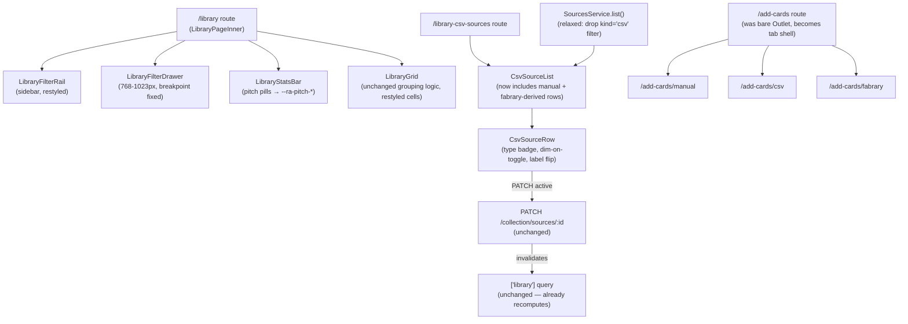

# Collection Surfaces Design — Library, Sources, Add Cards

**Spec**: `.specs/features/product-redesign/spec.md` — story "P2: Library, sources and add cards" (LIB-01..08) and the edge case "WHEN a source is toggled off while Library is filtered THEN the filtered counts SHALL recompute, not just the totals."
**Handoff**: `.specs/features/product-redesign/design-handoff.md` — sections 7 (Library), 8 (Fontes da biblioteca), 9 (Add cards).
**Depends on**: `.specs/features/product-redesign/design/01-foundation.md` (binding token contract — this doc uses only `--ra-*` names it defines, plus two token additions requested back to that phase, see §7).
**Status**: Draft

This workstream reshapes three routes — `/library`, `/library-csv-sources`, `/add-cards` (+ its three children) — and the components under `apps/web/src/components/library/` and `apps/web/src/components/csv-sources/`. It touches one backend endpoint (`GET /collection/sources`) to relax an existing filter, and one frontend type (`ICsvSource`) to expose a field the backend already serializes. It does not add any new endpoint.

---

## 0. How to read this document

Two of the four items the task brief asked this doc to settle (the CSV columns and the toggle→totals wiring) turned out to already be correct or already built — verified by reading the parser and the mutation, not assumed from the handoff. The other two (the filter parity table and the Add-cards shape) required tracing every current control and route file, because the handoff's mock is a single static screenshot and the current app has interaction states (a per-card quantity stepper, a multi-source decrement popover, empty-state affordances) that never appear in a static prototype.

Where this document proposes a token this workstream doesn't own (pitch text-ink companions), it's flagged as a change request against `01-foundation.md`, not designed as if it already existed.

---

## 1. Architecture overview

No new services, no new routes beyond what exists. The shape is: three existing routes get restyled and, in two cases, structurally adjusted (Sources gains a third source kind on read; Add-cards' parent layout stops being a bare `<Outlet/>` and becomes the tab shell).



---

## 2. Filter and control parity (LIB-01)

LIB-01's literal text only names the sidebar. Reading `library.tsx`, `LibraryFilterRail.tsx`, `LibraryGrid.tsx` end to end surfaces controls the handoff's screenshot doesn't show at all — a static mock can't depict a hover stepper or a live-updating chip. Every one of them is in scope for "no filter lost," so the table below covers the full page, not just the rail.

| Control | Exists today | Handoff shows it | Verdict / where it lands |
|---|---|---|---|
| Search input ("Buscar coleção") | Yes — `LibraryFilterRail` search section, local state (not URL-synced) | Yes | Restyle only. Keep local-state-not-URL-synced behavior (existing rationale: avoid a URL replace per keystroke). |
| 4 pitch chips (red/yellow/blue/colorless) | Yes — `PITCH_OPTIONS`, toggle buttons with `role="checkbox"` | Yes | Restyle to new pitch tokens (§3.3). Behavior unchanged. |
| Class facet, with per-value counts | Yes — collapsible `ToggleSection`, default collapsed, auto-opens on selection | Yes ("Classe 4") | Keep the accordion component as-is; the handoff's "Classe 4 · Talento 1 · Set 28" is read as the *collapsed-state summary counts* the current `ToggleSection` already renders (`summary` computed as `${options.length}` or `N of M`), not a literal single compact line replacing three sections. |
| Talent facet, with per-value counts | Yes — same `ToggleSection` | Yes ("Talento 1") | Same as Class. |
| Set facet, with per-value counts + release name | Yes — same `ToggleSection`, `formatLabel` renders code + name | Yes ("Set 28") | Same as Class. |
| `types` filter (search param + `applyFilters` logic) | Plumbed through `TLibrarySearch.types` and `ILibraryFiltersValue.types`, but **zero UI control renders it anywhere** in `LibraryFilterRail` or `LibraryFilterDrawer` | Not shown | Not a filter a user can lose through this redesign — there was never a UI affordance to set it. Not removed either (§14, item 3): it's a live, reachable-by-URL branch of `applyFilters` and a typed field of the `TLibrarySearch` contract several routes' `DEFAULT_LIBRARY_SEARCH` depend on — load-bearing by the letter, just UI-orphaned. Left as-is. |
| Card-size slider | Yes — `CARD_SIZE_STEPS` range input, URL-synced via `cardSize` search param | Yes | Restyle + fix two real bugs (§3.1): hardcoded English labels, `aria-hidden` legend. |
| Group-by segments (Type/Pitch/Set/List) | Yes — `GROUP_OPTIONS`, `role="radiogroup"` | Yes | Restyle only. |
| "Gerenciar fontes ›" link in the Library sidebar | **No** — today this link exists only on `/add-cards` (index and CSV subview), never on `/library` itself | Yes, in the sidebar | This is the one place the handoff *adds* something the current app lacks. Land it as a new sidebar footer link to `/library-csv-sources`, additive, not a replacement for anything. |
| "Matching N" live chip under search | Yes — `aria-live="polite"` paragraph, shown when query ≥ 2 chars | Not shown (static mock) | Keep — it's assistive-tech-relevant live feedback, not visual chrome the handoff would have any reason to depict. |
| "Clear all filters" footer button (with active count) | Yes — conditional on `activeFilterCount > 0` | Not shown | Keep. |
| No-results state + "Clear filters" action | Yes — `styles.noResults` block in `library.tsx` | Not shown | Keep. |
| Per-card quantity stepper (`LibraryCardStepper`, +/− on hover, multi-source decrement popover fed by `contributions`) | Yes — biggest interactive surface on a grid cell today | **Not shown** — the handoff's card spec is "badge ×N no rodapé direito" only, no stepper | **Decided, not just flagged: the stepper survives.** See §3.4 — the affordance wins where it competes with the handoff's static tile. |
| Card art lightbox on click | Yes — `CardLightbox`, opens when `imageUrl` present | Not shown | Keep. |
| Recently-added banner | Yes — `RecentlyAddedBanner`, mounted above the grid and on the empty state | Not shown | Keep — post-import confirmation, orthogonal to the redesign. |

**Verdict**: with the two additions above (sidebar's "Gerenciar fontes ›" link, and the two card-size-slider bugs), nothing the current app offers is dropped. The one thing genuinely new is the sidebar source link; the one thing genuinely at risk if implemented literally from the handoff's screenshot alone is the card stepper, because the mock simply doesn't draw it.

---

## 3. Library grid and stats

### 3.1 Card-size slider (LIB-02)

**Sizes**: keep the existing five steps unchanged — `[80, 120, 160, 200, 240]` px, default `120`. The handoff gives no numeric steps of its own (only "MÉDIO / 120px" as one example legend state), so there's nothing to reconcile; the existing scale already produces a legend that reads "MÉDIO · 120px" at the default.

**Two real bugs to fix while restyling** (found reading `LibraryFilterRail.constants.ts` and `LibraryFilterRail.tsx`):

1. `CARD_SIZE_LABELS` (`{ 80: 'Small', 120: 'Medium', ... }`) is hardcoded English. It needs pt-BR/en-US catalog keys (`library.cardSizeSmall`, `...Medium`, `...Large`, `...XLarge`, `...Max`) — currently every locale shows "Medium," "Small," etc. regardless of the active language, which fails cross-cutting requirement 1 as soon as anyone notices it, redesign or not.
2. The legend `<p className={styles.sliderValue} aria-hidden="true">` is marked `aria-hidden` — a screen-reader user gets no announcement of the current size at all. Add `aria-valuetext={`${label} · ${value}px`}` on the `<input type="range">` itself (the DOM element that already carries `aria-valuemin/max/now`) instead of hiding a sighted-only legend; keep the visual legend for sighted users, drop `aria-hidden` from the input's value text or leave the `<p>` hidden but ensure the input's own `aria-valuetext` carries the equivalent string.

**Persistence**: not persisted today (confirmed — no `localStorage` reference anywhere in `library.tsx`, `LibraryFilterRail.tsx`, or `-library.helpers.ts`; the only channel is the `cardSize` URL search param, which resets to `120` on any fresh navigation without that param). The repo does have a live precedent for persisting a UI display preference: `SidebarCollapseToggle.tsx` persists to `ra-deck-sidebar-expanded` in `localStorage`, and theme/locale follow the same `ra-*`-prefixed pattern (`theme-init.ts`, `LanguageToggle.tsx`).

**Decision**: keep the URL sync (so a shared link reproduces the exact browse state — this is deliberate today, don't regress it) and *additionally* write the chosen size to `localStorage` under `ra-library-card-size`, read once as the fallback default when `/library` is opened with no `cardSize` param at all. URL param always wins when present; `localStorage` only supplies the default for a bare `/library` visit. This is the same "URL for shareable state, `localStorage` for personal preference default" split the codebase already has no counter-example to, so it's additive rather than a new pattern.

**Grid mechanics — do not adopt the handoff's literal `repeat(6,1fr)`.** The handoff's markup (`grade repeat(6,1fr) gap 11px`) describes the *result* at the default 120px size on a ~1320px container, not a fixed template. The current grid (`LibraryGrid.module.css`) is `grid-template-columns: repeat(auto-fill, min(100%, var(--cell-min)))`, where `--cell-min` is set inline from `cardSize`. A fixed 6-column template would make LIB-02 ("the grid card size SHALL change") meaningless — changing the slider would resize cards within a locked 6-column row instead of changing how many fit. Keep `auto-fill` driven by `--cell-min`; this also already reproduces the handoff's stated per-breakpoint column counts without a fixed template, as a sanity check:

- At ≥1280px, content width ≈ `1320 - 250 (rail) - ~70 (padding/gap)` ≈ 1000px. `auto-fill` at `--cell-min = 120 + 16 = 136px` (the existing `+1rem` padding compensation) with a 12px gap (`--ra-space-3`, the closest existing token to the handoff's literal 11px — a sub-pixel difference, not worth a bespoke token) yields `floor((1000+12)/(136+12)) ≈ 6` columns — matches the handoff's "6 columns at default size" without a hardcoded 6.
- At 1024–1279px (sidebar still inline, see §5), content width ≈ 1024 − 250 − 70 ≈ 700px → `floor((700+12)/148) ≈ 4` columns, matching the handoff's "library a 4" guidance for that range.

Gap: use `--ra-space-3` (12px), not a new 11px token — same reasoning 01-foundation applied to other 1px-scale hairline deviations (§4.1 of that doc).

### 3.2 Group-by segments (LIB-03)

No logic change — `groupCards()` in `LibraryGrid.tsx` already handles `type | pitch | set | flat` client-side with no refetch, which is exactly LIB-03's requirement. Restyle the segmented control to the new token set only.

### 3.3 Pitch colors in Library stats (LIB-04) — resolved via upstream token addition

The task brief requires Library stats pitch counts to use the foundation's `--ra-pitch-*` tokens. Today's `LibraryStatsBar.module.css` pills use a *different*, older token family — `--ra-card-frame-{red,yellow,blue,colorless}-ink/-bg` — and that family exists specifically because the raw swatch color isn't legible as text.

Computing the identical WCAG formula `01-foundation.md` §0 verified itself, against the new pitch values on `--ra-bg-surface` (`#14161c`, the pill's actual background per `LibraryStatsBar.module.css` `.bar { background-color: var(--ra-bg-surface); }`):

| New pitch token | Value | Contrast on `--ra-bg-surface` | AA-body (≥4.5) |
|---|---|---|---|
| `--ra-pitch-red` | `#c0473e` | **3.63:1** | **fails** |
| `--ra-pitch-blue` | `#4a7fc0` | **4.38:1** | **fails** (by 0.12) |
| `--ra-pitch-yellow` | `#d6a83e` | 8.1:1 (est.) | pass |
| `--ra-pitch-colorless` | `#8a8d94` | 5.5:1 (est.) | pass |

Using the raw pitch tokens as pill *text* color would regress two of four pills below AA-body — a direct violation of the spec's "nothing already shipped regresses" goal and cross-cutting requirement 2, and the existing `contrast.spec.ts` won't catch it because that suite tests token-pair matrix rows, not this component's actual usage.

**Resolved, not a fallback**: this workstream does not own `tokens.css`, so it doesn't invent new global tokens unilaterally — it requested them (§7) and the request has been accepted. The owner has directed the foundation workstream to add a text-safe `--ra-pitch-{red,yellow,blue,colorless}-ink` companion per pitch color (dark + light), with contrast assertions, in `01-foundation.md`/`tokens.css`. This design uses those four companions uniformly for pitch-colored **text** (pill counts, and anywhere else a pitch value labels itself in text); the raw `--ra-pitch-*` tokens remain for **fills, borders, and swatches** only — the dot, the pill background, the border. Yellow and colorless already pass as raw text today, but they still get `-ink` companions rather than a mixed rule (two tokens with a suffix, two without) — uniform consumption is simpler to implement and to audit, and matches the coordinator's "per pitch colour" instruction.

**No neutral-color fallback.** A generic `--ra-fg-primary` fallback was considered in an earlier draft and is explicitly rejected — it would ship AA-safe but throw away the pitch color-coding that makes the pills legible at a glance, which is the entire point of LIB-04.

**Sequencing note**: this workstream's PR should not land the pill markup ahead of 01-foundation defining the four `-ink` tokens, or `var(--ra-pitch-red-ink)` resolves to nothing. As a syntactic safety net only (not a design fallback — purely so an out-of-order merge degrades gracefully instead of rendering invisible text), reference each with its raw counterpart as the CSS `var()` fallback: `color: var(--ra-pitch-red-ink, var(--ra-pitch-red));`. That still shows pitch-colored text if the ink token isn't defined yet; it just may be under-contrast until both land together.

Apply the same `-ink`-for-text / raw-for-fill split to the sidebar's pitch filter chips (`LibraryFilterRail.module.css` `.pitchPill--*`) for consistency — not a hard LIB requirement, but the handoff's "4 chips com bolinha colorida e borda na cor" describes the same visual language, and leaving the sidebar on the old token family while the stats bar moves to the new one would visibly split the two pitch-color systems on one screen.

### 3.4 Card cell — the quantity stepper survives (departure from the handoff, ruled)

Standing rule for this workstream, confirmed by the coordinator: **a handoff omission is not an instruction to delete shipped behavior.** The handoff's Library card is a static screenshot — thumbnail, name, `×N` badge, nothing else. The shipped card is a live quantity editor: `LibraryCardStepper` renders +/− controls on hover, and for a card whose owned copies are split across more than one active source, decrementing opens a popover (fed by `ILibraryCard.contributions`) so the user picks which source to decrement. That is real, exercised functionality with no equivalent in the mock, and the mock's silence about it is a static-screenshot limitation, not a design intent to remove it.

**Decision**: `LibraryCardStepper` stays mounted on every cell exactly as it works today, restyled to the new tokens only. The handoff's `×N` badge is read as describing the cell's *default, unhovered* resting state (which already matches — `LibraryCardCell` already renders a `×{ownedQuantity}` badge at rest, per `LibraryGrid.tsx`); the stepper and popover are the interaction layer that appears on hover/focus, layered on top of that resting state rather than replacing it. No functional change, no scope reduction — restyle only. This is the one place in this workstream where the handoff's static visual and shipped functionality genuinely compete for the same footprint on the card, and the affordance wins.

---

## 4. Sources ("Fontes da biblioteca", LIB-05, LIB-06)

### 4.1 What "source type badge" actually requires — verified against the backend, not the mock

The handoff wants three badge types: CSV (green), Fabrary (gold), Manual (blue-lilac). Reading `csv-source.entity.ts` and `sources.service.ts`:

- `CsvSourceEntity.kind` is a two-value CHECK constraint: **`'csv' | 'manual'`**. There is no `'fabrary'` kind.
- `FabraryImportService.importFromUrl` persists Fabrary imports as `kind: 'csv'` **on purpose** — the entity's own doc comment states this explicitly: *"We intentionally pick `kind='csv'` over a new `kind='fabrary'` to avoid a schema migration — distinguishing the origin via the URL column is enough."* Fabrary-imported sources are marked by `sourceUrl !== null` and a `label` prefixed `"Fabrary: {deckName}"`.
- `GET /collection/sources` (`SourcesController.list` → `SourcesService.list`) currently queries `where: { userId, kind: 'csv' }` — **the manual source is never returned by this endpoint today.** `assertOwnsCsvSource` additionally 404s on `kind='manual'` for the PATCH/DELETE routes, and the entity's doc comment says this is deliberate: manual is "never visible in the Manage CSVs UI; never deletable or toggleable," and `SourcesService.patch` has no code path that would let it be toggled even if the guard were removed.

**Frontend badge derivation (no backend change needed for this part)** — a `deriveSourceKind` helper on the already-fetched `ICsvSource` row:

```ts
type TSourceDisplayKind = 'csv' | 'fabrary' | 'manual';

function deriveSourceKind(source: ICsvSource): TSourceDisplayKind {
  if (source.kind === 'manual') return 'manual';
  return source.sourceUrl !== null ? 'fabrary' : 'csv';
}
```

`sourceUrl` is a plain, non-`@Exclude`d column on `CsvSourceEntity`, and the controller returns the raw entity with no serializer interceptor stripping fields — it is already on the wire. The only frontend change required is adding `readonly sourceUrl: string | null;` to the `ICsvSource` type in `apps/web/src/api/csv-sources.ts`. **No backend change for the badge itself.**

**Badge color mapping** (reusing existing foundation tokens, no new ones needed): CSV → `--ra-ready-high` (green), Fabrary → `--ra-accent` (gold — matches the handoff's own "Fabrary ouro" literally), Manual → `--ra-status-idea` (violet, the closest existing token to "azul-lilás").

### 4.2 Backend change actually required — include Manual in the list; toggle decided by what the backend actually supports

To show "4 fontes · 3 ativas" the way the handoff's example implies (a manual source counted alongside CSV/Fabrary ones), `SourcesService.list()` needs to drop the `kind: 'csv'` filter and return all sources for the user:

```ts
async list(userId: string): Promise<CsvSourceEntity[]> {
  return this.csvSourceRepo.find({
    where: { userId },              // was: { userId, kind: 'csv' }
    order: { createdAt: 'DESC' },
  });
}
```

This is a **query relaxation on an existing endpoint**, not a new API surface.

**Whether Manual gets a toggle is settled by what the backend structurally supports, not by the handoff's mock only showing CSV rows.** Verified, not assumed: `assertOwnsCsvSource` (`sources.service.ts`) 404s any PATCH/DELETE targeting a `kind='manual'` row — `if (!source || source.userId !== userId || source.kind !== 'csv') throw new NotFoundException(...)` treats "manual" identically to "doesn't exist." `SourcesService.patch` has no code path that reaches a manual row at all; nothing downstream of that guard would need to change to *allow* a manual toggle — the guard itself is the block. The entity's own doc comment states this is deliberate: the manual source is "never deletable or toggleable." So this is a **structural** constraint, not a stylistic one: a source with `kind='manual'` genuinely cannot be deactivated through the same path a CSV or Fabrary source uses today, and this workstream has no requirement that reopens that guard.

Given that, the toggle is **not** replaced with a disabled `Switch` — a disabled control that invites a click and explains nothing is worse than no control at all. It is **omitted entirely** and replaced with a short plain-language line in its place, read once and understood: `csvSources.manualAlwaysIncluded` — "Sempre incluída — cartas adicionadas manualmente não podem ser desativadas." / "Always included — manually added cards can't be deactivated." (updates the copy table in §6.5). The Manual row still shows its type badge, label ("Manual entries" / "Entradas manuais"), and card count like any other row, and still omits the "···" overflow menu (rename/delete are guarded by the same structural block). This satisfies LIB-05's "each source SHALL show its type badge, name, card count, import date, active label and a toggle" for CSV/Fabrary rows; for the one row where a toggle cannot exist, the explanatory line stands in for it rather than a non-functional imitation of one.

One consequence of including manual rows: `createdAt` exists on the manual source (set at `ensureManualSource` time), so "import date" renders fine; there is no `originalFilename` (already nullable, existing UI already guards for it).

**`cardCount` is `NULL` for the manual source by design** — the entity's own doc comment states "counting on demand is cheaper than maintaining a running total." `CsvSourceRow` today renders `source.cardCount ?? 0`, so a naive relaxation of `list()` would show the newly-visible Manual row as "0 cards" regardless of how many manually-added cards actually exist — a real LIB-05 violation, not a cosmetic gap. Resolve it in `list()` itself, computed per-request rather than persisted (preserving the entity comment's stated rationale for not maintaining a running total):

```ts
async list(userId: string): Promise<CsvSourceEntity[]> {
  const sources = await this.csvSourceRepo.find({
    where: { userId },
    order: { createdAt: 'DESC' },
  });

  const manual = sources.find((s) => s.kind === 'manual');
  if (manual) {
    manual.cardCount = await this.collectionCardRepo.count({
      where: { sourceId: manual.id },
    });
    // Mutated on the in-memory entity for this response only — never `.save()`d,
    // so the persisted column stays NULL and the "no running total" design holds.
  }

  return sources;
}
```

This is still a relaxation of an existing method (it already queries `collectionCardRepo` elsewhere in this service, e.g. `previewDelete`), not a new endpoint.

### 4.3 Row dim + label flip (LIB-06) — does not exist yet, build it

Reading `CsvSourceRow.tsx` and `CsvSourceRow.module.css` end to end: the row today has a Radix `Switch` that fires `usePatchCsvSourceMutation`, but **there is no `opacity: .55` treatment on the row and no "Ativa/Inativa" (or "Active/Inactive") text label anywhere in the component.** LIB-06 needs new work here, not a restyle of something that already does this:

```tsx
<div className={`${styles.row} ${!source.active ? styles['row--inactive'] : ''}`} role="listitem">
  ...
  <span className={styles.activeLabel}>
    {source.active ? t('csvSources.activeLabel') : t('csvSources.inactiveLabel')}
  </span>
  <Switch.Root checked={source.active} onCheckedChange={handleToggle} ... />
```

```css
.row--inactive { opacity: .55; }
```

New copy keys: `csvSources.activeLabel` ("Ativa" / "Active"), `csvSources.inactiveLabel` ("Inativa" / "Inactive"), both locales.

### 4.4 Totals recompute (LIB-06, and the edge case "toggled while filtered") — already wired, verified end to end

Traced the full path from PATCH to render:

1. `usePatchCsvSourceMutation` (`csv-sources.ts`) does an **optimistic** local cache update on the `['csv-sources']` query, then on `onSuccess` calls `queryClient.invalidateQueries({ queryKey: LIBRARY_QUERY_KEY })` (and `['decks']`).
2. That invalidation refetches `GET /collection/library`, which calls `LibraryService.load` → `CollectionReadService.loadOwned`.
3. `loadOwned` queries `csv_source` for `active: true` **only** (`where: { userId, active: true }`) — an inactive source's rows never enter the sum.
4. Within `loadOwned`, quantities for the same `cardIdentifier` across multiple active sources are summed, not overwritten: `result.set(cardIdentifier, current + row.quantity)` — this is the literal code behind the handoff's "duplicatas são somadas, não sobrescritas" note, confirmed by reading the aggregation loop, not inferred from the UI copy.
5. `LibraryPageInner` holds `libraryQuery` from `useLibraryQuery()` (same `LIBRARY_QUERY_KEY`), so the refetch in step 2 automatically re-renders the page with new `allCards`; `filteredCards = applyFilters(allCards, searchQuery, filters)` recomputes from the new `allCards` on every render — so the **filtered** count updates too, not just the raw totals. This is exactly the edge case the spec calls out ("WHEN a source is toggled off while Library is filtered THEN the filtered counts SHALL recompute, not just the totals") and it requires **zero new wiring** — `applyFilters` has no memoization gap that would serve a stale filtered set.

**No new code needed for the totals/recompute behavior.** The only work in this area is the visual dim/label-flip (§4.3) and, if Manual is included per §4.2, confirming a toggle attempt on Manual is impossible in the UI (no `Switch` rendered) rather than silently no-op through a disabled control.

### 4.5 Two handoff §8 items not yet addressed above

**Count line ("4 fontes · 3 ativas" / "389 cartas somadas")** — neither number exists in the current `library-csv-sources.tsx` today. Source: the first half (`4 fontes · 3 ativas`) is trivially derived client-side from the already-fetched `sources` array — `sources.length` and `sources.filter((s) => s.active).length`, no new query. The second half ("389 cartas somadas") must **not** be computed by summing `source.cardCount` across sources client-side — that duplicates aggregation logic the backend already owns and, for the manual row, would double-count against the fix in §4.2 if done carelessly. Instead, reuse `useLibraryQuery()`'s `stats.totalCopies` (already the exact "total copies across all active sources, duplicates summed" figure — verified in §4.4) on the Sources page. `LIBRARY_QUERY_KEY` is shared with `/library`, so this is very likely a cache hit (`staleTime: 30_000`) rather than a new network round-trip for a user who visited Library first, which is the common path into Sources (via the new sidebar link, §2).

**`SumExplainer` vs. the handoff's one-line "ⓘ" note** — the handoff wants a static one-line info note; the current component is a collapsible panel (default closed) with a two-box-plus-total diagram behind a disclosure trigger. Decision: **keep the existing collapsible component** (it already passes its own accessibility spec, `SumExplainer.spec.tsx`, and the diagram is genuinely more instructive than a one-liner for a behavior users routinely misunderstand) but change its **closed-state trigger copy** to read as the handoff's literal note text ("ⓘ Duplicatas entre fontes são somadas, não sobrescritas." / "ⓘ Duplicates across sources are summed, not overwritten.") instead of the current abstract trigger label. This makes the collapsed (default) state visually match the handoff exactly, while expansion remains available as progressive disclosure for a user who wants the worked example. Existing `csvSources.sumExplainerTrigger` key's value changes; the component structure does not.

---

## 5. Responsive — drawer breakpoint correction

Current breakpoint (`library.module.css`): the filter rail hides and the "Filtros" drawer button appears at `max-width: 1279px` — i.e., anywhere below 1280px, including the entire 1024–1279px range.

Per this workstream's explicit scope, the drawer should activate only at **768–1023px**; at 1024–1279px the sidebar stays inline (only the grid's column count should shrink there, per §3.1's math). This is a real behavior change, not a restyle:

```css
/* was: @media (max-width: 1279px) */
@media (max-width: 1023px) {
  .layout { grid-template-columns: 1fr; }
  .railSlot { display: none; }
  .filtersButton { display: inline-flex; }
  ...
}
```

Below 768px, the same drawer behavior continues to apply (the spec doesn't ask for a third distinct treatment there, and nothing in this workstream's scope requires one) — this is the only responsive change in scope, matching the task brief's explicit boundary ("that is the only responsive behavior in scope beyond column counts").

---

## 6. Add cards (LIB-07, LIB-08)

### 6.1 Routes vs. tabs — keep the four route files, restyle the parent into the tab shell

The three add-paths are separate route files today (`add-cards.index.tsx`, `.manual.tsx`, `.csv.tsx`, `.fabrary.tsx`) under a parent layout (`add-cards.tsx`) that is currently a bare `<Outlet/>`. The foundation phase's nav-active helper (`01-foundation.md` §5.3) already resolves `/add-cards*` (any depth) to the `library` nav key via `LIBRARY_PREFIXES = ['/add-cards']` and `startsWith` — so this decision doesn't affect nav-active behavior either way.

**Decision: keep the four separate route files.** Turn `add-cards.tsx` from a pass-through into the shared header + tab strip (breadcrumb "← Library", H2 "Adicionar cartas", subtitle, and a pill-group of three `<Link>`s to `/add-cards/manual`, `/add-cards/csv`, `/add-cards/fabrary`, each carrying `data-active` computed from the current route match), with `<Outlet/>` rendering the active child's panel content inside the `--surface` panel the handoff specifies. Rationale:

- **Deep links survive.** `/add-cards/csv` stays a real, bookmarkable, shareable URL. Converting to client-only tab state inside one route would break every existing deep link and the `Link to="/add-cards/csv"` calls already scattered through `add-cards.csv.tsx`'s own success-redirect and `RecentlyAddedBanner`.
- **No redirects, no route restructuring.** Existing tests target these four files' paths directly (`__tests__/-add-cards.test.tsx`, `-add-cards.manual.i18n.spec.tsx`); keeping the routes stable keeps those tests' targets stable.
- **The one loose end**: what bare `/add-cards` (the index route) resolves to. Today it renders the three-card gallery being retired. Recommend the index route **redirects to `/add-cards/manual`** (the first tab, matching the handoff's implicit tab order Manual → CSV → Fabrary) rather than rendering its own panel — this keeps exactly one component per tab body and avoids a fifth near-duplicate "what does bare /add-cards show" implementation.

Do **not** rename `/library-csv-sources` to the handoff's sketch route `/library/sources` — `01-foundation.md` §5.2 already established that `routeTree.gen.ts` is ground truth over the handoff's "suggested routes" section, and the nav-active map in that same doc is keyed to the literal `/library-csv-sources` path today.

### 6.2 Copy — tabs replace the numerals and long paragraphs

`add-cards.index.tsx`'s `METHOD_DEFS` (roman numerals I/II/III, a title, a summary paragraph, and two note bullets per method) and each subview's own repeated `<span className={styles.numeral}>` header numeral are the "three long paragraphs and roman numerals" LIB-07 retires. Replace with: one explanatory sentence per tab, shown once in the shared header area (not per-panel), matching the handoff's "Três caminhos — escolha o que serve ao momento" pattern. New copy keys needed (both locales) — `addCards.tabManualLabel/tabCsvLabel/tabFabraryLabel` for the pill-group labels, and `addCards.manualSentence/csvSentence/fabrarySentence` for the one-liners; existing `decks.method*Title/Summary/Cta/Note1/Note2` keys become unused and can be removed once the gallery component they served is deleted.

### 6.3 CSV tab — the dropzone must state the *real* columns, not the handoff's guess

The handoff's footer text is `name, set, quantity, pitch`. Reading `csv-parser.service.ts` directly, this is wrong on one column and silent on required-vs-optional:

- **Required**: `name` (aliases: `name`, `card name`) and `quantity` (aliases: `quantity`, `qty`, `count`).
- **Optional**: `set` (aliases: `set`, `set code`) — `resolveHeader` returns `null` when no alias matches, and the parser falls through to name-only resolution (ambiguous when a name maps to multiple pitch variants; `set` disambiguates but isn't mandatory).
- **There is no `pitch` column at all.** The parser never reads one. Pitch is either embedded in the name itself via a trailing suffix pattern the Fabrary/PTCG-style exporters produce (`PITCH_SUFFIX_PATTERN = /^(.+?)\s*\((red|yellow|blue)\)$/i`, e.g. `"Bare Fangs (red)"`) or resolved from the catalog's own pitch value once the identifier is found. A user who adds a `pitch` column following the handoff's stated format gets it silently ignored, not an error — worth stating in the dropzone copy so nobody wonders why their explicit pitch column did nothing.

**Corrected dropzone footer text** (see `csvExpectedColumns` and `csvSizeAndRowLimit` in §6.5's copy table for the exact strings): required `name`, `quantity`; optional `set` (disambiguates same-named cards across editions); pitch is read from the card name (e.g. `"Bare Fangs (red)"`) or resolved automatically — no separate pitch column.

**Size limit**: the handoff's "2 MB" is correct — verified independently on both sides: the client (`add-cards.csv.tsx`, `MAX_BYTES = 2 * 1024 * 1024`) and the server (`csv.controller.ts`, multer `limits: { fileSize: 2 * 1024 * 1024 }`, surfaced as `LIMIT_FILE_SIZE → 400 FILE_TOO_LARGE`) enforce the identical number. No change needed there.

**Row limit — now required copy, not a nice-to-have.** `MAX_CSV_ROWS = 5_000` in `csv-parser.service.ts` throws `BadRequestException('CSV_TOO_MANY_ROWS')` above that — a distinct limit from file size (a small file can still exceed 5,000 rows). LIB-08's literal text only names "the expected columns and the size limit," but an undocumented limit that silently rejects an otherwise-valid file is a worse experience than a stated one, so this design surfaces it in the same footer line as the size limit (`csvSizeAndRowLimit`: "até 2 MB · até 5.000 linhas" / "up to 2 MB · up to 5,000 rows") rather than leaving it for the user to discover via an error.

### 6.4 Manual and Fabrary tabs

No functional changes — `add-cards.manual.tsx` (catalog search + `LibraryCardStepper`-style qty steppers, `QTY_MIN=1`/`QTY_MAX=3`) and `add-cards.fabrary.tsx` (URL input + `useFabraryLibraryImportMutation`) keep their existing logic verbatim; only the surrounding chrome (header, numeral, long intro paragraph) is removed in favor of the shared tab-shell header from §6.1.

### 6.5 i18n copy table — both catalogs, resolved against the real namespace layout

**Namespace decision**: `apps/web/src/i18n/locales/{pt-BR,en-US}/` has `csvSources.ts`, `decks.ts`, `library.ts` — no `addCards.ts`. Add-cards copy already lives under `decks.*` today (`decks.addCardsTitle`, `decks.methodManualTitle`, etc.). **Keep all new Add-cards keys under `decks.*`** rather than introduce a new namespace file — it matches existing placement and avoids a namespace-registration change `catalog-parity.spec.ts` would otherwise need to pick up. Card-size labels stay under `library.*` (sibling to the existing `library.cardSizeLabel`); source/badge copy stays under `csvSources.*` (sibling to the existing toggle/rename/delete strings).

Every row below needs both a `pt-BR` and an `en-US` entry — the table gives the intended meaning, not necessarily the final polished wording, which is a copywriting pass, not a design decision:

| Key | Namespace | pt-BR | en-US |
|---|---|---|---|
| `cardSizeSmall` | `library` | Pequeno | Small |
| `cardSizeMedium` | `library` | Médio | Medium |
| `cardSizeLarge` | `library` | Grande | Large |
| `cardSizeXLarge` | `library` | Extra grande | X-Large |
| `cardSizeMax` | `library` | Máximo | Max |
| `manageSourcesLink` | `library` | Gerenciar fontes › | Manage sources › |
| `activeLabel` | `csvSources` | Ativa | Active |
| `inactiveLabel` | `csvSources` | Inativa | Inactive |
| `sourceBadgeCsv` | `csvSources` | CSV | CSV |
| `sourceBadgeFabrary` | `csvSources` | Fabrary | Fabrary |
| `sourceBadgeManual` | `csvSources` | Manual | Manual |
| `manualAlwaysIncluded` | `csvSources` | Sempre incluída — cartas adicionadas manualmente não podem ser desativadas. | Always included — manually added cards can't be deactivated. |
| `sourcesCountLine` | `csvSources` | {{count}} fontes · {{activeCount}} ativas | {{count}} sources · {{activeCount}} active |
| `sumExplainerTrigger` (value change, key exists) | `csvSources` | ⓘ Duplicatas entre fontes são somadas, não sobrescritas. | ⓘ Duplicates across sources are summed, not overwritten. |
| `csvExpectedColumns` | `csvSources` | Obrigatório: `name`, `quantity`. Opcional: `set`. O pitch é lido do nome da carta ou resolvido automaticamente — não há coluna de pitch. | Required: `name`, `quantity`. Optional: `set`. Pitch is read from the card name or resolved automatically — there is no pitch column. |
| `csvSizeAndRowLimit` | `csvSources` | .csv até 2 MB · até 5.000 linhas | .csv up to 2 MB · up to 5,000 rows |
| `addCardsTabManual` | `decks` | Manual | Manual |
| `addCardsTabCsv` | `decks` | Importar CSV | Import CSV |
| `addCardsTabFabrary` | `decks` | Deck do Fabrary | Fabrary deck |
| `addCardsManualSentence` | `decks` | Busque no catálogo e ajuste a quantidade que você possui. | Search the catalog and adjust how many you own. |
| `addCardsCsvSentence` | `decks` | Envie uma planilha exportada de outra ferramenta. | Upload a spreadsheet exported from another tool. |
| `addCardsFabrarySentence` | `decks` | Importe as cartas de um deck público do Fabrary. | Import the cards from a public Fabrary deck. |

`decks.method*Title/Summary/Cta/Note1/Note2` (10 existing keys, one set per method) become dead once the retired gallery component (`add-cards.index.tsx`'s `METHOD_DEFS` rendering) is removed — delete them in the same change rather than leaving unused catalog entries behind.

---

## 7. Cross-workstream token requests to `01-foundation.md` — accepted

Logged here as a sequencing dependency, not an open question — the owner has directed the foundation workstream to add these:

| Request | Reason | Status |
|---|---|---|
| `--ra-pitch-{red,yellow,blue,colorless}-ink` (dark + light, all four for uniform consumption) | Raw `--ra-pitch-red`/`-blue` fail AA-body as text on `--ra-bg-surface` (§3.3); yellow/colorless get companions too so pill text consumes one consistent token family rather than a mixed rule | **Accepted by the owner.** 01-foundation is adding these with contrast assertions, verified against `contrast.spec.ts`'s formula the same way every other satellite token in that document was. This workstream's PR sequences after or alongside that addition (§3.3's `var()` fallback note covers an out-of-order merge). |

---

## 8. Components and interfaces

### `LibraryFilterRail` / `LibraryFilterDrawer` (restyled, not restructured)

- **Purpose**: sidebar filter controls; drawer is the same component rendered with `variant="drawer"` below 1024px.
- **Location**: `apps/web/src/components/library/LibraryFilterRail.tsx`, `LibraryFilterDrawer.tsx`.
- **Changes**: token restyle; `CARD_SIZE_LABELS` → i18n keys; `aria-valuetext` on the size `<input type="range">`; new "Gerenciar fontes ›" footer link (`<Link to="/library-csv-sources">`).
- **Reuses**: existing `ToggleSection` accordion, existing `snapCardSize`, existing URL-sync flow in `library.tsx`.

### `LibraryStatsBar` (restyled)

- **Purpose**: sticky stats strip (unique/copies/pitch pills/estimated value).
- **Location**: `apps/web/src/components/library/LibraryStatsBar.tsx`.
- **Changes**: pitch pill tokens `--ra-card-frame-*` → `--ra-pitch-*` (fill/border) and `--ra-pitch-*-ink` (text), per §3.3.
- **Reuses**: existing `ILibraryStats` shape — no DTO change.

### `CsvSourceRow` (generalized in place, name unchanged)

- **Purpose**: single source row — toggle (CSV/Fabrary only; Manual gets a plain-language line instead, §4.2), type badge, label (editable except Manual), meta, overflow menu (CSV/Fabrary only).
- **Location**: `apps/web/src/components/csv-sources/CsvSourceRow.tsx`. Kept as-is — a rename to reflect that it now covers three source kinds, not just CSV, is real but is churn this already-large phase doesn't need; noted as a follow-up for a future session (§14) rather than folded in here.
- **Interfaces**: `deriveSourceKind(source: ICsvSource): TSourceDisplayKind` — new pure helper, colocated or in a small `-source-kind.ts` sibling.
- **Dependencies**: `usePatchCsvSourceMutation` (unchanged), new i18n keys for active/inactive label, badge text, and the Manual explanatory line.
- **Reuses**: existing `Switch.Root` toggle wiring, existing `DeleteSourceModal`, existing inline-rename flow — all unchanged for CSV/Fabrary rows, all omitted (not disabled) for Manual.

### `SourcesService.list` (backend, relaxed)

- **Purpose**: list sources for the Fontes page.
- **Location**: `apps/api/src/collection/sources/sources.service.ts`.
- **Change**: drop `kind: 'csv'` from the `where` clause (§4.2). No other method on this service changes.

### Add-cards tab shell (new component, replaces bare Outlet)

- **Purpose**: shared header (breadcrumb, H2, subtitle) + pill-group tab nav + `--surface` panel wrapper around `<Outlet/>`.
- **Location**: `apps/web/src/routes/_auth/add-cards.tsx` (route file itself becomes the shell component, same pattern the file already uses for its layout role).
- **Interfaces**: none new — pure presentational shell around `<Outlet/>`, tab `data-active` derived from `useLocation().pathname` compared against the three child paths.
- **Reuses**: TanStack Router's existing child-route registration; no routing config change beyond the index route's redirect (§6.1).

---

## 9. Data model changes

### `ICsvSource` (frontend type, `apps/web/src/api/csv-sources.ts`)

```typescript
export interface ICsvSource {
  readonly id: string;
  readonly userId: string;
  readonly kind: 'csv' | 'manual';
  readonly label: string | null;
  readonly originalFilename: string | null;
  readonly sourceUrl: string | null;   // NEW — already serialized by the backend, just not typed on the frontend
  readonly contentHash: string | null;
  readonly cardCount: number | null;
  readonly active: boolean;
  readonly createdAt: string;
  readonly updatedAt: string;
}
```

No backend DTO change — `sourceUrl` is already an unfiltered column on the entity the controller returns directly.

### `TSourceDisplayKind` (new, frontend-only, derived — not persisted)

```typescript
type TSourceDisplayKind = 'csv' | 'fabrary' | 'manual';
```

Computed by `deriveSourceKind` (§4.1), never sent to or received from the API.

**Relationships**: `ICsvSource.kind` (backend truth, two values) → `TSourceDisplayKind` (frontend display, three values) is a one-way derivation; no new persisted field, no migration.

---

## 10. Error handling strategy

| Scenario | Handling | User impact |
|---|---|---|
| CSV over 2 MB | Already handled — client checks `file.size > MAX_BYTES` before upload; server's multer `LIMIT_FILE_SIZE` is the backstop if the client check is bypassed | Existing error callout, unchanged copy pattern; only the dropzone's *preventive* footer text changes (§6.3) |
| CSV over 5,000 rows | Already handled server-side (`CSV_TOO_MANY_ROWS`) | No current UI copy specifically names this — recommend adding a specific error message rather than falling through to a generic upload-failed string, since it's a distinct, actionable cause |
| Toggling a source while its patch request is in flight (double-click) | Already handled — optimistic update + rollback-on-error in `usePatchCsvSourceMutation` | Unchanged |
| Manual source somehow reached with an `active=false` toggle attempt (should be structurally impossible once the `Switch` is suppressed) | Defense in depth: `SourcesService.patch` still 404s via `assertOwnsCsvSource` if a stale client somehow POSTs to a manual source's PATCH route | Existing 404 error toast path, unchanged |
| Fetching `/collection/sources` after the `kind` filter is relaxed, for a user with only a manual source and zero CSV/Fabrary sources | List now returns exactly one row (manual) instead of the current empty-state | `CsvSourcesEmptyState` should only render when the list is truly empty (post-relaxation, that's now a rarer case — a brand-new user with literally zero cards of any kind); verify this component's trigger condition still matches after the relaxation |

---

## 11. Tech decisions (non-obvious calls, summarized)

| Decision | Choice | Rationale |
|---|---|---|
| Sidebar facet sections (Class/Talent/Set) | Keep existing `ToggleSection` accordion component unchanged | Handoff's "Classe 4 · Talento 1 · Set 28" reads as the accordion's own collapsed-summary counts, not a request for a different, flatter component |
| Card grid template | Keep `auto-fill` + `--cell-min` driven by the size slider, not the handoff's literal `repeat(6,1fr)` | A fixed template makes LIB-02 (size slider resizes the grid) impossible; auto-fill already reproduces the handoff's stated column counts at each breakpoint by calculation |
| Pitch pill text color | `--ra-pitch-{color}-ink` companions (all four), requested and accepted from `01-foundation.md`; raw tokens stay on fill/border only | Preserves the color-coding LIB-04 exists for, instead of a neutral fallback that would satisfy AA but discard the point of the requirement |
| Card-size persistence | URL param (existing, kept) + new `localStorage` fallback default (`ra-library-card-size`) | Preserves shareable-link behavior; adds a personal-preference default matching the existing `SidebarCollapseToggle` / theme / locale precedent |
| Filter-drawer breakpoint | Move from `max-width: 1279px` to `max-width: 1023px` | Task brief's explicit scope: sidebar stays inline through 1024–1279px, drawer is 768–1023px only |
| Fabrary badge derivation | Frontend-only (`sourceUrl !== null`), no backend `kind` migration | Backend already stamps `sourceUrl` on Fabrary imports specifically so origin is recoverable without a schema change (per the entity's own doc comment) |
| Manual source in the Fontes list | Include via a `list()` query relaxation, with `cardCount` computed per-request; keep non-toggleable, non-renameable, non-deletable in the UI | A list that structurally can't contain Manual doesn't satisfy LIB-05; the toggle/rename/delete guard stays because it matches the entity's explicit, documented "never toggleable" decision — only the *read* path needed to change |
| Add-cards structure | Keep four separate route files; restyle the parent layout into the shared tab shell | Deep links (`/add-cards/csv` etc.) and existing route-targeted tests stay intact; the foundation's nav-active prefix match already treats any `/add-cards/*` depth identically |
| `/add-cards` bare index | Redirect to `/add-cards/manual` | Avoids a fifth near-duplicate "what renders at the bare path" implementation |
| CSV dropzone copy | Correct the handoff's `name, set, quantity, pitch` to required `name`+`quantity`, optional `set`, no `pitch` column; add the undocumented 5,000-row cap alongside the size limit | Verified directly against `csv-parser.service.ts`'s alias sets and suffix-pattern pitch resolution; an undocumented limit that rejects a file is worse than a stated one |
| Library card stepper | Stays mounted, unchanged behavior, restyle only | Handoff omission is not an instruction to remove shipped functionality (§3.4) |

---

## 12. Requirement traceability

| ID | Covered by |
|---|---|
| LIB-01 (no filter lost) | §2 |
| LIB-02 (card-size slider) | §3.1 |
| LIB-03 (group-by regroups without refetch) | §3.2 |
| LIB-04 (pitch stats colors) | §3.3, §7 |
| LIB-05 (source row: badge, name, count, date, active label, toggle) | §4.1, §4.2 |
| LIB-06 (toggle dims row, flips label, recomputes totals) | §4.3, §4.4 |
| LIB-07 (Add cards as tabs, one sentence each) | §6.1, §6.2 |
| LIB-08 (CSV dropzone states columns + size limit) | §6.3 |
| Edge case: source toggled while filtered → filtered counts recompute | §4.4 |
| Cross-cutting 1 (i18n both locales) | §6.5 (full copy table), plus §3.1, §4.3, §6.2, §6.3 in narrative form |
| Cross-cutting 2 (touch target + focus-visibility bars, no banned anti-patterns) | New surfaces this workstream adds: the Add-cards tab strip (§6.1) and the Library sidebar's new "Gerenciar fontes ›" link (§2) both need to meet the `uxui-remediation` touch-target and focus bars — existing controls being restyled (rail, drawer, stats pills, source rows) already meet them today and this doc's changes are token/copy-only for those, not structural |
| Cross-cutting 4 (visual regression baselines regenerated in the same change) | Applies to all three screens this workstream touches — `/library`, `/library-csv-sources`, `/add-cards` (+ children) — baselines must be regenerated together with the token/structural changes in §3–§6, not deferred |

Not covered here, out of this workstream's scope: everything under CMP, BOX, HOME, DECK, SWAP, EDIT, AUTH.

---

## 13. Tests this design change touches

Named so the next session doesn't discover them at PR time. Confidence varies — some are certain to need updates, others need a read to confirm whether the change actually breaks their assertions:

| Test file | Why it's implicated | Confidence |
|---|---|---|
| `apps/api/src/collection/__tests__/sources.service.spec.ts` | `list()`'s query and manual-`cardCount` behavior both change (§4.2) | High — needs new/updated cases for "manual row included" and "manual row's computed `cardCount`" |
| `apps/api/src/collection/__tests__/sources.controller.spec.ts` | Same `list()` change, controller-level | Medium — check whether it asserts the `kind='csv'`-only contract |
| `apps/web/src/routes/_auth/__tests__/-add-cards.test.tsx` | Imports `AddCardsPage` from `add-cards.index.tsx` directly and tests the gallery being retired (§6.1, §6.2) | High — this file's subject under test no longer exists in its current form |
| `apps/web/src/routes/_auth/__tests__/-add-cards.manual.i18n.spec.tsx` | i18n coverage for a route whose surrounding chrome changes | Medium — confirm it targets the manual panel's own copy, not the retired gallery header |
| `apps/web/src/routes/_auth/__tests__/-library.test.tsx` | Sidebar gains the sources link, drawer breakpoint changes (§2, §5) | Medium |
| `apps/web/src/components/library/__tests__/LibraryFilterRail.test.tsx` | Card-size label i18n keys replace hardcoded English strings (§3.1) | High if it asserts label text; unconfirmed — no hardcoded-label assertion was found by a text grep, worth a direct read before assuming it's clean |
| `apps/web/src/components/csv-sources/__tests__/CsvSourceRow.test.tsx` | Row dim/label-flip is new behavior (§4.3); manual-row rendering (no `Switch`, no menu) is new (§4.2) | High |
| `apps/web/src/components/csv-sources/__tests__/SumExplainer.spec.tsx` | Trigger copy changes (§4.5) | Medium — only if it asserts trigger text, not just structure/a11y |

---

## 14. Open items — all resolved; nothing outstanding for implementation

All three items previously open here were closed by coordinator ruling (2026-08-16). None carry into implementation as an unresolved question:

1. **Manual source toggle — resolved, not a preference call.** Verified structurally, not read off the handoff's mock: `assertOwnsCsvSource` 404s any PATCH/DELETE against a `kind='manual'` row, and the entity's own doc comment states this is deliberate ("never toggleable"). Manual cannot be deactivated through the same path a CSV/Fabrary source uses — so it gets no `Switch`, disabled or otherwise, and no overflow menu. In their place: a short plain-language line (`csvSources.manualAlwaysIncluded`, §4.2, §6.5) explaining why, read once and understood rather than a control that invites a click and does nothing.

2. **`CsvSourceRow`/`CsvSourceList`/`ICsvSource` renaming — skipped.** Churn this already-large phase doesn't need, and the rename buys a reader of this feature nothing. The names now cover three source kinds under a "Csv"-prefixed identifier, which is a genuine (if minor) mismatch — logged here as a **follow-up for a future session**, not folded into this design.

3. **`types` filter plumbing — kept, not removed.** Re-checked against the coordinator's own two conditions before writing this as a removal, and both land on "load-bearing":
   - **Not genuinely unreachable.** `validateLibrarySearch` parses a `types` array straight off the raw URL search params, and `applyFilters` (`-library.helpers.ts`) executes a real filter branch against it (`c.types.some((t) => targetTypes.has(t.toLowerCase()))`) whenever it's non-empty. A hand-crafted `/library?types=Action` URL filters the grid today — there is no UI that generates such a URL, but "no UI exposes it" is exactly the "merely unused by the current UI" case the coordinator's condition distinguishes from "genuinely unreachable," and this fails that stricter bar.
   - **It is part of the URL search-param contract.** `TLibrarySearch.types` is a typed field of the same search-param shape `library.tsx`'s `handleFiltersChange` round-trips through `navigate({ to: '/library', search: nextSearch })` on every filter change — so a `types` value present in the URL on page load stays synchronized across subsequent filter interactions, not just on first render. `DEFAULT_LIBRARY_SEARCH` (exported and consumed by `add-cards.index.tsx`, `add-cards.fabrary.tsx`, `library-csv-sources.tsx`) includes `types: []` as part of the same shape.

   Per the coordinator's own stated rule ("if either check says it is load-bearing, leave it and say what it feeds"), this design **leaves `types` in place**, unremoved, correcting the recommendation from an earlier draft of this doc. What it feeds: the `TLibrarySearch`/`ILibraryFiltersValue` URL contract and `applyFilters`' filter logic, reachable today only via a manually-typed URL, not via any control this workstream builds or restyles.
