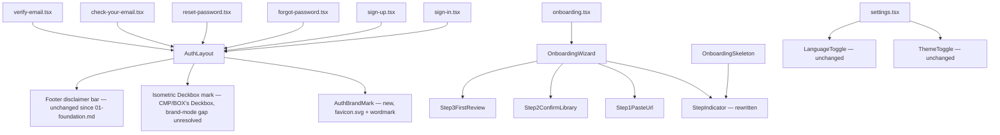

# P2: Sign In / Onboarding + EDIT-05 (Settings) — Design

**Spec**: `.specs/features/product-redesign/spec.md` — story "P2: Sign in and onboarding" (AUTH-01..05) and requirement EDIT-05 from "P2: New deck, edit deck and settings"
**Handoff**: `.specs/features/product-redesign/design-handoff.md` §"Screens / Views" — 1. Sign in, 2. Onboarding, 11. Conta (Settings)
**Depends on**: `01-foundation.md` (tokens, typography, nav — Approved) for every `--ra-*` value used below; `02-core-components.md` (BOX/CMP workstream, Draft, landed concurrently with this document) for the `Deckbox` component this document's §3 targets as the Sign-in brand mark — not yet implemented in code, and its own open item #5 confirms Sign-in's cardless/brand usage is "named but not designed" there either, so a real gap remains even with that design in hand. See §3.
**Status**: Draft

This is the last workstream in the handoff's own order (D1). Nothing downstream depends on it. Its job is narrow: reskin six already-correct anonymous routes that all share one layout component, redesign one three-node stepper, and retouch one settings page whose structure the handoff already matches almost exactly. No new API, no new route, no new data model.

---

## 0. How to read this document

Every `--ra-*` name below is the one `01-foundation.md` already minted or repointed — this document does not introduce a single new token. Where a component currently hardcodes a value that Foundation superseded (a `font-weight`, a `letter-spacing`, a raw hex), that is called out explicitly, because CSS Module class selectors beat the bare-tag rules Foundation edited in `global.css` — inheriting the new type system is not automatic everywhere, and pretending it is would leave three files silently stale.

---

## 1. Scope map

| Screen | Route file | Shared layout | Handoff section | Structural change? |
|---|---|---|---|---|
| Sign in | `apps/web/src/routes/sign-in.tsx` | `AuthLayout` | §1 | No — copy + token only |
| Sign up | `apps/web/src/routes/sign-up.tsx` | `AuthLayout` | none (inherits §1) | No |
| Forgot password | `apps/web/src/routes/forgot-password.tsx` | `AuthLayout` | none (inherits §1) | No |
| Reset password | `apps/web/src/routes/reset-password.tsx` | `AuthLayout` | none (inherits §1) | No |
| Check your email | `apps/web/src/routes/check-your-email.tsx` | `AuthLayout` | none (inherits §1) | No |
| Verify email | `apps/web/src/routes/verify-email.tsx` | `AuthLayout` | none (inherits §1) | One glyph swap, §4.3 |
| Onboarding | `apps/web/src/routes/_auth/onboarding.tsx` → `OnboardingWizard` | none (standalone) | §2 | Yes — `StepIndicator` rewrite + panel wrapper |
| Settings | `apps/web/src/routes/_auth/settings.tsx` | `AppShell` (already redesigned by Foundation's nav work) | §11 | No — CSS retouch only |

Six of eight rows in this table require **zero JSX changes** — the redesign lands entirely in `AuthLayout.tsx`/`.module.css` and propagates by construction, the same mechanism `01-foundation.md` §5.5 used for the Footer disclaimer.

---

## 2. Architecture overview



Everything under `AuthLayout` is one component edit. Everything under `OnboardingWizard` is a component swap (`StepIndicator`) plus a layout wrapper. `settings.tsx` gets no component graph change at all — only its own CSS Module.

---

## 3. The one real dependency this workstream cannot resolve itself

The handoff's Sign in section (§1) specifies the left-panel brand mark as: *"Deckbox isométrica 170×170 como marca (mesma do Home, `scale(.9)`, sem cartas, face frontal com R 52px em UnifrakturCook `#eecf7f`)."*

**This is not the component currently in `AuthLayout`.** `AuthLayout` today renders `DeckboxDecoration` (`apps/web/src/components/shell/DeckboxDecoration.tsx`) — a flat inline SVG with a single hand-drawn card stack and an `R` monogram baked into the front face. It predates the redesign, has no `scale(.9)` prop, and has no relationship to a Home deckbox. At the time this document's research began, `grep -rl "ib2-box\|isometric\|Deckbox"` across `apps/web/src/components`/`apps/web/src/routes` returned only `DeckboxDecoration` and unrelated hits (`CardArt.tsx`, `DeckCard.module.css`) — **no isometric deckbox existed in code**, and no design doc for it existed either (`.specs/features/product-redesign/design/` held only `01-foundation.md` and `07-swaps.md`).

**That changed mid-session.** `02-core-components.md` (the CMP/BOX workstream's design, Draft) landed in the same directory while this document was being written — the task's own instruction to "read it if it exists" applies retroactively here, and the finding needs reconciling rather than left as originally written. That document names the target component precisely: `Deckbox` (`apps/web/src/components/deckbox/Deckbox.tsx`, not yet implemented — it's a design, not shipped code), with `IDeckboxProps { deckId, deckName, format, status: TDeckStatus, heroArt, cards: readonly (IDeckboxCardSlot | null)[], readinessPct: number | null, className? }`. Its own §0 table states outright: *"AUTH-01 says Sign-in uses 'the branded deckbox on the left' and the handoff is explicit that it's 'a mesma [deckbox] do Home... sem cartas' — i.e. `Deckbox` itself, in a cardless/brand mode, not this flat oxblood SVG. That's AUTH's decision to make."* Its open item #5 (`02-core-components.md:572`) confirms the reverse is also true: *"Sign-in's 'same deckbox' reuse (AUTH-01) is named but not designed here — out of this workstream's story scope."* Two documents, each correctly deferring the seam to the other — this section is where that gets resolved, not left as a mutual pointer.

**The gap that remains even with `02-core-components.md` in hand.** `Deckbox`'s cards scene is gated purely on `status !== 'idea'` (`02-core-components.md:263`, `{status !== 'idea' && (<DeckboxScene zIndex={2}>...)}`) — there is no independent "cardless" flag in `IDeckboxProps`. Getting a cardless render today would require passing `status="idea"`, but that status also drives BOX-04's front-face dimming (`brightness(.62) saturate(.7)`, `02-core-components.md` §2.6) — visually wrong for a static brand mark that isn't "an idea-status deck." Nor does `DeckboxFront`'s prop signature (`deckName`, `format`, `status`, `heroArt`, `readinessPct`) have any "R 52px monogram" mode — the handoff's Sign-in front face (a static fraktur R, not a deck name/hero art/medallion) has no slot to render into as `Deckbox` is currently specified. **This document does not resolve that gap** — a `brandMode`/`monogram` variant on `Deckbox`/`DeckboxFront` is BOX's component API to extend, not AUTH's to bolt on from outside — but it names the gap precisely so BOX's next revision doesn't have to rediscover it from scratch.

**What this design commits to, so implementation isn't blocked on either BOX landing first or that variant gap closing:**

- `AuthLayout`'s left panel renders whatever component fills a **stable seam**: a new prop `IAuthLayoutProps.brandMark?: React.ReactNode`, defaulting to the current `DeckboxDecoration` if unset. This lets AUTH ship before BOX ships, and before BOX's `Deckbox` grows a brand-mode variant, without a compile break — the six anon routes don't pass `brandMark` explicitly (AuthLayout supplies the default), so the day `Deckbox` gains whatever brand-mode API BOX settles on, a single one-line change in `AuthLayout.tsx` swaps the default and every anon screen picks it up at once, matching D1's "no half-redesigned gap" mechanism from `01-foundation.md`.
- Until then, `DeckboxDecoration` stays as the mark, restyled to the new palette (it already consumes `currentColor` + `#faf3e0` card-stock hardcodes that should move to `--ra-fg-primary`-family tokens, but that is a value-only edit, not a geometry change) — the screen is not blocked on BOX or on the variant gap, it just doesn't yet show the "correct" identity element. This is the conservative, reversible option per the repo's deviation-handling convention; log it if it's the path taken.
- **Not resolved here, flagged for BOX's next revision**: a cardless/brand-mode variant of `Deckbox` (independent of `status="idea"`'s dimming), `scale(.9)`, and the "R 52px UnifrakturCook `#eecf7f`" front-face treatment at 170×170 are asset-level and component-API details that belong to BOX's design, not to this document, which only owns the 170×170 slot and the `brandMark` seam.
- **Owner ruling, recorded here so the two designs meet at a defined shape rather than by luck**: the core-components workstream is being asked separately to close its own open item #5 and design the cardless brand-mode variant properly, so that by the time this workstream is implemented there is a real component behind the `brandMark` seam, not a placeholder. This document's expectation of that component, stated precisely so BOX's revision has a fixed target rather than a vague "figure out a brand mode": **`Deckbox` rendered in a cardless brand mode, at 170×170, with the R monogram (UnifrakturCook, `#eecf7f`, 52px) on the front face** — i.e. the exact configuration the handoff's Sign-in section describes, not a smaller/larger size and not the `status="idea"` dimming treatment repurposed as a stand-in. `AuthLayout` passes `brandMark={<Deckbox ... />}` once that shape exists; until then the `DeckboxDecoration` fallback (above) holds the slot.

---

## 4. `AuthLayout` — the shared surface for six screens

### 4.1 Left panel (`.art`) — token and copy changes

| Handoff spec (§1) | Current implementation | Change |
|---|---|---|
| `linear-gradient(160deg,#160f0d,#0c0a0b)` | `background-color: var(--ra-bg-surface)` (flat) | Replace flat fill with the literal gradient. No existing `--ra-*` token slot represents a two-stop diagonal gradient — these are genuinely new decorative literals, not tokenizable colors already covered by Foundation. Recommend a **local CSS custom property scoped to `AuthLayout.module.css`** (`--al-art-gradient`), not a new global `--ra-*` token, since nothing else in the handoff reuses this exact gradient. |
| border-right `--line` | `border-inline-end: 1px solid var(--ra-border-subtle)` | Already correct — `--line` maps to `--ra-border-subtle` per `01-foundation.md` §1.1. No change. |
| padding `56px 60px` | `padding: var(--ra-space-12) var(--ra-space-8)` (48px 32px, old 4px-grid tokens) | `56px`/`60px` are not multiples of 4 in the old index scheme at this pairing (56 = `--ra-space-14px`? no — 56 isn't in Foundation's §4.2 pixel list either: the list runs 4,6,8,10,12,14,16,18,20,22,24,26,28,32,34,44,60, no 56). **Flag**: use the nearest values Foundation *did* define — `--ra-space-60px` (60px) is in the list and matches the horizontal padding exactly; the vertical 56px has no defined step at all. Recommend `--ra-space-44px` is too small and `--ra-space-60px` reused vertically is the closest available token; if a pixel-exact 56px is required, that's a new spacing step this document should not invent unilaterally — flag for confirmation, default to `--ra-space-60px` both axes if none is given. |
| Logo top-left: favicon 30×30 radius 7px + wordmark UnifrakturCook 22px | Not present at all today | **New** — see §4.2 |
| Deckbox 170×170 mark, no cards | `DeckboxDecoration` at whatever size `.artMark` CSS sets (currently unconstrained/intrinsic) | See §3. Size the slot to 170×170 regardless of which component fills it. |
| H1 Newsreader 500 38px, line-height 1.08 — "De volta à armaria" | `.artTaglineText`, `font-weight: var(--ra-weight-bold)` (700), `letter-spacing: var(--ra-track-h1)` (0.04em, stale) | Value fix, not structural: `font-weight: var(--ra-weight-medium)` (500), `letter-spacing: -0.01em` (hardcoded, matching `01-foundation.md` §3.3's h1 rule verbatim — `--ra-track-h1` itself is *not* changed by Foundation, only the global `h1`/`.ra-h1` rule stops consuming it, so this component must do the same local override rather than rely on the token). `line-height: 1.08` (was `var(--ra-leading-tight)` — confirm that resolves to 1.08 or hardcode). Copy: update `auth.signInTagline` from "Bem-vindo de volta ao arsenal." to "De volta à armaria" (§6). |
| Paragraph 15.5px/1.65 `--dim` light (`#a6a8b0`), max-width 440px | `.artCopy`, `--ra-text-small` (13px per Foundation), `--ra-fg-secondary` | No literal handoff copy given (styling only) — keep `auth.decorationCopy` text, retarget size/color: font-size to a literal `15.5px` (no scale token matches; nearest is `--ra-text-subtitle` at 15px per Foundation §3.2 — 0.5px off, visually identical, prefer the token over a new literal), color to `--ra-fg-tertiary` (`--dim`, the new Foundation token, not `--ra-fg-secondary` which now maps to `--ink-2`). `max-width: 440px` — no spacing-scale token needed here, it's a `max-width`, not a spacing step; keep as a literal. |
| Rodapé: citação em itálico 13px `#6c6e76` | `.artQuote`, `var(--ra-font-serif)`, `var(--ra-text-small)` | `--ra-font-serif` retention is flagged-but-decided in `01-foundation.md` §9 ("keep both `--ra-font-mono` and `--ra-font-serif` as they are") — no change needed there. `#6c6e76` is extremely close to `--ra-fg-muted`'s new dark value `#7a7c84` (§1.1 of Foundation) but not identical; since the handoff gives a literal hex here and no existing token matches it exactly, treat as a color this component owns locally rather than forcing a token match that would visibly shift the quote's tone. Font-size 13px already matches `--ra-text-small`'s new value (13px per Foundation §3.2) — no change needed. |

### 4.2 New: `AuthBrandMark` — the top-left favicon + wordmark row

The handoff's logo row (favicon 30×30 radius 7px + wordmark UnifrakturCook 22px) is **not** the same asset the authenticated `TopBar` uses. `TopBar.tsx` renders `LogoMark` (`apps/web/src/assets/logo-mark.svg`, the full isometric-box illustration, unclipped, 40px tall) next to a `.brandRathe`/`.brandArsenal` wordmark already at `font-family: var(--ra-font-gothic)` (UnifrakturCook), `font-size: 22px` — that wordmark styling is already exactly right and directly reusable (FND-04 confirmed no change needed to the gothic font itself).

The handoff instead wants `public/favicon.svg` (`apps/web/public/favicon.svg`) — a self-contained 64×64 square "seal" (fraktur R on a radial-gradient dark tile, per its own file header) — shown at 30×30 with a 7px border-radius clip. This is a **different asset** than `TopBar` uses; `01-foundation.md` never touched `TopBar`'s choice of `logo-mark.svg` over `favicon.svg` (its §5 nav work only covered active-item logic), so this document does not change `TopBar`. It only builds a small new component for `AuthLayout`'s left panel:

- **Component**: `AuthBrandMark` (new), `apps/web/src/components/auth-layout/AuthBrandMark.tsx` + co-located CSS Module.
- **Purpose**: render `favicon.svg` at 30×30 clipped to `border-radius: var(--ra-radius-xs)` (6–7px tier, `01-foundation.md` §4.1) inline with the wordmark, matching the handoff's literal pixel spec.
- **Reuses**: `favicon.svg` via `` (it's already a public asset, no import needed) or an SVGR import if the build already treats `public/` assets as importable elsewhere — check `vite.config` before choosing; the wordmark markup/CSS is a direct copy of `TopBar.module.css`'s `.brandRathe`/`.brandArsenal` rules (same font, same 22px size — literally the handoff's number), extracted or duplicated locally since `AuthLayout` has no dependency today on `shell/TopBar.module.css` and creating one for two CSS rules is not warranted (duplication of ~10 lines of CSS beats a cross-cutting import here).
- **Interactivity**: the handoff doesn't specify this logo as a link (unlike `TopBar`'s, which routes to `/home` — a destination that doesn't make sense for an unauthenticated visitor). Render it as a static, non-interactive brand mark. Agent's discretion, flagged.
- **A11y**: `aria-hidden="true"` on the whole mark, consistent with `DeckboxDecoration`'s existing treatment and the fact the page's real `<h1>` (on the form side) already announces the page's purpose.

### 4.3 Right panel (`.form`) and the disclaimer bar — survival, not redesign

**AUTH-05 / DISC-06 survival.** `01-foundation.md` §5.5 already established, for the authenticated `Footer`, that a component whose CSS is 100% token-driven needs zero code changes to pick up the new palette. `AuthLayout`'s `.disclaimerBar`/`.disclaimerText`/`.disclaimerLink` rules (`AuthLayout.module.css:170-213`) are the same shape: every value is a `var(--ra-*)` reference, and the markup (`AuthLayout.tsx:106-112`) renders `t('about.disclaimer')` and a real `<Link to="/about">` unconditionally, independent of the `footer` prop, exactly per the DISC-06 doc comment already in the file (`AuthLayout.tsx:32-35`). **This design changes nothing about that block** — no props, no markup, no test. The pinned test at `AuthLayout.spec.tsx:171-196` (`data-tsr-link="true"` discriminating a real router `Link` from a bare anchor, per the Footer-mirroring pattern from `pre-launch-hardening`) keeps passing unmodified, because the component under test doesn't change in that region. This is the direct answer to "how does the disclaimer survive": it was already built to survive a token swap, and this workstream's changes are entirely inside `.art` and `.heading`/`.sub`, never touching `.disclaimerBar`.

**Form styling** (`§1`'s "Form:" bullet — label 13px/600 `--ink-2`; input full-width, `bg rgba(255,255,255,.03)`, border `--line-strong`, radius 10px, padding 13px 15px, 14px; CTA full-width `bg --acc`, text `#1a1305` 700 15px, padding 14px, radius 11px): these are properties of `sign-in.module.css`/`auth-form.module.css` (`.label`, `.input`, `.submitBtn`), not `AuthLayout` itself — `AuthLayout` only wraps `children`. Token mapping:

| Handoff | Token |
|---|---|
| label `--ink-2` | `--ra-fg-secondary` |
| input border `--line-strong` | `--ra-border-strong` |
| input bg `rgba(255,255,255,.03)` | no existing satellite token at this alpha; keep as a local literal in `sign-in.module.css`/`auth-form.module.css` — inventing a new `--ra-*` satellite for a single translucent-white fill used only here doesn't meet Foundation's bar for "handoff-driven, multi-consumer" additions |
| input radius `10px` | `--ra-radius-md` (10–11px tier per Foundation §4.1) |
| CTA bg `--acc` | `--ra-accent` |
| CTA text `#1a1305` | `--ra-accent-ink-on` (`#1a1408` in dark — already exists in `tokens.css:132`, a 3-digit-per-channel difference from the handoff's literal that is below any perceptible threshold; reuse it rather than adding a near-duplicate token) |
| CTA radius `11px` | `--ra-radius-md` |

These edits land in `sign-in.module.css` and `auth-form.module.css` (shared by sign-up/forgot/reset/check-email/verify-email) — small, mechanical, no structural change, and they are the reason those five other screens need **zero JSX changes**: their `.form`/`.label`/`.input`/`.submitBtn` classes already come from these two CSS Modules.

**Verify-email's `◆` glyph — removed, replaced with a quiet spinner ring. Decided, not discretionary.** `verify-email.tsx:69` (`<div className={styles.statusIcon} aria-hidden="true">◆</div>`, "verifying" pending state) is exactly the motif the spec's Problem Statement names as decoration with no function ("diamantes ◆... Removida"), and it is inside this workstream's scope (verify-email is one of the six anon screens). It has to go — leaving the one surviving diamond on a screen the handoff never drew would be an odd exception to a rule the rest of the redesign applies everywhere else. The handoff gives no literal replacement for this screen, so this is specified in full here rather than left open:

```css
/* auth-form.module.css */
.statusIcon {
  width: 48px;
  height: 48px;
  margin: 0 auto var(--ra-space-4);
  border-radius: 50%;
  border: 3px solid var(--ra-border-strong);
  border-top-color: var(--ra-accent);
  animation: statusSpin 900ms linear infinite;
}

@keyframes statusSpin {
  to { transform: rotate(360deg); }
}

@media (prefers-reduced-motion: reduce) {
  .statusIcon {
    animation: none; /* freeze on one frame — still visually "a ring", no rotation */
  }
}
```
```tsx
// verify-email.tsx:69
<div className={styles.statusIcon} aria-hidden="true" />
```

This is deliberately plain: a single-speed linear rotation, no easing curve, no pulse or scale, `--ra-accent` on one quarter-arc against a `--ra-border-strong` track — a waiting state, not a moment that wants personality, matching the coordinator's framing directly. `font-size: 3rem`/`color: var(--ra-accent)`/`line-height: 1` (the old glyph-sizing rules) are removed along with the `◆` text node itself; `.statusMeta`'s "Confirmando selo…" caption below it is unchanged. `prefers-reduced-motion: reduce` freezes the ring on one static frame rather than removing it, satisfying Cross-Cutting Requirement 3 the same way the rest of the redesign's animations do.

### 4.4 Requirement AUTH-01 — literal check

AUTH-01: *"WHEN Sign in renders THEN it SHALL use the 50/50 split with the branded deckbox on the left and the form capped at 400px on the right."* This "50/50" is not just handoff prose — spec.md states it as the acceptance criterion's own literal text, so it is not optional the way a merely-descriptive handoff adjective would be.

**Form width.** `.formInner { max-width: 420px }` today vs the handoff's `400px`. Per spec.md's precedence rule, the handoff wins on pixel values — change to `max-width: 400px`.

**Art panel width — this needs an actual decision, not a shrug.** `.art` is currently `flex: 0 0 44%; max-width: 560px`. At the design's target viewport (1440px, per the handoff's own "Responsive" section: "protótipo é desktop 1440px"), 44% of 1440px is 633.6px, but the 560px cap binds first, so the art panel actually renders at **560px = 38.9% of 1440px** — nowhere near 50/50, and the cap is the reason, not the flex-basis. Honoring AUTH-01 literally requires changing both numbers together, because raising only the flex-basis to 50% while leaving `max-width: 560px` would still cap out at 560px and produce the same 38.9% result.

**What a naive symmetric 50/50 would break.** `.form`'s own content isn't elastic below a point: `.formInner` caps at `max-width: 400px`, and `.form`'s existing horizontal padding is `var(--ra-space-6)` (24px) on each side — so the form panel needs at least `400 + 24 + 24 = 448px` to render its content at full design width without the padding itself starting to eat into the 400px. A pure `flex: 0 0 50%` on both sides, uncapped on the form side, would let the form panel shrink below 448px at any viewport narrower than `896px` (`2 × 448`), squeezing the sign-in form tighter than its own design intent while the art panel — pure decoration — still claims the other, now-larger half. That's the wrong side to protect: a wide brand panel next to a cramped form is worse than a form winning the space it needs.

**The fix gives `.form` a floor and lets `.art` absorb the shrink first:**

```css
.art {
  flex: 1 1 50%;
  max-width: 720px; /* 50% of the handoff's 1440px design width, was 560px */
}

.form {
  flex: 1 1 50%;
  min-width: 448px; /* .formInner's 400px + .form's own 24px×2 padding — never let the form panel starve */
}
```

This produces three distinct zones, in order from wide to narrow:

| Viewport | Behavior |
|---|---|
| **≥ 1440px** | Art panel hits its `720px` cap and stops growing; form panel absorbs all further width beyond 50/50. Both panels have full breathing room. |
| **896px – 1440px** | True 50/50: neither the art cap (720px) nor the form floor (448px) has been reached yet, so both panels grow and shrink together in lockstep. This is the zone AUTH-01's "50/50 split" literally describes, and it now holds exactly, not approximately. |
| **720px – 896px** | Form panel's `min-width: 448px` engages before a literal half would still satisfy it; the art panel absorbs the rest of the shrink, ranging from `448px` down to `272px` (at exactly `720px` viewport) as the viewport narrows through this band. `272px` still comfortably fits the 170×170 brand mark plus its `var(--ra-space-12) var(--ra-space-8)` (48px/32px) padding — `272 − 2×32 = 208px` of content width, 38px wider than the mark itself — so the art panel stays legible, just visibly narrower than half, through this band. |
| **< 720px** | Unchanged from today: `AuthLayout`'s existing `NARROW_QUERY = '(max-width: 719px)'` `matchMedia` check (`AuthLayout.tsx:18,46-57`) unmounts the `.art` panel **entirely** — it's a JS-driven conditional render, not a CSS shrink, so there is no intermediate "half-visible" state below this breakpoint. `.form` becomes the sole column, full width minus its own padding. This document does not touch that boundary or that mechanism; the 50/50 fix above only changes what happens in the ≥720px range this JS check already gates. |

Flag for a visual check once real content is in place — this is a real layout change, not a values-only tweak like the rest of §4.1's table, so it's called out on its own rather than folded into that table.

---

## 5. Onboarding (`OnboardingWizard` + `StepIndicator`)

### 5.1 What AUTH-02/03 actually require

- AUTH-02: three-node stepper, active/completed/future states, **no** roman numerals, **no** ◆ diamonds.
- AUTH-03: activating a node navigates to that step.
- AUTH-04: step 3's primary action navigates to Home.

AUTH-04 is already satisfied — `OnboardingWizard.handleStep3Complete` navigates to `/home` today (`OnboardingWizard.tsx:67-69`), and `Step3FirstReview`'s primary CTA already calls it. No change needed there.

### 5.2 `StepIndicator` rewrite

The current component (`apps/web/src/components/onboarding/StepIndicator.tsx`) is the exact thing AUTH-02 bans: `ROMAN_NUMERALS` (`I`/`II`/`III`, `StepIndicator.tsx:23-27`, rendered at line 94) and a rotated-square `.diamond` separator (`StepIndicator.module.css:107-120`, rendered between nodes at `StepIndicator.tsx:107`). Its own doc comment even says the numerals are "Locked per Polish Notes" (`StepIndicator.tsx:22`) — that lock is exactly what the spec's Problem Statement and AUTH-02 overturn; the comment must be deleted, not just the numerals.

**No test currently pins the roman numerals or the diamond** — `grep` across `apps/web/src/components/onboarding/__tests__/*.spec.tsx` for `roman|diamond|StepIndicator` returns only an unrelated substring match in `OnboardingSkeleton.spec.tsx`'s docstring. There is no dedicated `StepIndicator.spec.tsx` today. This means AUTH-02's "SHALL NOT show roman numerals or ◆ diamonds" independent test (spec.md: *"assert the absence of roman numerals"*) needs a **new** test file, not an edit to an existing one — nothing currently locks the old behavior, so nothing currently proves the new behavior's absence either.

**An absence-only assertion is not enough** — a test that only checks "no roman numeral text and no `.diamond` element" would pass against an empty or broken render just as easily as against a correct one, which is exactly the class of gap this repo's own `pre-launch-hardening` verification caught (`.specs/STATE.md`, lessons L-007/L-008/L-009: an Opus verifier failed iteration 1 on assertions that checked only one half of a requirement). The new `StepIndicator.spec.tsx` must assert **both halves**: (a) the three nodes render with the correct visual state per `currentStep` (state-driven class or `aria-current="step"` on exactly the current node, `aria-current` absent on the other two), **and** (b) no roman-numeral text content (`I`/`II`/`III`) and no element bearing the removed `.diamond`/`.separator` class exists anywhere in the rendered tree. (a) alone would pass on a stripped-down render that also happens to satisfy (b) vacuously; (b) alone would pass on a broken component that renders nothing. Both together are what actually verifies AUTH-02.

**New node design**, per handoff §2:

| State | Handoff spec | Token mapping |
|---|---|---|
| Node shape | circle 34px | `.stepNumeral`'s existing `width/height` are `2.5rem` (40px) — resize to 34px |
| Active | `bg --acc / texto #1a1305` | `background-color: var(--ra-accent); color: var(--ra-accent-ink-on);` |
| Completed | `bg rgba(208,168,76,.2) / texto --acc` | No existing satellite at `.2` alpha (Foundation's `--ra-accent-soft-bg` is `.14`, §1.7 of `01-foundation.md`) — this is a third, distinct alpha value the handoff introduces for this one component. Per `01-foundation.md` §5.4's own precedent ("three different alpha pairs... picking one canonically here prevents each later phase from reinventing its own number" — that precedent was scoped to nav/filter-pills/edit-segments only), this is a fourth. Add it as a locally-scoped literal in `StepIndicator.module.css` (`background-color: rgba(208,168,76,.2)`) rather than a new global `--ra-accent-*` satellite token — one consumer doesn't meet Foundation's bar for a new named token. |
| Completed text | `--acc` | `color: var(--ra-accent-body)` (the alias, §1.4 of Foundation) |
| Future | transparent, border `rgba(255,255,255,.12)` | `--ra-border-strong` maps to exactly `rgba(255,255,255,.12)` in dark per Foundation §1.1 — use the token, not the literal |
| Label | 12px/600 below node | `--ra-text-xs` (exactly 12px per Foundation §3.2 — "metadata, captions," listed as "no change, already correct") / `--ra-weight-semibold` |
| Connector line | 64×1px between nodes, `rgba(208,168,76,.5)` if completed | New element replacing `.separator`/`.diamond` — a plain horizontal bar, not a diamond. `rgba(208,168,76,.5)` is a fifth distinct accent-alpha literal (same reasoning as "Completed" above — locally scoped, not tokenized) |

**No roman numeral, no glyph at all inside the circle** in the redesigned node — the handoff's stepper shows only the circle (filled/outlined per state) and the label below; number identity is conveyed by position and the `aria-label`, not a printed digit or numeral. Confirm this reading against the handoff screenshot bundle (`screenshots/`) before implementation if a printed digit turns out to be present in the hi-fi mockup — the prose description in §2 does not mention any digit inside the node, only "Nó = círculo 34px."

**Removed**: `ROMAN_NUMERALS` constant, the `<span className={styles.stepNumeral} aria-hidden="true">{roman}</span>` render, `.diamond`/`.separator` CSS, the "Locked per Polish Notes" comment.

**Kept unchanged**: every `aria-label`/`t()` call (`stepNavAriaLabel`, `stepItemAriaLabel`, `stepStateComplete/Current/Upcoming`) — none of that copy references numerals or diamonds; AUTH-02 is a visual requirement, not a copy requirement, so the existing a11y announcement strings need no i18n changes.

### 5.3 AUTH-03 — clickable nodes, and the direction problem the handoff doesn't resolve

The current `StepIndicator` renders `<li>` items with no click handler at all — `OnboardingWizard` owns `state.step` and only its own `handleStep2Back`/`handleStep3Back` functions move backward, driven by in-step "Voltar" buttons, never by the indicator. AUTH-03 requires the **nodes themselves** to navigate.

**The problem the handoff's one line doesn't settle**: *"Nós clicáveis; CTA avança"* says nodes are clickable, but step 2 needs `state.importedDecks`/`state.urls` (populated by step 1) and step 3 needs `state.importedDecks` mapped to `importedDeckIds` (populated by step 1, confirmed by step 2). If a user is on step 1 and clicks node 3, there is no data for `Step3FirstReview` to render — the wizard has no server-fetched "resume" state; `OnboardingPage`'s own R60 guard doc comment already states *"v1 has no in-progress-onboarding state persistence"* (`onboarding.tsx:19-22`). Clicking forward past the current step is not just undesigned by the handoff, it is **impossible to implement correctly** without either (a) persisting partial wizard state, which is out of this workstream's scope and not requested by AUTH-01..05, or (b) silently re-running step 1's import, which would surprise the user.

**Design decision (agent's discretion, flagged for confirmation)**: nodes navigate **backward only**.
- `complete` nodes (steps strictly before `currentStep`) are clickable and call a new `onStepClick(step)` callback, wired to `OnboardingWizard.setState({ step })` — safe, since a completed step's data is already in `state`.
- `current` node is non-interactive (already where the user is).
- `upcoming` nodes are non-interactive (`aria-disabled="true"`, no click handler) — the data for them doesn't exist yet, so "activating" them has nothing to navigate to that wouldn't be broken.

This still satisfies AUTH-03's literal text ("WHEN a stepper node is activated THEN it SHALL navigate to that step") for every node where activation is possible; it does not claim forward-jump support the handoff never actually specified a data model for. The independent test in spec.md ("Walk all three onboarding steps and assert the stepper node states") is satisfied by walking forward via the existing step-completion CTAs and confirming each earlier node is now clickable and reachable — it does not require forward-jump.

**The R60 onboarding guard survives untouched.** `OnboardingPage`'s redirect guard (`apps/web/src/routes/_auth/onboarding.tsx:24-37`, pinned by `-onboarding-redirect.spec.tsx`) runs once, at mount, based on `useDecksQuery()` — it redirects a returning user with tracked decks to `/decks/new` before `OnboardingWizard` ever renders. `onStepClick` (§9) only calls `OnboardingWizard`'s own local `setState({ step })` — it never calls `navigate()`, never touches the router, and never causes `/_auth/onboarding` to re-mount. Clicking a completed stepper node cannot re-enter the route, so it cannot re-trigger `OnboardingPage`'s decks query or its redirect check. All five assertions in `-onboarding-redirect.spec.tsx` (redirect-with-decks, not-`/import`, not-`/add-cards/fabrary`, wizard-for-fresh-user, skeleton-while-loading) exercise `OnboardingPage` in isolation from `OnboardingWizard`'s internals and stay green unmodified — this workstream's only edit inside the wizard's own state machine is additive (a new optional callback prop), not a change to when or how the route itself decides what to render.

**Implementation shape**:
```ts
// StepIndicator.tsx — new prop
export interface IStepIndicatorProps {
  readonly totalSteps: 3;
  readonly currentStep: 1 | 2 | 3;
  readonly onStepClick?: (step: 1 | 2 | 3) => void; // omitted → OnboardingSkeleton's read-only usage needs no change
}
```
`OnboardingSkeleton` passes no `onStepClick` (it has no wizard state to jump into — the query is still loading) — the prop is optional specifically so that call site (`OnboardingSkeleton.tsx:33`) doesn't need touching.

### 5.4 Panel wrapper — the one layout addition

Handoff §2: *"Painel `--surface` raio 16px padding 26px, com o conteúdo do passo."* No such wrapper exists today — `OnboardingWizard.module.css`'s `.body` (`OnboardingWizard.tsx:81`, wrapping whichever `StepN` renders) is bare, no background, no radius, no padding beyond the outer `.wizard` container's own padding. Add the panel treatment to `.body`:

```css
.body {
  /* existing rules unchanged */
  background-color: var(--ra-bg-surface);
  border-radius: var(--ra-radius-xl); /* 16px tier, 01-foundation.md §4.1 */
  padding: var(--ra-space-26px); /* alias per 01-foundation.md §4.2 */
}
```
This is additive CSS only — no `StepN` component needs its own background change, since they already render inside `.body`.

### 5.5 Copy — eyebrow and heading text already correct

Handoff's step copy ("Primeiro, um deck" / "Agora, sua coleção" / "Por fim, as trocas", eyebrow "PASSO N DE 3") maps directly to existing keys: `onboarding.step1Heading` = "Primeiro, um deck" (exact match already), `onboarding.step2Heading` = "Sua biblioteca" (handoff wants "Agora, sua coleção" — **copy change needed**, §6), `onboarding.step3ReviewHeading`/`step3AlmostHeading`/etc. don't have one unified "Por fim, as trocas" heading today since step 3 branches into four sub-states (almost/computing/looking-good/review) — the handoff's single-line description doesn't anticipate those branches, which predate the redesign and are out of its scope to resolve; keep the existing four-state copy, it's a functional elaboration the handoff simply never modeled, not a contradiction of it.

---

## 6. i18n additions and changes (Cross-Cutting Requirement 1)

Both keys below already exist in **both** `pt-BR` and `en-US` catalogs (`apps/web/src/i18n/locales/{pt-BR,en-US}/auth.ts` and `.../onboarding.ts`) — this workstream only changes their **values**, in both locales, to match the handoff's literal copy. No key is added or removed, so the catalog-completeness test (which checks key-set parity between locales, per AD-001/`i18n` feature) is unaffected by this workstream — it was already green before this change and stays green after, since parity, not content, is what it checks.

| Key | File | pt-BR: old → new | en-US: old → new | Reason |
|---|---|---|---|---|
| `auth.signInTagline` | `auth.ts` | "Bem-vindo de volta ao arsenal." → "De volta à armaria" | "Welcome back to the armory." → "Back to the armory" | Handoff §1 gives "De volta à armaria" as literal copy for the left-panel tagline; the en-US value is authored to match it (not a literal translation of the old string) |
| `onboarding.step2Heading` | `onboarding.ts` | "Sua biblioteca" → "Agora, sua coleção" | "Your library" → "Now, your collection" | Handoff §2 gives "Agora, sua coleção" as literal step-2 heading copy |

**No new keys are needed.** `AuthBrandMark` (§4.2) is `aria-hidden="true"`, so it needs no accessible-name key. The verify-email `◆`→ring change (§4.3) is purely visual — `auth.verifyingMsg` ("Confirmando selo…" / its en-US counterpart) is unchanged, since the pending-state copy was never the problem.

No other copy changes are required by this workstream — every other string in scope (sign-in title "Entrar", subtitle "Bem-vindo de volta, Herói.", settings panel labels, danger-zone copy) is either not addressed by the handoff's prose (agent's discretion to keep, per §4.1/§7.1) or already an exact match (§7.1).

---

## 7. Settings (EDIT-05)

### 7.1 The pleasant surprise: the current structure already matches the handoff almost exactly

Handoff §11: *"4 painéis `--surface` raio 16px padding 24px, cada um com eyebrow 11.5px/700 uppercase `--acc`, título 18px/600... Perfil → e-mail. Aparência → toggle Claro/Escuro. Idioma → toggle PT/EN. Zona de risco → ..."*

`settings.tsx` (`apps/web/src/routes/_auth/settings.tsx:78-159`) already renders exactly this shape: a `.section` per panel, each with `<span className={styles.eyebrow}>` above an `<h2 className={styles.sectionHeading}>`. The **eyebrow** text for the theme panel is already `t('settings.appearanceEyebrow')` = "Aparência" (`settings.ts:13`) — the handoff's panel *name* is already the eyebrow, and the `<h2>` itself reads "Tema" ("Theme"), which is the panel's *content label*, not its name. This is not a naming conflict: the handoff names the panel "Aparência" and describes its content as "toggle Claro/Escuro" — the current eyebrow/heading split already encodes exactly that (eyebrow = category, heading = what's inside). **No copy change needed here.**

This matters for a pinned test: `-settings.spec.tsx:157-162` asserts an `<h2>` whose text includes "tema" (lowercase-insensitive). If the redesign had renamed the `<h2>` itself to "Aparência" (conflating it with the eyebrow), that test would break on a copy change the handoff doesn't actually require — the eyebrow/heading split is the reason this doesn't happen. Flag this explicitly so a future session doesn't "fix" the heading text to literally read "Aparência" thinking it's chasing the handoff more closely; doing so would fail `-settings.spec.tsx:161` for no requirement gain.

### 7.2 CSS-only retouch

| Handoff (§11) | Current (`settings.module.css`) | Change |
|---|---|---|
| Panel `--surface` radius 16px padding 24px | `.section`: `border: 1px solid var(--ra-border)`, `border-radius: var(--ra-radius-lg)` (14px per Foundation), `background: var(--ra-bg-surface)`, padding `var(--ra-space-5) var(--ra-space-6)` (20px 24px) | `border-radius` → `--ra-radius-xl` (16px tier); padding → `var(--ra-space-6)` all sides (24px, already correct on the inline axis, currently 20px on the block axis — align to 24/24) |
| Eyebrow 11.5px/700 uppercase `--acc` | `.eyebrow`: `font-family: var(--ra-font-mono)`, `font-size: var(--ra-text-caption)` (11px), `font-weight: var(--ra-weight-medium)` (500), `color: var(--ra-accent-body)` | Font-family: handoff's whole typography table has no mono tier for eyebrows — `01-foundation.md` §3 doesn't ban `--ra-font-mono` (kept per its §9 ruling) but this specific eyebrow role belongs to the UI sans per the handoff's own type-scale note ("Todo o resto da UI: Hanken Grotesque"), so switch to `--ra-font-ui`. Size: 11.5px has no exact token; nearest is `--ra-text-caption` (11px, 0.5px off) — flag, default to the token. Weight: 700 per handoff vs current 500 — change to `--ra-weight-bold`. Color: **keep `--ra-accent-body`, do not switch to `--ra-accent`.** WCAG "large text" starts at ≥24px, or ≥18.66px at bold weight — 11px/700 is small text by that rule regardless of how decorative the eyebrow reads visually, so this is a body-contrast case, not a decorative/large-text one. `01-foundation.md` §1.4/§2 records light-theme `--ra-accent` at 4.38:1 ("large-only," fails AA-body) versus `--ra-accent-body` at 5.34:1 ("pass"). Switching to `--ra-accent` would make this element fail AA-body in light theme, directly contradicting spec.md's Goal that "the accessibility guarantees from `uxui-remediation`... survive." In dark theme the two are now aliased to the same value anyway (§1.4), so this choice only bites in light — which is exactly why it has to be made correctly rather than by matching the handoff's token name literally. |
| Title 18px/600 | `.sectionHeading`: `--ra-text-h2` (24px per Foundation, unresolved pending HOME-02 per `01-foundation.md` §3.2/§9 item 5), `--ra-weight-semibold` (600, already correct) | Font-size mismatch: handoff wants 18px, current token resolves to 24px and is explicitly flagged in Foundation as *not yet settled* pending Home's group-header decision. Do not wait on that: Settings' own section titles are a distinct role from Home's h2 group headers, and the handoff gives this screen an explicit 18px — use `--ra-text-h3` (17–18px per Foundation §3.2, "no change — already correct") instead of `--ra-text-h2`, which resolves the mismatch without depending on HOME-02's outcome. Weight 600 is already right. |
| Zona de risco `bg rgba(208,100,90,.06)` border `rgba(208,100,90,.28)` | `.accountSection`: `border-color: var(--ra-ready-low-border)` (`.25` per Foundation §1.7 handoff-literal), `background: var(--ra-ready-low-bg)` (`.08` per Foundation §1.7 handoff-literal) | Foundation's `01-foundation.md` §1.7 already set `--ra-ready-low-bg` to `rgba(208,100,90,.08)` and `--ra-ready-low-border` to `rgba(208,100,90,.25)`, sourced from the **deck-detail** status strip's literal. This settings panel's own literal is `.06`/`.28` — close but not identical (deck-detail is the higher-traffic surface the token was named for). Two consumers, two slightly different alphas from the same base color: use the existing `--ra-ready-low-bg`/`-border` tokens as-is (`.08`/`.25`) rather than adding a second near-duplicate satellite for a 0.02-alpha difference that isn't visually distinguishable at this component's scale — flag the discrepancy, don't fork the token. |
| "Excluir minha conta" | `settings.deleteMyAccount` = "Excluir minha conta" | Exact match already — no change |

**General rule for this workstream (not just this one row): when the handoff names a token by its role in the dark mock, and Foundation's own mapping table shows that token failing AA-body at the size this workstream uses it, Foundation's mapping wins and the substitution gets a note — it does not get "corrected" back to match the handoff's literal token name.** The eyebrow row above is the concrete instance (`--acc`/`--ra-accent` named by the handoff, `--ra-accent-body` used instead because the handoff's color choice was validated against its own dark-mock rendering, not against this component's actual size in light theme). This will recur elsewhere in this document and in any future edit to these screens — any reader tempted to swap an alias back to the literal-named token because "the handoff says `--acc`" should read this paragraph first, not just the one row it originated from.

### 7.3 `ThemeToggle` / `LanguageToggle` — explicitly out of scope for redesign, confirmed working as-is

Both components are self-contained, independently tested, and neither has any CSS dependency on `settings.module.css`'s panel styling (they render their own `.root`/`.item` classes from their own CSS Modules). **AUTH-05's/EDIT-05's persistence guarantees are unaffected by anything in this document**:

- **Theme** persists via `ThemeToggle.tsx:32-57` — optimistic `dataset.theme` + `localStorage` write, then `PATCH /api/users/me/settings`, with an error toast on server-write failure (localStorage stays authoritative for flash-prevention). This code path is untouched by this design.
- **Locale** persists via `LanguageToggle.tsx:35-38` — `i18n.changeLanguage(next)`, which the app's bootstrap wires to `localStorage` only (AD-002: no backend column, `localStorage` key `rathe.lang`, confirmed by `LanguageToggle.spec.tsx:77-81`). Also untouched.

The handoff's "toggle Claro/Escuro" and "toggle PT/EN" language is fully satisfied by the existing sun/moon icon toggle and PT/EN text toggle respectively — the handoff doesn't specify icon-vs-text styling precisely enough to justify replacing either component, and doing so would risk the pinned `data-testid="theme-toggle-*"`/`data-testid="language-toggle-*"` selectors both toggles' test suites and `-settings.spec.tsx` depend on. **No change to either component.**

### 7.4 The admin-only panel (`StoreSyncAdminSection`) — not one of the handoff's four, kept as-is

Rendered conditionally for `role === 'admin'` (`settings.tsx:119`), this panel isn't in the handoff's four-panel list (Perfil/Aparência/Idioma/Zona de risco) because the handoff's designer never saw it — it's app-specific, added after the design files were produced. It already reuses `.section`/`.eyebrow`/`.sectionHeading` (`settings.tsx:33-37`), so the CSS retouch in §7.2 applies to it automatically; no separate design work needed, and `-settings.spec.tsx`'s "exactly 4 `<h2>`" assertions (`-settings.spec.tsx:178-181`, `261-264`) only run against a `role: 'user'` context, so this panel's presence for admins doesn't conflict with those pinned counts.

---

## 8. Code Reuse Analysis

### Existing components to leverage

| Component | Location | How to use |
|---|---|---|
| `AuthLayout` | `apps/web/src/components/auth-layout/AuthLayout.tsx` | Edit in place — token/copy changes only, new optional `brandMark` prop |
| `DeckboxDecoration` | `apps/web/src/components/shell/DeckboxDecoration.tsx` | Fallback default for `brandMark` until BOX ships; restyle its hardcoded hex fills to `--ra-*` tokens |
| `TopBar`'s `.brandRathe`/`.brandArsenal` CSS | `apps/web/src/components/shell/TopBar.module.css:54-82` | Copy the font/size rules (not the component) into the new `AuthBrandMark` |
| `favicon.svg` | `apps/web/public/favicon.svg` | Reuse directly as an `` src for `AuthBrandMark` |
| `StepIndicator` | `apps/web/src/components/onboarding/StepIndicator.tsx` | Edit in place — remove numerals/diamonds, add `onStepClick` |
| `sign-in.module.css` / `auth-form.module.css` | `apps/web/src/routes/` | Edit token values only — shared by all 6 anon screens |
| `settings.module.css` | `apps/web/src/routes/_auth/` | Edit token values only |
| `ThemeToggle`, `LanguageToggle` | `apps/web/src/components/shell/` | No change — verified self-contained |
| `--ra-accent-ink-on` | `apps/web/src/styles/tokens.css:132,280` | Reuse for "text on gold" everywhere the handoff specifies `#1a1305`/near-black-on-gold |

### Integration points

| System | Integration method |
|---|---|
| BOX workstream's future deckbox component | `AuthLayout`'s new `brandMark` prop — a seam, not a hard dependency |
| `01-foundation.md`'s token set | Every color/spacing/radius/typography value above resolves through `--ra-*` names already defined or aliased there |
| i18n catalogs | Two new/changed keys in `auth.ts` and `onboarding.ts`, both locales |

---

## 9. Components

### `AuthBrandMark` (new)

- **Purpose**: render the favicon-as-seal + UnifrakturCook wordmark row the handoff specifies for `AuthLayout`'s left panel, distinct from `TopBar`'s asset choice.
- **Location**: `apps/web/src/components/auth-layout/AuthBrandMark.tsx` + `.module.css`
- **Interfaces**: no props — static brand mark, `aria-hidden="true"`
- **Dependencies**: `apps/web/public/favicon.svg` (referenced by path, not imported)
- **Reuses**: font rules copied from `TopBar.module.css`'s `.brandRathe`/`.brandArsenal`

### `AuthLayout` (edited)

- **Purpose**: unchanged — split-panel layout for the six anonymous routes
- **Location**: `apps/web/src/components/auth-layout/AuthLayout.tsx`
- **Interfaces**: adds `readonly brandMark?: React.ReactNode` to `IAuthLayoutProps`, defaulting to `<DeckboxDecoration />`
- **Dependencies**: `AuthBrandMark` (new), `DeckboxDecoration` (existing, as default `brandMark`)
- **Reuses**: its own existing disclaimer-bar block, entirely unmodified (§4.3)

### `StepIndicator` (edited)

- **Purpose**: unchanged conceptually — 3-node onboarding progress indicator; visual language replaced per AUTH-02
- **Location**: `apps/web/src/components/onboarding/StepIndicator.tsx`
- **Interfaces**: `onStepClick?: (step: 1 | 2 | 3) => void` added; `totalSteps`/`currentStep` unchanged
- **Dependencies**: none new
- **Reuses**: all existing `aria-label`/`t()` calls unchanged

### `OnboardingWizard` (edited)

- **Purpose**: unchanged — owns wizard step state
- **Location**: `apps/web/src/components/onboarding/OnboardingWizard.tsx`
- **Interfaces**: passes `onStepClick={(step) => setState((prev) => (step < prev.step ? { ...prev, step } : prev))}` to `StepIndicator` — the `step < prev.step` guard is the backward-only enforcement from §5.3, kept in the wizard (the source of truth for what's safe to jump to) rather than in `StepIndicator` (which only knows visual state, not data availability)
- **Dependencies**: `StepIndicator` (edited)
- **Reuses**: `Step1PasteUrl`/`Step2ConfirmLibrary`/`Step3FirstReview` unchanged

---

## 10. Data Models

None. This workstream adds no persisted entity, no endpoint, and no DTO. Theme and locale persistence mechanisms are pre-existing and unmodified (§7.3).

---

## 11. Error Handling Strategy

| Error Scenario | Handling | User Impact |
|---|---|---|
| BOX's deckbox component not yet available when this workstream ships | `AuthLayout`'s `brandMark` defaults to the existing `DeckboxDecoration`, restyled | Anon screens show the old (restyled) brand mark instead of the new isometric one, until BOX lands — no broken layout, no blocked ship |
| Theme PATCH fails (pre-existing) | Unchanged — `ThemeToggle`'s existing toast + localStorage-stays-authoritative behavior | Unchanged from today |
| `favicon.svg` fails to load (network/CDN edge case) | `` with empty `alt`, `aria-hidden` — a broken image icon is the worst case, purely cosmetic, no layout break since dimensions are fixed at 30×30 | Minor cosmetic only |

---

## 12. Tech Decisions (non-obvious calls, summarized)

| Decision | Choice | Rationale |
|---|---|---|
| Isometric deckbox for Sign in | Seam (`brandMark` prop), not a hard dependency; falls back to restyled `DeckboxDecoration` | `02-core-components.md` names `Deckbox` as the reuse target but leaves a cardless/brand-mode variant undesigned (its own open item #5); neither `Deckbox` nor a brand-mode API exists in code yet. Blocking AUTH on either landing first would violate D1's "phases may land as separate PRs" intent |
| Sign-in logo asset | `favicon.svg`, not `logo-mark.svg` (TopBar's asset) | Handoff's literal spec names favicon.svg's role explicitly; `TopBar`'s own asset choice is untouched, out of this workstream's scope |
| Stepper node click direction | Backward-only; `current`/`upcoming` nodes non-interactive | Forward-jump has no data source — the wizard has no partial-completion persistence (`onboarding.tsx:19-22`); AUTH-03's literal text doesn't require forward-jump, only that activation navigates |
| `.2` "completed" node bg alpha, `.5` connector alpha | New locally-scoped literals in `StepIndicator.module.css`, not new global tokens | Single-consumer values below Foundation's bar for a named `--ra-*` addition |
| Settings section-title font-size | `--ra-text-h3` (18px), not `--ra-text-h2` (24px, HOME-02-pending) | Handoff gives Settings its own explicit 18px; resolving it here avoids depending on an unrelated workstream's open decision |
| Settings danger-zone alpha (`.06`/`.28` vs Foundation's `.08`/`.25`) | Reuse Foundation's existing `--ra-ready-low-bg`/`-border` as-is | 0.02-alpha delta between two consumers of the same literal isn't visually distinguishable; forking the token for it isn't warranted |
| Verify-email `◆` glyph | Replace with a quiet, reduced-motion-aware spinner ring (§4.3), not a redraw of the diamond | Owner ruling: falls squarely inside the decoration the redesign exists to remove; handoff never drew this screen, so no literal replacement exists to copy, and the ring is specified here in full rather than left as discretion |

---

## 13. Requirement Traceability

| ID | Covered by |
|---|---|
| AUTH-01 (Sign in 50/50 split, form ≤400px) | §4.4 |
| AUTH-02 (3-node stepper, no roman numerals/diamonds) | §5.2 |
| AUTH-03 (stepper node click navigates) | §5.3, §9 |
| AUTH-04 (step 3 CTA → Home) | §5.1 (already satisfied, no change) |
| AUTH-05 (disclaimer survives) | §4.3 |
| EDIT-05 (Settings 4 panels, appearance/language toggles persist as today) | §7 |
| Cross-Cutting 1 (i18n both locales) | §6 |
| Cross-Cutting 2 (touch-target/focus-visibility, no anti-pattern reintroduction) | §5.2 (StepIndicator nodes must meet the same focus-visible bar `AuthLayout.disclaimerLink` already sets, `AuthLayout.module.css:209-213`) — not separately detailed above; implementation should mirror that pattern for the new clickable `complete` nodes |
| Cross-Cutting 3 (animation degrades under reduced-motion) | §4.3 (verify-email ring) |
| Cross-Cutting 4 (visual regression baselines regenerated) | §14 |
| Cross-Cutting 5 (`.impeccable.md`/contrast-matrix updates) | Not applicable here — already owned by `01-foundation.md` §6; this workstream introduces no new token requiring a matrix row |

Not covered here, explicitly out of scope: the isometric deckbox's own geometry/animation (BOX workstream), Home's group-header font-size resolution (HOME-02, referenced but not resolved), `TopBar`'s asset choice (Foundation, unchanged).

---

## 14. Visual regression baselines

`apps/web/tests/visual/all-surfaces.spec.ts` currently captures dark-desktop-1440×900 baselines for `sign-in`, `sign-up`, `forgot-password`, `reset-password`, `check-your-email`, `onboarding`, and `settings` (lines 43-56, 69 of that file) — seven of this workstream's eight in-scope screens. Per Cross-Cutting Requirement 4, all seven must be regenerated in the same change that lands this workstream's CSS/component edits.

**`verify-email` gets a new baseline, added in this workstream — scope decision, not a gap left open.** It had **no** baseline entry in `all-surfaces.spec.ts` at the time this document was researched (no `/verify-email` row existed in the route list), despite sharing `AuthLayout` with the other six and despite this workstream changing it directly (the `◆`→ring replacement, §4.3). Owner ruling: since this is the phase that touches the screen, it is the cheapest point at which to close the gap — waiting would leave it open indefinitely on the theory that "some later phase" touches it, when no later phase in this spec does. **Add one new entry to the `all-surfaces.spec.ts` route list**, matching the existing pattern (`{ name: 'verify-email', url: '/verify-email' }`, alongside the other five anon-screen entries at lines 43-49), and generate its baseline together with the seven regenerated ones — eight baselines total land in the same change.

No light-theme visual regression baselines exist for any screen in the app today (only dark-desktop is captured) — D4's light-theme guarantee is enforced by `contrast.spec.ts`, not screenshots, and that pattern is unchanged by this document.
