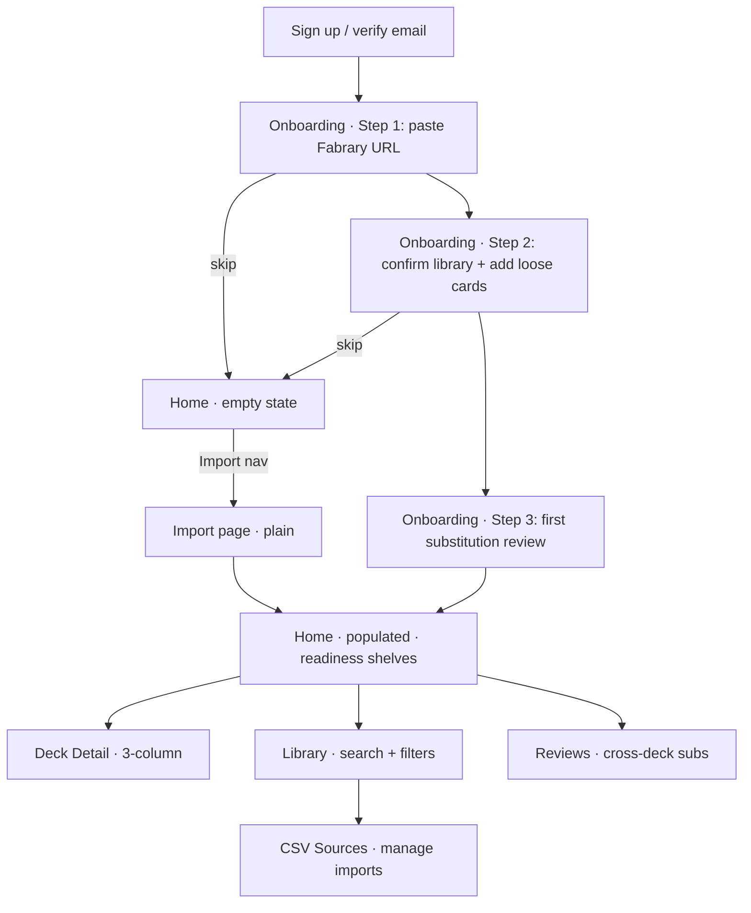
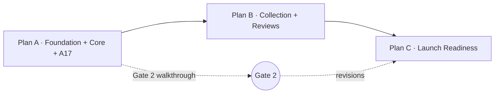

> **Validation language in this brainstorm is retired.** References to
> "Gate 2 walkthrough", "3-5 Cúpula DT testers", "in-person observation
> session", and "A17 labeler session" describe a ceremony that was
> replaced on 2026-04-21 by automated/self-validation primitives (E2E
> tests, telemetry, dev-browser self-loop, visual regression). The
> authoritative source is [docs/validation-philosophy.md](../validation-philosophy.md).
> The problem framing and requirements below remain valid; only the
> release-gate semantics are obsolete.

# Rathe Arsenal v1 Visual Identity + UX

## Problem Frame

Rathe Arsenal works functionally (Phase 1a + variant-aware shopping line merged) but has no visual identity or coherent UX — routes use inline styles, flat information architecture, and a bare `/onboarding` form. Gate 2 (Phase 1b Unit 7) requires an in-person walkthrough with 3–5 Cúpula DT players to validate substitution accuracy; without visual hierarchy, guided onboarding, and a coherent navigation model, testers will hit friction before the engine's accuracy can be measured.

This work establishes (a) the locked visual system, (b) a technical refoundation (inline styles → Radix UI + CSS Modules reading from tokens), (c) new surfaces that fill obvious gaps (Library browse, CSV sources management, cross-deck substitution review), and (d) flow redesigns (3-step onboarding wizard, readiness shelves on home, 3-column deck detail). All decisions are grounded in an exported design bundle saved under `docs/design/v1/` — that bundle is the binding reference for implementation fidelity.

## User Flow (first-time authenticated user)

Note: per R60, the Import nav item routes returning users to the plain Import page (K), not back into the onboarding wizard (B). The wizard runs only on first authentication with zero tracked decks.

## Home Readiness Shelves (R20)

| Shelf | Range | Treatment | Primary CTA |
|---|---|---|---|
| Ready to play | ≥80% | Brass ring + "play-ready" badge | Open deck |
| Almost there | 50–80% | Muted brass + shopping nudge | See what's missing |
| Needs collection | <50% | Subdued red stripe | Review subs / Import |

## Requirements

### Visual System (locked from `docs/design/v1/`)

- R1. Design tokens from `docs/design/v1/tokens.css` become the single source of truth for colors, type, spacing, radii, shadows, transitions. Implementation lands tokens at `apps/web/src/styles/tokens.css` loaded globally before any component CSS.
- R2. Typography: **Cinzel** (display 400–900) + **Cinzel Decorative** (ornament, reserved for the readiness-number signature moment only) + **UnifrakturCook** (the "Rathe" wordmark moment) + **IBM Plex Sans** (UI/body) + **JetBrains Mono** (meta/code). Loaded via Google Fonts with `preconnect` + `font-display: swap`.
- R3. Wordmark primary: `docs/design/v1/assets/logo-wordmark.svg` (UnifrakturCook "Rathe" + letter-spaced "ARSENAL"). Logo-mark secondary (deckbox SVG) used in favicon, compact mobile header, and as auth-page decoration anchor.
- R4. Palette: brass `#c5923a` primary accent, ember `#b44a2e` ornamental, canvas `#0c0d10` (dark) / `#f5f1e8` (light, parchment). Readiness semantics: high `#6ea968`, mid brass, low `#c0574a`. FaB pitch colors (R/Y/B) preserved per theme, desaturated on dark.
- R5. Theme: dark default, light via `[data-theme="light"]`. Toggle in Settings, **persisted server-side** in a new user-settings endpoint (follows the user across devices). A new `GET/PATCH /api/users/me/settings` endpoint exposes `{ theme: 'dark' | 'light' }`. localStorage is used only as a pre-hydration hint to avoid flash-of-wrong-theme; the server value wins on auth response.
- R6. Radii tight (2–4 px) — architectural, never "soft app". Pills reserved for badges only.
- R7. Signature readiness treatment (`.ra-readiness-display`): Cinzel Decorative 900, tabular numerals, brass — reserved strictly for the primary % number on deck detail and deck cards. Never reused elsewhere.

### Technical Stack

- R8. Component primitives: **Radix UI** (`@radix-ui/react-*`) installed per-primitive. No shadcn/ui, no Tailwind.
- R9. Styling: **CSS Modules** per component, reading tokens via `var(--ra-*)`. Zero inline `style={{}}` in `apps/web/src/` is the **end state of Plan C** (lint rule as error); Plans A and B may use inline styles on new surfaces pending the Plan C enforcement (see Success Criteria phased rollout). Design-file prototypes in `docs/design/v1/*.html|*.jsx` are reference-only — their Babel-standalone runtime and inline styles must not bleed into the app regardless of phase.
- R10. Card art (R47–R49) implemented as a reusable `<CardArt>` React component, internal SVG, prop-driven (pitch, type, cost, name, **missing** — where `missing=true` triggers the not-owned hatch overlay, matching R48). Lives in `apps/web/src/components/card-art/`.
- R11. SVG logos imported via `?react` (vite-plugin-svgr) or inline `<svg>` components, so stroke/fill inherit `currentColor` for theme-awareness.

### Shell & Navigation

- R12. Authenticated shell: top bar with wordmark (desktop) / logo-mark (mobile), primary nav, theme toggle, user menu.
- R13. Primary nav: **Home · Library · Import · Reviews**. Deck detail reached via home/library drill-down. CSV Sources lives as a sub-page under Library (reached via "Manage CSVs" button on the Library page), not at nav level — it names a data-management mechanism, not a user task, and would mismatch the vocabulary of the other items. Settings lives under the user menu. *(revised 2026-04-27 in Plan C, Unit 9: nav simplified to **Home · Library · Reviews** — 3 items. The "track a new deck" task moves to a Home CTA routing to `/add-cards/fabrary`. The `/import` route is deleted. `/add-cards/*` hub remains reachable via the Home CTA, Home empty-state CTA, and a new "Add cards" button on the Library page.)*
- R14. Auth routes: split-panel layout — deckbox decoration + brand story left (40–50%), form right. Stacks vertically below 720 px, hiding the decoration.
- R15. Mobile primary nav: **bottom tab bar** with 4 items (Home · Library · Import · Reviews). Tab targets ≥ 64 px wide at 320 px viewport, icons + short labels. Hamburger drawer avoided due to worse discoverability for a tool used presencial at Gate 2 walkthroughs.

### Onboarding (3-Step Wizard)

#### Wizard content (R16–R19)

- R16. Step 1 — Paste Fabrary URL(s). Multiple URLs accepted; "Skip for now" visible. Inline validation distinguishes: invalid URL format (instant), unreachable URL (after 5 s timeout), private deck (specific copy), and non-FaB deck (specific copy).
- R17. Step 2 — Confirm library. Shows ingested card count per deck + an expandable preview grid using `<CardArt>`. Inline autocomplete for adding loose cards the user owns but no deck references.
- R18. Step 3 — First substitution review. Present 1–3 real substitutions from imported decks with Approve / Reject / Reset-to-pending controls (explicit 3-state model from R26). Teaches the substitution mental model before landing on home. **Loading state**: while the engine computes substitutions for freshly-imported decks, step 3 renders a skeleton + "Computing your first substitutions…" copy (typical latency 1–3 s; timeout at 10 s with a "Continue without review" fallback). **100%-readiness fallback**: when every imported deck has raw readiness = 100% and no substitutions exist, step 3 is replaced (in-place, same wizard shell with step indicator showing 3 as complete) by a congratulation surface: brass `◆` ornament + heading "Everything's already playable" + subcopy "Welcome to your arsenal." + a single primary CTA "Go to my decks" that routes to `/home`. The congratulation surface does not auto-dismiss; the user clicks the CTA.
- R19. Skip is available on every step without data loss. Skipped users land on the populated home if any decks were imported, or the empty home state otherwise.

#### Routing guards

- R60. Returning-user routing: the `/onboarding` route runs the wizard only for users with zero tracked decks. Users with any tracked decks who hit `/onboarding` are redirected to `/import` (the plain Import page, not the wizard). Primary-nav "Import" always routes to `/import`, never the wizard. *(revised 2026-04-27 in Plan C, Unit 9: with `/import` deleted, the redirect target changes to `/add-cards/fabrary`. The "Primary-nav Import" nav item is removed; no nav item routes to the wizard.)*

### Home (Readiness Shelves)

- R20. Default layout: readiness shelves (see table above). Shelf headers use eyebrow style with shelf count. **Empty shelves are suppressed entirely** — no empty shelf headers render. When all tracked decks fall into a single shelf, only that shelf renders; the educational empty state (R22) applies only when the user has zero tracked decks. **Deck card action hierarchy at 320 px**: View is the primary action (full-width brass CTA or tap target); Untrack demotes to an overflow menu (⋮) or a secondary icon action at that breakpoint. Two equal-weight actions side-by-side are explicitly avoided. At ≥ 640 px the two actions can sit side-by-side.
- R21. Alternate layout: flat grid (user preference, persisted; design-file tweak already models this).
- R22. Empty state: educational — explains what "tracking a deck" means, what readiness measures, with prominent Import CTA and optional skip into Library.
- R23. Aggregate shopping line callout below shelves preserved from current behavior; styled to match `--ra-accent-soft-bg` + brass stroke.
- R23a. Populated-home hero (top of page, above shelves): shows 3 headline stats (tracked decks / average readiness / cards missing across decks) but **not as 3 identical pill cells**. Differentiated treatment — the primary actionable stat (cards missing) uses the signature brass; the other two use subdued secondary treatment. This avoids the generic-SaaS-dashboard look.

### Deck Detail (3-Column)

- R24. Desktop layout (≥960 px): three columns — (A) readiness hero with signature display + raw/subs/missing breakdown; (B) substitutions list + exact matches grid + not-owned list; (C) sticky shopping panel with Path A / B / C tabs, variant breakdown, store product links.
- R25. Mobile layout (<960 px): single column stack. Shopping panel collapses to sticky footer bar with expand-to-full gesture. Breakdown sections use progressive disclosure.
- R26. Substitution row: grid layout with red stripe (missing original) + gold stripe (proxy), tier diamond badge, confidence bar, rationale prefixed with ◆, `<CardArt>` on both sides. **Explicit 3-state decision model**: each substitution is in one of three states — `pending` (default, user has not decided), `approved` (user explicitly agrees with the engine's proxy), `rejected` (user disagrees, slot reverts to raw/missing). Row actions: **Approve (✓)**, **Reject (✕)**, **Reset to pending (↺)**. All three states are toggleable at any time — a user who approved can later reject, and vice versa. A "Reviewed" badge renders on any row in approved or rejected state. Deck-level banner: when any substitution on a deck is rejected, a **"Modified view" banner** renders at the top of the deck detail with a **"Clear rejections"** action — this specifically resets rejections to pending (approvals on the same deck are preserved; "modified view" means "you changed what the engine suggested," and only rejections constitute a change). The ↺ symbol is reserved for the row-level and bulk-level Reset-to-pending actions (R39) which clear any decision (approved or rejected) — distinct from the deck-level banner's rejections-only scope. A "Modify" action (swapping the suggested proxy for a different card) is deferred to Phase 1c.
- R27. Exact matches: compact card grid via `<CardArt size="sm">` with quantity overlay.
- R28. Not owned: list rows with `<CardArt size="xs">` thumbnail + card name + "Mark owned" quick action.
- R61. Substitution decision persistence: optimistic client update with auto-save. Approve and Reject actions issue `POST` upserts to `substitute_decision`; Reset-to-pending issues `DELETE` (pending = absence of a record per R62a). No "Save changes" CTA. On backend failure, the optimistic update reverts and a non-blocking error toast is shown (R59). Burst handling: when the user performs N decisions in rapid succession (e.g., bulk action on Reviews), writes are queued and batched; a single consolidated error toast describes N failed writes with a "Retry all" action rather than N cycling toasts.
- R62. "Mark owned" (R28) writes to the user's global library — adding 1 copy of the card via the same API path as the Library search-add (R29). The card vanishes from the deck's not-owned list and triggers a readiness recalculation via TanStack Query invalidation of the `decks` and `deck-detail` keys so home shelves and deck detail update without manual reload. Ownership is always global (never per-deck).
- R62a. **Backend — `substitute_decision` table**: `{ id, userId, trackedDeckId, cardIdentifier (the missing original), decision: 'approved' | 'rejected', createdAt, updatedAt }`. FK column is `trackedDeckId` (references `tracked_deck.id`) for consistency with `rejected_substitute`, `deck_card`, and `deck_readiness_snapshot`. `pending` is the absence of a record. Endpoints: `GET /api/decks/:trackedDeckId/decisions` (per-deck), `GET /api/reviews` (cross-deck aggregate for R38), `POST /api/decks/:trackedDeckId/decisions` (single upsert), `POST /api/reviews/bulk` (bulk upsert + reset), `DELETE /api/decks/:trackedDeckId/decisions/:cardIdentifier` (reset to pending). Readiness computation reads this table to determine whether a proposed proxy applies (approved or pending) or reverts to missing (rejected). This supersedes the existing `rejected_substitute` entity.

  **Data migration (Plan A backend track)**: None — the product has no users in production yet (pre-launch). Plan A drops the `rejected_substitute` table and creates `substitute_decision` from scratch in the same migration. No data preservation, no banner, no user-facing compatibility concerns.

  **Code callsite migration**: The 5 existing callsites that read `rejected_substitute` — `ReSolveService.loadExclusions`, `CollectionService.markOwned`, `CollectionService.addCard`, `DecksService.listForUser` auto-recompute, `DecksService.getDetail` rejectionCount — are updated atomically in a single Plan A commit alongside the schema change. `DecksService.listForUser` and `getDetail` auto-recompute paths are explicitly fixed to load decisions as the exclusion set, closing the existing exclusion-ignoring bug in the same change.

  **Audit trail for Phase 2**: The `decision` column is the terminal state and is overwritten on each upsert (no trajectory history). If the Phase 2 learning loop (parent doc R25) needs transition history, a companion `substitute_decision_history` table (append-only: `{ id, substitute_decision_id, decision, at }`) will be introduced then — not pre-designed in v1, since Phase 2's architecture hasn't been defined. This is acknowledged as a potential breaking migration at Phase 2 time; the v1 terminal-state model is intentional for simplicity.

### Library

- R29. Owned-cards primary surface. Search-by-name input with autocomplete dropdown using `<CardArt size="xs">`; selecting adds to library.
- R30. Filters: pitch (R/Y/B/colorless), type (attack/defense/instant/equipment/ally/weapon/hero/etc.), set.
- R31. Grouping: by type (default), by pitch, by set, flat.
- R32. Stats bar (top of page): unique cards, total copies, R/Y/B breakdown, estimated value (from scraped prices when available).
- R33. This surface replaces the current `/_auth/home` inline autocomplete as the primary library entry-point. "Add loose cards" on home links here.

### CSV Sources (Library sub-page)

Accessible from the Library page via a "Manage CSVs" action. Not a primary-nav destination (see R13).

- R34. List of imported CSVs: filename, user-assigned label, card count, import date, status (active/inactive). Requires new backend entity `csv_source` and per-source membership on `collection_card` (see R37b for the entity schema; R37a for the double-import prevention flow).
- R35. Toggle active/inactive per source. Inactive sources don't count toward library totals or readiness calculations. Backend: active flag on `csv_source`, readiness/library queries join and filter.
- R36. Explainer panel: visual diagram + one-paragraph copy making clear duplicates across sources are **summed, not overwritten** (e.g., 4 copies in CSV-A + 2 in CSV-B = 6 owned). This addresses a known mental-model confusion.
- R37. Delete source action with two-step confirmation showing the card-count impact ("Deleting 'sideboard.csv' will reduce your library by 47 cards — 3 decks will drop in readiness. Type DELETE to confirm.").
- R37a. **Duplicate + delta-import detection**. Content hash is computed as SHA-256 of the CSV normalized as `(cardIdentifier, quantity)` pairs sorted by `cardIdentifier` + UTF-8-encoded + newline-joined (ignores column ordering, extra metadata columns, and row-order changes). On upload, the system detects one of three relationships to existing active sources for this user:

  1. **Exact match** (normalized hash identical to an existing active source) → the file has been re-uploaded unchanged. Import flow pauses with actions: (a) **Replace existing source** (delete the prior source, import as fresh — the default), (b) **Import as separate copy** (rename and keep both), (c) **Cancel**.
  2. **Partial overlap** (Jaccard similarity of `(cardIdentifier)` sets ≥ 0.5 with an existing active source, but hash differs — i.e., same logical source with deltas) → the file is likely a monthly update. Import flow pauses with the preferred action **Update existing source "<label>"** as the primary CTA, showing a preview: *"+ 12 new cards, 3 cards increased in quantity, 1 card decreased, 0 removed."* Secondary actions: **Replace existing source** (discard old, import new as fresh), **Import as separate copy** (treat as independent source), **Cancel**. The "Update" action merges: new cards are added, quantities are set to the new CSV's values (not summed with prior — this is an update, not additive), removed cards are deleted from this source's contribution.
  3. **No significant overlap** (Jaccard < 0.5 with every existing source) → the file is a genuinely new source. Import proceeds without prompt, assigned a new `csv_source` row. User can label it post-import in CSV Sources page.

  The Jaccard threshold (0.5) is a starting point and tunable during Plan B based on real user CSV behavior.
- R37b. **Backend — `csv_source` entity**: `{ id, userId, filename, label (nullable user-assigned), contentHash, cardCount, active: boolean, createdAt }`. `collection_card` gains `sourceId` FK (nullable for legacy rows pre-migration) and library queries sum quantities across active sources.

### Review Substitutions (Cross-Deck)

- R38. Single page aggregating **all substitutions** across all tracked decks, partitioned by decision state (R26): `pending` (never reviewed), `approved` (explicit ✓), `rejected` (explicit ✕). Default view prioritizes pending rows at the top; approved/rejected rows accessible via filter or tab. This surfaces the user's review backlog without hiding prior decisions — a returning user can see "here's what you haven't looked at" and "here's what you approved last session, in case you changed your mind".
- R39. Bulk actions: **Approve selected**, **Reject selected**, **Reset to pending (↺)**. Each writes to the `substitute_decision` table (see R62a) with the user's explicit choice. "Reset to pending" clears an existing decision back to unreviewed.
- R40. Filters: by decision state (pending / approved / rejected / all), by tier (1 / 2 / 3), by deck, by hero, by confidence range.
- R41. Empty state: when the user has zero substitutions across all decks (rare — all decks at Path A), render "No substitutions in any deck — all playable as written" with link back to home. When all substitutions have been reviewed (pending count = 0 but approved/rejected exist), render "Caught up — you've reviewed every pending substitution" with links to the approved and rejected tabs.

### Auth Flow

- R42. Sign-in, sign-up, forgot password, reset password, check-your-email, verify-email share the split-panel template from R14.
- R43. Post-signup (or post-verify-email) routes automatically into the onboarding wizard (R16).
- R44. Error states (rate-limit messages, invalid credentials, expired tokens) upgraded to match visual system — currently plain-text inline errors.

### Settings

- R45. Sections: Profile (email, display name), Theme toggle, Account (password change, delete).
- R46. Delete-account modal keeps current behavior (password + checkbox gate) with restyled surfaces.

### Card Imagery (`<CardArt>`)

- R47. Renders stylized SVG card face: pitch-colored frame (R/Y/B/colorless), type-specific glyph, cost diamond (top-left), pitch pip (top-right), name band (Cinzel 600), missing-hatch overlay when `missing=true`. **Data source (backend change)**: `IBreakdownEntry` (both engine and API DTOs) is enriched to include `pitch: 1 | 2 | 3 | null`, `cost: number | null`, `type: string` (mapped from `types[0]`). Deck and library payloads then carry the fields natively; `<CardArt>` receives them as props and does not fetch. This avoids per-card catalog calls (rate limited). No legacy snapshot migration is needed — the product has no users, so existing snapshots (from dev's own decks) are disposable and can be regenerated on next read by clearing them.
- R48. Sizes: `xs` 40 px, `sm` 72 px, `md` 120 px, `lg` 200 px. Props: `{ name, pitch, cost, type, missing, size }`. The overlay uses a diagonal stripe pattern + reduced opacity (not a red "error" treatment) so it reads as "not in collection" rather than "something went wrong". Prop name aligned with prototype (`missing`, boolean true-triggers-overlay) to avoid the requirements-vs-prototype inversion that earlier drafts had.
- R49. Used in: deck detail (exact/not-owned/subs), library grid, review subs, onboarding step 2/3 preview. Sizes per surface: `xs` in not-owned list + autocomplete dropdown; `sm` in exact-matches grid + substitution row + library grid; `md` in onboarding step 2 preview; `lg` reserved for a future card-detail popover (Phase 1c).

### Responsive

- R50. Paridade real desktop + mobile. Breakpoints: 640 / 960 / 1280 px (to be codified as CSS custom properties).
- R51. Mobile primary nav: bottom tab bar (resolved — see R15).
- R52. Touch targets ≥ 44×44 px everywhere interactive.

### Accessibility

- R53. Text contrast ≥ WCAG AA on both themes. Known failures that require tone-adjusted tokens before ship:
  - **Dark**: `--ra-accent` (`#c5923a`) on `--ra-bg-canvas` ≈ 4.2:1 — passes AA large text only; body-size uses need either a darker canvas companion token or a brighter accent companion. `--ra-fg-secondary` on `--ra-bg-canvas` ≈ 3.8:1 — fails AA body, needs tone adjustment.
  - **Light**: `--ra-accent` (`#c5923a`) on `--ra-bg-canvas` (`#f5f1e8`, parchment) ≈ **2.47:1** — fails AA at every size. Light theme requires a divergent interactive accent (the existing `#8f6a22` from the light block is the right base, but verify every interactive use-site). This is a ship-blocker for Plan C.
  - Planner delivers a full contrast matrix (all fg/bg pairs × both themes) at Plan A foundation-track kickoff; tone-adjusted tokens for dark theme land before any core surface ships; light-theme adjustments land in Plan C.
- R54. All interactive elements keyboard-navigable (Radix provides most; verify custom components).
- R55. `:focus-visible` uses a 2 px brass outline with a 2 px transparent gap offset — ensures visibility even on brass-colored buttons/borders where a zero-offset brass ring would disappear. Same treatment across buttons, links, inputs, tabs.
- R56. Respects `prefers-reduced-motion` — disables transitions on shelves, sub rows, panel expand.
- R57. Semantic landmarks: `<header>`, `<nav>`, `<main>`, `<aside>` (for shopping panel), `<footer>`.

### Educational Empty States

- R58. Every surface with a possible empty state ships educational copy (not just "nothing here"). Surfaces covered: home (no decks), home (no subs-needed decks), library (no cards), CSV sources (no imports), review subs (all caught up), deck detail (raw 100%). No coach marks, no tours.

### Loading & Error States

- R59. Loading and error states — minimum coverage per surface:
  - **Import (Step 1 → Step 2 transition)**: loading spinner + "Fetching deck from Fabrary…" while the URL is being parsed. Error states distinguish invalid URL format (inline, instant), unreachable URL (after 5 s timeout), private deck (specific copy), non-FaB deck (specific copy), and partial-batch failure when one of multiple URLs fails (the successful imports proceed; the failed one shows inline for retry or skip).
  - **Deck detail (3-column)**: skeleton placeholder per column independently. Column C (shopping panel) shows its own skeleton while scraper data loads; when scraper data is unavailable or stale > 24 h, renders a neutral fallback ("Stock data unavailable — try refreshing") with a manual refresh action.
  - **Home shelves**: skeleton matching the shelf layout while decks load (mirrors the approach already used in `apps/web/src/routes/_auth/home.tsx`).
  - **Library**: skeleton card grid while the collection loads; error state with retry for fetch failures.
  - **Reviews (cross-deck)**: loading skeleton for the aggregated list; empty state if no pending subs exist.
  - **Global error toasts**: non-blocking `<Toast>` surface for optimistic-update failures (R61, R62, etc.). Auto-dismiss after 5 s. Accessibility contract: `aria-live="polite"` on the toast region (non-interrupting announcement); timer pauses while the toast has keyboard focus or pointer hover (WCAG 2.2.1 user control of timing); dismissing a toast returns focus to the element that triggered the failed action. For burst failures (see R61), consolidate into a single toast describing N failures with a "Retry all" action — never stack more than one toast at a time.

## Success Criteria

Gate 2 validates **behavior + comprehension**, not just politeness. Absence of questions is not evidence of understanding — testers who are personal contacts of the dev over-index on social desirability (explicit precedent in the parent doc 2026-04-08 Phase 0 exit gate).

**Task completion**
- 3–5 Cúpula DT testers complete sign-up → onboarding → first deck readiness → shopping line without the dev explaining any screen mid-flow.
- First-time user completes onboarding or intentionally skips within 3 minutes (observed).

**Comprehension check (post-walkthrough, 3 open questions)**

Each question is scored independently. Pass bar per question: **≥ 80% of testers who completed the walkthrough** (denominator = actual completer count, not a fixed integer). With 5 completers the bar is ≥ 4/5; with 4 it's ≥ 4/4 (unanimous); with 3 it's ≥ 3/3 (unanimous — and the walkthrough should target 4+ completers precisely because 3 leaves no tolerance).

- **Q1 — Readiness concept**: "What does the readiness percentage mean to you?" Correct answer names effective readiness (including substitutions), not raw ownership.
- **Q2 — Shopping path**: "If you wanted to buy the missing cards, what would you do next?" Correct answer names the shopping panel, shopping line, or equivalent. *Mitigation for panel-discoverability bias*: during the walkthrough, ensure every tester encounters the deck detail scrolled to a state where the shopping panel (desktop column C or mobile expanded footer) is visible at least once.
- **Q3 — Substitution model**: "If you rejected a substitution on one of your decks, what would happen to your deck's readiness number?" Correct answer names that readiness would drop (because the proxy no longer counts toward coverage). Tests whether the 3-state model was internalized, not just which buttons exist.

**Behavioral signal (mirrors parent doc Phase 0 exit gate)**
- ≥ 2/5 testers return to the app unprompted within 7 days of the walkthrough, OR
- ≥ 2/5 testers add ≥ 5 loose cards via the autocomplete/library unprompted during or after the walkthrough.

**Implementation quality**
- All routes render coherently in both themes with no visual regressions between 320 px (mobile min) and 1440 px (desktop reference).
- Inline `style={{}}` usages reduced to zero in `apps/web/src/` by end of Plan C (relaxed for new surfaces in Plans A and B — see Plan Separation).

**Revision trigger (operationalized)**

The trigger fires when **all three** conditions are met:

1. **Threshold**: ≥ 2 out of 5 testers independently raise the same IA/layout problem on the same surface (a single tester's idiosyncratic confusion does not trigger; concurrent matching confusion from two or more does). "Independently" means without prompting from the dev or from each other.
2. **Scope cap**: the revision applies only to the specific requirement(s) governing the named surface — not to adjacent surfaces, not to the global navigation, not to the visual system. Example: home shelf labeling confuses 3/5 testers → revise R20/R21; do not reopen the onboarding wizard or nav structure.
3. **Time bound**: revisions triggered by Gate 2 must be captured as specific requirement edits within **5 business days** of the walkthrough (while tester recall and dev's own observations are fresh). Findings not edited into requirements within that window are demoted to Phase 1c backlog — not held as open public-launch blockers.

**Evaluator independence**: the solo dev runs the walkthrough but **does not single-handedly decide** whether a finding meets the threshold. A second evaluator — a Cúpula DT member or a remote peer reviewer — is shown the tester quotes (anonymized verbatim) within 24 h of the walkthrough and independently confirms whether ≥ 2 testers named the same issue. This mirrors the parent doc's Gate 4 second-labeler discipline and mitigates the evaluator-incentive bias that the "absence of questions" criterion would otherwise reinstate.

The "adopt design file wholesale" posture is cancelled — the design file is a hypothesis validated (or revised) on Gate 2 evidence via this mechanism.

## Scope Boundaries

- **Landing page**: removed from scope (user: "não precisamos de landing page"). Unauth access to `/` redirects to `/sign-in`. The design file's LandingPage prototype is a reference for potential Phase 1c reintroduction, not a v1 deliverable.
- **Discover** (Fabrary trending ingest): Phase 1c.
- **PT-BR autocomplete** on cards: Phase 2.
- **Fallback mode "3 closest decks"** (parent doc 2026-04-08 R9 — empty + some collection): Phase 1c.
- **Historical readiness chart** (parent doc 2026-04-08 R27): Phase 1c.
- **Sbrauble scraper expansion to other Pelotas stores**: Phase 2.
- **Feedback learning loop on substitutions** (parent doc 2026-04-08 R25): Phase 2.

## Key Decisions

- **Design file is a hypothesis, not a veto** (revised 2026-04-19): `docs/design/v1/` is the target experience hypothesis. Requirement prose is authoritative when it diverges from the prototype (the prototype is a sketch that informed the requirements, not a spec). Gate 2 evidence is the authority that revises requirements themselves — see Success Criteria "Revision trigger".
- **Radix UI + CSS Modules** over shadcn/ui+Tailwind or CSS-in-JS: user prefers CSS "de verdade" and dislikes Tailwind class verbosity.
- **Cinzel** as default display face (not Fraunces from v1 proposal): validated through design-file iteration; fabtcg.com mood mapped more faithfully.
- **Gothic Duality wordmark** (UnifrakturCook "Rathe" + letter-spaced "ARSENAL") paired with a **deckbox SVG logo-mark**: chosen over Vault Mark / Blade Cut / Seal+Monogram.
- **Dark default with light toggle**: avoids closing the future door on light mode; tokens derive both themes.
- **Paridade real desktop + mobile**: chosen over mobile-first or desktop-first; Gate 2 testing will include both form factors.
- **Readiness shelves replace flat grid** as default home layout.
- **Review Substitutions** becomes a first-class nav item: surfaces a hidden-until-now user task (cross-deck sub review that today requires clicking into each deck).
- **Library** (not "Collection") as the canonical name for the owned-cards surface: "Collection" has narrower connotation; "Library" matches "library of cards you've built up". The design file's `CollectionPage` prototype is superseded by Library — there is no separate Collection route in v1.
- **CSV Sources as sub-page under Library** (2026-04-19, from design-lens review): avoids vocabulary mismatch in the primary nav (the four nav items name user tasks/content types; "CSV Sources" would be the odd one out as a data-management mechanism). The prototype already treats it as such (back-link to Library, "Manage CSVs" button on the Library page).
- **Mobile primary nav = bottom tab bar with 4 items** (Home · Library · Import · Reviews): chosen over hamburger drawer for better discoverability during presencial Gate 2 walkthroughs. Unblocked by the CSV Sources decision above (4 items fit comfortably at 320 px).
- **Substitution "modify" action deferred to Phase 1c**: the card-picker UI required to swap a proposed proxy for a user-selected alternative is non-trivial and out of v1 scope. V1 ships the explicit 3-state model only.
- **Explicit 3-state substitution model** (revised 2026-04-19): `pending` / `approved` / `rejected`, all toggleable at any time. Replaces the earlier implicit-approve model, which conflated "never reviewed" and "reviewed and kept" — the user explicitly requested the ability to approve substitutions and later remove approvals if desired. Backed by a new `substitute_decision` table (R62a). Reviewed rows carry a visible badge; unreviewed rows stand out for the user's attention.
- **Optimistic-with-auto-save + batched burst handling**: each decision writes individually on single-row actions; bulk actions batch into a single queued write with consolidated error handling. Never stack multiple error toasts.
- **Cross-stack scope acknowledged**: this work spans frontend, backend, and engine layers deliberately. See Plan Separation for how the surfaces are sequenced. The earlier "frontend-only" framing is cancelled.
- **Plan separation over single-plan execution**: the scope is large enough that a single `/ce:plan` run would produce an unwieldy 60+ unit plan. The work divides into 3 sequenced plans (A–C) that land incrementally while shipping a coherent product at each boundary. See "Plan Separation" section.

## Plan Separation

The full scope (visual system + 14 routes + 3 new surfaces + backend enrichment + new entities + explicit decision model + light theme + a11y + polish) is too large for a single `/ce:plan` execution. It divides into 3 sequenced plans. Each ships a coherent product increment; Gate 2 walkthrough becomes possible at the end of Plan A.

### Plan A — Foundation + Core Experience + A17

Everything needed for a Gate 2 walkthrough. Combines design system, backend data foundation, the substitution mental model, and the three primary surfaces testers exercise (onboarding → home → deck detail).

**Foundation track (frontend + a11y)**
- R1–R11 — tokens.css at `apps/web/src/styles/`, fonts, Radix install, `vite-plugin-svgr`, CSS Modules infra.
- R12 + R14 + R42–R46 — authenticated shell, auth split-panel restyle, settings restyle.
- R15 + R50–R52 — mobile bottom tab bar, responsive breakpoints.
- R53 — contrast matrix delivered + dark-theme tone-adjusted tokens (hard gate before any populated surface ships; known offenders: `--ra-fg-secondary` at 3.8:1 and brass body-size uses of `--ra-accent`). Light-theme tone adjustments land in Plan C.
- R54–R57 — a11y foundation (keyboard nav, focus-visible, reduced-motion, landmarks).
- R59 — toast + skeleton primitives (framework + consumers in the core surfaces below).

**Backend track (data + engine)**
- **A17 tier-2 gold-set validation** (parallel, blocking core-surface ship): fresh tier-2 labeling round with a domain-competent labeler (not the dev) against ~30 tier-2 suggestions. Pass threshold ≥ 60% acceptance. If A17 fails, engine constants revise before the deck detail UI ships to Gate 2 testers. Estimated 1–2 h labeling + potential 1 day engine revision.
- `IBreakdownEntry` enrichment (pitch/cost/types[0]) in engine + API DTO. Truncate `deck_readiness_snapshot` as part of the migration (no users to preserve).
- Expose `aggregateShoppingLine` from `GET /api/decks` (wire existing `ShoppingLineService.computeAggregate` into `DecksService.listForUser`). Reconcile field name: pick `completableDecks` (update API DTO to match frontend).
- `substitute_decision` table + endpoints. Drop `rejected_substitute` (no users). Update 5 callsites atomically. Engine readiness reads new table. Fix auto-recompute exclusion bug.
- `GET/PATCH /api/users/me/settings` endpoint + migration. Sign-in auth response extended with `settings: { theme }` so the shell renders correct theme on first paint.

**Core surfaces track (frontend)**
- R10, R47–R49 — `<CardArt>` component (full version using enriched data).
- R16–R19 + R60 — Onboarding 3-step wizard (loading states + 100%-readiness congrats surface).
- R20–R23a — Home readiness shelves + populated hero + empty state + aggregate callout.
- R24–R28 — Deck detail 3-column (readiness hero, substitutions with explicit 3-state rows, exact matches grid, not-owned list).
- R61 + R62 — optimistic persistence + TanStack Query invalidation.

**Plan A outcome**: Gate 2 walkthrough executable. Core flow signup → onboarding → home → deck detail → shopping is live, styled, and accessible. Testers form their first impression against this version.

### Plan B — Collection + Reviews

The two returning-user surfaces. Independent of A's core flow once A's backend schemas land.

**Backend**
- R37a–R37b — `csv_source` entity + endpoints, `collection_card.sourceId` FK, normalized-content-hash detection, delta-import Jaccard flow.
- Unique index change on `collection_card` (drop `(userId, cardIdentifier)`, add `(userId, cardIdentifier, sourceId)`; `sourceId` NOT NULL from day one).
- `CollectionService.addCard`/`markOwned` become source-aware.
- Library stats endpoint (unique/copies/RYB/estimated value — `store_stock` join).
- `GET /api/reviews` cross-deck aggregate endpoint.
- `POST /api/reviews/bulk` batched writes.

**Frontend**
- R29–R33 — Library page (search, filters, grouping, stats).
- R34–R37 — CSV Sources sub-page (list, toggle, delete with impact preview, explainer, duplicate + delta-import prevention flow).
- R38–R41 — Reviews cross-deck page (pending / approved / rejected partitioning, bulk actions, filters).

**Plan B outcome**: feature-complete v1. Library replaces the home autocomplete; CSV management is self-serve; cross-deck substitution review is a first-class surface.

### Plan C — Launch Readiness

Light theme + polish + final a11y + Gate-2-driven revisions (if any).

**Frontend**
- R5 light theme — divergent interactive accent for parchment (`#8f6a22` base, per-surface verification). User-settings persistence wired end-to-end.
- R58 + R59 completion — every surface ships its educational empty state + loading/error state.
- Polish Notes items: themed numbered steps in onboarding, Path A/B/C tab treatment.
- Lint rule promoted: zero inline `style={{}}` in `apps/web/src/` as error.
- Gate 2 revisions (if the Success-Criteria revision trigger fired): apply the specific requirement edits within the 5-day time bound.

**Plan C outcome**: production-ready v1.

### Dependency graph

Plan A → Plan B → Plan C is strictly sequential. Gate 2 walkthrough runs at the end of Plan A against the core experience. If the revision trigger fires, revisions feed into Plan C (or back-port into B if they affect Library/Reviews surfaces already in flight).

**On parallelism inside plans**: Plan A has three tracks (foundation / backend / core surfaces) that have dependencies — backend data foundation must land before CardArt can render enriched cards, dark-theme contrast tokens must land before the core surfaces ship. Solo-dev execution should interleave rather than strict-parallel. The planner decomposes each Plan into units with explicit dependencies; no synthetic "parallel track" claim this time.

## Dependencies / Assumptions

- `docs/design/v1/tokens.css` + `assets/*.svg` are the design source; the requirements in this doc are the authoritative product contract when prose and prototype disagree (the design file is a reference, not a veto on requirement prose).
- Radix UI primitives to add to `apps/web/package.json`: at minimum `react-dialog`, `react-dropdown-menu`, `react-tabs`, `react-tooltip`, `react-popover`, `react-toggle-group`, `react-alert-dialog`, `react-toast`, `react-scroll-area`, `react-separator`, and a select solution (either `@radix-ui/react-select` — the Radix primitive, not the unrelated `react-select` npm package — or a Combobox from another headless library). Planner to enumerate final list.
- `vite-plugin-svgr` to be added to `apps/web/package.json` and registered in `apps/web/vite.config.ts` before `?react` SVG imports work. Known to be compatible with Vite 6 + React 19 as of v4.3.0+.
- **Scope spans both frontend and backend.** This work deliberately crosses layers: `IBreakdownEntry` enrichment (pitch/cost/types), `aggregateShoppingLine` exposure on `GET /api/decks`, a new `csv_source` entity + per-source membership tracking, a cross-deck reviews aggregate endpoint, an explicit `substitute_decision` table for the 3-state approve/reject/pending model, and a user-settings endpoint for theme persistence. The "frontend-only" scope assumption from the first draft is explicitly revoked — we build what the target experience requires regardless of layer.
- The existing route structure under `apps/web/src/routes/` stays intact — restyled and extended, not replaced. New routes (Library, CSV Sources, Reviews) are added.

## Outstanding Questions

### Resolve Before Planning

_None — all prior blocking questions resolved in Key Decisions above._

### Deferred to Planning

_These now belong to specific plans (A–C) per Plan Separation above. Listed here for cross-reference._

- [Affects R1, R8–R9 → Plan A][Technical] Exact wiring of tokens.css with Vite — `@import` in a root CSS entry vs. `<link>` tag in `index.html`.
- [Affects R10–R11 → Plan A][Technical] `vite-plugin-svgr` registration in `vite.config.ts`. Known Vite 6 + React 19 compatible v4.3.0+.
- [Affects R16–R19 → Plan A][UX research] Exact copy and microcopy for the onboarding wizard. Draft at core-surfaces track kickoff; tuned during Gate 2.
- [Affects R53 → Plan A delivers dark, Plan C completes light][Technical] Full contrast matrix (all fg/bg token pairs × both themes). Known failures documented above.
- [Affects R38–R41 → Plan B][UX research] Default filter and row ordering for the Reviews page — chronological? By deck? By tier? Needs observation; pick sensible default at Plan B implementation and revisit post-Gate-2.

## Polish Notes (planner attention, not strict requirements)

- **Onboarding numbered steps**: "01 / 02 / 03" with centered content maps to the generic SaaS onboarding pattern. Compensate with themed visual treatment — brass roman numerals (I/II/III) in Cinzel, diamond separators, or a horizontal rule ornament — to avoid the "indistinguishable from a Notion onboarding" failure mode flagged in the design-lens review.
- ~~Deck card footer actions~~: resolved in R20 (View primary, Untrack in overflow at 320 px) — no longer a polish item.
- **Shopping panel Path A/B/C tabs**: Path C (proximal version) is conceptually distinct from A (exact) and B (substituted). Consider whether tabs are the right affordance or whether C deserves a stronger visual separation given its different semantic.

## Next Steps

Run `/ce:plan` **three times**, once per plan in the Plan Separation section, in order:

1. `→ /ce:plan` for **Plan A — Foundation + Core Experience + A17**. Planner decomposes into foundation / backend / core-surfaces tracks with explicit unit dependencies.
2. **Gate 2 walkthrough** against Plan A output, using the operationalized Success Criteria (task completion + 3-question comprehension check + behavioral signal + revision trigger). If the revision trigger fires, capture the requirement edits within 5 business days.
3. Upon completion of A (and any Gate 2 revisions back-ported), `→ /ce:plan` for **Plan B — Collection + Reviews**.
4. Upon completion of B, `→ /ce:plan` for **Plan C — Launch Readiness** (light theme, polish, a11y tail, lint-rule-as-error). Any Gate 2 revisions not yet applied land here.
