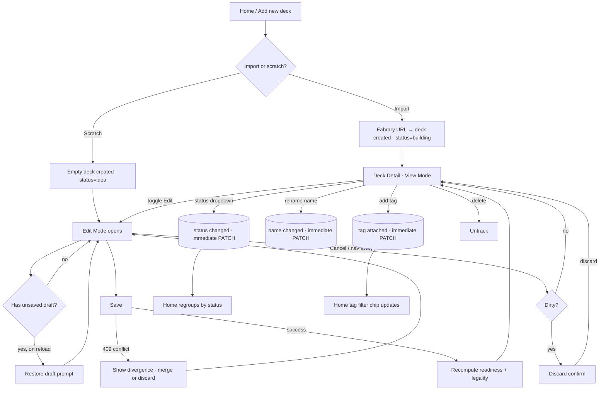

# Deck Management v2 — Editable Decks, User Categorization, Detail Redesign

## Problem Frame

The current Rathe Arsenal deck lifecycle is unidirectional and system-driven:

1. **Decks are write-once.** Cards arrive via Fabrary import, CSV, or the manual add-cards flow and never change. If the user trims a single card after a tournament, they must edit on Fabrary and reimport — losing all swap decisions in the process.
2. **The system tells the user what a deck "is".** The home page automatically buckets decks into "Ready to play" (≥80%), "Almost there" (50–80%), "Needs collection" (<50%) shelves derived from `effectivePercent`. The user has no say in what state a deck is in — they can't mark a deck as "the one I take to weekly", "archived", or "draft idea". Tag-style organization doesn't exist at all.
3. **Deck creation is import-only.** Every deck in the system has a Fabrary origin. A user who wants to brainstorm a deck inside Rathe Arsenal — even just to see what a Briar list looks like against their collection — has to compose it on Fabrary first.
4. **The deck detail is information-flat.** `decks.$deckId.tsx` shows a hero stripe, three breakdown sections, and a shopping panel in one continuous scroll. There are no persistent actions (only "View on Fabrary"), no visual signal for user-defined state, no place for tags, and information density relies on labels rather than icons/colors.

v2 reframes the deck as **owned by the user**: editable in place, categorizable on the user's terms, creatable from scratch, and visualized as a first-class artifact in a layout that mirrors the existing Library shell.

## Key Decisions

| # | Decision | Implication |
|---|----------|-------------|
| D1 | The three concerns (edit, redesign, categorize) ship together as a coherent v2. Planning **may** sequence them internally (status+tags can land before Edit, Edit before full redesign polish) but no incremental release ships behind the same v2 branding. | Doc is one requirements artifact; plan decides ship cadence. |
| D2 | Categorization = **fixed system status** (5 values) + **user-defined free-form tags**. Status drives shelf grouping; tags are a multi-axis filter on top. | New `tracked_deck.status` enum column + new `deck_tag` table + `tracked_deck_tag` join. |
| D3 | Status set: `idea`, `building`, `ready`, `active`, `retired`. All five behave identically except `retired` is **collapsed by default** on home (preserved but quiet). `active` carries no exclusivity rule. | Retired graveyard problem solved with a collapse affordance, not a separate concept. |
| D4 | Validation posture is **permissive with a legality badge**. The engine never blocks an edit; a `legality` indicator (computed against format rules) renders next to readiness. Status = user intent; badge = technical fact. Badge label uses the word **"Legal"** (not "Valid") to make explicit that it checks format compliance, not deck quality. | New `legality` payload on detail + list. |
| D5 | Edit is a **mode toggle** (View ⇄ Edit), atomic Save. Status changes and name renames are out-of-band immediate writes (each its own PATCH); composition edits (cards, hero, format) accumulate in a draft and Save commits atomically. | Two write contracts: immediate (status, name, tag attach/detach) and atomic (composition). |
| D6 | Edit scope = **cards + hero + format**. Name edit is inline in the header outside Edit mode. Hero/format changes trigger legality re-check (not blocking). | Composition draft only carries cards, hero, format. |
| D7 | **Silent deletion** of orphaned swap decisions on Save. No confirmation. No soft-delete. Trust user intent on what they are editing; lost decisions are the cost of editability. (Owner decision after review: orphan-confirm dialog adds friction that the current beta scale doesn't warrant.) | Save runs orphan cleanup without UI prompt. |
| D8 | "Add new deck" replaces "Track new deck". Two entry points: **import from Fabrary** (existing) and **start from scratch** (creates an empty deck, status `idea`, opens in Edit mode). Scratch is a deliberate product expansion. | Schema relaxation: `tracked_deck.fabraryUlid` becomes nullable; partial unique index. |
| D9 | Deck detail layout follows the **Library two-column pattern**: 280px sidebar + canvas, full-width header strip. Sidebar collapses to a card directly under the header below 1280px (expanded by default, persisted in localStorage). | Reuse responsive shell, sidebar persistence consistent across surfaces. |
| D10 | The redesign is **icon/image/color-driven**. Text labels are minimized; recognition replaces reading. Slot icons on every card, status bullets, semantic colors per section, legality badge using shape/color before words. | Icon system documented per R47; accessibility floor per R50. |
| D11 | **Crash-recovery via localStorage draft persistence.** Composition drafts are persisted on every change and restored with a prompt on Edit mode entry. Save clears the draft. | Survives tab close, browser crash, accidental nav. |
| D12 | **Last-write-wins concurrency** for v2. Schema includes `tracked_deck.updatedAt` (`@UpdateDateColumn`) to enable future optimistic locking, but PUT does not enforce a version check in v2. Two concurrent saves on the same deck behave as last-write-wins — acceptable at beta scale (~47 users, single-user-per-deck). When community scales past ~100 users or any overwrite incident is reported, ship the optimistic lock + 409 + merge UI as a follow-up. | Schema future-proofs the feature; no UI surface added in v2. |

## User Flow (deck lifecycle in v2)



## Requirements

### Status & Tags (D2, D3)

#### Schema
- R1. **`tracked_deck.status`** column added: `varchar NOT NULL DEFAULT 'building' CHECK (status IN ('idea','building','ready','active','retired'))`. Pattern mirrors `substitute_decision.decision` (varchar+CHECK, not native Postgres enum, for cheap value-set evolution).
- R5. **Tag schema**:
  - `deck_tag` (`id`, `userId NOT NULL`, `name varchar(24) NOT NULL`, `createdAt timestamptz`). Case-insensitive uniqueness per user enforced via `CREATE UNIQUE INDEX ON deck_tag (userId, LOWER(name))`. `name` validated server-side with `@MaxLength(24)` + `@Matches(/^[\p{L}\p{N}\s\-_.,!?]+$/u)` (printable, accented-friendly, no HTML).
  - `tracked_deck_tag` join (`trackedDeckId`, `tagId`, `attachedAt`). FK `trackedDeckId → tracked_deck.id ON DELETE CASCADE`. FK `tagId → deck_tag.id ON DELETE CASCADE`. Unique index `(trackedDeckId, tagId)`.
  - Hard cap: **200 tags per user** enforced server-side at `POST /tags` insert time → 422 with friendly message on overflow.

#### Migration
- R2. **Flat default migration** for existing decks: all existing `tracked_deck` rows get `status = 'building'` regardless of readiness percent. No banner, no badge, no dismissible UI. (Owner is currently the only user; manual relabel post-migration is trivial. If/when community grows pre-launch, owner can communicate in-channel rather than via banner UI.)

#### API
- R3. **`PATCH /decks/:id`** handles immediate writes: `{ status?, name?, addTagIds?, removeTagIds? }`. Each field is independent and partial. Guarded by `OwnsTrackedDeckGuard`. Tag references validated against `deck_tag.userId === currentUser.userId` server-side; mismatch → 404 (matching existing AuthzService pattern of not distinguishing forbidden from not-found).
- R3a. **Tag CRUD endpoints**: `GET /tags` (returns `WHERE userId = currentUser.userId`), `POST /tags` (body: `{ name }` only; `userId` always derived from JWT, never accepted from body), `DELETE /tags/:id` (asserts `tag.userId === currentUser.userId` via new `AuthzService.assertOwnsTag` analogous to `assertOwnsTrackedDeck`). All three rate-limited under the existing global 120/min throttle plus an inner 30/min limit on `POST /tags` (to slow tag-spam).

#### UI / Visual
- R4. **Status visual treatment** — each status carries a colored bullet (●) + icon + label. Bullet color sourced from existing `apps/web/src/styles/tokens.css` only (never raw hex; never parchment as a UI surface, per `.impeccable.md`). Mapping (token names verified against the live token file):
  | Status | Token (dark theme) | Icon hint |
  |---|---|---|
  | Idea | `--ra-fg-muted` (neutral low-contrast) | sketch / pencil |
  | Building | `--ra-accent-dim` (brass desaturated) | hammer / wrench |
  | Ready | `--ra-accent` (brass primary) | checkmark / shield |
  | Active | `--ra-ready-high` (green) | play / target |
  | Retired | `--ra-fg-subtle` (desaturated) | archive / box |

  Bullets render in: status dropdown (with text), home shelf header (with text), home deck card (paired with abbreviated status label below deck name).
- R6. **Tag UI** — chips inline in the deck-detail header strip with `[× remove]` per chip + an inline `+ add tag` input (WAI-ARIA combobox, same pattern as the Phase 1a interactive components):
  - Typing filters the user's existing tags. If no exact match, the menu's last item is `Create "[typed value]"`.
  - Enter on a highlighted existing option → `PATCH /decks/:id { addTagIds: [id] }`. Enter on the Create option → `POST /tags { name }` then `PATCH /decks/:id { addTagIds: [newId] }`.
  - After successful add, input clears, focus stays on input (rapid multi-add).
  - Escape closes the dropdown but preserves typed text.
  - Each chip's `×` is keyboard-focusable (`tabIndex=0`) with `aria-label="Remove tag {name}"`.
- R7. **Tag soft cap on home deck card**: 4 chips visible + `+N` overflow. **Active filter tags are promoted** to the visible chip positions, displacing non-matching chips into the overflow count — this guarantees the active filter context is always visible.

#### Behavior
- R8. **Implicit tag deletion** when the last attachment is removed. The tag row in `deck_tag` is deleted in the same transaction as the last `tracked_deck_tag` detach. To prevent TOCTOU race when two concurrent detaches both think they are the last (per security/feasibility/adversarial reviewers), the within-transaction sequence is strictly:
  1. `DELETE FROM tracked_deck_tag WHERE trackedDeckId = :deckId AND tagId = :tagId` (inside transaction).
  2. `SELECT COUNT(*) FROM tracked_deck_tag WHERE tagId = :tagId` (inside same transaction — post-delete count).
  3. If count = 0, `DELETE FROM deck_tag WHERE id = :tagId AND userId = :currentUserId` (defensive userId scoping prevents cross-user deletion under any code path).

  Two concurrent transactions both detaching their respective last attachment will serialize on the deck_tag row lock; only one will see count=0 in step 2. The other sees the row already gone (no-op DELETE in step 3 is silent and harmless). Trade-off acknowledged: tags don't survive "currently zero decks" state.

### Home Reorganization (replaces shelves)

- R9. **Default grouping = status.** `ReadinessShelves` is renamed `StatusShelves` and renders one section per non-empty status. Empty sections do not render. Order: `active`, `ready`, `building`, `idea`, `retired`. **The `retired` shelf is collapsed by default** with a chevron to expand (state persisted in localStorage `ra-shelf-retired-expanded` per user, default `false`).
- R10. **Filter chips above shelves** — user's tags render as filter chips. Selecting one or more chips restricts the visible decks (OR logic — show decks tagged with any selected tag). URL shape: **JSON-array encoding** consistent with the existing library route (`?tag=%5B%22foo%22%2C%22bar%22%5D` — i.e., `?tag=["foo","bar"]` URL-encoded). TanStack Router's default serializer represents this as `tag: string[]` in `validateSearch` (confirmed in `_auth/-library.helpers.ts` which uses the same pattern for `pitches`, `types`, etc.). **Repeated params (`?tag=foo&tag=bar`) do NOT work** with the default serializer — the default merges to the last value. Chips are toggle buttons (click selected → deselect). A `Clear` link appears when ≥1 chip is selected; click removes the `tag` param entirely. Unknown tag names in URL are silently ignored.
- R11. **DeckCard preserves readiness display.** `effectivePercent` stays as the dominant Cinzel Decorative numeral. Below the deck name renders a small caps secondary line: `● [status label]` (8px bullet + label in `--ra-fg-muted`), positioned left of any tag chips. Bullet color pairs with text label (not color-only).
- R12. **Home aggregate stats** (`PopulatedHomeHero`) — three stats trio: **active library count** (count of decks with `status !== 'retired'`), **average readiness** (across non-retired decks), **cards missing** (across non-retired decks). All three stats share the same denominator. "Active library" is a label that includes idea, building, ready, and active statuses — the umbrella for "decks I currently care about".
- R12a. **`ITrackedDeckListItem` gains** `status: TDeckStatus` and `tags: readonly string[]` (tag names, denormalized for UI render). `GET /decks` populates both per deck. The aggregate stat field name in `PopulatedHomeHero` is `activeLibraryCount` (replacing the old `readyCount` derived from `effectivePercent >= 80`). If the UI needs to display a separate "ready" count anywhere, it derives `decks.filter(d => d.status === 'ready').length` locally — no dedicated field.

### Edit Mode (D5, D6, D7, D11)

#### Routing / toggle
- R14. **Toggle entry**: `Edit` button switches View → Edit. URL search param `?edit=1` is added via TanStack Router's typed `validateSearch`:
  ```ts
  validateSearch: (search) => ({
    edit: (search as { edit?: unknown }).edit === '1' ? ('1' as const) : undefined,
    ...
  })
  ```
  Reading via `const { edit } = Route.useSearch()`. Browser back from Edit returns to View (handled by `navigate({ search: { edit: undefined } })` rather than raw `history.back()`).

#### Editable surfaces in Edit mode
- R15. **Composition draft** covers: hero (dropdown of all heroes from catalog, emitting `heroIdentifier` not display name — see R24a), format (dropdown of supported formats), cards (per-row `[− qty +]` + `[× remove]`, grouped by slot in a single flat list). The deck **name is NOT in the composition draft** — it's renamed inline outside Edit mode per R27.
- R20. **Card-add component** — a new `<DeckCardSearchAutocomplete>` component, extracted from the existing `LibrarySearchAddBar` but stripped of its library-mutation side effect (`useAddCardMutation`, `LIBRARY_QUERY_KEY` invalidation). Slot picker is an inline segmented control (`mainboard` / `equipment` / `weapon` / `hero`) right of the input, always visible, with slot icons + `aria-label`. Default slot = `mainboard`.
- R22. **Empty-deck edit state** — scratch decks land here. Canvas shows centered educational empty state (`Start adding cards using search above`). Readiness sidebar shows `—` (em-dash). Save permitted at any point.

#### Client state & persistence
- R16. **Local draft state** accumulates edits in client state. Sidebar readiness block dims and shows `Will recompute on Save`.
- R16a. **Crash recovery (D11)**: draft state is mirrored to `localStorage` keyed by `ra-deck-draft-{deckId}` on every change (debounced 500ms). On Edit mode entry, if a draft exists for this deck, render a **centered modal dialog** (overlay, focus-trapped, Escape closes as Discard): heading `Unsaved changes from your previous edit`, body `You have unsaved changes from a previous session. Restore them?`, two buttons `[Restore]` (primary) and `[Discard]`. Modal pattern is consistent with the existing `<DeleteAccountModal>`. Restore loads draft into client state. Discard removes the localStorage key. Modal blocks Edit canvas interaction until the user chooses — no implicit timeout, no auto-dismiss.
  - **No server-version comparison**: per D12 (last-write-wins concurrency), a draft that predates server changes simply overwrites on Save. No defensive prompt branch for the older-than-server case in v2.
  - **Draft schema-validate on load**: the localStorage payload is parsed through a Zod schema matching the expected draft shape (cardIdentifier string + length, quantity bounds, slot enum, heroIdentifier string) before being loaded into React state. On validation failure, the draft is discarded silently (defensive against XSS in other origins, browser-extension tampering, or schema drift). See SEC-03.
- R16b. **Successful Save clears the draft** keyed by `ra-deck-draft-{deckId}`.

#### Save & error handling
- R17. **Save semantics** — single API call `PUT /decks/:id`. Request body:
  ```ts
  {
    cards: Array<{ cardIdentifier: string, quantity: number, slot: TSlot }>,
    heroIdentifier: string,
    format: string,
  }
  ```
  DTO validation:
  - `@ArrayMaxSize(150)` on cards
  - `@Max(4)` + `@Min(1)` on each card.quantity (max legal copies is 3; 4 gives headroom)
  - `@MaxLength(64)` on cardIdentifier
  - `@IsIn(['Classic Constructed', 'Blitz', 'Living Legend', 'Silver Age'])` on format (the 4 supported per R24)
  - `@IsString()` on heroIdentifier with `@Validate(HeroIdentifierExistsInCatalog)` custom validator

  Server flow (entire block inside `dataSource.transaction`):
  1. Verify ownership: `SELECT 1 FROM tracked_deck WHERE id = :id AND userId = :userId` → 404 if not owned.
  2. `DELETE FROM deck_card WHERE trackedDeckId = :id`.
  3. Bulk `INSERT` new deck_card rows.
  4. Update `tracked_deck` with `heroIdentifier`, `format` (TypeORM auto-bumps `updatedAt`).
  5. **Orphan-decision cleanup (corrected logic per feasibility review)**: run `computeEffectiveReadiness(deck, catalog, /* exclusions */ persistedRejections)` to get the new substitute set. Collect `newSubstituteIds = new Set(result.substituted.map(s => s.match.substitute.cardIdentifier))`. `DELETE FROM substitute_decision WHERE trackedDeckId = :id AND cardIdentifier NOT IN newSubstituteIds`. (Decisions are keyed on the substitute identifier — same logic as the existing decisions service. Using persisted exclusions here ensures step 5 and step 6 see the same substitute set; per feasibility F4.)
  6. Compute final readiness with persisted exclusions → `INSERT` snapshot. **The engine pass in this step runs OUTSIDE the transaction** (transaction commits at end of step 5; step 6 runs against the just-committed deck_card state). Rationale: holding the transaction (and any row locks) across two engine passes is unnecessary now that we have no optimistic-lock check (D12 cut). This also addresses the U7-R1 double-pass concern in `docs/phase-1-followups.md` partially — step 5 still runs the engine inside the transaction for orphan cleanup, but step 6 (snapshot) runs after commit.
  7. Compute `legality` per R23.
  8. Return updated detail payload (same shape as `GET /decks/:id`).

  Concurrency: no optimistic-lock check in v2 (per D12). Two concurrent PUTs against the same deck behave as last-write-wins.
- R17a. *(Removed per D7 update — orphan deletion is silent in v2.)*
- R18. **Cancel semantics** — discards local draft. If draft is dirty, `Discard X changes?` confirm dialog. No dialog when clean.
- R18a. **Navigation-away guards (extends R18)** — any of these triggers the same `Discard X changes?` confirm when the draft is dirty:
  - Breadcrumb `← Decks` click
  - Browser back
  - External link click (using router beforeNavigate hook)
  - Browser `beforeunload` event (tab close / refresh)

  Status dropdown change, name rename, and tag add/remove are immediate writes — they do NOT trigger the confirm (they are not part of the composition draft).
- R19. **Pending action guards** — in-flight Save disables Save + Cancel. Status dropdown, name rename, and tag affordances remain enabled (they are not part of the atomic composition draft).
- R19a. **Save error handling** — on 5xx or network failure:
  - Local draft is preserved (in client state AND localStorage).
  - Save and Cancel re-enable.
  - Inline error message appears adjacent to Save: `Save failed — try again` (not a toast).
  - Error clears on next Save attempt or on Cancel.
  - *(409 / concurrency merge UI deferred per D12 — no 409 branch in v2.)*
- R19b. **Status dropdown interaction** — custom ARIA `role="listbox"` with `role="option"` items (not native `<select>`, for theming). Keyboard: Enter/Space opens, ArrowUp/Down navigate, Enter selects+closes, Escape closes without change. Click outside closes. Selection fires `PATCH /decks/:id { status }` immediately (even mid-Edit-mode — status is out of the composition draft). During the PATCH, button shows a small spinner and is disabled. On error, button reverts to previous status with inline toast.

#### Hero/format change cascade
- R21. **Hero/format change cascade** — when hero or format changes mid-edit:
  - Sidebar shows non-blocking notice: *"Hero/format changed → N cards may become illegal in this format"*.
  - Inline warning icon (with `aria-label="Not legal in {format}"` + tooltip listing reason) appears on each affected card row.
  - These row-level warnings are **local Edit-mode-only state**, derived client-side from the candidate hero/format + catalog. They are not persisted and disappear when Edit mode exits (whether via Save or Cancel). Post-Save legality is surfaced only through the legality badge (R25) and the legality reasons payload.
  - Save proceeds without additional confirmation when N ≤ 5.
  - **Threshold-triggered confirm**: if N > 5 cards become illegal (heuristic for "wholesale incompatible hero swap"), Save opens a confirm: *"Changing to {hero} marks {N} cards as illegal. Continue and fix later, or pick a different hero?"* Confirm commits; Cancel keeps Edit mode open.
  - Inline affordance in the sidebar notice: `[Remove illegal cards]` — bulk-removes all currently-flagged rows in one action, restoring focus to the autocomplete.

### Legality Badge (D4)

- R23. **Legality** is computed in a new `packages/engine/src/legality/` module as a pure function `computeDeckLegality(deck, catalog): { category: 'legal' | 'incomplete' | 'illegal', reasons: readonly string[] }`. Called server-side in the deck-detail and deck-list resolution paths.
- R23a. **Two-layer rule sourcing** (key design decision):
  - **Layer 1 — per-card legality from `@flesh-and-blood/types` + `@flesh-and-blood/cards`**: the package (already a dependency at version `^3.6.243`) exposes per-card `legalFormats: Format[]`, `bannedFormats?: Format[]`, `restrictedFormats?: Format[]`, `legalOverrides?: LegalOverride[]`, `legalHeroes: Hero[]`, `rarity: Rarity` (`Legendary` is an enum value), `young?: boolean` (set on young hero cards), and `specializations?: Hero[]`. **LSS banlist updates, hero "living legend" promotions, set rotations, and new Silver Age releases all arrive via `pnpm update @flesh-and-blood/cards @flesh-and-blood/types`** — no manual transcription. The legality engine reads these fields directly.
    - **Catalog change required**: `ICatalogCard` in `packages/engine/src/catalog/types.ts` today exposes only `legalHeroes`. It must be extended to expose `legalFormats`, `bannedFormats`, `restrictedFormats`, `legalOverrides`, `rarity`, `young`, and `specializations`. The catalog factory (`createCatalog`) maps the source fields verbatim.
  - **Layer 2 — structural rules in `packages/engine/src/legality/rules.ts`**: a hand-maintained constants file with format-level rules that the package does NOT carry. Sourced verbatim from LSS Tournament Rules and Policy ([rules.fabtcg.com/en/trp/07-constructed-formats](https://rules.fabtcg.com/en/trp/07-constructed-formats/)). Shape:
    ```ts
    type TSupportedFormat = 'Classic Constructed' | 'Blitz' | 'Living Legend' | 'Silver Age';
    interface IFormatRules {
      readonly cardPoolMax: number;          // total non-hero cards (equipment + weapons + mainboard)
      readonly mainboardSize: { readonly mode: 'minimum' | 'exact'; readonly count: number };
      readonly maxCopiesNonLegendary: number;
      readonly maxCopiesLegendary: number;   // always 1 (meta-static from Legendary rarity)
      readonly heroRequirement: 'young' | 'non-young-non-livinglegend' | 'any';
      readonly rarityWhitelist: readonly Rarity[] | null;  // null = no restriction
      readonly source: string;               // LSS doc URL for traceability
    }
    export const FORMAT_RULES: Record<TSupportedFormat, IFormatRules> = { ... }
    ```
    Updated manually (≤1×/year cadence based on LSS history) with a PR + tests when LSS changes a fundamental rule. The most recent LSS structural change (Blitz singleton + LL rule removal, January 2026) is the kind of change that warrants a `rules.ts` PR.
- R24. **Supported formats in v2** — exactly 4 (closed set). Rules verified against LSS Tournament Rules and Policy on 2026-05-11:
  - **Classic Constructed** (`Format.ClassicConstructed`):
    - Card-pool: 1 hero + max 80 arena/deck cards
    - Hero requirement: NOT young, NOT living-legend (`hero.young !== true` AND `hero.legalFormats.includes('Classic Constructed')`)
    - Deck size: **minimum 60** (mainboard portion of card-pool)
    - Max copies: **3 non-legendary, 1 legendary**
    - Banlist source: per-card `bannedFormats.includes('Classic Constructed')`
    - Source: [fabtcg.com/gameplay-formats/classic-constructed](https://fabtcg.com/gameplay-formats/classic-constructed/)
  - **Blitz** (`Format.Blitz`):
    - Card-pool: 1 young hero + max 52 cards
    - Hero requirement: young (`hero.young === true`)
    - Deck size: **exactly 40**
    - Max copies: **1 (singleton)** for all non-legendary; 1 legendary (same anyway). Singleton rule effective January 2026 — Living Legend rule and Blitz banlist abolished simultaneously.
    - Banlist source: currently empty (per LSS Jan 2026 announcement) but still read from `bannedFormats` for forward-compat.
    - Source: [fabtcg.com/gameplay-formats/blitz](https://fabtcg.com/gameplay-formats/blitz/), [fabtcg.com/articles/official-blitz-update](https://fabtcg.com/articles/official-blitz-update/)
  - **Living Legend** (`Format.LivingLegend`):
    - Card-pool: 1 hero + max 80 cards (same as CC)
    - Hero requirement: living-legend heroes legal (and their signature weapons); checked via `hero.legalFormats.includes('Living Legend')`
    - Deck size: **minimum 60** (same as CC)
    - Max copies: **3 non-legendary, 1 legendary** (same as CC)
    - Banlist source: per-card `bannedFormats.includes('Living Legend')` (separate from CC banlist)
    - Source: [fabtcg.com/living-legend](https://fabtcg.com/living-legend/)
  - **Silver Age** (`Format.SilverAge`):
    - Card-pool: 1 young hero + max 55 cards
    - Hero requirement: young (`hero.young === true`)
    - Deck size: **exactly 40**
    - Max copies: **2 non-legendary, 1 legendary**
    - **Rarity whitelist**: common, rare, basic only (`card.rarity in {Common, Rare, Basic}`)
    - Card pool restriction: cards must have `legalFormats.includes('Silver Age')` (LSS curates which sets are Silver Age-legal; rotations happen via package update)
    - Banlist source: per-card `bannedFormats.includes('Silver Age')`
    - Source: [fabtcg.com/gameplay-formats/silver-age](https://fabtcg.com/gameplay-formats/silver-age/)
  - **Unsupported formats** (Clash, Draft, Open, Sealed, UltimatePitFight): rejected at API DTO via `@IsIn(['Classic Constructed', 'Blitz', 'Living Legend', 'Silver Age'])`. Frontend dropdown in R15 only lists the supported 4. The legality engine never receives an unsupported value at runtime.
  - **Migration of existing decks**: any existing `tracked_deck.format` value not in the supported 4 (e.g., decks imported with `format = 'Clash'` from a Fabrary list) defaults to `'Classic Constructed'` in migration with a logged warning. Owner reviews logs and corrects in DB if needed (single-user scale).
  - **Legality verdict logic**:
    1. Check hero match against `heroRequirement` → if fail, `category: 'illegal'` with reason.
    2. Check card-pool total (hero + equipment + weapon + mainboard counts) against `cardPoolMax` → if exceeds, `'illegal'`.
    3. Check mainboard size against `mainboardSize` → if under minimum (CC/LL) or not exact (Blitz/SA), **category is `'incomplete'`** (not `'illegal'`) — this is the work-in-progress state from R25.
    4. Check copy limits across the pool (count occurrences per cardIdentifier) → if exceeds, `'illegal'`.
    5. Check per-card legality: each card's `legalFormats.includes(format) && !bannedFormats?.includes(format) && (legalHeroes.includes(hero) || legalOverrides matches)` → if any fail, `'illegal'`.
    6. For Silver Age: each card's `rarity in rarityWhitelist` → if fail, `'illegal'`.
    7. Otherwise `'legal'`.
- R24a. **Hero is stored as `heroIdentifier`** (catalog cardIdentifier), not display name. Migration: backfill `tracked_deck.heroIdentifier` from existing `tracked_deck.hero` using `catalog.indices.byName` with disambiguation on `types.includes(Type.Hero)`. Edit mode hero dropdown emits cardIdentifier values; UI renders the display name from catalog lookup. Existing `tracked_deck.hero` (display name) column kept for backward compat through this migration, then dropped in a follow-up migration once all callers use `heroIdentifier`.
  - **Hero compatibility check** (used by R24 rule set): a card is legal in this deck if `card.legalHeroes.includes(hero)` OR `legalOverrides` for this format includes this hero OR `specializations.includes(hero)` (specialization cards). Engine consumes these fields directly from `@flesh-and-blood/types`.
  - **Pre-flight check before migration**: the migration runs a query enumerating all distinct `tracked_deck.hero` values that do not resolve in `catalog.indices.byName` after `Type.Hero` disambiguation. If the result set is non-empty, the migration **aborts** with the list logged (owner-only operation at current scale — abort is safe). Owner manually fixes the affected rows (e.g., renames in DB, or contacts the user to clarify intended hero) before re-running the migration. The column remains nullable post-migration so the system tolerates any future divergence; a deck with `heroIdentifier IS NULL` is treated as legality category `'illegal'` with reason `'Hero not recognized — please re-select in Edit mode'`. This makes the failure visible and actionable rather than silently inscrutable.
- R24a. **Hero is stored as `heroIdentifier`** (catalog cardIdentifier), not display name. Migration: backfill `tracked_deck.heroIdentifier` from existing `tracked_deck.hero` using `catalog.indices.byName` with disambiguation on `types.includes(Type.Hero)`. Edit mode hero dropdown emits cardIdentifier values; UI renders the display name from catalog lookup. Existing `tracked_deck.hero` (display name) column kept for backward compat through this migration, then dropped in a follow-up migration once all callers use `heroIdentifier`.
  - **Pre-flight check before migration**: the migration runs a query enumerating all distinct `tracked_deck.hero` values that do not resolve in `catalog.indices.byName` after `Type.Hero` disambiguation. If the result set is non-empty, the migration **aborts** with the list logged (owner-only operation at current scale — abort is safe). Owner manually fixes the affected rows (e.g., renames in DB, or contacts the user to clarify intended hero) before re-running the migration. The column remains nullable post-migration so the system tolerates any future divergence; a deck with `heroIdentifier IS NULL` is treated as legality category `'illegal'` with reason `'Hero not recognized — please re-select in Edit mode'`. This makes the failure visible and actionable rather than silently inscrutable.
- R25. **Badge UI** — renders adjacent to the readiness block in the sidebar. Three visual states distinguish progress from rule violation:
  - **Legal**: `Legal CC ✓` (green-tinted small chip, `--ra-ready-high` border) when `isLegal === true` and format is recognized.
  - **Incomplete**: `Incomplete · 58/60 cards` (neutral muted-brass chip, `--ra-accent-dim` border) when the only legality failure is card count below the format minimum. This is a progress state, not a rule violation — typical for scratch decks mid-build.
  - **Illegal**: `Illegal · 4× Card X` (red-muted small chip, `--ra-ready-low` border) when `isLegal === false` and the failure is a genuine rule violation (max copies exceeded, hero incompatibility, illegal-for-format card). First reason from `reasons[]` is shown.
  - `legality` payload distinguishes the cases via `category: 'legal' | 'incomplete' | 'illegal'` so the badge picks visuals from the same field that drives the engine result.
  - Click opens a popover (`role="dialog"`, `aria-modal="false"`, click-triggered both desktop and touch, Escape dismisses, anchors below the badge) listing the full reasons. Plain text reason list; no deep-links to cards in v2.
  - Empty `reasons[]` with `category !== 'legal'` displays `Deck is incomplete — reason not available.` (defensive fallback).
- R26. **Legality on home deck card** — small icon-only indicator (✓ / ✗) next to the format pill. No reason text on home; surfaced only on detail.

### Deck Detail Redesign (D9, D10)

#### Header strip (full width, sticky top)
- R27. **Layout**: Left → breadcrumb `← Decks` link + deck name `<h1>`. **Name is inline-renameable only outside Edit mode** (click → inline `<input>` → blur → `PATCH /decks/:id { name }`. Empty blur restores previous name. In Edit mode the `<h1>` is non-clickable — atomic composition draft model is preserved).
- R28. Tag chip row below the name (R6).
- R29. Right action bar (right-aligned, View mode): **status dropdown** (R19b), **`Edit`** button (primary brass), **`⋯` overflow** with `Untrack`. In Edit mode the action bar replaces these with `[Cancel]` `[Save]`. *(Note: `Duplicate as Idea` and `Export CSV` are deferred to a future increment, removed from v2 scope.)*

#### Sidebar (280px, sticky desktop; collapsible card on mobile)
- R30. **Hero block** — hero art thumb (medium), hero name (resolved from `heroIdentifier` via catalog), format pill, legality badge (R25) below the format pill.
- R31. **Readiness block** — existing `.ra-readiness-display` (Cinzel Decorative number) preserved. Subtitle `Effective Ready · X/Y cartas`. Secondary line `Raw X% · Fidelity Y%`. In Edit mode the whole block dims and is replaced by `Will recompute on Save`.
- R32. **Shopping summary** — single line `€34,90 · 12 items` + `[Expand ▾]`. Desktop expand = inline within sidebar (existing `ShoppingPanel`). Mobile (`< 1280px`) expand = bottom sheet anchored to viewport bottom with drag-to-dismiss handle (not full modal).
- R33. **Sidebar footer** — `View on Fabrary ↗` link renders **only when `deck.fabraryUlid !== null`**. Scratch decks (no Fabrary origin) omit the link entirely. `ITrackedDeckDetailResponse.fabraryUlid` becomes `readonly fabraryUlid: string | null`.
- R34. **Sidebar responsive collapse** (unified with R42) — below 1280px in **View mode**, the sidebar becomes a card directly under the header strip, **expanded by default**, collapsible via `▼ Hide details` / `▶ Show details` button. State persisted in `localStorage` under `ra-deck-sidebar-expanded` (boolean, default `true`). Transition: CSS max-height collapse, 200ms ease (matches project motion baseline). In **Edit mode** below 1280px the sidebar is hidden entirely — see R43.

#### Canvas (centro, 1fr)
- R35. **Three sections preserved**: Exact / Swaps / Not owned. Diamond semantics:
  - Exact = `--ra-ready-high` green
  - Swaps = `--ra-accent` brass (pending) / `--ra-accent-dim` brass-muted (resolved)
  - Not owned = `--ra-ready-low` red-muted
- R36. **Slot icons** on every card row/cell (sword / gem / shield / hero glyph), replacing text labels for slot context.
- R37. **Swap section auto-state**: pending swaps render expanded; resolved swaps (approved/rejected) render collapsed (extends accordion direction from commits `dd645ab` / `6e01cdb`).
- R38. **ModifiedViewBanner** promoted to top of canvas. Renders only when ≥1 rejection exists.
- R39. **Card art density** unchanged: `sm` for Exact grid, `xs` for Not owned, `lg` only in lightbox.
- R40. **Edit mode collapses** the three sections into a single grouped list (by slot) with editable rows. Add-card autocomplete (R20) sits at the canvas top.

#### Mobile (< 1280px)
- R41. Header strip remains full-width; status dropdown + Edit button visible; tags wrap below.
- R42. *(Merged into R34.)*
- R43. Edit mode in mobile: sidebar **hides entirely** (overrides R34's "collapsible card" behavior — Edit needs the screen real estate). Header strip compacts to `Cancel · Save`. In-flight Save behavior matches desktop (both buttons disabled in place, not hidden).

### "Add new deck" entry (D8)

- R44. The home "Track new deck" CTA renames to **"Add new deck"** and opens `/decks/new`.
- R45. The `/decks/new` page shows two cards:
  - **Import from Fabrary** — existing flow.
  - **Start from scratch** — searchable hero combobox (catalog filter on `types.includes(Type.Hero)`) + format dropdown (`@IsIn` against supported formats). Submit button labeled `Start building`, disabled until both fields set. On submit, creates `tracked_deck` row (status `idea`, `fabraryUlid = NULL`, `heroIdentifier = selected`, `format = selected`, `name = '{heroDisplayName} — {format}'`). Navigates to `/decks/:id?edit=1`.
- R45a. *(Removed.)* Empty scratch decks (zero cards but hero + format set per R45) live in the Idea shelf without any prompt — that is the Idea shelf's job. The user can `Untrack` the deck via the overflow menu (R29) if they want it gone. No client-side guard or server-side cleanup in v2.
- R46. Both paths land on deck-detail in the appropriate mode (View for imports, Edit for scratch).

### Schema notes (consolidates schema changes referenced across requirements)

- `tracked_deck.status` (R1)
- `tracked_deck.heroIdentifier` (R24a) — new column; backfill from `hero`
- `tracked_deck.updatedAt` (D12) — `@UpdateDateColumn` added now for forward-compat (no enforcement in v2 per D12). Migration backfill: `UPDATE tracked_deck SET "updatedAt" = "trackedAt"` populates existing rows. When optimistic-lock enforcement ships as a follow-up, the column is already in place and back-populated.
- `tracked_deck.fabraryUlid` (D8) — becomes nullable. Existing unique index `IDX_tracked_deck_user_fabrary_unique` replaced with partial: `CREATE UNIQUE INDEX ... WHERE fabraryUlid IS NOT NULL`.
- `deck_tag`, `tracked_deck_tag` (R5) — new tables.
- All schema changes land in a single migration sequence; status migration (R2) runs after the column add.

### Telemetry

Out of scope for v2. The validation philosophy's "passive signal" requirement is currently served by the owner's first-hand use (single user). When the community widens — and there are >5 active users with non-owner sessions — a follow-up adds telemetry. Trigger: 5th active non-owner user, OR any user complaint about a flow that the owner cannot reproduce.

If a need for retrospective answers about adoption emerges before telemetry ships, the API request logs already record `PATCH /decks/:id`, `PUT /decks/:id`, `POST /tags`, and `POST /decks` (`fabraryUlid IS NULL` for scratch) with timestamps and userId — sufficient to derive crude counts without new infrastructure.

### Visual & interaction details (D10)

- R47. **Icon system** — slot icons (sword/gem/shield/hero), action icons (edit/save/cancel/trash), status icons (per R4). Single icon family. If not present in `docs/design/v1/`, add as part of v2 (a separate sub-task in the plan).
- R48. **Color semantics** — readiness colors (`--ra-ready-high` / `--ra-accent` / `--ra-ready-low` from `apps/web/src/styles/tokens.css`) drive section diamonds, legality chips, and status bullets where applicable. No new palette entries.
- R49. **Reduce textual labels** — section headers retain text for a11y but compact further; slot icons replace per-card text meta. Larger numerals for counts.
- R50. **Accessibility floor** — every icon-only affordance ships with an explicit `aria-label`. Specific labels:
  - Breadcrumb: `aria-label="Back to decks"`
  - Status dropdown trigger: `aria-label="Change deck status — currently {status}"`
  - `⋯` overflow: `aria-label="More options"`
  - Sidebar collapse: `aria-label="Show sidebar details"` / `"Hide sidebar details"`
  - Slot icons: `aria-label="{Slot} slot"`
  - Tag chip `×`: `aria-label="Remove tag {name}"`
  - Card row warning icon (Edit mode): `aria-label="Not legal in {format}"` + tooltip listing reason

  Status bullets pair color with text in dropdown menu (not color-only).

## Success Criteria

A user can:

1. Open any tracked deck, hit Edit, change card quantities, swap cards, change hero/format, click Save, and see updated readiness — without ever leaving Rathe Arsenal.
2. Mark a deck as `Idea`, `Building`, `Ready`, `Active`, or `Retired` from the deck-detail header. The home reorganizes the deck under that status on the next load. `Retired` shelf is quiet by default.
3. Attach free-form tags to a deck. Tags appear as filter chips on home and restrict which decks render. Active tag is always visible on the deck card. Removing a tag's last attachment cleans up the tag.
4. Create a brand-new deck from scratch (hero + format only), with no Fabrary import in the loop. Edit mode opens immediately. Abandoning at 0 cards offers a discard prompt.
5. Look at a deck and immediately understand — without reading more than a word or two — what hero it is, what status it's in, whether it's legal, and how ready it is.
6. Recover unsaved Edit mode work after a tab close, browser crash, or accidental nav — the next Edit mode entry prompts to restore the draft.

Automated verification (per `docs/validation-philosophy.md`):

- **E2E (Playwright)**:
  - Import → mark as `Active` → tag with `liga local` → home filter chip → opens detail → toggle Edit → remove one card → Save → readiness recomputes; legality remains `Legal CC ✓`.
  - Start from scratch → Edit → add 60 cards → Save → legality flips from `Incomplete · 0/60` to `Legal CC ✓`.
  - Edit → change hero (cascade 12 cards illegal) → "Remove illegal cards" → Save → readiness recomputes.
  - Mid-edit reload with localStorage draft → restore prompt → restore → draft state matches.
- **API integration tests**: `PUT /decks/:id` happy path; orphan-decision cleanup with corrected logic (substitute-keyed, using persisted exclusions); bounds validation (oversized cards array rejected); tag CRUD ownership (cross-user 404).
- **Visual regression**: deck-detail in View (full + legal + illegal + 0-cards), deck-detail in Edit (empty deck, hero-change-cascade, save-error inline), home with status shelves (retired collapsed/expanded), home with tag filter chip active.
- **Vitest**: status dropdown ARIA state machine, legality badge variants, header action bar Edit/Save/Cancel transitions, draft persistence hook, navigation-away guard.

## Scope Boundaries

In scope:
- New `tracked_deck.status`, `tracked_deck.heroIdentifier`, `tracked_deck.updatedAt`, nullable `tracked_deck.fabraryUlid` (partial unique index), `deck_tag`, `tracked_deck_tag` schema.
- Status migration heuristic (R2) + one-time banner.
- `PATCH /decks/:id` (status, name, tag attach/detach).
- `PUT /decks/:id` (composition) with DTO bounds, transactional flow, orphan-decision cleanup, optimistic-lock 409.
- Tag CRUD endpoints with explicit ownership scoping + per-user 200-tag cap + 30/min POST limit.
- `packages/engine/src/legality/` module covering 4 formats: Classic Constructed, Blitz, Living Legend, Silver Age (R24). Per-card data sourced from `@flesh-and-blood/types`/`@flesh-and-blood/cards` packages; structural rules in `legality/rules.ts` (LSS-sourced).
- New `<DeckCardSearchAutocomplete>` component (extracted from `LibrarySearchAddBar`).
- Deck-detail redesign per R27–R43 + R45–R50.
- localStorage draft persistence + restore prompt.
- "Add new deck" two-path landing + scratch deck flow.
- Home reorganization (status shelves + tag filter) + retired-shelf collapse.

Out of scope:
- Status auto-suggestion ("your deck reached 95% — mark as Ready?").
- `Duplicate as Idea` deck duplication.
- `Export CSV`.
- Soft-delete / archive of swap decisions (chose informed-confirm instead per D7).
- Tag rename / tag housekeeping settings UI (implicit deletion in R8 covers the immediate need).
- Legality engine support for Clash, Draft, Open, Sealed, UltimatePitFight (rejected at DTO; the 4 supported formats per R24 are the closed set for v2).
- Bulk operations across multiple decks (multi-select tag, bulk status change).
- Telemetry events (deferred — see Telemetry section).
- Optimistic-lock enforcement + 409 merge UI (deferred per D12 — schema is in place).
- "Active" mutual exclusivity, "main deck" concept (rejected during brainstorm).
- Deck-detail "deckbox metaphor" visual (challenger from brainstorm) — captured as future visual ambition.
- Hero/format conversion as a separate guided flow — Edit handles it.

## Outstanding Questions

### Resolve before planning
*(None remaining — all prior OQs closed.)*

*(All four original OQs are closed:*
- *OQ1 → R4 stands with tokens from `apps/web/src/styles/tokens.css`; owner can override at design review without re-planning.*
- *OQ2 → R24 carries verified rules per format with LSS source citations. Per-card data sourced from `@flesh-and-blood/types` package. Structural rules transcribed to `packages/engine/src/legality/rules.ts`.*
- *OQ3 → `Duplicate as Idea` deferred to future; removed from v2 scope.*
- *OQ4 → legality lives in `packages/engine/src/legality/` per R23.*)

### Deferred to planning
- Migration ordering: status column add → backfill → heroIdentifier backfill from name → fabraryUlid nullable + partial unique index swap.
- Component decomposition for the editable canvas — single component with `mode` prop vs. sibling `EditableSections`.
- Exact debounce window for localStorage draft persistence (start at 500ms).
- Telemetry transport (PostHog / Amplitude / self-host).

## Dependencies / Assumptions

- `docs/design/v1/tokens.css` covers all colors needed (readiness greens, brass shades, fg-muted/disabled). No new palette entries.
- Engine recompute time stays sub-second for typical decks (~60 cards) — synchronous Save UX acceptable. Legality computation is bounded (O(cards) × O(1) catalog lookup) and adds negligible cost.
- `SubstituteDecisionEntity.cardIdentifier` stores the **substitute** card identifier (verified — `decisions.service.ts` upsert). Orphan-cleanup logic in R17 step 6 uses this correctly.
- TanStack Router's `validateSearch` is the canonical search-param contract (verified — Library route uses this pattern).
- The catalog (`packages/engine/src/catalog`) is an in-process singleton; legality lookups are hash-table reads, not I/O. Same async-safety profile as the existing readiness engine.
- The Phase 1a `<CardAutocomplete>` reuse claim from the prior revision was wrong — that component does not exist. The actual reusable artifact is `LibrarySearchAddBar`, which is library-mutation-coupled. R20 commits to extracting a new `<DeckCardSearchAutocomplete>` from it.

## Next Steps

1. Owner reviews remaining OQ2 and signs off on the doc revision.
2. Run `/ce:plan` against this requirements doc to produce the technical plan (migrations → API endpoints → legality engine → frontend redesign → e2e/visual regression). Plan should propose an internal ship sequence (e.g., status+tags ship first, Edit + redesign ship second).

## Notes

- Validation cadence follows `docs/validation-philosophy.md`: automated tests + dev-browser self-loop + telemetry. No human walkthrough gates.
- Visual identity tokens locked in `docs/design/v1/` are binding; v2 introduces no new colors or fonts.
- Revision history:
  - **r1 (2026-05-11)**: initial draft after brainstorm.
  - **r2 (2026-05-11)**: post first document-review refinement — added D11 (draft persistence), D12 (optimistic lock); rewrote R17 with bounds + transaction + corrected orphan logic; added R3a (tag CRUD with ownership); added R16a/b (localStorage draft); added R17a (orphan confirm); added R18a (nav-away guards); added R19a (save error states) + R19b (status dropdown spec); added R24a (heroIdentifier); added R45a (scratch ghost guard); renamed "Valid" → "Legal" throughout; closed OQ1/OQ3/OQ4; unified R34/R42 mobile sidebar; promoted telemetry from deferred to in-scope; flagged the wrong CardAutocomplete reuse claim.
  - **r3 (2026-05-11)**: post second document-review refinement. Owner decisions:
    - **D12 cut**: no optimistic-lock enforcement, no 409 merge UI. Schema keeps `updatedAt` for forward-compat. PUT is last-write-wins.
    - **D11 simplified**: 2-way restore prompt only (no server-version comparison branch); modal-centered dialog; localStorage payload Zod-validated on load.
    - **D7 reverted to silent deletion**: R17a (orphan confirm dialog) removed. Owner accepts silent orphan deletion as the cost of editability at current scale.
    - **R45a cut**: empty scratch decks live in Idea shelf without prompt or cleanup.
    - **R2 flat migration**: all existing decks → `building`. No banner, no auto-badge (owner is currently sole user).
    - **Telemetry deferred** (out of scope) until 5th active non-owner user. API request logs cover crude counts in the interim.
    - **Legality scope expanded** to include Silver Age (3rd format); closed "Other formats" pass-through.
    - **R25 three visual states**: Legal / Incomplete / Illegal (incomplete is neutral progress chip, not red-muted).
    - **R12 / R12a renamed** to `activeLibraryCount` semantic (denominator is non-retired decks across all stats).
    - **R34 / R43 Edit-mode override** unified (sidebar hidden in mobile Edit mode).
    - **R8 TOCTOU spec** added (delete-then-count-then-conditional-delete inside transaction, defensive userId scope).
    - **R24a heroIdentifier backfill** spec: pre-flight enumeration, abort on unmatched names, post-migration nullable with explicit "Hero not recognized" badge.
    - **R17 corrected**: orphan cleanup uses persisted exclusions (consistent with step 6); no optimistic-lock check; no expectedUpdatedAt in body.
    - **R4 / R35 / R48 tokens corrected** against actual `apps/web/src/styles/tokens.css` (r2 had fictional `--ra-brass-*` and `--ra-readiness-*` names).
    - Three residual "validity" string references swept to "legality"; `duplicate` icon removed from R47.
      - **R10 TanStack Router URL shape corrected** to JSON-array encoding (matches existing `_auth/-library.helpers.ts` pattern); repeated-params claim from r2 was wrong with the default serializer.
    - **R17 step 6 moved outside the transaction**: snapshot insert runs against just-committed deck_card state; eliminates engine-pass-inside-lock concern from adversarial review.
    - **Doc size / implementation detail kept inline** (owner decision): planning benefits from having DTO, transaction step-list, and ARIA spec in the requirements doc despite the technical density.
    - **Format rules cross-referenced against LSS official sources (2026-05-11)**: discovered that r3's initial Silver Age numbers (60/3) were wrong (correct: 40 exact / 2 max copies / young hero / common+rare+basic only). Blitz also wrong (correct: 40 exact / **singleton** since Jan 2026 / young hero). Added **Living Legend** as 4th supported format. R23a now documents the two-layer sourcing strategy: per-card legality from `@flesh-and-blood/types` package (banlists arrive via `pnpm update`), structural rules in `packages/engine/src/legality/rules.ts` (LSS TRP-sourced, ≤1×/year edit cadence). R24 carries verified rules with LSS URL citations per format.
- Remaining lower-priority items intentionally deferred to planning or follow-ups (not blocking ce:plan): mobile header overflow specifics when many tags + status dropdown + Edit button compete on small viewport; per-user `tracked_deck` count cap (analogous to 200-tag cap); `HeroIdentifierExistsInCatalog` validator wiring pattern (DI vs singleton import); legality module subdir vs single file layout; N > 5 hero-change confirm threshold rationale; `R8` implicit-deletion warning tooltip on the last-attached chip; throttler IP-vs-user keying clarification.
