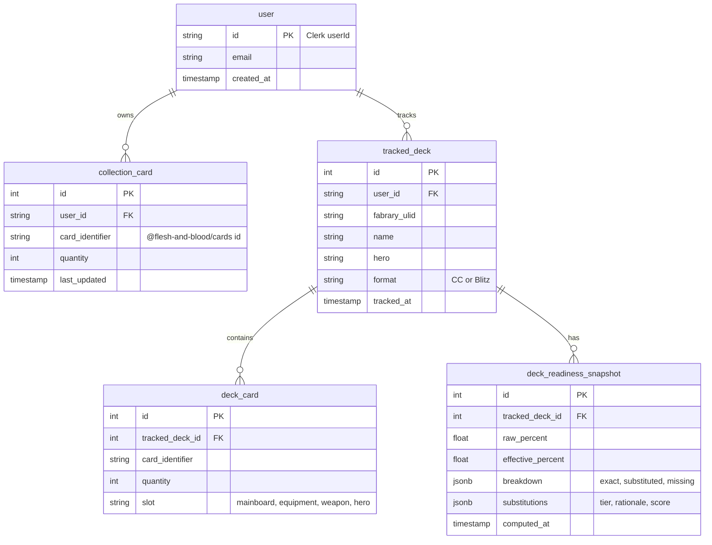

# feat: FaB Deck Readiness Flow -- Phase 0 Validation Slice

## Overview

Build the Phase 0 validation slice of the FaB Deck Readiness Flow: a private closed-beta web app that lets a casual Flesh and Blood player paste one or more Fabrary deck URLs, automatically turn those decks into a tracked-decks list plus seed inventory, run a tier 1 substitution engine against that inventory, and show an "effective readiness" number per deck with a breakdown (raw / substituted / missing) and a non-interactive Path B swap list.

The single biggest unknown is whether a rule-based substitution engine produces useful suggestions for casual FaB players. Everything in this plan is in service of answering that question — including the Gate 4 gold-set labeling session that is *inside* Phase 0, not before it.

Phase 0 is private (5-10 testers from the Pelotas FaB community), not a public launch. Phase 1 is out of scope here.

## Problem Frame

Casual Flesh and Blood players in Pelotas have no tool that answers "I want to play this deck — what am I missing, and what can I substitute from the cards I already own?" Fabrary builds decks; `@flesh-and-blood/cards` describes cards; no one connects the player's existing collection to a desired deck with an honest readiness number.

Phase 0's sole purpose is to validate one hypothesis: *rule-based tier 1 substitution is good enough for a casual audience*. If the engine fails the Gate 4 exit bar (≥70% acceptance on a blind-labeled 30-substitution gold set), the rest of v1 is unjustified work. Phase 0 deliberately strips every surface that is not required to ask this question — no Discover, no store data, no shopping line, no chart, no interactive swap UI, no tier 2/3. (see origin: `docs/brainstorms/2026-04-08-fab-deck-readiness-flow-requirements.md`)

The four pre-planning gates are resolved: Gate 1 passed with the primary metric rescoped to Pelotas realities, Gate 2 passed with consent + crawl-rate exception captured from the Cúpula DT owner, Gate 3 passed with a beneficial revision replacing FaBDB with `@flesh-and-blood/cards`, and Gate 4's protocol is defined with the labeling session scheduled *inside* Phase 0 implementation.

## Requirements Trace

Phase 0 requirement IDs per the origin doc's Phasing Map, mapped to the implementation units that advance them:

- **R1** (progressive collection entry): Unit 2, Unit 5
- **R2** (Fabrary URL paste is primary onboarding): Unit 4, Unit 5, Unit 7
- **R3** (pasted decks auto-tracked): Unit 5, Unit 7
- **R5** (inline "I have this one" entry): Unit 2, Unit 8 — the data model is in Unit 2; the micro-control ships in Unit 8 on the Deck Detail missing-cards list (the primary Phase 0 surface where the user sees cards they might own). The control is scoped to the missing-cards list only; the substituted-cards list does not receive the control in Phase 0 to keep the unit's surface focused. Phase 1 extends the control to additional surfaces.
- **R6** (home surface shows tracked deck list with effective readiness + movement): Unit 7 — Phase 0 shows effective readiness; "movement since last session" uses the snapshot history when a second snapshot exists and is silent otherwise.
- **R7** (untrack with light confirmation): Unit 7
- **R8** (click deck → detail view): Unit 7, Unit 8
- **R10** (effective readiness per deck, not per hero): Unit 6
- **R15** (onboarding Fabrary paste only — no out-of-onboarding test mode): Unit 5, Unit 7
- **R16** (Path A — buildable now): Unit 6, Unit 8
- **R17** (Path B — buildable with substitutions, Phase 0 = tier 1 only, non-interactive): Unit 6, Unit 8
- **R20** (engine operates on mainboard + equipment; never substitutes hero; no weapons in v1): Unit 6
- **R21** (pitch curve preservation within tolerance — starting defaults ±2 red / ±1 yellow / ±1 blue, revised in Unit 9 after Gate 4 labeling): Unit 6, Unit 9
- **R22** (tier 1 scoring: same pitch, same class/talent, same card type, overlapping keywords, power/defense within 1): Unit 6
- **R23** (plain-language rationale for every substitution): Unit 6
- **R26** (deck detail shows effective readiness, raw/substituted/missing breakdown, active substitutions with tier + rationale, link to original Fabrary deck — *without* historical chart and *without* shopping line): Unit 8

Security subset (Phase 0 minimum per origin doc's Security & Privacy):

- **S1** (auth + email verification via managed IdP): Unit 1
- **S2** (server-side authz on `collection` and `tracked_deck`): Unit 1, Unit 2, Unit 5, Unit 8
- **S3** (encryption at rest + working deletion path — may be a manual dev script in Phase 0): Unit 2
- **S4** (no secrets or full collections in logs): Unit 1
- **S5** (host allow-list + redirect blocking + size cap on Fabrary URL fetches): Unit 1, Unit 4
- **S7** (basic CSRF protection on writes): Unit 1
- **S9** (secrets out of source control): Unit 1

S6, S8, S10, S11, S12 explicitly harden in Phase 1 and are out of scope here.

## Scope Boundaries

**Explicit non-goals for Phase 0**, each restated to prevent scope creep:

- **No Discover surface** (R11-R14). Fabrary trending ingestion, archetype filters, preview readiness, and "Track this deck" from trending are all Phase 1.
- **No shopping line** (R28-R29). No store data, no "with R$ 45 at Cúpula DT you reach 100%" line, no missing-card-to-stock lookup.
- **No store data pipeline at all** (R30-R33). The Sbrauble vertical scraper, per-store allow-list, rate limits, and reconciliation are Phase 1.
- **No historical chart** (R27). Effective readiness is shown as a single current number; no time series, no sparkline.
- **No substitution feedback storage** (R25). The "good / bad" per-swap vote UI and the learning loop are Phase 2.
- **No tier 2 or tier 3 substitutions** (R22). Only tier 1 (same pitch, same class/talent, same type, overlapping keywords, power/defense within 1).
- **No interactive swap editor.** The Phase 0 result screen is accept-all-or-discard per R17 Phase 0 scope. No per-swap reject/alter, no constraint-solver re-solve, no "curve-invalid" warnings. Phase 1 introduces the interactive path and the re-solve.
- **No archetype-aware engine weighting** (R24). Archetype metadata is ignored in Phase 0 scoring.
- **No out-of-onboarding test mode for Fabrary import** (R15 Phase 0 scope). Pasted URLs always become inventory seed + auto-tracked decks. The "test this deck without adding to inventory" mode is Phase 1.
- **No PT-BR autocomplete or manual autocomplete** (R4). Phase 0 has only Fabrary URL paste as an entry method plus the R5 inline control.
- **No production-grade auth hardening beyond the Phase 0 minimum subset.** No CAPTCHA (S6), no rate limiting beyond Clerk defaults, no MFA, no store allow-list enforcement (S8 — no stores exist in Phase 0), no outbound link safety enforcement (S10 — no shopping links).
- **No public launch.** Phase 0 runs behind Clerk email auth and is shared only with 5-10 private testers via an invite link. No SEO, no open sign-up.
- **No mobile-specific design pass.** The origin doc's Next Steps place the mobile-first design pass *between* Phase 0 and Phase 1. Phase 0 uses sensible responsive defaults but does not carry a mobile-first design review.
- **No weapon substitution.** Weapons are recognized and included in the raw readiness calculation, but the engine never proposes substitutions for weapons per R20.
- **No hero substitution.** Ever. Hard-coded constraint in the engine.

## Context & Research

This is a **greenfield project** — there is no existing codebase to extend. The `/Users/rodrigohaertel/workspace/personal` directory is the home for this project; `docs/brainstorms/` holds the origin document and the four gate artifacts, and `docs/plans/` holds this plan. No source tree exists yet.

### Stated ecosystem preference

The project owner works in NestJS + TypeScript + TypeORM + class-validator daily (per the company standards document loaded into this session at `~/.claude/CLAUDE.md` and its `rules/` tree). Key conventions called out there that this plan inherits:

- File naming: `.controller.ts`, `.service.ts`, `.module.ts`, `.entity.ts`, `.dto.ts`, `.guard.ts`, `.spec.ts` (unit), `.int-spec.ts` (integration), `.e2e-spec.ts` (E2E)
- Folder naming: `kebab-case/`
- Tests live in `__tests__/` folders adjacent to the code they cover
- `createMock` from `@golevelup/ts-jest` for complex object mocks
- `Test.createTestingModule` for isolated module testing; never import `AppModule`
- Error handling via `HttpException` + exception filter, never `console.log`
- Immutable DTOs, `IPascalCase` interfaces, `TPascalCase` types, `EPascalCase` enums
- Input validation via class-validator decorators on DTOs
- Entities use `snake_case` tables + `camelCase` columns
- Primary keys named `id`, foreign keys use `camelCase` referencing origin

Treating those as the house style minimizes ramp-up cost on a 4-6 week solo budget.

### External references

- **`@flesh-and-blood/cards` + `@flesh-and-blood/types` npm packages** (`github.com/fabrary/fab-cards`, source of truth at `github.com/the-fab-cube/flesh-and-blood-cards`). Exports a `cards` array of `Card` objects with structured enum fields for `classes`, `talents`, `types`, `keywords`, `legalHeroes`, plus numeric `pitch`, `power`, `defense`, `cost` and a `subtypes` array that encodes equipment slot info. **Validated 2026-04-08** (prototype v3.6.242): all 4583 cards have `name`, `cardIdentifier`, `setIdentifiers`, `classes` populated 100%; `types` 99.5%; `pitch` 81.8% (missing only on heroes/tokens/equipment — semantically expected); `keywords` 67.8% exposed as `Keyword[]` enum array, **not free text** — this resolves the Gate 3 concern about needing a text-parser pre-pass for keyword extraction. See `docs/prototypes/fab-deck-readiness-validation-2026-04-08.md` for the full coverage audit. Installed via standard package manager; no API, no rate limits, no ToS concerns.
- **Fabrary AppSync GraphQL endpoint** — `https://42xrd23ihbd47fjvsrt27ufpfe.appsync-api.us-east-2.amazonaws.com/graphql`. Region `us-east-2`. Auth modes exposed: `AMAZON_COGNITO_USER_POOLS` (authenticated users) and `AWS_IAM` (anonymous via Cognito Identity Pool). **Public deck reads use `AWS_IAM` anonymous — validated end-to-end 2026-04-08**. The Cognito Identity Pool ID is `us-east-2:e50f3ed7-32ed-4b22-a05e-10b3e7e03fe0`. The minimum viable `getDeck($deckId: ID!)` query and a working reference implementation (anonymous Cognito → SigV4 → POST `/graphql`) are preserved at `prototypes/fab-deck-readiness/fetch-fabrary.mjs`. The `deckCards[].cardIdentifier` field returned by Fabrary is *exactly* the canonical slug used by `@flesh-and-blood/cards` (e.g. `blade-runner-red`) — no adapter layer, no aliasing, no normalization between the two data sources. The Playwright fallback path previously documented as Option B is no longer considered necessary for Phase 0 but remains as a theoretical last-resort noted in Unit 4's risk table.
- **Clerk for NestJS + React** — `@clerk/backend` for NestJS JWT validation in a custom guard; `@clerk/clerk-react` for the frontend sign-in/sign-up components and token retrieval. Email verification is a dashboard-level setting that Unit 1 explicitly enables ("email sign-up → require email verification" in the Clerk dashboard's User & Authentication section) to satisfy S1.
- **TypeORM** for PostgreSQL entities + migrations, using the NestJS `@InjectRepository` pattern the owner already uses daily.
- **nestjs-pino** for structured JSON logging with automatic request-scoped context and built-in serializer redaction (satisfies S4 without custom wrapping code).
- **class-validator + class-transformer** for DTO validation on every HTTP boundary; enforced via a global `ValidationPipe` configured in `apps/api/src/main.ts`.
- **`@aws-sdk/client-cognito-identity` + `aws4`** for the Fabrary AppSync call. This is a lighter footprint than the full `aws-amplify` v6 bundle and was validated as sufficient during the 2026-04-08 prototype (the entire anonymous-credentials → SigV4-signing → POST flow fits in ~70 lines with two small dependencies). `aws-amplify` was the original primary choice in earlier drafts of this plan but was downgraded to "theoretical option" after the prototype showed the lighter path works end-to-end.
- **Preserved prototype reference implementations** at `prototypes/fab-deck-readiness/`:
  - `fetch-fabrary.mjs` — working Cognito anonymous + SigV4 + AppSync `getDeck` fetch
  - `parse-cupula.mjs` — regex parser for Cúpula DT listing pages (Phase 1 scraper reference, not used in Phase 0)
  - `full-loop-v2.mjs` — end-to-end Fabrary → `@flesh-and-blood/cards` → Cúpula DT join demo
  - `fabrary-deck.json` — reference response payload for the Kassai SAGE test deck (deck ID `01KNQ1FHZ77B3FHT33DJY3RDX3`)
  These are not production code. They are throwaway-quality reference scripts that encode the reverse-engineering findings (AppSync endpoint, identity pool ID, query shape, HTML selectors) and can be consulted or copied from when implementing Unit 4.
- **Railway** for deployment — a single service runs the NestJS app which serves both the REST API under `/api/*` and the bundled React SPA from the root, plus a Railway Postgres addon. Railway was chosen over Fly.io, Render, and a DIY VPS because it has the lowest zero-to-deploy overhead for a solo dev running one project with one database and the free tier is enough for a 5-10 user closed beta.

### Institutional learnings

The `/Users/rodrigohaertel/workspace/personal` workspace does not have a `docs/solutions/` directory. There are no prior institutional learnings to reference for this project.

### Constraints materially shaping the plan

- **Solo dev, 4-6 week budget.** Ruthless prioritization. Anything not required by the origin doc's Phase 0 scope is excluded.
- **Closed beta scale.** 5-10 users. No horizontal scaling, no caching tiers, no performance work beyond "the page loads in under 3 seconds".
- **Engine correctness matters more than everything else.** Every other unit exists to make the engine testable against real data.
- **Phase 0 is the floor of the security posture**, not the ceiling. Phase 1 hardens from here. The Phase 0 subset is S1, S2, S3, S4, S5, S7, S9.
- **Phase 0 is throwaway-eligible.** If Gate 4 labeling produces <70% acceptance after iteration, the engine hypothesis is invalidated and Phase 1 does not start. The stack should not commit to anything that is expensive to unwind.

## Key Technical Decisions

Each decision is justified against this project's requirements, not against patterns elsewhere in the workspace.

- **NestJS 11 backend as the application core.** The owner's day-job ecosystem matches NestJS + TypeScript + TypeORM + class-validator exactly, which eliminates ramp-up cost on a 4-6 week solo budget. NestJS's module + provider + guard + interceptor + exception-filter model also gives the substitution engine a clean boundary: the engine is a pure TypeScript package imported by a `CatalogModule` + `SubstitutionModule`, with DI swapping real vs mocked collaborators in tests. The CLAUDE.md testing rules assume NestJS + `Test.createTestingModule` + `createMock` from `@golevelup/ts-jest`, so the plan's test scenarios translate 1:1 into code the owner already writes daily.

- **React 19 + Vite + TanStack Router + TanStack Query + React Hook Form + Zod on the frontend.** The Phase 0 UI has three surfaces (onboarding, home, deck detail) and one genuinely reactive interaction (the R5 inline "I have this one" control with optimistic update + server reconciliation). That last piece is the reason to choose React + TanStack Query — the optimistic update + mutation + query invalidation pattern is first-class in TanStack Query and would require manual wiring in a vanilla JS or HTMX setup. Vite is the fastest dev server for a solo build. TanStack Router gives type-safe file-based routing. React Hook Form + Zod handles form validation mirroring the backend's class-validator DTOs.

- **pnpm workspace monorepo with three packages.** `apps/api` (NestJS), `apps/web` (React + Vite), `packages/engine` (pure TS substitution engine). The engine is a workspace package because it has its own test suite, zero framework dependencies, and is the single artefact the Gate 4 labeling session validates — keeping it isolated from NestJS imports makes the testing story clean and makes a future Phase extract-to-a-worker trivial. pnpm is the fastest + most deterministic package manager for workspace monorepos.

- **Single Railway deployment where NestJS serves both the REST API and the built React SPA.** At runtime: `/api/*` routes hit NestJS controllers; every other path serves the Vite-built `apps/web/dist` as static files via `@nestjs/serve-static`. One service, one URL, one env-var dashboard, one logs page. Two separate Railway services were considered and rejected for Phase 0 because the coordination overhead (CORS config, separate env vars, separate deployments, separate logs) is pure drag for a closed beta with 5-10 users. The combined-service setup can be split into two services later with no application-code changes if Phase 1 wants independent scaling.

- **Clerk as the managed IdP.** Clerk satisfies S1 (email verification enforced via a dashboard toggle), S7 (CSRF-safe cookie + Authorization header tokens), and provides both a NestJS-friendly backend SDK (`@clerk/backend` for JWT validation inside a custom `ClerkAuthGuard`) and a React SDK (`@clerk/clerk-react` for the sign-in/sign-up components and `getToken()` for attaching the JWT to fetch calls). The alternatives considered were Auth0 (more config, more vendor lock-in cost, overkill for 10 testers), Supabase Auth (requires a Supabase project otherwise unused, pulling in an unrelated platform), and self-hosted passport + passport-jwt + SES for verification emails (most code, most bug surface, the owner would spend a week of the 4-6 week budget on auth instead of the engine). Clerk wins on "minimize auth work so attention stays on the engine". The vendor lock-in risk is acceptable for Phase 0 because Phase 0 is throwaway-eligible and Phase 1 can reconsider auth before public launch.

- **PostgreSQL via Railway Postgres addon + TypeORM for schema, entities, and migrations.** PostgreSQL covers the S3 encryption-at-rest requirement out of the box on Railway (encrypted volumes by default). TypeORM is the NestJS-idiomatic ORM and matches the CLAUDE.md patterns (`@InjectRepository(UserEntity)`, `Repository<UserEntity>`). Migrations are generated via `typeorm migration:generate` from the entity diff. Alternatives considered: Prisma (requires a separate schema file, doesn't integrate as naturally with NestJS DI), Drizzle (lighter but doesn't fit the Repository/Service pattern the owner uses daily), raw SQL (too much boilerplate for 5 tables).

- **`packages/engine/` is pure TypeScript with zero NestJS imports.** The engine imports from `@flesh-and-blood/cards`, `@flesh-and-blood/types`, and its own siblings only. This is enforced by (a) `packages/engine/package.json` listing only those two runtime deps, and (b) a test in `packages/engine/__tests__/` that fails if any file in the package imports from `@nestjs/*` or a workspace sibling outside `packages/engine`. The rationale is twofold: the engine is the Gate 4 validation target (mixing it with framework code clouds what is being tested), and Phase 2+ may want to ship the engine as its own service — keeping it framework-agnostic now costs nothing.

- **`@flesh-and-blood/cards` loaded once per process at module init, held in a frozen module-level constant.** The full card catalog is a few megabytes of structured data. Loading it on every request is wasteful; loading it lazily adds complexity for no gain. A module-level constant initialized on first import is the simplest correct pattern.

- **Fabrary GraphQL access via `@aws-sdk/client-cognito-identity` + `aws4` (anonymous AWS_IAM + SigV4).** The spike that earlier drafts of this plan scheduled inside Unit 4 was executed separately as a validation prototype on 2026-04-08 and all findings are recorded in `docs/prototypes/fab-deck-readiness-validation-2026-04-08.md`. Unit 4 is no longer a "spike + production" unit — it is a "reference-implementation-to-production" port. The prototype captured the AppSync endpoint, region, Cognito Identity Pool ID, the minimum viable `getDeck($deckId: ID!)` query shape, and fetched a real deck (`01KNQ1FHZ77B3FHT33DJY3RDX3`, Kassai SAGE) end-to-end — returning 32/32 deckCards whose `cardIdentifier` values resolved 100% against `@flesh-and-blood/cards`. The working reference implementation is at `prototypes/fab-deck-readiness/fetch-fabrary.mjs` (~70 lines, two dependencies). The production port lives behind a single `FabraryService` that uses a single `AwsIamTransport`. The original triple-transport design (`aws-amplify` / manual SigV4 / Playwright) was simplified to a single transport because the prototype proved the lighter dependency set is sufficient. The Playwright fallback stays documented in Unit 4's risk notes as a theoretical last resort only, not as a planned code path.

- **Host allow-list + redirect blocking + size cap + timeout enforced in a single `guardedFetch` helper.** Every server-side fetch of a user-supplied URL (R2 onboarding paste, the Fabrary GraphQL call) goes through `apps/api/src/common/fetch-guard/fetch-guard.service.ts`. The Phase 0 allow-list is `fabrary.net` plus the AppSync endpoint host. The helper rejects redirects to non-allow-list hosts, caps response size via a streaming read-and-count, and applies a hard timeout via `AbortController`. This is how S5 is enforced in code, not in policy.

- **Pitch curve tolerance starts at `{ red: 2, yellow: 1, blue: 1 }`** (the Gate 4 protocol's suggested starting numbers) and is revised *inside Phase 0* during the Unit 9 Gate 4 labeling session. The engine reads the tolerance from `packages/engine/src/substitution/constants.ts` so the Gate 4 revision is a one-line change, not a schema migration or a code refactor.

- **Backend tests: Jest with the CLAUDE.md file-naming scheme** (`.spec.ts`, `.int-spec.ts`, `.e2e-spec.ts`) inside `__tests__/` folders adjacent to source files. Jest is the NestJS default and matches the owner's muscle memory. Engine tests in `packages/engine` use the same Jest config for consistency.

- **Frontend tests: Vitest for unit + component tests, Playwright for E2E.** Vitest integrates cleanly with Vite's module resolver and is faster than Jest for Vite projects. Playwright handles frontend E2E smoke tests only; the Fabrary import fallback no longer depends on a headless browser (see the Fabrary decision above).

- **Deletion path is a dev script in Phase 0**, per the origin doc's "working deletion path — even manual via dev script" language. A `scripts/delete-user.ts` at the repo root uses the TypeORM datasource directly, opens a transaction, and cascades through every table with an owner column. Phase 0 runs it manually; Phase 1 wraps it into a user-facing account-deletion flow that also calls Clerk's `deleteUser` admin API. For Phase 0 the Clerk account is deleted manually from the Clerk dashboard as a documented two-step process.

- **"Movement since last session" in R6 uses stored snapshots but is silent when only one snapshot exists.** The schema stores `deck_readiness_snapshot` rows indefinitely. When rendering a tracked deck card, the UI compares the latest snapshot to the one before it; if only one exists, no delta is shown. No backfill, no first-session heuristic.

## Open Questions

### Resolved During Planning

- **Stack: NestJS vs another backend?** Resolved to NestJS 11. Rationale in Key Technical Decisions.
- **Frontend framework: React + Vite vs server-rendered templates vs another React framework?** Resolved to React 19 + Vite + TanStack Router + TanStack Query + React Hook Form + Zod. Rationale in Key Technical Decisions.
- **Monorepo structure: single repo vs pnpm workspace?** Resolved to pnpm workspace with `apps/api`, `apps/web`, `packages/engine`. Rationale in Key Technical Decisions.
- **Managed IdP: Clerk vs Auth0 vs self-hosted?** Resolved to Clerk. Rationale in Key Technical Decisions.
- **Database + ORM: Postgres + TypeORM vs Prisma vs Drizzle?** Resolved to Postgres + TypeORM. Rationale in Key Technical Decisions.
- **Deployment: Railway vs Fly.io vs Render vs DIY?** Resolved to Railway single-service. Rationale in Key Technical Decisions.
- **Engine boundary: pure TS package vs inside the NestJS app?** Resolved to a pure TS package at `packages/engine/` with zero NestJS imports. Rationale in Key Technical Decisions.
- **Card catalog loading strategy: on-demand vs process-start?** Resolved to process-start (loaded once per Node process into a module-level constant).
- **R6 "movement since last session" scope in Phase 0?** Resolved to snapshot storage + silent-when-single-snapshot UI. Schema supports it; UI shows only the current number when there is no delta to show.
- **Fabrary deck parsing path: `aws-amplify` vs manual SigV4 vs Playwright?** Resolved to `@aws-sdk/client-cognito-identity` + `aws4` (manual SigV4 with official AWS SDK for credential retrieval). Validated end-to-end by the 2026-04-08 prototype. The `aws-amplify` v6 bundle was considered but the prototype showed the lighter combination is sufficient and faster to reason about. Playwright is no longer a planned fallback — it is a theoretical last-resort only.
- **Cognito Identity Pool ID for Fabrary anonymous access.** Resolved: `us-east-2:e50f3ed7-32ed-4b22-a05e-10b3e7e03fe0`. Captured during the 2026-04-08 validation prototype by grepping the Fabrary JS bundle. Stored in plan's env vars as `COGNITO_IDENTITY_POOL_ID`.
- **Fabrary GraphQL `getDeck` query shape.** Resolved. The minimum viable query is documented in the validation report and in the reference implementation at `prototypes/fab-deck-readiness/fetch-fabrary.mjs`. Fields Phase 0 needs: `deckId`, `name`, `format`, `heroIdentifier`, `hero { cardIdentifier name }`, `deckCards { cardIdentifier quantity sideboardQuantity }`.
- **Keyword handling strategy: structured field or text parsing?** Resolved to structured `Keyword[]` enum directly from `@flesh-and-blood/cards`. The validation prototype audited 4583 cards and confirmed `keywords` is populated as an enum array on 67.8% of cards (vacuously empty on cards that have no keywords). No text-parser pre-pass is needed. The engine consumes `card.keywords` directly.
- **DFC (double-faced card) handling.** Resolved at the data-source level: `@flesh-and-blood/cards` stores each face of a DFC as its own independent card with its own `cardIdentifier` and its own `setIdentifiers`. A DFC in a Fabrary deck list appears as two separate entries in `deckCards[]` — the engine treats each face independently without any special case code. The concatenated `"Front Name (Pitch) // Back Name (Pitch)"` style naming that Cúpula DT uses in its product listings is not a Phase 0 concern because Phase 0 does not consume store data; it is captured in the validation report for the Phase 1 scraper work only.
- **Test runner: Jest vs Vitest?** Resolved to Jest for the backend (`apps/api` + `packages/engine`) to match the CLAUDE.md `.spec.ts` / `.int-spec.ts` / `.e2e-spec.ts` naming convention, and Vitest for the frontend (`apps/web`) because it integrates cleanly with Vite.

### Deferred to Implementation

- **Exact tier 1 score function weights** (how much a keyword mismatch costs vs a power/defense difference). The R22 table gives the semantic tier definition but not numeric weights. Unit 6 picks a first pass, Gate 4 labeling (Unit 9) validates or refutes it, constants are updated in place.
- **Equipment slot matching algorithm.** The `@flesh-and-blood/cards` `subtypes` field contains entries like `"1H"`, `"Dagger"`, `"Arms"`, `"Chest"`. How to map these to equipment slots (Head / Chest / Arms / Legs / Weapon) is resolved in Unit 6 against real card data. Weapons are excluded from substitution per R20.
- **`deck_readiness_snapshot` retention policy.** For Phase 0, keep all snapshots indefinitely. Phase 1 addresses retention.
- **Rationale string templates.** R23 requires "plain-language rationale" with an example. The exact templating (string interpolation, templated English, or i18n-friendly key-value map) is picked during Unit 6 implementation.
- **Gold-set fixture location.** The Gate 4 gold set (CSV) lives at `docs/brainstorms/gates/gate-4-gold-set.csv` per the gate artifact. The Phase 0 engine test suite reads it from that path for regression testing after labeling.
- **Pitch curve tolerance final numbers.** Starts at `{ red: 2, yellow: 1, blue: 1 }`. Revised in Unit 9 during the Gate 4 labeling session.
- **Railway region and Postgres tier.** Resolved during Unit 1 setup based on Railway's current defaults; Phase 0 is latency-insensitive and a small tier is sufficient.

## High-Level Technical Design

> *This illustrates the intended approach and is directional guidance for review, not implementation specification. The implementing agent should treat it as context, not code to reproduce.*

### Monorepo layout

```
repo-root/
  pnpm-workspace.yaml
  package.json
  tsconfig.base.json
  .env.example
  apps/
    api/                              # NestJS backend
      package.json
      tsconfig.json
      nest-cli.json
      src/
        main.ts
        app.module.ts
        config/                       # @nestjs/config + validation
        common/
          fetch-guard/                # S5 SSRF guard
          logger/                     # nestjs-pino config
          filters/                    # HttpExceptionFilter
          decorators/                 # @CurrentUser, @OwnsResource
        auth/                         # Clerk guard + module
        database/
          datasource.ts               # TypeORM DataSource
          entities/
            user.entity.ts
            collection-card.entity.ts
            tracked-deck.entity.ts
            deck-card.entity.ts
            deck-readiness-snapshot.entity.ts
          migrations/
        catalog/                      # wraps packages/engine catalog
        fabrary/                      # Fabrary GraphQL client
          fabrary.module.ts
          fabrary.service.ts
          aws-iam.transport.ts        # single transport: Cognito anon + SigV4
          parse-url.ts
          queries/
            get-deck.query.ts
          dtos/
        decks/
          decks.module.ts
          decks.controller.ts
          decks.service.ts
          import/
            import.service.ts
            import.controller.ts
            aggregate-inventory.ts
            dtos/
        collection/
          collection.module.ts
          collection.controller.ts
          collection.service.ts
        substitution/                 # NestJS facade over packages/engine
          substitution.module.ts
          substitution.service.ts
      test/                           # e2e bootstrap only
    web/                              # React + Vite frontend
      package.json
      tsconfig.json
      vite.config.ts
      index.html
      src/
        main.tsx
        router.ts
        routes/
          __root.tsx
          index.tsx                   # landing
          _auth.tsx                   # layout with Clerk gate
          _auth/onboarding.tsx
          _auth/home.tsx
          _auth/decks.$deckId.tsx
        components/
        api/                          # TanStack Query hooks
        lib/                          # Zod schemas, Clerk helpers
  packages/
    engine/                           # pure TypeScript, zero framework imports
      package.json
      tsconfig.json
      jest.config.ts
      src/
        catalog/
          catalog.ts
          indices.ts
          types.ts
        substitution/
          tier1.ts
          pitch-curve.ts
          rationale.ts
          constants.ts
          types.ts
        readiness/
          compute.ts
          types.ts
        index.ts
      __tests__/
        fixtures/
        catalog.spec.ts
        tier1.spec.ts
        pitch-curve.spec.ts
        rationale.spec.ts
        readiness.spec.ts
        no-framework-imports.spec.ts
  scripts/
    delete-user.ts                    # manual S3 deletion path
    gold-set/                         # Gate 4 tooling (Unit 9)
      sample-decks.ts
      generate-candidates.ts
      export-csv.ts
      score.ts
  docs/
    plans/
    brainstorms/
    prototypes/
      fab-deck-readiness-validation-2026-04-08.md  # written before Unit 4 via /ce:prototype
    research/
      phase-0-security-notes.md       # written by Unit 1
  prototypes/
    fab-deck-readiness/               # preserved reference implementation (not production code)
      fetch-fabrary.mjs
      parse-cupula.mjs
      full-loop-v2.mjs
      fabrary-deck.json
      package.json
```

### Data flow from Fabrary URL paste to effective readiness

```
┌─ apps/web (React SPA) ─────────────────────────────────────────┐
│  OnboardingForm: React Hook Form collects N Fabrary URLs.      │
│  On submit, TanStack Query mutation calls:                     │
│    POST /api/decks/import  { urls: [...] }                     │
│    Header: Authorization: Bearer <Clerk JWT>                   │
└────────────────┬───────────────────────────────────────────────┘
                 │
                 ▼
┌─ apps/api (NestJS) ────────────────────────────────────────────┐
│  ClerkAuthGuard validates the JWT and attaches user to req.    │
│  ValidationPipe runs class-validator on ImportDecksDto.        │
│  DecksImportController.importDecks(dto, user) delegates to     │
│    DecksImportService.run(dto, user).                          │
│                                                                │
│  DecksImportService (inside a TypeORM transaction):            │
│    1. For each URL: FabraryService.fetchDeck(ulid)             │
│       (guardedFetch + Cognito anon + SigV4 to AppSync)         │
│    2. aggregateInventory(decks[])  — max-wins dedupe           │
│    3. Upsert CollectionCard rows                               │
│    4. Insert TrackedDeck + DeckCard rows                       │
│    5. Commit transaction                                       │
│    6. For each deck: SubstitutionService.computeReadiness(     │
│                       deck, inventory, catalog)                │
│    7. Insert DeckReadinessSnapshot rows                        │
│    8. Return ImportResultDto                                   │
│                                                                │
│  Errors are caught by HttpExceptionFilter → structured JSON.   │
└────────────────┬───────────────────────────────────────────────┘
                 │
                 ▼
┌─ packages/engine (pure TypeScript) ────────────────────────────┐
│  computeEffectiveReadiness(deck, inventory, catalog):          │
│    1. Read deck.cards[].slot (frozen at import, not re-derived)│
│    2. Compute raw presence against inventory.                  │
│    3. For missing mainboard + equipment (never hero/weapon),   │
│       run tier1Substitution(missing, remaining, catalog).      │
│    4. Validate pitch curve stays within ±tolerance of the      │
│       original curve.                                          │
│    5. Compose rationale strings.                               │
│    6. Return EffectiveReadinessResult.                         │
└────────────────────────────────────────────────────────────────┘
```

### Substitution engine tier 1 scoring (directional pseudo-code)

```
tier1Substitution(missingCard, inventory, catalog, pitchTolerance):
  if missingCard.types includes "Hero":   return null          # R20
  if missingCard.types includes "Weapon": return null          # R20

  candidates = inventory.cards.filter(c =>
    c.pitch === missingCard.pitch                              # hard
    && c.types intersects missingCard.types                    # hard
    && c.classes intersects missingCard.classes                # hard
    && (c.talents intersects missingCard.talents               # hard if missing has talents
        || missingCard.talents.length === 0)
    && abs(c.power - missingCard.power) <= 1                   # soft
    && abs(c.defense - missingCard.defense) <= 1               # soft
    && overlapCount(c.keywords, missingCard.keywords) >= 1     # soft (tier 1 floor)
  )

  scored = candidates.map(c => ({
    card: c,
    score: tier1Score(c, missingCard)   # weights in constants.ts
  }))

  best = scored.sort(desc).first()
  if best.score < 0.90: return null                            # R22 tier 1 floor

  return {
    substitute: best.card,
    tier: 1,
    score: best.score,
    rationale: composeRationale(missingCard, best.card)        # R23
  }
```

### Data model (ERD)



## Implementation Units

### Phase A — Foundation (week 1)

- [ ] **Unit 1: Monorepo scaffold + Clerk auth + security baseline**

**Goal:** Stand up the pnpm workspace with `apps/api` (NestJS 11), `apps/web` (React 19 + Vite), and `packages/engine` (pure TypeScript). Wire Clerk as the managed IdP (backend guard + frontend provider), nestjs-pino as the structured logger with redaction, class-validator on every HTTP boundary via a global `ValidationPipe`, TypeORM DataSource with PostgreSQL, `@nestjs/serve-static` serving the built SPA in production, and a `FetchGuardService` enforcing host allow-list + redirect blocking + size cap + timeout. Deploy the empty-but-running app to Railway.

**Requirements:** S1, S4, S7, S9 fully; S5 partially (the `FetchGuardService`, consumed by Unit 4).

**Dependencies:** None. This is the first unit.

**Files:**
- Create: `pnpm-workspace.yaml`, `package.json` (root), `tsconfig.base.json`, `.gitignore`, `.env.example`, `README.md`
- Create: `apps/api/package.json`, `apps/api/tsconfig.json`, `apps/api/nest-cli.json`
- Create: `apps/api/src/main.ts` (Nest bootstrap, global `ValidationPipe`, global `HttpExceptionFilter`, nestjs-pino, CORS config, `@nestjs/serve-static` mounted on root, API prefix `/api`)
- Create: `apps/api/src/app.module.ts`
- Create: `apps/api/src/config/env.dto.ts` (class-validator DTO for required env vars: `DATABASE_URL`, `CLERK_SECRET_KEY`, `CLERK_PUBLISHABLE_KEY`, `FABRARY_ALLOW_HOST`, `AWS_APPSYNC_ENDPOINT`, `COGNITO_IDENTITY_POOL_ID`, `COGNITO_REGION`, `NODE_ENV`, `PORT`)
- Create: `apps/api/src/config/config.module.ts` (wraps `@nestjs/config` with the validation schema)
- Create: `apps/api/src/common/logger/logger.module.ts` (nestjs-pino configuration: pretty in dev, JSON in prod, redact list for `authorization`, `cookie`, `set-cookie`, `password`, `email`, `collectionPayload`)
- Create: `apps/api/src/common/fetch-guard/fetch-guard.service.ts` (`guardedFetch(url, options)` with allow-list + redirect blocking + size cap + timeout)
- Create: `apps/api/src/common/fetch-guard/fetch-guard.module.ts`
- Create: `apps/api/src/common/fetch-guard/errors.ts` (`FetchGuardError` with `code` enum)
- Create: `apps/api/src/common/filters/http-exception.filter.ts`
- Create: `apps/api/src/auth/clerk-auth.guard.ts` (uses `@clerk/backend` `verifyToken` to validate the `Authorization: Bearer <jwt>` header; attaches `{ userId, email }` to `request.user`)
- Create: `apps/api/src/auth/auth.module.ts`
- Create: `apps/api/src/auth/decorators/current-user.decorator.ts` (`@CurrentUser()` parameter decorator)
- Create: `apps/api/src/auth/dtos/current-user.dto.ts` (`ICurrentUser` interface)
- Create: `apps/api/src/health/health.controller.ts` (`GET /api/health` — returns 200, used by Railway health checks)
- Create: `apps/api/src/common/fetch-guard/__tests__/fetch-guard.service.spec.ts`
- Create: `apps/api/src/common/logger/__tests__/logger.spec.ts`
- Create: `apps/api/src/config/__tests__/env.dto.spec.ts`
- Create: `apps/api/src/auth/__tests__/clerk-auth.guard.spec.ts`
- Create: `apps/web/package.json`, `apps/web/tsconfig.json`, `apps/web/vite.config.ts`, `apps/web/index.html`
- Create: `apps/web/src/main.tsx` (`<ClerkProvider>` + TanStack Router + TanStack Query providers)
- Create: `apps/web/src/router.ts` (TanStack Router root)
- Create: `apps/web/src/routes/__root.tsx` (root layout)
- Create: `apps/web/src/routes/index.tsx` (landing page with Clerk sign-in/sign-up buttons)
- Create: `apps/web/src/routes/_auth.tsx` (layout that redirects to `/` when `useUser()` reports no signed-in user; wraps authenticated pages)
- Create: `apps/web/src/lib/api-client.ts` (tiny fetch wrapper that calls `Clerk.session.getToken()` and attaches `Authorization: Bearer` header)
- Create: `packages/engine/package.json`, `packages/engine/tsconfig.json`, `packages/engine/jest.config.ts`, `packages/engine/src/index.ts`
- Create: `packages/engine/__tests__/no-framework-imports.spec.ts` (fails if any file in `packages/engine/src/` imports from `@nestjs/*`, `apps/api`, `apps/web`, or any workspace sibling outside `packages/engine`)
- Create: `scripts/deploy-railway.md` (manual deploy instructions: Railway project setup, Postgres addon provisioning, env var mapping, build command `pnpm install && pnpm --filter web build && pnpm --filter api build`, start command `pnpm --filter api start`)
- Create: `railway.json` (Railway service config: builder, build command, start command, health check path `/api/health`)

**Approach:**
- **pnpm workspace setup.** Root `package.json` declares `packages: ["apps/*", "packages/*"]` in `pnpm-workspace.yaml`. Root `package.json` has one script per workspace (`pnpm --filter api dev`, `pnpm --filter web dev`, etc.) plus composite scripts (`pnpm dev` runs both with `concurrently`). `tsconfig.base.json` sets `strict: true`, `noUncheckedIndexedAccess: true`, `exactOptionalPropertyTypes: true`, and path aliases pointing into the workspace packages.
- **NestJS bootstrap.** `main.ts` enables `ValidationPipe({ whitelist: true, transform: true, forbidNonWhitelisted: true })` globally, installs the `HttpExceptionFilter`, sets `app.setGlobalPrefix('api')` so every controller is under `/api`, configures CORS (only needed in dev — production is same-origin because NestJS serves the SPA), and mounts `@nestjs/serve-static` on the root path pointing at the built `apps/web/dist`.
- **Env loading.** `@nestjs/config` is configured with a class-validator DTO that fails fast on missing/invalid vars at startup. `ConfigModule.forRoot({ validate: ... })` is the NestJS-idiomatic pattern.
- **Logging.** `nestjs-pino` is installed and configured via a module. The `pinoHttp` serializer redacts the fields listed above. Every controller, service, and exception filter uses `this.logger` injected via the standard NestJS `Logger` interface.
- **FetchGuardService.** `guardedFetch(url, { allowHosts, maxBytes, timeoutMs })` parses the URL, verifies the host is in the exact allow-list, opens a `fetch()` with `redirect: 'manual'`, and if the response is a redirect, re-validates the target host against the allow-list and re-dispatches (max 3 redirects). Size cap is enforced by reading the body as a stream and aborting once `maxBytes` is exceeded. Timeout via `AbortController`. Throws `FetchGuardError` with a specific `code` on any violation.
- **Clerk backend guard.** `ClerkAuthGuard implements CanActivate` reads `request.headers.authorization`, extracts the Bearer token, calls `verifyToken(token, { secretKey: env.CLERK_SECRET_KEY })`, fetches the user's email via the Clerk backend SDK (or trusts the JWT claims if email is in there), and attaches `{ userId, email }` to `request.user`. Throws `UnauthorizedException` on any failure. The guard is installed globally via `APP_GUARD` except for routes decorated with a `@Public()` decorator (the health endpoint).
- **Clerk dashboard configuration.** As part of this unit, the Clerk dashboard is configured with: "Email sign-up", "Require email verification", password reset flow enabled, MFA disabled (Phase 0), and the production domain added to the allowed origins list. Recorded as a checklist inside `scripts/deploy-railway.md`.
- **TypeORM DataSource.** `apps/api/src/database/datasource.ts` exports a TypeORM `DataSource` configured from `env.DATABASE_URL`. Entities are imported from a glob pattern relative to the compiled dist. Migrations live in `apps/api/src/database/migrations/`. Unit 1 ships the DataSource; Unit 2 ships the entities.
- **React + Vite + Clerk.** `main.tsx` wraps the app in `<ClerkProvider publishableKey={import.meta.env.VITE_CLERK_PUBLISHABLE_KEY}>`. The `_auth.tsx` route layout uses `useUser()` + `<SignedIn>` / `<SignedOut>` to gate everything under `/home`, `/onboarding`, `/decks/*`. The `apiClient` helper calls `Clerk.session.getToken()` before every request.
- **Railway deployment.** A single Railway service runs the NestJS app. Railway's Nixpacks builder runs the build command, then the start command. Env vars are set in the Railway dashboard (never committed). The Railway Postgres addon provisions `DATABASE_URL` automatically. Railway's health check hits `/api/health`.
- **S9 secrets.** `.env.example` enumerates every required var with empty values. Actual `.env` files are in `.gitignore`. Production secrets live only in Railway's env var UI.
- **CSRF posture (S7).** The app uses Bearer tokens in `Authorization` headers rather than cookies for auth. Clerk's JWT is short-lived and rotated. There is no cookie-based session, so traditional CSRF attacks (malicious site forging a request with the victim's cookies) do not apply. This is documented in `docs/research/phase-0-security-notes.md` (created in this unit) with the reasoning so a future reviewer understands why there is no `csurf` middleware.

**Execution note:** Start with a failing test for `FetchGuardService.guardedFetch()` that asserts the host allow-list, redirect blocking, size cap, and timeout behaviors. Implement the service to make the tests pass. The Clerk guard is similarly test-first against a mocked `verifyToken`.

**Patterns to follow:** CLAUDE.md NestJS conventions — module per domain, service per responsibility, DTO per HTTP boundary, `.spec.ts` tests in `__tests__/` folders adjacent to source, `createMock` from `@golevelup/ts-jest` for complex mocks, `Test.createTestingModule` with only the providers under test (never `AppModule`).

**Test scenarios:**
- *Happy path — FetchGuardService allow-listed host:* given `https://fabrary.net/foo` and the allow-list `['fabrary.net']`, returns the response body.
- *Edge case — FetchGuardService allow-listed redirect:* a 302 from `fabrary.net` to another path on `fabrary.net` is followed.
- *Error path — FetchGuardService non-allow-listed host:* calling with `https://evil.com/x` throws `FetchGuardError` with `code === 'HOST_DENIED'`.
- *Error path — FetchGuardService cross-host redirect:* a 302 from `fabrary.net` to `evil.com` throws `FetchGuardError` with `code === 'REDIRECT_DENIED'`.
- *Error path — FetchGuardService oversize:* a response larger than `maxBytes` aborts mid-stream and throws `FetchGuardError` with `code === 'SIZE_EXCEEDED'`.
- *Error path — FetchGuardService timeout:* a server that hangs past `timeoutMs` is aborted and throws `FetchGuardError` with `code === 'TIMEOUT'`.
- *Happy path — logger:* calling `logger.log({ event: 'deck_imported', deckCount: 3 })` serializes the structured fields to JSON in prod mode.
- *Error path — logger redaction:* a log call containing `{ authorization: 'Bearer abc' }` produces output where the `authorization` field is `[REDACTED]`.
- *Happy path — env DTO parse:* with all required env vars set, `ConfigModule` boots successfully.
- *Error path — env DTO parse:* with `DATABASE_URL` missing, NestJS throws at startup with a descriptive class-validator error naming the missing var.
- *Happy path — ClerkAuthGuard valid token:* mocked `verifyToken` returns a claim object; the guard attaches `{ userId, email }` to the request and returns `true`.
- *Error path — ClerkAuthGuard missing header:* request with no `Authorization` header throws `UnauthorizedException`.
- *Error path — ClerkAuthGuard invalid token:* mocked `verifyToken` rejects; the guard throws `UnauthorizedException` with no internal details in the message.
- *Integration — engine package framework isolation:* the `no-framework-imports.spec.ts` test scans every `.ts` file in `packages/engine/src/` and asserts none of them import from `@nestjs/*` or from a sibling outside `packages/engine`. Fails the build if the boundary is violated.

**Verification:**
- `pnpm install && pnpm --filter web build && pnpm --filter api build` succeeds with no type errors.
- `pnpm --filter api test` passes every scenario above.
- Deploying to Railway and hitting `/api/health` returns 200.
- Visiting the Railway URL in a browser shows the landing page; clicking any protected route redirects to Clerk sign-in.
- Creating a Clerk account, verifying the email, and signing in lands on a still-empty `/home` (populated by Unit 7).
- `grep -r "sk_\|Bearer [A-Za-z0-9]" apps/ packages/ scripts/` returns no hits (no hardcoded secrets).

---

- [ ] **Unit 2: Database entities, migrations, authz decorators, and deletion script**

**Goal:** Define the Phase 0 data model as TypeORM entities, generate the initial migration, ship NestJS authz decorators/guards that every service goes through (S2), and write the `scripts/delete-user.ts` dev script (S3 working deletion path). Phase 0 stores all snapshots indefinitely.

**Requirements:** R1, R5 (data model), R6, R10, S2, S3.

**Dependencies:** Unit 1 (TypeORM DataSource wired, Clerk user available on `request.user`).

**Files:**
- Create: `apps/api/src/database/entities/user.entity.ts` (primary key is Clerk's `userId` string, not auto-increment)
- Create: `apps/api/src/database/entities/collection-card.entity.ts`
- Create: `apps/api/src/database/entities/tracked-deck.entity.ts`
- Create: `apps/api/src/database/entities/deck-card.entity.ts`
- Create: `apps/api/src/database/entities/deck-readiness-snapshot.entity.ts`
- Create: `apps/api/src/database/entities/index.ts` (barrel export)
- Create: `apps/api/src/database/migrations/<timestamp>-init.ts` (generated via `typeorm migration:generate`)
- Create: `apps/api/src/database/database.module.ts` (provides the TypeORM DataSource + `TypeOrmModule.forFeature([...entities])`)
- Create: `apps/api/src/auth/decorators/owns-tracked-deck.decorator.ts` (param decorator: resolves the `trackedDeckId` route param against `request.user` and throws `ForbiddenException` / `NotFoundException` based on the row state)
- Create: `apps/api/src/auth/guards/owns-tracked-deck.guard.ts` (can also be used as a method guard)
- Create: `apps/api/src/auth/authz.service.ts` (contains `assertOwnsTrackedDeck(userId, trackedDeckId)` and `assertOwnsCollectionCard(userId, collectionCardId)` — the two helpers everything else uses)
- Create: `scripts/delete-user.ts` (pnpm tsx script; uses the TypeORM DataSource; takes a `userId` arg; opens a transaction; deletes from `deck_readiness_snapshot`, `deck_card`, `tracked_deck`, `collection_card`, `user` in order; prints row counts before and after; documents the separate manual step of deleting the Clerk account from the dashboard)
- Test: `apps/api/src/auth/__tests__/authz.service.spec.ts`
- Test: `apps/api/src/database/__tests__/entities.int-spec.ts` (integration test with a disposable Postgres database)
- Test: `apps/api/src/database/__tests__/delete-user.int-spec.ts`

**Approach:**
- **User entity.** `id` is `@PrimaryColumn('varchar')` set from Clerk's `userId`. `email` is `@Column('varchar')`. `createdAt` is `@CreateDateColumn()`. No password, no session table (Clerk holds those).
- **CollectionCard entity.** `id` auto-increment. `userId` foreign key to `user.id` with `ON DELETE CASCADE`. `cardIdentifier` is the `@flesh-and-blood/cards` string id. `quantity` is an `int`. `lastUpdated` is `@UpdateDateColumn()`. Composite unique index on `(userId, cardIdentifier)`.
- **TrackedDeck entity.** `id` auto-increment. `userId` FK with cascade. `fabraryUlid` varchar. `name` varchar. `hero` varchar (constrained to the `@flesh-and-blood/types` `Hero` enum via class-validator at the DTO boundary, not via a DB enum, so the catalog can add new heroes without a migration). `format` varchar — free-string column, **not** a DB enum, to accommodate new formats Fabrary may ship (Silver Age, Living Legend, future formats). The `EDeckFormat` enum lives in `apps/api/src/decks/types/format.enum.ts` (shipped in Unit 4 alongside `FabraryService`) and is applied by application code, not by the DB. `trackedAt` `@CreateDateColumn()`. Composite unique index on `(userId, fabraryUlid)`.
- **DeckCard entity.** `id` auto-increment. `trackedDeckId` FK with cascade. `cardIdentifier` varchar. `quantity` int. `slot` varchar ('mainboard' | 'equipment' | 'weapon' | 'hero'). This is the frozen-at-import snapshot of what the deck contains.
- **DeckReadinessSnapshot entity.** `id` auto-increment. `trackedDeckId` FK with cascade. `rawPercent` float. `effectivePercent` float. `breakdown` jsonb. `substitutions` jsonb. `computedAt` `@CreateDateColumn()`. Indexed on `(trackedDeckId, computedAt DESC)` for the "latest snapshot" query.
- **AuthzService.** The two helpers (`assertOwnsTrackedDeck`, `assertOwnsCollectionCard`) are the canonical guard for S2. Every service (`DecksService`, `DecksImportService`, `CollectionService`) calls one of these before touching the DB. They throw either `ForbiddenException` (wrong owner) or `NotFoundException` (row does not exist) — never leaking whether a resource exists but belongs to someone else. The error message is a generic "not found" in both cases.
- **OwnsTrackedDeckGuard.** A reusable method-level guard that extracts `trackedDeckId` from the route params and delegates to `AuthzService.assertOwnsTrackedDeck`. Used on `GET /api/decks/:deckId`, `DELETE /api/decks/:deckId`, and similar routes.
- **delete-user script.** `pnpm tsx scripts/delete-user.ts <userId>` loads `.env`, initializes the TypeORM DataSource, opens a transaction, logs counts per table, runs the deletes in dependency order, logs counts again, and commits. The script prints a trailing reminder: "Manual follow-up: delete the Clerk account for `<userId>` from dashboard.clerk.com". The `ON DELETE CASCADE` in the FK definitions means deleting the `user` row alone would cascade — but the script walks the tables explicitly for auditability and to let the owner see what is being deleted before committing.
- **Cascade defense-in-depth.** Foreign keys declare `ON DELETE CASCADE` so that even if the script is skipped and a user row is deleted directly (e.g., via TypeORM CLI), the dependent rows are also cleaned up.

**Patterns to follow:** CLAUDE.md patterns.md — `@InjectRepository(X)` service injection, `Repository<X>` queries, `HttpException` (or NestJS's semantic exceptions `NotFoundException`, `ForbiddenException`) for errors.

**Test scenarios:**
- *Happy path — AuthzService owner match:* `assertOwnsTrackedDeck(userId, deckId)` resolves when the deck row's `userId` matches.
- *Error path — AuthzService wrong owner:* calling with a different `userId` throws `NotFoundException` (deliberately generic) and the logged event records the event as `AUTHZ_DENIED` with the real reason — the log is for debugging, the response is for the user and does not leak owner identity.
- *Error path — AuthzService missing row:* calling with a non-existent `deckId` throws `NotFoundException`.
- *Integration — schema round-trip:* seed a user + three collection cards + one tracked deck + six deck cards + one readiness snapshot via the TypeORM Repository API; query every table and assert the counts.
- *Integration — unique constraint on (userId, fabraryUlid):* inserting a second `tracked_deck` with the same pair raises a unique constraint violation.
- *Integration — unique constraint on (userId, cardIdentifier):* inserting a second `collection_card` with the same pair raises a unique constraint violation.
- *Integration — FK cascade:* deleting a `tracked_deck` row also removes its `deck_card` and `deck_readiness_snapshot` rows.
- *Integration — delete-user script:* seed a user with every kind of child row, run the script, assert every user-linked table has zero rows for that user.
- *Edge case — delete-user on non-existent user:* the script exits with a descriptive error, does not open a transaction, does not touch other users' data.

**Verification:**
- `pnpm --filter api run typeorm migration:generate` produces a single SQL file describing the five tables + indices.
- `pnpm --filter api run typeorm migration:run` against a disposable Postgres instance applies cleanly.
- All tests pass.
- Running `pnpm tsx scripts/delete-user.ts <seededUserId>` against a seeded test DB removes every user-linked row and prints the expected summary.

---

### Phase B — Card catalog and Fabrary import (week 2)

- [ ] **Unit 3: Substitution-engine catalog module (packages/engine) + NestJS wrapper**

**Goal:** Inside `packages/engine`, load `@flesh-and-blood/cards` once per process into a frozen module-level constant, build typed lookup indices the engine needs, and export a clean `Catalog` interface. In `apps/api`, create a small `CatalogModule` that wraps the engine's catalog as a NestJS provider (injectable into other NestJS modules via DI) without leaking the engine's internal types across the boundary.

**Requirements:** Supports R20-R23 (engine depends on this); no direct UI requirement.

**Dependencies:** Unit 1 (workspace + engine package scaffold; `@nestjs/common` available in apps/api).

**Files:**
- Modify: `packages/engine/package.json` (add `@flesh-and-blood/cards` and `@flesh-and-blood/types` as dependencies)
- Create: `packages/engine/src/catalog/catalog.ts` (`loadCatalog()` reads `@flesh-and-blood/cards`, normalizes each card into a `ICatalogCard`, freezes the result; `getCard(identifier)` throws `CardNotFoundError` when missing)
- Create: `packages/engine/src/catalog/indices.ts` (`buildIndices(cards)` returns `{ byIdentifier, byClassAndPitch, byTypeAndClass }`)
- Create: `packages/engine/src/catalog/types.ts` (`ICatalogCard` interface; re-exports `Keyword`, `Class`, `Talent`, `Type`, `Hero` from `@flesh-and-blood/types`)
- Create: `packages/engine/src/catalog/errors.ts` (`CardNotFoundError`)
- Modify: `packages/engine/src/index.ts` (add catalog barrel export)
- Create: `apps/api/src/catalog/catalog.module.ts` (NestJS module)
- Create: `apps/api/src/catalog/catalog.service.ts` (injectable wrapper that delegates to the engine's catalog — this is what other NestJS services depend on, keeping the engine's raw types hidden behind a narrow NestJS-facing interface)
- Create: `apps/api/src/catalog/__tests__/catalog.service.spec.ts`
- Create: `packages/engine/__tests__/catalog.spec.ts`
- Create: `packages/engine/__tests__/indices.spec.ts`

**Validated inputs (from `docs/prototypes/fab-deck-readiness-validation-2026-04-08.md`):**
- The 2026-04-08 prototype audited all 4583 cards in `@flesh-and-blood/cards` v3.6.242. Every engine-required field is populated as a structured enum or number, not as free text. `keywords` specifically is a `Keyword[]` enum array (populated on 67.8% of cards; vacuously empty on cards that genuinely have no keywords). The earlier Gate 3 concern about needing a "text-parser pre-pass for keyword extraction" is resolved — no such pre-pass exists or needs to exist in this unit.
- DFCs are stored as two independent card entries, one per face, each with its own `cardIdentifier` and `setIdentifiers`. The catalog module treats them as any other card; there is no DFC-specific code path here. The engine in Unit 6 also treats each face independently.

**Approach:**
- **Normalization.** `ICatalogCard` exposes only the fields the engine needs: `cardIdentifier`, `name`, `classes`, `talents`, `types`, `pitch`, `power`, `defense`, `cost`, `keywords`, `subtypes`, `legalHeroes`. Fields not used by the engine (`rarities`, `printings`, `fusions`) are dropped from the normalized shape but are accessible via `getRawCard(identifier)` for the UI if it wants image URLs from `printings`.
- **Loading.** `loadCatalog()` is called once per Node process (top of the file), and the result is held in a module-level `const catalog: Readonly<ICatalog>` that is frozen with `Object.freeze`. Subsequent imports see the same instance.
- **Indices.** `buildIndices` pre-computes three maps:
  - `byIdentifier: Map<string, ICatalogCard>` for O(1) lookup by id
  - `byClassAndPitch: Map<"${Class}:${pitch}", ICatalogCard[]>` — the primary tier 1 candidate-search index (pitch and class are both hard constraints)
  - `byTypeAndClass: Map<"${Type}:${Class}", ICatalogCard[]>` — secondary index used when the missing card has multiple classes or the tier 1 filter widens during score computation
- **Error handling.** `getCard(id)` throws `CardNotFoundError` with the id in the message. Calling code is expected to handle this — the engine's `computeEffectiveReadiness` treats unknown card ids as "missing and unsubstitutable" rather than crashing the whole computation.
- **NestJS CatalogService.** Inside `apps/api/src/catalog/`, `CatalogService` is an `@Injectable()` that delegates every method to the engine's catalog. It exists so other NestJS services can `constructor(private readonly catalog: CatalogService)` in the usual DI style, rather than importing directly from `packages/engine` (which would work technically but leaks engine types across the NestJS module boundary).
- **Boot logging.** The engine logs `[catalog] loaded {n} cards from @flesh-and-blood/cards@{version}` once at first import — helps diagnose "which catalog version is in production?" later.

**Patterns to follow:** CLAUDE.md patterns — NestJS module with `providers: [CatalogService]` and `exports: [CatalogService]`. The engine itself uses no patterns beyond plain TypeScript modules + Jest.

**Test scenarios:**
- *Happy path — catalog load:* `catalog.cards.length > 0` and matches `cards.length` from the raw `@flesh-and-blood/cards` import.
- *Happy path — getCard:* `catalog.getCard('snatch-red')` (or any real identifier confirmed to exist) returns a card with the expected `name`, `pitch`, `classes`, `types`.
- *Error path — getCard missing:* calling `getCard('not-a-real-card')` throws `CardNotFoundError` with the identifier in the message.
- *Edge case — multi-class cards:* a card with `classes === ['Warrior', 'Wizard']` is indexed under both `"Warrior:${pitch}"` and `"Wizard:${pitch}"` in `byClassAndPitch`.
- *Happy path — byClassAndPitch index:* `indices.byClassAndPitch.get('Warrior:1')` returns a non-empty array and every entry has `classes` including `'Warrior'` and `pitch === 1`.
- *Edge case — cards without `power` or `defense`:* non-combat cards (e.g., Action Points, Equipment) have `power === null` in the normalized shape, not `undefined`, so downstream code can use strict null checks.
- *Edge case — DFC (double-faced card) faces are independent:* looking up `a-drop-in-the-ocean-blue` and `inner-chi-blue` (the two faces of MST095) returns two distinct `ICatalogCard` entries. The catalog module has no "is this a DFC" logic and no merging; each face is a first-class card with its own index entries.
- *Edge case — keyword enum types:* every card with a non-empty `keywords` array exposes values that are members of the `Keyword` enum from `@flesh-and-blood/types`, not arbitrary strings. A test grabs a representative card (e.g. one with "Go again", "Dominate") and asserts `typeof keyword === 'string'` and `Keyword[keyword] !== undefined`.
- *Integration — CatalogService DI:* a minimal `Test.createTestingModule` that imports `CatalogModule` and injects `CatalogService` can call `catalog.getCard(...)` and get the expected response.

**Verification:**
- `pnpm --filter engine test` passes the engine's catalog tests.
- `pnpm --filter api test catalog` passes the NestJS wrapper tests.
- The boot log message appears exactly once per `apps/api` process, not per request.

---

- [ ] **Unit 4: Fabrary GraphQL client module (reference-implementation port)**

**Goal:** Implement the NestJS `FabraryService` that turns a Fabrary deck URL into a typed `IDeckImportDto`. The spike work that earlier drafts of this plan scheduled inside this unit was executed separately as a validation prototype on 2026-04-08 and is recorded in `docs/prototypes/fab-deck-readiness-validation-2026-04-08.md` with a working reference implementation preserved at `prototypes/fab-deck-readiness/fetch-fabrary.mjs`. Unit 4 is therefore a straightforward port of the reference implementation into the NestJS module layout, wrapped with class-validator DTOs, the fetch guard, and the catalog defensive check. A single transport (`AwsIamTransport`) replaces the earlier triple-transport design.

**Requirements:** R2, R15 Phase 0 scope, R17 Phase 0 scope (produces the deck structure the engine needs), S5 (payload validation after fetch).

**Dependencies:** Unit 1 (`FetchGuardService`, env loader, logger), Unit 3 (`CatalogService` — the client's DTO validation defensively checks that every returned `cardIdentifier` exists in the catalog).

**Validated inputs (from `docs/prototypes/fab-deck-readiness-validation-2026-04-08.md`):**
- AppSync endpoint: `https://42xrd23ihbd47fjvsrt27ufpfe.appsync-api.us-east-2.amazonaws.com/graphql`
- Region: `us-east-2`
- Cognito Identity Pool ID: `us-east-2:e50f3ed7-32ed-4b22-a05e-10b3e7e03fe0`
- Auth mode: `AWS_IAM` with anonymous Cognito Identity Pool credentials (no user auth, no API key)
- Minimum viable query (Phase 0 needs these fields only):
  ```graphql
  query getDeck($deckId: ID!) {
    getDeck(deckId: $deckId) {
      deckId
      name
      format
      heroIdentifier
      hero { cardIdentifier name }
      deckCards {
        cardIdentifier
        quantity
        sideboardQuantity
      }
    }
  }
  ```
- Verified: `deckCards[].cardIdentifier` is exactly the canonical slug from `@flesh-and-blood/cards` (e.g. `blade-runner-red`). No adapter, no aliasing. 32/32 deckCards from the Kassai SAGE test deck resolved 100% against the catalog in the prototype.

**Files:**
- Create: `apps/api/src/fabrary/fabrary.module.ts`
- Create: `apps/api/src/fabrary/fabrary.service.ts` (public API — `fetchDeck(ulid)` returns `IDeckImportDto` or throws `FabraryImportError`)
- Create: `apps/api/src/fabrary/parse-url.ts` (validates `https://fabrary.net/decks/{ULID}`, extracts the ULID, throws `FabraryImportError.InvalidUrl` or `FabraryImportError.InvalidUlid`)
- Create: `apps/api/src/fabrary/aws-iam.transport.ts` (the single transport — anonymous Cognito + SigV4 + POST `/graphql`)
- Create: `apps/api/src/fabrary/queries/get-deck.query.ts` (the `getDeck` query string as a named export; matches the validated query shape above)
- Create: `apps/api/src/fabrary/dtos/deck-import.dto.ts` (class-validator DTO for `IDeckImportDto` — see Approach for the exact shape)
- Create: `apps/api/src/fabrary/errors.ts` (`FabraryImportError` with `code` enum: `INVALID_URL`, `INVALID_ULID`, `FETCH_FAILED`, `INVALID_PAYLOAD`, `UNKNOWN_CARD`, `CREDENTIAL_EXPIRED`)
- Create: `apps/api/src/fabrary/__tests__/parse-url.spec.ts`
- Create: `apps/api/src/fabrary/__tests__/deck-import.dto.spec.ts`
- Create: `apps/api/src/fabrary/__tests__/fabrary.service.spec.ts` (uses `createMock<FetchGuardService>`, `createMock<CognitoIdentityClient>`, and the fixture payload from the prototype)
- Create: `apps/api/src/fabrary/__tests__/fixtures/kassai-sage.json` (copy of `prototypes/fab-deck-readiness/fabrary-deck.json` — real captured AppSync response, known-good payload)
- Modify: `apps/api/src/config/env.dto.ts` (add `AWS_APPSYNC_ENDPOINT`, `COGNITO_IDENTITY_POOL_ID`, `COGNITO_REGION` — default values are the validated ones above; the env vars exist so they can be rotated if Fabrary changes without a code change)
- Modify: `apps/api/src/common/fetch-guard/fetch-guard.service.ts` (extend allow-list to include `42xrd23ihbd47fjvsrt27ufpfe.appsync-api.us-east-2.amazonaws.com` alongside `fabrary.net`; also add the Cognito Identity endpoint `cognito-identity.us-east-2.amazonaws.com` because credential retrieval hits that host)
- Modify: `apps/api/package.json` (add `@aws-sdk/client-cognito-identity` and `aws4` as the two new runtime dependencies — matching the prototype's validated dependency set)

**Approach:**

**Reference implementation.** The port starts from `prototypes/fab-deck-readiness/fetch-fabrary.mjs`. That script is ~70 lines and already handles: getting an anonymous identity from the Cognito Identity Pool, fetching temporary credentials, signing the AppSync POST with `aws4`, and decoding the response. Unit 4 splits that logic into the NestJS module layout and adds the DTO validation layer on top.

**`FabraryService.fetchDeck(ulid: string): Promise<IDeckImportDto>`** is the public API. Internally:
1. Validate the ULID format (26-char Crockford base32).
2. Build the `getDeck` request body using the named query + `{ deckId: ulid }` variables.
3. Delegate to `AwsIamTransport.post(body)`.
4. Parse the GraphQL response; on any `errors` array, throw `FabraryImportError.FetchFailed` with the structured GraphQL error as context.
5. Run `plainToInstance(DeckImportDto, rawResponse.data.getDeck)` + `validate()`. On failure, throw `FabraryImportError.InvalidPayload`.
6. Defensively resolve each `cardIdentifier` against `CatalogService.getCard()`. Unknown identifiers are logged as `{ event: 'fabrary_unknown_card', cardIdentifier, fabraryUlid }` and *dropped* from the resulting DTO (do not fail the whole import — Fabrary may reference a new card not yet in `@flesh-and-blood/cards`).
7. Classify each surviving card into `mainboard | equipment | weapon | hero` using the catalog's `types`/`subtypes` fields. **This classification is the single source of truth for the rest of the pipeline.** Unit 5 persists it into `deck_card.slot` verbatim. Unit 6's engine reads `deck_card.slot` from the persisted row and never reclassifies. If the catalog later ships a changed classification for a card, existing persisted decks keep their frozen slot (intentional — deck composition is a point-in-time snapshot).
8. Return the frozen `IDeckImportDto`.

**`AwsIamTransport.post(body)`** internals:
- Lazily creates a `CognitoIdentityClient({ region: env.COGNITO_REGION })` once per NestJS provider lifecycle.
- Caches a temporary credentials tuple `{ accessKeyId, secretAccessKey, sessionToken, expiration }` in a private field. On every call, if the cached credentials are missing or within 60 seconds of expiration, it calls `GetIdCommand` → `GetCredentialsForIdentityCommand` to refresh them.
- Signs the AppSync POST with `aws4.sign({ service: 'appsync', region: env.COGNITO_REGION, host, path: '/graphql', method: 'POST', body, headers: { 'Content-Type': 'application/json' } }, credentials)`.
- Dispatches the signed AppSync request via `guardedFetch` (host allow-list, redirect blocking, size cap, timeout — all from Unit 1). The allow-list includes the AppSync endpoint host.
- **Credential-fetch calls bypass `guardedFetch` deliberately.** The AWS SDK's `CognitoIdentityClient` uses its own HTTP handler (`@smithy/node-http-handler`) and cannot easily be routed through `guardedFetch`. This is acceptable because S5's threat model targets *user-supplied* URLs. The Cognito Identity endpoint is hardcoded, official, and talks only to the AWS-managed identity pool — it is not a user-controlled destination. Documented in `docs/research/phase-0-security-notes.md` alongside the CSRF posture rationale.
- **Single-retry on credential expiry.** The retry lives entirely inside the transport, not in the service. On any 401 from AppSync, the transport unconditionally invalidates its credential cache, re-fetches via Cognito, re-signs the same request body with the new credentials, and POSTs exactly once more. If the retry also returns non-2xx, the transport throws `FabraryImportError.CredentialExpired` (on second 401) or `FabraryImportError.FetchFailed` (other statuses). There is no retry loop beyond this single attempt, and the service has zero retry logic.
- On any AWS SDK or fetch error not covered by the retry path, the transport wraps it in `FabraryImportError.FetchFailed` preserving the upstream error as `cause`.

**`IDeckImportDto` shape** (the validated, catalog-filtered representation):
- `ulid: string` — Fabrary deck ID
- `name: string`
- `format: string` — validated by class-validator as `@IsString()` + `@MaxLength(64)` only. The DTO does **not** enforce a closed enum because Fabrary ships new formats (Silver Age appeared after earlier plan drafts were written, and will not be the last). A separate lightweight `EDeckFormat` enum in `apps/api/src/decks/types/format.enum.ts` enumerates the formats the UI and engine treat specially (`CLASSIC_CONSTRUCTED`, `BLITZ`, `SILVER_AGE`, `LIVING_LEGEND`, ...) with an `UNKNOWN` sentinel. A `parseFormat(raw): EDeckFormat` helper maps the raw string to the enum, returning `UNKNOWN` on unrecognized values and logging `{ event: 'fabrary_unknown_format', raw }` once per unique raw value per process. The engine treats `UNKNOWN` as non-format-specific (no format-constrained filters applied).
- `hero: { cardIdentifier: string; name: string }`
- `mainboard: Array<{ cardIdentifier: string; quantity: number; slot: 'mainboard' }>`
- `equipment: Array<{ cardIdentifier: string; quantity: number; slot: 'equipment' }>`
- `weapon: { cardIdentifier: string; quantity: number; slot: 'weapon' } | null`

(The `slot` field appears on each card entry so the downstream persistence layer — Unit 5 — writes it to `deck_card.slot` verbatim without re-deriving.)

**DFC handling.** A Fabrary deck that contains a double-faced card returns both faces as independent `deckCards[]` entries with distinct `cardIdentifier` values. The DTO carries them as-is; the engine in Unit 6 treats each face independently. There is no "merge the two faces" or "detect the DFC" code path. This was validated against `@flesh-and-blood/cards` during the prototype.

**Logging.** `{ event: 'fabrary_fetch_started', fabraryUlid }`, `{ event: 'fabrary_credentials_refreshed' }` (rate: typically once per hour), `{ event: 'fabrary_fetch_succeeded', fabraryUlid, mainboardCount, equipmentCount }`, `{ event: 'fabrary_fetch_failed', fabraryUlid, code }`. The DTO contents are never logged (S4). Credential values are never logged even if logging is overridden to debug level.

**Execution note:** Start test-first against the fixture payload copied from the prototype (`prototypes/fab-deck-readiness/fabrary-deck.json`). The first failing test feeds the fixture through `plainToInstance(DeckImportDto, ...)` + `validate()` and asserts the expected `{ hero: { cardIdentifier: 'kassai', ... }, mainboard: [...], ... }` shape. Implement the DTO class-validator decorators to make it pass. Then add a transport integration test using `createMock<CognitoIdentityClient>` and `nock` (or a local HTTP server) to intercept the AppSync POST and return the fixture. Only after both layers are green do you point the service at the real Fabrary endpoint as a manual smoke test.

**Patterns to follow:** CLAUDE.md — DTO per HTTP boundary, class-validator decorators, `HttpException` (here: a domain-specific `FabraryImportError` that the `DecksImportController` maps to an HTTP response via the exception filter).

**Test scenarios:**
- *Happy path — parseFabraryUrl:* `parseFabraryUrl('https://fabrary.net/decks/01G76H1R1ERRBRKS7RVCQAB8RX')` returns the ULID string.
- *Error path — parseFabraryUrl wrong host:* `parseFabraryUrl('https://evil.com/decks/01G76H1R1ERRBRKS7RVCQAB8RX')` throws `FabraryImportError` with `code === 'INVALID_URL'`.
- *Error path — parseFabraryUrl invalid ULID:* `parseFabraryUrl('https://fabrary.net/decks/not-a-ulid')` throws `FabraryImportError` with `code === 'INVALID_ULID'`.
- *Error path — parseFabraryUrl non-deck path:* `parseFabraryUrl('https://fabrary.net/home')` throws `FabraryImportError` with `code === 'INVALID_URL'`.
- *Happy path — DTO validation (Kassai SAGE fixture):* the real Fabrary response saved at `apps/api/src/fabrary/__tests__/fixtures/kassai-sage.json` (copied from the prototype) passes `plainToInstance` + `validate` and produces an `IDeckImportDto` with `hero.cardIdentifier === 'kassai'`, `format === 'Silver Age'`, and `mainboard.length + equipment.length + (weapon ? 1 : 0)` summing to 32 entries.
- *Happy path — DFC handling:* a fixture containing both faces of a DFC (e.g. `a-drop-in-the-ocean-blue` and `inner-chi-blue`) produces an `IDeckImportDto` with both faces present as independent `mainboard` entries; no merging, no special case.
- *Error path — DTO missing hero:* a fixture with no `hero` field fails class-validator and `FabraryService.fetchDeck` throws `FabraryImportError` with `code === 'INVALID_PAYLOAD'`.
- *Error path — DTO missing deckCards:* a fixture with an empty `deckCards` array fails class-validator and throws `INVALID_PAYLOAD`.
- *Edge case — DTO with unknown `cardIdentifier`:* a fixture with a card not in the catalog logs the `fabrary_unknown_card` event and the resulting DTO has that card dropped from the mainboard; the rest of the deck imports normally.
- *Edge case — sideboard quantities:* cards with `quantity === 0 && sideboardQuantity > 0` are classified as sideboard-only and excluded from the `mainboard` array (Phase 0 does not track sideboards — matches origin doc R20).
- *Integration — FabraryService under guardedFetch:* an integration test intercepts both the Cognito Identity endpoint and the AppSync endpoint via `nock`, returns canned responses, and asserts that `FabraryService.fetchDeck` hits both allow-listed hosts and handles the fixture end-to-end.
- *Integration — credential caching:* two consecutive `fetchDeck` calls trigger exactly one credential retrieval call to Cognito Identity; a third call after the cached credentials' expiration triggers a second retrieval.
- *Error path — credential expired retry:* the first AppSync call returns 401, the transport refreshes credentials and retries exactly once; the second call succeeds; the test asserts the fetch completed without propagating the 401 to the caller.
- *Error path — credential expired repeatedly:* the AppSync call returns 401 twice in a row; the transport refreshes credentials after the first 401 and retries, but the retry also returns 401; `fetchDeck` throws `FabraryImportError.CredentialExpired` after the single retry. No infinite retry loop.
- *Error path — AppSync error array:* a fixture response with a non-empty `errors` array throws `FabraryImportError.FetchFailed` with the first GraphQL error message in `cause`.
- *Edge case — transport timeout:* mock the fetch to never resolve; `FabraryService.fetchDeck` times out via `guardedFetch` and throws `FabraryImportError` with `code === 'FETCH_FAILED'`.

**Verification:**
- All unit + integration tests pass with the fixture payload copied from the prototype.
- `FabraryService.fetchDeck('01KNQ1FHZ77B3FHT33DJY3RDX3')` succeeds end-to-end against the real Fabrary backend in a manual smoke test and returns a DTO matching the fixture shape (Fabrary uptime is not guaranteed, so this is not a CI gate).
- The `apps/api/src/fabrary/__tests__/fixtures/kassai-sage.json` file is a copy of the frozen `prototypes/fab-deck-readiness/fabrary-deck.json`. Since `prototypes/` is frozen, the two files are guaranteed identical at port time and will never drift. Future fixture updates (new decks, new formats, etc.) live only under `apps/api/src/fabrary/__tests__/fixtures/` and are tracked as normal code changes.

---

- [ ] **Unit 5: Deck import pipeline (NestJS controller + service + transactional persistence)**

**Goal:** Build the NestJS `DecksImportController` + `DecksImportService` that take a list of Fabrary URLs from an authenticated user, validate each, fetch via `FabraryService`, aggregate across decks into the user's inventory, persist tracked decks with frozen `deck_card` snapshots, and trigger the initial readiness computation per deck inside a TypeORM transaction. This is the endpoint the onboarding UI (Unit 7) calls via TanStack Query mutation.

**Requirements:** R1, R2, R3, R5 (data-model path), S2, S5 (enforced via Unit 1's fetch-guard and Unit 4's parsing).

**Dependencies:** Unit 2 (entities + authz), Unit 3 (catalog), Unit 4 (FabraryService), Unit 6 (engine — called after commit). Unit 5 can ship stub-first against a mock `SubstitutionService` so Unit 7 can consume a real controller interface before Units 4 and 6 finish.

**Files:**
- Create: `apps/api/src/decks/decks.module.ts`
- Create: `apps/api/src/decks/import/decks-import.controller.ts` (`POST /api/decks/import`)
- Create: `apps/api/src/decks/import/decks-import.service.ts`
- Create: `apps/api/src/decks/import/aggregate-inventory.ts` (pure function)
- Create: `apps/api/src/decks/import/dtos/import-decks.request.dto.ts` (`urls: string[]` with `@IsArray`, `@IsUrl`, `@ArrayMinSize(1)`, `@ArrayMaxSize(5)`)
- Create: `apps/api/src/decks/import/dtos/import-decks.response.dto.ts` (`imported`, `skipped`, `errors` arrays)
- Test: `apps/api/src/decks/import/__tests__/aggregate-inventory.spec.ts`
- Test: `apps/api/src/decks/import/__tests__/decks-import.service.int-spec.ts`
- Test: `apps/api/src/decks/import/__tests__/decks-import.controller.e2e-spec.ts`

**Approach:**
- **Controller.** `@Controller('decks/import')` + `@UseGuards(ClerkAuthGuard)` (inherited from the global guard). `@Post()` handler takes `@Body() dto: ImportDecksRequestDto` and `@CurrentUser() user: ICurrentUser`. Delegates to `DecksImportService.run(dto, user)`. Returns `ImportDecksResponseDto`.
- **Service.** The core logic:
  1. Deduplicate URLs in the request (dedupe by string equality, report duplicates in `skipped` with `reason: 'DUPLICATE_IN_REQUEST'`).
  2. For each unique URL, call `parseFabraryUrl(url)` then `fabraryService.fetchDeck(ulid)`. Failures per URL are collected in `errors` without aborting the whole batch (partial success is better than total failure for onboarding).
  3. Aggregate cards across all successful decks via `aggregateInventory(decks)` — **max-wins semantics**: if deck A has 3 copies of "Snatch" and deck B has 2 copies, the user's inventory gets 3 copies, not 5. A real player who built both decks on Fabrary owns the deeper copy pool, not the sum; summing would double-count shared cards. This semantic is flagged in `docs/research/phase-0-security-notes.md` (or its companion `docs/research/phase-0-import-semantics.md` created in this unit) for user feedback during Phase 0.
  4. Inside a TypeORM transaction:
     - Upsert `CollectionCard` rows (insert if new, increment quantity if existing and strictly less than the aggregated inventory value, otherwise skip).
     - For each successfully fetched deck: check for a pre-existing `(userId, fabraryUlid)` tracked row; if found, skip and record `reason: 'ALREADY_TRACKED'` in the response.
     - Insert new `TrackedDeck` row + associated `DeckCard` rows.
  5. Commit the transaction.
  6. After the transaction commits, for each newly imported deck, call `SubstitutionService.computeAndStoreReadiness(deckId)` (Unit 6 provides this). If the engine throws for a deck, log the error and include that deck in the response with `readinessSnapshot: null`. The deck itself stays persisted.
  7. Return the response DTO.
- **Structured logging.** Events: `decks_import_started` (url count), `decks_import_fetched` (per URL), `decks_import_persisted` (tracked deck count, collection card delta), `decks_import_readiness_computed` (per deck), `decks_import_completed` (totals). No full card lists in the logs (S4) — only counts and identifiers.
- **Error mapping.** `FabraryImportError` is caught per-URL and mapped to an entry in `errors`. `AuthzError` propagates to the exception filter and returns 403/404. Unknown errors return 500 with a generic message; the stack trace is logged but not returned.
- **Max URLs per request.** The DTO's `@ArrayMaxSize(5)` enforces the cap server-side; the UI in Unit 7 also enforces it client-side but the server is the source of truth.

**Execution note:** Implement stub-first against a mocked `FabraryService` and a mocked `SubstitutionService`. This lets Unit 7 (UI) consume a real controller before Units 4 and 6 are fully done.

**Patterns to follow:** CLAUDE.md patterns — controller → service split, service constructor-injects its collaborators, DTO per HTTP boundary, `HttpException` for user-facing errors, structured logging, transactional boundaries around multi-table writes.

**Test scenarios:**
- *Happy path — single deck:* one valid URL, `FabraryService` mocked to return a fixture deck, the service creates one `TrackedDeck`, one `DeckCard` per card, one `DeckReadinessSnapshot`, and upserts `CollectionCard` for every card. Response `imported.length === 1`, `skipped === []`, `errors === []`.
- *Happy path — multiple decks:* three URLs, all valid, inventory aggregated with max-wins semantics.
- *Edge case — duplicate URL in input:* two identical URLs produce one tracked deck, the second is in `skipped` with `reason: 'DUPLICATE_IN_REQUEST'`.
- *Edge case — duplicate with existing tracked deck:* importing a URL the user already tracks returns `skipped` with `reason: 'ALREADY_TRACKED'` and does not duplicate inventory.
- *Error path — invalid URL mixed with valid:* one malformed URL and one valid URL import the valid one and report the malformed one in `errors`.
- *Error path — FabraryService fails for one URL:* a transient fetch failure on one URL is reported in `errors`; the other URLs still import.
- *Error path — auth missing:* the E2E test calls the endpoint without a Clerk JWT and expects 401.
- *Integration — aggregateInventory max-wins:* given deck A `{snatch: 3, sink-below: 2}` and deck B `{snatch: 2, sink-below: 1, head-jab: 3}`, returns `{snatch: 3, sink-below: 2, head-jab: 3}`.
- *Integration — aggregateInventory empty:* given an empty deck list, returns an empty map.
- *Integration — transactional rollback:* a forced DB error mid-persist rolls back cleanly — no partial `TrackedDeck` without `DeckCard` rows.
- *Integration — engine error post-commit:* if `SubstitutionService.computeAndStoreReadiness` throws, the tracked deck is still persisted and a warning is logged; the response includes the deck with `readinessSnapshot: null`.
- *E2E — full happy path:* the E2E test boots the NestJS app with a seeded Clerk test user, posts a fixture-backed request, and asserts every expected DB row is present.

**Verification:**
- `pnpm --filter api test decks-import` passes every scenario.
- Manual curl against the dev API with a Clerk test token creates the expected rows in the dev Postgres.
- Logs for a successful import show structured events in order; no full card lists appear.

---

### Phase C — Engine and readiness (weeks 3-4)

- [ ] **Unit 6: Substitution engine (tier 1) + effective readiness (`packages/engine`) + NestJS facade**

**Goal:** Build the pure-TypeScript substitution engine inside `packages/engine`. This is the largest single piece of Phase 0 and the only reason the project exists. Tier 1 only, non-interactive, hero-never-substituted, weapons-never-substituted. The engine is the thing Gate 4 will validate in Unit 9. In `apps/api`, wrap it with a tiny `SubstitutionService` for DI.

**Requirements:** R10, R17 Phase 0 scope, R20, R21, R22 (tier 1 only), R23.

**Dependencies:** Unit 3 (catalog). No dependency on Unit 1, 2, 4, or 5 — the engine is a pure module and should be implementable in isolation in parallel with the earlier units.

**Files:**
- Create: `packages/engine/src/substitution/tier1.ts` (the tier 1 scoring function + candidate search)
- Create: `packages/engine/src/substitution/pitch-curve.ts` (`computePitchCurve`, `computePitchDelta`, `isWithinTolerance`)
- Create: `packages/engine/src/substitution/rationale.ts` (composes R23 plain-language rationale strings from a match result)
- Create: `packages/engine/src/substitution/constants.ts` (tier 1 score weights + pitch curve tolerance starting values — the single place Gate 4 revisions land)
- Create: `packages/engine/src/substitution/types.ts` (`ISubstitutionResult`, `ISubstitutionMatch`, `IPitchCurve`, `IPitchDelta`)
- Create: `packages/engine/src/readiness/compute.ts` (`computeEffectiveReadiness(deck, inventory, catalog)` — the single public entry point)
- Create: `packages/engine/src/readiness/types.ts` (`IEffectiveReadinessResult`, `IReadinessBreakdown`)
- Modify: `packages/engine/src/index.ts` (barrel export)
- Create: `packages/engine/__tests__/tier1.spec.ts`
- Create: `packages/engine/__tests__/pitch-curve.spec.ts`
- Create: `packages/engine/__tests__/rationale.spec.ts`
- Create: `packages/engine/__tests__/readiness.spec.ts`
- Create: `packages/engine/__tests__/fixtures/` (hand-curated deck + inventory fixtures for regression coverage)
- Create: `apps/api/src/substitution/substitution.module.ts`
- Create: `apps/api/src/substitution/substitution.service.ts` (NestJS facade: takes a `trackedDeckId`, loads the deck + inventory via injected repositories, calls the engine, persists the resulting `DeckReadinessSnapshot`)
- Create: `apps/api/src/substitution/__tests__/substitution.service.int-spec.ts`

**Approach:**
- **`computeEffectiveReadiness(deck, inventory, catalog)`** is the single public entry point. Everything else is internal to `packages/engine`.
- **Steps inside the engine:**
  1. **Read** each `deck_card`'s persisted `slot` field (`hero | weapon | equipment | mainboard`) as the source of truth for classification. The engine does **not** re-derive the slot from the catalog — classification happens once during Unit 4's import and is frozen on the row. This is an intentional single-source-of-truth decision: if the catalog later changes a card's `types`/`subtypes`, existing persisted decks keep their original slot (point-in-time snapshot semantics).
  2. Compute raw presence per slot: for each required card, subtract from inventory. Track `exact` vs `missing` breakdowns.
  3. For every missing mainboard or equipment card (never hero, never weapon — R20), call `tier1Substitution(missingCard, remainingInventory, catalog, pitchTolerance)`. The remaining inventory is the inventory *after* exact matches are allocated — this prevents a single copy from being used for both an exact match and a substitution.
  4. Apply a pitch-curve validation: the substituted deck's pitch curve must stay within tolerance of the original deck's curve (R21). If a candidate substitution would push the delta beyond tolerance, it is rejected and the card stays in `missing`. This is a simple local check — no backtracking in Phase 0.
  5. Compose the `IEffectiveReadinessResult` with `rawPercent`, `effectivePercent`, `breakdown.exact`, `breakdown.substituted`, `breakdown.missing`, and `substitutions[]` with rationale strings.
- **`tier1Substitution` internals:**
  - Uses `catalog.indices.byClassAndPitch` as the primary candidate lookup (pitch + class is a hard constraint per R22 tier 1).
  - Applies the R22 tier 1 filters: same pitch (hard), same class/talent (hard), same type (hard), keyword overlap ≥ 1 (hard floor for tier 1), power within 1 (soft), defense within 1 (soft).
  - Scores each candidate via `tier1Score(candidate, missing, constants)` and picks the highest.
  - Returns `null` if no candidate meets the tier 1 floor (`score >= 0.90`).
- **Starting constants in `constants.ts`:**
  - Score weights: `pitchWeight: exact-required`, `classWeight: exact-required`, `typeWeight: exact-required`, `keywordOverlapWeight: 0.35`, `powerDeltaWeight: 0.15`, `defenseDeltaWeight: 0.15`, `baseScore: 1.0`.
  - Tier 1 floor: `0.90`.
  - Pitch curve tolerance: `{ red: 2, yellow: 1, blue: 1 }` per Gate 4 starting defaults.
- **`pitch-curve.ts`:** `computePitchCurve(cards)` returns `{ red, yellow, blue, colorless }` counts based on `card.pitch` (1 = red, 2 = yellow, 3 = blue, undefined/null = colorless). `computePitchDelta(a, b)` subtracts. `isWithinTolerance(delta, tolerance)` checks each color.
- **Rationale composition:** templated English strings. Example template: `"Same pitch ({pitch}), same {class} class, {powerNote}, {defenseNote}, shared {keywordList} keywords."` where `powerNote` is "same power" / "-1 power" / "+1 power" and `keywordList` is a comma-joined list of shared keywords. The template is kept in a single file to ease i18n later.
- **Hero card:** the engine treats a missing hero as a hard gap — the raw readiness reflects it, but no substitution is attempted. The user sees "hero missing" in the breakdown.
- **Weapon card:** same treatment. Missing weapon is a hard gap. R20.
- **All pure functions.** Zero DB access, zero logger imports, zero async (except where the catalog's lazy-load happens). The engine is deterministic given the same `(deck, inventory, catalog, constants)`.
- **NestJS facade (`apps/api/src/substitution/substitution.service.ts`).** Thin wrapper that:
  1. Takes a `trackedDeckId`.
  2. Loads the `TrackedDeck` + its `DeckCard` rows via `@InjectRepository(TrackedDeck)`.
  3. Loads the user's `CollectionCard` rows via `@InjectRepository(CollectionCard)`.
  4. Calls `computeEffectiveReadiness(deck, inventory, catalog)` on the engine.
  5. Persists a new `DeckReadinessSnapshot` row.
  6. Returns the persisted snapshot.
- **Boundary enforcement.** The `no-framework-imports.spec.ts` test from Unit 1 ensures `packages/engine/src/` never imports from `@nestjs/*` or other workspace siblings. The facade is the only NestJS-side code that consumes the engine.

**Execution note:** Start test-first. The hardest thing about this unit is that the engine is itself the validation target — every design choice must be defensible against Gate 4. Write at least five fixture-based unit tests before touching the scoring function: (a) a deck the user owns 100% (expect 100% raw, 100% effective, zero substitutions), (b) a deck where one card has a clean tier 1 substitute (expect 100% effective, one substitution), (c) a deck where one card has no valid tier 1 substitute (expect <100% effective), (d) a deck where the substitution would break the pitch curve (expect the substitution rejected), (e) a deck with a missing hero (expect effective clamped to raw, no substitutions attempted).

**Patterns to follow:** Pure functions, no side effects, explicit DTO boundaries. No NestJS imports inside `packages/engine/src/`. The NestJS facade follows the standard service pattern from CLAUDE.md.

**Test scenarios:**
- *Happy path — 100% owned deck:* inventory contains every card at the required quantity. Result: `rawPercent === 100`, `effectivePercent === 100`, `substitutions === []`, `breakdown.exact.length === deck.cards.length`, `breakdown.missing === []`.
- *Happy path — single tier 1 substitution:* one mainboard card missing, one perfect tier 1 candidate in inventory. Result: `effectivePercent` above `rawPercent`, `substitutions.length === 1`, the substitution has `tier === 1` and `score >= 0.90` and a non-empty rationale.
- *Happy path — multiple independent substitutions:* two missing cards, two independent tier 1 matches. Both substitutions appear; the pitch curve stays within tolerance.
- *Edge case — pitch curve would break:* a candidate is otherwise valid but swapping it would push the red count past the tolerance. The engine rejects it; the card stays in `missing`.
- *Edge case — pitch curve delta within tolerance:* the same candidate under a wider tolerance is accepted.
- *Error path — hero missing:* deck has hero X, inventory does not contain hero X. `rawPercent` reflects the gap, `substitutions === []`, `breakdown.missing` includes the hero, no substitution attempted for the hero.
- *Error path — weapon missing:* deck has weapon W, inventory does not. Weapon stays in `missing`, never substituted.
- *Edge case — empty inventory:* `rawPercent === 0`, `effectivePercent === 0`, `substitutions === []`, every deck card is in `missing`.
- *Edge case — inventory has more copies than needed:* deck needs 3 copies, inventory has 10. Exact match on 3, no over-allocation.
- *Edge case — card not in catalog:* the engine logs a warning (via a callback injected at the boundary, not a direct logger import) and treats the card as missing; does not throw.
- *Edge case — DFC faces treated independently:* a deck containing both faces of a DFC (e.g. `a-drop-in-the-ocean-blue` + `inner-chi-blue`, or any other DFC pair present in `@flesh-and-blood/cards`) computes readiness with each face as an independent required card. Each face can be exact-matched, substituted, or missing on its own. There is no "merge both faces into one slot" or "owning one face implies owning the other" logic.
- *Integration — rationale composition:* a substitution where the candidate has same pitch, same class, −1 power, and one shared keyword produces a rationale string containing "-1 power" and the shared keyword name.
- *Integration — determinism:* calling `computeEffectiveReadiness` twice with the same inputs returns deep-equal results.
- *Integration — NestJS facade persists snapshot:* `SubstitutionService.computeAndStoreReadiness(trackedDeckId)` inserts a `DeckReadinessSnapshot` row and returns it.
- *Integration — NestJS facade authz:* the facade is called with a `userId` that does not own the deck; it throws via the `AuthzService` helper.

**Verification:**
- `pnpm --filter engine test` passes every engine scenario.
- `pnpm --filter api test substitution` passes the NestJS facade integration tests.
- The `no-framework-imports.spec.ts` test passes (the engine has no framework leakage).
- The engine runs `computeEffectiveReadiness` on a typical 60-card mainboard + equipment + weapon against a ~500-card inventory in under 100ms locally (Phase 0 sanity check).

---

### Phase D — UI surfaces (week 5)

- [ ] **Unit 7: Onboarding + Home UI (`apps/web`)**

**Goal:** Ship the two smallest user-facing surfaces Phase 0 needs: (a) an onboarding page where the user pastes one or more Fabrary URLs and submits an import, and (b) a home page that shows the tracked decks with their effective readiness numbers and an untrack action. Built as React components inside TanStack Router routes, with TanStack Query handling server state and React Hook Form + Zod handling form state.

**Requirements:** R2, R3, R6, R7, R8.

**Dependencies:** Unit 5 (`POST /api/decks/import` endpoint and its stub is enough to start), Unit 6 (engine wiring so the snapshot data is non-null by the time E2E tests run). A new NestJS endpoint `GET /api/decks` is added in this unit for the home page query; it lives at `apps/api/src/decks/decks.controller.ts` and uses a new `DecksService` that lists tracked decks with their latest snapshot.

**Files:**
- Create: `apps/web/src/routes/_auth/onboarding.tsx` (TanStack Router file route)
- Create: `apps/web/src/routes/_auth/home.tsx`
- Create: `apps/web/src/components/onboarding-form.tsx` (React Hook Form + Zod, dynamic URL row list, max 5)
- Create: `apps/web/src/components/tracked-deck-card.tsx`
- Create: `apps/web/src/components/untrack-button.tsx` (optimistic mutation via TanStack Query)
- Create: `apps/web/src/api/decks.ts` (TanStack Query hooks: `useDecksQuery`, `useImportDecksMutation`, `useUntrackDeckMutation`)
- Create: `apps/web/src/lib/schemas/import-decks.schema.ts` (Zod schema mirroring the backend DTO)
- Create: `apps/web/src/styles/onboarding.module.css`, `apps/web/src/styles/home.module.css`
- Create: `apps/api/src/decks/decks.controller.ts` (`GET /api/decks` — list user's tracked decks with their latest snapshot; `DELETE /api/decks/:deckId` — untrack)
- Create: `apps/api/src/decks/decks.service.ts`
- Create: `apps/api/src/decks/dtos/tracked-deck-list.response.dto.ts`
- Create: `apps/api/src/decks/__tests__/decks.service.spec.ts`
- Create: `apps/api/src/decks/__tests__/decks.controller.e2e-spec.ts`
- Create: `apps/web/e2e/onboarding.spec.ts` (Playwright — paste, import, land on home)
- Create: `apps/web/e2e/home.spec.ts` (Playwright — deck list, untrack, undo)

**Approach:**
- **Backend endpoints.** `DecksController` has `@Get()` listing the authenticated user's tracked decks joined with the latest snapshot per deck (one SQL query using a window function or a subquery). `@Delete(':deckId')` is guarded by `OwnsTrackedDeckGuard` and removes the tracked deck row (the FK cascade handles `deck_card` and `deck_readiness_snapshot`).
- **Onboarding form (`onboarding.tsx` → `<OnboardingForm />`).** React Hook Form with a Zod resolver for a `{ urls: string[] }` schema: 1-5 entries, each matching the Fabrary URL regex. `<FieldArray>` pattern for the dynamic row list with "add another" and "remove" buttons. Submit calls the `useImportDecksMutation` hook which issues `POST /api/decks/import`. On success, the response is displayed with a per-URL summary (imported/skipped/errors) and a "Go to Home" link that navigates via TanStack Router.
- **Home page (`home.tsx`).** Uses `useDecksQuery()` to fetch the tracked deck list. While loading, shows a skeleton. When empty, shows a one-line empty state with a "Paste a Fabrary URL" CTA linking to `/onboarding`. When populated, renders `<TrackedDeckCard>` per deck.
- **Tracked deck card.** Shows deck name, hero, format, effective readiness as a percentage with a progress bar, and an untrack button. Clicking the card body navigates to `/decks/$deckId` (Unit 8).
- **Untrack flow (R7).** `<UntrackButton />` uses `useUntrackDeckMutation()` with optimistic update: on click, the card is removed from the React Query cache immediately; if the mutation succeeds, the cache stays cleared; if it fails, the card is restored and an inline error toast appears. For the "light confirmation with undo" part: after the optimistic remove, a toast appears with "Untracked [deck name] — Undo" for ~5 seconds; clicking Undo calls a `useRetrackDeckMutation` that re-inserts the deck via a new `POST /api/decks/untrack/:deckId/undo` endpoint (or simpler: the backend keeps untrack as a soft delete for 5 seconds via a `deletedAt` column, but Phase 0 favors the simpler approach — the undo re-runs a tiny "un-delete" path that relies on a small in-memory "recently deleted" buffer server-side, or simply makes the untrack a hard delete and the "undo" is a nice-to-have that Phase 0 can omit if it adds friction). **Phase 0 simplification:** hard delete, no undo, one-click "Untrack" with a simple JS `confirm()` prompt to satisfy R7's "light confirmation". The origin doc's "undo available for a few seconds" is acknowledged but explicitly deferred to Phase 1 since a no-confirm undo requires a soft-delete state and adds complexity; the hard-delete + confirm satisfies R7's spirit for the 5-10 tester closed beta.
- **Empty states.** Home page shows the empty state only when `useDecksQuery` returns an empty array. R9's three-mode home state machine (Fully empty / Fallback / Populated) is a Phase 1 concern; Phase 0 has only "empty" and "populated".
- **Clerk integration.** The `_auth.tsx` layout (from Unit 1) already gates the route tree with `<SignedIn>` / `<SignedOut>`. Inside authenticated routes, components use the `apiClient` helper (from Unit 1) which attaches `Clerk.session.getToken()` to every request.
- **Styling.** CSS Modules per Vite's built-in support. Mobile-responsive defaults (fluid width, relative font sizes). No formal mobile-first design pass — explicitly out of Phase 0 scope.
- **Accessibility.** Semantic HTML, keyboard focus, aria labels on the untrack button, color contrast sufficient for basic WCAG AA. Full WCAG AA sign-off is Phase 1.

**Patterns to follow:** CLAUDE.md — controller → service → repository pattern on the backend; React components are PascalCase folders, hooks are `useCamelCase` files, TSX components use typed props.

**Test scenarios:**
- *Happy path — DecksService.listForUser:* seed a user with 3 tracked decks (each with a snapshot), call `listForUser(userId)`, assert the result length is 3 and each entry has the effective readiness from its latest snapshot.
- *Happy path — DecksService.untrack:* seed a user with a deck, call `untrack(userId, deckId)`, assert the row and its children are gone.
- *Error path — DecksService.untrack wrong owner:* calling with a different user's `deckId` throws via `AuthzService.assertOwnsTrackedDeck`.
- *E2E backend — GET /api/decks auth required:* calling without a JWT returns 401.
- *E2E backend — DELETE /api/decks/:deckId auth required:* calling without a JWT returns 401.
- *E2E frontend — onboarding happy path:* Playwright mocks the backend with a fixture response, pastes one URL, clicks submit, lands on `/home`, sees the deck card with a readiness percentage.
- *E2E frontend — onboarding invalid URL:* paste a non-Fabrary URL; Zod rejects it client-side; the submit button is disabled or the form shows an inline error; no request is made.
- *E2E frontend — paste form max-rows:* add 5 URL rows; the "add another" button disables; attempting to add a 6th is blocked.
- *E2E frontend — paste form add/remove rows:* add 3 rows, fill them, remove the middle one; the remaining two preserve their values and the indices re-number cleanly.
- *E2E frontend — home empty state:* a fresh user with zero tracked decks sees the empty state and the "Paste a Fabrary URL" CTA.
- *E2E frontend — untrack with confirm:* on the home page, click untrack, confirm the prompt, the row disappears, a TanStack Query refetch confirms the DB state.
- *E2E frontend — untrack cancel:* click untrack, cancel the confirm prompt, the row stays.

**Verification:**
- `pnpm --filter api test decks` passes every backend scenario.
- `pnpm --filter web test:e2e` passes every Playwright scenario against a local dev server.
- Manually signing in on the Railway URL, pasting a real Fabrary URL, and landing on the home page shows the tracked deck.

---

- [ ] **Unit 8: Deck detail view + R5 inline "I have this one" control**

**Goal:** Ship the `/decks/:deckId` deck detail page with the minimum R26 surface (effective readiness, raw vs effective, breakdown by exact / substituted / missing, substitution rows with tier badge + rationale, link to original Fabrary deck) plus the R5 inline "I have this one" micro-control on the missing-cards list. The R5 control lets the user register ownership of a missing card in one click and see the readiness refresh.

**Requirements:** R5 (micro-control on missing-cards list only), R8, R26 (without R27 chart and without R28 shopping line), S2.

**Dependencies:** Unit 2 (schema), Unit 6 (engine output shape), Unit 7 (home navigation entry), Unit 5's `SubstitutionService` (to recompute readiness after R5 mutation).

**Files:**
- Create: `apps/web/src/routes/_auth/decks.$deckId.tsx` (TanStack Router file route with loader calling `GET /api/decks/:deckId`)
- Create: `apps/web/src/components/readiness-header.tsx`
- Create: `apps/web/src/components/breakdown-list.tsx`
- Create: `apps/web/src/components/substitution-row.tsx`
- Create: `apps/web/src/components/mark-owned-button.tsx` (the R5 client component)
- Create: `apps/web/src/api/deck-detail.ts` (`useDeckDetailQuery(deckId)`, `useMarkOwnedMutation(deckId)`)
- Create: `apps/web/src/styles/deck-detail.module.css`
- Create: `apps/api/src/decks/deck-detail.controller.ts` (`GET /api/decks/:deckId` — returns deck + latest snapshot) or extend the `DecksController` from Unit 7
- Create: `apps/api/src/collection/collection.module.ts`
- Create: `apps/api/src/collection/collection.controller.ts` (`POST /api/collection/mark-owned` with body `{ deckId, cardIdentifier }`)
- Create: `apps/api/src/collection/collection.service.ts` (upserts the `CollectionCard`, triggers `SubstitutionService.computeAndStoreReadiness`, returns the new snapshot)
- Create: `apps/api/src/collection/dtos/mark-owned.request.dto.ts`
- Create: `apps/api/src/collection/dtos/mark-owned.response.dto.ts`
- Create: `apps/api/src/decks/__tests__/deck-detail.controller.e2e-spec.ts`
- Create: `apps/api/src/collection/__tests__/collection.service.int-spec.ts`
- Create: `apps/api/src/collection/__tests__/mark-owned.controller.e2e-spec.ts`
- Create: `apps/web/e2e/deck-detail.spec.ts`

**Approach:**
- **Backend deck-detail endpoint.** `GET /api/decks/:deckId` returns the `TrackedDeck` joined with its latest `DeckReadinessSnapshot`. The route is guarded by `OwnsTrackedDeckGuard`. Returns 404 (not 403) on wrong owner to avoid resource enumeration.
- **Backend `mark-owned` endpoint.** `POST /api/collection/mark-owned` takes `{ deckId, cardIdentifier }` in the body. The service:
  1. `assertOwnsTrackedDeck(userId, deckId)` — throws 404 on mismatch.
  2. Validates that the `cardIdentifier` is in the deck's `DeckCard` rows AND in the latest snapshot's `breakdown.missing` — otherwise throws `BadRequestException('Card is not in the missing list')`.
  3. Upserts `CollectionCard(userId, cardIdentifier)`: insert with quantity 1 if new, else `MIN(existing + 1, deckRequiredQuantity)` (never over-allocate).
  4. Calls `SubstitutionService.computeAndStoreReadiness(deckId)` to produce a new snapshot.
  5. Returns the new snapshot + the updated `CollectionCard` quantity.
- **Frontend deck-detail page.** Uses the TanStack Router loader to fetch the deck detail. Renders `<ReadinessHeader>` (big effective %, smaller raw %, original Fabrary link with `rel="noopener noreferrer" target="_blank"`), `<BreakdownList>` (three collapsible sections: Exact / Substituted / Missing), and inside the Substituted section, `<SubstitutionRow>` per substitution with a Tier 1 badge and the rationale string.
- **R5 inline control.** Each row in the Missing section has a `<MarkOwnedButton cardIdentifier={id} deckId={deckId} />`. On click, the button calls `useMarkOwnedMutation` which:
  1. Optimistically removes the card from the `missing` list in the TanStack Query cache and adds it to `exact`.
  2. Bumps the `effectivePercent` in the UI cache by a naive "assume this card was one missing fraction" (acceptable approximation for the optimistic flash).
  3. Issues `POST /api/collection/mark-owned`.
  4. On success, invalidates the deck-detail query so the server's authoritative snapshot replaces the optimistic state.
  5. On failure, reverts the optimistic update and shows an inline error.
- **Not in Phase 0:** R27 chart, R28 shopping line, R29 no-stock alternatives, R25 good/bad vote, individual-swap reject controls. Each is explicitly absent with no placeholder clutter.
- **Card images.** If `@flesh-and-blood/cards` exposes printing image URLs via `card.printings[i].image`, use them. If those URLs are on a domain outside the Phase 0 allow-list, fall back to text-only cards (conservative) or add the image host to the `` CSP separately (since images loaded directly by the browser do not go through `guardedFetch`). Decision made during implementation based on the actual image URL host.

**Patterns to follow:** CLAUDE.md — controller + service + DTO pattern; `@InjectRepository` in services; React components split by responsibility; `useCamelCase` hook naming.

**Test scenarios:**
- *Integration — deck detail query authz:* `GET /api/decks/:otherUserDeckId` with a different user's JWT returns 404.
- *Integration — deck detail query happy path:* seed a user + deck + snapshot; `GET /api/decks/:deckId` returns JSON with deck name, hero, format, effective percent, raw percent, breakdown counts, substitutions.
- *Integration — no snapshot:* a deck tracked but with no snapshot yet returns `{ ...deck, readinessSnapshot: null }` — UI handles this.
- *Integration — markOwned happy path:* call `POST /api/collection/mark-owned` with a valid `{deckId, cardIdentifier}`, assert the `CollectionCard` quantity bumped by 1 and a new `DeckReadinessSnapshot` row exists with a different `effectivePercent` than the previous one.
- *Integration — markOwned quantity cap:* if the deck needs 3 of a card and the user owns 2, one `markOwned` call increments to 3; a second call does not exceed 3.
- *Integration — markOwned authz:* calling with a deck the user does not own throws 404.
- *Integration — markOwned card not missing:* calling with a card that is not in the deck's missing list throws `BadRequestException`.
- *Integration — markOwned card not in deck at all:* calling with a card the deck does not contain throws `BadRequestException`.
- *E2E frontend — deck detail navigation:* from the home page, click a tracked deck, land on `/decks/:id`, see the effective readiness and the breakdown.
- *E2E frontend — R5 inline control happy path:* on a deck with missing cards, click "I have this one" on one missing card; the card moves from missing to exact, the header percentage increases, refreshing the page preserves the change.
- *E2E frontend — R5 inline control quantity cap:* repeatedly click "I have this one" on the same card; after the deck's required count is reached, the button becomes disabled or hidden.
- *E2E frontend — R5 failure reverts:* Playwright mocks the API to return 500; clicking "I have this one" shows an error and the card returns to the missing list.

**Verification:**
- `pnpm --filter api test` passes every backend scenario.
- `pnpm --filter web test:e2e` passes every Playwright scenario.
- Manually clicking through home → deck detail → "I have this one" on the Railway URL updates the readiness number in real time.

---

### Phase E — Gate 4 labeling and Phase 0 exit gate (week 6)

- [ ] **Unit 9: Gate 4 gold-set labeling harness and Phase 0 exit gate**

**Goal:** Build the small internal tooling needed to execute the Gate 4 labeling session (sample decks, generate candidate substitutions, export blind CSV, score). Run the labeling session. Record the pitch curve tolerance numbers decided during the session. Update the engine's `constants.ts` with the final weights + tolerances. Decide Phase 0's pass/fail against the ≥70% exit bar. Produce the Gate 4 artifact.

**Requirements:** The Phase 0 exit gate per the origin doc's Release Phasing section. Validates R20-R23 quality empirically.

**Dependencies:** Units 1-8 must be functional enough to produce real substitution candidates against real Fabrary decks.

**Files:**
- Create: `scripts/gold-set/sample-decks.ts` (reads a fixture YAML of 4-6 manually-chosen Fabrary URLs and calls `FabraryService.fetchDeck(ulid)` for each, writing normalized deck JSON to `scripts/gold-set/out/sampled/*.json`)
- Create: `scripts/gold-set/generate-candidates.ts` (for each sampled deck, simulates a depleted inventory — 80% owned, 20% missing — runs the engine, and for each missing mainboard or equipment card emits 1-2 candidate substitutions; aggregates until 30 candidates are collected; widens the pool if fewer are produced)
- Create: `scripts/gold-set/export-csv.ts` (writes `docs/brainstorms/gates/gate-4-gold-set.csv` with the blind columns and a companion `gate-4-gold-set.hidden.json` for the `engineTier` and `engineScore` values — join after labeling)
- Create: `scripts/gold-set/score.ts` (reads the labeled CSV + the hidden companion, computes the pass/fail result, writes `docs/brainstorms/gates/gate-4-score-result.md`)
- Create: `scripts/gold-set/fixtures/sampled-decks.yaml` (the manually chosen URL list)
- Modify: `packages/engine/src/substitution/constants.ts` (final weights + final pitch curve tolerance numbers after the labeling session)
- Modify: `docs/brainstorms/gates/gate-4-gold-set.md` (update status, attach the final pass/fail result)
- Create: `docs/brainstorms/gates/gate-4-pitch-curve-tolerance.md` (the final tolerance decision + rationale — referenced by R21 in the origin doc)
- Modify: `docs/brainstorms/2026-04-08-fab-deck-readiness-flow-requirements.md` (insert the final pitch curve tolerance numbers into R21)

**Approach:**
- **Manual deck sampling.** Fabrary trending ingestion is Phase 1 — Phase 0 does not build an automatic scrape. Instead, the labeler browses fabrary.net in a real browser, picks 4-6 recent popular decks spanning 4+ heroes and 2+ archetypes, and pastes the URLs into `sampled-decks.yaml`. `sample-decks.ts` reads that file and calls `FabraryService.fetchDeck()` for each.
- **Candidate generation.** For each sampled deck, the script simulates a depleted inventory: "the user owns 80% of the deck's cards, the other 20% are missing". For each missing mainboard or equipment card, run the engine's `tier1Substitution` against an inventory built from other nearby cards (drawn from `@flesh-and-blood/cards`, not from the tester's real collection). Emit 1-2 candidates per missing card. Aggregate across all sampled decks until reaching 30 candidates. If the engine produces fewer than 30, widen the pool (add another deck, or deplete more aggressively).
- **Blind CSV export.** `gate-4-gold-set.csv` columns: `rowNumber, deckHero, archetype, deckContext, originalCard, proposedSubstitute, label`. The `engineTier` and `engineScore` are kept in a separate `gate-4-gold-set.hidden.json` keyed by `rowNumber` so the labeler cannot see them during labeling. After the labeling session, the scorer joins them on `rowNumber`.
- **Labeling session.** The labeler opens the CSV in a spreadsheet, fills `label` row by row with `yes`, `no`, or `uncertain`. One sitting, 30-45 minutes, no peeking at the hidden JSON. Per Gate 4 protocol: rapid-fire labeling, honest "uncertain" when genuinely unsure.
- **Scoring.** `score.ts` joins the CSV with the hidden JSON, excludes `uncertain` from the denominator, counts `yes`, computes the percentage, and writes `gate-4-score-result.md` with the verdict:
  - ≥80% → PASS, HIGH_CONFIDENCE
  - 70-79% → PASS, SOFT_CONFIDENCE (Phase 0 should include informal user feedback as cross-check before Phase 1)
  - <70% → FAIL (iterate the engine, redraw a fresh sample from *different* decks, re-label)
- **Pitch curve tolerance.** During (or immediately after) the labeling session, the labeler writes `gate-4-pitch-curve-tolerance.md` with the final numbers. Starting values: `{ red: 2, yellow: 1, blue: 1 }`. The final values are then updated in `packages/engine/src/substitution/constants.ts` and inserted into R21 of the origin requirements doc.
- **Engine iteration feedback loop.** If the labeling session produces <70%, the labeler inspects which substitutions were labeled `no` and categorizes the failures (wrong keyword weight, wrong power tolerance, wrong class-match semantics, etc.). Changes land in `packages/engine/src/substitution/constants.ts` or `tier1.ts`. A fresh 30-row gold set is regenerated from *different* decks and the process repeats. This may add 1-2 weeks to the Phase 0 timeline; that is acceptable per the origin doc — "Do not proceed to Phase 1 until engine quality passes".

**Execution note:** This unit has no code-write-before-decision pattern. The scripts are the tools the labeler uses, not the validation itself. The validation is the labeling session. Keep scripts simple, procedural, runnable via `pnpm tsx scripts/gold-set/*.ts`.

**Patterns to follow:** None specific. These are one-off scripts, not production code. They import from `packages/engine` and `apps/api/src/fabrary` directly.

**Test scenarios:**
- *Integration — sample-decks happy path:* given a fixture YAML of 4 deck URLs, the script calls `FabraryService.fetchDeck()` 4 times and writes 4 normalized deck JSON files to `scripts/gold-set/out/sampled/`.
- *Integration — generate-candidates happy path:* given 4 sampled decks, the script produces exactly 30 candidate rows (or fails with a clear "only N found, widen the pool" error if fewer).
- *Happy path — export-csv format:* the emitted CSV has the expected headers and 30 rows with an empty `label` column; the hidden JSON has matching `rowNumber` keys.
- *Happy path — score computation PASS high:* a hand-labeled CSV with 24 yes / 4 no / 2 uncertain returns `24 / 28 = 85.7%`, verdict `PASS`, interpretation `HIGH_CONFIDENCE`.
- *Edge case — score borderline PASS soft:* 21 yes / 9 no / 0 uncertain returns `70.0%`, verdict `PASS`, interpretation `SOFT_CONFIDENCE`.
- *Edge case — score borderline FAIL:* 20 yes / 10 no / 0 uncertain returns `66.7%`, verdict `FAIL`.
- *Edge case — all uncertain:* every row is `uncertain` → denominator is 0 → the scorer prints a specific error instructing the labeler to re-label.

**Verification:**
- Scripts run end-to-end against real Fabrary decks.
- `gate-4-gold-set.csv` is labeled by hand.
- `score.ts` produces `gate-4-score-result.md` with a clear pass/fail verdict.
- `gate-4-pitch-curve-tolerance.md` exists and contains the final tolerance numbers.
- R21 in the origin requirements doc is updated with the final numbers.
- If PASS: Phase 0 exits successfully; Phase 1 planning can start.
- If FAIL: iterate the engine, redraw a fresh sample, re-label.

---

## System-Wide Impact

This is greenfield — there is no existing system to break. The relevant "system-wide" impact is the *internal* coupling between the nine units.

- **Interaction graph.** The `ClerkAuthGuard` (Unit 1) gates every authenticated route. `DecksImportController` (Unit 5) calls `FabraryService` (Unit 4), `aggregateInventory` (Unit 5), and `SubstitutionService` (Unit 6). `SubstitutionService` (Unit 6) reads from `CatalogService` (Unit 3) and the TypeORM repositories (Unit 2), calls the pure engine in `packages/engine`, and writes back snapshots. The `CollectionController` (Unit 8) calls `SubstitutionService` after upserting a `CollectionCard`. The authz helpers (Unit 2) are the single code-level enforcement point for S2 — every service that touches user-owned data goes through them.
- **Error propagation.** Every error is a typed class: `FetchGuardError`, `FabraryImportError`, `CardNotFoundError`, NestJS semantic exceptions (`NotFoundException`, `ForbiddenException`, `UnauthorizedException`, `BadRequestException`). The global `HttpExceptionFilter` serializes them into consistent JSON responses. The engine (`packages/engine`) never throws — it only returns result objects or calls an injected warning callback. The NestJS facade wraps engine-level "unknown card" events into NestJS logs.
- **State lifecycle risks.** The import pipeline persists `CollectionCard` + `TrackedDeck` + `DeckCard` in a single TypeORM transaction, so partial imports do not leave orphans. The `DeckReadinessSnapshot` insert is *after* the commit and can fail independently — intentional, so an engine bug does not block the user from having their tracked decks persisted. Untrack is a hard delete; FK cascade handles child rows. The `markOwned` flow (Unit 8) is a single-row upsert + a read-only engine computation + a single snapshot insert; no multi-step transaction needed because the snapshot is append-only.
- **API surface parity.** There is no existing API; every endpoint is new. All endpoints live under `/api/*` so the SPA catch-all does not shadow them. REST verbs: `GET` for reads, `POST` for mutations, `DELETE` for untrack.
- **Integration coverage.** The Gate 4 labeling session (Unit 9) is *itself* the primary integration coverage for the engine — unit tests prove behavior against synthetic fixtures, and the gold set proves behavior against real Fabrary decks. The Playwright E2E suite in Units 7 and 8 covers the onboarding → home → untrack → deck-detail → markOwned loop across Clerk + NestJS + TypeORM + engine.
- **Unchanged invariants.** The `@flesh-and-blood/cards` package is treated as read-only upstream data — Phase 0 never mutates or forks it. Clerk's `userId` is the source of truth for user identity — the DB's `user.id` column is always set from `request.user.userId` and never from user-submitted payloads.

## Risks & Dependencies

| Risk | Mitigation |
|---|---|
| **Fabrary AWS_IAM anonymous access breaks or changes.** Fabrary could rotate the Cognito Identity Pool, change the GraphQL schema, or add CAPTCHA. As of the 2026-04-08 validation prototype this risk is *latent*, not active — the path works — but it remains the single biggest external dependency risk in Phase 0 because a change on Fabrary's side is out of our control. | The validated endpoint, identity pool ID, and query shape are captured in `docs/prototypes/fab-deck-readiness-validation-2026-04-08.md` and the reference implementation at `prototypes/fab-deck-readiness/fetch-fabrary.mjs`. If Fabrary rotates the identity pool: grep the live bundle for `us-east-2:` and replace the env var. If they change the query schema: the minimum viable query is short (~15 lines) and can be re-captured in 15-30 min. If they gate the anonymous path: fall back to Playwright DOM scraping (not implemented in Phase 0, but cheap to add as a new `PlaywrightTransport` behind the same `FabraryService` interface). |
| **Gate 4 labeling produces <70% and the engine needs iteration.** This is a known possibility — Gate 4's protocol includes the iterate-and-re-label loop. | Budget for 1-2 labeling rounds in the week 6 timeline. If a third round is needed, Phase 0 overruns by 1-2 weeks. That is acceptable per the origin doc — "Do not proceed to Phase 1 until engine quality passes". |
| **Solo-labeler self-bias.** The labeler is also the project owner and the engine author. Bias toward "yes" is likely. | Mitigation is built into the Gate 4 protocol: blind labeling (tier/score hidden), quick rapid-fire labeling, single session. The pass bar is 70% and the 70-79% range explicitly requires "soft confidence" treatment plus cross-check with informal user feedback during the beta. Phase 0 does not claim statistical rigor — it claims bounded self-assessment. |
| **`@flesh-and-blood/cards` references a card identifier Fabrary does not use (or vice versa).** | Unit 4's DTO validation includes a `CatalogService.getCard()` lookup per card; unknown identifiers are logged and dropped. The engine treats dropped cards as missing. |
| **Engine false-positive substitutions** — candidates that technically pass the tier 1 filter but are semantically wrong (e.g., two cards with identical pitch/class/keywords where one is a meta staple and the other is junk). | The rationale string (R23) is the user-facing transparency. A wrong substitution with a clear rationale is visible; Phase 0's accept-all-or-discard flow lets the user bail out of a bad swap set. The Gate 4 gold set is the systematic catch mechanism. Phase 1 adds per-swap reject + re-solve as the real fix. |
| **Pitch curve tolerance of `{red: 2, yellow: 1, blue: 1}` is wrong.** The starting values may be too permissive (produces unplayable decks) or too strict (rejects every candidate). | Gate 4's labeling session produces the final tolerance numbers — this is a Phase 0 output, not a Phase 0 input. The engine reads the numbers from `constants.ts`, a one-line change per adjustment. |
| **Railway cold start latency** on the NestJS app. | Railway keeps containers warm under continuous traffic; Phase 0 has 5-10 users with sporadic access so occasional cold starts are fine. The `@flesh-and-blood/cards` catalog is loaded once per process and held in memory so warm calls are fast. |
| **Railway free / starter tier Postgres connection limit** during dev + prod. | Use separate Railway projects for dev and prod (dev gets its own Postgres). Connection count per NestJS instance is bounded by TypeORM's default pool (10), well within the Railway starter limit. |
| **Manual deck-sampling for Gate 4 is unreproducible.** | `scripts/gold-set/fixtures/sampled-decks.yaml` is committed to the repo. The exact deck set used for the labeling session is versioned. A future re-label can reuse it or pick a different set; both are captured. |
| **DFC (double-faced card) handling edge cases in the engine.** A deck containing a DFC shows up as two independent `cardIdentifier` entries in the Fabrary response. If a future Fabrary change merges them into one entry, or if `@flesh-and-blood/cards` changes its DFC storage convention, the engine's "each face is independent" assumption breaks. | The validation prototype confirmed both upstream data sources treat DFC faces independently today. Unit 3 and Unit 6 test scenarios pin this behavior with explicit DFC fixtures. A future upstream change would surface as a test failure before shipping. |
| **Runtime dependency footprint on Railway.** `@aws-sdk/client-cognito-identity` pulls transitive modular deps from `@smithy/*` and `@aws-sdk/types`. Each module is small individually but they add up, and a Railway starter container has a finite disk budget. | The validation prototype installed the package locally and the install is on the order of ~15-20 MB, well within Railway starter limits. **Sanity check during Unit 4:** run `du -sh apps/api/node_modules/@aws-sdk apps/api/node_modules/@smithy` after `pnpm install` and fail the unit's verification step if the combined size exceeds 50 MB. If it does, evaluate replacing `@aws-sdk/client-cognito-identity` with a hand-rolled `GetId` + `GetCredentialsForIdentity` call via `aws4` + raw fetch — the prototype shows both AWS actions are simple enough to avoid the SDK entirely if size becomes a blocker. |
| **Clerk vendor lock-in if Phase 1 wants a self-hosted auth.** | Phase 0 is throwaway-eligible if Gate 4 fails. If Phase 0 passes, Phase 1 evaluates auth before public launch and can swap to a different provider because all auth touch points go through a single `ClerkAuthGuard` that can be replaced with a different guard. The DB's `user.id` is a string PK not tied to Clerk-specific claims beyond the initial value. |

## Documentation / Operational Notes

- **`docs/prototypes/fab-deck-readiness-validation-2026-04-08.md`** is the canonical record of the validation prototype executed on 2026-04-08. It contains: the Fabrary AppSync endpoint, the Cognito Identity Pool ID, the minimum viable `getDeck` query, the full `@flesh-and-blood/cards` field coverage audit, the Cúpula DT scraper feasibility findings (Phase 1 scope), and a list of all the surprises and constraints discovered. This replaces the earlier placeholder `docs/research/fabrary-graphql-capture.md` that was scheduled inside Unit 4 — that file is no longer created.
- **`prototypes/fab-deck-readiness/`** is the preserved reference implementation directory. It is not production code and does not live inside `apps/` or `packages/`. **Treated as frozen from 2026-04-08 onward** — no further edits to these files. If a file in this directory needs to change (e.g. Fabrary rotates the identity pool and the reference needs re-validation), the correct action is to regenerate the directory via another `/ce:prototype` run, write a new validation report with a new date, and replace the frozen copy wholesale. Contents: `fetch-fabrary.mjs`, `parse-cupula.mjs`, `full-loop-v2.mjs`, `fabrary-deck.json`, `package.json`. Unit 4 copies relevant fragments from `fetch-fabrary.mjs` into `apps/api/src/fabrary/aws-iam.transport.ts` and the fixture payload `fabrary-deck.json` into the test fixtures directory — the copy is a point-in-time fork, not a live link.
- **`docs/research/phase-0-security-notes.md`** is created in Unit 1 and documents the reasoning for S7 (Bearer tokens, no cookies, no CSRF middleware), the S5 allow-list, and the S3 deletion flow (two-step: DB script + Clerk dashboard).
- **`docs/brainstorms/gates/gate-4-gold-set.md`** is updated in Unit 9 with the final pass/fail result and the labeled CSV file path.
- **`docs/brainstorms/gates/gate-4-pitch-curve-tolerance.md`** is created in Unit 9 with the final tolerance numbers.
- **R21 in the origin requirements document** is updated in Unit 9 with the final tolerance numbers (a cross-doc edit, not a code change).
- **No public launch.** Phase 0 runs on a Railway URL shared only with 5-10 testers. The app sets `X-Robots-Tag: noindex` on every response and ships a `robots.txt` blocking crawlers.
- **No monitoring tooling beyond Railway's built-ins.** Sentry/LogRocket/etc. are Phase 1 concerns.
- **Manual deployment cadence.** Every implementation unit lands as its own push to the main branch; Railway auto-deploys from git. No staging environment in Phase 0 — the Railway URL is shared only after a green CI run locally.
- **Phase 0 → Phase 1 design pass.** The origin doc's Next Steps list "Separate design pass between Phase 0 and Phase 1: mobile-first, interaction states, navigation model, accessibility (WCAG AA)". Phase 0 does *not* cover this; it is explicitly out of scope per this plan's Scope Boundaries.
- **Phase 1 scraper feasibility — validated, NOT planned or built in Phase 0.** *This bullet is forward-looking information only. Phase 0 has zero scraper code, zero store data, and zero dependency on Cúpula DT. The findings below exist so the Phase 1 planner does not need to re-run a spike.* The project's biggest latent existential risk was "is a viable Cúpula DT scraper achievable at all?" The 2026-04-08 validation prototype answered yes, decisively. Headline findings recorded in the validation report: (a) Cúpula DT is server-side rendered XHTML — no headless browser or JS execution needed; (b) each product URL embeds `cardID=XXX###`, the canonical FaB printing code, which joins deterministically against `@flesh-and-blood/cards` via `setIdentifiers.includes(cardID)` — zero fuzzy name matching; (c) 195/195 scraped items joined successfully across 7 sample pages; (d) fullcrawl of 3262 SKUs takes ~3.5 min at 1.5s/request delay (well inside the Gate 2 crawl-rate exception); (e) DFC names arrive as `"Front // Back"` in the store display but the `cardID` join makes the display name cosmetic only. The preserved `prototypes/fab-deck-readiness/parse-cupula.mjs` is the reference parser for the Phase 1 scraper implementation.

## Alternative Approaches Considered

- **Backend: NestJS vs Fastify vs Express vs Hono.** NestJS was chosen because the project owner works in NestJS + TypeScript + TypeORM + class-validator daily, which eliminates ramp-up cost on a 4-6 week solo budget. The alternatives would require the owner to hand-roll DI, guards, validation, and logging instead of using the patterns they already know. Rejected as a net negative for a Phase 0 validation slice.
- **Frontend: React + Vite vs Vue vs Svelte vs server-rendered templates (no JS framework).** React + Vite + TanStack Query was chosen because the R5 inline "I have this one" control needs an optimistic-update + server-reconciliation pattern, which TanStack Query makes trivial. A no-JS template path (Pug/Handlebars/HTMX) would force the R5 flow into a full page reload per click, which is hostile to the user. Vue and Svelte would work fine but do not match any part of the owner's stated ecosystem.
- **State management: TanStack Query vs Redux Toolkit vs Zustand vs plain React state.** TanStack Query was chosen because 100% of the frontend state in Phase 0 is server state (tracked decks, the current deck detail, collection cards). There is no client-only state worth a separate store. Redux / Zustand would be dead weight.
- **Monorepo: pnpm workspaces vs Turborepo vs Nx vs single repo with everything inline.** pnpm workspaces was chosen because it provides the package boundary (engine isolation from NestJS) without dragging in Turborepo's remote cache infra or Nx's code generators. For 3 packages and a solo dev, pnpm workspaces is the minimum viable monorepo.
- **Deployment: Railway vs Fly.io vs Render vs DIY VPS vs AWS.** Railway was chosen because a solo dev wants one dashboard, one env var page, one logs page, and one `git push` → deploy. Fly.io is cheaper at scale but needs a `fly.toml` and a Docker build. Render is similar to Railway but the UI has slightly more friction. AWS is overkill. A DIY VPS is more ops work than a Phase 0 slice can absorb.
- **ORM: TypeORM vs Prisma vs Drizzle vs raw SQL.** TypeORM was chosen because it matches the NestJS patterns the owner uses daily and the CLAUDE.md examples use `@InjectRepository(X)` + `Repository<X>` (a TypeORM idiom). Prisma works with NestJS but requires a separate schema file. Drizzle doesn't fit the Repository/Service pattern as naturally.
- **Card catalog: `@flesh-and-blood/cards` vs manual curation vs FaBDB.** `@flesh-and-blood/cards` is non-negotiable per Gate 3: it is strictly better than FaBDB (typed enums, no rate limits, no ToS) and better than manual curation (maintained by the Fabrary team, versioned, community-canonical).
- **Engine placement: standalone microservice vs `packages/engine` inside the monorepo vs inline in `apps/api/src/`.** The pure TS package inside the monorepo is the middle path. Inline would couple it to NestJS imports and cloud the Gate 4 validation target. A standalone microservice adds deployment + networking overhead the Phase 0 scale does not justify.
- **Auth: Clerk vs Auth0 vs Supabase Auth vs self-hosted passport.** Clerk was chosen for the reasons in Key Technical Decisions. Self-hosted passport was the closest runner-up but would consume 1-2 weeks of the 4-6 week budget for auth work that does not advance the engine hypothesis.
- **Fabrary AppSync client: `aws-amplify` v6 vs `@aws-sdk/client-cognito-identity` + `aws4` vs `@aws-sdk/signature-v4` vs Playwright.** Earlier drafts of this plan chose `aws-amplify` v6 as the primary transport with manual SigV4 and Playwright as fallbacks. The 2026-04-08 validation prototype instead used `@aws-sdk/client-cognito-identity` + `aws4` and proved the entire anonymous-credentials → SigV4-signing → POST `/graphql` flow fits in ~70 lines with two small dependencies. `aws-amplify` v6 works but pulls in a much larger bundle and more runtime configuration than this unit needs. `@aws-sdk/signature-v4` alone (without `aws4`) is also viable but has a fussier API surface. Playwright is reserved as a theoretical last resort only — not a planned code path. The prototype-validated combination won on "smallest sufficient footprint".

## Success Metrics

Phase 0 success is measured against exactly one thing: the Gate 4 exit gate.

- **Engine quality.** ≥70% of the 30-row gold set labeled `yes` (excluding `uncertain`), blindly, by the solo labeler, in a single session.
- **Engine feasibility.** The engine computes a deck's effective readiness in under 1 second for a typical 60-card mainboard + equipment + weapon against a ~500-card inventory. (Phase 0 sanity threshold, not an SLA.)
- **Import reliability.** A real Fabrary deck URL pasted by the labeler imports successfully via the AWS_IAM anonymous path. No crashes, no data corruption.
- **Deployment posture.** The app is deployed on a single Railway service behind Clerk email-verified auth. The Phase 0 security subset (S1, S2, S3, S4, S5, S7, S9) is in place.

The Phase 1 primary metric ("8 Pelotas players return on ≥3 separate days over a 4-week window, ≥5 with behavioral engagement") is explicitly *not* a Phase 0 measurement. Phase 0 validates the engine; Phase 1 validates the market.

## Dependencies / Prerequisites

- **Clerk account** (free tier). Required before Unit 1.
- **Railway account** with a new project + Postgres addon. Required before Unit 1.
- **Node 24 LTS + pnpm** locally. Required before Unit 1.
- **`@flesh-and-blood/cards` + `@flesh-and-blood/types` npm access.** Public packages. Verified in Gate 3.
- **Fabrary backend AWS_IAM anonymous GraphQL path still working** as of the Unit 4 implementation date. Validated 2026-04-08 against deck `01KNQ1FHZ77B3FHT33DJY3RDX3`. The path is latent-external — a Fabrary change between now and Unit 4's implementation would require re-capturing the endpoint/pool ID, but the cost is 15-30 min per the prototype.
- **A few real Fabrary deck URLs** captured manually by the project owner for Gate 4's deck sampling.
- **Preserved prototype reference implementation** at `prototypes/fab-deck-readiness/` — referenced by Unit 4 for the Fabrary transport port and by the Phase 1 planner for the Cúpula DT scraper design.

## Phased Delivery

The five phases (A-E) in the Implementation Units are the delivery sequence. Each phase lands as a logical group that could be demo'd in isolation:

- **End of Phase A (Unit 1 + Unit 2):** A deployable NestJS + React app on Railway behind Clerk auth with the Phase 0 data model + authz helpers + deletion script. Clicking around shows empty screens, but the infrastructure is real.
- **End of Phase B (Unit 3 + Unit 4 + Unit 5):** Pasting a Fabrary URL into a curl or a temporary test UI successfully creates a tracked deck + inventory rows via the import pipeline. The engine is still stubbed.
- **End of Phase C (Unit 6):** The engine returns meaningful results against fixture decks in unit tests. The readiness snapshot for a real imported deck has a non-null `effectivePercent` + breakdown + substitutions.
- **End of Phase D (Unit 7 + Unit 8):** A non-developer tester can sign up, paste a Fabrary URL, see the home page with their tracked decks, click into the deck detail, and use the R5 "I have this one" control. End-to-end UX complete.
- **End of Phase E (Unit 9):** Gate 4 labeling session complete. Phase 0 exit gate decision recorded. Engine constants finalized. Phase 1 is either cleared for planning or Phase 0 iterates.

## Sources & References

- **Origin document:** `docs/brainstorms/2026-04-08-fab-deck-readiness-flow-requirements.md`
- **Validation report:** `docs/prototypes/fab-deck-readiness-validation-2026-04-08.md` — the 2026-04-08 prototype that validated the `@flesh-and-blood/cards` field coverage, the Fabrary AppSync anonymous access path, and the Phase 1 Cúpula DT scraper feasibility
- **Preserved prototype reference implementations:** `prototypes/fab-deck-readiness/` — `fetch-fabrary.mjs`, `parse-cupula.mjs`, `full-loop-v2.mjs`, `fabrary-deck.json`, `package.json`
- **Gate 1 (Pelotas census):** `docs/brainstorms/gates/gate-1-census-result.md`
- **Gate 2 (Cúpula DT consent + crawl-rate exception):** `docs/brainstorms/gates/gate-2-cupula-dt-consent-and-accuracy.md`
- **Gate 3 (external dependency spike):** `docs/brainstorms/gates/gate-3-dependency-spike.md`
- **Gate 4 (gold-set protocol):** `docs/brainstorms/gates/gate-4-gold-set.md`
- **Company standards (stated ecosystem preference):** `~/.claude/CLAUDE.md` and its `rules/` tree — NestJS + TypeScript + TypeORM + class-validator + Jest conventions, testing patterns, naming conventions, error handling with `HttpException`.
- **`@flesh-and-blood/cards` repo:** `github.com/fabrary/fab-cards`
- **Upstream FaB card data source of truth:** `github.com/the-fab-cube/flesh-and-blood-cards`
- **Fabrary AppSync endpoint (verified in Gate 3):** `42xrd23ihbd47fjvsrt27ufpfe.appsync-api.us-east-2.amazonaws.com/graphql`
- **AWS AppSync AWS_IAM auth docs:** `docs.aws.amazon.com/appsync/latest/devguide/security-authz.html`
- **Clerk NestJS integration:** `clerk.com/docs/backend-requests/handling/nodejs` (the `@clerk/backend` `verifyToken` path)
- **NestJS 11 docs:** `docs.nestjs.com`
- **TypeORM docs:** `typeorm.io`
- **TanStack Router + TanStack Query docs:** `tanstack.com/router`, `tanstack.com/query`
