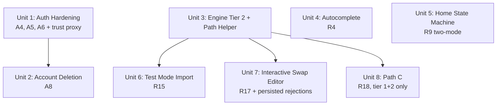

# feat: Phase 1a -- Product Core

## Overview

Evolve the Phase 0 closed-beta product into a public-ready application core. This plan covers the subset of Phase 1 work that is independent of store data (Phase 1b) and Discover/trending (Phase 1c): auth hardening for public exposure, **tier 2** substitution engine extension (tier 3 remains a Phase 2 concern per the origin doc), the interactive swap editor with persisted rejections, Path C (closest playable version using tier 1 + tier 2 only), out-of-onboarding test mode for Fabrary import, manual card autocomplete, and a simplified home state machine.

Phase 0 validated the engine hypothesis (Gate 4: 73.7% acceptance, SOFT_CONFIDENCE). Phase 1a hardens the product so it can support public sign-up from the Pelotas FaB community (~47 members) without security or UX embarrassments.

## Problem Frame

Phase 0 proved that rule-based tier 1 substitution is good enough for casual FaB players. But the closed-beta surface has deliberate gaps that block public launch:

1. **Auth is not public-ready.** No rate limiting, email enumeration leak on sign-up, no account deletion UI, no resend-verification endpoint. These are acceptable for 5-10 trusted testers but not for 47+ community members.
2. **The engine only speaks tier 1.** Phase 0's non-interactive accept-all-or-discard Path B is too blunt for real use. Users need to reject individual swaps (interactive editor with re-solve), see lower-tier suggestions when tier 1 fails (Path C), and have the engine score tier 2 + tier 3 candidates.
3. **Collection entry is limited to Fabrary URL paste + inline mark-owned.** Manual autocomplete (R4, English-only) is missing, which blocks users who want to add loose cards.
4. **Import is onboarding-only.** There is no "test this deck against my collection" mode outside of onboarding (R15), so every paste pollutes inventory.
5. **Home has one mode.** The origin doc specifies three home states (empty, fallback, populated); Phase 0 only implements populated mode.

(see origin: `docs/brainstorms/2026-04-08-fab-deck-readiness-flow-requirements.md`, Release Phasing > Phase 1)

## Requirements Trace

### Feature Requirements (from origin doc)

- **R1** (progressive collection entry): Unit 4 (autocomplete as a secondary entry method reinforcing R1)
- **R4** (manual autocomplete, English only): Unit 4
- **R9** (home state machine, 3 modes -- shell without expansion suggestions, which depend on Phase 1c Discover): Unit 5
- **R15** (out-of-onboarding test mode for Fabrary import): Unit 6
- **R17 Phase 1** (interactive swap editor with per-swap reject + engine re-solve + persisted rejections): Unit 3, Unit 7
- **R18** (Path C -- closest playable version using tier 1 + tier 2 only; tier 3 is a Phase 2 enhancement per origin doc): Unit 3, Unit 8
- **R22** (tier 2 scoring added to engine; tier 3 remains in Phase 2 scope): Unit 3

### Auth Hardening (from `docs/phase-1-followups.md` debt ledger)

- **A4** (email enumeration fix on sign-up): Unit 1
- **A5** (rate limiting on auth endpoints): Unit 1
- **A6** (resend verification email endpoint): Unit 1
- **A8** (account deletion UI + LGPD-compliant 30-day purge): Unit 2

### Security Subset (from origin doc's Security & Privacy)

- **S3** (deletion path -- now user-facing, not dev-script-only): Unit 2. The rest of S3 (encryption at rest, retention policy) is inherited from Phase 0.

## Scope Boundaries

- **No store data or shopping line.** R28-R33, Sbrauble scraper, and stock display are Phase 1b.
- **No R19 shopping line on result screens.** R19 says "In any path, the result screen also displays the shopping line (R28)." Because store data is Phase 1b, the result screens in Unit 6 and Unit 8 ship **without** the shopping line. To keep the UX shape correct for Phase 1b, both result screens render a placeholder slot ("Check availability at Cúpula DT -- coming in Phase 1b") in the position the shopping line will occupy. See Unit 6 and Unit 8 approaches.
- **Measurable success caveat.** The origin doc's secondary success metric ("≥20% of active users click ≥1 product link to a tracked store within any rolling 30-day window") depends on R28 and is **unmeasurable during Phase 1a**. Phase 1b must land before the community's 4-week engagement window closes, otherwise the primary + secondary metrics cannot be co-present. Risks table notes this timing dependency.
- **No Discover or trending ingestion.** R11-R14 are Phase 1c.
- **No home expansion suggestions.** R9 populated mode's "You may also be close to these decks" section requires Discover data (Phase 1c).
- **No R9 fallback mode in Phase 1a.** R9 defines three home modes (empty, fallback, populated). Fallback mode's only value proposition is the "3 closest decks" suggestion which requires Discover data (Phase 1c). Rather than shipping a dead placeholder for the most likely landing state (users who added cards via autocomplete but no tracked decks), Phase 1a **collapses fallback into empty mode**: if `trackedDecks.length === 0`, show empty-mode CTAs regardless of `collectionCardCount`. The three-mode machine lands in Phase 1c.
- **No tier 3 substitutions.** The origin doc's Phasing Map places R22 tier 3 in **Phase 2**. Phase 1a implements tier 1 (inherited from Phase 0) and tier 2 only. Path C (R18) is redefined for Phase 1a as "closest playable version using tier 1 + tier 2, with remaining missing cards reported". Tier 3 is a Phase 2 deepening after Phase 1 retention validates the core hypothesis. Gate 4 only produced SOFT_CONFIDENCE on tier 1 (solo-labeled); extending to tier 3 before community validation would compound engine-quality risk.
- **No PT-BR autocomplete.** R4 is English-only in Phase 1.
- **No historical chart.** R27 remains deferred.
- **No R25 substitution feedback storage.** The good/bad feedback vote UI and the learning loop are Phase 2. However, Phase 1a *does* persist per-deck rejected-substitute identifiers (see Unit 7) so the interactive swap editor is not session-only for casual/weekly users. This is storage for user intent, not feedback for engine tuning.
- **No archetype-aware weighting.** R24 is Phase 2.
- **No refresh tokens (A2).** The 7-day JWT is acceptable for Phase 1's audience size (~47 members, weekly re-sign-in is tolerable). A2 triggers when user base > 50 or session requirements change.
- **No OAuth/social login (A10).** Deferred to feedback-driven demand.
- **No MFA (A9).** Deferred to Phase 2.
- **No CSRF middleware (A1).** Bearer-token auth makes CSRF moot; revisit only if cookies are introduced.
- **No CAPTCHA (S6) on sign-up.** S6 in the origin doc lists CAPTCHA as part of the public-launch posture. For the Phase 1a audience (known 47-person community, invitation-adjacent), per-IP rate limiting + the 3 sign-ups/hour throttle is the accepted compensating control. This is a deliberate deviation from S6 and is logged as **A16** in the debt ledger with the trigger condition "before any growth campaign or open-web sign-up link". An hCaptcha or Cloudflare Turnstile integration is ~1 hour of work and should be reconsidered if abuse signals appear in Railway logs.

## Context & Research

### Relevant Code and Patterns

- **Auth module** (`apps/api/src/auth/`): DIY passport-jwt with `AuthService`, `JwtStrategy`, `JwtAuthGuard` (global APP_GUARD), `@Public()` decorator. Sign-up returns `409 EMAIL_IN_USE` (the A4 leak). No rate limiting.
- **Engine** (`packages/engine/src/`): `tier1Substitution()` in `substitution/tier1.ts` scores candidates with hard constraints (same pitch, class, type, keywords) and returns `ISubstitutionMatch` with `tier: 1`. The `ISubstitutionMatch.tier` is currently a literal `1` type, not a union -- needs widening. `computeEffectiveReadiness()` in `readiness/compute.ts` calls `tier1Substitution` in a loop, validating pitch curve after each swap.
- **Readiness types** (`packages/engine/src/readiness/types.ts`): `IEffectiveReadinessResult` returns breakdown (exact/substituted/missing) + substitutions array + pitchCurve (original/modified).
- **Deck import** (`apps/api/src/decks/import/`): `DecksImportService.importDecks()` always seeds inventory + auto-tracks. The `seedInventory` DTO flag exists but defaults to `true` and Phase 0 has no UI to set it to `false`.
- **Collection** (`apps/api/src/collection/`): `CollectionService.markOwned()` handles the R5 inline "I have this one" flow. No general "add card by name" endpoint exists.
- **Frontend routes** (`apps/web/src/routes/`): `_auth/home.tsx` (populated deck list only), `_auth/onboarding.tsx` (URL paste form), `_auth/decks.$deckId.tsx` (deck detail with breakdown).
- **Catalog** (`apps/api/src/catalog/`, `packages/engine/src/catalog/`): loads `@flesh-and-blood/cards` once at module init. Has `byIdentifier` and `byClassAndPitch` indices. The catalog service exposes card lookup but no search/autocomplete endpoint.

### Institutional Learnings

- **Gate 4 rejection analysis** (`docs/brainstorms/gates/gate-4-score-result.md`): of 21 labeled substitutions, 2 were "uncertain" (excluded), 14 "yes" and 5 "no" -- giving 14/19 = 73.7% acceptance (SOFT_CONFIDENCE). Common rejection pattern: cards with identical pitch/class/type/keywords but fundamentally different card *effects* (e.g., Destructive Aethertide vs Aether Quickening). This is a tier 1 engine limitation -- the engine matches structural attributes but not card text/effect semantics. Tier 2 scoring should not relax structural constraints; instead it should relax keyword and stat constraints. Effect-aware scoring is a Phase 2+ concern.
- **Phase 0 auth migration** (`docs/plans/2026-04-09-001-feat-replace-clerk-diy-auth-plan.md`): Clerk was replaced with DIY passport-jwt mid-Phase 0. The current auth is well-tested (auth.service.spec.ts covers sign-up, sign-in, verify, reset flows). Building on top of it for A4/A5/A6/A8 is incremental, not a rewrite.

## Key Technical Decisions

- **Tier 2 relaxes keyword + stat constraints only; tier 3 stays in Phase 2.** Tier 2 drops the "must have overlapping keywords" hard gate and widens power/defense delta to 2. Tier 2 keeps the hard structural constraints: same pitch + class intersection + type intersection + equipment slot (these are FaB mechanical fundamentals that cannot be relaxed). This keeps the Gate 4 pattern: structural matches that are mechanically valid, even if card effects diverge. Effect-aware scoring and tier 3 scoring are deferred to Phase 2.

- **Zero-keyword scoring fix.** The current `tier1.ts` keyword penalty formula computes `(1 - overlap/max(missing.keywords.length, 1)) * 0.35`, which incorrectly applies a 0.35 penalty to missing cards with zero keywords -- dropping the base score from 1.0 to 0.65 (below the tier 2 floor of 0.70). This means FaB's numerous keywordless action cards can never match at tier 2. Unit 3 fixes this by gating the keyword penalty on `missing.keywords.length > 0`; if the missing card has no keywords, keyword score is 1.0 (no penalty). This applies to tier 1 as well, though tier 1's hard gate already rejected most of the affected cases.

- **`computeEffectiveReadiness` becomes tiered and exclusion-aware.** The readiness function tries tier 1 first (current behavior), then tier 2 for remaining missing cards. The engine function gains a fifth optional parameter `excludedIdentifiers?: ReadonlySet<string>` that is threaded into the tiered search to skip rejected substitutes during re-solve. The result type gains a `path: 'A' | 'B' | 'C'` field (see Path definitions below) computed deterministically from the breakdown -- this derivation applies to both fresh computes and legacy persisted snapshots, so no database migration is needed.

- **Path definitions, single source of truth:**
  - **Path A**: `breakdown.missing.length === 0 && breakdown.substituted.length === 0` (100% exact coverage).
  - **Path B**: `breakdown.missing.length === 0 && breakdown.substituted.length > 0` (all missing cards covered by substitutions; effectivePercent = 100%).
  - **Path C**: `breakdown.missing.length > 0` (some cards remain missing even after tier 1 + tier 2 attempts).
  These definitions are enforced in the engine's `computePath(breakdown)` helper, added in Unit 3. Unit 6 (test mode), Unit 7 (re-solve), and Unit 8 (Path C display) all consume this single helper.

- **Interactive swap editor uses a "reject + re-solve" pattern, not a constraint solver.** When the user rejects a swap, the engine adds the substitute's identifier to the exclusion set and re-runs `computeEffectiveReadiness` for the entire deck. Rejection scope is **global per deck**, not per missing-card slot: rejecting "use Card X as a substitute in deck D" means "never suggest Card X for any missing copy in deck D". This is simpler for casual users and matches FaB's low copy-count-per-card reality. The exclusion is O(n * m) where n = deck cards and m = inventory size, which is <50ms for typical FaB decks (60-80 cards, <2000 inventory).

- **Rejected substitutes persist in a per-deck join table.** A `rejected_substitute` table (`id`, `trackedDeckId`, `cardIdentifier`, `rejectedAt`) stores the user's rejections. Refreshing the deck detail page re-applies the persisted rejections automatically. The feedback-loop UI (R25) and cross-deck learning are still Phase 2 -- this table only stores user intent scoped to one deck. "Reset all rejections" clears the table rows for that deck. A user can have zero-to-many rejected substitutes per deck; deleting a deck cascades the rows.

- **Rate limiting via `@nestjs/throttler` registered as a second global APP_GUARD.** `ThrottlerGuard` is registered in `app.module.ts` alongside the existing `JwtAuthGuard`. **All routes are throttled by default** with a lenient per-user limit (120 req/min authenticated, 30 req/min anonymous). Auth endpoints override with stricter per-IP limits via `@Throttle()` decorators (5 sign-in attempts/minute, 3 sign-up attempts/hour, 5 forgot-password/hour, 3 resend-verification/hour). Compute endpoints (re-solve, test-deck, catalog search) use explicit per-route limits sized for their expected traffic. The `@SkipThrottle()` decorator is applied to `/api/health` only. This resolves the contradiction in earlier drafts that described both "global limit" and "per-controller scope".

- **Trust-proxy configuration is mandatory.** Railway sits behind a load balancer that injects the real client IP into `X-Forwarded-For`. Without `app.set('trust proxy', 1)` in `main.ts` before `app.listen()`, Express reads `req.ip` as the Railway gateway's address and **all requests share a single IP from the app's perspective**, collapsing per-IP rate limiting into a single global budget. The Unit 1 implementation must add this setting and include a smoke test that verifies `req.ip` reflects the `X-Forwarded-For` header value in a proxied request.

- **SSRF guard is mandatory for all new outbound HTTP.** Any new service that fetches a user-supplied URL (Unit 6 TestDeckService is the only new fetcher in Phase 1a) **MUST** route through `FetchGuardService.guardedFetch` from `apps/api/src/common/fetch-guard/`. Direct `fetch()` calls are forbidden. This preserves the Phase 0 S5 allow-list, redirect-blocking, size-cap, and timeout protections on the new attack surface.

- **Email enumeration fix uses the "always 202" pattern.** Sign-up returns `202 Accepted` with a generic message regardless of whether the email exists. The existing-user check at the start of `AuthService.signUp()` is **preserved** -- when the email already exists, the service silently returns the same generic 202 without sending an email or creating a new row. This matches the forgot-password endpoint's existing pattern. Removing the existing-user check would cause a database unique-constraint violation and a 500 response, leaking existence via error shape.

- **Account deletion is a soft delete + 30-day purge with operational safety.** `DELETE /api/auth/me` requires password re-entry. Marks the user as `deletedAt = now()`. The `JwtStrategy.validate()` method checks `user.deletedAt !== null` using the **same `findOne` query** already in place (no additional DB hit) -- the existing per-request DB load just gains one column check. A scheduled cleanup (`scripts/purge-deleted-users.ts`) purges rows after 30 days with (a) a `--dry-run` flag that prints what would be deleted, (b) structured logging of every deleted userId before deletion, (c) an interactive confirmation prompt when run outside a cron context, and (d) documented Railway cron wiring.

- **Autocomplete uses a server-side search endpoint, not client-side catalog.** The `@flesh-and-blood/cards` catalog is ~4500 cards. Shipping the full catalog to the frontend is wasteful and exposes the complete card database. A `GET /api/catalog/search?q=...&limit=10` endpoint filters server-side and returns only matching results. The search uses a simple `startsWith` + `includes` fallback on `card.name`, scoped to non-token, non-hero card types. **Auth posture**: authenticated (behind the global `JwtAuthGuard`). **Rate limit**: `@Throttle({ default: { limit: 30, ttl: 60_000 } })` (30 req/min per user) to accommodate debounced search traffic without being abusable.

- **`addCard` recompute is cross-deck, not single-deck.** Unlike `markOwned()` which recomputes one deck, `addCard` has no deck scope: adding a card globally affects all tracked decks containing that card. The service queries `DeckCardEntity WHERE cardIdentifier = addedCard AND trackedDeck.userId = userId` to find affected decks, then calls `SubstitutionService.computeAndStoreReadiness` for each. This mirrors the `recomputeExistingDecks()` pattern in `DecksImportService`, not `markOwned()`. The cost is O(affected decks) which is acceptable at Phase 1 scale (<20 decks per user).

- **Home state machine is two modes, not three, in Phase 1a.** Per the Scope Boundaries decision to collapse fallback into empty, the home state machine evaluates: **empty mode** when `trackedDecks.length === 0` (regardless of collectionCardCount), **populated mode** when `trackedDecks.length > 0`. This is a 1a simplification; R9's three-mode state machine lands in Phase 1c when Discover data makes fallback mode meaningful.

- **Test mode import is a new endpoint, not a flag on the existing import.** `POST /api/decks/test` accepts a single Fabrary URL, fetches the deck *via `FetchGuardService.guardedFetch`*, runs `computeEffectiveReadiness` against the user's current inventory, and returns the result *without* persisting anything (no inventory seed, no tracked deck, no snapshot). The "Also add these cards to my inventory" button on the result screen calls the existing import endpoint with `seedInventory: true`. The "Track this deck" button calls the existing import endpoint with `seedInventory: false` -- the existing `ImportDecksDto` is updated so the controller accepts a caller-supplied `seedInventory` (default `true` to preserve onboarding behavior). This keeps the import endpoint's transactional semantics clean.

## Open Questions

### Resolved During Planning

- **Rate limiting library: `@nestjs/throttler` vs custom middleware?** Resolved to `@nestjs/throttler` v6.x (NestJS 11 compatible). It integrates with NestJS guards, supports per-route configuration via decorators, and handles the per-IP + per-user patterns needed.
- **Rate limiting guard scope: global vs per-controller?** Resolved to global: `ThrottlerGuard` as a second `APP_GUARD` in `app.module.ts`. Lenient default throttle on all routes, strict `@Throttle()` overrides on auth + compute endpoints. See Key Technical Decisions for numeric limits.
- **Trust proxy: required?** Resolved to yes. Railway load balancer requires `app.set('trust proxy', 1)` for accurate per-IP throttling.
- **Tier 2 scoring approach: relax constraints vs separate scoring function?** Resolved to a parameterized scoring function (`scoreCandidate(missing, candidate, config: ITierConfig)`) with per-tier configs, replacing the hardcoded `tier1.ts`. Tier 1 and tier 2 share structural logic; they differ only in which constraints are hard gates vs soft penalties and the floor score. Tier 3 is not built in Phase 1a.
- **Interactive re-solve: full re-solve vs incremental?** Resolved to full re-solve. The deck is small enough (<80 cards) that recomputing from scratch with the rejected cards excluded is simpler and more correct than incremental patching.
- **Rejection scope: global per deck vs per missing-card slot?** Resolved to global per deck. Rejecting "use Card X as a substitute in deck D" means "never suggest Card X for any missing copy in deck D". Simpler mental model for casual users; matches FaB's low-copy-count reality.
- **Rejection persistence: session-only vs persisted?** Resolved to persisted via a `rejected_substitute` join table. Casual players returning weekly must not re-do rejections on every session. The table stores user intent scoped to one deck and cascades on deck deletion. This is distinct from the R25 feedback-loop storage which remains Phase 2.
- **Curve-breaking rejection behavior: block or warn?** Resolved to warn-but-allow. When a rejection would make the pitch curve invalid and no alternative substitution exists, the UI displays a visible warning callout ("Rejecting this swap breaks the pitch curve -- no alternative found") and the rejection is still applied (the card moves to "missing"). Rationale: blocking is paternalistic for a casual audience; warning is sufficient. The affected row renders with a warning icon and amber highlight so the state is not buried.
- **Path determination: engine vs API layer?** Resolved to engine layer. Unit 3 adds `computePath(breakdown)` and the `path: 'A' | 'B' | 'C'` field on `IEffectiveReadinessResult`. Units 6, 7, 8 all consume this single helper rather than duplicating the logic.
- **Legacy snapshot path field handling?** Resolved: derive at read time from the existing breakdown JSONB, no database migration required. The helper is pure function over `breakdown.missing.length` and `breakdown.substituted.length`.
- **Path C fidelity score formula.** Resolved to tier-weighted: `(exactCount + Σ(tierWeight(sub.tier) * sub.quantity)) / totalCards * 100` where `tierWeight(1) = 0.9`, `tierWeight(2) = 0.7`. This distinguishes a 68% fidelity from tier 1 substitutes (high confidence) from the same percentage from tier 2 substitutes (lower confidence). An unweighted formula would blur the qualitative difference that Gate 4 explicitly surfaced.
- **Home modes in Phase 1a: 2 or 3?** Resolved to 2 (empty, populated). See Scope Boundaries for rationale. The three-mode machine lands in Phase 1c.
- **GET /api/catalog/search auth posture: public or authenticated?** Resolved to authenticated (inherits the global `JwtAuthGuard` since no `@Public()` decorator is added). Explicit `@Throttle({ default: { limit: 30, ttl: 60_000 } })` to accommodate debounced typing.

### Deferred to Implementation

- **Exact tier 2 score weights.** The tier definitions from R22 give semantic guidance (tier 2: 70-89%) but the exact weight adjustments for keyword penalty and power/defense penalty are picked during Unit 3 implementation and validated against the gold set as a regression check. The tier 2 floor starts at 0.70.
- **Autocomplete debounce timing.** The frontend debounce on the search input (200ms? 300ms?) is tuned during implementation based on perceived responsiveness.
- **Account deletion cascade order.** The exact table ordering for the `deletedAt`-based purge is verified against entity relations during implementation. Before writing `purge-deleted-users.ts`, verify that `scripts/delete-user.ts` includes all current tables (`collection_card`, `deck_card`, `deck_readiness_snapshot`, `rejected_substitute` (new in Unit 7), `tracked_deck`, `user`) in FK-respecting order.
- **Tier 1/2 label copy and visual treatment details.** The design concept (tier 1 = green/confident, tier 2 = amber/caution) is settled; exact palette values are tuned during Unit 3/7 implementation against the existing SubstitutionRow styling.

## Implementation Units

Units 1, 4, and 5 are independent and can start immediately. Unit 3 unblocks Units 6, 7, and 8 (they can run in parallel after Unit 3 lands). Unit 2 follows Unit 1 because account deletion exposes a destructive endpoint to the public surface and should land after rate limiting + email-leak fixes. Unit 6's test result screen integrates with Unit 7's re-solve as an enhancement, but Unit 7's core capability (deck detail re-solve) does not depend on Unit 6.

- [x] **Unit 1: Auth Hardening (A4, A5, A6)**

**Goal:** Harden auth endpoints for public exposure: fix email enumeration leak, add rate limiting with correct IP attribution, add resend-verification endpoint.

**Requirements:** A4, A5, A6

**Dependencies:** None

**Files:**
- Modify: `apps/api/src/auth/auth.service.ts` (A4 + A6 methods)
- Modify: `apps/api/src/auth/auth.controller.ts` (A6 endpoint + `@Throttle()` decorators on all auth methods)
- Modify: `apps/api/src/auth/dtos/sign-up.dto.ts` (response shape change -- generic 202 message)
- Create: `apps/api/src/auth/dtos/resend-verification.dto.ts`
- Modify: `apps/api/src/auth/errors.ts` (remove `EAuthErrorCode.EmailInUse` enum entry -- now dead code after A4 fix)
- Modify: `apps/api/src/auth/auth-error.mapper.ts` (remove `EmailInUse → ConflictException` entry from `STATUS_MAP`)
- Modify: `apps/api/src/app.module.ts` (import `ThrottlerModule.forRoot()`, register `ThrottlerGuard` as a second `APP_GUARD` alongside `JwtAuthGuard`)
- Modify: `apps/api/src/main.ts` (add `app.set('trust proxy', 1)` before `app.listen()` so `req.ip` reflects the real client IP from `X-Forwarded-For`, not Railway's gateway IP)
- Modify: `apps/api/src/health/health.controller.ts` (add `@SkipThrottle()` so health checks are not throttled)
- Modify: `apps/api/package.json` (add `@nestjs/throttler@^6`)
- Modify (frontend): `apps/web/src/routes/sign-in.tsx`, `sign-up.tsx`, `forgot-password.tsx`, `reset-password.tsx` (detect HTTP 429 responses and render "Too many attempts. Please wait N minutes and try again." using the `Retry-After` header when present)
- Test: `apps/api/src/auth/__tests__/auth.service.spec.ts`
- Test: `apps/api/src/auth/__tests__/auth.controller.e2e-spec.ts`

**Approach:**
- **A4 fix:** Change `signUp()` to always return `202 Accepted` with `{ message: "If this email is not already registered, you will receive a verification link shortly." }`. **Preserve the existing-user check at the start of the method** -- when the email already exists, return the same generic 202 without sending an email and without attempting to save a new row (saving would cause a database unique-constraint violation, leaking existence via the 500 response). Remove the `409 EMAIL_IN_USE` throw site AND remove `EAuthErrorCode.EmailInUse` from `errors.ts` and its entry from the `STATUS_MAP` in `auth-error.mapper.ts` so no dead code remains.
- **A5 (global throttler + trust proxy):** Install `@nestjs/throttler@^6`. Register `ThrottlerModule.forRoot([{ name: 'default', ttl: 60_000, limit: 120 }])` in `app.module.ts`. Register `ThrottlerGuard` as a second `APP_GUARD` provider so **all routes throttle by default** with the lenient 120 req/min baseline. Add `@Throttle()` decorator overrides on auth controller methods:
  - `POST /api/auth/sign-in`: 5/min per IP
  - `POST /api/auth/sign-up`: 3/hour per IP
  - `POST /api/auth/forgot-password`: 5/hour per IP
  - `POST /api/auth/reset-password`: 5/hour per IP
  - `POST /api/auth/resend-verification`: 3/hour per IP
  - `POST /api/auth/verify-email`: 10/hour per IP
  - `GET /api/auth/me`: default (120/min)
  Add `@SkipThrottle()` on `GET /api/health`. Configure the throttler's IP resolver to use `req.ip` (which is trustworthy once trust-proxy is enabled).
- **Trust proxy:** In `main.ts`, after `NestFactory.create()` and before `app.listen()`, call `app.set('trust proxy', 1)`. Add an integration test that sends a request with a synthetic `X-Forwarded-For: 203.0.113.1` header and asserts that the throttler treats it as a distinct IP.
- **A6:** Add `POST /api/auth/resend-verification` accepting `{ email }` (with `class-validator` `@IsEmail()`). Generates a new verification token and sends the verification email. Returns the same generic 202 regardless of whether the email exists or is already verified. Rate-limited via `@Throttle()` to 3/hour per IP. **Known acceptable risk**: an unverified user can extend their account lifetime indefinitely by resending verification every 23 hours. For 47-person community scale this is acceptable; log as a low-priority follow-up for Phase 2 (purge unverified accounts older than 7 days).

**Patterns to follow:**
- Existing `forgotPassword()` in `auth.service.ts` already implements the "generic response regardless of email existence" pattern. A4 and A6 mirror this pattern.
- Existing `auth.controller.ts` `@Public()` decorator pattern for unauthenticated endpoints.

**Test scenarios:**
- Happy path: sign-up with new email returns 202 and sends verification email
- Happy path: sign-up with existing (unverified) email returns 202 and does NOT send an email (no leak, no new row, no 500 from unique-constraint violation)
- Happy path: resend-verification with valid unverified email sends new verification email
- Edge case: resend-verification with already-verified email returns 202 silently
- Edge case: resend-verification with non-existent email returns 202 silently
- Error path: sign-in rate limit triggers after 5 attempts in 1 minute from the same IP, returns 429 with `Retry-After` header
- Error path: sign-up rate limit triggers after 3 attempts in 1 hour from the same IP, returns 429
- Error path: resend-verification rate limit triggers after 3 attempts in 1 hour, returns 429
- Integration: request with synthetic `X-Forwarded-For` header is treated as the forwarded IP by the throttler (trust-proxy verification)
- Integration: two simulated clients at different IPs can each hit the per-IP limit independently (isolation regression)
- Integration: rate limiter resets after the time window expires
- Integration: `EAuthErrorCode.EmailInUse` is no longer referenced anywhere in the source tree (grep-based regression)
- Frontend: sign-in form displays the 429 wait-time message with the `Retry-After` seconds formatted as minutes

**Verification:**
- All auth endpoints return generic responses that do not leak email existence
- Rate limiting is enforced per-IP (not per-gateway-IP) and returns 429 with a meaningful message + `Retry-After`
- Existing auth tests still pass (sign-in, verify-email, forgot-password, reset-password)
- No orphaned `EmailInUse` references remain in the codebase

---

- [x] **Unit 2: Account Deletion UI (A8)**

**Goal:** Add a user-facing account deletion flow with password confirmation, soft delete, and LGPD-compliant 30-day purge path.

**Requirements:** A8, S3 (deletion path)

**Dependencies:** Unit 1 (auth hardening must be in place before exposing deletion to public users)

**Files:**
- Modify: `apps/api/src/database/entities/user.entity.ts` (add `deletedAt` column)
- Create: `apps/api/src/auth/dtos/delete-account.dto.ts`
- Modify: `apps/api/src/auth/auth.service.ts` (add `deleteAccount()`)
- Modify: `apps/api/src/auth/auth.controller.ts` (add `DELETE /api/auth/me`)
- Modify: `apps/api/src/auth/jwt.strategy.ts` (reject users with `deletedAt` set)
- Create: `apps/api/src/database/migrations/TIMESTAMP-add-user-deleted-at.ts`
- Modify: `apps/web/src/routes/_auth/home.tsx` or create settings surface
- Create: `apps/web/src/components/DeleteAccountModal.tsx`
- Test: `apps/api/src/auth/__tests__/auth.service.spec.ts`

**Approach:**
- Add `deletedAt: Date | null` to `UserEntity`. Default null. Migration runs **before** the updated code deploys (migration-first deploy; document this in the deployment notes).
- `DELETE /api/auth/me` requires `{ password }` in the body. Verifies password, sets `deletedAt = now()`. Returns 200 with a confirmation message. Does not cascade-delete data immediately.
- `JwtStrategy.validate()` adds a single `if (user.deletedAt !== null) throw new UnauthorizedException()` check **inside the existing `findOne` result block**. This reuses the existing per-request DB query (A13 trade-off from phase-0-followups) -- no additional database hit. The implementation must be a field check on the already-loaded entity, not a separate query.
- Frontend: a "Delete my account" link in the user menu (`__root.tsx` header dropdown or new settings surface) opens `DeleteAccountModal`. The modal body includes:
  - Title: "Delete your account"
  - Explanatory copy: "Your account and all linked data (collection, tracked decks, readiness history) will be permanently deleted after 30 days. You will be signed out immediately."
  - Password input (required) with inline error display below the input on 401
  - Confirmation checkbox with label: "I understand my account and all data will be permanently deleted"
  - Submit button (destructive style) disabled until both password is filled and the checkbox is checked
  - Submit button shows an inline spinner + "Deleting..." while the DELETE request is in flight
  - On 200: clear JWT from localStorage, redirect to landing page with a one-time success toast "Your account has been deleted"
  - On 401: inline "Incorrect password" error below the password input, keep the modal open
  - On other error: inline error in the modal body, keep the modal open
- The 30-day purge script (`scripts/purge-deleted-users.ts`):
  - Reads users where `deletedAt < now() - 30 days`
  - Cascades through all user-linked tables in a single transaction: `rejected_substitute` (new in Unit 7) → `deck_readiness_snapshot` → `deck_card` → `tracked_deck` → `collection_card` → `user`
  - Supports `--dry-run` flag that prints the userIds that would be deleted without touching the database
  - Structured logs every deleted userId before the transaction commits (via `nestjs-pino` or a throwaway logger, no PII in the log beyond the UUID)
  - Interactive confirmation prompt (`readline` y/n) when run outside a non-TTY context (detected via `process.stdin.isTTY`)
  - Documents Railway cron wiring in `scripts/deploy-railway.md`: how to schedule the script to run daily

**Patterns to follow:**
- Existing `scripts/delete-user.ts` handles the cascade logic. **Verify** it includes all current entity tables before reusing. If any are missing, add them during purge script implementation.
- Existing `auth.service.ts` password verification pattern (bcrypt compare).

**Test scenarios:**
- Happy path: authenticated user sends DELETE with correct password -> user.deletedAt is set, response is 200
- Happy path: deleted user's JWT is immediately rejected by JwtStrategy (returns 401)
- Error path: DELETE with wrong password returns 401 "Invalid password"
- Error path: unauthenticated request to DELETE /api/auth/me returns 401
- Edge case: user who is already soft-deleted cannot delete again (returns 404 via JwtStrategy rejection)
- Integration: purge script deletes user + all related rows (collection_card, tracked_deck, deck_card, deck_readiness_snapshot) for users deleted >30 days ago

**Verification:**
- A user can delete their account from the UI
- The deleted user cannot sign in or access any authenticated endpoint
- The purge script successfully removes all user data after 30 days

---

- [x] **Unit 3: Engine Tier 2 Substitution Scoring + Path Helper**

**Goal:** Extend the substitution engine to score tier 2 (70-89%) candidates, fix the zero-keyword scoring bug, add a `path` field + `computePath()` helper, add an `excludedIdentifiers` parameter for re-solve, and keep tier 1 behavior unchanged. Tier 3 stays in Phase 2 per the origin doc.

**Requirements:** R22 (tier 2 only -- tier 3 is Phase 2), R17 Phase 1 (prerequisite), R18 (prerequisite for Path C path determination)

**Dependencies:** None (pure engine package, no API changes)

**Files:**
- Modify: `packages/engine/src/substitution/tier1.ts` -> refactor to `packages/engine/src/substitution/score.ts` (parameterized scorer; fixes the zero-keyword penalty bug)
- Modify: `packages/engine/src/substitution/constants.ts` (add tier 2 config; remove obsolete tier-1-specific weight constants if they end up only used by `score.ts`)
- Modify: `packages/engine/src/substitution/rationale.ts` (accept tier number; rationale strings now reflect tier 1 vs tier 2 context, e.g. "Tier 2 substitute -- keyword overlap relaxed: same red Warrior attack, +1 power")
- Modify: `packages/engine/src/substitution/types.ts` (widen `ISubstitutionMatch.tier` from literal `1` to union `1 | 2`; add `ITierConfig` interface)
- Create: `packages/engine/src/substitution/find-substitution.ts` (tiered search: try tier 1, then tier 2)
- Modify: `packages/engine/src/readiness/types.ts` (add `path: 'A' | 'B' | 'C'` to `IEffectiveReadinessResult`)
- Create: `packages/engine/src/readiness/compute-path.ts` (`computePath(breakdown): 'A' | 'B' | 'C'` pure helper, derived from `breakdown.missing.length` and `breakdown.substituted.length`)
- Modify: `packages/engine/src/readiness/compute.ts` (use `findSubstitution` instead of `tier1Substitution`; add fifth optional parameter `excludedIdentifiers?: ReadonlySet<string>` threaded into the per-card substitution call; populate `path` field via `computePath()`)
- Modify: `packages/engine/src/index.ts` (export `findSubstitution`, `computePath`, `ITierConfig`; **remove** `tier1Substitution` from public exports -- this is a breaking change for any external consumer, but the only in-repo consumer is `compute.ts` which is updated in the same PR)
- Modify: `packages/engine/src/substitution/index.ts` (mirror the public-API changes)
- Test: `packages/engine/__tests__/tier1.spec.ts` -> rename to `score.spec.ts`; add tier 2 cases + zero-keyword regression
- Test: `packages/engine/__tests__/readiness.spec.ts` (add tiered readiness cases + path field assertions + excluded identifiers cases)
- Test: `packages/engine/__tests__/compute-path.spec.ts` (new -- pure unit tests on the helper)

**Approach:**
- Extract the scoring logic from `tier1.ts` into a parameterized `scoreCandidate(missing, candidate, config: ITierConfig)` function. `ITierConfig` specifies: `requireKeywordOverlap: boolean`, `maxPowerDelta: number`, `maxDefenseDelta: number`, `floorScore: number`.
- Tier 1 config: `{ requireKeywordOverlap: true, maxPowerDelta: 1, maxDefenseDelta: 1, floorScore: 0.90 }` (preserves current behavior).
- Tier 2 config: `{ requireKeywordOverlap: false, maxPowerDelta: 2, maxDefenseDelta: 2, floorScore: 0.70 }`.
- All tiers retain the hard constraints: same pitch, class intersection, type intersection, equipment slot match.
- **Zero-keyword scoring fix:** When `missing.keywords.length === 0`, the keyword penalty must be 0 (the candidate is not penalized for "missing" keyword overlap on a card that has no keywords). Current code computes `keywordScore = overlap / max(missing.keywords.length, 1) = 0/1 = 0` and penalizes 0.35, dropping a perfect-structural match to 0.65 (below tier 2 floor). The fix: gate the keyword penalty arithmetic on `if (missing.keywords.length > 0)`. This applies to both tier 1 and tier 2 (tier 1 also has the bug, but its `requireKeywordOverlap` hard gate already excluded most affected cases).
- `findSubstitution(missing, inventory, catalog, tolerance, excludedIdentifiers?)` tries tier 1 first, then tier 2. Returns the best match at the highest tier that produces a result, or null. Skips any candidate whose `cardIdentifier` is in the `excludedIdentifiers` set.
- `computeEffectiveReadiness(deck, inventory, catalog, tolerance?, excludedIdentifiers?)` gains the optional fifth parameter and threads it into `findSubstitution`. After computing the breakdown, calls `computePath(breakdown)` and includes the `path` in the result. The `path` is derived purely from `missing.length` and `substituted.length` -- no additional state.
- `computePath(breakdown)`:
  - `'A'` if `breakdown.missing.length === 0 && breakdown.substituted.length === 0`
  - `'B'` if `breakdown.missing.length === 0 && breakdown.substituted.length > 0`
  - `'C'` if `breakdown.missing.length > 0`
- **Legacy snapshot handling:** Existing persisted snapshots in `deck_readiness_snapshot.breakdown` JSONB do not have a `path` field. The API layer derives `path` at read time by calling `computePath(snapshot.breakdown)` -- no migration, no backfill, no JSONB schema change.
- `composeRationale(missing, candidate, tier)` adds a tier-aware prefix. Tier 1: existing format. Tier 2: prefix with "Tier 2 substitute -- keyword overlap relaxed:" so the user sees it is a softer match.
- Existing tier 1 test cases must still pass as-is (regression). The gold set CSV at `docs/brainstorms/gates/gate-4-gold-set.csv` is loaded as a regression fixture.

**Patterns to follow:**
- Existing `tier1.ts` scoring structure (hard constraint checks -> soft penalty accumulation -> floor check).
- Existing `constants.ts` pattern for score thresholds and weights.

**Test scenarios:**
- Happy path: tier 1 candidate found -> returns match with `tier: 1` (regression)
- Happy path: no tier 1 match but tier 2 match exists (keyword overlap missing but class/pitch/type match) -> returns match with `tier: 2`
- Happy path: tier 2 candidate with power delta = 2 scores above tier 2 floor (0.70) -> accepted
- Happy path: missing card with zero keywords + structurally identical candidate -> tier 1 match (regression for the zero-keyword fix)
- Happy path: missing card with zero keywords + candidate with power delta = 2 -> tier 2 match (the case the bug previously broke)
- Happy path: all tiers fail -> returns null
- Edge case: candidate is in the excluded list -> skipped even if it would score tier 1; engine falls through to next-best non-excluded candidate
- Edge case: tier 2 candidate with power delta = 2 but score < 0.70 -> returns null (no tier 3 fallback in Phase 1a)
- Error path: missing card has no catalog entry -> returns null (existing behavior preserved)
- Integration: `computeEffectiveReadiness` with a deck that needs tier 2 subs -> effectivePercent reflects tier 2 substitutions, breakdown.substituted entries have `tier: 2`
- Integration: `computeEffectiveReadiness` with `excludedIdentifiers` containing all of a card's tier 1 candidates -> falls through to tier 2 or to missing
- Integration: `path` field on the result is correctly `'A'`, `'B'`, or `'C'` for fresh computations matching the helper's definitions
- Integration: `computePath` invoked on legacy snapshot breakdowns derives the correct path without requiring a `path` field in the stored JSONB
- Integration: gold set regression -- all 14 "yes" tier 1 substitutions from Gate 4 (of 19 non-uncertain labels) still produce tier 1 matches

**Verification:**
- All existing engine tests pass (regression)
- Gold set regression test passes: tier 1 acceptance rate unchanged
- New tier 2 + zero-keyword + excluded-identifier + path-field tests pass
- `computeEffectiveReadiness` returns higher effectivePercent when tier 2 candidates are available vs tier 1 only
- `tier1Substitution` is no longer exported anywhere in the engine public API (grep regression)

---

- [x] **Unit 4: Manual Card Autocomplete (R4)**

**Goal:** Add a search-as-you-type card autocomplete so users can add individual cards to their collection without pasting a Fabrary URL. Authenticated, throttled, ARIA-compliant, and recomputes readiness across all affected tracked decks.

**Requirements:** R4 (English-only), R1 (progressive collection entry)

**Dependencies:** None

**Files:**
- Create: `apps/api/src/catalog/catalog.controller.ts` (authenticated, with explicit `@Throttle({ default: { limit: 30, ttl: 60_000 } })` for 30 req/min/user)
- Create: `apps/api/src/catalog/dtos/search-cards.dto.ts` (`@IsString() @MinLength(2) @MaxLength(50)` for `q`; `@IsInt() @Min(1) @Max(20) @IsOptional()` for `limit`)
- Modify: `apps/api/src/catalog/catalog.module.ts` (add controller)
- Modify: `apps/api/src/catalog/catalog.service.ts` (add `search()` method)
- Create: `apps/api/src/collection/dtos/add-card.dto.ts`
- Modify: `apps/api/src/collection/collection.controller.ts` (add `POST /api/collection/cards`)
- Modify: `apps/api/src/collection/collection.service.ts` (add `addCard()` with cross-deck recompute)
- Modify: `apps/api/src/collection/collection.module.ts` (inject `DeckCardEntity` and `TrackedDeckEntity` repositories so `addCard` can query affected decks)
- Create: `apps/web/src/components/CardAutocomplete.tsx` (ARIA combobox pattern)
- Create: `apps/web/src/api/catalog.ts` (useSearchCardsQuery)
- Create: `apps/web/src/api/collection.ts` (useAddCardMutation)
- Modify: `apps/web/src/routes/_auth/home.tsx` (add autocomplete; placement is **below** the primary mode CTA in both empty and populated modes -- the CTA leads, the autocomplete supports)
- Test: `apps/api/src/catalog/__tests__/catalog.service.spec.ts`
- Test: `apps/api/src/collection/__tests__/collection.service.spec.ts`

**Approach:**
- **Search endpoint:** `GET /api/catalog/search?q=<query>&limit=10`. Authenticated (no `@Public()` decorator). Filters `@flesh-and-blood/cards` by name using case-insensitive `startsWith` match first, then `includes` fallback to fill the result list up to `limit`. Excludes tokens and heroes (they are not collectible in this context). Returns `{ results: Array<{ cardIdentifier, name, pitch, classes, types, ownedQuantity: number }> }`. The `ownedQuantity` field is populated from `CollectionCardEntity` for the requesting user so the dropdown can render an "x3 owned" badge inline.
- **Add-card endpoint:** `POST /api/collection/cards` with `{ cardIdentifier, quantity }`. Validates that `cardIdentifier` exists in the catalog (returns 400 with `INVALID_CARD_IDENTIFIER` if not). Upserts `CollectionCardEntity` for the authenticated user. **Triggers cross-deck readiness recompute**: queries `DeckCardEntity` joined to `TrackedDeckEntity` filtered by `userId` and `cardIdentifier = added card`, then calls `SubstitutionService.computeAndStoreReadiness(deckId, userId)` for each affected deck. This is the `recomputeExistingDecks()` pattern from `DecksImportService`, **not** the single-deck `markOwned()` pattern. Cost is O(decks containing the card) which is acceptable at Phase 1 scale (<20 tracked decks per user).
- **Frontend (CardAutocomplete):** debounced input (TanStack Query, `staleTime: 30s`, `enabled: query.length >= 2`, debounced via React's `useDeferredValue` or a manual `setTimeout` of 250ms). Implements the **ARIA combobox pattern** (`role="combobox"`, `aria-expanded`, `aria-controls`, `aria-activedescendant`, `aria-autocomplete="list"`). Use Radix UI's `Combobox` primitive if already in the project; otherwise hand-roll the pattern with the standard ARIA attributes -- do not ship a plain `
` list. Keyboard interactions:
  - Arrow Down/Up: move highlight through results
  - Enter: select the highlighted result and call `addCard` mutation
  - Escape: close the dropdown without selecting
  - Click outside: close the dropdown
- **Result row content:** card name (primary), pitch color indicator (left), class abbreviation (right), and an "owned: N" badge when `ownedQuantity > 0`.
- **Empty results state:** when `results.length === 0` and `query.length >= 2` and the request has settled, the dropdown renders `No cards found for "{query}"` instead of disappearing.
- **Post-add feedback:** inline confirmation pill below the input (`Added Razor Reflex (now in collection: 3)`) that auto-dismisses after 2.5s. The input does not clear automatically, so the user can re-select for rapid quantity bumps. The dropdown stays open after add to support multi-add.
- **Loading state:** while the search query is in flight, a small inline spinner appears on the right of the input.
- **Mutation invalidation:** `useAddCardMutation`'s `onSuccess` callback invalidates `['decks']` (so home mode + readiness numbers refresh) and `['catalog', 'search']` (so the just-added card's `ownedQuantity` updates in the dropdown). This is critical for the home state machine to transition correctly when the user adds their first card.

**Patterns to follow:**
- Existing `DecksImportService.recomputeExistingDecks()` for the cross-deck recompute pattern (not `markOwned()`).
- Existing TanStack Query hooks in `apps/web/src/api/` for the query/mutation pattern.
- Existing `apps/api/src/catalog/catalog.service.ts` for catalog access.

**Test scenarios:**
- Happy path: search "Razor" returns cards whose names start with "Razor" (case-insensitive)
- Happy path: search "red line" returns cards whose names contain "red line" via includes fallback
- Happy path: search returns `ownedQuantity` = 0 for cards not in collection, > 0 for cards already owned
- Happy path: addCard with new cardIdentifier creates a new CollectionCard row
- Happy path: addCard with existing cardIdentifier increments quantity
- Edge case: search query length 0 or 1 returns 400 (DTO `@MinLength(2)`)
- Edge case: search query of 50+ chars returns 400 (DTO `@MaxLength(50)`)
- Edge case: search query with no matches returns empty results array
- Edge case: search excludes hero and token card types
- Error path: addCard with invalid cardIdentifier returns 400 with `INVALID_CARD_IDENTIFIER` code
- Integration: adding a card that is in 3 tracked decks' missing lists triggers 3 recomputes; each affected deck's effectivePercent increases
- Integration: adding a card that is not in any tracked deck's missing list triggers 0 recomputes (no wasted work)
- Integration: catalog search rate limit triggers after 30 req/min from the same user, returns 429
- Frontend: keyboard navigation (Arrow keys + Enter) selects a result without using the mouse
- Frontend: ARIA attributes (`role="combobox"`, `aria-expanded`, `aria-activedescendant`) are present and update with state

**Verification:**
- User can search for cards by name and add them to their collection from the home page using mouse or keyboard
- Adding a card that was missing from a tracked deck visibly increases that deck's readiness (cross-deck recompute fires)
- The component is screen-reader accessible (ARIA combobox pattern)

---

- [x] **Unit 5: Home State Machine (Two-Mode Phase 1a)**

**Goal:** Implement a simplified two-mode home (empty, populated). Per the Scope Boundaries decision, fallback mode is collapsed into empty mode for Phase 1a; the three-mode machine lands in Phase 1c when Discover data makes fallback meaningful.

**Requirements:** R9 (Phase 1a subset -- empty + populated modes only)

**Dependencies:** None (can start in parallel with other units)

**Files:**
- Modify: `apps/web/src/routes/_auth/home.tsx`
- Create: `apps/web/src/components/EmptyHomeState.tsx`
- Modify: `apps/web/src/api/decks.ts` (extend query response with `collectionCardCount` for the future fallback mode in Phase 1c -- exposing it now is cheap and avoids a Phase 1c API change)
- Modify: `apps/api/src/decks/decks.controller.ts` (include collection card count in list response)
- Modify: `apps/api/src/decks/decks.service.ts` (compute `collectionCardCount` via injected `CollectionCardEntity` repository)
- Modify: `apps/api/src/decks/decks.module.ts` (`TypeOrmModule.forFeature([..., CollectionCardEntity])` so `DecksService` can read collection counts; no cross-module circular dep)

**Approach:**
- The home page queries the existing `GET /api/decks` endpoint. The response is extended to include `collectionCardCount: number`. `DecksService.listForUser()` injects `Repository<CollectionCardEntity>` and runs a `COUNT(*)` query scoped to `userId`. This count is forward-looking for Phase 1c's fallback mode -- Phase 1a does not branch on it but exposes it now to avoid a 1c API change.
- **Empty mode** (`trackedDecks.length === 0`, regardless of `collectionCardCount`): shows a welcome message. Primary CTA: **"Import a Fabrary deck"** (links to `/import`, the new route from Unit 6). Secondary affordance: a muted "Browse Discover -- coming soon" notice (NOT a button, NOT clickable -- a label only) so users see what is coming without the misleading affordance of a clickable disabled button. The Unit 4 autocomplete sits below the primary CTA, marked with a header "Or add cards manually:" so the relationship is clear.
- **Populated mode** (`trackedDecks.length > 0`): the existing deck list (mostly unchanged from Phase 0, with the new `path` field rendered as part of each card's status). A placeholder section below the deck list notes "More decks you might be close to -- coming soon" (populated in Phase 1c when Discover data is available). The Unit 4 autocomplete is also placed below the deck list, marked "Add more cards to your collection:".
- **Loading state:** while the home query is in flight, render a skeleton matching the populated-mode layout (3 stub deck cards with shimmer). This avoids a flash of empty mode for users with tracked decks.
- **Error state:** if the home query errors, render an inline error block ("Something went wrong loading your decks") with a retry button that calls TanStack Query's `refetch()`.
- **Mode transition:** untracking the last deck or adding the first deck transitions modes naturally via TanStack Query invalidation. The `addCard` mutation in Unit 4 is wired to invalidate `['decks']` so the home query refetches when the user adds their first card.

**Patterns to follow:**
- Existing `apps/web/src/routes/_auth/home.tsx` layout and `TrackedDeckCard` component.
- Existing TanStack Query patterns in `apps/web/src/api/decks.ts`.
- Existing `DecksImportService` injection of `CollectionCardEntity` repo for the cross-module reference (no `CollectionModule` import needed -- just the repo via `TypeOrmModule.forFeature`).

**Test scenarios:**
- Backend: `GET /api/decks` returns `collectionCardCount` as an integer matching the COUNT(*) of `collection_card` rows owned by the authenticated user
- Backend: `collectionCardCount` is scoped to the authenticated user only (cross-user isolation regression)
- Frontend (visual): user with no collection and no decks sees empty mode with import CTA
- Frontend (visual): user with collection cards but no tracked decks sees fallback mode with card count and import CTA
- Frontend (visual): user with tracked decks sees populated mode with deck list
- Frontend (visual): untracking the last deck transitions the view from populated to fallback without a full page refresh (TanStack Query invalidation regression)
- Frontend (visual): loading state renders a skeleton matching the populated mode's deck card layout; error state renders a retry affordance

**Verification:**
- All three modes render correctly with appropriate CTAs
- Transitions between modes happen naturally as data changes (no page refresh needed thanks to TanStack Query invalidation)

---

- [x] **Unit 6: Out-of-Onboarding Test Mode (R15)**

**Goal:** Allow users to paste a Fabrary URL outside of onboarding to "test" a deck against their collection without adding cards to inventory or auto-tracking the deck.

**Requirements:** R15 (test mode default outside onboarding)

**Dependencies:** None

**Files:**
- Create: `apps/api/src/decks/test/test-deck.controller.ts`
- Create: `apps/api/src/decks/test/test-deck.service.ts`
- Create: `apps/api/src/decks/test/dtos/test-deck.dto.ts`
- Modify: `apps/api/src/decks/decks.module.ts` (register test controller + service)
- Create: `apps/web/src/routes/_auth/import.tsx` (new route for the import/test page)
- Create: `apps/web/src/components/TestDeckResult.tsx`
- Create: `apps/web/src/api/test-deck.ts` (useTestDeckMutation)
- Modify: `apps/web/src/routes/_auth/home.tsx` (link to import page from CTAs)
- Modify: `apps/api/src/decks/import/dtos/import-decks.dto.ts` (expose `seedInventory` as caller-supplied, default `true`) and `apps/api/src/decks/import/decks-import.controller.ts` so the test-mode result screen's "Track this deck" button can pass `seedInventory: false`
- Test: `apps/api/src/decks/test/__tests__/test-deck.service.spec.ts`

_Note: `apps/web/src/routeTree.gen.ts` is regenerated automatically by the TanStack Router Vite plugin when new route files are added. Do not hand-edit it; creating `apps/web/src/routes/_auth/import.tsx` is sufficient._

**Approach:**
- **New endpoint:** `POST /api/decks/test` with `{ url: string }`. Parses the Fabrary URL, fetches the deck *via `FetchGuardService.guardedFetch`*, loads the user's inventory, runs `computeEffectiveReadiness`, and returns the result *without persisting anything*. Rate-limited via `@Throttle({ default: { limit: 10, ttl: 60_000 } })` (10 req/min/user) since each call hits Fabrary.
- **SSRF protection (mandatory):** All outbound HTTP from `TestDeckService` MUST go through `FetchGuardService.guardedFetch`. **Do not call `fetch()` directly.** This preserves the Phase 0 S5 allow-list, redirect-blocking, size cap, and timeout enforcement on the new attack surface. Verify by reading the service: zero `fetch(` calls outside `FetchGuardService`.
- **Fabrary timeout:** The `guardedFetch` call uses a 10-second timeout (`AbortSignal.timeout(10_000)`). On timeout, return 502 with `FABRARY_TIMEOUT`. Verify the existing import flow uses the same timeout and apply consistently.
- **Path determination:** uses the Unit 3 `computePath(breakdown)` engine helper -- no inline reimplementation. Single source of truth.
- **Already-tracked detection:** the service injects `Repository<TrackedDeckEntity>` (via `TypeOrmModule.forFeature` in the decks module) and queries by `(userId, fabraryUlid)` after parsing the URL. Result includes `alreadyTracked: boolean`.
- **Test result screen** (`TestDeckResult.tsx`): displays the path (A/B/C), the breakdown, the substitutions (with tier badges from Unit 3), and a placeholder shopping line slot ("Check availability at Cúpula DT -- coming in Phase 1b") in the position the R28 shopping line will eventually occupy. Action buttons:
  - "Track this deck" -> calls existing import endpoint with `seedInventory: false`
  - "Track + add cards to collection" -> calls existing import endpoint with `seedInventory: true`
  - When `alreadyTracked === true`, both buttons are replaced with a callout "This deck is already tracked." plus a "Go to deck" link to `/_auth/decks/$deckId`.
- **Import page** (`/import`): form with a Fabrary URL input and a "Test" button. Result renders inline below the form. While the request is in flight, the button is disabled with an inline spinner and the label "Fetching from Fabrary...". On 502, render an inline error with a retry button. On 400 (invalid URL), render inline validation below the input.
- **Post-track behavior:** clicking "Track this deck" or "Track + add cards" triggers the import mutation, then on success redirects to `/_auth/decks/$deckId` -- no intermediate confirmation screen.
- **Existing import DTO modification:** `apps/api/src/decks/import/dtos/import-decks.dto.ts` already has a `seedInventory` field. Verify it is exposed via the controller so callers can set it to `false`. If hardcoded, expose it.

**Patterns to follow:**
- Existing `DecksImportService` for Fabrary URL parsing + deck fetching (read it carefully to confirm `FetchGuardService` is in the call chain; if not, that is a Phase 0 gap and should be addressed in this unit).
- Existing `SubstitutionService` for readiness computation.
- Existing deck detail page layout for result display.

**Test scenarios:**
- Happy path: test a deck the user can build 100% from exact cards -> returns Path A with effectivePercent = 100, no substitutions
- Happy path: test a deck with missing cards that have tier 1 substitutes -> returns Path B with substitution breakdown
- Happy path: test a deck with unsubstitutable missing cards -> returns Path C with missing cards listed
- Happy path: user clicks "Track this deck" -> deck is tracked with `seedInventory: false` (no collection_card rows added)
- Happy path: user clicks "Track + add cards" -> deck is tracked with `seedInventory: true` (collection_card rows added)
- Edge case: test a deck that is already tracked -> result includes `alreadyTracked: true`; UI shows callout, Track buttons replaced
- Edge case: invalid Fabrary URL -> returns 400 with descriptive error
- Error path: URL pointing to a non-allow-listed host -> `FetchGuardError`, surfaces as 403
- Error path: Fabrary endpoint times out (>10s) -> returns 502 with `FABRARY_TIMEOUT`
- Error path: Fabrary endpoint is unreachable -> returns 502 with "Could not reach Fabrary"
- Integration: testing a deck does NOT create any rows in tracked_deck, collection_card, or deck_readiness_snapshot tables
- Integration: `TestDeckService` source contains zero direct `fetch(` calls outside `FetchGuardService` (grep regression)
- Integration: rate limit triggers after 10 req/min from the same user, returns 429

**Verification:**
- A user can test a Fabrary URL and see the readiness result without any side effects on their data
- The "Track" and "Track + add" buttons work correctly and redirect to the deck detail page
- The SSRF guard is verifiably in the call path (no direct `fetch()` calls)
- Loading and error states are present and informative

---

- [x] **Unit 7: Interactive Swap Editor with Persisted Rejections (R17 Phase 1)**

**Goal:** Allow users to reject individual substitutions on a tracked deck and have the engine re-solve while preserving the pitch curve constraint. Rejections **persist** to the database scoped per deck so casual users returning weekly do not lose their preferences.

**Requirements:** R17 Phase 1 (interactive per-swap reject + re-solve + persisted intent)

**Dependencies:** Unit 3 (tiered engine + `computePath` helper)

_Note: The earlier draft listed Unit 6 as a hard prerequisite of Unit 7. That was incorrect — Unit 7's core capability operates on the deck detail view (which exists from Phase 0), not on Unit 6's test result screen. Unit 6 integration (showing re-solve on the test result) is additive and can be done after Unit 7 ships. Unit 7 can start as soon as Unit 3 completes, in parallel with Unit 6._

**Files:**
- Create: `apps/api/src/database/entities/rejected-substitute.entity.ts` (`id` int PK, `trackedDeckId` int FK with CASCADE, `cardIdentifier` varchar, `rejectedAt` timestamptz; unique index on `(trackedDeckId, cardIdentifier)`)
- Create: `apps/api/src/database/migrations/TIMESTAMP-add-rejected-substitute.ts`
- Create: `apps/api/src/decks/re-solve/re-solve.controller.ts`
- Create: `apps/api/src/decks/re-solve/re-solve.service.ts`
- Create: `apps/api/src/decks/re-solve/dtos/re-solve.dto.ts` (`@IsArray() @ArrayMaxSize(100) @IsString({ each: true }) @MaxLength(100, { each: true })` on `excludedCardIdentifiers`; defines a `MAX_EXCLUSIONS = 100` named constant)
- Create: `apps/api/src/decks/re-solve/dtos/reject-substitute.dto.ts` (`{ cardIdentifier: string }`)
- Modify: `apps/api/src/decks/decks.module.ts` (register re-solve module; `TypeOrmModule.forFeature([..., RejectedSubstituteEntity])`)
- Modify: `apps/api/src/substitution/substitution.service.ts` (expose `computeReadinessWithExclusions(deckId, userId, excluded): IEffectiveReadinessResult` that does NOT persist a snapshot)
- Modify: `apps/web/src/components/SubstitutionRow.tsx` (add reject button + per-row pending/dimmed state + curve warning visual)
- Modify: `apps/web/src/routes/_auth/decks.$deckId.tsx` (modified-view banner + Reset button + re-solve mutation wiring)
- Create: `apps/web/src/api/re-solve.ts` (`useReSolveMutation`, `useRejectSubstituteMutation`, `useResetRejectionsMutation`)
- Test: `apps/api/src/decks/re-solve/__tests__/re-solve.service.spec.ts`
- Test: `apps/api/src/decks/re-solve/__tests__/re-solve.controller.e2e-spec.ts`

**Approach:**
- **Persistence model:** A `rejected_substitute` table stores `(trackedDeckId, cardIdentifier, rejectedAt)` rows. Cascading FK on `trackedDeckId` so deleting a tracked deck removes its rejections. Unique index prevents duplicate rejections. The table holds **user intent scoped per deck**, not engine learning data — distinct from the R25 feedback storage which remains Phase 2.
- **Endpoints:**
  - `POST /api/decks/:id/reject-substitute` body `{ cardIdentifier }` -> verifies user owns the deck (`AuthzService.assertOwnsTrackedDeck`), upserts a `rejected_substitute` row, then computes the new readiness with all current rejections for that deck loaded as the exclusion set. **Persists a fresh snapshot** so future page loads reflect the rejection without a re-solve. Returns the new `IEffectiveReadinessResult`.
  - `POST /api/decks/:id/reset-rejections` -> deletes all `rejected_substitute` rows for the deck, recomputes and persists a fresh snapshot, returns the new result.
  - `POST /api/decks/:id/re-solve` body `{ excludedCardIdentifiers: string[] }` -> the dry-run flavor used by Unit 6's test result screen to preview re-solve results without persistence. Validates DTO bounds (max 100 exclusions), calls `computeReadinessWithExclusions`, returns the result without writing anything. This is the only re-solve endpoint that does NOT persist.
- **Rejection scope: global per deck.** Rejecting "use Card X as a substitute in deck D" means "never suggest Card X for any missing copy in deck D". The exclusion list passed to `findSubstitution` is a flat set of card identifiers. This matches FaB's low-copy-count reality and is the simpler mental model for casual users. (See Resolved During Planning.)
- **Cross-deck behavior:** rejections in deck A do not affect deck B. The `rejected_substitute` table is scoped per `trackedDeckId`, not per user.
- **Curve-breaking rejection:** when a rejection would make the pitch curve invalid and no alternative substitute exists for that slot, the engine still allows the rejection (the card moves to `missing`). The result includes a `curveWarnings: string[]` array (one entry per affected card) at the top level so the UI can render a banner: "Rejecting this swap breaks the pitch curve. No alternative found." The rejection persists as normal.
- **Deck detail page UX:**
  - **Modified-view banner:** when the deck has any persisted rejections (loaded with the deck detail), a callout above the readiness header shows "You have rejected N substitutions for this deck." with a "Reset all rejections" button. The banner is amber/warning-styled to distinguish the deck's current state from its untouched state.
  - **Per-row reject button:** each `SubstitutionRow` gets a small `×` icon at the right edge with `aria-label="Reject this substitution"`. Clicking calls `useRejectSubstituteMutation`.
  - **Per-row loading state:** while the rejection mutation is in flight, the row enters a `data-pending="true"` state — dimmed (50% opacity) with the reject button disabled. **All other reject buttons in the substitutions list are disabled while any rejection is in flight** to prevent conflicting concurrent requests. On response, the entire breakdown rerenders from the new readiness result.
  - **Optimistic UI: not used.** The rejection is fast (<100ms backend + network) and getting it wrong (showing tier 2 candidate then snapping back to tier 3) is more confusing than waiting. Stick with the wait-for-response model.
  - **Curve warning visual:** when the response includes a `curveWarnings` entry for a card, the affected row in the (now updated) breakdown renders with a warning icon and an inline message "Pitch curve broken: no valid alternative for this slot."
  - **Reset all rejections:** the banner's button calls `useResetRejectionsMutation`. On success, the banner disappears and the breakdown shows the original (full-substitution) result.
- **DTO bounds:** `excludedCardIdentifiers` is bounded at 100 entries via `@ArrayMaxSize(100)` and each entry is bounded at 100 chars via `@MaxLength(100, { each: true })`. This prevents CPU exhaustion via massive exclusion arrays.
- **Authorization:** every endpoint validates `AuthzService.assertOwnsTrackedDeck(deckId, userId)` before any database read. A request for a deck the user does not own returns 404 (not 403, to avoid revealing existence).

**Patterns to follow:**
- Existing `SubstitutionService` for readiness computation; gain a new method that supports exclusions and returns without persisting.
- Existing `AuthzService` ownership pattern.
- Existing deck detail page layout and `SubstitutionRow` component.

**Test scenarios:**
- Happy path: reject a tier 1 substitute -> engine re-solves and finds a tier 2 substitute for the same card; new snapshot persisted; subsequent GET returns the same state without re-solving
- Happy path: reject a substitute when no alternative exists -> card moves to missing, effectivePercent drops, snapshot persisted
- Happy path: reject multiple substitutes in sequence -> each rejection accounts for all previously rejected cards
- Happy path: reset rejections -> deletes all `rejected_substitute` rows for the deck, recomputes original snapshot
- Happy path: rejecting in deck A leaves deck B unaffected (cross-deck isolation)
- Edge case: reject all substitutes -> deck shows raw readiness (`effectivePercent === rawPercent`); modified-view banner shows N rejections
- Edge case: rejecting a substitute that breaks the pitch curve with no alternative -> rejection allowed, response includes `curveWarnings` entry, card lands in missing
- Edge case: rejecting the same `cardIdentifier` twice -> idempotent (no duplicate row, no double-decrement)
- Edge case: refreshing the deck detail page after rejecting -> persisted rejections re-applied automatically; modified-view banner is visible
- Edge case: deleting a tracked deck cascades and removes all `rejected_substitute` rows for that deck
- Error path: reject for a deck the user does not own -> 404
- Error path: reject with `cardIdentifier` longer than 100 chars -> 400 from DTO validation
- Error path: re-solve dry-run with `excludedCardIdentifiers.length > 100` -> 400 from DTO validation
- Integration: `POST /api/decks/:id/re-solve` does NOT write to `rejected_substitute` or `deck_readiness_snapshot`
- Integration: `POST /api/decks/:id/reject-substitute` writes exactly one `rejected_substitute` row and one `deck_readiness_snapshot` row
- Frontend: per-row reject button enters disabled+dimmed state during the mutation; other reject buttons are also disabled until the mutation settles
- Frontend: modified-view banner appears once at least one rejection is persisted, disappears after reset

**Verification:**
- User can reject individual swaps and see the deck re-solved in real time, with the rejection persisted across page refreshes
- Pitch curve warnings appear when rejecting a swap would break the curve
- Reset button clears all rejections for the deck and the original snapshot is restored
- No DoS vector via massive exclusion arrays

---

- [x] **Unit 8: Path C -- Closest Playable Version (R18, tier 1 + tier 2 only)**

**Goal:** When a deck cannot be fully built even with tier 1 and tier 2 substitutions, show the "closest playable version" with a tier-weighted fidelity score and a clear missing-cards report. Tier 3 stays in Phase 2 per the Scope Boundaries decision.

**Requirements:** R18 (Path C with fidelity score; Phase 1a uses tier 1 + tier 2 only)

**Dependencies:** Unit 3 (tiered engine + `computePath` helper)

**Files:**
- Modify: `packages/engine/src/readiness/types.ts` (add `fidelityPercent: number` to `IEffectiveReadinessResult`; the `path` field was already added in Unit 3)
- Modify: `packages/engine/src/readiness/compute.ts` (compute `fidelityPercent` as a tier-weighted score)
- Create: `packages/engine/src/readiness/compute-fidelity.ts` (`computeFidelity(breakdown, totalCards): number` pure helper)
- Modify: `apps/api/src/substitution/substitution.service.ts` (no logic change; the path + fidelity now flow through naturally from the engine)
- Modify: `apps/web/src/components/TestDeckResult.tsx` (Path C branch renders `PathCResult`)
- Modify: `apps/web/src/routes/_auth/decks.$deckId.tsx` (Path C banner above the breakdown for tracked decks in Path C)
- Create: `apps/web/src/components/PathCResult.tsx` (fidelity score + context copy + tier breakdown + missing cards list + "Track proximal version" button + placeholder shopping line slot)
- Test: `packages/engine/__tests__/readiness.spec.ts` (Path C cases)
- Test: `packages/engine/__tests__/compute-fidelity.spec.ts` (new -- pure unit tests on the helper)

**Approach:**
- **Tier-weighted fidelity formula:** `fidelityPercent = ((exactCount * 1.0) + Σ(tierWeight(sub.tier) * sub.quantity)) / totalCards * 100` where `tierWeight(1) = 0.9` and `tierWeight(2) = 0.7`. This is a deliberate departure from the simpler `(exactCount + substitutedCount) / totalCards * 100` formula because Gate 4 explicitly surfaced the difference between high-confidence (tier 1) and lower-confidence substitutions; an unweighted score would blur that signal in the user's decision making. The weights match the tier floor scores from Unit 3.
- **Legacy snapshot handling:** existing persisted snapshots do not have `fidelityPercent` either. The engine helper `computeFidelity(breakdown, totalCards)` is pure and can be invoked by the API layer at read time over the breakdown JSONB. No migration required.
- **Path C UI** (`PathCResult.tsx`):
  - **Header**: large fidelity percentage with a subtitle "% of this deck can be assembled or substituted from your collection"
  - **Tier breakdown summary**: a small line below the header reading e.g. "3 cards substituted at tier 1, 2 cards at tier 2, 14 cards still missing"
  - **Full breakdown**: existing `BreakdownList.tsx` component (exact / substituted / missing), but rendered in Path C context with a subdued "still missing" section header
  - **Missing cards section**: each missing card shown with name, pitch color indicator, and required quantity. This is what the user needs to acquire to reach 100%.
  - **Placeholder shopping line slot**: "Check availability at Cúpula DT — coming in Phase 1b" in the position where R28 will land.
  - **Action buttons**: "Track proximal version" (calls existing import with `seedInventory: false` so cards the user does not own are not silently added to inventory) and "Show me what's missing" (anchor link to the missing section, useful when the page is long).
- **Path C banner on tracked deck detail**: when a tracked deck's most recent snapshot has `path === 'C'`, the deck detail page renders an amber-tinted banner above the readiness header explaining "This deck is missing N cards. You're currently at X% fidelity." This signals to the user that the deck is incomplete without burying the information.
- **Consumption of `path` field**: the API layer calls `computePath(snapshot.breakdown)` and `computeFidelity(snapshot.breakdown, totalCards)` when serializing a snapshot for the frontend. Legacy snapshots get the same treatment without any data migration.

**Patterns to follow:**
- Existing readiness breakdown display in `BreakdownList.tsx`.
- Existing `TestDeckResult.tsx` for path display.

**Test scenarios:**
- Happy path: deck with 60 cards, user owns 40 exact + 6 substituted at tier 1 + 14 missing -> `fidelityPercent` = (40 * 1.0 + 6 * 0.9) / 60 * 100 = 75.7%, `path` = C
- Happy path: deck with 60 cards, user owns 40 exact + 3 tier 1 + 3 tier 2 + 14 missing -> `fidelityPercent` = (40 + 2.7 + 2.1) / 60 * 100 = 74.7%, `path` = C
- Happy path: Path C result shows tier breakdown in substituted list ("3 cards substituted at tier 1, 3 cards at tier 2")
- Edge case: deck where user owns 0 cards -> `fidelityPercent` = 0%, `path` = C, all cards in missing list
- Edge case: deck where all missing cards have tier 1 or tier 2 substitutes -> `path` = B (not C), `fidelityPercent` < 100% but still computed
- Edge case: legacy snapshot loaded from the DB -> `path` and `fidelityPercent` are derived at read time without a migration
- Integration: "Track proximal version" creates a tracked deck with a snapshot showing the correct `effectivePercent` and `fidelityPercent`
- Integration: tracked deck detail page renders the Path C banner when the latest snapshot has `path === 'C'`

**Verification:**
- Path C displays a clear, tier-weighted fidelity score with explanatory copy
- The user can track the proximal version and see it on the home page with the correct readiness percentage
- Legacy snapshots produce the correct `path` and `fidelityPercent` without migration

## System-Wide Impact

- **Auth changes (Units 1, 2) are cross-cutting.** The global `ThrottlerGuard`, the `trust proxy` setting, the `deletedAt` check in `JwtStrategy`, and the removal of `EAuthErrorCode.EmailInUse` all affect every authenticated endpoint indirectly. Verify that existing endpoints (decks, collection, import) still work after these changes; the e2e suite must pass before the auth changes ship.
- **Engine tier changes (Unit 3) affect readiness computation everywhere.** All surfaces that display readiness (home deck list, deck detail, test mode result) will see tier 2 substitutions. The `ISubstitutionMatch.tier` type widening from literal `1` to union `1 | 2` requires updating any frontend code that renders tier labels (`SubstitutionRow.tsx`). The new `path` and `fidelityPercent` fields on `IEffectiveReadinessResult` propagate through `SubstitutionService` to every snapshot reader; legacy snapshots are handled at read time by the pure `computePath` and `computeFidelity` helpers — no migration.
- **Persisted rejections (Unit 7) introduce a new entity tied to `tracked_deck`.** The `rejected_substitute` table cascades on tracked-deck deletion. Any future deck deletion path must include this table. The Phase 0 `scripts/delete-user.ts` and the Unit 2 purge script must be updated to include `rejected_substitute` in their cascade order.
- **Cross-deck readiness recompute (Unit 4).** `addCard` now triggers recomputation across multiple tracked decks. This is the first endpoint with O(N decks) recompute fan-out outside of `DecksImportService`. Performance is acceptable at Phase 1 scale (<20 decks/user) but should be monitored when user collection sizes grow.
- **`collectionCardCount` exposed on `GET /api/decks` (Unit 5).** `DecksService` now reads from `CollectionCardEntity`. This is the first cross-table read in `DecksService`. Verified safe (no circular module dependency since the entity is registered in both modules independently).
- **Interaction graph:** rate limiting and SSRF guards must compose correctly. The throttler is the outermost guard; `JwtAuthGuard` runs after; `FetchGuardService` is invoked inside services for outbound HTTP. No request reaches a service before being throttled and authenticated.
- **State lifecycle risks:** rejected substitutes survive across page refreshes but are tied to the deck's lifecycle. Untracking a deck cascades and removes all rejections for that deck — verify this in the integration tests so a future bug does not orphan rows.
- **Integration coverage gap:** unit tests alone will not prove that the throttler guard composes correctly with `JwtAuthGuard` under trust-proxy, that the SSRF guard is in the call chain for the new test endpoint, or that the cross-deck recompute fan-out fires the correct number of times. Each of these needs an integration test, not just a unit test.
- **Unchanged invariants:** The onboarding flow (URL paste -> seed inventory + auto-track) is unchanged. The Fabrary GraphQL client is unchanged. The `@flesh-and-blood/cards` catalog loading is unchanged. The deploy pipeline is unchanged. The Phase 0 S5 allow-list (`fabrary.net` + AppSync host) is unchanged. The `JwtAuthGuard`'s per-request DB query pattern (A13) is preserved — Unit 2 only adds a column check on the already-loaded entity.

## Risks & Dependencies

| Risk | Mitigation |
|------|------------|
| Tier 2 scoring produces too many low-quality suggestions, eroding trust before Phase 1 retention can be measured | **Quality gate before shipping Unit 3.** Run the expanded engine against the Gate 4 gold set: tier 1 acceptance must remain ≥73.7% (current SOFT_CONFIDENCE bar). Manually label a fresh 10-row tier 2 fixture; tier 2 acceptance must reach ≥60% to ship. If either bar is missed, tighten the tier 2 floor or relax the engine constraints differently and re-test. Tier 3 stays in Phase 2 specifically to avoid compounding this risk. |
| Re-solve performance with large exclusion lists | DTO bounds (`ArrayMaxSize(100)`) cap input. FaB decks are 60-80 cards. Even with 100 exclusions, a full re-solve over a 2000-card inventory completes in <100ms. Monitor in production; if slow, add memoization on the catalog index lookup. |
| Trust-proxy misconfiguration silently collapses per-IP rate limiting into a global budget | Mandatory `app.set('trust proxy', 1)` in `main.ts` before `app.listen()`. Smoke test in Unit 1 verifies `req.ip` reflects `X-Forwarded-For` in a proxied request. Without this verification, the entire rate-limiting story is fictional. |
| `@nestjs/throttler` v6.x compatibility with NestJS 11 | Confirmed compatible. Pin to `@nestjs/throttler@^6` in `package.json`. If a regression surfaces, fall back to manual middleware. |
| Phase 1b timing risk: shopping line absent during the community engagement window | The secondary success metric ("≥20% click ≥1 store link") depends on R28 (Phase 1b). If 1b lands more than 4 weeks after 1a, the community's 4-week engagement window closes before the metric is measurable. **Mitigation:** start Phase 1b in parallel with Phase 1a's QA window; consider soft-launching 1a to half the community first to extend the runway. |
| SSRF via test-mode endpoint if implementer skips `FetchGuardService` | Unit 6 verification includes a grep regression: `TestDeckService` source must contain zero direct `fetch(` calls. Code review must verify the call chain visually. Add an integration test that asserts a non-allowlisted URL returns 403 from the new endpoint. |
| Email delivery changes (A4 "always 202") may confuse existing closed-beta testers | Announce in the beta channel. The behavior is more standard and less surprising than the current "409 EMAIL_IN_USE". The existing-user check is preserved, so duplicate sign-up attempts are silently no-ops -- no surprising side effects. |
| Rejected-substitute persistence introduces a new schema migration | Schema-first deploy: run the `add-rejected-substitute` migration before deploying the Unit 7 code. The migration is additive (new table only), so a deploy-without-migration would fail at the first reject-substitute call but not corrupt existing data. |
| Gate 4 SOFT_CONFIDENCE means tier 1 itself is uncertain; building on top compounds risk | Run the gold set regression as an automatic check in CI for `packages/engine`. If tier 1 acceptance drops below 73.7% on any commit, the engine PR is blocked. This protects against silent regressions during the Unit 3 refactor. |
| CAPTCHA omission could be exploited by a single bad actor | Per-IP throttle (3 sign-ups/hour) + email verification gate + monitoring of Railway logs for sign-up spikes. Logged as **A16** in `docs/phase-1-followups.md` with the trigger condition "first credible abuse signal or any growth campaign". Estimated remediation: ~1 hour to add hCaptcha or Cloudflare Turnstile. |

## Sources & References

- **Origin document:** [docs/brainstorms/2026-04-08-fab-deck-readiness-flow-requirements.md](../brainstorms/2026-04-08-fab-deck-readiness-flow-requirements.md)
- **Phase 0 plan:** [docs/plans/2026-04-08-001-feat-fab-deck-readiness-phase-0-plan.md](./2026-04-08-001-feat-fab-deck-readiness-phase-0-plan.md)
- **Debt ledger:** [docs/phase-1-followups.md](../phase-1-followups.md)
- **Gate 4 results:** [docs/brainstorms/gates/gate-4-score-result.md](../brainstorms/gates/gate-4-score-result.md)
- **Auth migration plan:** [docs/plans/2026-04-09-001-feat-replace-clerk-diy-auth-plan.md](./2026-04-09-001-feat-replace-clerk-diy-auth-plan.md)
