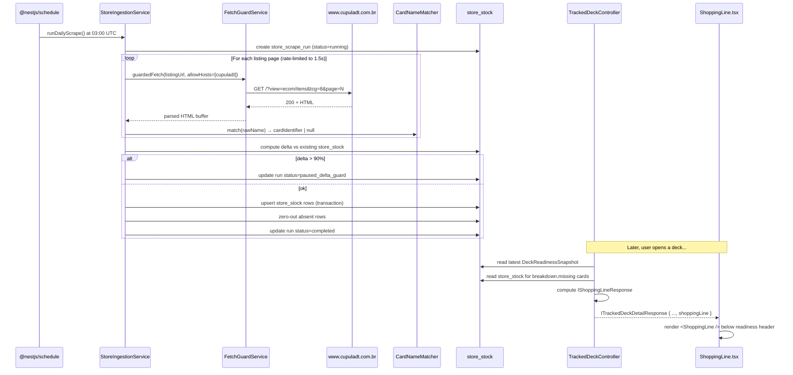
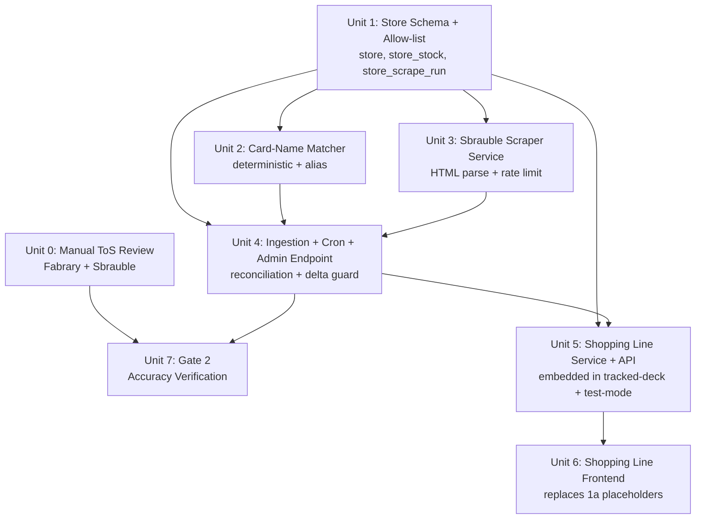

# feat: Phase 1b -- Store Data & Shopping Line

> **Platform naming note (corrected 2026-04-12).** Gate 3 (2026-04-08) identified the e-commerce platform as "Sbrauble". That was partially incorrect: **Liga FaB** (`ligafab.com.br`) is the **operator** of the platform (owns the session cookie `LIGASID`, publishes the merchant contract at `/?view=contrato`). **Sbrauble** is the underlying **technology/CDN layer** (product images serve from `sbrauble.com/arquivos/...`, and the URL pattern `/?view=ecom/*` is the Sbrauble template engine). In this plan, "Sbrauble" refers to the HTML/URL format being parsed; "Liga FaB" refers to the platform operator whose contract we evaluated in U0. Class names like `SbraubleScraperService` describe the HTML format, not the legal entity. See `docs/research/phase-1b-compliance-log.md` Entry 2c for the full compliance analysis and risk-acceptance decision.

## Overview

Phase 1b adds the **local store data vertical** to the Phase 1a product core: a Liga FaB / Sbrauble vertical scraper running against **Cúpula DT only** (R30-R33), a card-name → `cardIdentifier` resolver that bridges the store's Portuguese product catalog to `@flesh-and-blood/cards`, a shopping line service and API that joins a deck's missing/substituted cards against live stock, and the frontend display that replaces the Phase 1a placeholder slots in `TestDeckResult.tsx`, `PathCResult.tsx`, and the tracked deck detail page with the real "With R$ 45 at Cúpula DT you reach 100%" affordance specified in R28.

This is the smallest vertical of Phase 1 that makes the **secondary success metric** surface live ("≥20% of active users click ≥1 product link to a tracked store within any rolling 30-day window"). Phase 1a explicitly cut the shopping line and noted the surface is unshippable until 1b lands (see Phase 1a Risks table). Phase 1b ships the surface itself (the click targets and their data source). **The metric is not measurable yet, even after Phase 1b ships** -- there is no session-event logging and no click telemetry in this plan (see Risks table + deferred A25). Either (a) the click-tracking sub-unit described in Risks is added to Unit 6's scope before launch, or (b) the metric is explicitly reframed as a presence/qualitative metric for the Phase 1 evaluation window. Whichever choice is made, do not describe Phase 1b as "unlocking" a metric the app has no way to compute.

It does **not** include Discover / trending ingestion (R11-R14), the R9 three-mode home state machine's populated-mode "you may also be close to these decks" section, or the R27 historical chart -- those remain in Phase 1c.

## Problem Frame

Phase 1a shipped the engine, interactive swaps, Path C fidelity, autocomplete, and public-ready auth. The result screens all carry a deliberate placeholder in the position the R28 shopping line will occupy:

> "Check availability at Cúpula DT -- coming in Phase 1b"

That placeholder is a commitment to users, not a design choice. Without the shopping line, the app answers "what do I own?" and "what can I substitute?" but not **"where can I buy what I'm missing, and at what price?"** -- which is the third leg of the problem frame stated in the origin doc's Executive Summary:

> "(a) what they already own, (b) what is available at nearby local stores, and (c) the decks they want to build or play ... Fabrary solves deckbuilding, FaBDB solves catalog, local stores sell the cards -- but no one solves 'I want to play Briar Aggro, what am I missing, where can I buy it nearby, and if I can't buy it, what can I play instead?'"

Phase 1a covers (a) and (c). Phase 1b covers (b). Without (b), the primary hypothesis (a single tool that bridges inventory, substitution, and local stock) is only two-thirds tested.

There is also a **timing risk** flagged in Phase 1a: the community's 4-week engagement window closes if 1b does not land soon after 1a. Phase 1b's scope is kept deliberately narrow to hit that window.

(see origin: `docs/brainstorms/2026-04-08-fab-deck-readiness-flow-requirements.md`, Executive Summary + Release Phasing > Phase 1 + R19, R28-R33, S8, S10, S11)

## Requirements Trace

### Feature Requirements (from origin doc)

- **R19** (result screens display the shopping line below readiness): Unit 6
- **R28** (shopping line format -- store name, unit price, available quantity, freshness; default sort lowest total cost; "With R$ 45 at Cúpula DT you reach 100%" affordance): Unit 5, Unit 6
- **R30** (Sbrauble vertical scraper, Phase 1 = Cúpula DT-only allow-list, per-store rate configuration): Unit 1, Unit 3, Unit 4
- **R31** (Cúpula DT anchor store; written/friend consent artifact; allow-list keyed by store ID enforced in code, not policy): Unit 1, Unit 4
- **R32** (stock data stored with `lastFetchedAt` + source store; UI shows freshness in natural language): Unit 1, Unit 5, Unit 6
- **R33** (daily scraping cadence; stock reconciliation between runs; reconciliation policy decided in planning): Unit 4

### Security Requirements (from origin doc's S1-S12)

- **S5** (outbound fetch allow-list expanded to include `www.cupuladt.com.br`; code-enforced): Unit 1 + existing `FetchGuardService`
- **S8** (scraping consent enforcement -- code-level, not policy-level; server-side allow-list keyed by store ID; refuse to fetch from any unlisted store): Unit 1, Unit 4
- **S10** (outbound link safety -- store product links validated against allow-list at write time; safe anchor attributes at render time): Unit 5, Unit 6
- **S11** (scraped data integrity -- text interpolation only at render time; alert + pause scraper when a single run's delta exceeds 90% of the catalog): Unit 4, Unit 6

### Gate Follow-ups (from Gate 2 and Gate 3)

- **Gate 2 accuracy verification** (protocol: run scraper against Cúpula DT, produce first snapshot, walk through ≥10 cards with the store owner, capture any systematic discrepancies as bugs): Unit 7
- **Gate 3 manual follow-ups** (read Fabrary ToS; read Sbrauble platform ToS; quote relevant clauses): Unit 0

## Scope Boundaries

- **Only Cúpula DT.** The scraper runs against `www.cupuladt.com.br` exclusively. The store-ID allow-list has **one** entry (`cupula-dt`). No other Pelotas Sbrauble stores are added. Phase 2 expands the allow-list to 2-4 stores -- this is explicitly deferred in the origin doc's R30 and Phasing Map.
- **No R29 alternative-suggestions-when-unavailable in the shopping line.** R29 says: "For missing cards with no stock at any tracked store, the shopping line shows 'unavailable locally' and automatically suggests tier 2-3 substitutions as clickable alternatives." The **tier 2-3 substitution surfacing inside the shopping-line context (R29) is Phase 2**. Phase 1b ships the full R19 shopping line for Cúpula DT stock -- prices, quantities, freshness, and outbound product links per R28 -- but for cards that have **no** stock at Cúpula DT, the row is simply labeled "unavailable at Cúpula DT" with no clickable alternative-substitution cross-link into the engine. R19 (display the shopping line) is in scope; R29 (alternative substitutions for unavailable cards) is explicitly out.
- **No Discover ingestion (R11-R14).** Phase 1c. Discover, trending, and preview readiness are independent of store data and are not blocked by Phase 1b. The R9 populated-mode "you may also be close to these decks" section also stays empty in Phase 1b.
- **No R9 three-mode home (fallback mode).** Phase 1a collapsed fallback into empty because fallback needs Discover data. Phase 1b does not revisit that collapse -- the three-mode machine still lands in Phase 1c.
- **No R27 historical readiness chart.** Deferred to Phase 2.
- **No R24 archetype-aware engine weighting.** Phase 2.
- **No R25 substitution feedback storage / learning loop.** Phase 2.
- **No admin dashboard for scrape monitoring.** Phase 1b surfaces scrape health via (a) structured logs (`nestjs-pino`), (b) `store_scrape_run` table rows for historical diagnostics, and (c) a CLI entry point for manual runs. A web-based dashboard is Phase 2 or later.
- **No per-user favorite store.** Cúpula DT is the single store. Phase 2 introduces multi-store selection.
- **No price history.** `store_stock` stores the latest price snapshot per card. Phase 2 may add a `store_stock_history` table to track price-over-time, but Phase 1b only needs the current state.
- **No currency conversion.** All prices are BRL cents. No FX logic.
- **No checkout, no carts, no payments.** The origin doc's Explicit Non-Goals state this clearly. Phase 1b displays stock and links to the store's own product page -- nothing more.
- **No differential-update mode for the scraper.** Gate 2 granted a crawl-rate exception for Cúpula DT (1-2s per request, overriding the platform's 360s default), so a full daily refresh is feasible in ~10-15 minutes. Differential mode is a Phase 2 concern for non-partner stores that do not have a rate exception.
- **No scraping of any non-ecom Sbrauble paths.** The `robots.txt` Disallow list (`/?view=user`, `/?view=dks/...`, `/?view=ref2/`, `/?view=bzr/`, `/?view=colecao/`, `/?view=torneios/`, `/?view=forum/...`, `/?view=mp/showcase/...`) is respected. Only `/?view=ecom/*` is fetched. A code-level path allow-list prevents accidental fetches of the Disallow paths even if the scraper is misconfigured.

## Context & Research

### Relevant Code and Patterns

- **`FetchGuardService`** (`apps/api/src/common/fetch-guard/fetch-guard.service.ts`): the mandatory outbound-HTTP chokepoint introduced in Phase 0 for S5. Supports per-call `allowHosts`, `maxBytes`, `timeoutMs`, manual redirect handling (redirects are re-validated against the allow-list), method/body/headers. Phase 1a Unit 6 used it for `TestDeckService`. Phase 1b's scraper **MUST** route through it -- direct `fetch()` calls are forbidden.
- **`FabraryService`** (`apps/api/src/fabrary/fabrary.service.ts`): an existing example of a service that composes `FetchGuardService` with per-host options. The scraper follows the same compositional shape: a dedicated service that delegates outbound HTTP to the guard and focuses on parsing + business logic.
- **Substitution / readiness snapshots** (`apps/api/src/substitution/substitution.service.ts`): `computeAndStoreReadiness` persists a `DeckReadinessSnapshotEntity` with `breakdown` JSONB. The shopping line reads `breakdown.missing` and `breakdown.substituted` for the "cards you still need" set. The derived `path` and `fidelityPercent` fields are computed at read time via `deriveSnapshotFields` -- Phase 1b follows the same read-time derivation pattern for the shopping line (no schema change to `deck_readiness_snapshot`).
- **Tracked deck detail response DTO** (`apps/api/src/decks/dtos/tracked-deck-detail.response.dto.ts`): the DTO that the tracked-deck-detail page consumes. Adding an optional `shoppingLine` field on `ITrackedDeckDetailResponse` is the API-shape change. `TestDeckResult` and `PathCResult` read the same DTO shape -- one addition covers all three surfaces.
- **Catalog module** (`apps/api/src/catalog/`, `packages/engine/src/catalog/`): loads `@flesh-and-blood/cards` once at module init. `catalog.byIdentifier` is a cardIdentifier → card index. Phase 1b's card-name matcher reads this index to validate scraped product names.
- **Purge script pattern** (`scripts/purge-deleted-users.ts`): a standalone script under `scripts/` that uses the raw `pg` driver (documented reason: TypeORM + tsx + decorators has an esbuild-emit incompatibility). Phase 1b uses a **different** pattern for the scraper (in-process `@nestjs/schedule`, see Key Technical Decisions) because the scraper needs `FetchGuardService`, the catalog index, the card matcher, and TypeORM repositories -- the standalone-raw-pg pattern would duplicate all of them. The scraper still exposes a CLI entry point for manual invocation, but via an authenticated admin endpoint, not a tsx script.
- **Config / env validation** (`apps/api/src/config/env.dto.ts`): uses `class-validator` with explicit defaults per env var. New env vars `STORE_SCRAPER_ENABLED` and `STORE_ALLOW_HOSTS` are added here with safe defaults.
- **Phase 1a placeholder slots to replace:**
  - `apps/web/src/components/TestDeckResult.tsx` (from Phase 1a Unit 6)
  - `apps/web/src/components/PathCResult.tsx` (from Phase 1a Unit 8)
  - `apps/web/src/routes/_auth/decks.$deckId.tsx` (tracked deck detail -- Phase 1a Unit 8 added a Path C banner here; Phase 1b inserts the shopping line below the readiness header on every path, not only Path C)

### Institutional Learnings

- **Gate 3 -- Sbrauble scrape feasibility** (`docs/brainstorms/gates/gate-3-dependency-spike.md`): confirmed that `www.cupuladt.com.br` returns server-rendered HTML for `/?view=ecom/*` paths. Cloudflare is in front but not challenging. Products are in the initial response (not JS-hydrated). Example URL shape for detail pages: `/?view=ecom/item&tcg=8&edicao=[ID]&cardID=[CODE]&card=[NUM]`. Stock displayed inline as "N unid.". Prices displayed as "R$ N,NN". The listing page uses `tcg=8` for Flesh and Blood.
- **Gate 3 -- robots.txt finding** (same file): the Sbrauble platform `robots.txt` declares `Crawl-delay: 360` universally for `User-agent: *`, but `/?view=ecom/*` is **not** in the Disallow list. Commerce scraping is permitted per path, only constrained by the crawl delay. The Disallow list targets user/deck/collection/forum/marketplace paths -- all must remain unvisited by the scraper.
- **Gate 2 -- Cúpula DT consent + crawl-rate exception** (`docs/brainstorms/gates/gate-2-cupula-dt-consent-and-accuracy.md`): explicit consent captured from the store owner (personal friend of the project owner) and a **crawl-rate exception granted** (1-2 seconds per request, overriding the platform default of 360s) specifically for `www.cupuladt.com.br`. **The owner explicitly agreed to a rate lower than what `robots.txt` declares**, so the per-store configuration in Phase 1b encodes this exception as a stored value on the `store` row, not a code constant. Daily full refresh is feasible in ~10-15 minutes at 1-2s per request. Accuracy verification (walk through 10 cards with the owner) is listed as a Phase 0 follow-up that depends on the scraper prototype existing -- Phase 1b is the first opportunity to execute it.
- **Phase 1a placeholder commitment** (`docs/plans/2026-04-10-001-feat-phase-1a-product-core-plan.md`): the scope decision to ship result screens **without** the shopping line explicitly promised the placeholder "Check availability at Cúpula DT -- coming in Phase 1b". Phase 1b must remove those placeholders.
- **Phase 1a timing risk** (same plan, Risks table): "If 1b lands more than 4 weeks after 1a, the community's 4-week engagement window closes before the [secondary] metric is measurable." Phase 1b's scope is sized against this window.

### External References

- Liga FaB platform contract: `https://www.ligafab.com.br/?view=contrato` -- **read during U0 (2026-04-12), risk-accepted.** Section 17 is a prohibitive IP-reproduction clause; see `docs/research/phase-1b-compliance-log.md` Entry 2c for full analysis. (`sbrauble.com` was Gate 3's original reference but resolves to 404 / NXDOMAIN -- Sbrauble is the CDN/tech layer, Liga FaB is the operator.)
- Cúpula DT storefront: `https://www.cupuladt.com.br/?view=ecom/itens&tcg=8` -- the FaB listing entrypoint (confirmed in Gate 3c).
- `@flesh-and-blood/cards` schema: every card has `cardIdentifier`, `name`, `pitch`, `classes`, `types`, `rarities`, `printings`. The matcher uses `name` + `pitch` as the primary join key (see Unit 2).
- `cheerio` (server-side HTML parser): the pragmatic choice for parsing the Sbrauble HTML. Already a common npm package; no browser runtime required. Alternative: `node-html-parser` (simpler but less CSS-selector-complete). Decision deferred to Unit 3 implementation.

## Key Technical Decisions

- **The scraper runs as a separate Railway worker service, not in-process on the API pod.** Rationale: Phase 1a's API pod is pure request/response. Coupling a daily 10-15 minute I/O burst (HTML fetching + parsing at 1.5s/request) to the event loop that serves user requests risks latency spikes during the scrape window, and a pod restart mid-scrape loses in-memory state. Instead, Phase 1b creates a dedicated worker entry point at `scripts/scrape-stores.ts` that bootstraps a NestJS standalone application context (`NestFactory.createApplicationContext(AppModule)`) — no HTTP listener, just the DI graph — resolves `StoreIngestionService`, iterates active stores, calls `runScrape()`, and exits. Railway schedules this as a **cron job** (same second-service pattern as `scripts/purge-deleted-users.ts`, but using the NestJS DI graph instead of raw pg, because the scraper needs `FetchGuardService`, the catalog index, the card matcher, and TypeORM repositories). The cron schedule is `0 3 * * *` (daily 03:00 UTC). The API pod keeps the admin endpoint (D2) for on-demand manual triggers — both entry points call the same `StoreIngestionService.runScrape()`. The `store_scrape_run` soft lock (30-minute staleness) prevents concurrent runs across the two entry points. `@nestjs/schedule` is **not** installed — the scheduling is external (Railway cron), not in-process. This cleanly separates the request-serving pod from the background-work pod and eliminates the `setTimeout`-drift, pod-restart-state-loss, and event-loop-contention concerns flagged in the review.

- **A CLI entry point for manual scrapes exists as an authenticated admin endpoint.** `POST /api/admin/stores/:slug/scrape` triggers an immediate scrape run (bypassing the cron schedule), guarded by a shared-secret header (`x-admin-api-key`) validated against a new env var `ADMIN_API_KEY`. This endpoint is the on-demand lever the dev needs for Gate 2 accuracy verification (Unit 7) and for debugging parser regressions. It is **not** a general admin dashboard -- it is one endpoint with one purpose. No admin role, no UI, no list endpoint. Rate-limited at 2/hour per IP to prevent accidental repeat invocation.

- **Cúpula DT scrape rate: 1500ms per request, stored as a per-store config, encoding Gate 2's friend exception.** The rate value lives on `store.rateLimitMs` (not a code constant) so the exception is data, not code. Phase 1b seeds `cupula-dt` with `rateLimitMs = 1500` -- well inside Gate 2's 1-2s window. Any future store added to the `store` table defaults to `rateLimitMs = 360_000` (the platform default) unless the operator references a specific exception artifact. The rate limiter is a simple in-process `await sleep(rateLimitMs - elapsedSinceLastFetch)` -- no token bucket needed for a single-threaded scraper. **This explicitly overrides the Sbrauble `robots.txt` Crawl-delay of 360 seconds, because the store owner (a personal friend of the project owner) granted a direct permission to do so, documented in Gate 2.** Any code review that questions "why are we ignoring `robots.txt`?" should be pointed at the Gate 2 artifact and this decision.

- **Store + stock + scrape-run schema.** Three new tables:
  - `store` -- one row per allow-listed store (`id`, `slug`, `name`, `baseUrl`, `listingPath`, `rateLimitMs`, `active`, `consentArtifact`, `lastScrapedAt`, `createdAt`).
  - `store_stock` -- one row per `(storeId, cardIdentifier)` with `priceCents` (int), `quantity` (int), `productUrl` (string), `productNameRaw` (string -- the raw store name for debugging / unmatched resolution), `lastFetchedAt` (timestamptz). Unique index on `(storeId, cardIdentifier)`.
  - `store_scrape_run` -- one row per scrape attempt (`id`, `storeId`, `startedAt`, `finishedAt`, `productsFetched`, `productsMatched`, `productsUnmatched`, `rowsUpserted`, `rowsZeroed`, `deltaPercent`, `status` enum `running | completed | failed | paused_delta_guard`, `errorMessage`, `forcedOverride` boolean). Acts as audit trail + soft lock + delta-guard history. **The `forcedOverride` column is set to `true` when a scrape run bypassed a prior `paused_delta_guard` state via `--force`, so post-incident audit can distinguish normal completed runs from forced ones.** Note: `rowsZeroed` is the correct name (the reconciliation policy sets absent rows to `quantity = 0` rather than deleting them) -- the earlier draft called this field `rowsRemoved` which was misleading.

  All three tables are new. No modifications to existing tables. The ingestion writes to `store_stock` via upsert; reconciliation removes rows for products that disappeared (see next decision).

- **Reconciliation policy for R33 -- absent-after-scrape rows are set to `quantity = 0`, not deleted.** When a product that was present in the previous run is absent in the current run, the row's `quantity` is set to 0 and `lastFetchedAt` is updated. The row is **not** deleted. Rationale:
  - Preserves `productUrl` so a returning product can be re-upserted quickly.
  - Preserves `productNameRaw` for debugging the matcher.
  - The shopping line query filters `quantity > 0` at read time, so zero-quantity rows are invisible to users.
  - Avoids row churn on every scrape run.
  Rows older than 30 days with `quantity = 0` are eligible for cleanup in a follow-up purge (Phase 2). Phase 1b does not implement the cleanup -- the table stays small at Cúpula DT scale (~500-1000 FaB products).

- **Card-name matching is a two-stage resolver: deterministic parse + manual alias table.**
  - **Stage 1 (deterministic):** parse the raw product name. Strip known suffixes (`"(Cold Foil)"`, `"(Rainbow Foil)"`, `"(Foil)"`, `"(Extended Art)"`, `"(Alternate Art)"` -- the set is enumerated in `constants.ts` and grows only from observed unmatched logs). Extract the pitch color if present (`"(Red)"`, `"(Yellow)"`, `"(Blue)"`). Build a candidate `cardIdentifier` using a canonical kebab transform: lowercase, strip punctuation, replace spaces with hyphens, append `-red` / `-yellow` / `-blue` for pitched cards. Look up in `catalog.byIdentifier`. If it exists, it's a match. The kebab rules are encoded in a pure function; golden-fixture tests lock the transform.
  - **Stage 2 (manual alias):** a new `card_alias` table maps `(source: 'cupula-dt', rawName: string) → cardIdentifier`. Populated lazily as operators resolve unmatched rows. The scraper consults the alias table before running the deterministic parse (alias overrides win, so a bad deterministic match can be corrected without code changes). Phase 1b ships the alias table empty; rows are added by the dev via direct SQL or via a later admin tool. **Alias validation:** before returning an alias hit, the matcher verifies the target `cardIdentifier` still exists in the catalog (`catalogService.getCard(row.cardIdentifier)` must not throw `CardNotFoundError`). A stale alias (target removed from a future catalog version) returns `null` with a `warn`-level log tagged `alias-target-missing`, so operators can distinguish alias decay from genuine new unmatched products.
  - **Unmatched logging:** every unmatched product is logged at `warn` level with `{ storeSlug, productUrl, rawName }` and counted in `store_scrape_run.productsUnmatched`. The dev reviews these after Gate 2 accuracy verification and populates the alias table.

- **Delta-guard threshold: 90% catalog delta pauses the scraper (S11).** If a single run would change `>90%` of the current `store_stock` rows for that store (either by upserting new rows, removing rows, or setting existing rows to `quantity = 0`), the run aborts before persisting any changes and writes `store_scrape_run.status = 'paused_delta_guard'` with `deltaPercent` recorded. A paused store's `active` flag is **not** auto-flipped to `false` (that would require a second human decision). Instead, subsequent scheduled runs refuse to start against a store whose **most recent** `store_scrape_run` is `paused_delta_guard`, surfacing an explicit `operator_override_required` status until the dev investigates. The override is a `force=true` query param on the admin endpoint; every forced run sets `store_scrape_run.forcedOverride = true` and logs a `warn`-level event with `{ actorIp, priorPausedRunId, overriddenDeltaPercent }` for audit. **First-run exemption is keyed on run history, not table state:** the guard is bypassed only if `store_scrape_run` has zero `status='completed'` rows for this store. A manual `DELETE FROM store_stock WHERE storeId = X` does NOT re-arm the exemption -- the completed-run history persists, so the next scrape is still subject to the guard. Exempting on run-history (not table-state) prevents an accidental or malicious DB wipe from silently disabling the guard. Delta is computed as `(upserts + zero_outs) / max(existingRows, 1)`. **The 90% threshold is a starting default, not a validated baseline;** before Phase 1b launches to production, the operator runs 3-7 manual scrapes via the admin endpoint during Unit 7 week and records the observed day-over-day delta baseline. If the observed p95 exceeds 20%, the threshold is re-tuned to 2 × observed-p95 before the cron is enabled. A Phase 2 follow-up (A25 below) decomposes the delta into `priceChangedPct` / `quantityChangedPct` / `addedPct` / `removedPct` so a legitimate store-wide price refresh does not trip the same threshold as a parser regression.

- **Shopping line lives on the tracked-deck-detail response and the test-mode response -- not on a separate endpoint.** Rationale: the data is read-only, scoped to a single snapshot, and the frontend always wants it together with the breakdown. A separate `GET /api/decks/:id/shopping-line` would add a second round-trip without benefit. The `ITrackedDeckDetailResponse` gains an optional `shoppingLine?: IShoppingLineResponse` field, computed at read time by a new `ShoppingLineService`. Same pattern for `TestDeckResult`'s test-mode response. The computation cost is `O(missing_cards × 1 indexed lookup)` -- negligible at FaB deck sizes.

- **`IShoppingLineResponse` shape (derived at read time, no persistence):**
  - `storeName` (display name)
  - `totalCostCents` (sum of `priceCents * quantity_needed` over available missing cards, capped at `store_stock.quantity`)
  - `availableCardCount` (how many of the missing cards are in stock)
  - `unavailableCardCount` (how many missing cards have zero or no stock at Cúpula DT)
  - `lines: Array<{ cardIdentifier, cardName, quantityNeeded, quantityAvailable, unitPriceCents, productUrl, lastFetchedAt }>`
  - `lastFetchedAt` (oldest `lastFetchedAt` across all lines, for the freshness badge at the section level)
  - Default sort on `lines`: (a) available first, (b) lowest `unitPriceCents` within availability class.

- **Shopping line has two sections: "missing" (primary) and "upgrade" (secondary, Path B only).**
  - **Primary section** (all paths): uses `breakdown.missing` (cards neither owned nor substituted). Path A decks = empty shopping line ("You have everything you need"). Path C decks = the full missing-card shopping list with pricing and availability.
  - **Secondary "Upgrade" section** (Path B only): shows `raw.missing − effective.missing` — the cards the user substituted from their own inventory but might want to buy as originals. Gate 4 showed 26% tier-1 rejection rate, so a meaningful fraction of users will want this affordance. The section renders below the primary with a distinct header: "Upgrade this deck with originals" and muted styling to signal it's optional, not urgent. Each row shows the same per-card format (name, pitch, price, availability, store link). If the user has not rejected any substitutions yet, the "upgrade" section IS the entire `raw.missing` set (the user hasn't engaged with the swap editor yet, so all substituted cards are upgrade candidates).
  - **Path A** = both sections empty → "You have everything you need."
  - **Path B** = primary empty + secondary populated → "You have everything you need. Want to upgrade? Buy the originals:" + the upgrade list.
  - **Path C** = primary populated + secondary may also be populated (substituted cards that are also buyable) → primary section dominates; secondary renders below if non-empty.

- **Outbound product links (S10) are validated twice and rendered with safe anchor attributes.** At **write time** (scraper → `store_stock`): the parsed `productUrl` is validated via `new URL(productUrl)` (NOT `startsWith`) and `parsed.hostname` must exactly equal the store's `baseUrl`-derived hostname (strict equality, so `www.cupuladt.com.br.evil.com` fails). The parsed `parsed.pathname + parsed.search` must match one of the allow-listed path prefixes (`/?view=ecom/item`, `/?view=ecom/itens`). **Scheme must be `https:`** -- `http:`, `javascript:`, `data:`, and everything else are rejected at write time. Rows that fail any of these checks are dropped with a warning log and counted on the scrape run. At **render time** (frontend): every outbound anchor goes through a `<StoreProductLink />` wrapper component that (a) re-parses the URL via `new URL()` and asserts `parsed.hostname === 'www.cupuladt.com.br'` AND `parsed.protocol === 'https:'` (scheme allow-list), (b) emits `rel="noopener noreferrer" target="_blank" referrerPolicy="no-referrer"` on the `<a>` tag (the referrer-policy attribute prevents leaking the user's deck URL path to Cúpula DT's web analytics even if a future browser quirk bypasses `noreferrer`), (c) falls back to plain text rendering if either assertion fails. **Drift mitigation:** the backend's `ShoppingLineService` response includes the exact allow-listed hostname for each line, so the frontend checks against data it was told rather than a hardcoded constant -- Phase 2 can add stores without touching `StoreProductLink`. This is belt-and-suspenders against a compromised DB row.

- **Scraped fields are rendered via React text interpolation only (S11).** React escapes text interpolation by default, so `{line.cardName}` is safe. The risk is a future developer reaching for React's raw-HTML injection escape hatch (the prop name contains the word "dangerously" as a warning) on a scraped field. Unit 6 ships a grep-based regression test that asserts no such prop appears anywhere in `ShoppingLine*.tsx` or `StoreProductLink.tsx`. Additionally, the raw product name is **not** rendered in the shopping line (it is debug-only, surfaced only in operator logs and the `store_stock.productNameRaw` column).

- **The `FetchGuardService` allow-list gains `www.cupuladt.com.br`.** A new env var `STORE_ALLOW_HOSTS` (comma-separated, default `www.cupuladt.com.br`) is added to `env.dto.ts`. The scraper passes this list to `FetchGuardService.guardedFetch(url, { allowHosts: storeAllowHosts, ... })`. The Fabrary allow-list (`FABRARY_ALLOW_HOSTS`) stays separate -- mixing the two risks accidental cross-contamination if the scraper is later asked to fetch Fabrary URLs or vice versa. Two allow-lists, two env vars, two concerns.

- **Phase 1b does not introduce a store-data ingestion web dashboard.** Scrape health is observable via `nestjs-pino` structured logs (searchable in Railway logs) and direct SQL against `store_scrape_run`. The admin endpoint returns the latest run's summary on the POST response so the dev sees immediate feedback. A Phase 2 admin dashboard is a separate feature.

- **No store data is shown to unauthenticated users.** All shopping-line-bearing endpoints stay behind the global `JwtAuthGuard`. The rationale: (a) the shopping line is always rendered alongside a deck, and deck endpoints are authenticated; (b) exposing stock data anonymously creates a cheap scraping vector for third parties to rebuild the data we just scraped. Read symmetry with the user's authentication posture is the simpler rule. **Cache-Control posture:** every response carrying a `shoppingLine` field is emitted with `Cache-Control: private, no-store` so neither Cloudflare (fronting Railway) nor a browser service worker can cache one user's deck breakdown and serve it to another. An integration test asserts the header is present on `GET /api/decks/:id` and `POST /api/decks/test`.

- **Env var `STORE_SCRAPER_ENABLED` gates the cron handler.** Default `false`. Must be explicitly set to `true` in Railway production. Local dev and CI default to `false` so tests don't accidentally hit Cúpula DT. Unit/integration tests stub the HTTP fetch via `FetchGuardService` mocks and load fixture HTML files from `apps/api/src/stores/__fixtures__/`.

## Open Questions

### Resolved During Planning

- **Scheduling pattern: `@nestjs/schedule` vs standalone tsx script vs Railway-triggered endpoint?** Resolved to `@nestjs/schedule` in-process cron + an admin endpoint for manual runs. The scraper's dependency footprint (FetchGuardService, catalog, TypeORM repos) makes the standalone pattern high-friction; the in-process cron is the lowest-duplication option that still respects Phase 1b's single-instance-per-Railway-pod reality. Leader election is deferred to Phase 2.
- **Scraper rate limit: 1-2s or a token bucket?** Resolved to a simple per-request `await sleep(rateLimitMs)` with the value (1500ms) stored in `store.rateLimitMs`. Token bucket is overkill for a single-threaded, serial scraper. The value sits inside the 1-2s friend-permission window captured in Gate 2.
- **Card matching: exact match only vs fuzzy (Levenshtein / trigram) vs two-stage?** Resolved to two-stage: deterministic kebab-transform first, manual alias table second, unmatched logging. Fuzzy matching risks silent miscategorization of collectible cards (a name-adjacent false positive would show the wrong price for a card the user doesn't actually have), which is worse than an unmatched row the operator fixes explicitly. Levenshtein can be added as a suggestion-only stage 3 in Phase 2 once the alias table is populated enough to be a reference point.
- **Where does the shopping line attach: new endpoint vs embedded in existing responses?** Resolved to embedded. The data is always wanted together with the breakdown; a second round trip adds latency without affordance.
- **Does the shopping line include substituted cards (raw-missing even when effective-missing = 0)?** Resolved to NO. Phase 1b only surfaces `effective.missing`. Substituted cards are covered by the user's inventory after the engine solves the deck; surfacing them again would contradict Phase 1a's interactive-swap-editor semantics (rejecting a substitute is how the user re-surfaces a card as missing).
- **Reconciliation for products absent from a new scrape: delete or zero out?** Resolved to zero out. Delete-on-disappear loses debugging context; zero-out plus a read-time `quantity > 0` filter keeps the row available for rapid re-upsert and investigation.
- **Delta-guard threshold: what percent and what happens on trip?** Resolved to 90% (matches S11 text). On trip, the run is aborted before persisting anything, `store_scrape_run` records the event, and subsequent scheduled runs refuse to start until an operator intervenes (via `--force` on the admin endpoint or a manual run-record reset). First-run exemption is defined.
- **Freshness UI copy: "updated 2h ago" or exact timestamp?** Resolved to natural-language relative (`"updated 2h ago"`, `"updated 3 days ago"`) matching R32's explicit requirement. A tooltip on hover reveals the exact timestamp for power users. An empty-state message `"no recent data"` applies when `lastFetchedAt` is null or >7 days old.
- **Scraping library: `cheerio` or `node-html-parser`?** Deferred to Unit 3 implementation -- both are feasible, decision based on the actual HTML selectors needed during parser development.
- **Product URL pattern: does Cúpula DT use stable identifiers?** Gate 3c observed the `/?view=ecom/item&tcg=8&edicao=[ID]&cardID=[CODE]&card=[NUM]` shape. Phase 1b treats the fully-qualified URL as opaque and does not try to reverse-engineer the parameters -- the matching key is the parsed name, not the URL parameters.
- **Authentication on shopping-line read endpoints: public or authenticated?** Resolved to authenticated (inherits `JwtAuthGuard` -- no `@Public()` decorator added).
- **Manual ToS read: block U1 or block U7?** Resolved to block U7 (first production fetch). Dev can implement U1-U6 against fixture HTML without touching the network. U7 is the first time the scraper hits production.
- **Cúpula DT scrape cadence: daily, hourly, weekly?** Resolved to daily at 03:00 UTC (off-peak in Brazil). R33 specifies "daily" and the crawl-rate exception makes daily feasible in ~15 minutes.
- **Does `store_stock` need price history for Phase 1b?** Resolved to NO. Current state only. Historical price tracking is a Phase 2 feature.
- **Sbrauble tcg parameter: which TCG code is FaB?** Confirmed `tcg=8` from Gate 3c. The seed row hardcodes `listingPath = '/?view=ecom/itens&tcg=8'`.

### Deferred to Implementation

- **Exact CSS selectors for the listing and product pages.** Gate 3c confirmed the HTML is server-rendered and contains products, prices, and stock, but the exact selector paths (class names, nested structures) must be discovered during Unit 3 implementation by saving a real page to a fixture file and writing the parser against it. Fixture-driven TDD is the intended workflow.
- **Pagination strategy.** Gate 3c did not enumerate the pagination controls. Unit 3 implementation discovers whether pagination is query-string-based (`&page=N`) or cursor-based (`&offset=N`) and codes accordingly. The scraper follows pagination until an empty page or a `page > 100` hard cap (belt-and-suspenders against runaway pagination).
- **Variant handling in `@flesh-and-blood/cards`.** Some cards have multiple `cardIdentifier` variants (foil/non-foil, set reprints). Unit 2 implementation confirms whether the matcher returns the first match, the base printing, or a set-aware match. Phase 1b accepts the first-matching strategy as a default and relies on the alias table for edge cases.
- **Price parsing: handle "Sob consulta" / "Indisponível" values.** If the store renders a "price on request" placeholder, the scraper treats the row as `quantity = 0, priceCents = null` and excludes it from the shopping line. Exact placeholder strings are discovered during fixture capture.
- **Cloudflare bot challenge handling.** Gate 3c observed no challenge, but if one appears during real scrapes, the fallback (headless browser via Playwright) is a Phase 2 concern, not a Phase 1b mitigation. Phase 1b logs the 403 and pauses the store via the delta-guard's operator-override path.
- **Freshness badge exact breakpoints.** Relative time buckets (`"just now"`, `"2h ago"`, `"3 days ago"`, `"stale"`) -- the exact thresholds are picked during Unit 6 implementation with the design in hand.

## High-Level Technical Design

> *This illustrates the intended approach and is directional guidance for review, not implementation specification. The implementing agent should treat it as context, not code to reproduce.*

**Data flow (daily scrape → shopping line display):**



**Unit dependency graph:**



U0 is a **manual** (non-code) precondition on U7. U1 is the foundation. U2 and U3 can be developed in parallel after U1. U4 composes U2+U3 and adds the cron + admin lever. U5 reads `store_stock`. U6 renders U5's data. U7 is the operational validation pass that requires U4 to be shippable and U0 to be complete.

## Implementation Units

- [x] **Unit 0: Manual ToS Review + Compliance Log** *(completed 2026-04-12)*

**Goal:** Before any production scrape, the project owner reads and quotes the relevant clauses of (a) the Fabrary Terms of Service and (b) the Liga FaB platform contract (previously mis-identified as "Sbrauble" in Gate 3). Both are listed as manual follow-ups in Gate 3 and must be completed before Phase 1b ships.

**Requirements:** Gate 3 residual follow-up; S5 posture validation

**Dependencies:** None (human-only task)

**Files:**
- Create: `docs/research/phase-1b-compliance-log.md`

**Approach:**
- The project owner visits `https://fabrary.net` and follows the footer link to the ToS. Relevant clauses about automated access (scraping, GraphQL, rate limits) are quoted verbatim into the compliance log with a retrieval date.
- The project owner visits `https://sbrauble.com` in a real browser (Gate 3 confirmed the page 403s against automated fetches, so this must be manual) and reads the Termos de Uso page. Any clauses about automated access are quoted verbatim.
- If either ToS explicitly forbids the intended access pattern, the plan is escalated: the scraper may need to be abandoned, or Gate 2's friend-permission path must be explicitly re-confirmed against the platform ToS, or a legal conversation is needed. This is a gate, not a checkbox.
- If both ToS permit the access pattern (or are silent on it and the friend's consent is explicit), the compliance log captures the retrieval dates and the quoted text, and U4/U7 are unblocked.

**Execution note:** No code writing. This unit is a manual research + documentation task. The artifact is the compliance log itself.

**Test scenarios:**
- Test expectation: none -- this is a manual documentation unit with no code deliverable.

**Verification:**
- `docs/research/phase-1b-compliance-log.md` exists
- It contains dated entries for both Fabrary and Sbrauble
- Each entry contains either (a) a direct quote of the relevant ToS clause with the retrieval date, or (b) an explicit note that the ToS has no relevant clause and the scraping is permitted by default
- If either ToS is prohibitive, a follow-up decision is recorded in the log and the Phase 1b plan is halted at this unit pending the decision

---

- [ ] **Unit 1: Store Schema + Allow-list + Env Wiring**

**Goal:** Introduce the `store`, `store_stock`, and `store_scrape_run` entities, migrate the database, seed Cúpula DT as the only allow-listed store, and wire the scraper's outbound allow-list into `env.dto.ts` and `FetchGuardService` callers.

**Requirements:** R30 (per-store config), R31 (allow-list keyed by store ID, enforced in code), R32 (lastFetchedAt), S5 (allow-list expansion), S8 (code-level enforcement)

**Dependencies:** None

**Files:**
- Create: `apps/api/src/database/entities/store.entity.ts`
- Create: `apps/api/src/database/entities/store-stock.entity.ts`
- Create: `apps/api/src/database/entities/store-scrape-run.entity.ts`
- Create: `apps/api/src/database/entities/card-alias.entity.ts` (the matcher's alias table -- schema lives in U1, Unit 2 builds the service that consumes it)
- Modify: `apps/api/src/database/entities/index.ts` (export all four new entities)
- Modify: `apps/api/src/database/database.module.ts` (append `StoreEntity`, `StoreStockEntity`, `StoreScrapeRunEntity`, `CardAliasEntity` to the `entities` array of `TypeOrmModule.forRootAsync` -- otherwise TypeORM will not discover them and `forFeature` calls in `StoresModule` will fail at boot)
- Create: `apps/api/src/database/migrations/TIMESTAMP-AddStoreTables.ts` (PascalCase to match existing migration convention, e.g. `1712966400000-AddRejectedSubstitute.ts`)
- Create: `apps/api/src/database/migrations/TIMESTAMP-SeedCupulaDt.ts`
- Create: `apps/api/src/database/migrations/TIMESTAMP-AddCardAlias.ts`
- Create: `apps/api/src/stores/stores.module.ts` (new module that will house the scraper, ingestion, and shopping line services)
- Modify: `apps/api/src/config/env.dto.ts` (add `STORE_SCRAPER_ENABLED: boolean = false`, `STORE_ALLOW_HOSTS: string = 'www.cupuladt.com.br'`, `ADMIN_API_KEY: string` -- required when `STORE_SCRAPER_ENABLED = true`)
- Modify: `apps/api/src/app.module.ts` (register `StoresModule` — no `ScheduleModule` needed; scheduling is external via Railway cron, not in-process)
- Modify: `apps/api/package.json` (add `cheerio@^1` -- or `node-html-parser`, decided in Unit 3; also add a `typeorm` npm script that runs `typeorm migration:run -d dist/database/datasource.js` so Railway deploys and local dev have a single consistent command for applying new migrations)
- Modify: `scripts/delete-user.ts` + `scripts/purge-deleted-users.ts` (no user-linked rows in store tables, so no cascade update -- verify and document)
- Test: `apps/api/src/stores/__tests__/store.entity.spec.ts` (entity shape regression)
- Test: `apps/api/src/config/__tests__/env.dto.spec.ts` (new env vars validated, defaults work)

**Approach:**
- **`store` entity fields:** `id` (serial PK), `slug` (unique varchar, e.g. `'cupula-dt'`), `name` (varchar, `'Cúpula DT'`), `baseUrl` (varchar, `'https://www.cupuladt.com.br'`), `listingPath` (varchar, `'/?view=ecom/itens&tcg=8'`), `rateLimitMs` (int, `1500`), `active` (boolean, default `true`), `lastScrapedAt` (timestamptz, nullable), `lastFetchedAt` (timestamptz, nullable -- used by the per-store rate limiter across runs so a pod restart or a concurrent admin-trigger cannot violate the polite-scrape floor), `createdAt` (timestamptz, default `now()`). The consent artifact reference is recorded as a SQL `COMMENT ON TABLE store IS 'Consent artifacts: see docs/brainstorms/gates/gate-2-cupula-dt-consent-and-accuracy.md'` in the migration -- NOT as a per-row column, because no code path reads it and a column would be pure documentation stored in the wrong place.
- **`store_stock` entity fields:** `id` (serial PK), `storeId` (int FK → `store.id`, ON DELETE CASCADE), `cardIdentifier` (varchar), `priceCents` (int -- BRL cents, nullable for "sob consulta" rows), `quantity` (int, default `0`), `productUrl` (varchar), `productNameRaw` (varchar -- the store's raw name, for debugging the matcher), `lastFetchedAt` (timestamptz). Unique index on `(storeId, cardIdentifier)`. No FK on `cardIdentifier` because the catalog is an npm package, not a DB table.
- **`store_scrape_run` entity fields:** `id` (serial PK), `storeId` (int FK), `startedAt` (timestamptz), `finishedAt` (timestamptz, nullable), `productsFetched` (int, default `0`), `productsMatched` (int, default `0`), `productsUnmatched` (int, default `0`), `rowsUpserted` (int, default `0`), `rowsZeroed` (int, default `0`), `deltaPercent` (numeric 5,2, nullable), `status` (enum `running | completed | failed | paused_delta_guard`), `errorMessage` (text, nullable), `forcedOverride` (boolean, default `false`). Index on `(storeId, startedAt DESC)` for the "most recent run" query.
- **Seed:** the migration inserts one row into `store` (`slug='cupula-dt'`, `name='Cúpula DT'`, etc.). An alternative is a one-time seed script -- decision made during implementation based on repo convention (existing migrations do both data and schema operations, so inlining is acceptable).
- **Env vars:** `STORE_SCRAPER_ENABLED` defaults to `false` for safety. `STORE_ALLOW_HOSTS` is a comma-separated list validated as non-empty when `STORE_SCRAPER_ENABLED=true`. `ADMIN_API_KEY` is required when `STORE_SCRAPER_ENABLED=true` (cross-field validation); optional otherwise. Env validation throws at boot if the combination is invalid (e.g., `STORE_SCRAPER_ENABLED=true` without `ADMIN_API_KEY`).
- **Module structure:** `StoresModule` imports `TypeOrmModule.forFeature([StoreEntity, StoreStockEntity, StoreScrapeRunEntity])`, imports `FetchGuardModule`, imports `CatalogModule` (for the card index used by the matcher in Unit 2), exports nothing yet (Unit 5 adds `ShoppingLineService` to the exports). Registered in `app.module.ts` alongside existing feature modules.

**Patterns to follow:**
- Existing `apps/api/src/database/entities/rejected-substitute.entity.ts` for TypeORM entity shape.
- Existing `apps/api/src/database/migrations/1712966400000-AddRejectedSubstitute.ts` for migration structure.
- Existing `apps/api/src/config/env.dto.ts` for env var pattern (class-validator decorators, explicit defaults).
- Existing `apps/api/src/common/fetch-guard/fetch-guard.module.ts` for module import shape.

**Test scenarios:**
- Happy path: migration runs cleanly on a fresh DB, creating all three tables and the seed row
- Happy path: migration is idempotent-safe (running down then up reproduces the same schema)
- Edge case: `STORE_SCRAPER_ENABLED=true` without `ADMIN_API_KEY` → env validation throws at boot
- Edge case: `STORE_ALLOW_HOSTS=''` when `STORE_SCRAPER_ENABLED=true` → env validation throws
- Edge case: seed row's `slug` collision with an existing row (second-run migration) → UPSERT or idempotent INSERT-IF-NOT-EXISTS; verified in the migration test
- Integration: `StoresModule` loads cleanly in a test `Test.createTestingModule` harness with TypeORM repositories resolved

**Verification:**
- Three new tables exist with the defined columns and constraints
- Cúpula DT seed row is present after the migration runs
- `env.dto.ts` rejects invalid combinations at boot
- `StoresModule` is wired into `AppModule` and loads without errors

---

- [ ] **Unit 2: Card-Name → `cardIdentifier` Matcher**

**Goal:** Build a deterministic + alias-table resolver that maps raw store product names ("A Drop in the Ocean (Blue)", "Aether Crackers (Cold Foil)") to `@flesh-and-blood/cards` `cardIdentifier` values. Unmatched rows log warnings and are surfaced in `store_scrape_run.productsUnmatched`.

**Requirements:** R30 (ingestion matching), R32 (stock keyed on cardIdentifier); prerequisite for Unit 4

**Dependencies:** Unit 1 (for `card_alias` table -- see below)

**Pre-implementation spike (D4, ~1 hour):** Before writing any matcher code, fetch page 1 of Cúpula DT's listing (`/?view=ecom/itens&tcg=8`) into a fixture file, then iterate `@flesh-and-blood/cards` catalog entries to answer three questions: (a) does the catalog expose a `byName` index or is the kebab transform truly necessary? (b) what fraction of Cúpula DT product names are PT-BR vs English? (c) what is the raw match rate of the deterministic kebab transform against the fixture? If `byName` exists and produces ≥90% matches without the kebab transform, simplify. If PT-BR names are >5%, add a PT→EN stage or accept a higher alias-table load. The spike result determines whether the alias table ships in Phase 1b or defers to a hardcoded constants file. Record the spike outcome in a commit message on the Unit 2 branch.

**Files:**
- Create: `apps/api/src/stores/card-name-matcher.service.ts` (the `card_alias` entity + migration are created in Unit 1; Unit 2 builds the service that reads from the table — or from a constants file if the D4 spike determines the alias table is premature)
- Create: `apps/api/src/stores/card-name-matcher.constants.ts` (the set of strippable suffixes, pitch-color labels, kebab transform rules)
- Create: `apps/api/src/stores/__tests__/card-name-matcher.service.spec.ts`
- Create: `apps/api/src/stores/__fixtures__/card-name-matcher-goldens.json` (a table of `{rawName, expectedIdentifier}` pairs covering the observed Gate 3c examples + corner cases)

**Approach:**
- **Public API:** `CardNameMatcher.match(sourceSlug: string, rawName: string): { cardIdentifier: string; source: 'alias' | 'deterministic' } | null`. Returns `null` on no match.
- **Stage 1 -- alias table lookup:** the matcher injects the `CardAliasEntity` repository and performs `findOne({ where: { sourceSlug, rawName } })` before any parsing. If a row exists, return `{ cardIdentifier: row.cardIdentifier, source: 'alias' }`. This is the operator's manual override path.
- **Stage 2 -- deterministic parse:** strip known suffixes (case-insensitive) using an ordered list: `(Cold Foil)`, `(Rainbow Foil)`, `(Foil)`, `(Alternate Art)`, `(Extended Art)`, plus edition codes in parentheses. **Strip leading quantity prefixes** matching `/^\d+\s+/` (e.g. `"5 Copper"` → `"Copper"` -- the leading digits are Cúpula DT's stock-count prefix rendered inside the product name, not part of the card's canonical name). Extract pitch color from the name: if the trimmed name ends with `(Red)`, `(Yellow)`, or `(Blue)`, capture the color and strip it. Apply a canonical kebab transform to the remainder: lowercase, strip punctuation (`'`, `.`, `,`, `:`), replace whitespace runs with single hyphens, trim leading/trailing hyphens. Append `-red` / `-yellow` / `-blue` if a pitch color was captured. The result is a candidate `cardIdentifier`. Call `catalogService.getCard(candidate)` -- on success, return `{ cardIdentifier: candidate, source: 'deterministic' }`; on `CardNotFoundError`, return `null`.
- **Implementation note:** `catalogService.getCard()` is the canonical catalog lookup. The underlying index (`packages/engine/src/catalog/indices.ts`) is a `ReadonlyMap<string, ICatalogCard>` keyed by `cardIdentifier`. Do NOT use bracket-indexing syntax (`catalog.byIdentifier[candidate]`) -- that is object-access and will always return `undefined` on a Map. Use `catalogService.getCard()` wrapped in try/catch against `CardNotFoundError`, or call `catalog.indices.byIdentifier.get(candidate)` directly if you need raw Map semantics. The kebab transform's output shape (e.g. `"a-drop-in-the-ocean-blue"`) is validated by the golden-fixture test suite iterating real `@flesh-and-blood/cards` data. If the catalog's key shape changes in a future upgrade, the golden fixtures fail loudly.
- **Unmatched logging:** when a null match occurs, `CardNameMatcher` emits a `warn`-level log with `{ sourceSlug, rawName: sanitizedRawName }` but does **not** throw. Before logging, `rawName` is truncated to ≤200 characters and stripped of control characters (`\x00-\x1F\x7F`) to defeat log-injection via a compromised store page. The field is emitted via `nestjs-pino`'s structured logging (not a format string), so JSON-escaping already protects against most injection vectors -- the sanitization is belt-and-suspenders. The ingestion layer increments its unmatched counter and persists it in `store_scrape_run.productsUnmatched`. A separate counter `productsAliasBroken` tracks Stage-1 alias hits whose target `cardIdentifier` is no longer in the catalog (alias decay signal), so operators can distinguish "new product to triage" from "existing alias went stale".
- **Goldens fixture:** seeded with at least the three Gate 3c examples (`"5 Copper"`, `"A Drop in the Ocean (Blue)"`, `"Aether Crackers (Cold Foil)"`) plus known-tricky cases: cards with apostrophes (`"Bravo's Edge"` → `"bravos-edge"`), cards with dashes in the real name, and intentional non-matches that should return `null` (e.g., `"Some Random Product Not a Card"`). The fixture grows over time as Unit 7 (accuracy verification) surfaces real-world rows.

**Patterns to follow:**
- Existing TypeORM entity pattern (`rejected-substitute.entity.ts`).
- Existing `catalog.byIdentifier` lookup pattern in `apps/api/src/catalog/`.
- Pure-function-with-small-service wrapper shape (matcher logic is pure; the service wraps it with DI for the alias repo).

**Test scenarios:**
- Happy path: deterministic -- `"A Drop in the Ocean (Blue)"` → `"a-drop-in-the-ocean-blue"` with `source: 'deterministic'`
- Happy path: deterministic -- `"5 Copper"` → matches the corresponding resource cardIdentifier (exact shape verified during implementation)
- Happy path: deterministic -- `"Aether Crackers (Cold Foil)"` → foil suffix stripped, base `aether-crackers` matches
- Happy path: alias -- a row exists in `card_alias` for `(cupula-dt, 'Foo Bar Weird Name')` → returns the alias's `cardIdentifier` with `source: 'alias'`
- Happy path: alias takes priority over deterministic -- if both paths exist, the alias wins (test includes an alias that points to a different card than the deterministic parse would produce)
- Edge case: names with apostrophes -- `"Bravo's Edge"` → `"bravos-edge"` (punctuation stripped)
- Edge case: names with multiple parentheses -- `"Foo (Rainbow Foil) (Red)"` → strip foil, extract pitch, match base
- Edge case: pitch-less cards (equipment, heroes) -- no color in the name, matcher tries the base kebab and succeeds or returns null
- Edge case: empty/whitespace raw name → returns null, emits warning
- Error path: `cardIdentifier` candidate produced but not found in the catalog → returns null, emits warning
- Integration: matcher is callable from a NestJS test harness with a stubbed `CardAliasEntity` repository
- Regression: all entries in `card-name-matcher-goldens.json` pass

**Verification:**
- All golden-fixture rows match
- Unmatched rows emit warn logs with enough context to fix them
- Alias overrides work end-to-end (alias SQL insert + re-run returns the new mapping)

---

- [ ] **Unit 3: Sbrauble Scraper Service**

**Goal:** Fetch Cúpula DT's listing and product pages via `FetchGuardService`, parse the HTML with a server-side parser (`cheerio` or `node-html-parser` -- decided in this unit), return a typed array of `IScrapedProduct` records, enforce the per-store rate limit between requests, and surface structured errors for network/parse failures. **No database writes in this unit -- the ingestion layer (Unit 4) handles persistence.**

**Requirements:** R30 (Sbrauble vertical scraper; per-store rate configuration); S5 (FetchGuardService chokepoint)

**Dependencies:** Unit 1 (for env config and module registration)

**Files:**
- Create: `apps/api/src/stores/sbrauble-scraper.service.ts`
- Create: `apps/api/src/stores/types/scraped-product.ts` (`IScrapedProduct`: `{ rawName, priceCents, quantity, productUrl }`)
- Create: `apps/api/src/stores/errors/scraper.errors.ts` (custom error codes: `PARSE_FAILED`, `LISTING_EMPTY`, `PRICE_UNPARSEABLE`, `PAGINATION_RUNAWAY`, `URL_OUT_OF_ALLOW_LIST`)
- Create: `apps/api/src/stores/__fixtures__/cupula-dt-listing-page.html` (real fixture saved from `https://www.cupuladt.com.br/?view=ecom/itens&tcg=8` during development)
- Create: `apps/api/src/stores/__fixtures__/cupula-dt-empty-page.html` (empty / end-of-pagination page)
- Create: `apps/api/src/stores/__tests__/sbrauble-scraper.service.spec.ts`

**Approach:**
- **Parser choice:** attempted in this unit -- first pass uses `cheerio` (mature, CSS-selector-complete) unless it adds >100KB to the bundle, in which case `node-html-parser` is the fallback. Decision is logged in the PR description; if `cheerio` is rejected, Unit 1's `package.json` change is updated.
- **Public API:** `SbraubleScraperService.scrapeStore(store: StoreEntity): AsyncGenerator<IScrapedProduct>`. An async generator lets the ingestion layer stream products into the upsert loop without buffering an entire catalog in memory. The generator yields products as pages are parsed and respects the per-store rate limit between page fetches.
- **Rate limiting:** the service consults `store.lastFetchedAt` (persisted on the `store` row) before each `guardedFetch`. It computes `elapsed = Date.now() - store.lastFetchedAt.getTime()` and `await sleep(Math.max(0, store.rateLimitMs - elapsed))`, then performs the fetch and immediately UPDATEs `store.lastFetchedAt = now()`. Persisting lastFetchedAt on the row (rather than an in-memory service-instance singleton) means: (a) a pod restart mid-run does not reset the spacing contract, (b) a cron-run + admin-run scenario spaced close together respects the floor across the boundary, (c) the rate limit survives `StoreIngestionService` instance disposal. This is still a simple sleep loop -- no token bucket, no concurrency -- because the scraper is single-threaded per run, and the 30-minute soft-lock on `store_scrape_run` prevents two runs touching the same row.
- **Listing URL construction:** use `new URL(store.listingPath, store.baseUrl)` and then `url.searchParams.set('page', String(pageNum))` -- **never** string-concatenate `baseUrl + listingPath + '&page=' + pageNum`. String concatenation would accept a maliciously-mutated `store.listingPath` with arbitrary query parameters or path injection. Additionally, `store.listingPath` is validated against a whitelist regex like `/^\/\?view=ecom\/[a-z]+(&[a-zA-Z0-9]+=[a-zA-Z0-9]+)*$/` at the start of every scrape run; a mismatched `listingPath` aborts the run with `INVALID_STORE_LISTING_PATH`. Each fetched page is parsed for product cards (rawName, price text, stock text, product URL). Page 1 is fetched first; subsequent pages are fetched until an empty page is returned or the hard cap of 100 pages is reached. A runaway fetch (>100 pages) throws `PAGINATION_RUNAWAY`.
- **Product URL validation:** every parsed `productUrl` is validated against `store.baseUrl` (must start with it) and against a hardcoded allow-list of path prefixes (`/?view=ecom/item`, `/?view=ecom/itens`) -- rows with out-of-pattern URLs are dropped with a `warn` log and counted separately. This is a code-level S10 enforcement.
- **Price parsing:** the scraped price is a localized string like `"R$ 49,90"`. The parser extracts the numeric part using a deterministic regex, converts to integer cents, and returns. Placeholder strings (`"Sob consulta"`, `"Indisponível"`) return `null` priceCents -- rows with null prices are yielded with `quantity = 0` so the ingestion layer can still record them for diagnostics but they never appear in a shopping line (shopping line filters `quantity > 0 AND priceCents IS NOT NULL`).
- **Stock parsing:** `"N unid."` → integer `N`. `"Esgotado"` or similar → `0`. A parse failure throws `PARSE_FAILED` with the raw text; the ingestion layer treats this as an error for the entire page and records it on the `store_scrape_run` row (runs with partial data is acceptable -- the delta guard handles abnormal deltas).
- **Fixture-driven tests:** all scraper tests use the fixture HTML files, **not** real network requests. The `FetchGuardService` is injected as a mock that returns the fixture bytes. This is enforced by a test setup that refuses to instantiate `SbraubleScraperService` with the real `FetchGuardService` in the test environment. The one real-network test is the Unit 7 accuracy verification run.
- **Error structure:** the service throws typed errors (`ScraperError` with `code: EScraperErrorCode`) that the ingestion layer can log structured. No leaking `fetch()` exceptions -- the `FetchGuardService` already wraps those; the scraper re-throws them as `ScraperError` variants.

**Execution note:** Characterization-first. Save a real HTML page to the fixtures directory early in implementation, then write tests against the fixture that drive the parser shape. The parser is the highest-risk component in Phase 1b -- fixture-driven development catches HTML structure assumptions before they ship.

**Patterns to follow:**
- Existing `apps/api/src/fabrary/fabrary.service.ts` for the "service that uses `FetchGuardService` and parses a response" shape.
- Existing `apps/api/src/common/fetch-guard/fetch-guard.service.ts` option shape.

**Test scenarios:**
- Happy path: fixture listing page yields N products with expected `rawName`, `priceCents`, `quantity`, `productUrl`
- Happy path: multi-page pagination -- two fixture pages are fetched in sequence, rate limiter delays between them, all products yielded
- Happy path: empty-page fixture ends the generator cleanly without throwing
- Happy path: pricing -- `"R$ 49,90"` → `4990`; `"R$ 0,25"` → `25`; `"R$ 1.234,50"` → `123450` (thousands separator handled)
- Happy path: stock -- `"1 unid."` → `1`; `"37 unid."` → `37`; `"Esgotado"` → `0`
- Edge case: `"Sob consulta"` price → `priceCents: null`, `quantity: 0` (yielded but filtered by ingestion)
- Edge case: product URL outside the allow-list (e.g., a forum link injected via compromised HTML) → dropped with warn log, not yielded
- Edge case: >100 pages of pagination → throws `PAGINATION_RUNAWAY`
- Edge case: first page is empty → generator returns immediately, ingestion records `productsFetched = 0`
- Error path: price regex mismatch → throws `PRICE_UNPARSEABLE` with the raw text
- Error path: `FetchGuardService` throws (host denied, timeout) → re-thrown as `ScraperError`
- Integration: rate limit enforcement -- two consecutive `guardedFetch` calls have ≥`rateLimitMs` between their timestamps
- Integration: `guardedFetch` is called with `allowHosts` matching the store's parsed hostname exactly

**Verification:**
- All fixture-based tests pass
- Zero direct `fetch(` calls in `sbrauble-scraper.service.ts` (grep regression)
- Rate limit is honored even when fetches complete instantly
- Pagination terminates deterministically

---

- [ ] **Unit 4: Ingestion Service + Daily Cron + Admin Endpoint + Reconciliation + Delta Guard**

**Goal:** Compose Unit 2 (matcher) and Unit 3 (scraper) into a full ingestion pipeline that (a) runs daily via `@nestjs/schedule`, (b) can be manually triggered via an admin endpoint, (c) upserts `store_stock` rows, (d) zero-outs absent rows, (e) enforces the 90% delta guard, (f) records a `store_scrape_run` row with full diagnostics, and (g) respects the soft-lock against concurrent runs.

**Requirements:** R30 (ingestion pipeline), R33 (daily cadence + reconciliation policy), S8 (code-level allow-list), S11 (delta alerting)

**Dependencies:** Unit 1, Unit 2, Unit 3

**Files:**
- Create: `apps/api/src/stores/store-ingestion.service.ts`
- Create: `scripts/scrape-stores.ts` (the standalone Railway cron worker — bootstraps `NestFactory.createApplicationContext(AppModule)`, resolves `StoreIngestionService`, iterates active stores, calls `runScrape()`, exits. Scheduled via Railway cron `0 3 * * *`)
- Create: `apps/api/src/stores/admin/admin-stores.controller.ts` (`POST /api/admin/stores/:slug/scrape`)
- Create: `apps/api/src/stores/admin/admin-api-key.guard.ts` (NestJS guard checking `x-admin-api-key` against `process.env.ADMIN_API_KEY`)
- Create: `apps/api/src/stores/admin/dtos/scrape-response.dto.ts`
- Modify: `apps/api/src/stores/stores.module.ts` (register controller, service, cron, guard)
- Modify: `scripts/deploy-railway.md` (document the new env vars: `STORE_SCRAPER_ENABLED`, `STORE_ALLOW_HOSTS`, `ADMIN_API_KEY`; document how to invoke the admin endpoint from `curl` for manual runs)
- Create: `apps/api/src/stores/__tests__/store-ingestion.service.spec.ts`
- Create: `apps/api/src/stores/__tests__/admin-stores.controller.e2e-spec.ts`

**Approach:**
- **`StoreIngestionService.runScrape(storeSlug: string, options: { force?: boolean }): Promise<IScrapeRunSummary>`:**
  1. Load the `StoreEntity` by slug. 404 / throw if missing or `active = false`.
  2. Check the **soft lock**: query the most recent `store_scrape_run` for this store. If it has `status = 'running'` and `startedAt > now() - 30 minutes`, abort with `SCRAPE_ALREADY_RUNNING`.
  3. Check the **delta-guard lock**: if the most recent run has `status = 'paused_delta_guard'` and `options.force !== true`, abort with `SCRAPE_PAUSED_OPERATOR_OVERRIDE_REQUIRED`.
  4. Insert a new `store_scrape_run` row with `status = 'running'`, `startedAt = now()`, zeroed counters.
  5. **Scrape into an in-memory staging Map.** Iterate `SbraubleScraperService.scrapeStore(store)`. For each product: call `CardNameMatcher.match(store.slug, product.rawName)`. If matched, insert `staging.set(cardIdentifier, { priceCents, quantity, productUrl, productNameRaw })`. Increment `productsFetched` + `productsMatched` or `productsUnmatched` appropriately.
  6. **Compute delta vs existing `store_stock`:** query existing rows for `storeId`. For each existing row, determine if the card is (a) present in staging with the same data (no-op), (b) present in staging with different data (upsert), (c) absent from staging (zero-out). For each staging row not in existing, it's a new upsert. `deltaPercent = (upserts + zero_outs) / max(existing_count, 1) * 100`.
  7. **Delta-guard check:** if `deltaPercent > 90` AND `existing_count > 0` (first-run exemption), abort. Update the run row to `status = 'paused_delta_guard'` with `deltaPercent` recorded. Do not touch `store_stock`.
  8. **Persist changes in a single transaction:** upsert the new/changed rows; zero-out the absent rows (`UPDATE store_stock SET quantity = 0, lastFetchedAt = now() WHERE storeId = :id AND cardIdentifier IN (:absent)`). Record `rowsUpserted` + `rowsRemoved` counters (the latter is a misnomer -- it counts zero-outs, not physical deletes; the column is still named `rowsRemoved` for historical simplicity and documented in the column comment).
  9. **Finalize:** update `store.lastScrapedAt = now()`. Update the `store_scrape_run` row to `status = 'completed'` with all counters filled in and `finishedAt = now()`. Return an `IScrapeRunSummary` (`{ runId, productsFetched, productsMatched, productsUnmatched, rowsUpserted, rowsRemoved, deltaPercent, durationMs }`).
  10. **Error handling:** any thrown error during steps 5-8 is caught, the run row is updated to `status = 'failed'` with `errorMessage` recorded, and the error is re-thrown. `store_stock` mutations only happen inside the step-8 transaction, so a failed run never leaves partial data.
- **Worker entry point (`scripts/scrape-stores.ts`):** a standalone script that bootstraps `NestFactory.createApplicationContext(AppModule)` (full NestJS DI graph, no HTTP listener), resolves `StoreIngestionService` and `ConfigService`, checks `STORE_SCRAPER_ENABLED` (if false, logs and exits cleanly), iterates `store` rows with `active = true`, calls `storeIngestionService.runScrape(store.slug)` for each, catches + logs per-store errors (one failure does not abort others), then calls `app.close()` and exits. Scheduled via Railway cron (`0 3 * * *` UTC) as a separate service (same second-service pattern as `scripts/purge-deleted-users.ts`, but using NestJS context instead of raw pg). Supports `--store=cupula-dt` flag to limit to a single store and `--dry-run` to scrape + match without writing to `store_stock`. Phase 1b has exactly one store so "iterate" is degenerate, but the shape is future-proof.
- **Admin endpoint:** `POST /api/admin/stores/:slug/scrape?force=true` (optional `force` query param). Guarded by `AdminApiKeyGuard`. Returns the `IScrapeRunSummary` as JSON. Rate-limited via `@Throttle({ default: { limit: 2, ttl: 3_600_000 } })` (2/hour per IP) as a guardrail against accidental repeat invocation. Despite the auth guard, the endpoint is treated as "dev/ops" -- it's not public even conceptually.
- **AdminApiKeyGuard:** reads `x-admin-api-key` header. **SHA-256 hashes both the provided header and the stored `ADMIN_API_KEY`** to 32-byte digests before calling `crypto.timingSafeEqual` -- this normalizes length (Node's `timingSafeEqual` throws `RangeError` on mismatched buffer lengths, which would otherwise leak the expected key length via a 500 response AND introduce a timing side-channel on the fast-failing length check). The guard catches any unexpected error and throws `UnauthorizedException` uniformly so every failure path (missing header, wrong length, wrong value, missing env var) returns an indistinguishable 401. The guard **does NOT** read the `IS_PUBLIC_KEY` reflection metadata -- it always enforces the header, even on routes marked `@Public()`. **Decorator stack on the admin controller (order matters for Nest guard evaluation):** `@Throttle(...)` → `@UseGuards(AdminApiKeyGuard)` → `@Public()` → `@Post(':slug/scrape')`. The global `ThrottlerGuard` (APP_GUARD) runs first and enforces the 2/hour per-IP limit. The global `JwtAuthGuard` (APP_GUARD) runs and sees `@Public()`, so it short-circuits to true. Finally the controller-level `AdminApiKeyGuard` runs and enforces the admin key. A regression test asserts: (a) valid JWT + missing admin key → 401, (b) no JWT + valid admin key → 200, (c) short admin key (length 0, 1, 100) → 401 (not 500), (d) endpoint is not reachable with only a JWT.
- **S11 delta guard alert mechanism:** when a run is paused by the delta guard, the service emits a `logger.error` event with `{ storeSlug, deltaPercent, productsFetched, existingCount }`. A follow-up Phase 2 item wires this to a real alerting channel (Slack, email). Phase 1b treats the Railway log as the alert surface -- the dev checks it after each scheduled run.
- **Reconciliation edge: a product appears in the stream twice (duplicate listing):** the staging map treats the second occurrence as a conflict. Strategy: prefer the row with higher `quantity`, break ties by prefer-lower-`priceCents`. A duplicate increments a separate counter `productsDuplicate` (not persisted to the run row in Phase 1b; only logged at `info` level).
- **Env coupling:** the worker script reads `STORE_SCRAPER_ENABLED` at boot (each Railway cron invocation is a fresh process, so the flag is effectively re-evaluated on every run — no restart needed to flip it). The admin endpoint ignores `STORE_SCRAPER_ENABLED` entirely -- it's an explicit operator action.

**Patterns to follow:**
- Existing `apps/api/src/auth/auth.service.ts` for a service that composes multiple collaborators.
- Existing `apps/api/src/auth/jwt.strategy.ts` for the guard injection + `timingSafeEqual` pattern (if referenced).
- Existing `@Throttle` usage in `apps/api/src/auth/auth.controller.ts` (Phase 1a Unit 1).

**Test scenarios:**
- Happy path: first run -- scraper yields 100 products, matcher matches 95, `store_stock` has 95 new rows, run row records `productsFetched=100, productsMatched=95, productsUnmatched=5, rowsUpserted=95, rowsRemoved=0, deltaPercent=0` (first-run bypass), `status=completed`
- Happy path: stable second run -- scraper yields the same products, no changes, `rowsUpserted=0, rowsRemoved=0, deltaPercent=0`
- Happy path: single change -- one product's price changed, one row upserted, `deltaPercent ≈ 1/95 × 100`
- Happy path: product disappeared -- an existing row is zero'd out, `rowsRemoved=1`
- Happy path: first-run exemption -- starting from an empty `store_stock`, even a 100% delta is accepted
- Edge case: concurrent run -- second invocation while first is `running` and within 30 minutes → throws `SCRAPE_ALREADY_RUNNING`, no second run row created
- Edge case: stale `running` row >30 minutes old → treated as abandoned, new run proceeds
- Edge case: `paused_delta_guard` from prior run, no `force` → throws operator-override error
- Edge case: `paused_delta_guard` from prior run, `force=true` → proceeds, bypassing the lock
- Edge case: scraper throws mid-run → run row marked `failed` with `errorMessage`, `store_stock` unchanged (transaction rolled back)
- Edge case: matcher returns null for every product → `productsMatched=0, productsUnmatched=N`, run still completes with zero upserts
- Error path: delta > 90% on non-first run → aborted, `status=paused_delta_guard`, no DB writes
- Error path: unknown store slug → 404 / throws
- Error path: admin endpoint without `x-admin-api-key` → 401
- Error path: admin endpoint with wrong `x-admin-api-key` → 401 (timing-safe comparison)
- Error path: admin endpoint rate limit triggers after 2 calls in 1 hour → 429
- Integration: worker script respects `STORE_SCRAPER_ENABLED=false` → exits cleanly with an info log
- Integration: worker script iterates only `active=true` stores
- Integration: worker script bootstraps NestJS context, resolves StoreIngestionService, and exits cleanly after completion (no orphan processes)
- Integration: the scraper's `FetchGuardService` receives `allowHosts` matching the store's `baseUrl` hostname
- Integration: running against a fixture-mocked scraper + a real Postgres test DB produces the expected `store_stock` state after each scenario

**Verification:**
- Cron runs daily at 03:00 UTC in production (verified by a manual staging run + logs)
- Admin endpoint returns a run summary in <5s for small (<50 row) staging data
- Delta guard correctly pauses on synthetic >90% delta fixtures
- All run outcomes leave `store_scrape_run` in a consistent state (no orphan `running` rows after any error)
- Structured logs include enough context to debug a failure without DB access

---

- [ ] **Unit 5: Shopping Line Service + API Embedding**

**Goal:** Compute the shopping line for a deck's latest readiness snapshot by joining `breakdown.missing` against `store_stock`, and expose it as an optional `shoppingLine` field on the tracked-deck-detail response and the test-mode response. Read-only, no persistence, authenticated.

**Requirements:** R28 (shopping line format, lowest-total-cost sort), R19 (result screens display the shopping line), R32 (freshness on stock), S8 (read-time allow-list enforcement)

**Dependencies:** Unit 1, Unit 4 (scrape must populate `store_stock` before this is useful; dev can also seed fixture rows for tests)

**Files:**
- Create: `apps/api/src/stores/shopping-line.service.ts`
- Create: `apps/api/src/stores/dtos/shopping-line.response.dto.ts`
- Modify: `apps/api/src/decks/dtos/tracked-deck-detail.response.dto.ts` (add optional `shoppingLine?: IShoppingLineResponse` field)
- Modify: `apps/api/src/decks/decks.service.ts` (inject `ShoppingLineService`, compute and attach `shoppingLine` on the detail response)
- Modify: `apps/api/src/decks/test/test-deck.service.ts` (same -- attach `shoppingLine` on the test-mode result)
- Modify: `apps/api/src/decks/decks.module.ts` + `apps/api/src/decks/test/test-deck.module.ts` (import `StoresModule` to access `ShoppingLineService`)
- Modify: `apps/api/src/stores/stores.module.ts` (export `ShoppingLineService`)
- Create: `apps/api/src/stores/__tests__/shopping-line.service.spec.ts`
- Modify: `apps/api/src/decks/__tests__/decks.service.spec.ts` (new cases covering the shopping-line embed)

**Approach:**
- **Public API:** `ShoppingLineService.computeForBreakdown(breakdown: IBreakdown): Promise<IShoppingLineResponse | null>`. Returns `null` when `breakdown.missing.length === 0` (empty state -- frontend renders "you have everything you need").
- **Data shape** (`IShoppingLineResponse`):
  ```
  storeName: string
  storeSlug: string
  totalCostCents: number
  availableCardCount: number
  unavailableCardCount: number
  lines: Array<{
    cardIdentifier: string
    cardName: string       // from catalog lookup
    pitch: number | null
    quantityNeeded: number
    quantityAvailable: number
    unitPriceCents: number | null
    productUrl: string
    lastFetchedAt: string  // ISO 8601
  }>
  lastFetchedAt: string    // oldest lastFetchedAt across all lines
  ```
- **Computation:**
  1. Collect `breakdown.missing` card identifiers + required quantities into a Map `needed: cardIdentifier → quantityNeeded`.
  2. If empty, return `null`.
  3. Query `store_stock` for the Cúpula DT store (hardcoded `slug = 'cupula-dt'` in Phase 1b -- the multi-store iteration is Phase 2; the service accepts a `storeSlug` parameter with a default to keep the future change local) filtering to `cardIdentifier IN (keys of needed)` AND `quantity > 0` AND `priceCents IS NOT NULL`.
  4. For each needed card, look up the matching `store_stock` row. If found, build a `line` with `quantityAvailable = min(stock.quantity, quantityNeeded)`, `cost = min(stock.quantity, quantityNeeded) * stock.priceCents`. If not found, build a line with `quantityAvailable = 0, unitPriceCents = null, productUrl = ''`.
  5. Sum `totalCostCents = sum of cost across lines with quantityAvailable > 0`.
  6. Sort lines: `quantityAvailable > 0` first, then by `unitPriceCents` ascending. Within the same price, sort by `cardName` ascending for determinism.
  7. Populate `cardName` and `pitch` from the `@flesh-and-blood/cards` catalog (catalog is injected).
  8. Compute `lastFetchedAt` as the **oldest** `lastFetchedAt` across available lines (worst-case freshness).
  9. Return the DTO.
- **S10 render-time allow-list pre-check:** the service asserts that every `productUrl` starts with the store's `baseUrl` before including it in the response. A row that fails the check logs a warning and has its `productUrl` blanked (falls through to the "no link" render path). This is defensive -- the scraper already enforces this at write time, but the service belt-and-suspenders it on read.
- **Call sites:**
  - `DecksService.getTrackedDeckDetail()` calls `shoppingLineService.computeForBreakdown(latestSnapshot.breakdown)` and attaches the full per-card result.
  - `TestDeckService.testDeck()` does the same for the in-memory breakdown.
  - `DecksService.listTrackedDecks()` calls a new `shoppingLineService.computeAggregate(userId): IShoppingLineAggregate | null` and attaches it to the list response (NOT per-deck; one aggregate for the whole home). The aggregate is: `{ totalCostCents, decksCompletable, totalDecks, storeName, storeSlug }` — a single-row summary "R$ 312 completaria 4 de 6 decks na Cúpula DT". Computed by summing `totalCostCents` across all tracked decks' latest snapshots where `breakdown.missing.length > 0`, counting how many decks reach `effectivePercent = 100` if all available missing cards are purchased. The aggregate uses one batched query across `store_stock` (all missing cardIdentifiers across all tracked decks for the user), not N separate queries — O(1 query) regardless of deck count.
- **Performance:** O(missing_cards × 1 indexed lookup). For a 60-card deck with 15 missing cards, this is 15 rows from `store_stock` -- <10ms even on a cold Postgres. No need for caching in Phase 1b.
- **Cache invalidation:** none needed in Phase 1b -- the shopping line is computed fresh on every request and reflects the latest `store_stock` state without any intermediate cache.
- **Error handling:** if the store is `active=false` or does not exist, the service returns `null` (graceful degradation -- the frontend shows the "no recent data" empty state). This also covers the pre-Unit-4 state where `store_stock` is empty: the service returns a response with `availableCardCount=0` and `unavailableCardCount=missing.length`, which the frontend renders as "no cards available at Cúpula DT".

**Patterns to follow:**
- Existing `apps/api/src/substitution/substitution.service.ts` for the "read breakdown JSONB and compute derived fields at read time" pattern.
- Existing `apps/api/src/decks/decks.service.ts` for the detail-response assembly pattern.

**Test scenarios:**
- Happy path: deck missing 5 cards, all 5 in stock at Cúpula DT → `totalCostCents = Σ unitPriceCents × quantityNeeded`, `availableCardCount = 5`, `unavailableCardCount = 0`, lines sorted by price ascending
- Happy path: deck missing 5 cards, 3 in stock → `availableCardCount = 3`, `unavailableCardCount = 2`, available lines first in the sort
- Happy path: deck missing 2 cards, needed quantity 2 each, stock has only quantity 1 → `quantityAvailable = 1` per line, cost reflects partial
- Happy path: empty missing array → returns null
- Happy path: `lastFetchedAt` on the envelope reflects the oldest across all lines (regression against using the newest)
- Edge case: all missing cards are unavailable → `totalCostCents = 0`, all lines have `quantityAvailable = 0`, frontend renders "none available at Cúpula DT" state
- Edge case: `store_stock` row has `priceCents = null` (price-on-request) → excluded from the `availableCardCount` and `totalCostCents`, counted in `unavailableCardCount`
- Edge case: `store_stock` row's `productUrl` does not start with `store.baseUrl` (hypothetical compromise or bug) → blanked, warn log emitted, line still rendered without the link
- Edge case: store inactive → service returns null, detail response has `shoppingLine = null`
- Integration: tracked-deck-detail response includes `shoppingLine` field with the expected shape when `store_stock` is populated
- Integration: test-mode response includes `shoppingLine` matching the test deck's breakdown
- Integration: response is the same shape regardless of Path A/B/C (Path A gets `null` since `missing.length === 0`)
- Regression: response does **not** include substituted cards in the shopping line (only `breakdown.missing`)

**Verification:**
- `GET /api/decks/:id` returns a shopping line for a missing-cards deck when `store_stock` is populated
- `POST /api/decks/test` returns a shopping line for test-mode results
- Lines are sorted correctly (available first, then by price)
- Unit tests pass against a synthetic `store_stock` fixture

---

- [ ] **Unit 6: Shopping Line Frontend (Replace Phase 1a Placeholders)**

**Goal:** Render the shopping line on every result surface that Phase 1a shipped a placeholder for: `TestDeckResult.tsx`, `PathCResult.tsx`, and `decks.$deckId.tsx`. The component shows the "With R$ X at Cúpula DT you reach Y%" affordance, per-card cost breakdown, freshness, and outbound product links. Replaces the "Check availability at Cúpula DT -- coming in Phase 1b" slots.

**Requirements:** R19 (result screens display shopping line), R28 (display format), R32 (freshness in natural language), S10 (outbound link safety), S11 (safe render-time text interpolation only)

**Dependencies:** Unit 5 (API provides `shoppingLine` field on the responses)

**Files:**
- Create: `apps/web/src/components/ShoppingLine.tsx` (the main component)
- Create: `apps/web/src/components/ShoppingLine.stories.tsx` (storybook / dev harness -- optional, lightweight)
- Create: `apps/web/src/components/StoreProductLink.tsx` (the per-link safe `<a>` wrapper)
- Create: `apps/web/src/utils/format-relative-time.ts` (the natural-language freshness helper; `now - lastFetchedAt → "2h ago"`)
- Create: `apps/web/src/utils/format-brl.ts` (cents → `R$ 49,90` formatting)
- Modify: `apps/web/src/components/TestDeckResult.tsx` (replace placeholder with `<ShoppingLine data={result.shoppingLine} />`)
- Modify: `apps/web/src/components/PathCResult.tsx` (replace placeholder with `<ShoppingLine />`)
- Modify: `apps/web/src/routes/_auth/decks.$deckId.tsx` (add `<ShoppingLine />` below the readiness header; visible on all paths, degrades gracefully when `shoppingLine === null`)
- Modify: `apps/web/src/api/decks.ts` + `apps/web/src/api/test-deck.ts` (extend the response type to include `shoppingLine?: IShoppingLineResponse`)
- Create: `apps/web/src/components/__tests__/shopping-line.test.tsx` (uses the Vitest bootstrap from Phase 1a debt-ledger A18 follow-up)
- Create: `apps/web/src/utils/__tests__/format-relative-time.test.ts`
- Create: `apps/web/src/utils/__tests__/format-brl.test.ts`

**Approach:**
- **Vertical stack order per surface (D8):**
  - **Tracked deck detail (`decks.$deckId.tsx`):** Path C banner (Phase 1a, if applicable) → readiness header → **shopping line section** → breakdown (exact/substituted/missing) → missing cards list. The shopping line sits below the readiness header and above the breakdown so the user sees the "With R$ X..." affordance before diving into per-card detail. On Path A/B (no banner), the shopping line directly follows the readiness header.
  - **`TestDeckResult.tsx`:** readiness summary → **shopping line section** (replaces placeholder) → action buttons ("Track" / "Track + add cards").
  - **`PathCResult.tsx`:** fidelity score header → tier breakdown summary → **shopping line section** (replaces placeholder) → full breakdown → missing cards list → action buttons. The shopping line sits between the tier breakdown summary and the detailed per-card list because it answers "how much to close the gap" immediately after the user sees "how big is the gap".
- **UI state matrix (D9) — 6 distinct render states:**
  - **Loading** (deck-detail or test-mode query in flight): render a 2-line skeleton (shimmer for the headline + 3 stub card rows) matching the populated layout. Do NOT render "You have everything you need" during loading — that is the happy Path A state, not a loading state.
  - **Error** (API returned the deck detail but `shoppingLine` field is undefined or the server explicitly signals an error): render "Shopping line temporarily unavailable" with a muted retry link. Do NOT render "You have everything you need" — that conflates error with success. To distinguish this from null-happy: the API response includes `shoppingLine: { kind: 'error', reason: 'db_error' | 'store_missing' }` when the computation fails server-side, vs `shoppingLine: null` for Path A and `shoppingLine: { kind: 'populated', ... }` for normal data.
  - **Unscraped / pre-Gate-2** (`store_stock` has zero rows for the store): the API returns `shoppingLine: { kind: 'unscraped' }`. The frontend **hides the shopping line section entirely** — the Phase 1a placeholder text stays in place until real data exists. This avoids "No cards available at Cúpula DT" which reads as "Cúpula DT has nothing" when the truth is "we haven't scraped yet." The Phase 1a placeholder text ("Check availability at Cúpula DT -- coming in Phase 1b") is removed only when the first successful scrape populates `store_stock` and the `kind` flips to `populated`.
  - **No-stock** (`kind: 'populated'`, `availableCardCount === 0`): render "No missing cards currently in stock at Cúpula DT" with a freshness subtitle ("last checked 2h ago") and a secondary CTA: "Try the substitution editor to find alternatives" (links to the Phase 1a interactive swap section of the same deck). This turns a dead-end into a recovery path.
  - **Partial-stock** (`availableCardCount > 0 AND unavailableCardCount > 0`): render with two visual sub-groups separated by a subtle divider and sub-headers: "In stock (N)" above the available cards, "Unavailable (M)" below. The unavailable group is muted (60% opacity text, no outbound link). The headline "With R$ X you close N of M missing cards" refers to the available group only.
  - **Stale** (`lastFetchedAt` older than 24h): render the full shopping line with an amber freshness badge. If older than 7 days, badge turns red with tooltip "Data may be outdated — last scraped on [date]". Data is still shown (not hidden) because stale data is better than no data for a weekly casual player. The headline price carries a "(prices may have changed)" disclaimer.
- **Cross-feature interaction with Phase 1a substitute rejection (D10):**
  When a user rejects a substitute in Phase 1a's interactive swap editor:
  1. The `POST /api/decks/:id/reject-substitute` response returns a new snapshot with updated `effective.missing`.
  2. Phase 1a Unit 7's `onSuccess` callback already invalidates the `['decks', deckId]` TanStack Query key, triggering a refetch of the deck detail.
  3. The deck-detail refetch returns a new `shoppingLine` computed against the updated `effective.missing` set (the shopping line computation is embedded in the detail response, so it updates atomically with the breakdown).
  4. During the in-flight refetch (~100ms), the `<ShoppingLine />` component keeps its previous data visible with a subtle pending shimmer overlay (no skeleton snap, no flash to loading state — `keepPreviousData: true` on the TanStack query). The reject button's disabled state (Phase 1a Unit 7's per-row pending behavior) already signals "something is updating."
  5. When the new data arrives, the headline "With R$ X you close N of M" snaps to the new values (no animation — consistent with Phase 1a's snap-after-rejection pattern). If the rejection moved a card from "substituted" to "missing", the shopping line's `lines` array gains a new entry for that card.
  6. An `aria-live="polite"` region wraps the headline affordance. On data change, screen readers announce: "Shopping line updated: With R$ [new amount] at Cúpula DT you close [N] of [M] missing cards."
  7. Adding a card via Phase 1a's home autocomplete triggers the same invalidation cascade: `['decks']` key invalidates → home list refetches → aggregate shopping line updates; if the user then navigates to a deck detail, the per-deck shopping line reflects the newly-added card.
- **`<ShoppingLine />` prop shape:** `{ data: IShoppingLineResponse | null }` where `IShoppingLineResponse` is a discriminated union: `{ kind: 'populated', ... } | { kind: 'unscraped' } | { kind: 'error', reason: string }`. `null` = Path A (truly nothing missing).
- **Visual layout (Phase 1b):**
  - **Section header:** "Shopping line · Cúpula DT · updated 2h ago" (freshness from the envelope's `lastFetchedAt`). Freshness renders in amber if `>24h`, red if `>7d`, or gray if `"no recent data"`.
  - **Headline affordance:** when `availableCardCount > 0`, shows `"With R$ 49,90 at Cúpula DT you close N of M missing cards."` where N = `availableCardCount`, M = `availableCardCount + unavailableCardCount`. When `availableCardCount = 0`, shows `"No missing cards available at Cúpula DT right now."`.
  - **Per-card list:** each line renders: card name, pitch color indicator (reused from existing breakdown components), quantity needed vs available (`"3 of 3"` or `"1 of 2 in stock"`), unit price, `<StoreProductLink />`. Unavailable cards render with muted styling and a "not in stock" label.
  - **Placeholder slot removal:** the Phase 1a placeholder text "Check availability at Cúpula DT -- coming in Phase 1b" is **removed** from all three surfaces. Any remaining reference is a bug.
- **`<StoreProductLink />`:** renders `<a href={url} target="_blank" rel="noopener noreferrer">{children}</a>`. Before rendering, it asserts `new URL(url).hostname === 'www.cupuladt.com.br'`. If the assertion fails, it renders children as plain text (no link). This is the render-time S10 defense.
- **Freshness helper (`format-relative-time.ts`):**
  - `< 1 min` → `"just now"`
  - `< 60 min` → `"N min ago"`
  - `< 24h` → `"Nh ago"`
  - `< 7 days` → `"N days ago"`
  - `≥ 7 days` → `"over a week ago"` (+ stale indicator)
  - `null or undefined` → `"no recent data"`
- **BRL helper (`format-brl.ts`):** `1234 → "R$ 12,34"`; `5000 → "R$ 50,00"`; handles thousands separator with a period (`123450 → "R$ 1.234,50"`).
- **Empty state copy:** "You have everything you need for this deck." with a subtle "updated {freshness}" line if `shoppingLine.lastFetchedAt` is present, or just the success message if `null`.
- **Home page aggregate (D6):** the home deck list renders a single-line aggregate below the deck list: "R$ 312 completaria 4 de 6 decks na Cúpula DT" (computed by the new `shoppingLineService.computeAggregate(userId)` method embedded in the list response). This answers "what should I spend this week across all my decks?" without per-deck drill-down friction. The aggregate renders as a subtle callout card with the store name, total cost, and decks-completable count. Clicking it scrolls to the first incomplete deck (or does nothing if all decks are complete). **Empty states:** if `totalCostCents === 0` or no decks are tracked, the aggregate does not render. If `store_stock` is unscraped (`kind: 'unscraped'`), the aggregate does not render (same hide-until-real-data logic as the per-deck component).
- **Mobile responsiveness:** per-card list switches from a horizontal grid to a stacked layout at <600px viewport. The headline affordance stays horizontal above the list in both layouts.
- **Accessibility:** the section has an `<h2>` heading ("Shopping line"), the per-card list uses `<ul><li>` structure, and the outbound links have `aria-label="Open {cardName} on Cúpula DT in a new tab"`.
- **XSS defense regression (S11):** a grep-based test asserts that `ShoppingLine*.tsx` and `StoreProductLink.tsx` contain no usage of React's raw-HTML injection prop (the prop name contains the word "dangerously" as a built-in warning). All scraped field rendering goes through plain JSX text interpolation which React escapes automatically.

**Patterns to follow:**
- Existing `apps/web/src/components/TestDeckResult.tsx` and `PathCResult.tsx` for the section-card layout and typography.
- Existing `apps/web/src/routes/_auth/decks.$deckId.tsx` for TanStack Query usage and header placement.
- Existing Phase 1a Vitest setup (`apps/web/vitest.config.ts`, `apps/web/src/test/setup.ts` from debt-ledger entry A18) for frontend test wiring.

**Test scenarios:**
- Happy path: `<ShoppingLine data={populated} />` renders the section header, headline affordance, and N lines in the expected order
- Happy path: all cards available → headline shows `"With R$ X you close N of N missing cards"`
- Happy path: partial availability → headline shows `"With R$ X you close N of M"`
- Happy path: freshness helper -- 30 min ago → `"30 min ago"`; 2h ago → `"2h ago"`; 3 days ago → `"3 days ago"`; 8 days ago → `"over a week ago"` + stale indicator
- Happy path: BRL formatter -- 1234 → `R$ 12,34`; 50000 → `R$ 500,00`; 123450 → `R$ 1.234,50`
- Edge case: `data === null` → renders the "You have everything you need" empty state
- Edge case: `data.lines.length === 0` → same empty state
- Edge case: `availableCardCount === 0` → renders "No missing cards available at Cúpula DT right now"
- Edge case: `<StoreProductLink>` with a hostile URL → renders plain text, no `<a>`
- Edge case: `<StoreProductLink>` with `http://` (not `https://`) Cúpula DT URL → still renders safely (host matches, scheme validation is a secondary concern handled by browser)
- Edge case: line with `priceCents === null` → renders "price on request" label, not counted in the total
- Regression: the Phase 1a placeholder text "Check availability at Cúpula DT -- coming in Phase 1b" is absent from all three parent components (grep regression)
- Regression: raw-HTML-injection prop is absent from `ShoppingLine*.tsx` and `StoreProductLink.tsx` (grep regression)
- Frontend: `<a>` tags have `rel="noopener noreferrer"` and `target="_blank"`
- Frontend: ARIA labels include the card name for outbound link context

**Verification:**
- All three Phase 1a result surfaces now render the real shopping line
- The Phase 1a placeholder copy is gone
- Outbound links open in a new tab, are scoped to `www.cupuladt.com.br`, and carry security attributes
- Vitest tests pass (the A18 bootstrap is assumed present; if not, this unit resurrects the bootstrap before writing component tests)

---

- [ ] **Unit 7: Gate 2 Accuracy Verification (Operational)**

**Goal:** Execute the Gate 2 protocol that was blocked on the scraper existing. Run the Unit 4 ingestion pipeline against Cúpula DT, produce a first-run snapshot, and walk through it with the store owner to verify that the scraped data matches the physical shelves. Document any systematic discrepancies. This closes out the Gate 2 "PENDING" status.

**Requirements:** Gate 2 accuracy verification protocol (origin doc + gate-2-cupula-dt-consent-and-accuracy.md)

**Dependencies:** Unit 0 (ToS read complete), Unit 4 (scraper is production-ready)

**Files:**
- Create: `docs/brainstorms/gates/gate-2-accuracy-verification.md` (the accuracy verification artifact)
- Create: `docs/brainstorms/gates/gate-2-snapshot.json` (the first-run snapshot captured via the admin endpoint's response)
- Modify: `docs/brainstorms/gates/gate-2-cupula-dt-consent-and-accuracy.md` (flip "data accuracy verification PENDING" to "PASSED" with a reference to the new artifact)

**Approach:**
- **Trigger the first production scrape** via `POST /api/admin/stores/cupula-dt/scrape` (authenticated with `x-admin-api-key`). Capture the response JSON as `gate-2-snapshot.json`.
- **Export a review-friendly list** from the database: `SELECT productNameRaw, cardIdentifier, priceCents, quantity FROM store_stock WHERE storeId = (SELECT id FROM store WHERE slug = 'cupula-dt') ORDER BY productNameRaw` -- piped into a CSV or markdown table saved to `docs/brainstorms/gates/gate-2-snapshot.csv` or embedded in the verification artifact.
- **Walk through ≥10 cards** with the Cúpula DT owner in person (Gate 2's specified protocol). For each checked card, record:
  - Card name (raw + matched identifier)
  - Scraped price / actual shelf price
  - Scraped quantity / actual shelf quantity
  - Pass or fail (with notes on any discrepancy)
- **Capture systematic discrepancies as bugs.** Any discrepancy that suggests a parser bug (e.g., price off by a decimal, stock always zero when the shelf has items, specific card type never matches) is filed as a follow-up unit in this plan or the Phase 1 debt ledger.
- **Unmatched triage:** review `store_scrape_run.productsUnmatched` for the first run. For each unmatched product whose name is actually a FaB card, add a row to `card_alias` (manual SQL -- Phase 1b does not ship an admin UI). Re-run the scraper and confirm the alias resolves. Record the remaining unmatched set (usually a handful of promotional or non-FaB items) in the verification artifact.
- **Pass criteria:** ≥8 of 10 cross-checked cards pass. Systematic issues (>20% mismatch rate, entire categories missing, persistently wrong prices) fail the gate and block the shopping line's frontend rollout until fixed.
- **Update the existing gate-2 artifact** with the verification result, a link to `gate-2-accuracy-verification.md`, and the new status `PASSED (accuracy verified YYYY-MM-DD)`.

**Execution note:** This unit is operational, not code writing. The "implementation" is running the scraper, producing the artifact, and updating the gate doc. If the verification fails, the failure is itself the artifact -- Phase 1b pauses and the next unit is a parser fix.

**Test scenarios:**
- Test expectation: none -- this is a manual verification unit with no automated test deliverable. The artifacts in `docs/brainstorms/gates/` are the deliverable.

**Verification:**
- `gate-2-accuracy-verification.md` exists and documents ≥10 card walkthroughs
- `gate-2-snapshot.json` exists and reflects the first production scrape
- `gate-2-cupula-dt-consent-and-accuracy.md` is updated to reference the new artifact and flip to PASSED on accuracy
- Any systematic discrepancies are filed as follow-ups (either in this plan or in `docs/phase-1-followups.md`)
- The unmatched-products set for Cúpula DT is small (<10% of the catalog) or has aliases added for the matchable remainder

## System-Wide Impact

- **New `StoresModule` is the first cross-concern module that touches decks, catalog, and outbound HTTP.** The module imports `FetchGuardModule`, `CatalogModule`, and registers its own TypeORM entities. Both `DecksModule` and `DecksTestModule` import `StoresModule` to consume `ShoppingLineService`. There is no circular dependency: `StoresModule` does not import `DecksModule`. If a future feature needs the reverse direction, extract the shared types to a third module.
- **`ITrackedDeckDetailResponse` gains an optional `shoppingLine?` field.** This is an additive, non-breaking DTO change. Existing frontend clients that do not know about the field continue to work. The frontend is updated in Unit 6.
- **New env vars (`STORE_SCRAPER_ENABLED`, `STORE_ALLOW_HOSTS`, `ADMIN_API_KEY`).** These must be set in Railway production when the scraper is enabled. Deploy notes in `scripts/deploy-railway.md` document the required combination. Preview deploys default to `STORE_SCRAPER_ENABLED=false`.
- **The API pod stays pure request/response.** The daily scrape runs as a separate Railway cron service (`scripts/scrape-stores.ts`), not in-process. The API pod only handles on-demand scrape triggers via the admin endpoint. This preserves Phase 1a's operational simplicity and eliminates event-loop-contention concerns.
- **Two entry points to `StoreIngestionService`.** The Railway cron worker and the admin endpoint both call `runScrape()`. The `store_scrape_run` soft lock (30-minute staleness) prevents concurrent runs across the two paths. If Railway scales the API pod horizontally, the admin endpoint's concurrent-trigger risk is bounded by the soft lock + the admin key + the 2/hour rate limit.
- **Interaction graph:** Railway cron fires `scripts/scrape-stores.ts` → bootstraps NestJS app context → `StoreIngestionService.runScrape()` → `SbraubleScraperService.scrapeStore()` → `FetchGuardService.guardedFetch()` → real fetch. The admin endpoint follows the same chain from `runScrape()` onwards. Any direct `fetch()` call outside this chain is a policy violation (see verification).
- **State lifecycle risks:**
  - **Orphan `running` run rows** if the pod crashes mid-scrape. The 30-minute staleness rule on the soft lock prevents permanent blockage; the dead row stays in the table as a debug artifact.
  - **`store_stock` rows without a matching `store` row** after a future store deletion (if cascade is mis-sequenced). The FK cascade is defined in Unit 1's migration -- verified in tests.
  - **`card_alias` rows pointing to a `cardIdentifier` that has since been removed from `@flesh-and-blood/cards`.** This is a catalog-version-drift concern. A Phase 2 sweep flags aliases whose target no longer exists. Phase 1b accepts the drift and relies on the `card-name-matcher` returning null (not a hard error) when the target is gone.
- **API surface parity:** the shopping line is surfaced on the deck detail (authenticated) and the test-mode result (authenticated). No other endpoint exposes stock data. An agent that queries "what's in stock at Cúpula DT" today must go through a deck. Phase 2 may add a dedicated store-browse endpoint -- not Phase 1b.
- **Integration coverage:** unit tests alone will not prove that (a) the cron wires correctly to `@nestjs/schedule`, (b) the admin endpoint's guard composes with the global `JwtAuthGuard` and `ThrottlerGuard`, (c) `StoreStock` upserts are truly transactional, (d) the render-time `StoreProductLink` assertion rejects hostile URLs at runtime. Each of these needs an integration test, not just a unit test.
- **Unchanged invariants:** The Phase 1a auth hardening (throttler, trust proxy, account deletion) is unchanged. The Phase 1a engine (tier 1 + tier 2 substitution) is unchanged -- Phase 1b does not touch `packages/engine`. The Phase 1a `computePath` and `computeFidelity` helpers are unchanged. The FetchGuardService allow-list mechanism is unchanged -- Phase 1b adds a new host, it does not modify the guard. The `deriveSnapshotFields` pattern is unchanged -- Phase 1b adds `shoppingLine` alongside, not on the snapshot itself.

## Risks & Dependencies

| Risk | Mitigation |
|------|------------|
| Liga FaB platform contract (Section 17) prohibits reproduction of screen content absent express Liga FaB authorization | **U0 evaluated and risk-accepted (2026-04-12).** Liga FaB's Section 17 explicitly prohibits partial reproduction of screen content without express authorization. The Phase 1b scraper falls within that prohibition's scope. However: (a) the same platform publishes a permissive `robots.txt` for `/?view=ecom/*` — contradictory operational signal, (b) Section 17's "USUÁRIO" framing arguably does not apply to a non-registered third-party, (c) the project is non-commercial community-sized with the store owner's explicit consent, (d) the scraper generates inbound traffic to the store (value-positive for Liga FaB's client). **Risk-acceptance mitigations:** kill-switch protocol (disable within 24h on first Liga FaB contact via `STORE_SCRAPER_ENABLED=false`); Option B (store owner approaches Liga FaB as a paying customer) staged as follow-up before growth past ~100 users. Full analysis in `docs/research/phase-1b-compliance-log.md` Entry 2c. |
| Card-name matcher systematically mislabels cards (same name across sets, variant collisions) | Two-stage matching with an explicit alias table. Unit 7 accuracy verification manually walks the first production snapshot with the store owner and catches systematic mismatches. First production rollout is paused until accuracy verification passes at ≥80% (per Gate 2 protocol). Unmatched logging surfaces parser regressions in every run. |
| Scraper rate limit is too aggressive and trips Cloudflare / the store's defenses | Start at 1500ms per request (conservative within the 1-2s exception). Monitor Railway logs for 403/429/503 responses. If tripped, bump to 3000ms as a safe fallback. The crawl-rate exception is friendship-based, not policy-based; respecting the spirit (polite, bounded load) matters more than hitting the exact ceiling. |
| Delta guard false-positive on a genuinely updated catalog | First-run exemption prevents the initial import from tripping. After that, a 90% threshold is very generous for a store with ~500-1000 SKUs -- normal week-over-week deltas should be <5%. A true 90% delta almost certainly indicates a parser bug or a store outage. If the guard trips legitimately (e.g., store-wide price change during a sale), the operator uses the `--force` flag to bypass after verifying the data visually. |
| The `store_scrape_run` soft lock is not a true distributed lock; two API instances would race | Phase 1b explicitly assumes a single API instance on Railway. Logged as a Phase 2 concern: if horizontal scaling lands, replace the soft lock with Postgres advisory locks (`pg_try_advisory_lock`) keyed on the store ID. The current design is correct at Phase 1b scale, not at Phase 2 scale. |
| The `ADMIN_API_KEY` leaks from Railway logs or environment dumps | The key is never logged. The guard uses `timingSafeEqual`. The key is stored in Railway's managed secret store, not in source. Rotate the key if it is suspected to have leaked -- rotation is instant (new pod deploys with the new value; old pods reject new requests). Phase 2 may replace this with a proper admin role on the main JWT auth. |
| HTML structure at Cúpula DT changes without notice (theme update, platform upgrade) | Fixture-driven tests in Unit 3 catch regressions against saved HTML. When the site changes, the tests fail on the updated fixture before the production scrape runs (assuming the fixture is regenerated as part of the fix). Structured error codes (`PARSE_FAILED`) are detectable in logs. Worst case: the scraper fails, the delta guard does not run (no changes to compare), `store_stock` remains stale, the frontend's "updated N days ago" badge turns amber, and the dev is alerted. No silent corruption. |
| Card matcher creates false positives (wrong cardIdentifier for a similar name) and surfaces wrong prices | Two-stage matcher is deterministic-first (no fuzzy matching in Phase 1b); the risk is name-collision between printings of the same card. Mitigation: Unit 2 test cases cover known collisions; Unit 7 accuracy verification walks real data. The alias table lets the operator override any specific mismatch without code changes. |
| User opens a Path C deck and sees an empty shopping line because `store_stock` is empty (pre-Unit-7 production state) | Graceful degradation -- Unit 5 returns a response with `availableCardCount = 0` and `unavailableCardCount = missing.length`, and Unit 6 renders "No missing cards available at Cúpula DT right now" with a freshness subtitle. This is an honest state, not a broken state. Unit 7 immediately populates `store_stock`, so the window is short. |
| Shopping line's `totalCostCents` is miscomputed when `quantityAvailable < quantityNeeded` | Unit 5 explicitly uses `min(quantityNeeded, quantityAvailable) * unitPriceCents`. Test scenarios lock this behavior. The headline copy reflects the partial truth: "you close N of M cards" not "you close the whole deck". |
| `ShoppingLine.tsx` renders untrusted HTML from scraped fields | React escapes text children by default. Unit 6 test includes a grep regression against the raw-HTML-injection prop in all `ShoppingLine*.tsx` files. Raw product names are **not** rendered in the UI -- only the catalog-sourced `cardName`, which is from the npm package and therefore trusted. |
| Outbound product link rendering bypasses the `StoreProductLink` guard (someone uses a plain `<a>` later) | Unit 6 creates the `<StoreProductLink />` component specifically so the enforcement is a single location. Grep for `<a href={.*productUrl.*}>` outside `StoreProductLink.tsx` as a follow-up CI check or a periodic review. |
| Gate 2 accuracy verification reveals >20% discrepancy and the gate fails | Unit 7 explicitly pauses the phase on failure. The next action is a parser fix informed by the systematic discrepancies, followed by a re-verification. The shopping line is not rolled out to users until the gate passes. |
| Phase 1b misses the 4-week community engagement window (see Phase 1a Risks) | Phase 1b's scope is deliberately minimal: 8 units, no Discover, no multi-store, no Phase 1c concerns. If timing pressure is real, Units 0-6 can ship to staging while Unit 7 accuracy verification happens in the first post-merge week. The shopping line flag in the UI can be behind a boolean that flips on after Gate 2 verification passes. |

## Documentation / Operational Notes

- **Deploy notes** in `scripts/deploy-railway.md` gain a section: "Phase 1b Store Scraper" -- covers the new env vars, the cron schedule, how to manually trigger the admin endpoint, how to read `store_scrape_run` to debug a failed scrape, how to inspect unmatched products and populate the alias table.
- **Env var checklist** for the first production deploy:
  - `STORE_SCRAPER_ENABLED=true`
  - `STORE_ALLOW_HOSTS=www.cupuladt.com.br`
  - `ADMIN_API_KEY=<generated-32-char-hex>`
- **Operator runbook for scrape failures:**
  1. Check Railway logs for the most recent `store-ingestion.service` events.
  2. Query `SELECT * FROM store_scrape_run WHERE storeId = 1 ORDER BY startedAt DESC LIMIT 5;`.
  3. If `status = 'paused_delta_guard'`, review the delta and decide whether to `--force`.
  4. If `status = 'failed'`, read `errorMessage` and fix (typically a parser regression against a changed HTML structure).
  5. If there are no recent runs, verify `STORE_SCRAPER_ENABLED=true` and that the cron is firing (check `@nestjs/schedule` startup logs).
- **Privacy / compliance:** store stock data is not PII. No user-identifying data is recorded in `store_stock` or `store_scrape_run`. The LGPD surface is unchanged. The consent artifact for Cúpula DT is already captured in Gate 2.
- **Rollout posture:** Phase 1b ships the scraper disabled (`STORE_SCRAPER_ENABLED=false`) to staging first. The dev runs the admin endpoint manually against staging, confirms the data, then flips the env var to `true` in production after Unit 7 accuracy verification passes. The frontend changes can ship in the same PR because they degrade gracefully when `store_stock` is empty.
- **Phase 1 debt ledger entries to open at plan time:**
  - A19: Store scrape does not have real alerting -- Railway logs are the only surface. Trigger to revisit: first missed-scrape incident or first user-visible stale-data complaint.
  - A20: The `store_scrape_run` soft lock is the only concurrency guard between the Railway cron worker and the admin endpoint. Not a true distributed lock. Trigger to revisit: if the admin endpoint is ever exposed to multiple operators, or if Railway scales the worker service to >1 instance.
  - A21: Admin endpoint uses a single shared `ADMIN_API_KEY` rather than a proper admin role. Trigger to revisit: when a second admin action is added (e.g., data export, user suspension) or when a second operator needs access.
  - A22: Alias table is manually SQL-populated. Trigger to revisit: when the operator spends more than 30 minutes on a single alias-backfill session or when >20 aliases accumulate.
  - A23: Zero-quantity rows in `store_stock` accumulate without cleanup. Trigger to revisit: when the table crosses 5000 rows or a scrape's read latency exceeds 100ms.
  - A24: Shopping line does not cache across requests. Trigger to revisit: when Path C deck detail latency exceeds 300ms.
  - A25: Click-tracking instrumentation for store product links is absent. Secondary metric ("≥20% click store link") cannot be computed from Phase 1b data. Trigger to revisit: before declaring the metric measured, OR as a Phase 1b.5 follow-up when the first measurement question is asked. Remediation sketch: a `store_link_click` append-only table with `{ userId, deckId, storeId, cardIdentifier, clickedAt }`, a `POST /api/telemetry/store-click` beacon endpoint fired by `<StoreProductLink />`'s `onClick` handler before navigation, or a `GET /api/stores/out?sig=<hmac>&to=<encoded-url>` redirect endpoint that logs + 302s. The HMAC-signed redirect is the most tamper-resistant option because it also re-validates the allow-list at click time.
  - A26: Delta guard decomposition -- the single 90% threshold lumps legitimate bulk price updates with parser regressions. Phase 2 splits it into `priceChangedPct`, `quantityChangedPct`, `addedPct`, `removedPct` so a store-wide FX-adjustment day does not require `--force`. Trigger: the first legitimate bulk-update scrape trips the guard.
  - A27: Friend consent has no renewal cadence. The rate-limit exception for Cúpula DT is captured once in `gate-2-cupula-dt-consent-and-accuracy.md` and never re-confirmed. Trigger: every 6 months, or when the store owner's Sbrauble contact changes, re-confirm the exception and update the gate artifact.

## Sources & References

- **Origin document:** [docs/brainstorms/2026-04-08-fab-deck-readiness-flow-requirements.md](../brainstorms/2026-04-08-fab-deck-readiness-flow-requirements.md) -- R19, R28-R33, S8, S10, S11, Release Phasing > Phase 1
- **Phase 0 plan:** [docs/plans/2026-04-08-001-feat-fab-deck-readiness-phase-0-plan.md](./2026-04-08-001-feat-fab-deck-readiness-phase-0-plan.md)
- **Phase 1a plan:** [docs/plans/2026-04-10-001-feat-phase-1a-product-core-plan.md](./2026-04-10-001-feat-phase-1a-product-core-plan.md) -- placeholder commitments, timing risk, auth hardening dependencies
- **Debt ledger:** [docs/phase-1-followups.md](../phase-1-followups.md)
- **Gate 2 (Cúpula DT consent + crawl-rate exception):** [docs/brainstorms/gates/gate-2-cupula-dt-consent-and-accuracy.md](../brainstorms/gates/gate-2-cupula-dt-consent-and-accuracy.md) -- friend consent captured; **crawl-rate exception granted allowing 1-2s/request vs the 360s platform default, documented as a direct permission from the store owner**
- **Gate 3 (dependency spike):** [docs/brainstorms/gates/gate-3-dependency-spike.md](../brainstorms/gates/gate-3-dependency-spike.md) -- Sbrauble HTML shape, `/?view=ecom/*` path allow-list finding, 360s Crawl-delay default, manual ToS follow-ups
- **Existing FetchGuardService:** `apps/api/src/common/fetch-guard/fetch-guard.service.ts` -- the chokepoint for all outbound HTTP
- **Existing config/env pattern:** `apps/api/src/config/env.dto.ts`
- **`@flesh-and-blood/cards` package:** https://github.com/fabrary/fab-cards -- the card catalog Phase 1b's matcher targets
