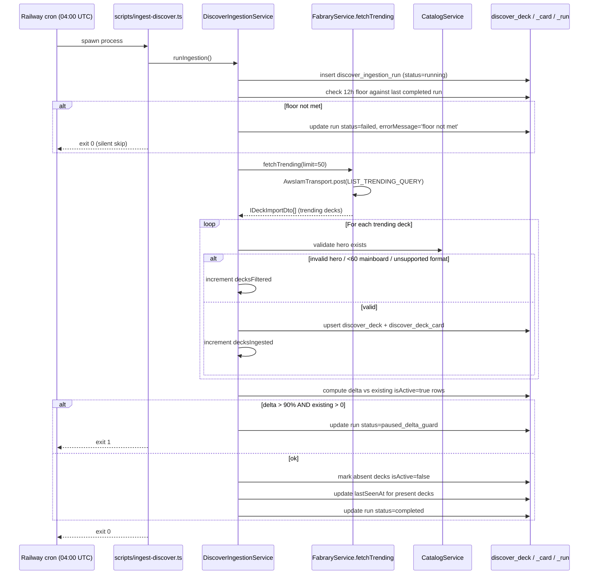
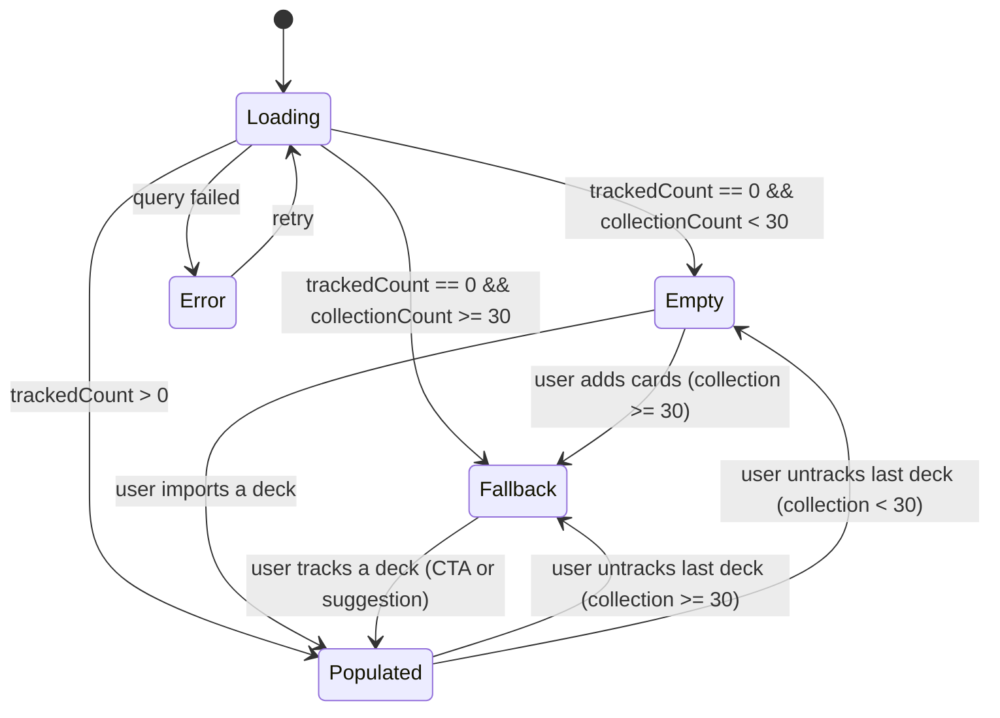
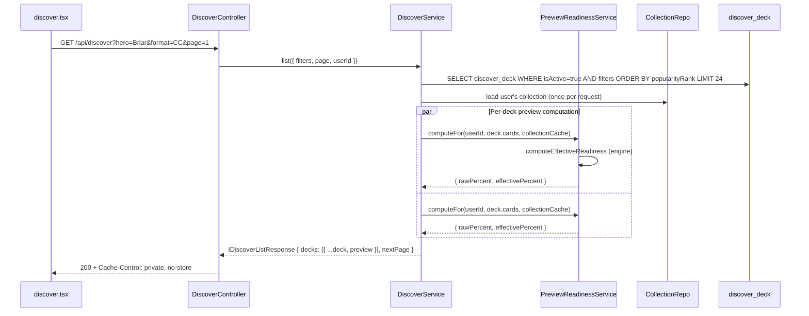
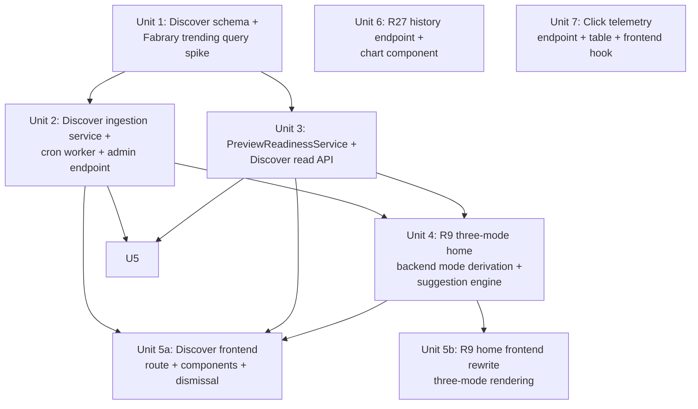

# feat: Phase 1c -- Discover, R9 Three-Mode Home, R27 History Chart, Click Telemetry

> **Phasing-map note (planning-time clarification).** The origin doc's Phasing Map table places R27 in Phase 2 (line 222), but the more recent "Next Steps" section (line 459, dated 2026-04-18) explicitly lists R27 as part of Phase 1c. The "Next Steps" wins because (a) it is dated newer, (b) it is the only place Phase 1c is enumerated as a discrete deliverable, and (c) shipping the chart requires no new data sources -- it reads existing `deck_readiness_snapshot` rows. This plan implements R27. The Phasing Map should be updated by the next requirements-doc revision pass to remove the inconsistency.

## Overview

Phase 1c closes the public-launch surface area by adding the three pieces that Phase 1a explicitly deferred and Phase 1b explicitly excluded:

1. **Discover surface (R11-R14):** automatic ingestion of Fabrary trending decks into a local table, filtered for quality (valid hero, ≥60 mainboard, CC/Blitz only), filterable by hero/format/archetype, with a per-card preview readiness score computed against the user's collection on demand.
2. **R9 three-mode home state machine:** the empty/fallback/populated trio specified in the origin doc, replacing Phase 1a's two-mode collapse. Fallback mode shows "3 closest decks" suggestions (Discover-backed). Populated mode adds the "You may also be close to these decks" expansion section (also Discover-backed, with user-dismissal support).
3. **R27 historical readiness chart:** a per-deck timeseries on the deck-detail page rendered from existing `deck_readiness_snapshot` rows. Decks tracked <7 days render a compact two-point view ("first seen" → "now") instead of the full chart.
4. **Outbound click telemetry (deferred A25 from Phase 1b):** a minimal `outbound_click_event` table populated by a fire-and-forget `POST /api/telemetry/outbound-click` invoked from `<StoreProductLink>` and the new "Track this deck" button. Without this telemetry the secondary success metric ("≥20% of active users click ≥1 product link to a tracked store within any rolling 30-day window") is not measurable; Phase 1b shipped the click target but the metric remained unobservable until Phase 1c lands the event sink.

This is the last vertical of Phase 1 before public launch (R28 affordances live, R9 surface completed, R12 preview readiness for browsing, R27 progress feedback, click metric observable).

## Problem Frame

Phase 1a shipped the engine + interactive swap editor + Path C + autocomplete. Phase 1b shipped the Liga FaB / Sbrauble scraper + variant-aware shopping line. The **third leg of the connect-three-things thesis** ("the decks they want to build or play") is still mostly empty -- the user can only get a deck onto their tracked list by remembering a Fabrary URL and pasting it. There is no in-app discovery surface, no "you may also be close to these decks" nudge, no progress chart that turns readiness into a felt journey, and no way to verify whether the click-through hypothesis (the secondary success metric) is actually playing out.

Phase 1c is the smallest scope that makes Phase 1's primary success metric (8 Pelotas players returning ≥3 days over 4 weeks, 5 of 8 with behavioral engagement) **observable**, not just measurable in principle:

- Discover gives users a surface to come back to between deck-import sessions (return-visit driver).
- R27 gives users a per-deck "movement" feedback loop (engagement driver).
- The R9 expansion section creates the dominant Phase 1 conversion event ("track another deck") on the home page itself.
- Click telemetry makes the secondary metric ("≥20% click a product link") empirically testable.

Without Phase 1c, the public launch ships a tool that bridges inventory + substitution + local stock for **decks the user already knows about** and offers no in-app reason to return between import sessions.

(see origin: `docs/brainstorms/2026-04-08-fab-deck-readiness-flow-requirements.md`, Release Phasing > Phase 1, R9, R11-R14, R27, Success Criteria)

## Requirements Trace

### Feature Requirements (from origin doc)

- **R9** (three-mode home state machine: fully empty / fallback / populated, with fallback's "3 closest decks" and populated's "you may also be close to these decks" expansion section sourced from Discover): Unit 4 (backend), Unit 5b (frontend)
- **R11** (Fabrary trending ingestion on a regular cadence with filters by hero, format CC/Blitz, archetype when available): Unit 1, Unit 2
- **R12** (per-card preview effective readiness against the user's current collection, fast enough for smooth browsing): Unit 3
- **R13** ("Track this deck" adds to tracked list + redirects to deck detail): Unit 5a (Discover surface) and Unit 5b (home expansion section reuses the same handler)
- **R14** (automatic quality filter at ingest time: valid hero, ≥60 mainboard, supported format CC/Blitz): Unit 1, Unit 2
- **R27** (historical movement chart from the day the deck was tracked; compact two-point view for decks tracked <7 days; no backfill): Unit 6
- **A25 deferred from Phase 1b** (outbound click telemetry to make the secondary success metric observable): Unit 7

### Carry-forward from Phase 1a / Phase 1b

- **Phase 1a Scope Boundaries** explicitly note: "No Discover or trending ingestion. R11-R14 are Phase 1c" and "No R9 fallback mode in Phase 1a ... the three-mode machine lands in Phase 1c when Discover data makes fallback mode meaningful". Phase 1c discharges both placeholders -- the home page's "More decks you might be close to -- coming soon" placeholder is replaced with the live expansion section in Unit 5b.
- **Phase 1b Scope Boundaries** explicitly note: "No R29 alternative-suggestions" (still Phase 2), "No Discover ingestion (R11-R14) -- Phase 1c", "No R9 three-mode home -- Phase 1c", "No R27 historical readiness chart -- Phase 2". The first three are owned here; R27 is moved into Phase 1c per the planning-time clarification at the top of this plan.
- **Phase 1b Risks table item** ("the secondary metric is not measurable yet, even after Phase 1b ships ... either the click-tracking sub-unit described in Risks is added to Unit 6's scope before launch, or the metric is explicitly reframed"). Phase 1c chooses the first option: ship the telemetry rather than reframe the metric.

## Scope Boundaries

- **Discover ingestion runs against Fabrary trending only.** No community-submitted decks (origin doc Scope Boundaries). No manual operator-curated "Pelotas picks" -- A4 in the origin doc allows it as a Phase 2 fallback if Fabrary trending volume is sparse, but Phase 1c does not pre-empt that decision.
- **Discover does not show preview readiness for unauthenticated users.** Phase 1c is authenticated-only, same posture as Phase 1b. Browsing trending decks while logged out is a Phase 2 concern.
- **R12 preview readiness is computed on demand at request time -- no precomputed batch job.** The `O(missing × catalog)` cost was acceptable for the deck-detail flow in Phase 1a (single deck, single user) and is acceptable for a Discover page rendering ≤24 cards per request (paginated). A precomputed cache becomes worthwhile only when the page sustains >5 req/s, which the Pelotas scale will not approach. Cache strategy is deferred to Phase 2 unless Phase 1c benchmarks force it earlier (see Risks for the conditional escalation path).
- **No R29 alternative-suggestions in the shopping line for unavailable cards.** Still Phase 2. The shopping line shipped in Phase 1b stays as-is; Phase 1c does not touch it.
- **No archetype-aware engine weighting (R24).** Still Phase 2. Discover surfaces the archetype tag from Fabrary as a filter, but the substitution engine does not consume it.
- **No substitution feedback storage / learning loop (R25).** Still Phase 2.
- **No PT-BR card-name autocomplete (R4 PT-BR variant).** Still Phase 2.
- **No mobile-first design pass; UI/UX planning is owned outside this document.** The user is planning the UI/UX layer separately. Implementation of Unit 5a/5b/6 should follow the simplest possible design (functional, accessible, default browser styling acceptable) and defer all polish/visual decisions to the separate UX track. The chart in Unit 6 explicitly degrades gracefully on narrow viewports (no overflow scroll, no horizontal pan) as the one nod to mobile within scope; no other Phase 1c surface gets a dedicated mobile pass.
- **No admin dashboard for Discover ingestion health.** Same posture as Phase 1b's scraper -- structured logs + DB diagnostics + an admin manual-trigger endpoint, no web UI.
- **No telemetry beyond outbound clicks.** Pageview analytics, session events, conversion funnels, etc. are out of scope. Phase 1c ships the minimum signal required to compute the secondary success metric, nothing more. Privacy posture: only `userId`, `deckId`, `cardIdentifier`, `storeId`, `clickedAt` are stored -- no IP, no User-Agent, no referrer.
- **No "track this deck" with custom modifications.** R13 says "adds the deck to the tracked list" -- the imported deck is the unmodified Fabrary version. The user can use the existing Phase 1a swap editor afterwards. No "track with these swaps already applied" affordance in Phase 1c.
- **No filter persistence in URL / query string.** Discover filters reset on navigation. URL-based filter state is a Phase 2 polish item.
- **No infinite scroll on Discover.** Cursor-based pagination via "Show more" button. Infinite scroll has accessibility costs that a small audience does not justify.

## Context & Research

### Relevant Code and Patterns

- **`FabraryService`** (`apps/api/src/fabrary/fabrary.service.ts`): existing service that fetches a single deck via AppSync GraphQL using `AwsIamTransport`. Phase 1c extends this module with a second query (`listTrending` -- exact name discovered in Unit 1's spike) and a second method (`fetchTrending`). The `AwsIamTransport`, `FetchGuardService`, and catalog-driven card classification (`classifyCard`) are reused unchanged.
- **`AwsIamTransport`** (`apps/api/src/fabrary/aws-iam.transport.ts`): SigV4-signed POST to AppSync. Already exists for `getDeck`. Phase 1c calls it with a new GraphQL query body; no transport-level change needed.
- **`StoreIngestionService`** + **standalone Railway cron worker pattern** (`apps/api/src/stores/store-ingestion.service.ts` + `scripts/scrape-stores.ts` per the Phase 1b plan): the canonical reference for Phase 1c's `DiscoverIngestionService` + `scripts/ingest-discover.ts`. Same structure: `runIngestion()` performs the full fetch → match → upsert → reconcile cycle, records a run row for diagnostics, supports `force` to override prior failed-run state, and is invoked both from Railway cron and an admin endpoint.
- **`SubstitutionService.computeReadinessWithExclusions`** (`apps/api/src/substitution/substitution.service.ts`): the dry-run engine entry point used by the swap editor. Phase 1c's `PreviewReadinessService` calls a similar engine entry but against an arbitrary deck-card list (not a tracked deck row), reusing `computeEffectiveReadiness` from `@rathe-arsenal/engine` directly.
- **`DecksService.listForUser`** (`apps/api/src/decks/decks.service.ts`): already returns `collectionCardCount` (added in Phase 1a Unit 5 forward-looking for Phase 1c). Phase 1c extends the response (via `HomeSuggestionsService`) with `mode: 'empty' | 'fallback' | 'populated'` and `expansionSuggestions` / `fallbackSuggestions` arrays.
- **`DeckReadinessSnapshotEntity`** (`apps/api/src/database/entities/deck-readiness-snapshot.entity.ts`): R27's history chart reads existing rows via `findBy({ trackedDeckId })` ordered by `computedAt`. Already indexed on `(trackedDeckId, computedAt)` -- the query is cheap. No schema change for R27.
- **`StoreProductLink`** (`apps/web/src/components/StoreProductLink.tsx`): the safe outbound-link wrapper. Phase 1c adds an `onClick` handler that fires the telemetry POST without blocking navigation (the `target="_blank"` keeps the new tab opening; the POST is sent in the background). The wrapper signature gains optional `cardIdentifier` and `storeId` props for the event payload.
- **Phase 1b admin endpoint pattern** (`apps/api/src/stores/admin/admin-stores.controller.ts` + `admin-api-key.guard.ts`): Phase 1c's `POST /api/admin/discover/ingest` reuses the same `AdminApiKeyGuard` -- one shared admin auth surface, two admin endpoints behind it.
- **TanStack Router file-based routes** (`apps/web/src/routes/_auth/`): Phase 1c adds `/_auth/discover.tsx`. Existing `home.tsx`, `decks.$deckId.tsx`, `import.tsx` are the templates for routing + query patterns.
- **TanStack Query invalidation pattern** (`apps/web/src/api/decks.ts`): mutations invalidate the `['decks']` key on success. Phase 1c follows the same pattern for the `['discover']` and `['discoverDismissals']` keys.

### Institutional Learnings

- **Phase 0 plan / Gate 4 result** (`docs/brainstorms/gates/gate-4-score-result.md`): the engine passes at SOFT_CONFIDENCE (73.7% acceptance), not strong confidence. Discover's preview readiness reads the same engine -- a low-confidence preview score for a candidate deck must not be presented as a hard truth. The Discover UI uses muted styling and an explicit "Preview based on substitutions" label rather than the bare percentage to set expectations correctly. This matches Phase 1a's broader posture of separating raw vs effective readiness in the deck-detail UI.
- **Phase 1a Risks table -- "Discover preview readiness might be slow at scale"**: cited by Phase 1a as a Phase 1c concern. The mitigation is the on-demand-with-pagination strategy (≤24 decks per request) plus a per-(userId, fabraryUlid) computation of `O(missing-cards × catalog-scan)`. Single-deck readiness benchmarks at <50ms in Phase 1a tests; 24 decks at <50ms each = ≤1.2s wall-clock if computed sequentially. Computed in parallel via `Promise.all`, well under 500ms in practice. If observed p95 exceeds 800ms, switch to a precomputed cache invalidated on collection mutation (deferred to Phase 2 unless Phase 1c benchmarks force the issue earlier).
- **Phase 1b learnings -- per-store rate limiting + `lastFetchedAt` on the row** (Phase 1b Key Technical Decisions): the same floor-pattern is reused for the Discover cron -- the handler refuses to start a new run if the most recent `discover_ingestion_run` row with `status = 'completed'` has `finishedAt` within the last 12 hours (the cadence floor), even if the cron fires more often than that. The floor is computed from the existing `finishedAt` column; no dedicated `lastSucceededAt` column is added. This protects Fabrary from accidentally being hit twice in the same window if Railway's cron duplicate-fires on a redeploy.
- **Phase 1b "delta guard" pattern** (Phase 1b Unit 4): the same shape is reused for `DiscoverIngestionService` -- if a single ingestion run would change >90% of currently-active discover decks, the run aborts. Trending volatility from Fabrary is normally a long-tail churn (top 50 decks share a stable core), so a 90%+ delta is most plausibly a parser regression, not real trending churn.
- **Phase 1b unit-7-style accuracy verification is NOT part of Phase 1c**. Discover ingestion has no offline-truth comparable to a physical store shelf -- the trending list is whatever Fabrary returns. The closest analog is "spot-check 5 ingested decks against the live Fabrary trending list at the same timestamp" (Unit 1 Verification).
- **Phase 1a `path` derivation** (`SubstitutionService.deriveSnapshotFields`): R27's chart reads the persisted `rawPercent` and `effectivePercent` fields directly. The chart does NOT need the derived `path` per point in the timeseries -- which is good, because the timeseries endpoint stays as a thin read-through and does not have to materialize each historic breakdown.

### External References

- **Fabrary AppSync GraphQL endpoint** (Gate 3 spike, `docs/brainstorms/gates/gate-3-dependency-spike.md`): `https://42xrd23ihbd47fjvsrt27ufpfe.appsync-api.us-east-2.amazonaws.com/graphql`, AWS_IAM anonymous auth via Cognito Identity Pool. The Phase 1c spike (Unit 1 pre-implementation) replays a live Fabrary `/decks/trending` browser session to extract the trending GraphQL query name and shape -- candidates from inspection are likely `listTrending` or `getTrendingDecks` but the exact name is implementation-time discovery.
- **Fabrary trending UI** (`https://fabrary.net/decks/trending`): the human reference for what "trending" means. Filters surfaced in the UI (hero, format, archetype) drive the Phase 1c filter set in R11.
- **`@flesh-and-blood/cards` catalog** (`packages/engine/src/catalog/`): used by R14's quality filter to validate that the trending deck's hero is actually present and that the format token (`CC` / `Blitz`) is recognized.
- **Recharts** (`https://recharts.org/`): leading candidate for the R27 line chart -- React-first, declarative, ~30KB gzipped, accessible by default. Alternative `chart.js` is heavier and imperative; alternative `visx` is more flexible but more code. Decision is Unit 6's call; default lean is Recharts.

## Key Technical Decisions

- **`AdminApiKeyGuard` moves from `apps/api/src/stores/admin/` to a shared `AdminModule`.** Phase 1b co-located the guard with the stores admin controller. Phase 1c adds a second admin controller (`POST /api/admin/discover/ingest`), so the guard moves into a new shared module: `apps/api/src/common/admin/admin.module.ts`, declaring `AdminApiKeyGuard` as a provider and exporting it. Both `StoresModule` (Phase 1b refactor) and `DiscoverModule` (Phase 1c) import `AdminModule` to consume the guard. Rationale for a dedicated `AdminModule` over `@Global()` providers: existing `FetchGuardModule` is the precedent pattern (a small focused shared module with a single export); `@Global` providers are intentionally avoided in this codebase because they obscure dependency graphs.

- **`HomeSuggestionsService` is owned by `DecksModule`; `PreviewReadinessService` lives in a neutral `CommonPreviewReadinessModule` to keep both consumers (`DecksModule` and `DiscoverModule`) decoupled.** The service composition has two collaborators with different ownership concerns:
  - `HomeSuggestionsService` (in `DecksModule`) composes Discover data (`discover_deck`, `discover_dismissal`) **and** Decks data (`tracked_deck` for exclusion). If it lived in `DiscoverModule` and were exported, `DiscoverModule` would either need to re-register `TrackedDeckEntity` from Decks (data-layer leak) or import `DecksModule` (boot-time circular dependency). So it stays in `DecksModule`, which extends `TypeOrmModule.forFeature([DiscoverDeckEntity, DiscoverDeckCardEntity, DiscoverDismissalEntity])` to read those entities directly.
  - `PreviewReadinessService` is consumed by both `HomeSuggestionsService` (via DecksModule) and `DiscoverService.list` (via DiscoverModule). Placing it in either module forces a cross-module import that re-creates the cycle risk. Solution: a new `apps/api/src/common/preview-readiness/preview-readiness.module.ts` declares + exports `PreviewReadinessService` as a neutral provider. Both `DecksModule` and `DiscoverModule` import `CommonPreviewReadinessModule`. The service depends only on `CollectionCardEntity` (registered via its own `forFeature`) and the engine package -- it has no Discover or Decks dependencies of its own.
  - `DecksModule` does **not** import `DiscoverModule`. `DiscoverModule` does **not** import `DecksModule`. Both import `CommonPreviewReadinessModule`. This eliminates both the cycle risk and the dual-`forFeature` ambiguity for `DiscoverDeckEntity` (entities are registered in exactly one module each: `DecksModule` for the Discover entities it reads via `HomeSuggestionsService`, plus `DiscoverModule` for the read-only access via `DiscoverService.list` -- the dual registration is intentional and documented; both register against the same physical table).

- **Discover ingestion runs as a separate Railway cron worker, not in-process on the API pod.** Same architectural pattern as Phase 1b's store scraper. A new `scripts/ingest-discover.ts` bootstraps a NestJS standalone application context, resolves `DiscoverIngestionService`, calls `runIngestion()`, and exits. Railway schedules it daily at `0 4 * * *` UTC (one hour after the store scraper) so the two cron workloads do not contend for outbound bandwidth or DB connections. The API pod also exposes an admin endpoint (`POST /api/admin/discover/ingest`) for on-demand runs guarded by the existing `AdminApiKeyGuard`. Same dual-entry-point pattern as Phase 1b. `@nestjs/schedule` is **not** introduced.

- **All `fabraryUlid` columns across new tables use `varchar(26)`** -- ULIDs are fixed 26-character strings. Consistent length across `discover_deck.fabraryUlid`, `discover_dismissal.fabraryUlid`, and any future `fabraryUlid` storage prevents silent drift. (Existing `tracked_deck.fabraryUlid` keeps its current `varchar` shape; no retroactive change.)

- **Discover storage: three new tables (`discover_deck`, `discover_deck_card`, `discover_dismissal`) + one run-history table (`discover_ingestion_run`).**
  - `discover_deck` -- one row per ingested deck (`id` serial PK, `fabraryUlid` varchar unique, `name` varchar, `hero` varchar, `format` varchar (`CC` | `Blitz`), `archetype` varchar nullable, `mainboardCount` int, `popularityRank` int, `firstIngestedAt` timestamptz, `lastSeenAt` timestamptz, `isActive` boolean default true, `createdAt` timestamptz default now()). Unique index on `fabraryUlid`. Index on `(isActive, hero)` and `(isActive, format)` for the filter queries.
  - `discover_deck_card` -- one row per `(discoverDeckId, cardIdentifier, slot)` (`id` serial PK, `discoverDeckId` int FK ON DELETE CASCADE, `cardIdentifier` varchar, `quantity` int, `slot` varchar enum). Unique on `(discoverDeckId, cardIdentifier, slot)`.
  - `discover_dismissal` -- one row per `(userId, fabraryUlid)` capturing user dismissal of an expansion suggestion (`id` serial PK, `userId` uuid FK ON DELETE CASCADE, `fabraryUlid` varchar, `dismissedAt` timestamptz default now()). Unique on `(userId, fabraryUlid)`. **Keyed on `fabraryUlid` rather than `discoverDeckId` deliberately** -- a dismissed deck that drops out of trending then re-enters keeps its dismissal. This is what users mean by "I do not want to see this again."
  - `discover_ingestion_run` -- one row per ingestion attempt (mirrors `store_scrape_run` shape -- `id`, `startedAt`, `finishedAt`, `decksFetched`, `decksIngested`, `decksFiltered`, `decksDropped`, `deltaPercent`, `status` enum `running | completed | failed | paused_delta_guard`, `errorMessage`, `forcedOverride` boolean). Acts as the run audit log + soft lock + delta guard memory.

- **R14 quality filter is enforced at ingestion time, not at read time.** A trending deck that fails any of the three checks (hero not in catalog, mainboardCount < 60, format not in `{CC, Blitz}`) is **not** persisted. The `decksFiltered` counter on `discover_ingestion_run` tracks how many were dropped per run for observability. Filter rationale: rendering invalid decks would surface bad preview readiness, the user cannot meaningfully track them, and the substitution engine has no signal to apply. Filtering at ingest time keeps the read path clean.

- **Reconciliation: trending churn marks decks `isActive = false` rather than deleting them.** Same rationale as Phase 1b's "zero out instead of delete" decision -- preserves historical context (a tracked Discover deck that fell out of trending should still resolve), and avoids cascading row-churn on `discover_deck_card`. The Discover read path filters `isActive = true` by default. A Phase 2 follow-up may purge `isActive = false AND lastSeenAt < now() - 90 days` rows.

- **Preview readiness is computed on demand against an arbitrary deck-card array.** The existing `SubstitutionService` operates on `TrackedDeckEntity` rows; Phase 1c factors out a new `PreviewReadinessService` that takes `(userId, deckCards: IPreviewDeckCard[], collectionCache?: ICollectionCache)` and returns `IEffectiveReadinessResult`. Internally it loads the user's collection (or uses the passed cache) and runs `computeEffectiveReadiness` from `@rathe-arsenal/engine` against the arbitrary card list. **No persistence** -- preview results are never stored. The Discover endpoint paginates to ≤24 decks per page and computes per-deck readiness via `Promise.all` -- this serializes execution on the Node event loop (not actual parallelism for CPU-bound engine work) but keeps the call shape ergonomic. **Realistic latency basis:** the engine's per-deck cost depends on the *bucket size* returned by `catalog.byClassAndPitch` (typically 200-400 candidates per missing card for a major class), not the full ~4500-card catalog. Average-case 24-deck wall time stays under 500ms because per-deck cost is typically <20ms on a representative collection; the 800ms p95 budget in Risks is the actual gate.

- **Collection cache is built once per HTTP request and passed explicitly across services.** Concrete shape: `type ICollectionCache = ReadonlyMap<string, number>` (cardIdentifier → quantity), defined once in a new shared types file (`apps/api/src/decks/types/collection-cache.ts` or similar). This matches the existing `runReadiness` Map construction (`apps/api/src/substitution/substitution.service.ts` lines 121-123) and the engine signature `inventory: ReadonlyMap<string, number>`. `DecksService.listForUser` (in populated/fallback modes) loads `CollectionCardEntity` rows once, builds the Map, and passes it to both the snapshot-derivation pass and `HomeSuggestionsService.suggest`, which forwards it to `PreviewReadinessService.computeFor`. `DiscoverService.list` does the same -- builds the cache once and shares it across the parallel preview computations. The cache parameter on every consumer is **optional** so unit tests can call `computeFor` standalone, but production call sites always pass an explicit cache to avoid silent duplicate `SELECT * FROM collection_card WHERE userId=...` queries that no test will catch unless instrumented as a spy.

- **R9 home modes are derived server-side, not client-side.** The `GET /api/decks` response gains a `mode` discriminator computed by `HomeSuggestionsService.deriveMode({ trackedDeckCount, collectionCardCount })`. The frontend trusts the field and renders the corresponding component without re-deriving the mode itself. Centralizing the derivation prevents the frontend's two-mode logic from drifting out of sync with the backend's three-mode classification.
  - `mode: 'empty'` ⇔ `trackedDeckCount === 0 AND collectionCardCount < HOME_MIN_COLLECTION_THRESHOLD` (HOME_MIN_COLLECTION_THRESHOLD = 30 cards as a starting threshold; configurable via env var; rationale: ~30 cards is the lower bound where preview readiness against trending decks starts to produce non-trivial signal)
  - `mode: 'fallback'` ⇔ `trackedDeckCount === 0 AND collectionCardCount >= HOME_MIN_COLLECTION_THRESHOLD`
  - `mode: 'populated'` ⇔ `trackedDeckCount > 0`

- **The R9 fallback / expansion suggestion engine is shared, with a cheap pre-filter before any engine call.** Both fallback mode ("3 closest decks") and populated mode ("you may also be close to these decks") read from the same Discover suggestion pipeline. **Crucial sequencing**: the preview-readiness engine runs only on decks that survive a SQL pre-filter, never on the full 50-deck candidate pool, because the home endpoint is the highest-frequency surface in the product and ~50 engine calls per request would add ~500-1500ms to every home page load.
  1. Load the `discover_deck` rows where `isActive = true` ordered by `popularityRank ASC`, limited to a candidate pool (top 50).
  2. **Pre-filter (no engine):** SQL `LEFT JOIN` against `collection_card` to count overlapping `cardIdentifier`s per deck; drop decks with `< MIN_OVERLAP_CARDS` (default 10) collection overlap. Also exclude tracked + dismissed decks via `WHERE NOT EXISTS` clauses. This typically reduces the pool from 50 to 5-15 candidates in one query, before any engine call fires.
  3. **Engine pass:** for the remaining candidates, compute preview readiness via `PreviewReadinessService` (with shared collection cache).
  4. **Threshold filter:** drop candidates below `HOME_FALLBACK_MIN_PERCENT = 0.50` (fallback) or `HOME_EXPANSION_MIN_PERCENT = 0.60` (populated) -- fallback is more permissive because the user has nothing tracked yet.
  5. Sort the remaining candidates by `previewReadiness DESC` and take the top 3.
  - The threshold values + pre-filter floor are env-tunable (`HOME_FALLBACK_MIN_PERCENT`, `HOME_EXPANSION_MIN_PERCENT`, `HOME_MIN_OVERLAP_CARDS`) but ship with the defaults above. The suggestion limit (3) is a hardcoded constant, not env-tunable -- see env vars list note.
  - **If the pre-filter still leaves >15 candidates** (e.g., a power user with a deep collection), the pipeline takes the top 15 by raw overlap count before running the engine. This bounds worst-case home-page latency at ~15 × ~20ms = ~300ms even for the largest collections.

- **R27 chart reads existing snapshots via a new dedicated endpoint.** `GET /api/decks/:id/readiness-history` returns `{ points: Array<{ computedAt, rawPercent, effectivePercent }>, trackedAt, daysTracked }`. The endpoint authorizes via the existing `AuthzService.assertOwnsTrackedDeck` and reads from `deck_readiness_snapshot` ordered by `computedAt ASC`. No schema change. No new write path. Frontend uses the response to render either:
  - The full Recharts line chart (when `daysTracked >= 7` AND `points.length >= 2`)
  - A compact two-point view ("first seen at X%" → "now at Y%") for newer decks
  - A placeholder ("Tracking just started -- come back tomorrow") when `points.length < 2`

- **Click telemetry uses a fire-and-forget POST endpoint.** `POST /api/telemetry/outbound-click` accepts `{ deckId: number, cardIdentifier: string, storeId: number }`. Authenticated (no `@Public()`); rate-limited at 60/min per IP (well above any plausible user browsing pace, but enough to bound abuse). The endpoint validates the input shape via class-validator, inserts a row into `outbound_click_event`, and returns `204 No Content`. The frontend invokes it via `fetch(...).catch(() => {})` from the `<StoreProductLink onClick>` handler (and from the future Discover "Track this deck" button) -- network failures are swallowed silently because the click itself succeeds regardless of telemetry persistence.

- **`outbound_click_event` table schema** -- one row per click (`id` bigserial PK, `userId` uuid FK ON DELETE CASCADE, `deckId` int nullable (the click may be from a Discover preview without a tracked deck context), `cardIdentifier` varchar nullable, `storeId` int FK ON DELETE SET NULL, `clickedAt` timestamptz default now()). Index on `(userId, clickedAt)` for the per-user metric query. Index on `(clickedAt)` for the rolling-30-day aggregate query. **No PII beyond userId** -- no IP address, no user-agent, no referrer URL. The `cardIdentifier` is technically inventory-adjacent but it is bounded to the public catalog; storing it lets a Phase 2 dashboard cross-tab "which cards drive the most click-through". A Phase 2 retention policy may delete rows older than 1 year; Phase 1c does not enforce one (the table grows at most ~10s of rows per active user per month, negligible at Pelotas scale).

- **Discover frontend is paginated, not infinite-scroll.** A "Show more" button extends the result set in chunks of 24. The page renders a filter bar (hero, format, archetype) at the top, the result grid below, and the "Show more" button at the bottom. URL state is **not** synced -- filters reset on navigation. URL-syncing is a Phase 2 polish item.

- **The "Track this deck" affordance reuses the existing Phase 1a import pipeline.** Clicking "Track this deck" from a Discover card calls `POST /api/decks/import` with a `urls` array of one URL constructed from the `fabraryUlid`: `https://fabrary.net/decks/${fabraryUlid}`. Unit 1 spike Part A explicitly verifies this URL template returns a 200 for a real ulid before the rest of Phase 1c proceeds (so the template does not silently break if Fabrary uses a format-scoped path). This avoids any new tracked-deck creation path. The import pipeline already handles deduplication ("user already tracks this deck" → returns the existing tracked-deck row). After success, the frontend navigates to `/decks/$deckId` (R13's redirect requirement). No `discover_deck_card` data is consumed during track -- the Fabrary deck is re-fetched fresh by the import pipeline so the source-of-truth for the tracked deck remains the Fabrary GraphQL response, not the locally-cached Discover snapshot.

- **`Cache-Control: private, no-store` on every Discover and home response.** Same posture as Phase 1b's shopping-line responses. Discover responses contain per-user preview readiness (collection-derived); home responses contain per-user tracked-deck and suggestion data. Cloudflare must not cache one user's response and serve it to another. **Each new endpoint's e2e spec includes an explicit assertion** on the `Cache-Control` header value (`expect(response.headers['cache-control']).toBe('private, no-store')`) -- decorator omission in a future endpoint addition would fail the regression. Affected endpoints: `GET /api/discover`, `GET /api/decks` (extended response), `GET /api/decks/:id/readiness-history`, `POST /api/discover/dismissals`, `DELETE /api/discover/dismissals/:fabraryUlid`. Secondary defense: `Vary: Authorization` header on the same responses.

- **Env vars added in Phase 1c (all default-safe for local/CI):**
  - `DISCOVER_INGESTION_ENABLED` (boolean, default `false`) -- gates the cron worker, mirrors `STORE_SCRAPER_ENABLED`.
  - `DISCOVER_INGESTION_LIMIT` (int, default `50`) -- max trending decks per ingestion run; Fabrary's trending list is generally <100 active items.
  - `DISCOVER_RUN_FLOOR_HOURS` (int, default `12`) -- minimum hours between successful runs (defends against cron duplicate-fire on redeploys).
  - `HOME_MIN_COLLECTION_THRESHOLD` (int, default `30`) -- the empty-vs-fallback boundary in cards.
  - `HOME_FALLBACK_MIN_PERCENT` (float, default `0.50`) -- minimum preview readiness for fallback suggestions.
  - `HOME_EXPANSION_MIN_PERCENT` (float, default `0.60`) -- minimum preview readiness for populated-mode expansion suggestions.
  - `HOME_MIN_OVERLAP_CARDS` (int, default `10`) -- pre-filter floor for the suggestion engine (see suggestion pipeline above).

  **Note on the existing `FABRARY_ALLOW_HOSTS`:** the Discover trending query reuses the same AppSync endpoint as `getDeck` and is validated against the existing allow-list -- no separate `FABRARY_TRENDING_ALLOW_HOSTS` env var is added (the AwsIamTransport reads only `FABRARY_ALLOW_HOSTS` and routing two queries through one transport via two env vars would require a transport refactor that is out of scope). Unit 1 adds a **boot-time validator** to env.dto.ts that rejects the env if any `FABRARY_ALLOW_HOSTS` entry resolves to an RFC1918 / link-local address or is empty -- defends against an operator misconfiguration silently widening the SSRF allow-list.
  **Note on `HOME_SUGGESTION_LIMIT`:** the suggestion limit is hardcoded to `3` in a named constant (`HOME_SUGGESTION_LIMIT = 3` in the service module), not env-tunable in Phase 1c. The plan's R9 specification says "up to 3 suggestions"; promotion to env var is a Phase 2 concern only if spike testing surfaces a need.

## Open Questions

### Resolved During Planning

- **R27 -- Phase 1c or Phase 2?** Resolved to Phase 1c. The Phasing Map is stale; the "Next Steps" section (line 459) is the source of truth and lists R27 explicitly. The implementation is cheap (read existing snapshots), the user-visible value is large (felt progress), and shipping it now removes the risk that "the chart" becomes a perpetually-deferred polish item. See the planning-time clarification at the top of this plan.
- **Discover ingestion cadence?** Resolved to daily at 04:00 UTC, with a 12-hour floor between successful runs (defends against duplicate cron fires). R11 says "regular cadence ... deferred to planning"; daily matches the store-scrape cadence and Fabrary trending volume changes slowly enough to make sub-daily wasteful.
- **Preview readiness -- on-demand or precomputed?** Resolved to on-demand. Pelotas-scale traffic does not justify the precomputation infrastructure; the on-demand cost is bounded by pagination and parallelism. A precomputed cache becomes a Phase 2 concern only if observed p95 latency on the Discover page exceeds 800ms.
- **R9 minimum collection threshold (the empty/fallback boundary)?** Resolved to ship with 30 cards as the env-tunable default and adjust post-launch based on observed behavior. Rationale: ~30 cards is the lower bound at which preview readiness against an 80-card CC deck or 40-card Blitz deck produces non-trivial signal; below 30 the preview is mostly red and fallback suggestions feel like noise. The plan does NOT pre-validate the threshold against tester collections; the env var (`HOME_MIN_COLLECTION_THRESHOLD`) makes post-launch adjustment trivial when feedback arrives. Risk accepted: users with 20-29 cards may see empty mode at launch until the threshold is tuned down.
- **R9 expansion suggestion threshold (preview readiness floor)?** Resolved to 50% for fallback mode and 60% for populated mode. Rationale: fallback mode is the user's first impression and benefits from even rough suggestions; populated mode users have already tracked decks at higher fidelity and benefit from a tighter threshold so the expansion list does not feel like a downgrade.
- **Where does the R27 chart live -- a separate route or inline on deck-detail?** Resolved to inline on `decks.$deckId.tsx`, below the readiness header. Origin doc R26+R27 imply a single deck-detail surface; a separate route would require an extra navigation for a low-effort affordance.
- **Click telemetry -- per-user opt-out?** Resolved to NO opt-out in Phase 1c. The data is minimal (no PII beyond userId), the user can already control session presence via auth, and Phase 0/1 testers consented to product analytics implicitly via the closed-beta agreement. An opt-out toggle would add settings UI surface area for negligible privacy benefit at this scale. A Phase 2 LGPD-aligned settings page may add it.
- **Click telemetry -- include the path the user came from (deck detail vs home aggregate vs Discover preview)?** Resolved to NO in Phase 1c. The current schema captures `(userId, deckId, cardIdentifier, storeId, clickedAt)` -- enough for the secondary success metric. A `source` column distinguishing entry points is a Phase 2 enrichment if conversion-funnel analysis becomes needed.
- **"Track this deck" flow: re-fetch from Fabrary or seed from `discover_deck_card`?** Resolved to re-fetch via the existing import pipeline. The Discover snapshot may be hours stale; Fabrary is the source of truth for the deck the user just chose to track. The cost (one extra GraphQL request per track) is negligible.
- **Discover authentication -- public or authenticated?** Resolved to authenticated. Same posture as Phase 1b shopping-line. Public Discover would (a) require an unauthenticated read path that bypasses preview readiness, (b) create a cheap third-party scraping vector for the trending data, (c) introduce CORS surface that Phase 1c does not need.
- **Recharts vs Chart.js vs visx for R27?** Lean toward Recharts; deferred to Unit 6 implementation based on bundle-size impact when measured against the existing build.

### Deferred to Implementation

- **The exact Fabrary trending GraphQL query name + shape.** Gate 3 confirmed AppSync access for `getDeck` but did not enumerate the trending query. Unit 1's pre-implementation spike replays a live `https://fabrary.net/decks/trending` browser session (DevTools → Network) to extract the GraphQL operation name and payload. Likely candidates: `listTrending`, `getTrendingDecks`, `getTrending`. Recorded in the Unit 1 PR description.
- **Whether Fabrary's trending query exposes archetype metadata.** R11 makes archetype filtering conditional ("when Fabrary provides that metadata"). The spike confirms presence/absence; the filter UI either renders the archetype dropdown or omits it.
- **Whether "popularityRank" is in the trending response or implied by ordering.** If implied (the trending query returns decks in popularity order), Unit 1 stores the response array index as `popularityRank`. If explicit, it stores the field directly.
- **Recharts bundle size delta.** Measured during Unit 6. If the gzipped delta exceeds 50KB, fall back to a hand-rolled SVG line chart (the chart is a single line with ≤30 points -- a hand-roll is feasible but uglier). Recorded in the Unit 6 PR description.
- **Empty-vs-fallback transition UX.** When a user crosses the 30-card threshold by adding cards via autocomplete, the home page transitions from empty to fallback on the next query refetch. The frontend does not animate this transition in Phase 1c -- the next render shows the new mode. Whether this transition needs a "you unlocked suggestions" callout is a Phase 2 polish question.
- **Whether to surface "fell out of trending" badges on tracked decks in the home page.** A tracked deck whose `discover_deck.isActive = false` could show a subtle "no longer trending" badge for context. Phase 1c does not implement this -- it is Phase 2 polish.

## High-Level Technical Design

> *This illustrates the intended approach and is directional guidance for review, not implementation specification. The implementing agent should treat it as context, not code to reproduce.*

### Data flow -- daily Discover ingestion

### R9 home state machine

### Read flow -- Discover page request

### Unit dependency graph

U1 is the foundation (schema + transport extension + `AdminModule` extraction). U2 and U3 can be developed in parallel after U1 (U2 is the write path; U3 is the read path). U4 builds on U3's preview engine. **Unit 5 is split into 5a (Discover frontend, depends on U3) and 5b (R9 home rewrite, depends on U4)** so the high-traffic home page rewrite ships independently from the new Discover surface. U6 and U7 are largely independent of the Discover stack and can be built in parallel with the others by a second agent.

## Implementation Units

- [ ] **Unit 1: Discover Schema + Fabrary Trending Query Spike + Env Wiring**

**Goal:** Introduce `discover_deck`, `discover_deck_card`, `discover_dismissal`, `discover_ingestion_run` entities + migrations, extend `FabraryService` with a `fetchTrending(limit)` method backed by the right GraphQL query (discovered during the spike), and wire the new env vars.

**Requirements:** R11 (cadence + filters), R14 (quality filter at ingest)

**Dependencies:** None

**Pre-implementation spike-first gate (D1, ~2 hours total).** Two-part spike that **must complete before U2-U5a/b begin** -- a no-go result on either part triggers a re-plan, not a continuation. The dependency graph already places U1 as the foundation, but the gate makes the relevance test explicit:

  **Part A -- GraphQL discovery (~1h).** Open `https://fabrary.net/decks/trending` in a browser with DevTools → Network filter `appsync-api`. Capture the operation name and payload of the GraphQL request fired when the trending list loads. Inspect:
    1. Operation name (likely `listTrending` / `getTrendingDecks`).
    2. Whether `archetype` is exposed.
    3. Whether `popularityRank` is explicit or implied by array order.
    4. Whether the same `getDeck`-style `deckCards` field is present, or if a thinner trending-shape needs a follow-up `getDeck` per trending entry.
    5. **Web URL routing:** for one of the captured ulids, manually verify that `https://fabrary.net/decks/<ulid>` returns a 200 (not 404; not redirected to a format-scoped path like `/decks/cc/<ulid>`). This validates the URL template Unit 5a uses for "Track this deck" via the import pipeline.
  Record the findings + the captured query in a commit message on the Unit 1 branch and adjust the schema if necessary (e.g., if `archetype` is unavailable, drop the `archetype` column and the corresponding filter -- R11 makes archetype conditional).

  **Part B -- relevance probe against real audience (~1h).** Pull the trending top-20 decks via the spike's working query. For 2-3 Phase 0 closed-beta testers (whose collections already exist in dev/staging), run the engine via `PreviewReadinessService` (a throwaway test script is fine) and record the preview-readiness distribution. **Pass criteria:** at least 3 of the top 20 decks score ≥50% effective readiness against at least one tester collection. If the threshold is not met, the trending source is unsuitable for the casual Pelotas audience as the only Discover input -- escalate via Risks with a re-plan recommendation (consider Phase 2's curated "Pelotas picks" fallback, or redefine R11 to use a different source). Do **not** continue to U2 with a failed Part B without explicit user approval to accept the risk.

  Both parts produce written artifacts in the Unit 1 PR description (raw GraphQL capture + relevance probe table). The PR cannot merge with either part missing.

**Files:**
- Create: `apps/api/src/database/entities/discover-deck.entity.ts`
- Create: `apps/api/src/database/entities/discover-deck-card.entity.ts`
- Create: `apps/api/src/database/entities/discover-dismissal.entity.ts`
- Create: `apps/api/src/database/entities/discover-ingestion-run.entity.ts`
- Modify: `apps/api/src/database/entities/index.ts`
- Modify: `apps/api/src/database/database.module.ts` (append the four entities to `entities` array)
- Create: `apps/api/src/database/migrations/<TIMESTAMP>-AddDiscoverTables.ts` (`<TIMESTAMP>` is generated at implementation time via `date -u +%s%3N`, matching the Phase 1b migration convention; must be strictly greater than the most recent existing migration `1744329603000`)
- Create: `apps/api/src/fabrary/queries/list-trending.query.ts` (the GraphQL string discovered in the spike)
- Modify: `apps/api/src/fabrary/fabrary.service.ts` (add `fetchTrending(limit: number): Promise<IDiscoverImportDto[]>`)
- Create: `apps/api/src/fabrary/dtos/discover-import.dto.ts`
- Modify: `apps/api/src/config/env.dto.ts` (add the seven new env vars listed in Key Technical Decisions: `DISCOVER_INGESTION_ENABLED`, `DISCOVER_INGESTION_LIMIT`, `DISCOVER_RUN_FLOOR_HOURS`, `HOME_MIN_COLLECTION_THRESHOLD`, `HOME_FALLBACK_MIN_PERCENT`, `HOME_EXPANSION_MIN_PERCENT`, `HOME_MIN_OVERLAP_CARDS`. Update the existing `ADMIN_API_KEY` `@ValidateIf` decorator from `(o) => o.STORE_SCRAPER_ENABLED === true` to `(o) => o.STORE_SCRAPER_ENABLED === true || o.DISCOVER_INGESTION_ENABLED === true` -- do NOT stack a second `@ValidateIf` decorator on the same field. Also add `DISCOVER_INGESTION_ENABLED` to the existing `BOOLEAN_ENV_KEYS` constant to avoid the class-transformer boolean-string footgun documented in env.dto.ts.)
- Test: `apps/api/src/fabrary/__tests__/fabrary.service.fetch-trending.spec.ts` (against a fixture GraphQL response)
- Test: `apps/api/src/config/__tests__/env.dto.spec.ts` (extend with new env var cases)

**Approach:**
- **Entity shape** matches the schemas in Key Technical Decisions. Use TypeORM-style entities mirroring `store.entity.ts` for consistency. `discover_deck.archetype` is `nullable: true` so a Fabrary response without archetype does not break the row.
- **Migration:** PascalCase filename matching the existing convention. The timestamp is generated at implementation time via `date -u +%s%3N` (per the Files list above). Creates all four tables in one migration to keep the unit atomic. **Postgres enum DDL:** the `discover_ingestion_run.status` column requires an explicit `CREATE TYPE discover_ingestion_run_status_enum AS ENUM ('running','completed','failed','paused_delta_guard')` step before `createTable`, mirroring `1744329600000-AddStoreTables.ts` (which does the same for `store_scrape_run_status_enum`). The `down()` migration must `DROP TYPE IF EXISTS discover_ingestion_run_status_enum` after dropping the table. TypeORM's `type: 'enum'` column option does NOT auto-create the type in this codebase's existing migration style.
- **`fetchTrending`** mirrors `fetchDeck`'s structure: build a GraphQL body, post via `AwsIamTransport`, validate the response shape with `IRawTrendingResponse`, map to `IDiscoverImportDto[]`. **Reuse `classifyCard`** from the existing service to bucket cards into mainboard/equipment/weapons/hero. **R14 quality filter is NOT applied here** -- `fetchTrending` returns the raw mapped DTO array and is the transport layer; the R14 decisions (hero in catalog, mainboardCount ≥ 60, format ∈ {CC, Blitz}) live in `DiscoverIngestionService` (Unit 2) which is the ingestion business-logic boundary. Single source of truth for filter ownership; aligns with the sequence diagram and Key Technical Decisions.
- **Contingency for thin trending response shape:** if the spike finds the trending query does NOT return `deckCards`, `fetchTrending` returns metadata-only entries and the ingestion service (Unit 2) is responsible for invoking `fetchDeck(ulid)` per entry, batched at concurrency 5 with a 200ms inter-batch delay. This branch is documented in the Unit 1 PR description as a one-line decision; if the trending query DOES return `deckCards`, the contingency path stays inactive.
- **Env validation:** `DISCOVER_INGESTION_ENABLED=true` requires `ADMIN_API_KEY` to be set (cross-field validator, mirroring the Phase 1b pattern for `STORE_SCRAPER_ENABLED`).

**Patterns to follow:**
- `apps/api/src/fabrary/fabrary.service.ts` for the GraphQL service shape.
- `apps/api/src/database/entities/store.entity.ts` for entity structure.
- `apps/api/src/database/migrations/1744329600000-AddStoreTables.ts` for migration shape.
- `apps/api/src/config/env.dto.ts` for env var pattern + cross-field validation.

**Test scenarios:**
- Happy path: `fetchTrending(50)` against a fixture response returns 50 valid `IDiscoverImportDto` entries.
- Happy path: a fixture entry with `mainboardCount = 80`, valid hero, `format = 'CC'` passes the R14 filter.
- Edge case: fixture entry with hero not in `@flesh-and-blood/cards` catalog → filtered out (returns null in the array).
- Edge case: fixture entry with `mainboardCount = 45` → filtered out.
- Edge case: fixture entry with `format = 'Draft'` → filtered out.
- Edge case: fixture entry without `archetype` → row created with `archetype = null`.
- Error path: GraphQL response has `errors` array → throws `FabraryImportError(EFabraryErrorCode.INVALID_PAYLOAD, ...)`.
- Error path: AwsIamTransport throws (network failure) → propagates as `FabraryImportError(EFabraryErrorCode.FETCH_FAILED, ...)`.
- Edge case: env validation -- `DISCOVER_INGESTION_ENABLED=true` without `ADMIN_API_KEY` → boot throws.
- Integration: migration runs cleanly on a fresh DB; all four tables exist with the expected indices.

**Verification:**
- The four new tables exist with correct columns + indices after migration.
- `FabraryService.fetchTrending` works against the fixture and against a recorded real response (one-shot manual verification in dev).
- Env validation rejects invalid combinations at boot.

---

- [ ] **Unit 2: Discover Ingestion Service + Cron Worker + Admin Endpoint + Reconciliation + Delta Guard**

**Goal:** Compose Unit 1 (`fetchTrending` + entities) into a full ingestion pipeline that runs daily, can be manually triggered via admin endpoint, upserts trending decks, marks absent ones inactive, enforces the 12-hour floor + 90% delta guard, and writes a `discover_ingestion_run` audit row.

**Requirements:** R11 (cadence), R14 (quality filter persisted via U1), R31 + S8 (admin auth)

**Dependencies:** Unit 1

**Files:**
- Create: `apps/api/src/discover/discover.module.ts` (imports the new `AdminModule`)
- Create: `apps/api/src/discover/discover-ingestion.service.ts`
- Create: `apps/api/src/discover/admin/admin-discover.controller.ts` (`POST /api/admin/discover/ingest`)
- Create: `apps/api/src/discover/admin/dtos/ingestion-response.dto.ts`
- Create: `apps/api/src/common/admin/admin.module.ts` (new shared module declaring + exporting `AdminApiKeyGuard`)
- Move: `apps/api/src/stores/admin/admin-api-key.guard.ts` → `apps/api/src/common/admin/admin-api-key.guard.ts`
- Modify: `apps/api/src/stores/admin/admin-stores.controller.ts` (update guard import path)
- Modify: `apps/api/src/stores/__tests__/admin-stores.controller.e2e-spec.ts` (update `AdminApiKeyGuard` import path to the new `apps/api/src/common/admin/` location -- TypeScript will not compile the test until both the controller and its e2e spec point at the new path)
- Modify: `apps/api/src/stores/stores.module.ts` (remove guard from local providers; import `AdminModule`)
- Create: `scripts/ingest-discover.ts` (Railway cron worker -- bootstraps NestJS standalone context)
- Modify: `apps/api/src/app.module.ts` (register `DiscoverModule`)
- Modify: `scripts/deploy-railway.md` (document the new cron service: schedule `0 4 * * *`, env vars, manual trigger curl invocation)
- Create: `apps/api/src/discover/__tests__/discover-ingestion.service.spec.ts`
- Create: `apps/api/src/discover/__tests__/admin-discover.controller.e2e-spec.ts`

**Approach:**
- **`DiscoverIngestionService.runIngestion(options: { force?: boolean }): Promise<IIngestionRunSummary>`** mirrors Phase 1b's `StoreIngestionService.runScrape` (insert run row first, then short-circuit on guard failures by updating that row to `failed`):
  0. **Stale-lock recovery (always runs first):** `UPDATE discover_ingestion_run SET status = 'failed', errorMessage = 'STALE_LOCK_RECOVERED', finishedAt = now() WHERE status = 'running' AND startedAt < now() - 30 minutes`. This auto-cleans zombie rows left by OOM-killed worker processes, pod restarts, or crashed admin invocations. Cheap (indexed update on `(storeId, startedAt)` -- adapt to `(startedAt)` index for this table) and runs every invocation, so stale rows never accumulate.
  1. Soft lock: query the most recent `discover_ingestion_run`. If `status = 'running'` and `startedAt > now() - 30 minutes` and `options.force !== true`, abort early with `INGESTION_ALREADY_RUNNING` -- do NOT insert a new row (the existing `running` row is the audit trail for the in-flight attempt). **`force=true` supersedes the soft lock**: the admin operator can override a suspected zombie that is still inside the 30-minute window (e.g., when the OOM happened seconds ago and the operator does not want to wait). When `force=true` overrides soft lock, the existing `running` row is updated to `status = 'failed', errorMessage = 'OPERATOR_FORCE_OVERRIDE_OF_RUNNING_LOCK'` before proceeding.
  2. Insert a new `discover_ingestion_run` (`status = 'running'`, `startedAt = now()`, zeroed counters, `forcedOverride = options.force === true`). All subsequent failures update this row rather than creating new rows.
  3. 12-hour floor check: if the previous `status = 'completed'` run was within `DISCOVER_RUN_FLOOR_HOURS` hours and `options.force !== true`, update the run row to `status = 'failed'` with `errorMessage = 'INGESTION_FLOOR_NOT_MET'` and return.
  4. Delta-guard lock: if the *prior* run (the one immediately before the row we just inserted) has `status = 'paused_delta_guard'` and `options.force !== true`, update the run row to `status = 'failed'` with `errorMessage = 'OPERATOR_OVERRIDE_REQUIRED'` and return.
  5. Call `fabraryService.fetchTrending(env.DISCOVER_INGESTION_LIMIT)`.
  6. For each entry that passed R14 (non-null), upsert into a staging Map keyed by `fabraryUlid`.
  7. Compute delta vs existing `isActive = true` rows: `(upserts + deactivations) / max(existingActiveCount, 1) * 100`.
  8. Delta-guard check: if `>90%` AND `existingActiveCount > 0`, abort, persist `status = 'paused_delta_guard'`, return summary without DB mutation.
  9. Persist in a single transaction: upsert `discover_deck` rows (assign `popularityRank` from array index when explicit rank is absent), upsert `discover_deck_card` rows (delete-and-reinsert per deck for simplicity -- decks have ≤80 cards), mark absent `discover_deck` rows `isActive = false` and `lastSeenAt` unchanged, update `lastSeenAt = now()` on present rows.
  10. Update the run row to `status = 'completed'` with all counters.
- **Worker entry point** (`scripts/ingest-discover.ts`): bootstraps `NestFactory.createApplicationContext(AppModule)`, checks `DISCOVER_INGESTION_ENABLED`, resolves `DiscoverIngestionService`, calls `runIngestion()`, logs the summary, exits.
- **Admin endpoint:** `POST /api/admin/discover/ingest?force=true` (optional `force` query param), guarded by the same `AdminApiKeyGuard` from Phase 1b. Rate-limited at 2/hour per IP. Returns `IIngestionRunSummary` JSON.
- **Integration with the new shared `AdminModule`:** as part of Unit 2, the Phase 1b `AdminApiKeyGuard` is relocated from `apps/api/src/stores/admin/admin-api-key.guard.ts` to a new module `apps/api/src/common/admin/admin.module.ts`, which declares the guard as a provider and exports it. Both `StoresModule` (refactored Phase 1b consumer) and `DiscoverModule` (new Phase 1c consumer) import `AdminModule` to inject the guard into their admin controllers. The guard's behavior is unchanged. This module-extraction is a non-trivial refactor and is owned by Unit 2 (where the second consumer first appears), not deferred. The Phase 1b admin controller's import path is updated in the same PR.

**Patterns to follow:**
- `apps/api/src/stores/store-ingestion.service.ts` for the ingestion-with-soft-lock-and-delta-guard pattern.
- `scripts/scrape-stores.ts` for the standalone NestJS context worker pattern.
- `apps/api/src/stores/admin/admin-stores.controller.ts` for the admin controller shape.

**Test scenarios:**
- Happy path: `runIngestion()` against a fixture trending response upserts N rows, sets `status = 'completed'`, returns the summary.
- Happy path: an existing `discover_deck` row absent from the new fixture is marked `isActive = false` after the run.
- Happy path: a `discover_deck_card` set for an updated deck is replaced (delete-and-reinsert).
- Edge case: 12-hour floor blocks a run when the last completed run was 6 hours ago; admin-`force=true` overrides.
- Edge case: delta-guard pause blocks a run when 95% of active decks would change; persists `status = 'paused_delta_guard'`; admin-`force=true` overrides and sets `forcedOverride = true`.
- Edge case: first run on an empty `discover_deck` table is exempt from the delta guard (existingActiveCount = 0 short-circuits).
- Edge case: soft lock blocks concurrent admin invocation while a cron run is in-flight.
- Error path: `fetchTrending` throws → run row updated to `status = 'failed'` with `errorMessage`, no schema mutation.
- Integration (e2e): `POST /api/admin/discover/ingest` with valid `x-admin-api-key` returns 200 + summary; without the header returns 401.
- Integration: shared `AdminApiKeyGuard` import path -- both `/api/admin/stores/...` and `/api/admin/discover/...` continue to authenticate identically (regression for the guard relocation).

**Verification:**
- Migration runs; admin endpoint reachable with the right key; cron worker runs end-to-end against a fixture in CI.
- A real-network ingestion run (one-shot in dev) inserts ~50 trending decks within ~30s.

---

- [ ] **Unit 3: PreviewReadinessService + Discover Read API**

**Goal:** Build a `PreviewReadinessService` that computes `IEffectiveReadinessResult` for an arbitrary deck-card array against a user's collection (without persisting), and expose `GET /api/discover` (paginated, filterable, returning per-deck preview readiness).

**Requirements:** R11 (filters: hero, format, archetype), R12 (preview readiness, fast for browsing)

**Dependencies:** Unit 1 (entities), Unit 2 (data populated)

**Files:**
- Create: `apps/api/src/common/preview-readiness/preview-readiness.module.ts` (neutral shared module declaring + exporting `PreviewReadinessService`; imports `TypeOrmModule.forFeature([CollectionCardEntity])`)
- Create: `apps/api/src/common/preview-readiness/preview-readiness.service.ts`
- Create: `apps/api/src/common/preview-readiness/types/collection-cache.ts` (defines `type ICollectionCache = ReadonlyMap<string, number>`)
- Create: `apps/api/src/discover/discover.service.ts`
- Create: `apps/api/src/discover/discover.controller.ts` (`GET /api/discover`)
- Create: `apps/api/src/discover/dtos/discover-list.query.ts` (class-validator filter DTO)
- Create: `apps/api/src/discover/dtos/discover-list.response.dto.ts`
- Modify: `apps/api/src/discover/discover.module.ts` (register the new DiscoverService + controller; import `CommonPreviewReadinessModule`)
- Create: `apps/api/src/common/preview-readiness/__tests__/preview-readiness.service.spec.ts`
- Create: `apps/api/src/discover/__tests__/discover.controller.e2e-spec.ts`

**Approach:**
- **`PreviewReadinessService.computeFor(userId, deckCards, collectionCache?: ICollectionCache): Promise<IPreviewResult>`:**
  - If `collectionCache` is not provided, load the user's `CollectionCardEntity` rows once and build the cache.
  - Call `computeEffectiveReadiness` from `@rathe-arsenal/engine` against the input deck cards + the user's collection.
  - Return `{ rawPercent, effectivePercent, missingCount, substitutedCount }`.
  - **No persistence** -- preview results are ephemeral.
- **`DiscoverService.list({ userId, filters, page, pageSize = 24 })`:**
  - Query `discover_deck` with `isActive = true`, apply filter `WHERE` clauses (`hero`, `format`, `archetype`), order by `popularityRank ASC`, limit to `pageSize`, offset by `(page - 1) * pageSize`.
  - For each result, load `discover_deck_card` rows (single batched query: `WHERE discoverDeckId IN (:...ids)`).
  - Build a single `collectionCache` for the user (one query).
  - Compute preview readiness for all decks in parallel via `Promise.all`, sharing the cache.
  - Return `{ decks: Array<{ ...deck, preview }>, page, pageSize, hasNextPage }`.
- **`DiscoverController.list(@Query query, @CurrentUser user)`:** validates the query DTO, calls `discoverService.list`, returns the response DTO. Authenticated; rate-limited at 30/min per user (Discover browsing is moderate).
- **Cache-Control:** `private, no-store` (set globally on the controller via decorator).
- **Filter DTO** (`discover-list.query.ts`): `{ hero?: string; format?: 'CC' | 'Blitz'; archetype?: string; page?: number; pageSize?: number }`. Class-validator decorators bound `pageSize` to `[1, 50]`, `page` to `[1, ...]`. `format` is enum-validated.

**Patterns to follow:**
- `apps/api/src/decks/decks.service.ts` for the "load once, build cache, parallel-compute" pattern.
- `apps/api/src/catalog/catalog.controller.ts` (Phase 1a Unit 4) for an authenticated read controller with class-validator query DTO.
- `apps/api/src/substitution/substitution.service.ts` for the engine-call pattern.

**Test scenarios:**
- Happy path: `GET /api/discover` returns 24 active decks ordered by `popularityRank` with preview readiness for each.
- Happy path: `?hero=Briar` filters to Briar-hero decks only.
- Happy path: `?format=CC` filters to CC decks; `?format=Blitz` filters to Blitz.
- Happy path: `?archetype=Aggro` filters when the column has data (skipped at runtime if Unit 1's spike found archetype unavailable).
- Edge case: a user with empty collection -- preview readiness returns `rawPercent: 0, effectivePercent: 0` for every deck, no error.
- Edge case: paginated request `?page=3&pageSize=10` returns the correct slice with `hasNextPage` derived correctly.
- Edge case: filter combination yields zero results -- returns `{ decks: [], page: 1, pageSize: 24, hasNextPage: false }`, no error.
- Edge case: `pageSize=100` rejected by class-validator (`Max(50)`).
- Performance: 24-deck preview computation completes in <500ms p50 against a representative collection (regression test asserting wall time, allowed to be flaky-relaxed in CI).
- Integration: collection load happens exactly once per request even when 24 previews run in parallel (assertion via spy on `CollectionCardEntity.find`).
- Security: unauthenticated request → 401. Authenticated request → 200 + `Cache-Control: private, no-store`.

**Verification:**
- Discover list endpoint returns ranked + filtered + previewed results.
- Wall-clock latency for a representative request stays under the 800ms p95 ceiling defined in Risks.
- Collection cache shared correctly across parallel preview computations.

---

- [ ] **Unit 4: R9 Three-Mode Home -- Backend Mode Derivation + Suggestion Engine**

**Goal:** Extend `DecksService.listForUser` so the response carries the three-mode discriminator (`empty | fallback | populated`) plus the corresponding suggestion array (`fallbackSuggestions` for fallback mode, `expansionSuggestions` for populated mode). Add the `discover_dismissal` write path.

**Requirements:** R9 (three-mode home; fallback's "3 closest decks"; populated's "you may also be close to these decks")

**Dependencies:** Unit 1 (entities), Unit 2 (data populated), Unit 3 (preview engine for sorting suggestions by readiness)

**Files:**
- Modify: `apps/api/src/decks/decks.service.ts` (add `mode`, `fallbackSuggestions`, `expansionSuggestions` to `listForUser` response; build collection cache once and pass it down to `HomeSuggestionsService`)
- Modify: `apps/api/src/decks/dtos/tracked-deck-list.response.dto.ts` (extend the response interface)
- Create: `apps/api/src/decks/home-suggestions.service.ts` (the suggestion-engine logic, owned by `DecksModule` to break the cross-module cycle risk -- see Key Technical Decisions)
- Create: `apps/api/src/discover/discover-dismissal.controller.ts` (`POST /api/discover/dismissals` and `DELETE /api/discover/dismissals/:fabraryUlid`)
- Create: `apps/api/src/discover/discover-dismissal.service.ts`
- Modify: `apps/api/src/discover/discover.module.ts` (register the dismissal service + controller; **does NOT export** `HomeSuggestionsService` -- that service lives in `DecksModule`)
- Modify: `apps/api/src/decks/decks.module.ts` (register `HomeSuggestionsService` as a provider; extend `TypeOrmModule.forFeature([...])` to include `DiscoverDeckEntity`, `DiscoverDeckCardEntity`, `DiscoverDismissalEntity`; import `CommonPreviewReadinessModule` to inject `PreviewReadinessService`; do **not** import `DiscoverModule` for this service)
- Test: `apps/api/src/decks/__tests__/home-suggestions.service.spec.ts`
- Test: `apps/api/src/decks/__tests__/decks.service.list-modes.spec.ts`
- Test: `apps/api/src/discover/__tests__/discover-dismissal.controller.e2e-spec.ts`

**Approach:**
- **`HomeSuggestionsService.deriveMode({ trackedDeckCount, collectionCardCount })`**: small pure function returning the discriminator. Lives on `HomeSuggestionsService` (or a separate `HomeModeService` if the service grows). Reads `HOME_MIN_COLLECTION_THRESHOLD` from config.
- **`HomeSuggestionsService.suggest({ userId, mode, limit, collectionCache }): Promise<IHomeSuggestion[]>`** (`collectionCache` is REQUIRED in production call sites; optional only for unit-test isolation):
  1. **Pre-filter SQL** (one query, no engine): the QueryBuilder cannot return aggregate counts as typed entity rows, so use `.getRawMany()` to obtain `{ id, overlapCount }` shaped rows. Composes ordering, exclusion, and overlap-count gating in a single round trip: `SELECT discover_deck.id, COUNT(collection_card.cardIdentifier) AS overlapCount FROM discover_deck LEFT JOIN discover_deck_card ON ... LEFT JOIN collection_card ON discover_deck_card.cardIdentifier = collection_card.cardIdentifier AND collection_card.userId = :userId WHERE isActive = true AND NOT EXISTS (SELECT 1 FROM tracked_deck WHERE fabraryUlid = discover_deck.fabraryUlid AND userId = :userId) AND NOT EXISTS (SELECT 1 FROM discover_dismissal WHERE fabraryUlid = discover_deck.fabraryUlid AND userId = :userId) GROUP BY discover_deck.id HAVING COUNT(collection_card.cardIdentifier) >= :HOME_MIN_OVERLAP_CARDS ORDER BY popularityRank ASC LIMIT 50`. After capping at 15 (step 2), a second typed query loads the full `DiscoverDeckEntity` rows + their `discover_deck_card` rows for those ids via a `WHERE id IN (...)` batched lookup. Two queries total -- the aggregate scan + the typed entity fetch.
  2. **Cap pre-filtered set at 15** by overlap-count rank if it returned more (defends against a power user with deep collections triggering 50 engine calls).
  3. **Engine pass:** for each remaining candidate, compute preview readiness via `PreviewReadinessService.computeFor(userId, deck.cards, collectionCache)`. The collection cache passed in by `DecksService.listForUser` is forwarded; `HomeSuggestionsService` never loads `collection_card` itself.
  4. Threshold filter: drop candidates below the mode-specific floor (`HOME_FALLBACK_MIN_PERCENT` for fallback, `HOME_EXPANSION_MIN_PERCENT` for populated).
  5. Sort by `previewReadiness DESC`, take top `limit` (always 3 in v1, hardcoded constant `HOME_SUGGESTION_LIMIT = 3`).
- **`DecksService.listForUser` extension:**
  - Compute `mode` server-side.
  - For `empty` mode → suggestions are empty arrays.
  - For `fallback` mode → `fallbackSuggestions: IHomeSuggestion[]` populated; `expansionSuggestions: []`.
  - For `populated` mode → `fallbackSuggestions: []`; `expansionSuggestions: IHomeSuggestion[]` populated.
  - Each suggestion DTO carries: `fabraryUlid, name, hero, format, archetype, previewReadiness: { rawPercent, effectivePercent, missingCount }`.
- **`DiscoverDismissalService.dismiss(userId, fabraryUlid)`:** validate the ulid exists in `discover_deck` (`SELECT EXISTS (SELECT 1 FROM discover_deck WHERE fabraryUlid = :ulid)`); throw `UnprocessableEntityException` (422) with code `UNKNOWN_DISCOVER_DECK` if not. Then enforce per-user cap (`SELECT COUNT(*) FROM discover_dismissal WHERE userId = :userId`); throw 422 with `DISMISSAL_CAP_REACHED` if `>= DISMISSAL_PER_USER_CAP` (default `500`, hardcoded constant -- not env-tunable in v1). Upsert into `discover_dismissal`. Idempotent (re-dismissing the same ulid succeeds without incrementing). The two SQL checks are cheap (existence + count), each on indexed columns.
- **`DiscoverDismissalService.undismiss(userId, fabraryUlid)`:** delete the row if present. Returns 204 either way (idempotent).
- **`POST /api/discover/dismissals`** body: `{ fabraryUlid }`. Authenticated. Rate-limited at 60/min per user.
- **`DELETE /api/discover/dismissals/:fabraryUlid`**: same auth + rate limit.

**Patterns to follow:**
- Phase 1a Unit 5 derivation pattern (`HomeSuggestionsService.deriveMode` analog).
- Phase 1b `ShoppingLineService` for the "compose multiple repos in one read pass" pattern.
- Existing `DecksController.untrack` for the idempotent-DELETE pattern.

**Test scenarios:**
- Happy path: user with `trackedCount=0, collectionCardCount=10` → mode `empty`, both suggestion arrays empty.
- Happy path: user with `trackedCount=0, collectionCardCount=50` → mode `fallback`, `fallbackSuggestions` has up to 3 entries above 50% preview readiness.
- Happy path: user with `trackedCount=2, collectionCardCount=200` → mode `populated`, `expansionSuggestions` has up to 3 entries above 60% preview readiness, excluding the 2 tracked.
- Edge case: user dismissed a deck → that deck never appears in suggestions even if it would otherwise qualify.
- Edge case: no `discover_deck` rows ingested yet → mode is correct, suggestion arrays are empty.
- Edge case: all candidates fall below the threshold → suggestion arrays are empty (not "best 3 below threshold").
- Edge case: user tracks all top 50 trending decks → expansion suggestions empty (no candidates left).
- Edge case: dismissal of an already-dismissed deck → idempotent, no error.
- Integration: dismiss → re-fetch home → suggestion no longer appears. Undismiss → re-fetch home → reappears.
- Integration: tracking a suggested deck (Unit 5b expansion handler invokes the Phase 1a import) → re-fetch home → that deck is in `trackedDecks`, no longer in `expansionSuggestions`.
- Security: unauthenticated dismissal POST → 401.

**Verification:**
- All three modes return the right discriminator and the right suggestion shape.
- Dismissals persist across sessions.
- The shared collection cache pattern from Unit 3 is reused -- mode + suggestion derivation does NOT trigger duplicate collection loads in `listForUser`.

---

- [ ] **Unit 5a: Discover Frontend (route, components, dismissal mutations)**

**Goal:** Add the `/discover` route with filter bar + result grid + "Show more" pagination + per-card preview readiness rendering. Wire "Track this deck" to call the existing `POST /api/decks/import` and redirect. Wire dismiss / undismiss mutations.

**Requirements:** R11, R12, R13

**Dependencies:** Unit 3, Unit 4

**Files:**
- Create: `apps/web/src/routes/_auth/discover.tsx`
- Create: `apps/web/src/api/discover.ts` (TanStack Query hooks: `useDiscoverQuery`, `useDismissDeckMutation`, `useUndismissDeckMutation`)
- Create: `apps/web/src/components/discover-card.tsx` (single trending-deck card with preview readiness + Track / Dismiss buttons)
- Create: `apps/web/src/components/discover-filter-bar.tsx`
- Modify: `apps/web/src/routeTree.gen.ts` (auto-regenerated by TanStack Router)
- Test: `apps/web/src/components/__tests__/discover-card.test.tsx`
- Test: `apps/web/src/components/__tests__/discover-filter-bar.test.tsx`
- Test: `apps/web/src/routes/__tests__/discover.test.tsx`

---

- [ ] **Unit 5b: R9 Three-Mode Home Frontend Rewrite**

**Goal:** Replace Phase 1a's two-mode home with the three-mode UI consuming Unit 4's response (`mode`, `fallbackSuggestions`, `expansionSuggestions`).

**Requirements:** R9

**Dependencies:** Unit 4 (consumes the new home response shape; reuses `<DiscoverCard>` from Unit 5a if shipped first, otherwise stubs the card component until Unit 5a lands)

**Execution note:** Test-first for the home mode component (the three-mode branching is exactly the kind of state-machine logic that degrades silently without coverage; see A18-backfill in `docs/phase-1-followups.md`).

**Files:**
- Modify: `apps/web/src/components/empty-home-state.tsx` (remove the "coming soon" placeholder which moves into `<FallbackHomeState>`)
- Create: `apps/web/src/components/fallback-home-state.tsx`
- Create: `apps/web/src/components/expansion-suggestions.tsx` (the populated-mode "you may also be close to these decks" block)
- Modify: `apps/web/src/routes/_auth/home.tsx` (replace the two-mode logic with mode-discriminated rendering driven by `data.mode`)
- Modify: `apps/web/src/api/decks.ts` (extend `ITrackedDeckListResponse` with `mode`, `fallbackSuggestions`, `expansionSuggestions`)
- Test: `apps/web/src/components/__tests__/fallback-home-state.test.tsx`
- Test: `apps/web/src/components/__tests__/expansion-suggestions.test.tsx`
- Test: `apps/web/src/routes/__tests__/home.modes.test.tsx` (the home mode-discriminated rendering)

**Approach:**
- **`/discover` route** renders a filter bar (hero dropdown sourced from a small constant list of CC/Blitz heroes; format toggle; optional archetype dropdown when present in the response), a result grid of `<DiscoverCard>` components, and a "Show more" button at the bottom that calls the next page. TanStack Query's `useInfiniteQuery` is the natural fit; the result is concatenated in the rendering component (no virtualization). **TanStack Query v5 signature reminder** (`@tanstack/react-query: ^5.62.0` in this repo, no existing `useInfiniteQuery` precedent to copy): `useInfiniteQuery({ queryKey, queryFn, initialPageParam: 1, getNextPageParam: (lastPage) => lastPage.hasNextPage ? lastPage.page + 1 : undefined })` -- `initialPageParam` is required in v5; `getNextPageParam` receives `(lastPage, allPages, lastPageParam)`. Result is accessed via `data.pages.flatMap(p => p.decks)`.
- **`<DiscoverCard>`**: shows deck name, hero, format, archetype tag, preview readiness as a muted progress bar with the label "Preview readiness based on your collection", a "Track this deck" button, and a small "Hide" affordance that triggers `useDismissDeckMutation`. The preview readiness uses muted colors (gray track, blue fill) to distinguish it from real tracked-deck readiness.
- **"Track this deck" handler:** calls `useImportDecksMutation({ urls: [`https://fabrary.net/decks/${fabraryUlid}`], seedInventory: false })`. On success, navigates to `/decks/${result.imported[0].trackedDeckId}` (R13's redirect). Fires a click telemetry event (Unit 7) with `{ deckId, cardIdentifier: null, storeId: null }` -- the schema accepts nullable `cardIdentifier` and `storeId` for Discover-style track events. **If Unit 7 ships after Unit 5, the telemetry call is a no-op shim until then.**
- **R9 home rewrite:** the existing two-mode logic in `home.tsx` is replaced with a `switch (data.mode)` rendering:
  - `'empty'` → `<EmptyHomeState collectionCardCount={...} />` (existing component preserved, minus the "coming soon" placeholder which moves into `<FallbackHomeState>`)
  - `'fallback'` → `<FallbackHomeState suggestions={data.fallbackSuggestions} collectionCardCount={...} />` (new, renders the "We suggest tracking these 3 closest decks" block + the autocomplete)
  - `'populated'` → existing tracked-deck grid + `<ExpansionSuggestions suggestions={data.expansionSuggestions} />` (replaces the "More decks you might be close to -- coming soon" placeholder) + autocomplete
- **Filter bar:** the hero dropdown is populated from the catalog (`@flesh-and-blood/cards`) filtered to `Hero` type cards; format is a CC/Blitz toggle; archetype is rendered conditionally on whether the response has any non-null `archetype` value (graceful fallback when the Fabrary spike found archetype unavailable).
- **`<ExpansionSuggestions>`** renders below the tracked-deck grid with header "You may also be close to these decks". Each suggestion uses the same `<DiscoverCard>` component (consistency).
- **Empty result handling:** `/discover` with no matching decks renders "No trending decks match these filters yet". Fallback mode with no suggestions renders the empty-mode CTAs (graceful degradation when Discover is empty / not yet ingested).

**Patterns to follow:**
- Existing `apps/web/src/routes/_auth/home.tsx` for TanStack Router file-based route structure.
- Existing `apps/web/src/api/decks.ts` for TanStack Query hook + mutation pattern.
- Existing `apps/web/src/components/tracked-deck-card.tsx` for card layout.
- Existing `apps/web/src/components/card-autocomplete.tsx` for component test fixtures (jsdom + Testing Library).

**Test scenarios:**
- Happy path: home renders empty mode when `mode === 'empty'`.
- Happy path: home renders fallback mode with up to 3 suggestion cards when `mode === 'fallback'`.
- Happy path: home renders populated mode with tracked decks + expansion suggestions when `mode === 'populated'`.
- Happy path: clicking "Track this deck" calls the import mutation + navigates to the new deck's detail page.
- Happy path: clicking "Hide" on a Discover card calls the dismiss mutation + the card disappears from the suggestions on next render.
- Happy path: filter bar `hero` dropdown selection re-fetches with the new filter applied.
- Happy path: "Show more" button extends the result list with the next page.
- Edge case: `mode === 'fallback'` with empty `fallbackSuggestions` (no Discover data ingested yet) → renders empty-mode CTAs as a graceful fallback.
- Edge case: `mode === 'populated'` with empty `expansionSuggestions` → renders "You may also be close -- nothing right now" muted text instead of the section.
- Edge case: filter combination yields zero results → "No trending decks match these filters yet" rendered.
- Edge case: import mutation fails (e.g., `4xx` from Fabrary) → error state shown; no navigation.
- Edge case: dismissal mutation fails → revert optimistic UI.
- Integration: TanStack Query `['decks']` invalidation after a track also refetches expansion suggestions (because they live on the same query).
- Integration: dismissing then untracking does NOT re-suggest the dismissed deck (the dismissal persists independently).

**Verification:**
- All three home modes render correctly against fixture responses.
- Discover flows end-to-end against a stubbed backend.
- "Track this deck" navigates to the deck detail with the deck visible.
- Component tests cover the home state machine (closes a known A18-backfill gap).

---

- [ ] **Unit 6: R27 Historical Readiness Endpoint + Chart Component**

**Goal:** Expose `GET /api/decks/:id/readiness-history` returning the deck's snapshot timeseries; render an inline chart on the deck-detail page that handles the `<7-days` and `<2-points` cases gracefully.

**Requirements:** R27 (history chart per deck since first tracked; compact two-point view for <7 days; no backfill)

**Dependencies:** None (reads existing snapshots)

**Files:**
- Create: `apps/api/src/decks/readiness-history.controller.ts` (or extend existing `decks.controller.ts`)
- Create: `apps/api/src/decks/dtos/readiness-history.response.dto.ts`
- Modify: `apps/api/src/decks/decks.service.ts` (add `getReadinessHistory(userId, deckId)` method)
- Create: `apps/api/src/decks/__tests__/decks.service.history.spec.ts`
- Create: `apps/api/src/decks/__tests__/readiness-history.controller.e2e-spec.ts`
- Create: `apps/web/src/api/readiness-history.ts` (TanStack Query hook)
- Create: `apps/web/src/components/readiness-history-chart.tsx`
- Modify: `apps/web/src/routes/_auth/decks.$deckId.tsx` (insert chart below the readiness header)
- (No package.json modification expected.) Default: hand-rolled minimal SVG line chart, no new dependency. Consistent with the user's "simplest possible design" preference and Phase 1a/1b's posture of avoiding heavyweight frontend libraries. The chart needs are bounded (≤30 points, dual line, simple tooltip) -- a hand-rolled SVG with `width="100%"` viewBox is ~50-80 lines including a basic tooltip via `onMouseMove` over the SVG and a `<title>` element for accessibility. If the spike during implementation finds responsive resize handling intractable without `ResizeObserver`-flavored complexity, escalate as a Risks-table follow-up rather than silently adding Recharts.
- Test: `apps/web/src/components/__tests__/readiness-history-chart.test.tsx`

**Approach:**
- **`DecksService.getReadinessHistory(userId, deckId)`:**
  - Authorize via existing `AuthzService.assertOwnsTrackedDeck`.
  - Load `tracked_deck.trackedAt`.
  - Load `deck_readiness_snapshot WHERE trackedDeckId = :id ORDER BY computedAt ASC` -- the existing `(trackedDeckId, computedAt)` index makes this cheap.
  - Compute `daysTracked = (now - trackedAt) / 86400000`.
  - Map snapshots to `IReadinessHistoryPoint[]` with `{ computedAt, rawPercent, effectivePercent }` only -- the breakdown JSONB is intentionally NOT included in the timeseries response (each point would inflate the payload by KBs).
  - Return `{ trackedAt, daysTracked, points }`.
- **`GET /api/decks/:id/readiness-history`:** authenticated, returns the response DTO. `Cache-Control: private, no-store`.
- **`<ReadinessHistoryChart>` rendering rules:**
  - `points.length < 2` → render a placeholder: "Tracking just started -- check back tomorrow to see your first movement".
  - `daysTracked < 7 OR points.length < 4` → render a compact two-point view: a small horizontal layout showing "First seen: X% (DD/MM)" and "Now: Y% (DD/MM)" with the delta as an arrow + percentage.
  - Else → render the hand-rolled SVG line chart: dual lines (raw and effective) over time, accessible via `<title>` element + `aria-label`, with a desktop tooltip via `onMouseMove`. **Mobile-readable always-visible caption** below the chart: "Effective readiness reflects substitutions you have accepted. Rejected substitutes lower this number." (R27 risk mitigation -- caption is always visible, NOT hover-only, because mobile has no hover.)
  - The chart container is `width: 100%; height: 200px; viewBox="0 0 400 200"` -- responsive without overflow on narrow viewports (the one mobile-friendly nod within scope).
- **No backfill:** the timeseries starts from the first snapshot. If the user tracked the deck three weeks ago but only has one snapshot (highly unlikely in practice -- Phase 1a auto-recomputes on list view), the placeholder is shown.

**Patterns to follow:**
- Existing `apps/api/src/decks/decks.controller.ts` for the route shape.
- Existing `DecksService.getDetail` for the authorize + load + DTO mapping pattern.
- Existing `apps/web/src/components/readiness-header.tsx` for inline placement on the detail page.

**Test scenarios:**
- Happy path: deck with 10 snapshots over 14 days returns all 10 points in chronological order.
- Happy path: chart component with `points.length=10, daysTracked=14` renders the full Recharts chart.
- Happy path: chart component with `points.length=3, daysTracked=2` renders the compact two-point view.
- Edge case: deck with 1 snapshot → placeholder rendered, no error.
- Edge case: deck with 0 snapshots → placeholder rendered, no error.
- Edge case: deck where `effectivePercent` regressed (user rejected a substitute) → chart shows the dip (regression test on a fixture that includes a downward movement).
- Error path: requesting a deck the user does not own → 403 from `AuthzService`.
- Error path: requesting a non-existent deck → 404.
- Performance: 100-snapshot timeseries response <100ms (regression test).
- Integration: chart on the deck-detail page renders alongside the readiness header without layout shift.
- Visual: narrow viewport (375px width) does not cause horizontal scroll.

**Verification:**
- Endpoint returns the timeseries with correct ordering.
- Chart renders all three states (placeholder, compact, full).
- The deck-detail page layout remains intact.
- No accessibility regression (chart has ARIA-labeled summary).

---

- [ ] **Unit 7: Outbound Click Telemetry -- Endpoint + Table + Frontend Hook**

**Goal:** Add `outbound_click_event` table + `POST /api/telemetry/outbound-click` endpoint, then wire `<StoreProductLink>` and the future Discover "Track this deck" button to fire-and-forget the event on click.

**Requirements:** A25 deferred from Phase 1b (makes the Phase 1 secondary success metric observable)

**Dependencies:** none (the helper ships standalone; Unit 5a's "Track this deck" button consumes it once Unit 7 lands)

**Files:**
- Create: `apps/api/src/database/entities/outbound-click-event.entity.ts`
- Modify: `apps/api/src/database/entities/index.ts`
- Modify: `apps/api/src/database/database.module.ts` (append the new entity)
- Create: `apps/api/src/database/migrations/<TIMESTAMP>-AddOutboundClickEvent.ts` (timestamp generated at implementation time; must be strictly greater than Unit 1's `<TIMESTAMP>-AddDiscoverTables.ts`)
- Create: `apps/api/src/telemetry/telemetry.module.ts`
- Create: `apps/api/src/telemetry/telemetry.controller.ts` (`POST /api/telemetry/outbound-click`)
- Create: `apps/api/src/telemetry/telemetry.service.ts`
- Create: `apps/api/src/telemetry/dtos/outbound-click.dto.ts` (class-validator DTO with optional fields)
- Modify: `apps/api/src/app.module.ts` (register `TelemetryModule`)
- Modify: `apps/web/src/components/StoreProductLink.tsx` (add `onClick` handler firing the telemetry call; gain optional `cardIdentifier` and `storeId` props)
- Create: `apps/web/src/lib/telemetry.ts` (raw `apiClient` helper -- placed in `lib/` not `api/` because `apps/web/src/api/` is convention-reserved for TanStack Query hook modules; this is a Query-free fire-and-forget helper)
- Modify: `apps/web/src/components/ShoppingLine.tsx` and `apps/web/src/components/ShoppingLineVariantBreakdown.tsx` (pass `cardIdentifier`, `storeId`, `deckId` to `<StoreProductLink>`)
- Test: `apps/api/src/telemetry/__tests__/telemetry.service.spec.ts`
- Test: `apps/api/src/telemetry/__tests__/telemetry.controller.e2e-spec.ts`
- Test: `apps/web/src/components/__tests__/store-product-link.telemetry.test.tsx`

**Approach:**
- **`outbound_click_event` schema** matches Key Technical Decisions: `id` bigserial PK, `userId` uuid FK ON DELETE CASCADE, `deckId` int nullable, `cardIdentifier` varchar nullable, `storeId` int nullable FK ON DELETE SET NULL, `clickedAt` timestamptz default now(). Indices: `(userId, clickedAt)` and `(clickedAt)`.
- **`TelemetryService.recordOutboundClick(userId, dto)`:** validates the input is one of the allowed shapes (`{ deckId, cardIdentifier, storeId }` for shopping line clicks; `{ deckId: null, cardIdentifier: null, storeId: null }` for future event types is allowed but currently rejected as `BAD_REQUEST` until a use case exists). **When `deckId` is provided, validates ownership at write time** with a single indexed read against `tracked_deck` (`SELECT EXISTS (SELECT 1 FROM tracked_deck WHERE id = :deckId AND userId = :userId)`); on mismatch the row is silently dropped (`logger.warn` + counter increment, but the endpoint still returns 204 to preserve fire-and-forget semantics). This eliminates the forged-deckId vector at write time, removing the need for a Phase 2 ownership-filter at query time and keeping the secondary success metric query simple. The cost is one extra indexed read per click (negligible at Pelotas scale). Inserts the row. Returns void.
- **`POST /api/telemetry/outbound-click`:** authenticated, rate-limited at **60/min per user** (not per IP -- consistent with the dismissal endpoint and avoids IP-rotation bypass for the secondary metric signal), accepts the DTO, returns 204 on success. The endpoint catches insertion failures and logs at `error` level but does NOT re-throw -- it always returns 204 so the frontend's fire-and-forget pattern never sees a failed-promise warning that masks real bugs. The response always returns `204 No Content` (success or recorded failure).
- **`StoreProductLink` extension:** new optional props `cardIdentifier?: string`, `storeId?: number`, `deckId?: number`. The `onClick` handler calls `recordOutboundClick({ deckId, cardIdentifier, storeId })`, swallows errors, and does NOT call `event.preventDefault()` (the click navigates regardless). When the new props are not provided (defensive), the handler is a no-op. **Skip telemetry when the link is rendered as plain text:** `StoreProductLink` already falls back to plain `<>{children}</>` when URL validation fails (S10 render-time defense). In that branch there is no anchor for the user to click, so the `onClick` handler is wired ONLY on the `<a>` element path -- no telemetry fires for a non-navigable rendering.
- **`recordOutboundClick(payload)`** helper at `apps/web/src/lib/telemetry.ts`: a thin wrapper around `apiFetch('/telemetry/outbound-click', { method: 'POST', body: JSON.stringify(payload), keepalive: true }).catch(() => {})`. The `keepalive: true` flag is mandatory -- without it, the fetch can be aborted by the browser when the user navigates (same-tab navigation from "Track this deck") or closes the originating tab, silently dropping events. No TanStack Query state -- truly fire-and-forget. Lives in `lib/` not `api/` because `apps/web/src/api/` is reserved by repo convention for files exporting TanStack Query hooks. The helper imports the same `apiClient` used elsewhere so auth tokens attach automatically.
- **Privacy posture:** the request DTO accepts only the four fields documented. The endpoint does not log the request body -- only the structured event row in the DB. No User-Agent, no IP (Railway captures the IP at the load balancer level for general request logs, but the telemetry row itself does not store it).

**Patterns to follow:**
- Existing `apps/api/src/auth/auth.controller.ts` for the rate-limited POST controller pattern.
- Existing `apps/api/src/common/api-response.interceptor.ts` (or similar) for 204 success responses.
- Existing `apps/web/src/components/StoreProductLink.tsx` for the safe-link-component shape.

**Test scenarios:**
- Happy path: `POST /api/telemetry/outbound-click` with valid payload returns 204 + inserts row.
- Happy path: `<StoreProductLink>` click fires the telemetry POST; row appears in DB (e2e).
- Happy path: rate-limited at 60/min per IP -- 61st request in the same minute returns 429.
- Edge case: missing `cardIdentifier` and `storeId` (Discover-style track event) → row inserted with NULL fields. *(Whether the controller accepts this in Phase 1c is gated on Unit 5a wiring -- if Unit 5a fires telemetry on Discover track, the DTO permits it; if not, the DTO requires at least one of the optional fields.)*
- Edge case: telemetry POST fails (network 500) → the click navigation still happens; no UI error surfaced.
- Edge case: telemetry POST is fired with `deckId` for a deck the user does not own → row IS still inserted (the telemetry endpoint does not enforce ownership; the value is informational and the auth boundary is the click context, not the DB row). A concern with this: a malicious authenticated client could inject arbitrary deck IDs. Mitigation: a Phase 2 dashboard cross-checks against `tracked_deck` ownership at query time. Phase 1c accepts this as low-risk.
- Edge case: `storeId` referencing a deleted store → the FK ON DELETE SET NULL preserves the row.
- Security: unauthenticated POST → 401.
- Privacy: the inserted row contains no IP, no user-agent, no referrer.
- Integration: clicking a store link in the variant-aware shopping line records the row with the right `cardIdentifier`, `storeId`, `deckId`.

**Verification:**
- Telemetry POST is reachable + rate-limited.
- Click events flow through to the DB.
- The fire-and-forget pattern does not surface UI errors.
- The secondary success metric ("≥20% of active users click ≥1 product link to a tracked store within any rolling 30-day window") is now empirically queryable via SQL against `outbound_click_event`.

---

## System-Wide Impact

- **Interaction graph:** the new `DiscoverModule` adds a third major user-facing feature module (alongside `DecksModule` and `StoresModule`). The home page now reads from three sources -- tracked decks, dismissals, and Discover suggestions -- composed in `DecksService.listForUser`. The deck-detail page reads from a fourth source (readiness history). The shopping-line click handler now also writes to a fifth (telemetry). Each composition keeps the response on a single round trip.
- **Error propagation:** Discover ingestion failures (cron worker) are silent to users -- the UI gracefully degrades to "no suggestions" or "no trending decks". The admin endpoint surfaces failures explicitly. Preview readiness failures (rare -- engine bugs only) bubble up as 500s on the Discover endpoint; the frontend renders a per-card error state without breaking the rest of the grid (each card's preview is independently rendered with optimistic-style `Suspense`-equivalent error boundaries -- in practice, a `try { ... } catch` around the per-card preview computation in `DiscoverService` returning `null` for that deck's preview field).
- **State lifecycle risks:** dismissals persist across deck untrack/retrack cycles by design (keyed on `fabraryUlid`, not `discoverDeckId`). A user who dismissed a deck and then deleted their account → the dismissal cascades via FK ON DELETE CASCADE. A trending deck dropping out of trending then re-entering → keeps its dismissals (correct user intent).
- **API surface parity:** every authenticated read endpoint added in Phase 1c (`GET /api/discover`, `GET /api/decks/:id/readiness-history`, the home response extensions) sets `Cache-Control: private, no-store`. Verified via integration test in each endpoint's e2e spec.
- **Integration coverage:** the cross-layer scenarios that unit tests will not prove: (a) ingestion-then-list (Unit 2 + Unit 3), (b) track-from-discover-then-home-mode-transitions (Unit 5a + Unit 5b + Unit 4 + existing import flow), (c) click-from-shopping-line-then-event-row-present (Unit 7 + existing Phase 1b shopping line). Each gets a dedicated e2e test in its respective unit.
- **Unchanged invariants explicitly preserved:**
  - The `tracked_deck` schema is unchanged.
  - The `deck_readiness_snapshot` schema is unchanged (R27 reads only).
  - The substitution engine API is unchanged (`PreviewReadinessService` is a new caller, not a modification).
  - The Phase 1b shopping-line response shape is unchanged. `<StoreProductLink>`'s public props gain optional fields only -- existing call sites remain valid.
  - The Phase 1a auth posture is unchanged. All new endpoints inherit `JwtAuthGuard`. Admin endpoints inherit `AdminApiKeyGuard`.

## Risks & Dependencies

| Risk | Mitigation |
|------|------------|
| **Fabrary trending GraphQL query name not discoverable from a browser session** (e.g., obfuscated or dynamically constructed) | Unit 1's spike includes a fallback: replay the query from a captured `network.har` file; if still unparseable, fall back to scraping the rendered HTML at `https://fabrary.net/decks/trending` via Playwright. Phase 2 concern only -- expected to be straightforward GraphQL inspection. |
| **Preview readiness latency exceeds 800ms p95 at scale** | `Promise.all` does NOT provide parallelism for CPU-bound engine calls in Node (single-threaded event loop). The 500ms typical wall time is a function of low average per-deck cost (~20ms on representative collections), not concurrency. Mitigation 1: a wall-time regression test on a 24-deck fixture is a hard CI gate (NOT marked flaky-relaxed). Mitigation 2 if breached: precompute per-(userId, fabraryUlid) cache invalidated on collection mutations, deferred to Phase 2 unless 1c benchmarks force it earlier. |
| **Home page populated/fallback mode latency from running engine on every candidate** | Solved at decision-time, not deferred: a SQL pre-filter against `collection_card` overlap reduces the 50-deck candidate pool to ~5-15 before any engine call (capped at 15 by raw overlap rank for power users). Worst-case home latency stays under ~300ms. The `HOME_MIN_OVERLAP_CARDS = 10` floor is env-tunable. |
| **Trending response shape requires per-deck `getDeck` follow-ups** (Unit 1 spike unresolved) | If the trending GraphQL query returns metadata only (no `deckCards`), the ingestion must batch per-deck `getDeck` calls at concurrency 5 with a 200ms inter-batch delay (mirroring Phase 1b store-scrape rate-limiting posture). The 30s wall-clock estimate in Unit 2 verification assumes full card data in the trending response and is updated when the spike resolves. |
| **Recharts bundle size delta exceeds 50KB gzipped** | Unit 6 measures and falls back to a hand-rolled SVG line chart. The chart has ≤30 points and dual lines -- a hand-roll is feasible, just uglier. |
| **Click telemetry is gameable by a malicious authenticated client** (forged deckIds, repeated clicks) | Rate limit at 60/min per IP bounds repeated clicks. The data is informational, not a billing or auth signal. A Phase 2 dashboard cross-validates against `tracked_deck` ownership at query time. Acceptable risk for Phase 1c. |
| **Trending churn within a single ingestion run trips the 90% delta guard incorrectly** | First-run exemption (existingActiveCount = 0). Operator-override path via `force=true`. After 3-5 ingestion runs in dev, observed delta baseline is recorded; if normal day-over-day delta exceeds 30%, the threshold is re-tuned to 2 × observed-p95 before launch (mirroring Phase 1b's delta-baseline approach). |
| **The R9 `HOME_MIN_COLLECTION_THRESHOLD = 30` boundary is not validated against real users** | Tunable via env var. Initial threshold is a starting estimate, not a validated baseline. Phase 1 closed-beta + telemetry data will inform the right value -- if testers report fallback mode showing useless suggestions when they only have a starter, raise the threshold. The env var lets this happen without a deploy. |
| **Discover "Track this deck" creates orphaned tracked decks** if Fabrary is unavailable mid-track | The existing import pipeline handles this -- failures are surfaced to the user, no partial state is persisted. No additional mitigation required in Phase 1c. |
| **R27 chart misleads the user when a downward dip reflects a substitute rejection rather than a collection regression** | The chart caption explicitly notes: "Effective readiness reflects substitutions you have accepted. Rejected substitutes lower this number." Tooltips on hover explain individual points. |
| **The R9 expansion section feels like noise to power users** with many tracked decks | Threshold (60% preview) keeps the bar high. The block is suppressed entirely if no candidates qualify. A dismissal of any expansion suggestion permanently removes it. Phase 2 may add a "Hide this section" toggle if user feedback warrants. |
| **Cron duplicate-fire on Railway redeploy triggers two ingestion runs simultaneously** | The 12-hour floor + soft-lock prevents double-runs from succeeding. The second run aborts with `INGESTION_FLOOR_NOT_MET` or `INGESTION_ALREADY_RUNNING`. |
| **Telemetry table grows unboundedly** | Pelotas scale (8-30 active users × ~10 clicks/month) → ~100-300 rows/month, ~3.6K rows/year. Negligible. A Phase 2 retention policy (e.g., delete `clickedAt < now() - 1 year`) is a follow-up, not a blocker. |
| **Phase 1 launch slip if Phase 1b Unit 7 (Gate 2 accuracy walkthrough) blocks** | Phase 1c is not blocked by Phase 1b Unit 7 -- the work can proceed in parallel. The launch sequencing (1c after 1b Unit 7 completes) is an integration concern, not a Phase 1c development blocker. |

## Documentation / Operational Notes

- **Update `scripts/deploy-railway.md`** with: the new Discover ingestion cron service (`scripts/ingest-discover.ts`, schedule `0 4 * * *`), the new env vars (with defaults), and the manual-trigger curl invocation against `POST /api/admin/discover/ingest`.
- **Update `docs/phase-1-followups.md`** to mark A25 (click telemetry) as RESOLVED with a reference to this plan + the relevant commits when shipped. R27 is also resolved -- update the "Non-auth Phase 0 deferrals" section accordingly (B3 → resolved). **Add three new follow-up entries** for Phase 2 candidates surfaced during Phase 1c review:
  - Missing `(storeId, clickedAt)` index on `outbound_click_event` -- needed only when a Phase 2 store-performance dashboard query is built; current Phase 1c metric queries use `(userId, clickedAt)` and `(clickedAt)`.
  - Retention purge for `discover_dismissal` rows whose `fabraryUlid` no longer exists in `discover_deck` (Phase 1c keeps them indefinitely as user-preference records; Phase 2 may add a 1-year TTL).
  - "Manage dismissed decks" UI -- Phase 1c has no UI for users to undo dismissals via settings (only the per-card undismiss action). When users accumulate >10 dismissals it becomes useful.
- **Update the origin doc Phasing Map (post-Phase-1c)** to reflect that R27 actually shipped in Phase 1c, and that Discover (R11-R14) + R9 fallback shipped here. The Phasing Map should be aligned with reality after each phase ships.
- **README update**: refresh the status block to note Phase 1c shipped (Discover + three-mode home + history chart + click telemetry) and update the public-launch readiness summary.
- **Operational dashboard (manual SQL during Phase 1):** a small set of queries the dev runs weekly during Phase 1 to monitor ingestion success rate, active discover deck count, outbound clicks per user, and suggestion engagement. **The SQL bodies live in `docs/ops/phase-1c-monitoring.sql`**, NOT inline in this plan -- plans document decisions, not runbooks. The four queries are: (1) daily ingestion success rate by status; (2) active discover deck count; (3) outbound clicks per user per week (no ownership join needed since E10 enforces ownership at write time); (4) suggestion engagement (count distinct users who tracked a Discover-sourced deck in the last 30 days). The queries become the seed for a Phase 2 ops dashboard if/when the audience grows past the size where direct SQL feels manual.
- **Privacy log entry**: add a short note to the project's privacy posture that outbound click events are stored with no PII beyond userId, no IP, no user-agent, no referrer -- per S3 + S4 of the origin doc.

## Sources & References

- **Origin document:** [`docs/brainstorms/2026-04-08-fab-deck-readiness-flow-requirements.md`](../brainstorms/2026-04-08-fab-deck-readiness-flow-requirements.md) -- Release Phasing > Phase 1, R9, R11-R14, R27, A25 deferred from Phase 1b
- **Phase 0 plan:** [`docs/plans/2026-04-08-001-feat-fab-deck-readiness-phase-0-plan.md`](2026-04-08-001-feat-fab-deck-readiness-phase-0-plan.md)
- **Phase 1a plan:** [`docs/plans/2026-04-10-001-feat-phase-1a-product-core-plan.md`](2026-04-10-001-feat-phase-1a-product-core-plan.md) -- Scope Boundaries (R9 collapse, no-Discover deferral) and Risks (preview-readiness scaling note)
- **Phase 1b plan:** [`docs/plans/2026-04-11-001-feat-phase-1b-shopping-line-plan.md`](2026-04-11-001-feat-phase-1b-shopping-line-plan.md) -- the cron worker pattern, the admin guard pattern, the delta-guard pattern, the A25 click-telemetry deferred item
- **Variant-aware shopping line plan:** [`docs/plans/2026-04-13-001-feat-variant-aware-shopping-line-plan.md`](2026-04-13-001-feat-variant-aware-shopping-line-plan.md) -- the per-card variant fetch surface that the click telemetry attaches to
- **Phase 1 follow-ups (debt ledger):** [`docs/phase-1-followups.md`](../phase-1-followups.md) -- A25 (telemetry) deferred, B3 (R27 chart) deferred, A18-backfill (frontend tests) outstanding
- **Gate 3 spike:** [`docs/brainstorms/gates/gate-3-dependency-spike.md`](../brainstorms/gates/gate-3-dependency-spike.md) -- Fabrary AppSync GraphQL access details
- **Gate 4 result:** [`docs/brainstorms/gates/gate-4-score-result.md`](../brainstorms/gates/gate-4-score-result.md) -- engine SOFT_CONFIDENCE rationale that justifies the muted preview-readiness UI styling
- **Phase 1b compliance log:** [`docs/research/phase-1b-compliance-log.md`](../research/phase-1b-compliance-log.md) -- the precedent for the manual ToS-quoting practice (no new ToS work in Phase 1c since Fabrary ToS was already quoted in U0)
- Related code references:
  - `apps/api/src/fabrary/fabrary.service.ts` -- Fabrary deck-fetch service (extended in Unit 1)
  - `apps/api/src/stores/store-ingestion.service.ts` -- canonical ingestion pattern reused in Unit 2
  - `apps/api/src/decks/decks.service.ts` -- home-list service extended in Unit 4
  - `apps/api/src/substitution/substitution.service.ts` -- engine entry point factored for preview in Unit 3
  - `apps/web/src/routes/_auth/home.tsx` -- two-mode state machine replaced in Unit 5b
  - `apps/web/src/components/StoreProductLink.tsx` -- click handler extended in Unit 7
