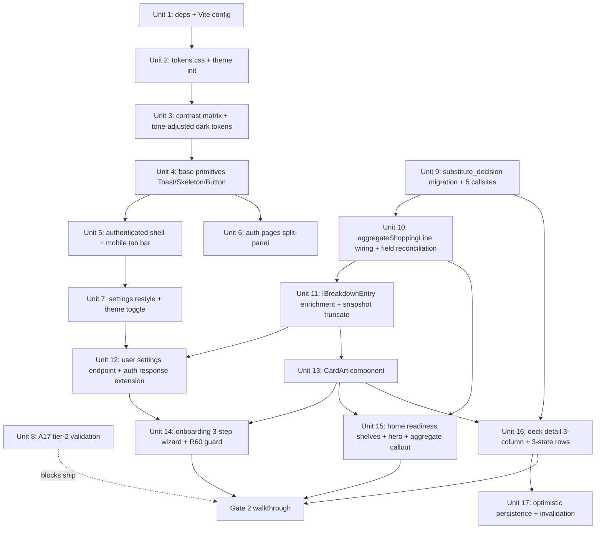

# feat: v1 Foundation + Core Experience + A17 (Plan A)

## Overview

Plan A lands (a) the locked visual system (tokens + typography + Radix + CSS Modules), (b) the backend data foundation needed to render real cards and power the new substitution decision model, and (c) the three primary surfaces Gate 2 testers exercise (onboarding wizard → home readiness shelves → deck detail 3-column).

Ship ordering: **Foundation tokens + dark-theme contrast fixes + backend schema changes must land before any populated core surface.** Gate 2 walkthrough runs at the end of Plan A against this output; Plan B (Library + CSV Sources + Reviews) and Plan C (light theme + polish + lint-as-error) follow.

## Problem Frame

Rathe Arsenal works functionally (Phase 1a merged, variant-aware shopping line merged) but its UI is inline-styled, visually incoherent, and missing the surfaces Gate 2 requires to be self-navigable. Without a locked visual identity, a guided onboarding, and the substitution mental model made explicit, testers will hit friction before the engine's accuracy can be measured — invalidating Gate 2 as a diagnostic signal.

Cross-layer scope is deliberate: the target experience needs enriched breakdown data (pitch/cost/type) for `<CardArt>`, an explicit 3-state `substitute_decision` model, an exposed aggregate shopping line on `GET /api/decks`, and a user-settings endpoint for theme persistence. See origin §Key Decisions.

See origin: [docs/brainstorms/2026-04-19-v1-visual-identity-and-ux-requirements.md](../brainstorms/2026-04-19-v1-visual-identity-and-ux-requirements.md).

## Requirements Trace

Plan A satisfies the following origin requirements (complete list from origin §Plan Separation → Plan A):

- **Visual system:** R1–R4, R5 (dark theme + toggle + server persistence), R6–R7 (tokens, typography, wordmark, palette, radii, signature readiness treatment)
- **Technical stack:** R8–R11 (Radix UI, CSS Modules, `<CardArt>`, SVGR)
- **Shell & navigation:** R12–R15 (top bar, primary nav, auth split-panel, mobile bottom tab bar)
- **Onboarding:** R16–R19, R60 (3-step wizard + routing guard)
- **Home:** R20–R23a (readiness shelves, alternate grid, empty state, aggregate callout, differentiated hero)
- **Deck detail:** R24–R28, R61, R62, R62a (3-column, 3-state substitution rows, exact matches, not-owned list, optimistic persistence, `<CardArt>` `missing` prop, `substitute_decision` table)
- **Auth + settings:** R42–R44, R46, R45 *partial* (split-panel restyle, post-verify routing, error states, delete-account restyle, theme toggle, Settings Profile section showing **email read-only only** — display-name sub-requirement is explicitly out of v1 scope; see Scope Boundaries)
- **Card art:** R47–R49 (component + sizes + usage sites, backed by enriched `IBreakdownEntry`)
- **Responsive:** R50–R52 (parity, breakpoints, touch targets)
- **A11y:** R53 (dark-theme contrast), R54–R57 (keyboard, focus-visible, reduced-motion, landmarks)
- **Loading/error:** R59 *framework + three-core-surface coverage* (toast + skeleton primitives, burst-consolidated error toast, loading/error states on onboarding + home + deck detail; Library/Reviews/Import surfaces' loading/error states ship with their respective surfaces in Plan B/C)
- **Gate blockers:** A17 tier-2 gold-set validation (≥ 60% acceptance)

**Deferred to Plan B:** R29–R41 (Library, CSV Sources, Reviews). **Deferred to Plan C:** R5 *light theme interactive accent divergence* (dark persistence + toggle land in Plan A; light requires the `#8f6a22` base and per-surface verification), R58 (exhaustive educational empty states beyond the three core surfaces), R59 Library/Reviews/Import per-surface coverage, lint-as-error, Gate 2 revisions. **Out of v1 (not in any plan):** R45 *display-name field* — neither Plan A nor B/C adds the backend column; Settings shows email only until a future phase reintroduces it.

## Scope Boundaries

- **No Library, CSV Sources, or Reviews surfaces** — Plan B.
- **No light theme** beyond token declarations — only dark theme is tested/shipped at end of Plan A. Light-theme interactive accent divergence is Plan C.
- **No lint rule promotion** — inline `style={{}}` may exist on surfaces outside Plan A scope until Plan C.
- **No "Modify" substitution action** — v1 ships only the 3-state approve/reject/pending model; card-picker swap is Phase 1c.
- **No landing page** — `/` redirects to `/sign-in` for unauth (unchanged from current behavior).
- **No educational empty states** on Library/Reviews/CSV Sources — those surfaces don't exist yet. The three core-surface empty states (home-no-decks, deck-detail-100%-raw, onboarding-100%-congrats) do ship.
- **No display-name field** on Settings/Profile in any v1 plan (A/B/C). The Settings Profile section shows email read-only; adding a display-name column to `user` + endpoint + form is explicitly out of v1 scope. Origin R45 is partially covered (email + theme toggle + account actions); display-name reintroduction is post-v1.
- **No Discover, no historical readiness chart, no PT-BR autocomplete, no feedback learning loop** — Phase 1c/Phase 2.

## Context & Research

### Relevant Code and Patterns

**Frontend (`apps/web`)**
- Route tree: file-based TanStack Router under `apps/web/src/routes/` (flat, no subdirs beyond `_auth/`). Auth guard at `apps/web/src/routes/_auth.tsx` uses `useAuth()` → `<Navigate to="/sign-in" />` when `!user`, renders `null` while loading. R60's onboarding redirect-when-has-decks guard must follow this same in-component pattern (no TanStack Router `beforeLoad`/`loader` is in use).
- Current home: `apps/web/src/routes/_auth/home.tsx` — uses `useDecksQuery`, renders `TrackedDeckCard` / `EmptyHomeState` / `CardAutocomplete` / inline `AggregateShoppingLine`. Existing `HomeSkeleton` pattern (3 stub cards via inline `style`) mirrors grid layout — keep this approach but restyle via CSS Modules.
- QueryClient: `apps/web/src/main.tsx` (`staleTime: 30_000`, `refetchOnWindowFocus: false`). Existing query keys: `['decks']`, `['deck-detail', deckId]`. All current mutations are invalidate-only in `onSuccess` (`apps/web/src/api/re-solve.ts`, `apps/web/src/api/decks.ts`) — **no optimistic updates exist**. R61 introduces the first `onMutate` + `onError` rollback pattern; `re-solve.ts` is the reference for the `onSuccess` dual-invalidation half.
- No global CSS file, no `styles/` directory, no Radix, no SVGR today. 262 inline `style={{` occurrences in 27 files — Plan A only restyles the files it actually touches.
- Auth provider: `apps/web/src/auth/AuthProvider.tsx` — `signIn` receives `{ jwt, user }`. `IAuthContext` must be extended with `settings: { theme }` in Plan A. localStorage key for theme pre-hydration hint must be distinct from the existing `STORAGE_KEY` (`'rathe-arsenal:jwt'`) — suggest `'rathe-arsenal:theme'`.
- Package.json: React 19.0.0, Vite 6.0.3, TanStack Router 1.87.0, TanStack Query 5.62.0, Vitest 2.1.8. No Radix, no SVGR yet.

**Backend (`apps/api`)**
- Engine `IBreakdownEntry`: `packages/engine/src/readiness/types.ts` currently `{ cardIdentifier, quantity, slot }` only. Frontend mirror at `apps/web/src/api/deck-detail.ts` — **both files must change atomically** (independent type definitions, no shared package boundary). `deck_readiness_snapshot.breakdown` is `jsonb`; `TRUNCATE` during migration, re-compute populates enriched shape on next read.
- `DecksService.listForUser` (`apps/api/src/decks/decks.service.ts` lines 50–122): fetches decks + latest snapshot subquery; auto-recomputes missing snapshots via `SubstitutionService.computeAndStoreReadiness`. **Does NOT call `computeAggregate` today** — `aggregateShoppingLine` is declared on the frontend `ITrackedDeckListResponse` but never populated by the backend DTO (`apps/api/src/decks/dtos/tracked-deck-list.response.dto.ts`). Plan A wires it.
- `DecksService.getDetail` (lines 124–239): loads deck + deckCards + latest snapshot + rejectionCount via `rejected_substitute` repo; derives `path`/`fidelityPercent` at read time via `substitutionService.deriveSnapshotFields`; calls `shoppingLineService.computeForBreakdown` inline.
- `ShoppingLineService.computeAggregate` (`apps/api/src/stores/shopping-line.service.ts` lines 217–358): already implemented, returns `IShoppingLineAggregate | null`. Field is named `decksCompletable` on the API DTO (`apps/api/src/stores/dtos/shopping-line.response.dto.ts`); frontend expects `completableDecks`. Reconcile to `completableDecks` in API DTO (origin §Plan Separation → Plan A). **Note:** frontend `ITrackedDeckListResponse.aggregateShoppingLine` already carries a `kind: 'populated' | 'unscraped'` discriminant (used at `home.tsx:142` as a render guard) that `IShoppingLineAggregate` lacks — Unit 10 must add `kind` to the API DTO, not just rename the field.
- **Re-fetch redundancy:** `computeAggregate` internally re-fetches `trackedDeckRepo.find({ where: { userId } })` and re-queries latest snapshots — the same work `listForUser` already does. Running both in `Promise.all` parallelizes I/O but duplicates DB work. Acceptable at pre-launch scale; noted as a known inefficiency for Plan C optimization if Gate 2 latency becomes a concern.
- **6 real `rejected_substitute` callsites** (corrected from origin and earlier review): `DecksService.getDetail` (rejectionCount count query + **auto-recompute path at lines ~149–157 missing exclusions — symmetrical bug to listForUser**), `CollectionService.markOwned` (loads rejections before recompute, `apps/api/src/collection/collection.service.ts` line 97–100), `CollectionService.addCard` (cross-deck recompute loop, line 213–215), `ReSolveService.rejectSubstitute` (upsert + loadExclusions), `ReSolveService.resetRejections` (delete by deck), `ReSolveService.reSolveDryRun` (line ~147 calls `rejections.count()` for the `persistedCount` response field). **Both `listForUser` and `getDetail` auto-recomputes call `computeAndStoreReadiness` without exclusions today** — existing bug from Phase 1a scope; Plan A fixes both symmetrically in the same commit that migrates callsites.
- User entity (`apps/api/src/database/entities/user.entity.ts`): **no settings fields** today. `theme` + any `onboardingCompletedAt` flag are net-new columns + migration.
- `IAuthResponse` (`apps/api/src/auth/dtos/auth-response.dto.ts`): `{ jwt, user: { id, email } }`. Extend with `settings: { theme }` for first-paint rendering.
- Migration convention: `apps/api/src/database/migrations/{unix-seconds}000-{PascalCaseName}.ts`, class name `{PascalCaseName}{timestamp}`. Most recent: `1744329603000-AddStoreStockVariant.ts`. `uuid-ossp` extension already created in `InitialSchema` — do not repeat. Columns are `camelCase` (e.g., `trackedDeckId`, `cardIdentifier`).
- No `IApiResponse<T>` wrapper in this repo (company convention not adopted) — endpoints return raw typed objects. Plan A continues that convention.

### Institutional Learnings

No `docs/solutions/` directory exists in this project yet. Learnings will land inline in the plan and in origin §Key Decisions. Plan C may seed `docs/solutions/` with findings from the Gate 2 walkthrough.

### External References

External research intentionally skipped — decisions (Radix + CSS Modules + SVGR + Google Fonts + TanStack Query optimistic updates) are already locked in origin §Key Decisions. Framework docs (`@radix-ui/react-*`, `vite-plugin-svgr` v4.3.0+, TanStack Query v5 `onMutate`/`onError` rollback) are consulted during implementation, not at planning time.

## Key Technical Decisions

- **Theme initialization via synchronous `<script>` in `index.html`** — reads `localStorage['rathe-arsenal:theme']` and sets `document.documentElement.dataset.theme` before React hydrates. `AuthProvider` runs too late (post-mount) and would cause flash-of-wrong-theme. Server value from `settings` endpoint wins on next render after auth resolves.
- **Plugin order in `vite.config.ts`:** `[TanStackRouterVite(), svgr(), react()]`. SVGR must run before `react()` (transforms SVG → React before JSX processing); TanStackRouterVite stays first (generates `routeTree.gen.ts` that others reference).
- **Google Fonts via `<link rel="preconnect">` + `<link rel="stylesheet">` in `index.html` with `&display=swap`** — not CSS `@import` (render-blocking).
- **Drop `rejected_substitute` + create `substitute_decision` in one migration** — no users in production (pre-launch). Callsite migration and schema migration land in the **same commit**; no safe intermediate state exists where the table is dropped but callsites still reference it.
- **Truncate `deck_readiness_snapshot.breakdown` during `IBreakdownEntry` enrichment migration** — `breakdown` is `jsonb`; re-compute on next read populates the enriched shape (`pitch`, `cost`, `type`). No data preservation required.
- **Fix `listForUser` auto-recompute exclusion bug in the same commit as the `substitute_decision` migration** — the auto-recompute path must load decisions as an exclusion set; without this, switching from `rejected_substitute` to `substitute_decision` would silently perpetuate the bug.
- **Dark-theme contrast tokens ship BEFORE any populated core surface** (origin R53) — `--ra-fg-secondary` and body-size brass companions must be tone-adjusted and committed in the foundation track before `<CardArt>`, home shelves, or deck detail can be merged. Light-theme fixes are Plan C.
- **Optimistic-with-rollback via `onMutate`/`onError`** — first use in the codebase. Snapshot-and-restore pattern from TanStack Query v5 docs; burst consolidation via in-flight counter that batches errors into a single toast with "Retry all" (origin R61, R59).
- **Theme toggle writes both server and localStorage hint synchronously** — user clicks toggle → localStorage updated immediately (for next page load pre-hydration) → `PATCH /api/users/me/settings` fired; on server failure, toast appears but localStorage stays updated (pragmatic — cross-device sync is best-effort, flash prevention is the hard requirement).
- **Inline styles outside Plan A scope are tolerated** — 262 occurrences in 27 files; a blanket sweep is Plan C. Plan A only fully restyles the files it touches (auth pages, settings, home, deck detail, onboarding) and introduces zero NEW inline styles in new code.
- **Decisions live in `DecisionsController`; `re-solve` is deprecated to 410-Gone stubs** — Unit 9 creates `apps/api/src/decks/decisions/` as the live owner of `/api/decks/:trackedDeckId/decisions` routes. The existing `re-solve.controller.ts` endpoints (`POST /reject-substitute`, `POST /reset-rejections`, `POST /re-solve`) are kept but respond with `410 Gone` + a migration note pointing to `/decisions`. Clean separation; tab-safe during the single-commit atomic deploy (any open frontend tab gets a clear 410 instead of a 500 or 404).
- **`substitute_decision.decision` as varchar + CHECK constraint**, not a Postgres native enum. Rationale: if Phase 2 adds a third state (e.g., `modified` for R26 modify action), altering a native enum requires a migration that drops and recreates it; a varchar with `CHECK (decision IN ('approved','rejected'))` is trivially extensible by replacing the constraint.
- **JSONB `preferences` column with closed-schema DTO validation** (Unit 12) — strict allowlist at the DTO layer (`@IsIn(['dark','light'])` on `theme`; unknown keys stripped before write). Plan C adding new keys requires DTO update, not migration; this is intentional to prevent silent key-injection poisoning.
- **`IAuthContext.settings` is optional** (`settings?: { theme }`) to avoid a breaking-change sweep across every `useAuth()` consumer. The bootstrap `/auth/me` path is extended to return settings alongside user; until that lands, consumers null-check. The shell + theme toggle are the only required consumers.
- **Shopping panel mobile expand = labeled full-width sticky bar + Radix Dialog styled as bottom sheet** — not Popover (which anchors to a trigger) and not a custom drag handle (undiscoverable for one-shot Gate 2 testers). The sticky bar shows "View shopping list · R$ X" at the bottom of mobile deck-detail; tapping opens a full-viewport Dialog positioned from the bottom with `animation: slide-up`. Dismissed via X button, backdrop tap, or ESC. Discoverability wins over gesture elegance for the presencial walkthrough context.
- **`.ra-readiness-display` is reserved for `effectivePercent` values only** (the signature deck-readiness % on deck detail + deck cards). Home hero's "cards missing" count is a *count*, not a *percentage* — different semantic, different typographic treatment. The hero uses a distinct `.ra-hero-primary-stat` class (Cinzel 700, brass, large but not the Decorative weight) so the signature treatment stays reserved for what origin R7 calls "the primary % number".
- **Migration timestamp spacing = +1000ms per unit** when migrations land in the same commit. Unit 9 `ReplaceRejectedSubstituteWithDecision` at T; Unit 11 `TruncateDeckReadinessSnapshot` at T+1000; Unit 12 `AddUserSettings` at T+2000. Prevents ambiguous ordering under TypeORM's timestamp-ascending execution.
- **Error logging on theme-toggle PATCH failure** — the "localStorage stays updated on failure" pragmatic fallback stays, but the PATCH failure is logged server-side (via existing logger) and the toast explicitly names the divergence ("Saved locally — didn't reach the server. Will retry on next change."). Prevents silent permanent desync while keeping flash prevention.
- **Pre-hydration theme-init script whitelists BEFORE DOM write** — the inline IIFE in `index.html` performs the `['dark','light']` whitelist check *before* writing `document.documentElement.dataset.theme`, not after. Eliminates the XSS-via-attribute-selector path entirely even if localStorage is tampered.

## Open Questions

### Resolved During Planning

- **Q: Does `listForUser` auto-recompute load rejection exclusions today?** A: No — confirmed by repo research; this is an existing bug from Phase 1a scope. Fix in Unit 9 along with the `substitute_decision` migration.
- **Q: Where is `computeAggregate` wired today?** A: It isn't — the frontend type declares it but the backend DTO omits it. Wire in Unit 10.
- **Q: Is `IApiResponse<T>` wrapping used?** A: No — raw typed objects. Plan A follows existing convention.
- **Q: How many `rejected_substitute` callsites actually exist?** A: 5 (getDetail count, markOwned, addCard, rejectSubstitute, resetRejections) — origin's list was slightly miscategorized. Updated callsite list is in Unit 9.
- **Q: Mobile bottom tab bar item count?** A: 4 (Home · Library · Import · Reviews) per origin R15. Library and Reviews tabs navigate to `/library` and `/reviews` which don't exist yet — in Plan A the links are present but render a placeholder (see Unit 5), enabling real layout testing without shipping those features. Plan B replaces the placeholders. `/import` already exists in the current route tree and is restyled in Unit 14.

### Deferred to Implementation

- **Exact microcopy** for onboarding steps (origin §Outstanding Questions). Draft inline at Unit 14 kickoff; tune during Gate 2.
- **Final Radix primitive set** — at minimum `react-dialog`, `react-dropdown-menu`, `react-tabs`, `react-tooltip`, `react-popover`, `react-toggle-group`, `react-alert-dialog`, `react-toast`, `react-scroll-area`, `react-separator`. Confirm exact subset when wiring each consumer; a select/combobox decision (`@radix-ui/react-select` vs headless combobox) resolves at Unit 14 if needed in onboarding.
- **Exact corrected hex values** for `--ra-fg-secondary` (dark) and body-size brass companion (`--ra-accent-body`) — derive from contrast matrix at Unit 3.
- **Global `ThrottlerModule` existence** — verify at Unit 12 kickoff; if absent, register with `{ ttl: 60_000, limit: 300 }` default + per-module overrides on settings/decisions endpoints (30/min/user).
- **Step indicator visual anatomy** — Cinzel roman numerals I/II/III are locked; the specific active/inactive/completed visual states (fill color, stroke weight, separator style — diamond or hairline rule) are drafted at Unit 14 kickoff against the design-file `shell.jsx` prototype and validated visually before step-component implementation.
- **Shopping panel Path A/B/C tab affordance** (origin Polish Notes) — tabs ship in Plan A as specified; if Gate 2 surfaces comprehension problems on Path C (origin's flagged concern), revise in Plan C per the revision trigger.

## High-Level Technical Design

> *This illustrates the intended approach and is directional guidance for review, not implementation specification. The implementing agent should treat it as context, not code to reproduce.*

**Dependency graph (within Plan A):**

**Track semantics (solo-dev interleaving, not strict parallel):**
- Foundation units 1–7 front-load because every core surface depends on them.
- Backend units 8–12 can interleave with foundation (no frontend dependency between U9 and U2, for example).
- Core surface units 13–17 are the terminal convergence — they require both foundation primitives and enriched backend data.
- A17 (U8) is a parallel backend-track blocker on Gate 2 ship, not on any other unit.

## Implementation Units

### Foundation Track (Units 1–7)

---

- [ ] **Unit 1: Install dependencies + Vite plugin configuration**

**Goal:** Register `vite-plugin-svgr` and install the Radix primitive set so subsequent units can import `?react` SVG components and Radix components.

**Requirements:** R8, R11 (tooling prerequisites).

**Dependencies:** None.

**Files:**
- Modify: `apps/web/package.json` (add `@radix-ui/react-dialog`, `@radix-ui/react-dropdown-menu`, `@radix-ui/react-tabs`, `@radix-ui/react-tooltip`, `@radix-ui/react-popover`, `@radix-ui/react-toggle-group`, `@radix-ui/react-alert-dialog`, `@radix-ui/react-toast`, `@radix-ui/react-scroll-area`, `@radix-ui/react-separator`; add `vite-plugin-svgr` ≥ 4.3.0)
- Modify: `apps/web/vite.config.ts` (plugin array becomes `[TanStackRouterVite(), svgr(), react()]`)
- Modify: `apps/web/vitest.config.ts` (plugin list mirrors `vite.config.ts`; add svgr between TanStackRouterVite and react, otherwise `?react` SVG imports fail in the test runner with "unknown file extension .svg")
- Modify: `apps/web/tsconfig.json` if needed to pick up `vite-plugin-svgr/client` type declarations
- Test: none — infra-only

**Approach:**
- Install Radix primitives individually (per origin R8 — no meta-package).
- Register svgr plugin in the slot between TanStackRouterVite and react.
- Verify a hello-world SVG import (`import Foo from './foo.svg?react'`) compiles in a disposable scratch component, then delete the scratch.

**Patterns to follow:** Existing plugin registration in `apps/web/vite.config.ts`.

**Test scenarios:** Test expectation: none — dependency install + config wiring, no behavioral change. Verification lives in downstream units that actually consume the primitives.

**Verification:**
- `pnpm install` succeeds with no peer-dep warnings for Radix or svgr.
- `pnpm --filter web build` succeeds; a scratch `?react` import compiles then is reverted.

---

- [ ] **Unit 2: Design tokens + global styles + synchronous theme init**

**Goal:** Land `tokens.css` as the single source of truth for colors/type/spacing/radii/shadows/transitions, load Google Fonts, and install the synchronous theme-init script that prevents flash-of-wrong-theme.

**Requirements:** R1, R2, R4, R5 (dark theme + pre-hydration hint), R6, R7.

**Dependencies:** Unit 1.

**Files:**
- Create: `apps/web/src/styles/tokens.css` (copy + adapt `docs/design/v1/tokens.css`; dark theme only — light theme tokens included as declarations but not yet tone-corrected)
- Create: `apps/web/src/styles/global.css` (CSS reset + root selectors, imports `./tokens.css`)
- Modify: `apps/web/src/main.tsx` (import `./styles/global.css` before any component)
- Modify: `apps/web/index.html` (add Google Fonts `<link rel="preconnect">` + `<link rel="stylesheet">` with `&display=swap` for Cinzel, Cinzel Decorative, UnifrakturCook, IBM Plex Sans, JetBrains Mono; add inline `<script>` in `<head>` that reads `localStorage['rathe-arsenal:theme']` and sets `document.documentElement.dataset.theme` — defaulting to `'dark'` when absent)
- Test: `apps/web/src/styles/__tests__/theme-init.spec.ts` (unit test for the theme-init script logic extracted to a pure function)

**Approach:**
- `tokens.css` declares `:root { ... }` (dark defaults) and `[data-theme='light'] { ... }` (light overrides). Light-theme values are the raw design-file values at this stage — the light-theme tone corrections land in Plan C.
- The theme-init `<script>` is a tiny self-contained IIFE: read localStorage → **whitelist the value against `['dark','light']`** → fall back to `'dark'` on unknown/absent → set `dataset.theme` only with a whitelisted value. The whitelist check must precede any DOM write; a tampered localStorage value never reaches `dataset.theme`. It runs before React mounts.
- `global.css` imports `tokens.css` and sets `html, body` to use tokens for background/foreground/font-family. Includes minimal CSS reset (box-sizing, margin, text-rendering).

**Execution note:** Extract the localStorage-read + default logic into a pure function so the test scenarios can target it without manipulating the DOM.

**Patterns to follow:** Design-file reference only (`docs/design/v1/tokens.css`, `docs/design/v1/prototype-index.html`). Prototype uses Babel-standalone — do not copy that runtime.

**Test scenarios:**
- *Happy path:* Theme-init pure function, given `localStorage = 'dark'`, returns `'dark'`.
- *Happy path:* Given `localStorage = 'light'`, returns `'light'`.
- *Edge case:* Given `localStorage = null` (no value), returns `'dark'` (default).
- *Edge case:* Given `localStorage = 'bogus'` (unknown value), returns `'dark'` (default — whitelist known values).

**Verification:**
- `document.documentElement.dataset.theme` is set before React mounts (verify via devtools: refresh with `localStorage['rathe-arsenal:theme'] = 'light'` set, the initial paint is light with no dark-theme flash).
- All five Google Fonts load and apply (visible on the shell header once Unit 5 lands; until then, `body { font-family: var(--ra-font-body) }` in `global.css` renders IBM Plex Sans on every page).
- Browser devtools Network tab shows the font files load with `display=swap`.

---

- [ ] **Unit 3: Dark-theme contrast matrix + tone-adjusted tokens**

**Goal:** Produce the full fg/bg contrast matrix for both themes, tone-adjust the known-failing dark-theme tokens (`--ra-fg-secondary` at 3.8:1 and body-size uses of `--ra-accent` at 4.2:1), and document light-theme failures as Plan C work.

**Requirements:** R53.

**Dependencies:** Unit 2.

**Files:**
- Create: `docs/design/v1/contrast-matrix.md` (table: every `--ra-fg-*` × `--ra-bg-*` × theme, with ratio and AA pass/fail at body and large-text sizes)
- Modify: `apps/web/src/styles/tokens.css` (update `--ra-fg-secondary` in dark theme to pass AA body ≥ 4.5:1; add `--ra-accent-body` companion token at ≥ 4.5:1 on `--ra-bg-canvas` for body-size brass needs; keep `--ra-accent` at its current hex for large-text-only / decorative use)
- Test: `apps/web/src/styles/__tests__/contrast.spec.ts` (automated contrast check for the declared fg/bg pairs using a contrast-ratio utility — write a pure-function matrix and assert all dark-theme pairs at their documented usage sizes pass AA; light-theme failures are documented as `expected to fail — Plan C` skip())

**Approach:**
- Compute ratios via WCAG 2.1 luminance formula; any reputable NPM package or inline helper is fine.
- Tone-adjust `--ra-fg-secondary` by darkening or brightening to clear 4.5:1 at the required size; this is a token value change, no code change downstream.
- Introduce `--ra-accent-body` as a new token (not a rename) — existing `--ra-accent` references in future surfaces that need large-text or decorative use are preserved; body-size consumers use `--ra-accent-body`. Annotate comments in `tokens.css` to make the distinction loud.

**Patterns to follow:** WCAG 2.1 §1.4.3 contrast math. No prior tokens to follow — this is greenfield.

**Test scenarios:**
- *Happy path:* Every dark-theme fg/bg pair listed as "used at body size" in the matrix passes AA (≥ 4.5:1).
- *Happy path:* Every dark-theme fg/bg pair listed as "used at large-text size" (≥ 18pt or ≥ 14pt bold) passes AA large (≥ 3.0:1).
- *Edge case:* Light-theme failures for `--ra-accent` on parchment (`#f5f1e8`) are documented and the test that would check them is `skip()`-ed with a `Plan C` reason string.
- *Regression guard:* Any new fg/bg pair introduced in a later unit must be added to the matrix; the test fails closed when a token is used in a component that isn't in the matrix (implement via grep of `apps/web/src/**/*.css` for `color:` + `background` and diff against the matrix).

**Verification:**
- Contrast test passes in CI for every dark-theme pair.
- `docs/design/v1/contrast-matrix.md` is referenced from this plan and from origin R53.

---

- [ ] **Unit 4: Base primitives — Toast, Skeleton, Button, focus-visible**

**Goal:** Ship the toast region (with accessibility contract), skeleton placeholder, button primitive, and global `:focus-visible` treatment as the foundation every core surface consumes.

**Requirements:** R55 (focus-visible), R54 (keyboard nav baseline), R56 (reduced-motion baseline), R59 (toast accessibility contract + burst consolidation + skeleton).

**Dependencies:** Units 2, 3.

**Files:**
- Create: `apps/web/src/components/ui/Toast/Toast.tsx`, `Toast.module.css`, `ToastProvider.tsx`, `useToast.ts`, `__tests__/Toast.spec.tsx`
- Create: `apps/web/src/components/ui/Skeleton/Skeleton.tsx`, `Skeleton.module.css`, `__tests__/Skeleton.spec.tsx`
- Create: `apps/web/src/components/ui/Button/Button.tsx`, `Button.module.css`, `__tests__/Button.spec.tsx`
- Modify: `apps/web/src/styles/global.css` (add global `:focus-visible` rule: 2px brass outline + 2px transparent gap; `@media (prefers-reduced-motion: reduce) { * { transition: none !important; animation-duration: 0.01ms !important; } }`)
- Modify: `apps/web/src/main.tsx` (wrap app in `<ToastProvider>`)
- Test: see `__tests__` files above

**Approach:**
- Toast uses `@radix-ui/react-toast` primitives. `ToastProvider` exposes `useToast()` with a `show({ kind, message, retry? })` API. Implements burst consolidation: an internal counter tracks in-flight failures; when ≥ 2 failures arrive within a 500ms window, merge into a single "N changes failed — Retry all" toast (origin R59, R61). Accessibility: region is `aria-live="polite"`, timer pauses on focus/hover (Radix handles this natively via `swipeDirection` + `duration`), dismissing returns focus to trigger element (implement via `focusReturn` prop on toast close).
- Skeleton: a generic `<Skeleton width height rounded />` component with CSS-only shimmer animation (gradient + `animation: shimmer`). Respects `prefers-reduced-motion` (static gradient when reduced).
- Button: variants `primary | secondary | ghost | danger`; sizes `sm | md | lg`; props `{ variant, size, loading, disabled, leftIcon, rightIcon, children }`. Uses CSS Modules. Loading state replaces children with a spinner (respects reduced-motion). Min touch target 44×44px (R52) — enforced via CSS `min-block-size` / `min-inline-size`.
- `:focus-visible` rule uses `outline: 2px solid var(--ra-accent); outline-offset: 2px;` — this is the single-declaration pair that produces origin R55's "2 px brass outline + 2 px transparent gap". The offset property draws the outline 2px outside the element's border box; the space between element and outline shows through to whatever sits behind (the page background), which is the "transparent gap". No secondary ring or `box-shadow` layering needed. Tokenized so theme changes propagate.

**Patterns to follow:** Radix Toast docs for primitive composition. Design-file `card-art.jsx` / `auth-pages.jsx` / `shell.jsx` as visual reference only.

**Test scenarios:**
- *Happy path (Toast):* Calling `show({ kind: 'error', message: 'Saved failed' })` renders a toast with `role="status"` (Radix default for polite), dismisses after 5s.
- *Integration (Toast burst):* Calling `show` 3 times within 200ms with `kind: 'error'` renders a single consolidated toast "3 changes failed" with a "Retry all" button; clicking Retry all invokes each queued retry function.
- *Edge case (Toast):* Keyboard focus on an active toast pauses its dismiss timer; blur resumes it. Verify timer value doesn't advance while focus is in the region.
- *Edge case (Toast):* Dismissing a toast via its close button returns focus to the element that triggered the failure (requires the caller to pass a `returnFocusRef`).
- *Happy path (Skeleton):* Renders with declared width/height; shimmer animation declared in CSS applies.
- *Edge case (Skeleton):* With `prefers-reduced-motion: reduce` matched, shimmer animation is `none`.
- *Happy path (Button):* Renders each variant with distinct CSS class; `loading=true` replaces children with spinner and sets `aria-busy="true"`; `disabled=true` sets `aria-disabled` and prevents click.
- *A11y (Button):* Touch-target dimensions are ≥ 44×44px at `size='sm'` too (the smallest variant).
- *Integration (focus-visible):* Tab-navigating to a button shows the brass outline; mouse-clicking does not (default `:focus-visible` semantics).

**Verification:**
- All primitive tests pass.
- Visual smoke: render a page with one of each primitive and verify theme tokens are honored.

---

- [ ] **Unit 5: Authenticated shell restyle + mobile bottom tab bar**

**Goal:** Restyle `__root.tsx` / `_auth.tsx` into the locked shell (top bar with wordmark, primary nav, theme toggle, user menu; bottom tab bar on mobile).

**Requirements:** R3 (wordmark + logo-mark), R12, R13, R15, R50–R52.

**Dependencies:** Unit 4.

**Files:**
- Create: `apps/web/src/components/shell/AppShell.tsx`, `AppShell.module.css`, `__tests__/AppShell.spec.tsx`
- Create: `apps/web/src/components/shell/TopBar.tsx`, `TopBar.module.css`
- Create: `apps/web/src/components/shell/BottomTabBar.tsx`, `BottomTabBar.module.css`
- Create: `apps/web/src/components/shell/UserMenu.tsx`, `UserMenu.module.css` (uses `@radix-ui/react-dropdown-menu`)
- Create: `apps/web/src/components/shell/ThemeToggle.tsx`, `ThemeToggle.module.css` (uses `@radix-ui/react-toggle-group`; writes both localStorage and dispatches PATCH — PATCH wiring happens in Unit 12, Unit 5 stubs it with a TODO that Unit 12 replaces)
- Create: `apps/web/src/assets/logo-wordmark.svg` (copy from `docs/design/v1/assets/`), `apps/web/src/assets/logo-mark.svg`
- Modify: `apps/web/src/routes/__root.tsx` (remove inline styles; render `<AppShell><Outlet /></AppShell>` when authenticated path, else render auth-route shell per Unit 6)
- Modify: `apps/web/src/routes/_auth.tsx` (nothing visual — guard stays; the shell lives at `__root` or conditionally rendered based on pathname)
- Test: see `__tests__` file

**Approach:**
- Top bar: left-aligned wordmark (≥ 960px) or logo-mark (< 960px) as a `<Link to="/home">`; center-aligned primary nav (Home · Library · Import · Reviews); right-aligned theme toggle + user menu.
- The "Library" and "Reviews" nav links navigate to `/library` and `/reviews` which don't exist yet — until Plan B, these routes render a placeholder stub (see placeholder route files in this unit's file list). The placeholder uses an educational "Coming in v1" empty state (not "404") so Gate 2 testers who click them don't see broken routes.
- Bottom tab bar: visible only < 960px (CSS media query). 4 equal-width items with icon + short label; ≥ 64px wide at 320px viewport. `position: fixed; bottom: 0`. Active state = brass accent.
- Primary nav hides < 960px (replaced by bottom tab bar).
- Theme toggle: toggle-group with two buttons (sun/moon). Clicking updates `document.documentElement.dataset.theme`, writes `localStorage['rathe-arsenal:theme']`, and fires `PATCH /api/users/me/settings` (wired in Unit 12).
- User menu: dropdown with "Settings" link and "Sign out" action.
- Additionally add placeholder routes for Library and Reviews: `apps/web/src/routes/_auth/library.tsx` and `apps/web/src/routes/_auth/reviews.tsx` — each renders a styled "Coming in v1" message using `<AppShell>`.

**Patterns to follow:** Design-file `shell.jsx` as visual reference. Existing `_auth.tsx` guard pattern.

**Test scenarios:**
- *Happy path:* `<AppShell>` renders top bar + main content area; user is authenticated → nav links render.
- *Responsive:* At viewport width 959px, bottom tab bar renders; at 960px, it doesn't. (Test via `matchMedia` mock.)
- *Responsive:* At 320px, bottom tab bar items are ≥ 64px wide.
- *A11y:* Top bar is `<header>`; primary nav is `<nav aria-label="Primary">`; bottom tab bar is `<nav aria-label="Mobile primary">`; main content is in `<main>` (R57).
- *Happy path:* Theme toggle click updates `dataset.theme` on `documentElement` and writes localStorage.
- *Integration:* Clicking "Sign out" in user menu clears auth + navigates to `/sign-in` (mirrors existing AuthProvider API).
- *Placeholder routes:* Navigating to `/library` or `/reviews` renders the "Coming in v1" stub within the shell.

**Verification:**
- All tests pass.
- Visual smoke at 320 / 640 / 960 / 1280 / 1440 px — no overflow, no horizontal scroll.
- Every interactive element (wordmark link, nav links, theme toggle, user menu items) is keyboard-reachable with the brass focus ring visible.

---

- [ ] **Unit 6: Auth pages split-panel restyle**

**Goal:** Apply the split-panel layout (decoration left 40–50%, form right) to all auth routes; upgrade error states.

**Requirements:** R14, R42, R44 (error states).

**Dependencies:** Unit 4.

**Files:**
- Create: `apps/web/src/components/auth-layout/AuthLayout.tsx`, `AuthLayout.module.css` (shared split-panel wrapper)
- Modify: `apps/web/src/routes/sign-in.tsx`, `sign-up.tsx`, `forgot-password.tsx`, `reset-password.tsx`, `verify-email.tsx`, `check-your-email.tsx` (wrap current content in `<AuthLayout>`, remove inline styles, restyle errors)
- Modify: `apps/web/src/routes/__root.tsx` (conditionally render `<AuthLayout>` surface for auth routes vs. `<AppShell>` for `_auth` routes, or delegate per-route)
- Test: `apps/web/src/components/auth-layout/__tests__/AuthLayout.spec.tsx`; quick render-test updates to existing auth-route specs if any

**Approach:**
- `AuthLayout` is a two-column grid: left panel is a full-bleed deckbox SVG decoration + brand copy ("Rathe Arsenal · for Flesh and Blood enthusiasts" or similar, final copy at implementation); right panel is the form area with max-width ~420px.
- Below 720px, the decoration panel hides (`display: none`) and the form stacks vertically at full-width.
- Error states: inline error rows use `--ra-status-low` + brass stripe; rate-limit messages use a subtle banner at top of the form; invalid-credentials error lives directly under the submit button. Replace current plain-text `
` patterns.
- Post-signup/post-verify-email routes to `/onboarding` (origin R43) — this is already the current behavior; verify it still works after restyling.

**Patterns to follow:** Design-file `auth-pages.jsx` as visual reference.

**Test scenarios:**
- *Happy path:* `<AuthLayout>` renders decoration + form at ≥ 720px; hides decoration at 719px.
- *Integration:* Sign-in submit with invalid credentials renders the upgraded error pattern (not the old plain-text); the error row is keyboard-reachable (clicking tab after the error focuses the password field for retry).
- *A11y:* The decoration panel is `aria-hidden="true"` (purely decorative); the form panel has a visible heading marked `<h1>`.
- *Responsive:* Form usable at 320px viewport without horizontal scroll.

**Verification:**
- All six auth routes render cohesively in both themes.
- Tab order is correct on every auth route (heading → fields → submit → secondary link).

---

- [ ] **Unit 7: Settings restyle + theme toggle frontend wiring**

**Goal:** Restyle the settings page with sections (Profile / Theme / Account) and wire the theme toggle to update `dataset.theme` + localStorage. Backend persistence wires in Unit 12.

**Requirements:** R45, R46, R5 (client-side theme toggle).

**Dependencies:** Unit 5.

**Files:**
- Modify: `apps/web/src/routes/_auth/settings.tsx` (remove all inline styles, structure as 3 sections with CSS Module; use Unit 5's `ThemeToggle` component)
- Create: `apps/web/src/routes/_auth/settings.module.css`
- Modify: `apps/web/src/components/delete-account-modal.tsx` (restyle to match visual system; use `@radix-ui/react-alert-dialog`)
- Create: `apps/web/src/components/delete-account-modal.module.css`
- Test: update `apps/web/src/routes/_auth/__tests__/settings.spec.tsx` if exists; add `apps/web/src/components/__tests__/delete-account-modal.spec.tsx` smoke

**Approach:**
- Three sections with eyebrow headers: Profile (email displayed read-only — **display-name field is out of v1 scope per Scope Boundaries; the Profile section ships with email only**), Theme (toggle), Account (change password link, delete account trigger).
- Delete account modal: keep current gate (password + checkbox) but move to `@radix-ui/react-alert-dialog` + restyled surface.
- Theme toggle in this unit still TODOs the PATCH call; Unit 12 replaces the TODO with a real fetch.

**Patterns to follow:** Design-file `app-pages.jsx` settings section.

**Test scenarios:**
- *Happy path:* Settings page renders three sections; theme toggle click updates `dataset.theme` on the root element.
- *Integration:* Delete-account flow still works end-to-end (password validation, checkbox gate, account deletion). Regression coverage for existing behavior.
- *A11y:* Section headings use appropriate heading levels (`<h1>` for page, `<h2>` for each section).

**Verification:**
- Settings page has zero inline styles.
- Delete-account modal uses Radix primitives with proper focus trap.

---

### Backend Track (Units 8–12)

---

- [ ] **Unit 8: A17 tier-2 gold-set validation (engine hardening)**

**Goal:** Run a fresh tier-2 labeling round against ~30 tier-2 suggestions with a domain-competent labeler (not the dev). Pass threshold ≥ 60% acceptance. If A17 fails, engine constants (`TIER_2_KEYWORD_OVERLAP_WEIGHT` and related) revise before deck detail UI ships to Gate 2.

**Requirements:** A17 (origin §Plan Separation → Plan A backend track).

**Dependencies:** None (parallel backend-track work).

**Files:**
- Create: `packages/engine/validation/a17-tier-2-gold-set.md` (labeler instructions + 30 suggestions + acceptance form)
- Create: `packages/engine/validation/a17-tier-2-results.md` (filled in after labeling round; records acceptance rate + rejection reasons)
- Modify (conditional, only if A17 fails): `packages/engine/src/substitution/constants.ts` (revise tier-2 weights) + `packages/engine/src/substitution/__tests__/tier-2.spec.ts` (update expectations)

**Execution note:** Non-code deliverable primarily; code change only if labeling round fails. Labeler must be someone with FaB competency who is not the dev — use a Cúpula DT member.

**Approach:**
- Generate a batch of ~30 tier-2 suggestions from existing decks using current engine constants. Document each as (missing card, proposed proxy, engine's rationale).
- Labeler reviews each and marks Accept / Reject with reason.
- Compute acceptance rate.
- If ≥ 60%, document and move on.
- If < 60%, group rejection reasons and propose constant revisions; re-run against the same 30 suggestions; iterate until passes or constants converge.

**Patterns to follow:** Gate 4 labeling process from origin's parent doc.

**Test scenarios:**
- *Deliverable:* Acceptance rate is documented with the 30 suggestions and the labeler's decisions.
- *Conditional:* If constants are revised, existing tier-2 unit tests are updated to reflect new expected behavior (no regressions on tier-1).

**Verification:**
- `packages/engine/validation/a17-tier-2-results.md` shows ≥ 60% acceptance.
- If revisions happened, `pnpm --filter engine test` passes.
- **Ship-gate signal:** record in this plan's status that A17 passed before Gate 2 walkthrough runs.

---

- [ ] **Unit 9: `substitute_decision` migration + 5 callsite migration**

**Goal:** Drop `rejected_substitute`, create `substitute_decision` table, and atomically update all 5 callsites to read/write the new table. Fix the `listForUser` auto-recompute exclusion bug in the same commit.

**Requirements:** R62a.

**Dependencies:** None (backend-first).

**Files:**
- Create: `apps/api/src/database/migrations/{T}-ReplaceRejectedSubstituteWithDecision.ts` (drop `rejected_substitute` table + its unique index; create `substitute_decision` with `{ id, userId (uuid FK user.id cascade delete), trackedDeckId (int FK tracked_deck.id cascade delete), cardIdentifier (varchar), decision (varchar with CHECK constraint `decision IN ('approved','rejected')`), createdAt, updatedAt }`; unique index `(userId, trackedDeckId, cardIdentifier)`; lookup index `(trackedDeckId, decision)` for fast deck-level rejection filtering. Snapshot truncation is Unit 11's migration at T+1000.)
- Create: `apps/api/src/database/entities/substitute-decision.entity.ts`
- Delete: `apps/api/src/database/entities/rejected-substitute.entity.ts` (remove from `database.module.ts` entity array in the same commit — TypeORM throws on startup otherwise)
- Create: `apps/api/src/decks/decisions/decisions.service.ts`, `decisions.controller.ts`, `decisions.module.ts`, `dtos/decision.dto.ts`, `__tests__/decisions.service.spec.ts`, `__tests__/decisions.controller.spec.ts` — **DecisionsController is the live owner of `/api/decks/:trackedDeckId/decisions` routes** (the existing `re-solve.controller.ts` endpoints are deprecated to 410 stubs, see next bullet)
- Modify: `apps/api/src/decks/re-solve/re-solve.controller.ts` (**deprecate existing endpoints**: `POST /reject-substitute`, `POST /reset-rejections`, `POST /re-solve` each return `410 Gone` with a structured error payload `{ code: 'DEPRECATED', migration: 'use /api/decks/:trackedDeckId/decisions' }`. Keep the file so old frontend tabs get a clear 410 instead of a 500/404; delete in Plan C when the deprecation window is closed.)
- Modify: `apps/api/src/decks/re-solve/re-solve.service.ts` (`loadExclusions` now reads `substitute_decision` filtered to `decision='rejected'` — same return signature; other methods unchanged except for the `reSolveDryRun` count fix: replace `this.rejections.count({ where: { trackedDeckId } })` at line ~147 with `this.decisionsService.countRejected(trackedDeckId)` — without this, `reSolveDryRun` breaks after the `rejected_substitute` drop.)
- Modify: `apps/api/src/decks/decks.service.ts` (getDetail: (a) replace `rejectionCount` query against `rejected_substitute` with count of `decision='rejected'` in `substitute_decision`; (b) **also pass exclusions into the getDetail auto-recompute path** (lines ~149–157 call `computeAndStoreReadiness(deckId, userId)` with no third argument — symmetrical to the listForUser bug; fix both call sites). **listForUser**: add call to `decisionsService.loadExclusions(trackedDeckId)` before auto-recompute — LISTFORUSER BUG FIX. Both fixes land in this commit to avoid the "first deck detail view ignores decisions" regression on post-migration first read.)
- Modify: `apps/api/src/collection/collection.service.ts` (`markOwned` and `addCard`: replace `rejectedSubstituteRepo` usage with `decisionsService.loadExclusions` returning rejected identifiers only)
- Modify: `apps/api/src/decks/dtos/tracked-deck-detail.response.dto.ts` (rename `rejectionCount` → `rejectedCount` + add `approvedCount`, `pendingCount`; **also add `decisions: Array<{ cardIdentifier: string; decision: 'approved' | 'rejected' }>` field** — required by Unit 17's optimistic-update snapshot path. Without this, the optimistic `setQueryData` has no per-row decision to splice.)
- Modify: `apps/api/src/decks/decks.service.ts` `getDetail` (populate the new `decisions` array by calling `decisionsService.list(trackedDeckId)` in parallel with existing fetches)
- Modify: `apps/api/src/decks/decks.module.ts` (import `DecisionsModule`; drop `RejectedSubstituteEntity` provider)
- Modify: `apps/api/src/database/database.module.ts` (drop `RejectedSubstituteEntity` from the entity registry — forgetting this breaks API startup before any test runs)
- Modify: `apps/web/src/api/re-solve.ts` → rename file to `apps/web/src/api/decisions.ts`; rename mutation hooks to `useDecideSubstitutionMutation`, `useResetDecisionsMutation`, `useClearDeckRejectionsMutation` (the new deck-level bulk-clear; wires to the bulk DELETE endpoint described below); add `deckDetailQueryKey` dual-invalidation on all three. UI consumers updated in Unit 16/17.
- Modify: `apps/web/src/api/deck-detail.ts` (extend `IDeckDetailResponse` with `decisions: Array<{ cardIdentifier, decision }>` to mirror the API DTO change)
- Test: see `__tests__` files above; modify existing `re-solve.service.spec.ts` to target the new API

**DecisionsService method surface** (concrete):
- `list(userId, trackedDeckId): Promise<Decision[]>` — used by `getDetail` and decisions GET endpoint
- `loadExclusions(trackedDeckId): Promise<Set<string>>` — returns cardIdentifiers where `decision='rejected'`
- `countRejected(trackedDeckId): Promise<number>` — fast count for `rejectedCount` field and `reSolveDryRun.persistedCount`
- `upsert({ userId, trackedDeckId, cardIdentifier, decision }): Promise<Decision>` — single row upsert
- `resetOne(userId, trackedDeckId, cardIdentifier): Promise<void>` — single DELETE
- `clearRejections(userId, trackedDeckId): Promise<number>` — **bulk DELETE filtered to `decision='rejected'` only, preserving approvals**; returns affected row count; powers Unit 16's "Clear rejections" banner action.

**Endpoints** (DecisionsController hosts all):
- `GET /api/decks/:trackedDeckId/decisions` → list for the deck (requires owner)
- `POST /api/decks/:trackedDeckId/decisions` → upsert `{ cardIdentifier, decision }` (requires owner)
- `DELETE /api/decks/:trackedDeckId/decisions/:cardIdentifier` → reset single row to pending (requires owner)
- `DELETE /api/decks/:trackedDeckId/decisions?scope=rejections` → bulk clear rejections only (requires owner) — **closes the Unit 16 Clear-rejections gap**

**userId propagation** (finding #14): every method above takes `userId` as first param; every controller handler extracts `userId` from the JWT context (via `@CurrentUser()` decorator or equivalent) and passes it through. The service never reads the path's `trackedDeckId` without an accompanying `userId` filter; the unique index `(userId, trackedDeckId, cardIdentifier)` is the enforcement backstop.

**Ownership** (finding #10): `DecisionsService.assertOwnsDeck(userId, trackedDeckId)` runs at the top of every method — a single query against `tracked_deck` filtered by both IDs; throws `ForbiddenException` on mismatch. Read endpoints (GET) and write endpoints (POST/DELETE) route through this check identically; no split between read/write enforcement.

**`cardIdentifier` validation** (finding #22): DTO adds `@IsString() @MinLength(1) @MaxLength(128) @Matches(/^[\w\-:()'.,&\s]+$/)` — the regex covers observed FaB identifier format (letters/digits/spaces and common punctuation); adjust once catalog data constraints are verified. Rejects path-traversal, NUL-byte, and SQL-injection-style payloads.

**Execution note:** Atomic commit — migration + callsite updates + frontend data-layer rename land together; there's no safe intermediate state.

**Approach:**
- `substitute_decision` entity uses `decision` as a TypeORM `enum` column (PostgreSQL native enum `substitute_decision_kind` with values `'approved' | 'rejected'`).
- `DecisionsService.loadExclusions(trackedDeckId)` returns the `Set<string>` of card identifiers where `decision='rejected'` — this is the direct replacement for the old `loadExclusions` behavior, so exclusion semantics don't change (`pending` and `approved` both don't exclude).
- `DecisionsService.list(trackedDeckId, userId)` returns all decisions for a deck; `.upsert(input)` writes an approve/reject; `.delete(trackedDeckId, cardIdentifier)` resets to pending.
- Bulk endpoint (`POST /api/reviews/bulk`) from origin R62a is NOT in this unit — that's a Plan B surface. In Plan A, only the per-deck endpoints ship.
- `listForUser` bug fix: before the recompute loop, call `decisionsService.loadExclusions(deck.id)` and pass the exclusion set to `SubstitutionService.computeAndStoreReadiness`. Without this, the auto-recompute would compute readiness as if no decisions existed, overwriting the correct snapshot.
- Endpoint paths match origin R62a. The old reject endpoint is removed in the same commit (no client-deploy-ordering concern — web and api deploy atomically).

**Patterns to follow:** Existing `ReSolveService` structure for DI; `RejectedSubstituteEntity` for column naming; `InitialSchema.ts` for migration style.

**Test scenarios:**
- *Happy path (service):* `DecisionsService.upsert({ userId, trackedDeckId, cardIdentifier, decision: 'approved' })` inserts a row; calling again with `decision: 'rejected'` updates the same row (upsert semantics).
- *Happy path (service):* `loadExclusions` returns only `rejected`-decision identifiers, not approved or pending.
- *Happy path (service):* `resetOne` removes the row (resets to pending).
- *Happy path (service):* `clearRejections(userId, trackedDeckId)` removes all `decision='rejected'` rows for that deck AND PRESERVES all `decision='approved'` rows; returns affected count. Verify approvals survive by querying `list()` after the bulk clear.
- *Edge case (service):* `upsert` / `resetOne` / `clearRejections` with mismatched `userId` (authenticated user doesn't own the deck) throws `ForbiddenException`.
- *Integration:* After `DecksService.getDetail`, (a) `rejectedCount` matches the count of `decision='rejected'` rows; (b) `decisions` array in the response contains one entry per non-pending row.
- *Integration (listForUser bug fix):* `DecksService.listForUser` with rejected decisions recorded produces a snapshot whose effective readiness excludes the rejected proxies — seed a decision, call `listForUser`, assert readiness dropped.
- *Integration (getDetail bug fix):* Same as above but calling `getDetail` on a deck whose snapshot is missing/stale (forcing auto-recompute) — assert the recomputed snapshot excludes rejected proxies. Tests both `listForUser` and `getDetail` independently.
- *Integration (markOwned auto-recompute):* After `CollectionService.markOwned`, recompute reads rejections and excludes them — verify readiness after markOwned respects a prior rejection.
- *Error path (controller):* POST with `decision: 'pending'` (invalid value) returns 400.
- *Error path (controller):* POST/GET/DELETE targeting a deck the user doesn't own all return 403 (not just POST — test each verb independently, finding #10).
- *Error path (controller):* POST with `cardIdentifier` containing path-traversal characters (`../`), NUL byte, or exceeding 128 chars returns 400.
- *Error path (controller):* GET `/api/decks/:id/decisions` without Authorization header returns 401.
- *Deprecation:* Old `POST /decks/:id/reject-substitute` and `POST /decks/:id/reset-rejections` endpoints return 410 with `{ code: 'DEPRECATED', migration: ... }` payload.
- *Happy path (migration):* `up()` drops `rejected_substitute` (table + index) and creates `substitute_decision` with varchar+CHECK constraint; `down()` reverses; `pnpm --filter api migration:run` succeeds on a fresh DB. CHECK constraint rejects `INSERT` with `decision='modified'`.

**Verification:**
- `pnpm --filter api test` passes including new decisions tests.
- Manual smoke: reject a substitution via the new endpoint, refresh deck detail, see `rejectedCount` increment; reset it, see count decrement.
- The `listForUser` auto-recompute bug fix has a regression test.

---

- [ ] **Unit 10: Aggregate shopping line wiring + field name reconciliation**

**Goal:** Wire `ShoppingLineService.computeAggregate` into `DecksService.listForUser` so `GET /api/decks` returns `aggregateShoppingLine` populated. Reconcile field name (API DTO `decksCompletable` → `completableDecks`).

**Requirements:** R23 (aggregate callout displays on home); frontend/backend DTO alignment.

**Dependencies:** None (independent backend change).

**Files:**
- Modify: `apps/api/src/stores/dtos/shopping-line.response.dto.ts` — (a) rename `decksCompletable` → `completableDecks`; (b) **add `kind: 'populated' | 'unscraped'` discriminant** — the frontend `ITrackedDeckListResponse.aggregateShoppingLine` already carries this and `home.tsx:142` uses `agg.kind === 'unscraped'` as a render guard. Without `kind` on the DTO the field is always `undefined` and the guard silently never triggers. `kind='populated'` when store stock data is available; `kind='unscraped'` when `computeAggregate` returns a valid shape but the store hasn't been scraped in > 24h or has no stock for the user's missing cards; (c) **add `uniqueCardsMissing: number`** — unique cardIdentifier count across all tracked decks, for the Unit 15 home hero "cards missing" stat (origin R23a). Unique, not total-slots — the shopping-relevant denominator.
- Modify: `apps/api/src/stores/shopping-line.service.ts` (rename the property in the returned object; populate `kind` based on scrape freshness; aggregate `uniqueCardsMissing` across deck breakdowns — sum cardIdentifier → max quantity across decks is not needed since the field is a *unique identifier count*)
- Modify: `apps/api/src/decks/decks.service.ts` (`listForUser`: inject `ShoppingLineService`, call `computeAggregate(userId)` in parallel with the existing deck+collection fetch, attach to response DTO. **Known inefficiency**: `computeAggregate` re-fetches decks and snapshots internally; acceptable at pre-launch scale; documented in Context § as Plan C optimization candidate.)
- Modify: `apps/api/src/decks/dtos/tracked-deck-list.response.dto.ts` (add `aggregateShoppingLine: IShoppingLineAggregate | null` field)
- Modify: `apps/web/src/api/decks.ts` (confirm `ITrackedDeckListResponse.aggregateShoppingLine` shape matches the new DTO — specifically `kind` and `uniqueCardsMissing` fields)
- Modify: `apps/api/src/decks/decks.module.ts` (import `StoresModule` if not already)
- Test: modify `apps/api/src/decks/__tests__/decks.service.spec.ts` to add `listForUser` aggregate coverage; modify `apps/api/src/stores/__tests__/shopping-line.service.spec.ts` to reflect rename + new fields

**Approach:**
- `computeAggregate` is read-only — safe to call alongside the existing `listForUser` path without performance concern (it already batches snapshots).
- Run `computeAggregate` in `Promise.all` with the existing deck+collection fetches to avoid added latency.
- DTO rename is the only breaking change — grep for `decksCompletable` across both apps/api and apps/web to ensure atomicity.

**Patterns to follow:** Existing parallel-fetch pattern in `listForUser`.

**Test scenarios:**
- *Happy path:* `GET /api/decks` response now includes `aggregateShoppingLine` with the expected shape (`completableDecks`, `totalDecks`, `totalCostCents`, `storeName`, `storeSlug`).
- *Edge case:* User with zero decks → `aggregateShoppingLine` is `null`.
- *Edge case:* User with decks but no store stock available → `aggregateShoppingLine.completableDecks = 0, totalCostCents = 0`.
- *Regression:* The existing `DecksService.listForUser` behavior (returning `trackedDecks` + `collectionCardCount`) is unchanged.

**Verification:**
- `pnpm --filter api test` passes.
- Smoke test: log in locally, hit `/api/decks`, confirm `aggregateShoppingLine` field is present.

---

- [ ] **Unit 11: `IBreakdownEntry` enrichment (engine + API DTO + frontend type + truncate snapshots)**

**Goal:** Add `pitch`, `cost`, `type` fields to `IBreakdownEntry` in the engine and mirror in API/frontend types. Truncate `deck_readiness_snapshot` as part of the migration.

**Requirements:** R47 (data source), R10 (CardArt prop-driven).

**Dependencies:** None (independent backend change, but Unit 13 depends on it).

**Files:**
- Modify: `packages/engine/src/readiness/types.ts` (extend `IBreakdownEntry` with `pitch: 1 | 2 | 3 | null`, `cost: number | null`, `type: string`)
- Modify: `packages/engine/src/readiness/compute.ts` (populate new fields from the catalog lookup — catalog already returns pitch/cost/types from the FaB card dataset)
- Modify: `apps/api/src/decks/dtos/tracked-deck-detail.response.dto.ts` (mirror the new fields on the DTO `IBreakdownEntry`)
- Modify: `apps/web/src/api/deck-detail.ts` (mirror on frontend type)
- Create: `apps/api/src/database/migrations/{T+1000}-TruncateDeckReadinessSnapshot.ts` (TRUNCATE `deck_readiness_snapshot` — snapshots regenerate on next read; timestamp is Unit 9's migration timestamp + 1000ms to enforce ordering)
- Test: modify `packages/engine/src/readiness/__tests__/compute.spec.ts` to verify new fields are populated on breakdown entries. **Also update mocked `IBreakdownEntry` fixtures** in `apps/api/src/decks/__tests__/decks.service.spec.ts` and `apps/api/src/stores/__tests__/shopping-line.service.spec.ts` — TypeScript strict mode requires the new `pitch`/`cost`/`type` fields on every fixture object. Grep for `IBreakdownEntry` and `IBreakdown` across both specs; add `pitch: null, cost: null, type: 'ally'` (or contextually appropriate values) to each fixture.

**Approach:**
- Catalog already has pitch/cost/types for every identifier — the engine just needs to read them during breakdown construction.
- `type` is mapped from `types[0]` (origin R47). For dual-type cards, the primary type is fine — `<CardArt>` uses it for the type glyph only.
- `pitch` maps to 1/2/3; `null` for pitch-less cards (e.g., heroes, weapons, equipment). Origin R47 calls this out.
- Migration truncates the snapshot table — no users, disposable data. Re-compute happens automatically on next `getDetail` / `listForUser` call via the existing auto-recompute path.

**Patterns to follow:** Existing catalog-lookup pattern in `computeEffectiveReadiness`.

**Test scenarios:**
- *Happy path:* `compute` on a sample deck returns breakdown entries where attack cards have `pitch` set, weapons have `pitch: null`, and every entry has `type` populated.
- *Edge case:* An entry for a card not in the catalog (shouldn't happen, but defensively) returns `pitch: null, cost: null, type: 'unknown'` rather than throwing.
- *Regression:* Existing compute tests still pass — no behavior change for `rawPercent` / `effectivePercent` / `slot` / `quantity`.
- *Migration:* `TRUNCATE` executes; subsequent `SELECT COUNT(*) FROM deck_readiness_snapshot` is 0; calling `listForUser` repopulates.

**Verification:**
- `pnpm --filter engine test` and `pnpm --filter api test` pass.
- Smoke: after migrating + hitting a deck detail, verify the breakdown entries carry the new fields.

---

- [ ] **Unit 12: User settings endpoint + migration + auth response extension**

**Goal:** Add `theme` persistence via a new `GET/PATCH /api/users/me/settings` endpoint; extend the sign-in auth response to include `settings: { theme }`.

**Requirements:** R5 (server-persisted theme).

**Dependencies:** None (but Unit 7's theme toggle depends on this to complete server wiring).

**Files:**
- Create: `apps/api/src/database/migrations/{T+2000}-AddUserSettings.ts` (add `preferences` JSONB column to `user` with default `'{"theme":"dark"}'::jsonb`; timestamp = Unit 9's T + 2000ms)
- Modify: `apps/api/src/database/entities/user.entity.ts` (add `preferences: { theme: 'dark' | 'light' }` column — typed as a narrow TypeScript record; runtime shape enforced at DTO layer, not by TypeORM)
- Create: `apps/api/src/users/users.module.ts`, `users.service.ts`, `users.controller.ts`, `dtos/user-settings.dto.ts` (with `@IsObject()` + nested `@IsIn(['dark', 'light'])` on `theme`; validator strips unknown keys before write), `__tests__/users.service.spec.ts`, `__tests__/users.controller.spec.ts`
- Modify: `apps/api/src/auth/auth.service.ts` (sign-in response includes `settings: { theme: user.preferences?.theme ?? 'dark' }` — nullish fallback guards against null/malformed column on existing rows that somehow bypassed the column default)
- Modify: `apps/api/src/auth/dtos/auth-response.dto.ts` (add `settings: { theme }`)
- Modify: `apps/api/src/app.module.ts` (import `UsersModule`; verify global `ThrottlerModule` is registered — if not, register it with sensible defaults (e.g., 30 req/min per user on settings + decisions endpoints; 300/min globally). Origin security policy requires rate limiting on all endpoints.)
- Modify: `apps/web/src/auth/AuthContext.tsx` (extend `IAuthContext` with `settings?: { theme: 'dark' | 'light' }` — **optional** field to avoid breaking every existing `useAuth()` consumer; only the shell + ThemeToggle require it)
- Modify: `apps/web/src/auth/AuthProvider.tsx` (store `settings` in context; on sign-in, write both `dataset.theme` and `localStorage['rathe-arsenal:theme']` to match server value; extend the `/auth/me` bootstrap path to fetch settings alongside user)
- Modify: `apps/web/src/components/shell/ThemeToggle.tsx` (replace Unit 5's `// TODO(Unit12): wire PATCH /api/users/me/settings` marker with real fetch; on error, revert UI state + log the failure server-side via existing logger + show toast with explicit divergence copy: "Saved locally — didn't reach the server. Will retry on next change." — prevents silent permanent desync)
- Create: `apps/web/src/api/user-settings.ts` (fetch wrapper for GET/PATCH)
- Test: see `__tests__` files

**Approach:**
- Using a JSONB `preferences` column rather than a dedicated `theme` column gives Plan C room to add more preferences without further migrations.
- Auth response carries settings for first-paint correctness: the shell renders with the server's theme immediately after sign-in, no flicker.
- `ThemeToggle` optimistically updates locally; on PATCH failure, roll back and toast.
- Endpoint auth: existing JWT guard via `@UseGuards(AuthGuard)`.

**Patterns to follow:** Existing auth module structure; existing `AuthGuard` usage.

**Test scenarios:**
- *Happy path (service):* `GET /api/users/me/settings` returns `{ theme: 'dark' }` for a fresh user.
- *Happy path (service):* `PATCH /api/users/me/settings` with `{ theme: 'light' }` updates the user's preferences; subsequent `GET` returns `'light'`.
- *Error path:* `PATCH` with invalid theme value (`{ theme: 'neon' }`) returns 400.
- *Error path:* `PATCH` with **unknown key** (`{ theme: 'dark', isAdmin: true }`) returns 200 with the unknown key stripped from the stored JSONB — verify by reading the column after; the stored value is exactly `{ theme: 'dark' }` with no `isAdmin` key. This prevents silent JSONB key-injection poisoning as Plan C adds more keys.
- *Error path:* `GET` without auth returns 401.
- *Error path (rate limit):* Rapid-fire 40 PATCHes in a minute from the same user — after the throttle threshold, further requests return 429.
- *Edge case (null preferences):* User row with `preferences = NULL` (shouldn't happen post-migration but defensive) — sign-in response uses `?? 'dark'` fallback and does not throw a 500 leaking the stack.
- *Integration:* Sign-in response for a user with `preferences.theme='light'` returns `settings: { theme: 'light' }`.
- *Integration (frontend):* Toggle click fires PATCH; on 500 response, the toggle UI state reverts + toast with explicit divergence copy appears + the failure is logged server-side via existing logger.
- *Integration (frontend):* After a successful toggle-to-light + sign-out + sign-in on the same device with cleared localStorage, the auth response re-populates localStorage with `'light'` and the shell renders light theme on first paint.
- *Edge case (migration):* Existing users (dev's own accounts) receive `{"theme":"dark"}` via column default.

**Verification:**
- All tests pass.
- Smoke: toggle theme, refresh → server value wins, no flash.
- Smoke: toggle theme, reload in a different browser → server value propagates.

---

### Core Surfaces Track (Units 13–17)

---

- [ ] **Unit 13: `<CardArt>` component**

**Goal:** Ship the reusable `<CardArt>` React component (SVG card face, prop-driven, `missing` overlay) in four sizes (`xs` / `sm` / `md` / `lg`).

**Requirements:** R10, R47–R49.

**Dependencies:** Unit 4 (primitives), Unit 11 (enriched breakdown data available to consumers).

**Files:**
- Create: `apps/web/src/components/card-art/CardArt.tsx`, `CardArt.module.css`, `__tests__/CardArt.spec.tsx`
- Create: `apps/web/src/components/card-art/glyphs/` (one SVG per card type — attack, defense, instant, equipment, ally, weapon, hero; deckbox fallback for unknown; imported via `?react`)
- Create: `apps/web/src/components/card-art/hatch-pattern.svg` (diagonal stripe pattern for `missing` overlay)

**Approach:**
- Props: `{ name, pitch, cost, type, missing, size }` per R48. `missing: true` triggers the hatch overlay + reduced opacity — specifically matching the prototype's `missing` semantics (origin R48 corrects the earlier `owned` inversion).
- Size map: `xs: 40px`, `sm: 72px`, `md: 120px`, `lg: 200px` (origin R48).
- Pitch-colored frame: R (red) `#c42d2d`-ish, Y (yellow) `#e8c040`-ish, B (blue) `#2a6db2`-ish, colorless (`pitch: null` for equipment/weapon/hero) → brass/neutral frame. Final values tokenized in Unit 2.
- Cost diamond top-left; pitch pip top-right; name band Cinzel 600 (centered, may truncate at xs/sm).
- Type glyph rendered from the imported SVG matching `type` prop; fallback to deckbox SVG for unknown types.
- Missing overlay: SVG `<pattern>` with diagonal stripes + reduced parent opacity (origin R48 is explicit that this should NOT look like an error treatment; just "not in collection").

**Patterns to follow:** Design-file `card-art.jsx` as visual reference (React + Babel-standalone prototype — do not copy the runtime).

**Test scenarios:**
- *Happy path:* Rendering `<CardArt name="Sonata Arbalest" pitch={2} cost={3} type="weapon" missing={false} size="md" />` produces an SVG with the expected structural children (frame, cost diamond, pitch pip, name band, weapon glyph).
- *Happy path:* `missing={true}` adds the hatch overlay element and reduces opacity.
- *Happy path (size):* Each size (`xs` / `sm` / `md` / `lg`) produces the corresponding pixel dimensions.
- *Edge case:* `pitch={null}` renders a colorless (brass) frame and no pitch pip.
- *Edge case:* `cost={null}` renders no cost diamond.
- *Edge case:* Unknown `type` (`type="foo"`) renders the deckbox fallback glyph.
- *Edge case:* Long card names at `xs` size truncate with ellipsis (CSS `text-overflow`).
- *A11y:* SVG has `role="img"` and `aria-label={name}`.

**Verification:**
- All tests pass.
- Visual smoke: render a grid of CardArts at all four sizes with varying pitch / type / missing combos; every combination looks coherent.

---

- [ ] **Unit 14: Onboarding 3-step wizard + R60 routing guard**

**Goal:** Replace the current bare `/onboarding` route with the 3-step wizard (paste URL → confirm library → first substitution review) with skip, loading, and 100%-readiness fallback states. Add the returning-user routing guard.

**Requirements:** R16–R19, R60.

**Dependencies:** Units 4 (primitives), 12 (settings for theme), 13 (CardArt for previews), 9 (substitute_decision endpoint for step 3).

**Files:**
- Modify: `apps/web/src/routes/_auth/onboarding.tsx` (replace current content with `<OnboardingWizard />`; add R60 guard — if `useDecksQuery` returns non-empty `trackedDecks`, `<Navigate to="/import" />`)
- Create: `apps/web/src/components/onboarding/OnboardingWizard.tsx`, `OnboardingWizard.module.css`, `__tests__/OnboardingWizard.spec.tsx`
- Create: `apps/web/src/components/onboarding/Step1PasteUrl.tsx`, `.module.css`
- Create: `apps/web/src/components/onboarding/Step2ConfirmLibrary.tsx`, `.module.css`
- Create: `apps/web/src/components/onboarding/Step3FirstReview.tsx`, `.module.css`
- Create: `apps/web/src/components/onboarding/CongratsAllPlayable.tsx`, `.module.css`
- Create: `apps/web/src/components/onboarding/StepIndicator.tsx`, `.module.css` (roman numerals I/II/III with diamond separators per origin Polish Notes)
- Delete: `apps/web/src/components/onboarding-form.tsx` (superseded)

**Approach:**
- Wizard maintains internal state: `{ step: 1 | 2 | 3, urls: string[], importedDecks: TrackedDeck[], decisions: Decision[] }`.
- Step 1 paste URL form: inline validation for invalid URL format (instant), unreachable URL (after 5s timeout using `AbortController`), private deck (from backend error code), non-FaB deck (from backend error code). Skip button always visible.
- Step 2: fetches the just-imported decks via `useDecksQuery`, renders a preview grid per deck using `<CardArt size="md">`. Inline autocomplete for adding loose cards (can reuse existing `CardAutocomplete`, restyled).
- Step 3: fetches 1–3 pending substitutions across imported decks via the new decisions endpoint (Unit 9). Renders each with Approve / Reject / Reset controls (same row component as Unit 16). Loading state: `<Skeleton>` + "Computing your first substitutions…" copy; 10s timeout → "Continue without review" fallback. **"Continue without review" routes to `/home`** (treats the timeout identically to an explicit skip — the imported decks are preserved, the user lands on the populated home; no completion-state flag is written since Plan A has no `onboardingCompletedAt` column).
- 100%-readiness fallback: when all imported decks have raw readiness = 100% and no substitutions exist, step 3 is replaced in-place by `<CongratsAllPlayable />` (step indicator shows III as complete, single "Go to my decks" CTA routes to `/home`).
- Skip on any step routes to `/home` preserving any imported decks.
- R60 guard: in `onboarding.tsx`, while `useDecksQuery` is loading, render `null` (matches the existing `_auth.tsx` pattern — prevents a flash of wizard content for returning users on slow networks). After resolve, if `trackedDecks.length > 0`, `<Navigate to="/import" replace />`. The guard deliberately catches the mid-wizard re-entry case too: a user who completed step 1 (imported decks), navigated away, and then returned to `/onboarding` is redirected to `/import` rather than resuming the wizard. This is an intentional block — v1 has no in-progress-onboarding state persistence; re-entry simply routes to the plain Import page.

**Patterns to follow:** Existing `_auth.tsx` guard logic for in-component redirect.

**Test scenarios:**
- *Happy path:* Fresh user (0 tracked decks) lands on step 1; pastes a valid URL; backend import succeeds; progresses to step 2 with decks populated; confirms; step 3 renders 1 pending substitution; approves it; lands on `/home`.
- *Happy path (skip):* At step 2, clicking Skip navigates to `/home` without visiting step 3.
- *Edge case (invalid URL):* Step 1 with `"not a url"` shows inline format error immediately.
- *Edge case (unreachable URL):* Step 1 with a valid URL that backend times out on shows the specific unreachable message after 5s.
- *Edge case (private deck):* Step 1 with a private Fabrary deck shows the specific private-deck copy.
- *Edge case (100% readiness):* User imports a deck with raw 100% readiness → step 3 renders `<CongratsAllPlayable />` instead of the substitution review.
- *Edge case (10s computation timeout):* Step 3 with substitutions that haven't returned within 10s shows the "Continue without review" fallback.
- *Integration (R60 guard):* User with existing tracked decks navigating to `/onboarding` is redirected to `/import`.
- *A11y:* Step indicator announces progress ("Step 2 of 3") via `aria-label`.

**Verification:**
- All tests pass.
- Manual walkthrough of all three happy paths + skip paths + 100% fallback.

---

- [ ] **Unit 15: Home readiness shelves + populated hero + aggregate callout + empty state**

**Goal:** Replace the current flat deck grid with readiness shelves (Ready ≥80% / Almost 50–80% / Needs <50%), add the differentiated 3-stat hero, preserve the aggregate shopping line callout, and ship the educational empty state.

**Requirements:** R20–R23, R23a.

**Dependencies:** Units 4 (primitives), 10 (aggregate shopping line), 11 (enriched breakdown for TrackedDeckCard), 13 (CardArt).

**Files:**
- Modify: `apps/web/src/routes/_auth/home.tsx` (strip all inline styles; render `<PopulatedHomeHero>` + `<ReadinessShelves>` + `<AggregateCallout>` when decks exist, else `<EducationalEmptyState>`)
- Create: `apps/web/src/routes/_auth/home.module.css`
- Modify: `apps/web/src/components/tracked-deck-card.tsx` → split into `apps/web/src/components/home/DeckCard.tsx`, `.module.css`, `__tests__/DeckCard.spec.tsx` (restyled per origin R20 — View primary CTA, Untrack overflow at 320px)
- Create: `apps/web/src/components/home/ReadinessShelves.tsx`, `.module.css`, `__tests__/ReadinessShelves.spec.tsx`
- Create: `apps/web/src/components/home/PopulatedHomeHero.tsx`, `.module.css`, `__tests__/PopulatedHomeHero.spec.tsx`
- Create: `apps/web/src/components/home/AggregateCallout.tsx`, `.module.css`, `__tests__/AggregateCallout.spec.tsx`
- Modify: `apps/web/src/components/empty-home-state.tsx` → `apps/web/src/components/home/EducationalEmptyState.tsx`, `.module.css` (upgraded copy per origin R22, explains tracking + readiness + import CTA + skip-to-library)
- Delete: old inline `AggregateShoppingLine` component from `home.tsx`

**Approach:**
- Shelves filter by `effectivePercent` thresholds (≥80 / 50–80 / <50); **empty shelves do not render** (origin R20). When all decks fall into one shelf, only that shelf renders.
- Populated hero renders 3 differentiated stats: (1) tracked-deck count (secondary treatment), (2) average readiness (secondary), (3) cards-missing-across-decks (primary — brass signature treatment). No 3-identical-pills pattern.
- Aggregate callout reads `data.aggregateShoppingLine` (available after Unit 10); renders as a dedicated band with brass stroke + soft-bg below shelves. Hidden if `aggregateShoppingLine` is null.
- DeckCard footer actions at 320px: View primary (full-width brass CTA), Untrack in overflow `<DropdownMenu>`. At ≥ 640px, side-by-side.
- Empty state copy: educational — explains tracking, explains readiness, prominent Import CTA, "Skip to Library" secondary link (links to `/library` placeholder from Unit 5).
- Signature readiness display (`.ra-readiness-display`): Cinzel Decorative 900 tabular numerals brass — **reserved strictly for the deck card's `effectivePercent` % value and the ReadinessHero's % value on deck detail** (origin R7 is the authority). The home hero's "cards missing" count is a *count*, not a percentage — it uses a distinct `.ra-hero-primary-stat` class (Cinzel 700, brass, large — notably brass but not the Decorative weight) so the signature treatment stays semantically reserved for "the primary % number". Two different meanings (count vs. percentage) use two different typographic tokens even though both sit in the brass accent palette. Neither class appears on shelf counts or any other number elsewhere in the app.

**Patterns to follow:** Existing `home.tsx` structure (state machine: loading → error → empty → populated); existing `HomeSkeleton`.

**Test scenarios:**
- *Happy path:* Decks in multiple tiers render all three shelves with correct counts.
- *Happy path:* All decks ≥ 80% readiness → only "Ready to play" shelf renders; "Almost there" and "Needs collection" do not appear.
- *Edge case (empty):* Zero tracked decks → `<EducationalEmptyState>` renders with import CTA.
- *Edge case (loading):* Skeleton renders during `useDecksQuery` loading; respects `prefers-reduced-motion`.
- *Edge case (error):* `useDecksQuery` error → existing error UI renders with retry action (restyled).
- *Responsive (320px):* Deck card renders View as primary full-width CTA; Untrack in dropdown menu.
- *Responsive (640px):* Deck card renders View and Untrack side-by-side.
- *Integration:* Aggregate callout renders when `aggregateShoppingLine` is non-null; hidden otherwise.
- *A11y:* Each shelf is a `<section aria-labelledby={headingId}>` with an `<h2>` heading.
- *Regression:* Untrack mutation flow still works (existing `useUntrackDeckMutation`).

**Verification:**
- All tests pass.
- Visual smoke at 320 / 640 / 960 / 1280 px.
- Signature readiness display only appears on the hero + deck cards (grep CSS Modules for `ra-readiness-display` to confirm).

---

- [ ] **Unit 16: Deck detail 3-column + 3-state substitution rows**

**Goal:** Replace the current single-column deck detail with the 3-column layout (readiness hero + substitutions/matches/not-owned + sticky shopping panel). Implement the explicit 3-state substitution row (Approve / Reject / Reset) with deck-level "Modified view" banner.

**Requirements:** R24–R28, R62 (Mark owned).

**Dependencies:** Units 4, 9 (substitute_decision endpoints), 13 (CardArt), 15 (for consistency of DeckCard `View` CTA navigation).

**Files:**
- Modify: `apps/web/src/routes/_auth/decks.$deckId.tsx` (new 3-column layout using CSS Grid; strip inline styles)
- Create: `apps/web/src/routes/_auth/decks.$deckId.module.css`
- Modify: `apps/web/src/components/readiness-header.tsx` → `apps/web/src/components/deck-detail/ReadinessHero.tsx`, `.module.css` (column A: signature readiness display Cinzel Decorative 900 brass per R7; raw/subs/missing breakdown)
- Modify: `apps/web/src/components/substitution-row.tsx` → `apps/web/src/components/deck-detail/SubstitutionRow.tsx`, `.module.css`, `__tests__/SubstitutionRow.spec.tsx` (3-state: Approve ✓ / Reject ✕ / Reset ↺; red stripe + gold stripe + tier diamond + confidence bar + ◆ rationale + CardArt on both sides; "Reviewed" badge when decision is approved or rejected)
- Create: `apps/web/src/components/deck-detail/ModifiedViewBanner.tsx`, `.module.css` (renders when any decision='rejected' exists for the deck; action "Clear rejections" resets only rejections to pending, not approvals — per R26)
- Modify: `apps/web/src/components/breakdown-list.tsx` → `apps/web/src/components/deck-detail/BreakdownSections.tsx`, `.module.css` (column B: exact matches grid with CardArt `sm`, not-owned list with CardArt `xs` + Mark owned action)
- Modify: `apps/web/src/components/mark-owned-button.tsx` → `apps/web/src/components/deck-detail/MarkOwnedButton.tsx`, `.module.css`
- Modify: `apps/web/src/components/ShoppingLine.tsx` → `apps/web/src/components/deck-detail/ShoppingPanel.tsx`, `.module.css` (column C: sticky container, Path A/B/C as Radix Tabs, variant breakdown, store product links — restyle, don't rewrite the data flow)
- Modify: `apps/web/src/components/path-c-result.tsx`, `ShoppingLineVariantBreakdown.tsx`, `ShoppingLineFetchControls.tsx`, `StoreProductLink.tsx` — migrate inline styles to CSS Modules + keep behavior

**Approach:**
- Desktop ≥ 960px: 3-column CSS Grid `grid-template-columns: 1fr 2fr 1fr` (approximate — tune at implementation). Mobile < 960px: single column; shopping panel collapses to a **labeled full-width sticky bar at the bottom of the viewport** showing "View shopping list · R$ X" (the total from `shoppingLine.totalCostCents`). Tapping the bar opens a Radix Dialog styled as a bottom-anchored sheet (animation: slide up from bottom, `height: 92vh`, rounded top corners); dismissed via X button, backdrop tap, or Escape. Not Popover (anchors to a trigger element, doesn't span viewport), not a drag-handle (undiscoverable for one-shot Gate 2 testers). The sticky bar and the sheet share the same shopping-panel content component so both desktop and mobile render the same TabbedPaths/VariantBreakdown/StoreProductLinks internals.
- Substitution row 3-state: local UI state mirrors server `decision`. Actions invoke Unit 17's optimistic mutation.
- **Row state → button enabled-ness** (disambiguating the pending case): on `decision='pending'` → Approve and Reject are enabled, Reset is disabled (no-op); on `decision='approved'` → Reject and Reset enabled, Approve shows pressed/selected state; on `decision='rejected'` → Approve and Reset enabled, Reject shows pressed/selected state. Reset is only ever enabled when there is a decision to clear.
- "Modified view" banner: deck-level; renders at top of column B when any row has `decision='rejected'`. "Clear rejections" calls `useClearDeckRejectionsMutation` (Unit 9 frontend rename) → `DELETE /api/decks/:trackedDeckId/decisions?scope=rejections` → `DecisionsService.clearRejections(userId, trackedDeckId)` which bulk-deletes only `decision='rejected'` rows for the deck, preserving all approvals. Approvals on the same deck survive; the banner disappears because no rejected rows remain.
- Mark owned: calls existing `useAddCardMutation`, invalidates both `['decks']` and `['deck-detail', deckId]`; card disappears from not-owned list via invalidation refetch.
- `<aside>` landmark for shopping panel per R57.

**Patterns to follow:** Existing deck detail data flow (`useDeckDetailQuery`); existing shopping line polling pattern.

**Test scenarios:**
- *Happy path:* Render deck detail — 3 columns visible at ≥ 960px, single column at < 960px.
- *Happy path (row state):* Row with `decision='pending'` — Approve and Reject enabled, Reset disabled (no decision to clear). Clicking Approve flips UI state to `approved` with "Reviewed" badge.
- *Happy path (row state):* Row with `decision='approved'` — Approve shows pressed/selected visual state, Reject and Reset enabled.
- *Happy path (row state):* Row with `decision='rejected'` — Reject shows pressed/selected state, Approve and Reset enabled; row stripe appearance changes (slot reverts to missing).
- *Happy path (banner):* Rejecting one row causes `<ModifiedViewBanner>` to appear; approving a row does NOT cause banner to appear; "Clear rejections" bulk-deletes the rejected rows only (approvals on the same deck survive — verify by asserting approval rows still show approved state after the bulk clear); banner disappears.
- *Integration (bulk clear):* Deck with 2 approved + 3 rejected rows; click "Clear rejections" → 3 rejected rows revert to pending, 2 approved rows unchanged, banner disappears; `rejectedCount` drops to 0, `approvedCount` stays at 2.
- *Mobile shopping sheet:* At viewport width 375px, the shopping panel renders as a sticky bottom bar showing "View shopping list · R$ X". Tapping the bar opens the Dialog sheet at 92vh; backdrop tap closes it; Escape closes it; focus returns to the bar.
- *Mobile sheet a11y:* Dialog has `aria-labelledby` pointing to the "Shopping list" heading; when open, focus is trapped inside; when closed, focus returns to the bar that triggered it.
- *Edge case (empty not-owned):* Deck with raw 100% readiness shows "No substitutions needed — all playable" in column B with congrats copy per origin R58.
- *Integration (Mark owned):* Clicking Mark owned triggers invalidation; card disappears from not-owned list and readiness recomputes.
- *Responsive (< 960):* Shopping panel sticky footer bar is visible; expand gesture opens full panel.
- *A11y:* Column B substitution list uses `<ul>` with semantic roles; each row is a `<li>` with `aria-label` summarizing the substitution.
- *A11y:* Three action buttons per row have clear `aria-label` ("Approve substitution: Card X for Card Y").

**Verification:**
- All tests pass.
- Visual smoke across breakpoints + both themes (dark only validated; light tolerated until Plan C).
- Existing shopping panel polling behavior (variant fetch) unchanged — regression test suite for it still passes.

---

- [ ] **Unit 17: Optimistic persistence + TanStack Query invalidation (R61)**

**Goal:** Ship the optimistic approve/reject/reset pattern backed by `onMutate` + `onError` rollback. Wire burst consolidation through Unit 4's toast primitive. Ensure Mark owned invalidates correctly.

**Requirements:** R61, R62.

**Dependencies:** Units 4 (toast), 9 (decisions endpoints + frontend hook renames), 16 (substitution row UI that dispatches the mutations).

**Files:**
- Modify: `apps/web/src/api/re-solve.ts` → rename to `apps/web/src/api/decisions.ts` or extend with new optimistic mutations — `useDecideSubstitutionMutation` with `onMutate` (snapshot + optimistic update), `onError` (rollback + queue into toast burst counter), `onSuccess` (dual-invalidate `['decks']` + `['deck-detail', deckId]`)
- Modify: `apps/web/src/components/deck-detail/SubstitutionRow.tsx` to wire to the new mutation hook from Unit 17
- Modify: `apps/web/src/components/onboarding/Step3FirstReview.tsx` to wire to the same mutation hook
- Create: `apps/web/src/api/__tests__/decisions.optimistic.spec.ts`

**Approach:**
- `onMutate({ trackedDeckId, cardIdentifier, decision })`:
  1. `queryClient.cancelQueries(...)` for the deck-detail key.
  2. `queryClient.getQueryData(...)` → snapshot of current detail data.
  3. `queryClient.setQueryData(...)` → optimistic update: update the matching substitution row's `decision` field in place.
  4. Return the snapshot as the mutation context.
- `onError(err, vars, context)`:
  1. `queryClient.setQueryData(..., context.previous)` → rollback.
  2. Queue a retry function into the toast provider's burst counter.
  3. The provider decides whether to render a single toast or a consolidated "N changes failed" toast with "Retry all".
- `onSuccess`: invalidate both `['decks']` and `['deck-detail', deckId]` (Unit 9's hook rename pattern).
- **Polling-vs-mutation known flicker**: `cancelQueries` aborts in-flight fetches but does NOT stop the `refetchInterval` configured on `useDeckDetailQuery` for variant-fetch polling. If the polling tick fires between `onMutate` (optimistic write) and `onSuccess` (POST resolves), the polling response can briefly overwrite the optimistic data with pre-mutation server state — then `onSuccess` invalidates and the real post-mutation state lands. The user perceives a ~1s flicker. Plan A accepts this flicker (low perceived severity; bounded by the polling cadence); document in code comments so a future maintainer doesn't chase it as a bug. Plan C can pause the interval during active mutations if Gate 2 surfaces it as a problem.
- Mark owned (Unit 16 dependency): already uses existing mutation; ensure invalidation keys include `['deck-detail', deckId]` AND `['decks']` for home shelves to update.
- Burst scenario: in Step 3 of onboarding or on deck detail, if a user taps Approve on 3 subs within 200ms, the optimistic updates all apply locally; if all 3 server writes fail, a single toast "3 changes failed — Retry all" appears.

**Patterns to follow:** TanStack Query v5 `onMutate`/`onError` snapshot pattern (standard across the ecosystem; no prior art in this repo but well-documented).

**Test scenarios:**
- *Happy path:* Approve action — optimistic UI update visible before the POST resolves; after success, invalidation refetches and UI stays consistent.
- *Error path:* POST returns 500 — optimistic update rolls back to previous state; a single toast appears with retry.
- *Integration (burst):* Three rapid Approve actions in succession all apply optimistically; if all fail, a single consolidated toast with "Retry all" appears (exercises Unit 4's burst counter).
- *Integration (mixed):* Two rapid actions where one succeeds and one fails — successful one persists, failing one rolls back + gets its own toast (below the burst threshold).
- *Edge case:* Approve then Reject on the same row within 50ms — the second `onMutate` cancels the in-flight first query, snapshots the optimistic-first-state as the rollback point (so Reject's optimistic UI is based on Approve's state; if both fail, two rollbacks happen correctly).
- *A11y:* Toast's `aria-live="polite"` announces burst consolidations.
- *Verification (Mark owned):* Mark owned triggers dual invalidation — home shelves re-render with updated readiness alongside deck detail re-render.

**Verification:**
- All tests pass.
- Smoke: tap Approve × 3 rapidly with DevTools "Throttle: Offline" enabled — all 3 roll back; one consolidated toast renders.

## System-Wide Impact

- **Interaction graph:** `substitute_decision` reads affect readiness computation across 5 callsites (Unit 9). `IBreakdownEntry` enrichment touches engine + API DTO + frontend type (Unit 11 — three independent definitions must stay in sync). `aggregateShoppingLine` wiring in `listForUser` (Unit 10) changes the shape of the `/api/decks` response — frontend already declared it, so no consumer break. Auth response extension (Unit 12) changes sign-in + verify-email response shape — update `AuthProvider` atomically.
- **Error propagation:** Optimistic mutation failures roll back at the query cache layer; toast provider consolidates bursts; individual mutations still fail-fast for the user who initiated them. Deck-detail polling (existing variant-fetch `refetchInterval`) is unaffected.
- **State lifecycle risks:** `substitute_decision` migration drops `rejected_substitute`; the schema migration and the 5 service callsite updates land atomically in Unit 9. Mid-deploy inconsistency risk is zero (pre-launch; dev-only environment). `deck_readiness_snapshot` truncation in Unit 11 repopulates on next read — no data loss of record, but computed snapshots regenerate and may differ if `IBreakdownEntry` enrichment caused any subtle compute-path change (the change is additive, but verify with a spot check against a known deck).
- **API surface parity:** Raw typed objects, no `IApiResponse<T>` wrapper — plan continues existing convention. New endpoints (`/api/users/me/settings`, `/api/decks/:trackedDeckId/decisions`) follow the same pattern.
- **Integration coverage:** The interaction between `DecisionsService.loadExclusions` and `SubstitutionService.computeAndStoreReadiness` (Unit 9) must be exercised end-to-end — a service-level integration test that seeds a rejected decision, calls `listForUser`, and asserts the stored snapshot excludes the proxy (this is the bug fix test). Not unit-coverable with mocks.
- **Unchanged invariants:** Existing Fabrary import flow, variant-fetch polling, shopping line per-deck computation, store stock scraping, auth JWT rotation — none change. Existing catalog + engine compute paths unchanged except for additive `IBreakdownEntry` fields.

## Risks & Dependencies

| Risk | Likelihood | Impact | Mitigation |
|------|-----------|--------|------------|
| A17 tier-2 validation fails (< 60% acceptance) | Med | High (blocks Gate 2 ship) | Unit 8 runs in parallel with frontend work; failure triggers constant revision + re-label; solo-dev schedule absorbs 1-day delay |
| A17 passes marginally (60–65%) — testers reject engine substitutions at a similar rate during Gate 2, confounding Q3 comprehension signal | Med | Med | At marginal pass, treat Q3 responses with skepticism — if testers correctly reject subs that the labeler also rejected, that isn't comprehension failure; tabulate rejection *reasons* per tester and cross-reference with A17 rejection reasons before declaring Q3 failed. Plan C can add a tier-2 uncertainty visual signal (e.g., lower-confidence tier badge style) if needed. |
| Gate 2 "return unprompted within 7 days" has no analytics to measure | Low | Low | Measurement is manual DB inspection (new `/sign-in` or `/auth/me` calls from tester accounts) + optional self-report. Accept the measurement fragility; the behavioral signal is a soft corroboration, not a ship gate. |
| `IBreakdownEntry` enrichment misses a type-mapping edge case (dual-type card) | Low | Med (CardArt glyph wrong) | Test against the catalog's full card list in Unit 11; `type = types[0]` is documented as primary |
| Optimistic rollback bugs on rapid burst actions | Med | Med (UI shows wrong state) | Integration test for cancelQueries + snapshot-based rollback in Unit 17 |
| Light-theme tokens in Unit 2 cause accidental `[data-theme='light']` regressions | Low | Low (only dark ships in Plan A) | Explicitly document that light tokens are stubs; visual smoke only on dark |
| Mobile bottom tab bar overflows at 320px with 4 items | Low | High (Gate 2 mobile testers) | Unit 5 verification includes 320px check; touch targets explicitly tested ≥ 64px wide |
| `listForUser` auto-recompute bug fix (Unit 9) changes snapshots for existing test fixtures | Med | Low | Regression test seeds decisions + asserts correct exclusion; existing snapshot-count tests updated |
| `@radix-ui/react-select` vs combobox decision blocks onboarding | Low | Low | Onboarding Step 1 doesn't need a select; Step 2's "add loose cards" can reuse existing `CardAutocomplete` → no blocker |
| 262 inline-style sweep breaks visual smoke before Plan C | Med | Low | Plan A restyles only files it touches; untouched files keep inline styles — not a regression |
| Google Fonts CDN unavailable during dev/Gate 2 | Low | Med | `font-display: swap` ensures fallback UI renders; document fallback font stacks in `tokens.css` |

## Dependencies / Prerequisites

- **Design file:** `docs/design/v1/tokens.css` and `assets/*.svg` must exist and be treated as the binding source for token values (authoritative per origin). Do not modify without updating the origin + this plan.
- **Empty database assumption:** no users in production. If this changes before Plan A ships, the migration strategy must be re-evaluated (see origin §Key Decisions).
- **External**: Google Fonts (5 families) reachable from dev/production environments. Fallback font stacks in `tokens.css` mitigate CDN outages but don't match visual design.
- **Labeler availability (Unit 8):** A Cúpula DT member or other domain-competent non-dev labeler must be available to label ~30 suggestions within a 1–2 h session.

## Phased Delivery

**Phase 1 — Foundation (Units 1–4):** dependency install, tokens, contrast, primitives. No user-visible change until Phase 2.

**Phase 2 — Shell + Auth (Units 5–7):** shell restyle, auth pages restyle, settings restyle. User-visible but non-functional delta (same screens, new paint). Unit 7's theme toggle stubs the PATCH call.

**Phase 3 — Backend data (Units 8–12, interleaveable with Phase 2):** A17 validation, substitute_decision migration, aggregate wiring, breakdown enrichment, settings endpoint. No user-visible change (backend-only).

**Phase 4 — Core surfaces (Units 13–17):** CardArt, onboarding, home shelves, deck detail, optimistic mutations. Full user-visible delta. Unit 12's PATCH wiring completes Unit 7's TODO here.

**Gate 2 walkthrough:** runs after Phase 4 lands, against Plan A output. Revision trigger (if fires) feeds into Plan C per origin §Success Criteria.

**Plan B kickoff:** after Plan A merges. Requires Unit 9's `substitute_decision` table (Reviews cross-deck aggregate endpoint reads it) and Unit 11's `IBreakdownEntry` enrichment (Library uses CardArt).

## Documentation Plan

- **This plan + origin brainstorm** stay authoritative.
- **`docs/design/v1/contrast-matrix.md`** created in Unit 3 (new artifact referenced from R53).
- **`packages/engine/validation/a17-tier-2-gold-set.md` + `a17-tier-2-results.md`** created in Unit 8.
- **No API documentation site** in the repo today — OpenAPI spec generation is out of scope for Plan A. New endpoints (`/api/users/me/settings`, `/api/decks/:trackedDeckId/decisions`) are documented by the controller + DTO annotations + this plan.
- **README** (`README.md`) updated at end of Plan A with a short "Visual system: see `docs/design/v1/`" pointer. No full design system documentation until Plan C.

## Operational / Rollout Notes

- **Single-environment (dev) rollout** — no staging, no production. All migrations run against the dev DB.
- **Migration order and timestamps:** when Units 9, 11, and 12 migrations land in the same commit, assign timestamps at `+1000ms` intervals to enforce ordering under TypeORM's timestamp-ascending execution: `T` = Unit 9 (`ReplaceRejectedSubstituteWithDecision`), `T+1000` = Unit 11 (`TruncateDeckReadinessSnapshot`), `T+2000` = Unit 12 (`AddUserSettings`). Pick `T` at implementation time (unix-seconds * 1000 is the convention).
- **Atomic deploy — 410 stubs for tab safety:** the `/reject-substitute`, `/reset-rejections`, and `/re-solve` endpoints on `re-solve.controller.ts` stay mounted but return `410 Gone` with `{ code: 'DEPRECATED', migration: 'use /api/decks/:trackedDeckId/decisions' }`. Any open frontend tab running the old client code gets a clear 410 response instead of a 404 (table gone) or 500 (module startup failure). Deprecated stubs are removed in Plan C.
- **First-request-null after truncation:** the first `GET /api/decks` call after the Unit 11 truncation migration will see empty `deck_readiness_snapshot` rows; `computeAggregate` runs in parallel with the auto-recompute in `listForUser` (not sequential), so the aggregate reads from the empty table and returns `null` on the first request. Subsequent requests return populated aggregates once snapshots re-populate. This is expected post-migration behavior, not a bug — the dev should trigger one `listForUser` call after migration to prime snapshots before smoke-testing the home shelves.
- **Feature-flag consideration:** none. Plan A ships end-to-end; partial rollout isn't useful for a solo-dev single-environment project.
- **A17 ship gate:** `packages/engine/validation/a17-tier-2-results.md` must exist with ≥ 60% acceptance recorded before Gate 2 walkthrough is scheduled.
- **Gate 2 walkthrough scheduling:** after Phase 4 lands + A17 passes. Target ≥ 4 completers per origin §Success Criteria (3 leaves no tolerance for unanimous bar).

## Sources & References

- **Origin document:** [docs/brainstorms/2026-04-19-v1-visual-identity-and-ux-requirements.md](../brainstorms/2026-04-19-v1-visual-identity-and-ux-requirements.md)
- **Design file:** `docs/design/v1/` (tokens.css, assets/*.svg, *.jsx prototypes — reference-only per origin R9)
- **Parent requirements:** `docs/brainstorms/2026-04-08-fab-deck-readiness-flow-requirements.md` (Gate 2, Gate 4 precedents; learning-loop Phase 2 scope)
- **Prior plans:**
  - `docs/plans/2026-04-10-001-feat-phase-1a-product-core-plan.md` (Phase 1a — foundation of tracked decks + readiness)
  - `docs/plans/2026-04-11-001-feat-phase-1b-shopping-line-plan.md` (Phase 1b — shopping line Gate 2 origin)
  - `docs/plans/2026-04-13-001-feat-variant-aware-shopping-line-plan.md` (variant fetch that seeded enriched breakdown assumptions)
  - `docs/plans/2026-04-18-001-feat-phase-1c-discover-history-telemetry-plan.md` (Phase 1c — defers UX to this track; runs after Plan A)
- **Related entities:** `apps/api/src/database/entities/{rejected-substitute,deck-readiness-snapshot,tracked-deck,user,collection-card}.entity.ts`
- **External references (deferred to implementation time):** `@radix-ui/react-*` docs, `vite-plugin-svgr` v4.3.0+ release notes, TanStack Query v5 optimistic updates guide, WCAG 2.1 §1.4.3.
