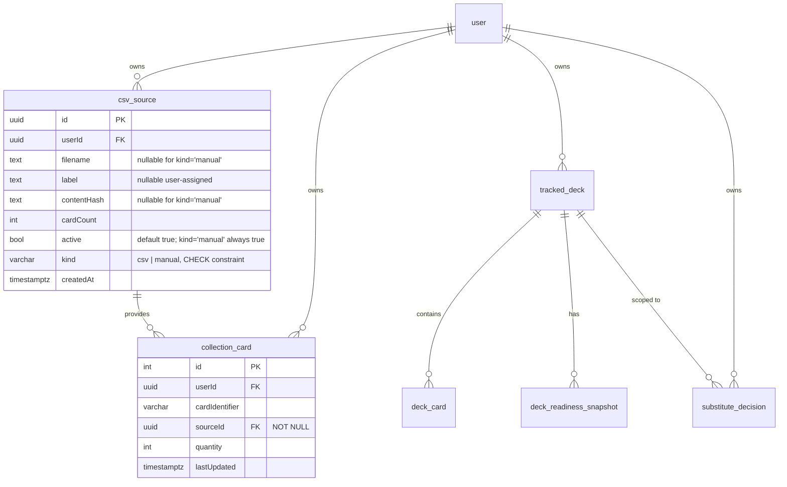

# feat: v1 Library + CSV Sources + Reviews (Plan B)

## Overview

Plan B lands the three returning-user surfaces from the v1 brainstorm:
**Library** (owned-cards primary surface, R29–R33), **CSV Sources** (sub-page
under Library for multi-source collection management with delta-import
detection, R34–R37), and **Reviews** (cross-deck substitution decision
queue, R38–R41). It also lands the backend data foundation they require —
a new `csv_source` entity, per-source membership on `collection_card`, a
cross-deck reviews aggregate endpoint, bulk decision writes, and a library
stats endpoint wired to `store_stock` for estimated value.

Plan A (completed) already delivered the visual system, Radix + CSS Modules
infra, the `<CardArt>` component with enriched breakdown data, the
`substitute_decision` table + single-row decisions API, optimistic
mutations via `onMutate`/`onError`, and the Toast/Skeleton primitives.
Plan B composes on top of those primitives — it does not introduce new
visual-system foundations.

Plan B is feature-complete v1 for returning users: Library replaces the
current home autocomplete as the canonical owned-cards surface, CSV
management becomes self-serve (with duplicate + delta-import prevention),
and cross-deck substitution review becomes a first-class task.

## Problem Frame

Today, owned-card entry happens inline on the home autocomplete and via
deck-import inventory seeding (`DecksImportService.upsertCollectionCards`,
max-wins per batch). There is no CSV import path, no way to manage
ingested sources, no way to delete or toggle a source, and no way to
review substitutions across decks without opening each deck one by one.

The origin brainstorm requires: (a) a Library page exposing the full
owned collection with filters/grouping/stats, (b) a CSV Sources sub-page
that lets the user upload CSV files, detect duplicates and deltas, toggle
sources inactive, and delete sources with a clear impact preview, (c) a
cross-deck Reviews page partitioned by decision state with bulk actions.

All three surfaces depend on the same backend refactor: `collection_card`
becomes per-source (summed across active sources, never overwritten —
R36), a new `csv_source` entity holds source metadata + content hash, and
the decisions API gains `/api/reviews` aggregate + `/api/reviews/bulk`
endpoints.

See origin: [docs/brainstorms/2026-04-19-v1-visual-identity-and-ux-requirements.md](../brainstorms/2026-04-19-v1-visual-identity-and-ux-requirements.md).

## Requirements Trace

Plan B satisfies the following origin requirements (complete list from
origin §Plan Separation → Plan B), grouped by concern:

### Library surface

- R29 — search-by-name with autocomplete using `<CardArt xs>`.
- R30 — filters: pitch, type, set.
- R31 — grouping: type (default) / pitch / set / flat.
- R32 — stats bar: unique / total copies / RYB breakdown / estimated
  value.
- R33 — replaces home autocomplete as canonical surface; "Add loose
  cards" from home links here.

### CSV Sources surface

- R34 — list of imported CSVs (filename, label, card count, import date,
  active status).
- R35 — toggle active/inactive; counts filter on active.
- R36 — explainer: duplicates across sources are summed, not
  overwritten.
- R37 — delete with two-step confirmation + impact preview.

### Reviews surface

- R38 — single page aggregating all substitutions, partitioned by
  decision state, pending prioritized.
- R39 — bulk Approve / Reject / Reset via `POST /api/reviews/bulk`.
- R40 — filters: state / tier / deck / hero / confidence range.
- R41 — empty states: no-substitutions-anywhere vs. all-pending-
  reviewed.

### Backend data model (supports all three surfaces)

- R37a — duplicate + delta-import detection via normalized SHA-256 hash
  + Jaccard similarity threshold 0.5.
- R37b — `csv_source` entity + `collection_card.sourceId` FK +
  summation across active sources.

### Cross-cutting UX patterns (scoped to Plan B's three surfaces)

- R58 — educational empty states for Library (no cards), CSV Sources
  (no imports), Reviews (all-caught-up + no-subs variants). Each ships
  with educational copy, not a bare "nothing here". Coverage on other
  surfaces remains Plan C.
- R59 — loading/error coverage for Library (skeleton grid + retry on
  fetch error), Reviews (skeleton aggregated list), CSV Sources (upload
  progress + duplicate/delta modal states). Global Toast + Skeleton
  primitives already exist from Plan A.

**Deferred to Plan C:** light theme interactive accent divergence, lint-as-
error for inline `style={{}}`, exhaustive educational empty states on
remaining surfaces, visual regression snapshot coverage, post-release
owner-driven revisions. Discover, historical readiness chart, "modify"
substitution action, PT-BR autocomplete, learning loop, Sbrauble
expansion — remain out of v1 entirely.

## Scope Boundaries

- **No Gate 2 walkthrough, no Cúpula DT tester session, no external
  labeler session** — explicitly retired per
  [docs/validation-philosophy.md](../validation-philosophy.md). Plan B
  ships with automated E2E + owner self-validation + passive telemetry
  counters; no external human gate is a release blocker.
- **No changes to the Fabrary deck-import pipeline behavior** beyond
  routing the seeded inventory into the new per-user "Manual entries"
  source. The max-wins inventory aggregation, URL dedup, and readiness
  recompute stay identical.
- **No "Modify" substitution action** (card-picker swap) — still Phase 1c.
- **No learning-loop telemetry or acceptance-rate dashboards** beyond
  raw counters — those are Phase 2 infrastructure.
- **No PT-BR card name matching** in the CSV parser — English catalog
  names + `card_alias` entries only. PT-BR remains Phase 2.
- **No set-filter on home or deck detail** — set filtering applies to
  Library only. Home/deck-detail were shipped in Plan A and are not
  touched.
- **No data migration for existing `collection_card` rows from production
  users** — pre-launch, no users exist; the migration truncates
  `collection_card` and dev re-seeds from test fixtures (see
  `docs/dev-fixtures.md`).
- **No visible `kind='manual'` source in the CSV Sources list** — the
  lazy-created "Manual entries" source is filtered out of the UI's Manage
  CSVs list; users only see `kind='csv'` sources. Its contents still
  count toward Library totals and readiness.
- **No CSV export** — v1 is import-only. Export is post-v1 (not in any
  current plan).
- **No light theme parity verification** on the new surfaces — Plan B
  ships the new surfaces using existing dark-theme tokens; Plan C does
  per-surface light-theme verification.

## Context & Research

### Relevant Code and Patterns

**Backend (`apps/api`)**
- `CollectionService` (`apps/api/src/collection/collection.service.ts`)
  owns `markOwned` and `addCard`. Current model: one row per
  `(userId, cardIdentifier)` in `collection_card`. Plan B refactors to
  per-source rows, with `library-sum` helper that joins on
  `csv_source.active=true`.
- `DecksImportService.upsertCollectionCards`
  (`apps/api/src/decks/import/decks-import.service.ts` lines 230–261)
  currently upserts into `collection_card` with max-wins. Plan B routes
  these writes to the per-user "Manual entries" source.
- `DecisionsService` (`apps/api/src/decks/decisions/decisions.service.ts`)
  from Plan A already owns all `substitute_decision` reads/writes. Plan B
  extends it with cross-deck aggregation (`listAll`) and bulk-upsert
  (`bulkUpsert`) methods, keeping the `assertOwnsDeck` guard pattern
  symmetric for every write.
- `CatalogService.search` (`apps/api/src/catalog/catalog.service.ts`)
  already returns `pitch / classes / types / ownedQuantity` — Plan B's
  Library search reuses this with an expanded result shape if needed.
- Migration convention: `apps/api/src/database/migrations/{unix-seconds}000-{PascalCaseName}.ts`,
  class name `{PascalCaseName}{timestamp}`. Most recent:
  `1776785666000-TruncateDeckReadinessSnapshotForImageUrl.ts`. Columns
  `camelCase` (e.g., `sourceId`, `contentHash`). `uuid-ossp` already
  enabled.
- Engine catalog (`packages/engine/src/catalog/types.ts`) exposes
  `pitch / cost / types / classes / subtypes / imageUrl` but **not
  `sets`**. R30's set filter requires enriching `ICatalogCard` with
  `sets: readonly string[]` populated from `@flesh-and-blood/cards`
  `setIdentifiers` (or the raw record's set field). This is a small
  engine change but must land atomically with the catalog.service mapping.
- `store_stock` (`apps/api/src/database/entities/store-stock.entity.ts`)
  carries `priceCents / quantity / productUrl` keyed by
  `(storeId, cardIdentifier)`. Library's "estimated value" (R32) joins
  on min-price across stores for the user's owned identifiers where
  `quantity > 0`. Pre-launch the only scraped store is Sbrauble.

**Frontend (`apps/web`)**
- Tokens + CSS Modules: `apps/web/src/styles/tokens.css` + `global.css` +
  Radix primitives already installed from Plan A. New surfaces follow
  the same pattern (one `.module.css` per route/component reading
  `var(--ra-*)` tokens).
- `<CardArt>` component (`apps/web/src/components/card-art/CardArt.tsx`):
  used in `xs` for the Library autocomplete dropdown + not-owned thumbs;
  `sm` for the Library grid cells and Reviews substitution rows. The
  component accepts `{ name, pitch, cost, type, missing, size, imageUrl,
  onClick }`. Library uses `missing=false` everywhere; the dimmed/hatch
  overlay stays deck-context-specific.
- `<Toast>` / `<Skeleton>` primitives in `apps/web/src/components/ui/`
  exist — Plan B reuses them; burst-consolidation pattern from Plan A
  is ready-to-use for bulk action error reporting.
- TanStack Query keys: `['decks']`, `['deck-detail', deckId]`,
  `['catalog-search', query]` (from Plan A). Plan B adds `['library']`,
  `['csv-sources']`, `['reviews', filters]` keys and wires cross-
  invalidation on relevant mutations.
- Optimistic mutation pattern: `apps/web/src/api/decisions.ts` (Plan A)
  is the template for Reviews bulk actions. The burst-consolidation
  error toast contract from Unit 4 of Plan A is the target for the
  cross-deck bulk-write error UX.
- Current `CardAutocomplete` component
  (`apps/web/src/components/card-autocomplete.tsx`) is home-surface
  specific (R33 deprecates it). Plan B does not remove it in this
  pass — it stays on `home.tsx` until a dedicated cleanup commit after
  Library ships. A banner or redirect note on the home autocomplete
  points users to Library for full management.
- Route convention: TanStack Router file-based under
  `apps/web/src/routes/_auth/`. Flat naming. Plan B adds
  `library.tsx` (already a placeholder), `library-csv-sources.tsx`
  (new), and fills `reviews.tsx` (already a placeholder). No nested
  route pattern is used in the repo today.

### Institutional Learnings

No `docs/solutions/` yet. Plan B's key learnings (multi-source summation
semantics, Jaccard-based delta detection thresholds, CSV column schema
decisions) will seed `docs/solutions/` on completion if they turn out to
be non-obvious in practice.

### External References

External research intentionally limited. Key technical choices:

- **CSV parsing library:** use `papaparse` (MIT, widely adopted, streaming
  support, robust quoting). Alternatives considered: `csv-parse` (Node-
  only, slightly better correctness on edge cases, no streaming needed at
  the scale we're at — either works). `papaparse` preferred because the
  same lib can run in Node (backend parser) and browser (client-side
  preview of parsed rows before upload if needed later).
- **Jaccard threshold (0.5):** origin doc flags this as tunable during
  Plan B. Plan B ships 0.5 as default, exposes it as a module-level
  constant (`apps/api/src/collection/csv/jaccard-threshold.ts`) for easy
  revision, logs every import decision path (exact / partial-overlap /
  new) with counts so telemetry can guide post-launch tuning.
- **SHA-256:** Node's `crypto` stdlib is sufficient. No external hash lib
  needed.

## Key Technical Decisions

- **`sourceId` NOT NULL with lazy-created per-user "Manual entries"
  source.** (Resolves origin R37a/R37b ambiguity between
  "nullable for legacy" and "NOT NULL from day one".) Pre-launch means
  no legacy rows to preserve. The migration truncates `collection_card`,
  makes `sourceId` `NOT NULL`, and the service layer lazy-creates a
  `kind='manual'`, `filename=NULL`, `label='Manual entries'` source per
  user on first non-CSV write (`markOwned`, `addCard`,
  `upsertCollectionCards` from deck import). The Manage CSVs UI filters
  out `kind='manual'` rows — only `kind='csv'` sources render. The
  manual source is non-deletable and non-toggleable (implicitly always
  active).
- **`csv_source.kind: 'csv' | 'manual'` as a varchar + CHECK** (not a
  Postgres native enum) — same rationale as Plan A's
  `substitute_decision.decision`: extensible by replacing the constraint,
  not dropping/recreating an enum type.
- **Unique index on `collection_card` becomes
  `(userId, cardIdentifier, sourceId)`.** The migration drops the
  current `(userId, cardIdentifier)` unique index and creates the
  3-column one. Same-card-across-sources is the expected state; summation
  happens at read time via `SUM(quantity)` joined on `csv_source.active=true`.
- **Library summation lives in a separate `CollectionReadService`**
  (not folded into `CollectionService`) with `loadOwned(userId,
  cardIdentifiers?)` and `countUniqueOwned(userId)`. Rationale for
  the split: every read-side consumer — `CatalogService`,
  `SubstitutionService`, `TestDeckService`, `DecksService.listForUser`,
  `LibraryService` — depends only on reads, never writes. Splitting
  the read surface into its own injectable narrows the dependency
  graph (write-side `markOwned`/`addCard` is not pulled into catalog
  or substitution), and keeps `CollectionService` focused on the
  write path. The file stays small (~60 lines: two methods + type
  wiring); the value is architectural (one read query, one
  invalidation surface) rather than defensive.
- **Readiness recompute triggers when a source is toggled or deleted.**
  Toggle and delete are cross-deck state changes — every tracked deck
  must recompute. Same loop pattern as `addCard`'s cross-deck recompute,
  with decisions loaded as exclusions per deck. Failures are logged
  non-fatally (matching existing `addCard` posture).
- **CSV parser uses `name + quantity` as the canonical input**, with
  optional `set` column for disambiguation. Name → `cardIdentifier` via
  a case-insensitive catalog name index built from `ICatalogCard.name`
  (new helper in engine or in `CatalogService`, small change). The
  existing `card_alias` table is **not** reused — it is currently scoped
  to `sourceSlug='cupula-dt'` store-scraper matching and adding a second
  `sourceSlug` for CSV uploads would blur its semantics. If a
  CSV-specific alias table is needed post-launch (because real users
  bring CSVs with idiosyncratic names), introduce it then; for v1 the
  catalog name index is sufficient. Rows that don't match any catalog
  card are skipped + surfaced in the upload response as a
  `skippedRows: [{ rowNumber, name, reason }]` list. The upload
  response renders inline in the CSV Sources page after import.
- **Content hash normalization:** SHA-256 of sorted
  `(cardIdentifier, quantity)` pairs joined with newlines. Computed
  after name resolution + skipped-row removal (so same logical content
  with different raw CSV formats hashes identically). Only rows that
  resolved to a `cardIdentifier` contribute.
- **Jaccard similarity threshold = 0.5**, calculated over the set of
  `cardIdentifier`s (not weighted by quantity). Below 0.5 → new source;
  ≥ 0.5 with different hash → partial overlap (update flow); identical
  hash → exact match. **"Tunable" means code-change + redeploy**, not
  runtime configuration — no env var, no admin panel. The value lives
  as an exported constant in
  `apps/api/src/collection/csv/jaccard-threshold.ts` so a single-line
  PR changes it. Runtime tuning via env var or DB row is explicitly
  out of v1 scope.
- **Plan B's CSV upload endpoint is a single `POST /api/collection/csv`**
  with `multipart/form-data`: `file` + optional `action` +
  optional `targetSourceId`. First call defaults to `action='auto'`
  and returns one of three discriminated response kinds: `new` →
  server creates the source inline; `exact-match` or
  `partial-overlap` → **no writes**, returned for the client to
  prompt the user. On the second call, the client re-sends the file
  together with the user's chosen action (`separate` / `replace` /
  `update` / `cancel`) and a `targetSourceId` when modifying an
  existing source. No server-side token cache, no resolve endpoint —
  the client holds the `File` reference in browser memory between
  the two calls, and a 2 MB re-upload is cheaper than the failure
  modes a token cache introduces.
- **Reviews aggregate endpoint:** `GET /api/reviews?state=pending|
  approved|rejected|all&tier=1|2|3&deckId=N&hero=X&confidenceMin=F&
  confidenceMax=F`. Returns `{ rows: IReviewRow[], counts: { pending,
  approved, rejected } }`. Default `state=pending` (origin R38 says
  pending at the top). `IReviewRow` carries `{ trackedDeckId, deckName,
  hero, cardIdentifier, suggestedCardIdentifier, tier, confidence,
  rationale, decision: 'pending' | 'approved' | 'rejected',
  suggestedCard: { name, pitch, cost, type, imageUrl },
  missingCard: { name, pitch, cost, type, imageUrl } }`.
- **Reviews default row ordering:** pending bucket sorted by `(tier DESC,
  deckName ASC, cardIdentifier ASC)` — highest-tier (most-confident)
  suggestions first so the user reviews the trustworthy suggestions
  before the tentative ones. Approved and rejected buckets sorted by
  `updatedAt DESC` (most recently reviewed first). Resolved from origin
  §Outstanding Questions (Deferred to Planning, R38–R41).
- **Bulk writes** via `POST /api/reviews/bulk` with body
  `{ operations: Array<{ trackedDeckId, cardIdentifier, decision?:
  'approved' | 'rejected', reset?: true }> }` — each operation is an
  upsert (decision present) or a delete (reset=true). The server
  validates ownership per `trackedDeckId` once (via batch query) and
  executes all writes in a single transaction. Response:
  `{ succeeded: number, failed: Array<{ trackedDeckId, cardIdentifier,
  error }> }`. Partial failure is possible (one ownership violation
  shouldn't kill the whole batch). Readiness recompute is
  **batched** — one per affected deck, de-duped, fired after the
  transaction commits, non-fatal.
- **Telemetry counters shipped inline with each feature** (no separate
  telemetry infra introduced). Log events use the existing NestJS
  `Logger` with structured payloads: `logger.log({ event:
  'csv.upload', userId, kind: 'created'|'exact-match'|'partial-overlap',
  cardCount, skippedCount })`, `logger.log({ event: 'review.bulk',
  userId, approvedCount, rejectedCount, resetCount, failedCount })`,
  etc. Post-launch, these logs are aggregated by the log pipeline
  (Railway built-in) or forwarded to a passive dashboard when needed.
  No new dependencies.
- **Log content sensitivity**: `userId` (UUID) is not considered a
  secret and is logged in plaintext — consistent with existing Plan A
  telemetry. User-supplied content (card names in `skippedRows`, CSV
  row text) is **never** logged at the event level; only counts
  (e.g., `skippedCount`) are structured fields. A row-level skipped
  detail is logged at `debug` level only, off by default in
  production.
- **Home autocomplete is removed in the same PR that ships Library**
  (Unit 8). R33 declares Library the canonical surface; leaving the
  home `CardAutocomplete` live would create two entry points for the
  same action with no defined removal trigger (Plan C is on hold).
  Pre-launch with no users, the coexistence risk is self-imposed
  friction — cut it at the same moment Library ships. The home empty
  state retains a link to Library (R33 already declares "Add loose
  cards" on home links there).

## Open Questions

### Resolved During Planning

- **Should `sourceId` be nullable or NOT NULL?** Resolved: NOT NULL
  with lazy-created per-user `kind='manual'` source. See Key Technical
  Decisions above.
- **Should the home autocomplete be removed when Library ships?**
  Resolved: yes, same PR. Pre-launch = no users to protect; coexistence
  has no defined removal trigger because Plan C is on hold.
- **Default Reviews row ordering?** Resolved: pending bucket ordered by
  `(tier DESC, deckName ASC, cardIdentifier ASC)`; approved/rejected by
  `updatedAt DESC`.
- **CSV parser library?** Resolved: `papaparse`. Single dep, Node + browser
  compatible, robust quoting.
- **Jaccard threshold?** Resolved: 0.5 as module-level constant,
  editable via code change + redeploy. Partial-overlap flow kept (R36
  summation is the default semantic; Jaccard is a UX-only prompt that
  the user can always bypass via "Import as separate copy").
- **How should the deck-import inventory seed interact with sources?**
  Resolved: writes go to the per-user `kind='manual'` source, invisible
  in Manage CSVs but contributes to totals.
- **Does Plan B need to update the engine's `ICatalogCard` for set
  filtering?** Resolved: yes, add `sets: readonly string[]` mapped from
  the raw record's `setIdentifiers`. Lands in Unit 7.
- **CSV upload — two endpoints with token cache or one endpoint
  parameterized by action?** Resolved: one endpoint. Client re-sends
  file on user action; no server-side token state. See Alternatives.
- **`CollectionReadService` separate service or method on
  `CollectionService`?** Resolved: separate. Narrows read-only
  consumers' dependency graph and keeps `CollectionService` focused
  on writes.
- **`ReviewsService` separate service or extension of
  `DecisionsService`?** Resolved: no standalone ReviewsService.
  `DecisionsService` already owns `substitute_decision`; extend it with
  `listAllForUser` + `bulkUpsert`. `ReviewsController` stays separate
  for URL-space clarity.
- **Bulk reviews transaction — partial-failure or all-or-nothing?**
  Resolved: all-or-nothing, mitigated by comprehensive pre-validation,
  a 200-op cap, and structured failure response. Savepoints deferred
  to Phase 2 if telemetry shows the tx-abort signal is non-zero.
- **Does Plan B include a CI-blocking E2E test for the full user
  journey?** Resolved: yes — Unit 11 ships a supertest spec covering
  sign-up → CSV upload → deck import → reviews bulk → readiness
  assertion. Playwright UI-layer E2E remains Plan C.
- **`estimatedValueCents` staleness handling — ship with freshness
  indicator or defer?** Resolved: ship with a "Atualizado há N dias"
  sub-label that switches to ember color + `◆` glyph when > 3 days.
  `priceDataLastUpdatedAt` added to the Library stats DTO.

### Deferred to Implementation

- **Exact column mapping for Fabrary-exported CSV** (if any user brings
  one) — the parser accepts `name + quantity` plus optional `set`;
  Fabrary may export with different column names. Add an alias map at
  implementation time based on real files the owner has. Not a planning-
  time question.
- **Cap on quantity per row / per user** after multi-source summation —
  current code caps at `MAX_COLLECTION_QUANTITY = 20`. With
  summation-at-read-time, that cap needs to shift from per-row to
  per-effective-sum at `markOwned` and `addCard` write-time. Exact
  implementation (pre-write summation query vs. post-write rollback) is
  an implementation choice; behavior is unchanged from user perspective.
- **Readiness recompute batching on source toggle/delete** — when the
  user toggles a large source inactive, every deck that references any
  of that source's cards must recompute. Synchronous recompute blocks
  the toggle request; async (queue-based) is Phase 2 infra. Plan B does
  synchronous per-deck recompute in a loop with non-fatal failure
  handling, matching `addCard`'s current posture. If self-validation
  shows > 1 s latency on toggle, the implementation may short-circuit
  to a "readiness is stale, refresh home to recompute" UX — decided at
  implementation time.
- **Library virtual-scrolling threshold** — for users with 500+ unique
  cards, the grid may need windowing. Decide at implementation time
  based on measured DOM weight of `<CardArt sm>` cells.
- **Reviews filter query-string shape** — URL-encoded filters vs. POST
  body. URL-encoded is preferred for shareable links but may hit URL
  length limits with many deck IDs. Implementation decides.

## High-Level Technical Design

> *This illustrates the intended approach and is directional guidance for
> review, not implementation specification. The implementing agent should
> treat it as context, not code to reproduce.*

### Data model after Plan B



Key relationships:
- One `user` has N `csv_source` rows: at most one with `kind='manual'`,
  zero-or-more with `kind='csv'`.
- One `collection_card` row belongs to exactly one `csv_source`.
- Library effective quantity per card = `SUM(quantity)` across active
  sources.
- Readiness computation reads effective quantity (not per-row), so a
  source toggle automatically changes readiness without per-card updates.

### CSV upload flow

```mermaid
sequenceDiagram
    actor User
    participant FE as Frontend (CSV Sources page)
    participant API as POST /api/collection/csv
    participant Parse as CsvParserService
    participant Match as DuplicateDetectionService

    User->>FE: Select CSV + Upload
    FE->>API: multipart/form-data
    API->>Parse: parseRows(file)
    Parse-->>API: { resolved: [...], skipped: [...] }
    API->>API: computeHash(resolved)
    API->>Match: detect(userId, resolvedSet, hash)

    alt exact match (action='auto')
      Match-->>API: { kind: 'exact-match', existingSourceId }
      API-->>FE: 200 { kind: 'exact-match', existingSourceId, existingLabel }
      FE->>User: show "already imported" modal
      User->>FE: picks action (replace / separate / cancel)
      FE->>API: re-POST file + action + targetSourceId
    else partial overlap, Jaccard >= 0.5 (action='auto')
      Match-->>API: { kind: 'partial-overlap', existingSourceId, delta }
      API-->>FE: 200 { kind: 'partial-overlap', existingSourceId, delta }
      FE->>User: show update/replace/separate modal with diff preview
      User->>FE: picks action
      FE->>API: re-POST file + action + targetSourceId
    else new source, Jaccard < 0.5 (action='auto')
      Match-->>API: { kind: 'new' }
      API->>API: create csv_source + collection_card rows in tx
      API-->>FE: 200 { kind: 'created', sourceId, cardCount, skippedRows }
      FE->>User: success toast + navigate to sources list
    end

    Note over FE,API: No token cache. Client re-sends the file with<br/>the chosen action; server validates targetSourceId ownership.
```

### Reviews flow (cross-deck)

The Reviews page is a thin consumer of one aggregate endpoint
(`GET /api/reviews`) and one write endpoint (`POST /api/reviews/bulk`).
No optimistic updates for bulk actions in v1 — the cross-deck state
mutation is too broad to reliably mirror client-side; refetch after
commit keeps the UX simple. **Single-row approve/reject/reset on the
Reviews page issues `POST /api/reviews/bulk` with `operations.length =
1`** (unified code path), NOT the per-deck
`/api/decks/:id/decisions` endpoints — the per-deck endpoints remain
live for the deck-detail page (with Plan A optimistic updates), but
the Reviews page's row actions go through the bulk surface to keep
invalidation and error handling uniform across row and bulk actions.

## Implementation Units

### Track A — Backend data refactor (CSV + multi-source collection)

- [ ] **Unit 1: `csv_source` entity + migration (schema foundation)**

**Goal:** Create the `csv_source` table, add `sourceId` FK to
`collection_card`, drop the old unique index, add the new 3-column unique
index, truncate `collection_card` (pre-launch, no users), and register
the entity in the TypeORM dataSource.

**Requirements:** R37b.

**Dependencies:** None.

**Files:**
- Create: `apps/api/src/database/migrations/{timestamp}000-AddCsvSourceAndCollectionCardSourceId.ts`
- Create: `apps/api/src/database/entities/csv-source.entity.ts`
- Modify: `apps/api/src/database/entities/collection-card.entity.ts` (add `sourceId`, FK relation, drop old unique index in favor of 3-column index)
- Modify: `apps/api/src/database/entities/index.ts` (export new entity)
- Modify: `apps/api/src/database/database.module.ts` (register `CsvSourceEntity` in the explicit entities array — this module keeps its own list independent of the datasource glob; every prior entity addition follows this pattern)
- Modify: `apps/api/src/app.module.ts` (register entity in `TypeOrmModule.forFeature` wherever collection entities live today)

**Approach:**
- Single migration: create `csv_source` table with `{ id uuid pk, userId
  uuid fk, filename text null, label text null, contentHash text null,
  cardCount int default 0, active bool default true, kind varchar(16)
  CHECK (kind IN ('csv','manual')), createdAt timestamptz default now() }`.
  Unique index on `(userId, kind)` partial `WHERE kind='manual'` (one
  manual source per user). Unique index on `(userId, contentHash) WHERE
  kind='csv' AND contentHash IS NOT NULL` (prevents exact-match duplicates
  at DB level — service layer is primary enforcement).
- `TRUNCATE collection_card` (pre-launch, disposable).
- Drop `UQ_collection_card_user_card` index; add
  `(userId, cardIdentifier, sourceId)` unique index.
- Add `sourceId uuid NOT NULL` with FK to `csv_source(id) ON DELETE
  CASCADE`.
- Migration `down()` reverses: drop `sourceId`, restore old index, drop
  `csv_source`. Pre-launch acceptable — no data lost on rollback.

**Execution note:** Lands atomically with Unit 2 (service-layer
source-awareness) in the same commit — the migration alone leaves the
service layer broken. Land as a single PR. **Dev-only risk**:
`database.module.ts` has `synchronize: true` in development
(line 47); the entity decorator for `CollectionCardEntity.sourceId`
must be added **after** the migration has run locally at least once,
or set `synchronize: false` temporarily during migration dev. The
migration itself is idempotent; the foot-gun is letting TypeORM
auto-sync a half-declared column before the explicit migration runs.

**Technical design:** *(directional guidance, not implementation spec)*

```sql
-- Migration pseudo-SQL, not literal:
CREATE TABLE csv_source (
  id uuid PRIMARY KEY DEFAULT uuid_generate_v4(),
  user_id uuid NOT NULL REFERENCES "user"(id) ON DELETE CASCADE,
  filename text,
  label text,
  content_hash text,
  card_count int DEFAULT 0,
  active bool DEFAULT true,
  kind varchar(16) NOT NULL CHECK (kind IN ('csv','manual')),
  created_at timestamptz DEFAULT now()
);
CREATE UNIQUE INDEX csv_source_user_manual_uq ON csv_source (user_id)
  WHERE kind='manual';
CREATE UNIQUE INDEX csv_source_user_content_hash_uq ON csv_source
  (user_id, content_hash) WHERE kind='csv' AND content_hash IS NOT NULL;

TRUNCATE collection_card;
ALTER TABLE collection_card
  ADD COLUMN source_id uuid NOT NULL REFERENCES csv_source(id) ON DELETE CASCADE;
DROP INDEX "UQ_collection_card_user_card";
CREATE UNIQUE INDEX collection_card_user_card_source_uq ON collection_card
  (user_id, card_identifier, source_id);
```

**Patterns to follow:**
- `apps/api/src/database/migrations/1776621085000-ReplaceRejectedSubstituteWithDecision.ts` — same atomic schema-change pattern used in Plan A.
- `apps/api/src/database/entities/substitute-decision.entity.ts` — entity layout with `@Index` unique, `@Column CHECK`-like varchar, FK relation + JoinColumn.

**Test scenarios:**
- Integration: migration runs cleanly against a fresh DB (TypeORM `migrate:run` exits 0).
- Integration: `down()` reverses the migration without leaving orphan columns or indexes.
- Happy path: inserting a `kind='manual'` row, then attempting a second `kind='manual'` for the same user throws a unique-constraint violation.
- Happy path: inserting two `kind='csv'` rows with different `contentHash` for the same user succeeds; inserting a second with the same hash throws.
- Integration: `collection_card` rejects insert when `sourceId` is missing or references a non-existent source.

**Verification:**
- Migration applies + reverses cleanly in local dev + CI.
- `pnpm --filter @rathe-arsenal/api test` remains green for non-collection test suites (collection tests update in Unit 2).

---

- [ ] **Unit 2: `CollectionService` source-awareness refactor**

**Goal:** Make `markOwned`, `addCard`, and the deck-import inventory seed
write to a lazy-created per-user `kind='manual'` source. Introduce a
`CollectionReadService.loadOwned(userId, cardIdentifiers?)` helper that
sums across active sources and becomes the single read path.

**Requirements:** R37a (summation semantics), R37b.

**Dependencies:** Unit 1.

**Files:**
- Create: `apps/api/src/collection/sources/sources.service.ts` (owns `csv_source` reads/writes + lazy-create helper `ensureManualSource(userId, manager?: EntityManager)`)
- Create: `apps/api/src/collection/collection-read.service.ts` (the shared `loadOwned` summation)
- Modify: `apps/api/src/collection/collection.service.ts` (`markOwned`, `addCard` route writes via `sourcesService.ensureManualSource`)
- Modify: `apps/api/src/collection/collection.module.ts` (register new services)
- Modify: `apps/api/src/catalog/catalog.service.ts` (`loadOwnedQuantities` delegates to `CollectionReadService`)
- Modify: `apps/api/src/substitution/substitution.service.ts` (lines 109–124 `runReadiness` reads raw `collectionCards.find` — route through `CollectionReadService.loadOwned` so the inventory map is summed across active sources instead of overwritten by last-write-wins on duplicate `cardIdentifier`s)
- Modify: `apps/api/src/decks/decks.service.ts` (line 55 `collectionCardRepo.count({ where: { userId } })` now counts one row per `(card × source)` — change to `CollectionReadService.countUniqueOwned(userId)` so the home empty-state number remains "unique cards owned", not "rows")
- Modify: `apps/api/src/decks/test/test-deck.service.ts` (line 188 has the same raw `collectionCardRepo.find` pattern as `SubstitutionService` — route through `CollectionReadService.loadOwned`)
- Modify: `apps/api/src/decks/import/decks-import.service.ts` (`upsertCollectionCards` writes to the manual source. **Critical**: the existing `findOne({ userId, cardIdentifier })` at line 240 must become `findOne({ userId, cardIdentifier, sourceId: manualSourceId })` after Plan B, or it will find and max-wins-overwrite the first matching row across any source — corrupting CSV source rows. The function must also accept the `EntityManager` from the outer transaction so the manual-source find-or-create participates in the same tx.)
- Modify: `apps/api/src/catalog/catalog.module.ts` (import `CollectionModule` or expose `CollectionReadService` so catalog.service.ts can inject it)
- Test: `apps/api/src/collection/__tests__/collection.service.spec.ts` (update existing tests)
- Test: `apps/api/src/collection/__tests__/collection-read.service.spec.ts` (new)
- Test: `apps/api/src/collection/__tests__/sources.service.spec.ts` (new)
- Test: `apps/api/src/substitution/__tests__/substitution.service.spec.ts` (update — add scenario where the user has the same card across two active sources summing to the deck's required quantity; readiness must count that card as owned)

**Approach:**
- `SourcesService.ensureManualSource(userId, manager?: EntityManager)`:
  find-or-create with `kind='manual'`. Idempotent. When called inside
  a transaction (deck import, CSV upload resolve), the caller passes
  the outer `EntityManager` so the find-or-create participates in the
  same tx — this avoids the aborted-transaction trap where a
  unique-constraint violation on concurrent manual-source creation
  would poison the outer tx. On duplicate-key error, re-read within
  the same manager. Unit 1's unique index
  `csv_source (userId) WHERE kind='manual'` is the DB backstop.
- `CollectionReadService.loadOwned(userId, cardIdentifiers?)`: returns
  `Map<cardIdentifier, number>`. Query joins `csv_source` on `active=true`
  and groups by `cardIdentifier`. Optional `cardIdentifiers` filter
  narrows the query.
- `CollectionReadService.countUniqueOwned(userId)`: returns `number`
  — count of distinct `cardIdentifier`s with summed qty > 0 across
  active sources. Replaces the `collectionCardRepo.count()` call in
  `DecksService.listForUser` (line 55).
- `markOwned`/`addCard`: upsert by `(userId, cardIdentifier, sourceId)`
  with `sourceId = await ensureManualSource(userId)`. **Cap semantics
  change**: the `MAX_COLLECTION_QUANTITY = 20` cap now applies to the
  **effective sum across ALL active sources**, not the target row
  alone. Each write path first calls
  `CollectionReadService.loadOwned(userId, [cardIdentifier])` to get
  the current sum, then clamps the delta so
  `sum + delta <= MAX_COLLECTION_QUANTITY`. Writes that would exceed
  the cap are clamped silently (matches current behavior). Test scenario
  below covers the cross-source cap boundary.
- `DecksImportService.upsertCollectionCards`: resolve manual sourceId
  once (passing the outer EntityManager to `ensureManualSource`), then
  the per-card upsert queries `(userId, cardIdentifier, sourceId:
  manualSourceId)` — not just `(userId, cardIdentifier)`. Without the
  `sourceId` filter, `findOne` would return the first row across any
  source and the max-wins update would corrupt CSV source rows.
- `SubstitutionService` readiness queries: replace raw `collectionCardRepo`
  reads with `CollectionReadService.loadOwned(userId)`. Same change
  in `TestDeckService`. `DecksService.listForUser` count switches to
  `countUniqueOwned`.

**Patterns to follow:**
- `apps/api/src/decks/decisions/decisions.service.ts` — service structure
  with ownership assertion + single-responsibility read/write methods.
- Existing `collection.service.ts` `findAffectedDeckIds` builder —
  keep the same query-builder style for the summation query.

**Test scenarios:**
- Happy path: `markOwned` on a new user creates a manual source and a single `collection_card` row with `sourceId` pointing to it.
- Happy path: `markOwned` on a user with an existing manual source reuses it (no duplicate manual rows).
- Happy path: `addCard` called twice for the same card stays at one row, quantity incremented.
- Integration: deck import via `DecksImportService` seeds manual-source rows; subsequent `markOwned` for a card already in the manual source increments, doesn't create a second row.
- Integration: `CollectionReadService.loadOwned` returns summed quantities across a manual source + one CSV source + one inactive CSV source — inactive source is excluded.
- Edge case: cap clamps `addCard` when the post-sum (across all active sources) would exceed `MAX_COLLECTION_QUANTITY`. Specifically: user has CSV source with qty=18 for card X, then `addCard(X, quantity=5)` → effective sum would be 23; clamped to +2 so the manual-source row ends at 2 and the total effective sum is 20.
- Edge case: concurrent `markOwned` calls for the same card (simulated by two parallel `upsert` operations against the unique index) — the unique constraint catches the race; one succeeds, the other retries via TypeORM `findOne + update`.
- Integration: readiness recompute after `markOwned` reads the new summed quantity.
- Integration: `SubstitutionService.runReadiness` for a user with the same card split across the manual source (qty=2) and a CSV source (qty=1) returns owned quantity = 3 in the inventory map (not 2 or 1 — verifies the shadow-path fix landed).
- Integration: `DecksService.listForUser` returns `collectionCardCount = 5` when the user has 5 unique cards spread across 3 active sources with 12 total rows (verifies the count switch to `countUniqueOwned`).
- Integration: `DecksImportService` seeds the manual source, then a second deck import for the same user finds the existing manual source (not creates a second one) and max-wins onto the same `(userId, cardIdentifier, manualSourceId)` rows — CSV source rows remain untouched.

**Verification:**
- Existing `collection.service.spec.ts` tests pass after refactor.
- New specs cover the summation and lazy-create behaviors.
- `pnpm --filter @rathe-arsenal/api test` green.

---

- [ ] **Unit 3: CSV parser + duplicate/delta detection service**

**Goal:** Parse uploaded CSV files, resolve rows to `cardIdentifier` via
the engine's case-insensitive name index (no `card_alias` reuse — see
Key Technical Decisions), compute content hash, detect relationship to
existing active sources (exact / partial / new).

**Requirements:** R37a.

**Dependencies:** Unit 2 (needs `SourcesService` + `CollectionReadService`).

**Files:**
- Create: `apps/api/src/collection/csv/csv-parser.service.ts`
- Create: `apps/api/src/collection/csv/duplicate-detection.service.ts`
- Create: `apps/api/src/collection/csv/jaccard-threshold.ts` (exports `JACCARD_THRESHOLD = 0.5` const)
- Create: `apps/api/src/collection/csv/csv.types.ts` (DTOs for parsed row, resolved row, skipped row, detection result)
- Modify: `apps/api/src/collection/collection.module.ts` (register new services)
- Modify: `apps/api/package.json` (add `papaparse` + `@types/papaparse`)
- Test: `apps/api/src/collection/__tests__/csv-parser.service.spec.ts`
- Test: `apps/api/src/collection/__tests__/duplicate-detection.service.spec.ts`

**Approach:**
- `CsvParserService.parse(buffer)`: uses `papaparse` with
  `header: true, skipEmptyLines: true`. Column alias map: `name` /
  `Name` / `Card Name` → name; `quantity` / `Quantity` / `Qty` /
  `Count` → quantity; `set` / `Set` / `Set Code` → set (optional
  disambiguator when two catalog cards share a name). Per row: look up
  via a case-insensitive `Map<lowercaseName, cardIdentifier[]>` index
  built once at engine/catalog init (new helper; `catalog.indices`
  today has `byClassAndPitch` + `byTypeAndClass` but no name index).
  If one match → use it; if multiple and `set` column present → filter
  by `setIdentifiers`; if still ambiguous or no match → skip. No
  `card_alias` fallback (see Key Technical Decisions). Yields
  `{ resolved: Array<{ cardIdentifier, quantity, rowNumber }>,
  skipped: Array<{ rowNumber, name, reason: 'no-match' | 'ambiguous' |
  'invalid-quantity' | 'empty-name' }> }`.
- `computeContentHash(resolved)`: sort by `cardIdentifier`,
  serialize as `${cardIdentifier}:${quantity}\n` lines,
  `crypto.createHash('sha256').update(str).digest('hex')`.
- `DuplicateDetectionService.detect(userId, resolvedIdSet, hash)`:
  1. Query active `kind='csv'` sources for the user, joined with
     `collection_card` to get per-source cardIdentifier sets and
     hashes.
  2. If any source's `contentHash === hash` → exact-match.
  3. Else compute Jaccard of `resolvedIdSet` vs. each existing
     source's set. If max ≥ `JACCARD_THRESHOLD` → partial overlap on
     that source; compute delta (added / increased / decreased /
     removed) comparing resolved rows to that source's rows.
  4. Else → new.
- All decision paths log telemetry:
  `logger.log({ event: 'csv.detect', userId, kind, score?, existingSourceId? })`.

**Patterns to follow:**
- `apps/api/src/fabrary/fabrary.service.ts` — external-input parsing + error-code mapping pattern.
- Existing catalog search via `catalog.service.ts`.

**Test scenarios:**
- Happy path: a valid CSV with 10 rows resolves to 10 cards, 0 skipped.
- Happy path: CSV with a name that exists under two editions + `set` column disambiguator → resolved to the correct single identifier.
- Edge case: CSV with a name that exists under two editions + no `set` column → skipped with reason `ambiguous`.
- Happy path: CSV with 5 rows, 3 matching an existing source's 5 rows (3/7 Jaccard = 0.43) → detected as **new** (below threshold).
- Happy path: CSV with 5 rows, 4 matching an existing source's 5 rows (4/6 = 0.67) → detected as **partial overlap** with that source; delta shows 1 added, 1 removed.
- Happy path: CSV with identical rows to an existing source (but reordered in file) → same normalized hash → **exact-match**.
- Edge case: empty CSV (no rows) → returns `{ resolved: [], skipped: [] }`; `detect` returns `new` (empty set vs. any non-empty existing set is Jaccard 0).
- Edge case: CSV with only header row → same as empty.
- Edge case: row with unknown name → skipped with reason `no-match`; does not contribute to hash.
- Edge case: row with `quantity=0` or negative → skipped with reason `invalid-quantity`.
- Edge case: row with empty name → skipped with reason `empty-name`.
- Edge case: malformed CSV (unclosed quote) → `papaparse` returns errors; service rethrows as `BadRequestException` with `INVALID_CSV` code.
- Happy path: `computeContentHash` is order-independent — two parsers over the same logical content in different row orders produce the same hash.
- Edge case: user has zero existing sources → `detect` returns `new` without error.
- Integration: Jaccard threshold boundary — exactly 0.5 similarity is classified as partial overlap (inclusive).

**Verification:**
- Unit tests green. No CSV file path-traversal or filesystem side effects (parser operates purely on buffer input).

---

- [ ] **Unit 4: CSV upload endpoint (single endpoint, action-parameterized)**

**Goal:** Expose `POST /api/collection/csv` (multipart/form-data) as the
single write surface for CSV imports. The client passes an optional
`action` field controlling how the upload resolves against existing
sources. A two-step UX (detect → user picks action → re-upload with the
picked action) is achieved without any server-side token cache — the
client re-sends the file locally on the second call.

**Requirements:** R37a.

**Dependencies:** Units 2, 3.

**Files:**
- Create: `apps/api/src/collection/csv/csv.controller.ts`
- Create: `apps/api/src/collection/csv/csv-upload.service.ts` (orchestrates parser → detect → create/update/replace/cancel)
- Create: `apps/api/src/collection/csv/dtos/upload-csv.request.dto.ts` (multipart form-data: `file` + optional `action` + optional `targetSourceId`)
- Create: `apps/api/src/collection/csv/dtos/upload-csv.response.dto.ts` (discriminated union: `new` | `exact-match` | `partial-overlap` | `created` | `updated` | `replaced` | `cancelled`)
- Modify: `apps/api/src/collection/collection.module.ts`
- Modify: `apps/api/package.json` (add `@types/multer` to `devDependencies` — `@nestjs/platform-express`'s `FileInterceptor` needs it for `Express.Multer.File` typing; otherwise the `@UploadedFile()` parameter fails to compile)
- Test: `apps/api/src/collection/__tests__/csv.controller.e2e-spec.ts`

**Approach:**
- `POST /api/collection/csv` expects `multipart/form-data` with:
  - `file` (required): the CSV.
  - `action` (optional, default `auto`): one of `auto` | `separate` |
    `replace` | `update` | `cancel`.
  - `targetSourceId` (optional, uuid): required when `action='replace'`
    or `action='update'`. Identifies the source being modified.
- `FileInterceptor` from `@nestjs/platform-express` configured with:
  `limits.fileSize = 2 * 1024 * 1024` (enforced by multer at the
  stream boundary, rejecting oversize before buffering completes —
  not a post-hoc check), `fileFilter` whitelists MIME types
  `text/csv`, `text/plain`, `application/vnd.ms-excel` and rejects
  others with `BadRequestException('INVALID_MIME_TYPE')`, and
  `storage: memoryStorage()` since the file fits in 2 MB. The
  `CsvParserService` additionally enforces a 5 000-row cap (reject
  with `CSV_TOO_MANY_ROWS`) to bound papaparse CPU independent of
  file size — a malicious 1.9 MB single-row "card name with 1M
  comma-separated values" would otherwise slow the parser.
- Flow by `action` value:
  - **`action='auto'`** (the default — first upload from the UI):
    service parses + detects, then:
    - `new` → create `csv_source` + `collection_card` rows in a
      single transaction → return `{ kind: 'created', sourceId,
      cardCount, skippedRows }`.
    - `exact-match` → **no writes**, return
      `{ kind: 'exact-match', existingSourceId, existingLabel,
      cardCount, skippedRows }`. The client prompts the user and
      re-sends the file with the chosen action.
    - `partial-overlap` → **no writes**, return
      `{ kind: 'partial-overlap', existingSourceId, existingLabel,
      similarityScore, delta, cardCount, skippedRows }`. Same
      re-send pattern.
  - **`action='separate'`**: skip detection; always create a new
    `csv_source`. Returns `{ kind: 'created', sourceId, cardCount,
    skippedRows }`.
  - **`action='replace'`** (requires `targetSourceId`):
    `AuthzService.assertOwnsCsvSource(userId, targetSourceId)` →
    in one tx: cascade-delete the target source + rows, create new
    source from the parsed payload. Returns `{ kind: 'replaced',
    sourceId, cardCount, skippedRows }`.
  - **`action='update'`** (requires `targetSourceId`): same
    ownership assertion. In one tx: keep the source `id`; diff the
    `collection_card` rows — insert new cards, set new quantities
    on existing cards (quantities **replaced**, not summed — this
    is an update), delete cards that disappeared from the new
    payload. Update source `contentHash` + `cardCount`. Returns
    `{ kind: 'updated', sourceId, cardCount, delta, skippedRows }`.
  - **`action='cancel'`**: no-op, returns `{ kind: 'cancelled' }`.
    Exists for symmetry with the UI modal's Cancel button; the
    client can also simply not re-send.
- Ownership: `AuthzService.assertOwnsCsvSource(userId,
  targetSourceId)` is the single guard — throws `NotFoundException`
  (not `ForbiddenException`) on miss, matching the non-leaky
  pattern. Missing `targetSourceId` when the action requires it →
  400 `MISSING_TARGET_SOURCE`. No token cache exists — simpler
  architecture, no process-restart failure mode, no eviction
  concern, no multi-instance scale-out barrier.
- Every `created` / `updated` / `replaced` outcome triggers cross-
  deck readiness recompute for the user's decks (loop pattern from
  `CollectionService.addCard`, serialized per-user via Unit 2's
  recompute mutex). Logged + non-fatal.
- Telemetry log per outcome:
  `logger.log({ event: 'csv.upload', userId, action, kind,
  cardCount, skippedCount, existingSourceId? })`.
- **Re-upload cost**: the client holds the browser `File` reference
  in scope between the two calls. A 2 MB file re-upload is < 100 ms
  on localhost and comparable to the first upload on mobile. This
  is cheaper than a server-side token cache with its failure modes
  (process restart, multi-instance scale-out, accumulation without
  eviction, in-memory footprint).

**Patterns to follow:**
- `apps/api/src/decks/import/decks-import.controller.ts` — existing
  multipart-adjacent pattern (though decks-import takes JSON;
  CSV controller uses `FileInterceptor`).
- Transaction pattern from `DecksImportService.run`.

**Test scenarios:**
- Happy path: POST a new CSV (default `action='auto'`) → `{ kind: 'created', sourceId, cardCount: N, skippedRows: [] }`.
- Happy path: POST the same CSV twice → second returns `{ kind: 'exact-match', existingSourceId, existingLabel }`, no DB writes; re-POST with `action='separate'` + the same file creates a second source.
- Happy path: POST a partial-overlap CSV → `{ kind: 'partial-overlap', existingSourceId, similarityScore, delta }`, no DB writes; re-POST with `action='update'` + `targetSourceId` modifies the existing source's rows.
- Happy path: POST with `action='cancel'` → `{ kind: 'cancelled' }`, no DB writes (the endpoint accepts but does nothing; kept for UI symmetry).
- Error path: POST with no file → 400 `MISSING_FILE`.
- Error path: POST with file > 2 MB → 400 `FILE_TOO_LARGE` (rejected by multer at stream boundary).
- Error path: POST with non-CSV MIME → 400 `INVALID_MIME_TYPE`.
- Error path: POST with malformed CSV → 400 `INVALID_CSV`.
- Error path: POST with > 5 000 rows → 400 `CSV_TOO_MANY_ROWS`.
- Error path: POST with `action='replace'` but no `targetSourceId` → 400 `MISSING_TARGET_SOURCE`.
- Error path: POST with `action='update'` and a `targetSourceId` belonging to another user → 404 (non-leaky; same as for a non-existent source).
- Error path: POST with `action='update'` targeting a `kind='manual'` source → 404 (manual source is not addressable through this API).
- Integration: `action='update'` preserves the `csv_source.id` (same FK target) so rows owned by that source remain traceable.
- Integration: `action='replace'` cascades-deletes old rows via FK (no orphan `collection_card` rows).
- Integration: `action='update'` sets quantities to new values (not summed) — a card that was qty=4 in the old CSV and qty=1 in the new CSV ends at qty=1, not 5.
- Integration: after a successful `created` / `updated` / `replaced`, readiness for tracked decks referencing affected cards recomputes within the request lifecycle.

**Verification:**
- E2E spec passes all scenarios above.
- Smoke check: upload a real test-fixture CSV locally, verify the source appears in the DB with correct `contentHash` and `cardCount`.

---

### Track B — Backend reviews aggregate + library stats

- [ ] **Unit 5: Cross-deck reviews aggregate endpoint**

**Goal:** Expose `GET /api/reviews?state&tier&deckId&hero&confidenceMin&
confidenceMax` that returns all substitutions across a user's tracked
decks partitioned by decision state, with filtering.

**Requirements:** R38, R40.

**Dependencies:** None (composes on Plan A's `DecisionsService` +
`deck_readiness_snapshot`).

**Files:**
- Create: `apps/api/src/decks/reviews/reviews.controller.ts`
- Create: `apps/api/src/decks/reviews/reviews.module.ts` (imports `DecisionsModule`, exposes only `ReviewsController`)
- Create: `apps/api/src/decks/reviews/dtos/review-row.dto.ts`
- Create: `apps/api/src/decks/reviews/dtos/reviews-query.dto.ts` (class-validator query-params DTO)
- Modify: `apps/api/src/decks/decisions/decisions.service.ts` (extend with `listAllForUser(userId, filters)` — the cross-deck aggregate method that composes the ReviewRow JSON; ReviewsController delegates to this)
- Modify: `apps/api/src/app.module.ts` (register `ReviewsModule`)
- Test: extend `apps/api/src/decks/decisions/__tests__/decisions.service.spec.ts` with the `listAllForUser` scenarios
- Test: `apps/api/src/decks/reviews/__tests__/reviews.controller.e2e-spec.ts`

**Decision note**: no standalone `ReviewsService` — the aggregate logic belongs to `DecisionsService` (it already owns all `substitute_decision` reads/writes). `ReviewsController` + `ReviewsModule` exist for URL-space clarity (`/api/reviews/*` is a distinct resource surface from `/api/decks/:id/decisions`), but share the same service layer.

**Approach:**
- Service aggregates via one query that joins `tracked_deck` (userId
  filter) + `deck_readiness_snapshot` (latest per deck subquery) +
  `substitute_decision` (left join for decision state). Reads
  snapshot's `breakdown.substituted` JSON → flattens to one row per
  substitution per deck.
- Decision state derivation: if a matching `substitute_decision` row
  exists → `approved` or `rejected`; else → `pending`.
- Tier / confidence / rationale / suggestedCardIdentifier come from
  the snapshot's `substitutions` map (already indexed by
  `cardIdentifier`).
- Card metadata (name / pitch / cost / type / imageUrl) for both the
  missing and suggested card joins against the catalog at response-
  build time (in-memory; catalog is pre-loaded in-process).
- Filter composition: `state` → WHERE / IS NULL on decision row;
  `tier` → JSON filter on snapshot; `deckId` / `hero` → WHERE on
  tracked_deck; `confidenceMin/Max` → JSON filter on snapshot.
- **Ownership isolation is structural, not a filter**: every query
  anchors on `tracked_deck.userId = $userId` as the innermost WHERE
  constraint. `deckId` filters are applied as
  `AND tracked_deck.id = $deckId AND tracked_deck.userId = $userId`
  in the same WHERE clause — never as a subquery that resolves deck
  IDs independent of user ownership. Otherwise a user could enumerate
  another user's substitutions by guessing deck IDs. Mirrors the
  `assertOwnsTrackedDeck` pattern.
- **Defensive field access**: snapshot JSONB fields (`tier`,
  `confidence`, `rationale`, `suggestedCardIdentifier`) may be
  missing on older snapshots. Rows with nil tier or confidence are
  still returned — the Reviews UI renders `tier` as "—" and the
  confidence bar as 0%. Snapshot rows with malformed JSON (not
  well-formed enough to extract `substituted`) are skipped with a
  warn log.
- `substitute_decision.updatedAt` (from Plan A schema, see
  [Plan A §Unit 9](./2026-04-19-001-feat-v1-foundation-core-experience-plan.md))
  is the sort key for approved/rejected buckets.
- Default `state=pending`; sort by `(tier DESC, deckName ASC,
  cardIdentifier ASC)` in pending bucket; by `updatedAt DESC` in
  approved/rejected.
- `counts` summary always returned regardless of filter (so the UI
  can show tab badges).
- Pagination: not in v1 — pre-launch deck counts are small; page-less
  response is acceptable. A `limit` query param capped at 500 is a
  safety rail.

**Patterns to follow:**
- `apps/api/src/decks/decks.service.ts` `listForUser` — latest-snapshot subquery pattern.
- `apps/api/src/decks/decks.service.ts` `getDetail` — substitution breakdown extraction from snapshot JSON.
- `apps/api/src/decks/decisions/decisions.service.ts` — auth + read pattern.

**Test scenarios:**
- Happy path: a user with 3 decks, each with 2 substitutions (6 total), no decisions → response returns 6 pending rows, `counts: { pending: 6, approved: 0, rejected: 0 }`.
- Happy path: after approving 2 and rejecting 1 → response with `state=all` returns 6 rows in 3 groups; `counts: { pending: 3, approved: 2, rejected: 1 }`.
- Happy path: `state=pending` filter → 3 rows; `state=approved` → 2; `state=rejected` → 1.
- Edge case: filter `tier=1` returns only tier-1 rows.
- Edge case: filter `deckId=N` restricts to one deck.
- Edge case: filter `confidenceMin=0.8&confidenceMax=1.0` excludes lower-confidence rows.
- Edge case: user with zero tracked decks → returns `{ rows: [], counts: { pending: 0, approved: 0, rejected: 0 } }`.
- Edge case: user with all decks at raw=100% (no substitutions) → same empty response.
- Integration: cross-user isolation — user A cannot see user B's substitutions even when querying without filters.
- Edge case: snapshot with malformed breakdown JSON (defensive) → row is skipped + logged; doesn't crash the endpoint.
- Happy path: sort order within pending bucket follows `(tier DESC, deckName ASC, cardIdentifier ASC)`.

**Verification:**
- All specs green.
- Owner self-check: with fixtures imported (`docs/dev-fixtures.md`), response matches the deck-detail substitution counts.

---

- [ ] **Unit 6: Reviews bulk-write endpoint**

**Goal:** Expose `POST /api/reviews/bulk` that applies N upserts or
resets in a single transaction, with per-operation failure handling and
batched readiness recompute.

**Requirements:** R39. (Batched burst handling posture inherited from
Plan A R61 via the Toast consolidation contract — the client, not
this endpoint, is responsible for burst UX.)

**Dependencies:** Unit 5 (shared `ReviewsModule`).

**Files:**
- Modify: `apps/api/src/decks/reviews/reviews.controller.ts` (add bulk endpoint; delegates to `DecisionsService.bulkUpsert`)
- Modify: `apps/api/src/decks/decisions/decisions.service.ts` (add `bulkUpsert(userId, operations)` — composes validate → transaction → recompute; reuses the existing `upsert`/`resetOne` helpers inside the tx)
- Create: `apps/api/src/decks/reviews/dtos/bulk-reviews.request.dto.ts`
- Create: `apps/api/src/decks/reviews/dtos/bulk-reviews.response.dto.ts`
- Test: extend `decisions.service.spec.ts` with the bulk scenarios; extend `reviews.controller.e2e-spec.ts`.

**Approach:**
- Body: `{ operations: Array<{ trackedDeckId, cardIdentifier,
  decision?, reset?: true }> }`. DTO-layer validation: exactly one of
  `decision` or `reset=true` per operation; array length capped at
  **200** (HTTP 413 `TOO_MANY_OPERATIONS` if exceeded — a hard limit,
  not a soft guideline, to prevent enumeration or DoS via oversized
  batches).
- **Pre-transaction validation phase** (no writes yet):
  1. Batch-validate ownership: single query
     `SELECT id FROM tracked_deck WHERE userId=$1 AND id IN (...)`.
     Any `trackedDeckId` not in the result set is classified as
     **invalid** with an opaque error code `NOT_ACCESSIBLE` — do NOT
     distinguish "forbidden" (owned by another user) from "not found"
     (never existed). Collapsing the error prevents enumeration of
     other users' deck IDs.
  2. Pre-validate decision/reset shape per operation.
- **Transaction phase (all-or-nothing)**: PostgreSQL aborts the entire
  transaction on any statement error, so partial-failure semantics
  inside a single tx are not achievable without savepoints. Plan B
  ships **all-or-nothing** semantics: run all validated operations
  in one tx; any statement-level error aborts and rolls back the
  whole batch. Per-op savepoints are deferred to Phase 2 (if a
  concrete per-op-failure scenario emerges).
- **Mitigations for all-or-nothing blast radius:**
  1. **Comprehensive pre-validation** (the main defense): before
     opening the tx, validate not only ownership but also existence
     — each `(trackedDeckId, cardIdentifier)` tuple must resolve to
     a real substitution slot in the latest snapshot. Reduces the
     schema-failure surface inside the tx to edge cases only
     (concurrent snapshot invalidation, deck deletion mid-request).
  2. **Bounded batch size**: hard cap at 200 operations per request.
     Caps worst-case lost work on a tx failure.
  3. **Structured failure response**: on tx abort, the response
     carries `{ succeeded: 0, failed: [...], transactionError:
     { code, cursorHint } }` so the client can show a single
     consolidated toast ("Some changes couldn't be saved — please
     try again") and refetch `/api/reviews` to surface fresh state.
     No attempt at partial retry — the user reviews + resubmits.
  4. **Detailed server log** on tx failure: full batch payload +
     the operation at cursor position + error class, so post-hoc
     analysis can identify the failure class and inform whether
     Phase 2 savepoints are justified.
  5. **Telemetry counter** `logger.warn({ event:
     'review.bulk.tx_aborted', userId, batchSize, failedAtIndex,
     errorClass })` tracks the prevalence; if the signal is non-
     zero at pre-launch, revisit comprehensive pre-validation or
     adopt savepoints.
- After commit, collect the distinct set of `trackedDeckId`s and
  recompute readiness for each, loading decisions as exclusions (same
  pattern as `CollectionService.addCard`). Non-fatal on failure.
- Response: `{ succeeded: N, failed: [{ trackedDeckId, cardIdentifier,
  error: 'NOT_ACCESSIBLE' | 'INVALID_SHAPE' }] }`.
- Telemetry log: `logger.log({ event: 'review.bulk', userId,
  approvedCount, rejectedCount, resetCount, failedCount, deckCount })`.

**Patterns to follow:**
- Transaction pattern: `DecksImportService.run` inner transaction.
- Per-deck recompute loop: `CollectionService.addCard`.

**Test scenarios:**
- Happy path: bulk of 10 mixed operations (5 approve, 3 reject, 2 reset) across 3 decks → response `succeeded: 10, failed: []`; each deck recomputes once.
- Happy path: after bulk, a follow-up `GET /api/reviews` returns the updated decision states.
- Edge case: one operation with a `trackedDeckId` belonging to another user → that op fails with `NOT_ACCESSIBLE` (opaque, not distinguishing forbidden vs. not-found); others succeed.
- Edge case: one operation with a `trackedDeckId` that does not exist at all → same `NOT_ACCESSIBLE` (confirms enumeration is blocked).
- Edge case: one operation with both `decision` and `reset` present → 400 validation error on the whole request.
- Edge case: empty `operations` array → 400.
- Edge case: 201 operations in a single request → 413 `TOO_MANY_OPERATIONS`; no DB writes.
- Edge case: under all-or-nothing semantics (option a above), a mid-batch schema violation aborts the tx → response `{ succeeded: 0, failed: [...] }` with the cursor-position error logged; client retries the non-violating subset manually.
- Integration: readiness recompute runs **once per affected deck**, not once per operation (de-duplication).
- Integration: a bulk operation that marks 3 rejects on a deck with no existing rejects → the deck's `effectivePercent` drops (rejects exclude proxies).

**Verification:**
- Specs green. Logs show single recompute per deck per bulk call.

---

- [ ] **Unit 7: Engine `ICatalogCard.sets` + library stats endpoint**

**Goal:** Enrich engine `ICatalogCard` with `sets: readonly string[]`
(required for R30 set filter). Expose `GET /api/collection/library` that
returns per-card summed quantities + aggregate stats + estimated value
(joined against `store_stock` min-price).

**Requirements:** R30, R32.

**Dependencies:** Unit 2 (`CollectionReadService`).

**Files:**
- Modify: `packages/engine/src/catalog/types.ts` (add `sets: readonly string[]`)
- Modify: `packages/engine/src/catalog/catalog.ts` (map `setIdentifiers` / `sets` / equivalent field from `@flesh-and-blood/cards` raw record)
- Modify: `packages/engine/src/index.ts` (no-op if `ICatalogCard` is already exported)
- Test: `packages/engine/src/catalog/__tests__/catalog.spec.ts` (assert `sets` is populated for at least one known card)
- Create: `apps/api/src/collection/library/library.controller.ts`
- Create: `apps/api/src/collection/library/library.service.ts`
- Create: `apps/api/src/collection/library/dtos/library-response.dto.ts`
- Modify: `apps/api/src/collection/collection.module.ts`
- Test: `apps/api/src/collection/__tests__/library.service.spec.ts`

**Approach:**
- Engine update: extend `ICatalogCard` with `sets: readonly string[]`.
  Map from the raw `@flesh-and-blood/types` record's `setIdentifiers:
  string[]` field (confirmed field name from
  `@flesh-and-blood/types@3.6.x` `interfaces.d.ts`). Mapping lands in
  `catalog.ts` alongside the existing `types` / `classes` mappings;
  freeze as readonly. No API-consumer change — everything reads
  through `ICatalogCard`. Also add a case-insensitive name index
  `byName: ReadonlyMap<string, readonly ICatalogCard[]>` to
  `ICatalogIndices` (keyed by `name.toLowerCase()`) so the CSV parser
  in Unit 3 can look up by name in O(1). Value is an array because
  some names map to multiple cards (different editions); Unit 3's
  parser disambiguates via the optional `set` column.
- `LibraryService.load(userId)` → aggregates via
  `CollectionReadService.loadOwned(userId)` plus per-identifier
  catalog lookup to decorate with `{ name, pitch, types, classes,
  sets, imageUrl }`.
- Stats:
  - `uniqueCount`: distinct cardIdentifiers with summed qty > 0.
  - `totalCopies`: sum of all summed quantities.
  - `pitchBreakdown`: `{ red: N, yellow: N, blue: N, colorless: N }`
    where colorless is the pitch=null bucket.
  - `estimatedValueCents`: sum over all identifiers of
    `(summedQty * minPriceCents)` where `minPriceCents =
    MIN(priceCents) FROM store_stock WHERE cardIdentifier=X AND
    quantity > 0`. Identifiers with no in-stock price contribute 0
    (noted in response via a separate `pricedIdentifierCount` for
    transparency).
- Response:
  `{ cards: Array<{ cardIdentifier, name, pitch, types, classes, sets, imageUrl, ownedQuantity }>,
  stats: { uniqueCount, totalCopies, pitchBreakdown, estimatedValueCents, pricedIdentifierCount, priceDataLastUpdatedAt: string | null } }`.
- `priceDataLastUpdatedAt` is the most recent `lastFetchedAt`
  across all `store_stock` rows (`MAX(lastFetchedAt) FROM store_stock`).
  ISO-8601 string, or `null` when `store_stock` is empty. Powers the
  freshness indicator in R32 so the user knows whether the
  `estimatedValueCents` signal is fresh or stale.
- Endpoint is `GET /api/collection/library` (not `/api/library`) to
  preserve module boundary.

**Patterns to follow:**
- `apps/api/src/stores/shopping-line.service.ts` — `store_stock` join pattern and BRL cent handling.
- `apps/api/src/catalog/catalog.service.ts` `loadOwnedQuantities` —
  now refactored to go through `CollectionReadService`.

**Test scenarios:**
- Engine: `ICatalogCard.sets` is non-empty for a known card (spot-check: a card known to belong to `WTR` or similar).
- Engine: the catalog builds without error.
- Happy path: a user with 10 unique cards (summing to 25 copies) across 2 active sources → response stats match.
- Happy path: a user with 2 cards: red pitch, 4 copies; blue pitch, 3 copies; 1 equipment (pitch=null), 2 copies → `pitchBreakdown: { red: 4, yellow: 0, blue: 3, colorless: 2 }`.
- Happy path: estimated value for a user with 3 cards, where 2 have scraped prices (100 BRL + 50 BRL, qty 1 each) and 1 has no scraped price → `estimatedValueCents = 15000`, `pricedIdentifierCount = 2`.
- Happy path: `priceDataLastUpdatedAt` matches `MAX(lastFetchedAt)` across active `store_stock` rows.
- Edge case: empty `store_stock` → `priceDataLastUpdatedAt = null`, `estimatedValueCents = 0`.
- Edge case: user with zero cards → `{ cards: [], stats: { uniqueCount: 0, totalCopies: 0, pitchBreakdown: {...zeros}, estimatedValueCents: 0, pricedIdentifierCount: 0 } }`.
- Edge case: inactive source's rows don't contribute to counts or value.
- Integration: after a CSV import, Library response reflects the new cards immediately (no stale cache).
- Edge case: a card in collection with no catalog match (defensive — shouldn't happen but guard anyway) → skipped + logged.

**Verification:**
- Specs green. Manual check against test fixtures matches the numbers the owner expects.

---

### Track C — Frontend Library

- [ ] **Unit 8: Library page (search, filters, grouping, stats)**

**Goal:** Build the full Library page replacing the placeholder.
Search-by-name with autocomplete dropdown, filters (pitch / type / set),
grouping (by type default / by pitch / by set / flat), stats bar, and
a "Manage CSVs" action that routes to the CSV Sources sub-page.

**Requirements:** R29, R30, R31, R32, R33, R58 (educational empty state
for no cards), R59 (skeleton + error retry).

**Dependencies:** Units 2, 7.

**Files:**
- Modify: `apps/web/src/routes/_auth/library.tsx` (replace placeholder)
- Create: `apps/web/src/routes/_auth/library.module.css`
- Modify: `apps/web/src/routes/_auth/home.tsx` + `apps/web/src/components/home/EducationalEmptyState.tsx` + `apps/web/src/components/empty-home-state.tsx` (remove inline `CardAutocomplete` usage; the "Add loose cards" affordance becomes a link to `/library` per R33). `CardAutocomplete` is used only on the home surface today (verified via grep), so after this cleanup it has zero remaining consumers. **Delete it** (`apps/web/src/components/card-autocomplete.tsx` + module CSS + its tests under `apps/web/src/components/__tests__/`) rather than leaving dead code. `LibrarySearchAddBar` is a fresh component — its combobox mechanics + add-behavior differ enough (no inline "quantity owned" badge, keyboard behavior includes grouping navigation) that reuse would fight the design
- Create: `apps/web/src/components/library/LibraryStatsBar.tsx` + `.module.css`
- Create: `apps/web/src/components/library/LibraryFilters.tsx` + `.module.css`
- Create: `apps/web/src/components/library/LibraryGrid.tsx` + `.module.css`
- Create: `apps/web/src/components/library/LibrarySearchAddBar.tsx` + `.module.css`
- Create: `apps/web/src/components/library/LibraryEmptyState.tsx` + `.module.css`
- Create: `apps/web/src/api/library.ts` (`useLibraryQuery`)
- Modify: `apps/web/src/api/collection.ts` (reuse `useAddCardMutation` for the search-add — it already exists from Plan A)
- Test: `apps/web/src/components/library/__tests__/LibraryFilters.test.tsx`
- Test: `apps/web/src/components/library/__tests__/LibraryGrid.test.tsx`
- Test: `apps/web/src/components/library/__tests__/LibraryStatsBar.test.tsx`
- Test: `apps/web/src/routes/_auth/__tests__/library.test.tsx`

**Approach:**
- Route calls `useLibraryQuery` (wraps `GET /api/collection/library`,
  query key `['library']`).
- Search-add bar: reuses the existing `CardAutocomplete`-style pattern
  but rendered in Library context; on add, invalidates `['library']`
  + `['decks']` via `useAddCardMutation`.
- Filters + grouping: client-side over the `cards` array returned by
  the endpoint. No additional round-trip for filters. Filter state
  stored in URL query params (TanStack Router's `Route.useSearch()`)
  so links are shareable and refresh-stable.
- Filter shapes:
  - Pitch: multi-select checkbox (R / Y / B / colorless).
  - Type: multi-select dropdown (attack / defense / instant /
    equipment / ally / weapon / hero / etc.).
  - Set: multi-select dropdown, populated from `cards[].sets`.
- Grouping: segmented control (`type` | `pitch` | `set` | `flat`).
  Default = `type`. Group headers use the eyebrow style already
  defined in `tokens.css`.
- Stats bar: sticky at top of the content area. **Desktop (≥ 640 px)
  single row**: uniqueCount · totalCopies · pitchBreakdown pill row
  · estimatedValueCents · "Manage CSVs" button right-aligned.
  **Mobile (< 640 px) two rows**: row 1 = uniqueCount / totalCopies /
  pitchBreakdown pills (horizontal, wraps if needed); row 2 =
  estimatedValueCents left + "Manage CSVs" button right. Sticky
  height doubles at this breakpoint. Avoids cramming 5 data points
  + a button into a single 375 px row (which would either wrap
  chaotically or consume 3+ lines). "Manage CSVs" button routes to
  `/library-csv-sources`.
- **Estimated value freshness sub-label**: below `estimatedValueCents`
  render a muted caption reading "Atualizado há {N} dia(s)" where N
  comes from `priceDataLastUpdatedAt` (computed client-side via
  `format-relative-time` util). Color:
  - `N ≤ 3` → `--ra-fg-secondary` (normal muted).
  - `N > 3` → `--ra-ember` (the existing warm-tone ornamental
    color) + prepend a small `◆` glyph, signaling stale without
    alarming. Ember is already in the token set and reads as
    caution/attention without implying error.
  - `priceDataLastUpdatedAt === null` → render "Sem dados de
    preço" in muted tone; hide the value or render `R$ 0,00`
    with the caption making the reason clear.
  Tooltip on hover/focus explains: "Preços estimados a partir de
  lojas parceiras ({storeName}). Pode ficar defasado quando o
  scraper não roda por alguns dias."
- Empty state (`LibraryEmptyState`): rendered when `cards.length === 0`.
  Educational copy: "Your library is empty. Add cards by importing
  a collection CSV, or search and add individual cards above." Two
  CTAs: "Manage CSVs" and focus the search input.
- Loading skeleton: grid of 12–16 `<Skeleton>` cells matching the
  grid size; stats bar uses a thin skeleton strip.
- Error: inline error surface with retry button (same pattern as
  home).

**Patterns to follow:**
- `apps/web/src/routes/_auth/home.tsx` — loading / error / populated branches and skeleton patterns.
- `apps/web/src/components/card-autocomplete.tsx` — combobox + autocomplete mechanics (reuse component if clean; else adapt).
- `apps/web/src/components/ui/Skeleton/` — skeleton primitives.
- Existing CardArt `sm` usage in deck detail exact-matches grid.

**Test scenarios:**
- Happy path: library with 20 cards renders 20 grid cells.
- Happy path: search "hammer" → filters grid to hammer cards; pressing Enter adds highlighted card; toast "Added to library".
- Happy path: pitch filter "R" → grid filters to red-pitch cards only.
- Happy path: type filter "attack" → grid filters correctly.
- Happy path: grouping toggle → regroups in place without data refetch.
- Happy path: stats bar updates after `useAddCardMutation` invalidation.
- Happy path: freshness sub-label reads "Atualizado há 1 dia" when `priceDataLastUpdatedAt` is 1 day ago; muted color.
- Edge case: freshness sub-label reads "Atualizado há 7 dias" + ember color + `◆` glyph when `priceDataLastUpdatedAt` is > 3 days ago.
- Edge case: freshness sub-label reads "Sem dados de preço" when `priceDataLastUpdatedAt === null`.
- Edge case: 0 cards → `LibraryEmptyState` rendered with both CTAs.
- Edge case: 500+ cards → page still responsive (virtualization deferred; if noticeable lag, bubble as a known limitation to Plan C).
- Error path: `useLibraryQuery` returns error → error surface with retry.
- Loading path: query in flight → skeleton grid.
- Integration: "Manage CSVs" button navigates to `/library-csv-sources`.
- Integration: after adding a card via search, its `ownedQuantity` badge appears in the grid immediately (invalidation refetch).
- Accessibility: grid uses `<ul>`/`<li>` semantics; each cell has aria-label with name + owned qty; search input labeled.
- Accessibility: filter multi-selects keyboard-navigable.

**Verification:**
- Vitest suite passes.
- Owner self-check via dev-browser: import a fixture CSV, verify library populates; add a card manually; verify filters work in dark theme; take screenshots at 1440×900 and 375×812.

---

### Track D — Frontend CSV Sources

- [ ] **Unit 9: CSV Sources sub-page (list, upload, toggle, delete, delta modal)**

**Goal:** Build the `/library-csv-sources` page with the list of
`kind='csv'` sources, upload button with delta/duplicate modal flow,
active-toggle, delete-with-impact-preview, and the sum-not-overwrite
explainer panel.

**Requirements:** R34, R35, R36, R37, R37a (UI side — backend flow done
in Units 3–4), R58 (educational empty state), R59 (loading/error).

**Dependencies:** Units 3, 4, 8 (back-link works).

**Files:**
- Create: `apps/web/src/routes/_auth/library-csv-sources.tsx`
- Create: `apps/web/src/routes/_auth/library-csv-sources.module.css`
- Create: `apps/web/src/components/csv-sources/CsvSourceList.tsx` + `.module.css`
- Create: `apps/web/src/components/csv-sources/CsvSourceRow.tsx` + `.module.css`
- Create: `apps/web/src/components/csv-sources/UploadCsvButton.tsx` + `.module.css`
- Create: `apps/web/src/components/csv-sources/UploadResolveModal.tsx` + `.module.css` (three variants: exact-match, partial-overlap, created-with-skipped-rows)
- Create: `apps/web/src/components/csv-sources/DeleteSourceModal.tsx` + `.module.css`
- Create: `apps/web/src/components/csv-sources/SumExplainer.tsx` + `.module.css`
- Create: `apps/web/src/components/csv-sources/CsvSourcesEmptyState.tsx` + `.module.css`
- Create: `apps/web/src/api/csv-sources.ts` (queries + mutations)
- Test: `apps/web/src/components/csv-sources/__tests__/UploadResolveModal.test.tsx`
- Test: `apps/web/src/components/csv-sources/__tests__/DeleteSourceModal.test.tsx`
- Test: `apps/web/src/components/csv-sources/__tests__/CsvSourceRow.test.tsx`

**Approach:**
- API surface:
  - `GET /api/collection/sources` — list `kind='csv'` sources (backend
    addition in this unit; trivial service method + controller route).
  - `POST /api/collection/csv` — upload (from Unit 4). Called with
    `action='auto'` on the initial file select; called again with
    the same file + chosen action on the user's modal choice.
  - `PATCH /api/collection/sources/:id` — `{ active?, label? }` toggle
    or rename.
  - `DELETE /api/collection/sources/:id` — delete with cascade. Server
    returns impact preview on a `?preview=true` query (card count
    removed, affected deck ids).
- Backend addition in this unit: sources controller + service for
  list/get/patch/delete. The controller is small but carries
  destructive endpoints, so ownership is enforced via the existing
  `AuthzService` pattern (matches `assertOwnsTrackedDeck`).
  - Create: `apps/api/src/collection/sources/sources.controller.ts`
    (new)
  - Extend: `apps/api/src/collection/sources/sources.service.ts`
    (already created in Unit 2 for `ensureManualSource`) with
    `list(userId)` (filtered to `kind='csv'`), `patch(userId, id,
    patch)`, `previewDelete(userId, id)`, `delete(userId, id)`.
  - Extend: `apps/api/src/auth/authz.service.ts` with
    `assertOwnsCsvSource(userId, sourceId)` — throws
    `NotFoundException` (not `ForbiddenException`) on any miss,
    matching the existing non-leaky pattern used by
    `assertOwnsTrackedDeck`. Every `patch` / `delete` /
    `previewDelete` path calls this at the top.
  - Attempting to patch or delete a `kind='manual'` source returns
    `404` even though the row exists — the manual source is not
    user-addressable through this API surface.
  - Every `patch` / `delete` triggers cross-deck readiness recompute
    (non-fatal loop pattern).
- List UI: one row per source — filename, label (editable inline),
  card count, created date, active toggle (Radix `Switch`), overflow
  menu with Rename / Delete.
- Upload button → file picker → POST → interpret response. **Upload
  in-progress state**: while the multipart request is in flight,
  `UploadCsvButton` swaps to a disabled state showing a `<Spinner>`
  + "Uploading {filename}…". No cancel affordance in v1 — uploads
  cap at 2 MB so worst-case on a slow connection is a few seconds.
  Network failure mid-flight surfaces as an error toast; the file
  input resets so the user can re-select and retry. No optimistic
  UI; the sources list does not show a placeholder row during
  upload.
  Then interpret the server response:
  - `kind='created'`: success toast with "N cards imported, M rows
    skipped". If `skippedRows.length > 0`, show a secondary modal
    listing them (title: "{M} rows couldn't be matched"; body lists
    row number + raw name + reason; single "Close" CTA).
  - `kind='exact-match'`: modal titled "This file is already
    imported" with body "You already have a source with the same
    cards. What would you like to do?" and actions Replace existing
    (secondary) / Import as separate copy (primary) / Cancel
    (tertiary).
  - `kind='partial-overlap'`: modal titled "Update existing source?"
    with body "This looks like an updated version of
    '{existingLabel}'." followed by the delta table ("+ {added} new
    cards, {increased} increased, {decreased} decreased, {removed}
    removed"). Actions: Update existing (primary) / Replace with new
    (secondary) / Import as separate copy (secondary) / Cancel
    (tertiary).
- Delete modal: two-step with impact preview. Shows card-count
  reduction and affected deck names with their current effective %.
  Requires typing `DELETE` to confirm. Copy from origin R37:
  "Deleting 'sideboard.csv' will reduce your library by 47 cards —
  3 decks will drop in readiness. Type DELETE to confirm." On the
  user clicking Confirm, the modal **stays open** with a spinner +
  "Removing source and recomputing readiness across {N} decks…"
  until the server response arrives (the DELETE request bundles the
  recompute synchronously). On success, close modal + success toast.
  On non-fatal recompute failure (source deleted but recompute
  partially failed), close modal + secondary warning toast: "Source
  deleted. Readiness numbers may be stale — refresh to recompute."
- Toggle: optimistic — flip locally, PATCH server; on error roll back
  + toast.
- Explainer panel: static copy + visual diagram (two boxes summing
  into a total). Collapsible (Radix `Collapsible`).
- Empty state: "No CSVs imported yet. Upload your first CSV to seed
  your library from a collection you already have. Duplicates across
  sources are summed, not overwritten." CTA: Upload.

**Patterns to follow:**
- Plan A's optimistic mutation pattern for the toggle.
- `DeleteAccountModal` pattern for the type-to-confirm gate.
- `<Toast>` + `<Skeleton>` + Radix `Dialog` + `Switch`.

**Test scenarios:**
- Happy path: upload a new CSV → success toast → new row appears in the list.
- Happy path: upload a duplicate → exact-match modal → choose "separate" → new row appears.
- Happy path: upload a partial-overlap → update preview modal shows correct delta counts → choose "Update" → row's cardCount updates.
- Happy path: toggle a source inactive → library totals drop (invalidate `['library']` + `['decks']`).
- Happy path: delete a source → impact preview shows correct counts → typing DELETE enables the button → delete succeeds → row removed + totals drop.
- Edge case: 0 sources → `CsvSourcesEmptyState` rendered.
- Edge case: upload a CSV with 20 unresolved rows → skipped-rows secondary modal lists them; primary import still succeeded.
- Error path: upload a >2MB file → inline error; no modal.
- Error path: PATCH toggle fails → optimistic rollback + error toast.
- Integration: upload a CSV → navigate to Library → new cards present in grid.
- Integration: toggle inactive → navigate to a deck detail → effective% reflects the absent cards.
- Integration: delete a source → readiness recompute for all affected decks; deck detail reflects new state.
- Accessibility: modals trap focus; upload button labeled; confirmation input labeled.

**Verification:**
- Vitest suite passes.
- Owner self-check: run the full upload → delta → delete lifecycle against test fixtures; take screenshots.
- Smoke: `./scripts/smoke.sh` (if/when it exists per validation-philosophy) covers the CSV upload flow. If the script doesn't exist yet, dev-browser walk-through is sufficient.

---

### Track E — Frontend Reviews

- [ ] **Unit 10: Reviews cross-deck page (partitioned tabs, filters, bulk actions)**

**Goal:** Build `/reviews` page with tabs (Pending / Approved / Rejected /
All), filter bar (tier / deck / hero / confidence range), row list (one
per substitution with deck context + `<CardArt>` on both sides + decision
badges), and bulk actions (select all / approve / reject / reset).

**Requirements:** R38, R39, R40, R41, R58 (empty states), R59 (loading).

**Dependencies:** Units 5, 6.

**Files:**
- Modify: `apps/web/src/routes/_auth/reviews.tsx` (replace placeholder)
- Create: `apps/web/src/routes/_auth/reviews.module.css`
- Create: `apps/web/src/components/reviews/ReviewsTabs.tsx` + `.module.css`
- Create: `apps/web/src/components/reviews/ReviewsFilters.tsx` + `.module.css`
- Create: `apps/web/src/components/reviews/ReviewsRowList.tsx` + `.module.css`
- Create: `apps/web/src/components/reviews/ReviewsRow.tsx` + `.module.css`
- Create: `apps/web/src/components/reviews/ReviewsBulkBar.tsx` + `.module.css` (sticky at bottom when any row selected)
- Create: `apps/web/src/components/reviews/ReviewsEmptyState.tsx` + `.module.css` (two variants: no-subs vs all-reviewed)
- Create: `apps/web/src/api/reviews.ts` (`useReviewsQuery` + `useBulkReviewsMutation`)
- Test: `apps/web/src/components/reviews/__tests__/ReviewsRow.test.tsx`
- Test: `apps/web/src/components/reviews/__tests__/ReviewsBulkBar.test.tsx`
- Test: `apps/web/src/components/reviews/__tests__/ReviewsFilters.test.tsx`
- Test: `apps/web/src/routes/_auth/__tests__/reviews.test.tsx`

**Approach:**
- Tabs implemented with Radix `Tabs`. Selection state lives in URL
  query `?state=pending|approved|rejected|all` (default = pending).
- Filters: Radix `Popover`-based compact filter chips. Each filter
  writes to URL query params so links are shareable.
- Row: two-column card pair (missing left, suggested right) with
  inter-column diamond connector (◆). Tier badge, confidence bar,
  rationale prefixed with ◆. Per-row actions mirror deck-detail's
  SubstitutionRow (from Plan A): Approve / Reject / Reset. Selection
  checkbox at row left.
- Bulk bar: sticky bottom, appears when `selectedIds.size > 0`.
  Shows `{N selected}` with buttons Approve selected / Reject
  selected / Reset selected — **all three always enabled**
  regardless of selection composition (mixed-state selections are
  fine; server-side upserts are idempotent and a no-op overwrite
  succeeds silently). On success the response carries `succeeded`
  = actual state-change count; the success toast reads "Approved
  {N} substitutions" using that count so applying Approve to
  already-approved rows shows "Approved 0" rather than a
  misleading confirmation. Clicking calls `useBulkReviewsMutation`,
  which POSTs to `/api/reviews/bulk`, invalidates `['reviews']` +
  `['decks']` + `['deck-detail', *]` on success. On tx failure or
  bulk-burst failure, one consolidated error toast ("Some changes
  couldn't be saved — please try again") triggers a refetch; no
  "Retry all" because all-or-nothing semantics already require
  resubmission.
- Per-row single actions also issue `/api/reviews/bulk` with
  `operations.length = 1` — unified code path (see High-Level
  Technical Design). No optimistic update on the Reviews page;
  per-row buttons are disabled while `bulkMutation.isPending` is
  true (both for the owning row and for any row in the list —
  prevents the stale-optimistic race that otherwise surfaces when
  a single-row action fires during a bulk refetch). Plan A's
  optimistic helper on the deck-detail page is untouched — it
  continues to use `/api/decks/:id/decisions`.
- Empty state variants:
  - No substitutions anywhere: "No substitutions in any deck — all
    playable as written" + link back to home.
  - All reviewed (pending=0 but approved+rejected>0): "Caught up —
    you've reviewed every pending substitution" + link to approved
    tab.
- Loading: skeleton row list.
- Error: inline error + retry.

**Patterns to follow:**
- `apps/web/src/components/substitution-row.tsx` — existing deck-detail row visual treatment; Reviews row is a close variant with deck context added.
- Plan A burst-consolidation Toast contract.
- TanStack Router URL-state-as-query pattern (`Route.useSearch()`).

**Test scenarios:**
- Happy path: reviews query returns 10 pending rows → 10 rows render in Pending tab.
- Happy path: switching to Approved tab refetches with `state=approved`.
- Happy path: selecting 3 rows + bulk Approve → bulk endpoint called with 3 operations; rows move to Approved tab; counts update.
- Happy path: selecting 5 rows + bulk Reset → rows with both approved + rejected decisions clear to pending; mixed success if the server returns partial failures.
- Happy path: filter tier=2 → only tier-2 rows in current tab.
- Happy path: filter deck=X → only that deck's rows.
- Edge case: 0 substitutions across all decks → `ReviewsEmptyState` "no-subs" variant.
- Edge case: 0 pending but non-zero approved/rejected → `ReviewsEmptyState` "all-reviewed" variant in Pending tab; Approved and Rejected tabs still populated.
- Error path: bulk mutation tx aborts → single consolidated error toast "Some changes couldn't be saved — please try again"; the query refetches; no partial success is claimed.
- Error path: bulk contains an operation on a deck belonging to another user → validation phase rejects that op with `NOT_ACCESSIBLE`, other ops proceed in the tx (only pre-validation rejects don't abort the tx).
- Integration: bulk approve reduces pending count badge on tabs; badge numbers match server counts.
- Integration: after bulk reject on a deck, navigating to that deck's detail shows the "Modified view" banner.
- Accessibility: tab navigation via keyboard; row selection via space; filter popover keyboard-navigable; bulk bar appears in the aria-live announcement when selections change.

**Verification:**
- Vitest suite passes.
- Owner self-check: navigate Reviews with test fixtures; run a bulk approve; verify readiness recomputes; take screenshots at 1440×900 and 375×812.

---

### Track F — Full-flow regression guard

- [ ] **Unit 11: Full-flow E2E spec (supertest, CI-blocking)**

**Goal:** Ship one supertest-driven integration spec that exercises the
complete Plan B user journey end-to-end, blocking merges that break any
node in the chain: sign-up → upload CSV → import a Fabrary deck → query
reviews → bulk-approve → assert readiness reflects the approvals. This
is the E2E substitute that replaces the retired Gate 2 walkthrough per
[docs/validation-philosophy.md](../validation-philosophy.md).

**Requirements:** Success Metric #1 (Plan B "All automated tests pass").

**Dependencies:** Units 1–10 (tests the integrated result).

**Files:**
- Create: `apps/api/src/__tests__/plan-b-full-flow.e2e-spec.ts`
- Modify: CI config if needed — the existing `test:e2e` script should
  pick up new `.e2e-spec.ts` files automatically; verify on first run.

**Approach:**
- Bootstraps a NestJS test application with the same module tree as
  production (minus scraper cron). DB is a fresh schema via migrations
  — matches the existing `*.e2e-spec.ts` pattern already used in the
  repo (e.g., Plan A's decisions controller e2e spec).
- Mocks `FabraryService.fetchDeck` (the only external dependency) to
  return a fixed `IDeckImportDto` that references card identifiers
  overlapping with a fixture CSV. No real network calls.
- The test flow:
  1. POST `/auth/sign-up` → verify email → sign in → capture JWT.
  2. POST `/api/collection/csv` with a fixture CSV buffer (10–20
     cards spanning all pitches + equipment + weapons) → expect
     `{ kind: 'created', sourceId, cardCount }`.
  3. POST `/api/decks/import` with a mocked Fabrary ULID → expect
     `imported[0].trackedDeckId`.
  4. GET `/api/reviews?state=pending` → expect ≥ 1 row.
  5. POST `/api/reviews/bulk` with an Approve operation for one
     pending row → expect `succeeded: 1`.
  6. GET `/api/decks` → expect the tracked deck's
     `effectivePercent` to reflect the approval (compared against a
     pre-computed expected value; the fixture is chosen so the
     math is deterministic).
  7. PATCH `/api/collection/sources/:id` with `{ active: false }` →
     expect 200.
  8. GET `/api/decks` again → expect `effectivePercent` to drop
     (cards from the inactive source no longer count toward
     readiness).
- Single spec file; ~200 lines. Must run in < 30 s against a
  container DB.
- **Why not Playwright**: Plan C's Playwright suite covers the UI
  layer (visual regression + user-action simulation). Unit 11 is
  explicitly API-level — it verifies the backend chain that the UI
  calls. Both exist in Plan C's end state, but Plan B ships the
  backend regression guard today without the Playwright
  infrastructure.

**Patterns to follow:**
- Existing NestJS E2E pattern: `apps/api/src/**/*.e2e-spec.ts`.
- Fabrary mocking: the existing `FabraryService` spec uses a
  `createMock` pattern from `@golevelup/ts-jest` already in
  devDependencies.

**Test scenarios:**
- Happy path: the 8-step flow above runs end-to-end and all
  assertions pass.
- Regression guard: if any service-layer behavior drifts
  (summation semantics, decision exclusion during recompute,
  readiness computation), this spec fails before the change can
  merge.

**Verification:**
- `pnpm --filter @rathe-arsenal/api test:e2e` exits 0 locally.
- CI pipeline includes the new spec in the existing `test:e2e`
  stage.

---

## System-Wide Impact

- **Interaction graph:**
  - `csv_source` toggle/delete → cross-deck readiness recompute (same
    pattern as `CollectionService.addCard`).
  - Library stats (R32 estimated value) joins `store_stock` →
    depends on existing scraper pipeline; if the scraper is stale,
    values are stale. Acceptable; no SLA in v1.
  - Reviews bulk action → batched readiness recompute per affected
    deck → invalidates `['decks']` + `['deck-detail', *]`.
  - CSV upload partial-overlap `update` action → `csv_source.id`
    preserved, but `collection_card` rows delta → readiness
    recompute per affected deck.
  - `DecksImportService` deck-import seed now writes to the per-user
    manual source — the max-wins logic continues to work within that
    one source scope.
- **Error propagation:**
  - CSV parsing / upload errors surface as HTTP 400 with
    machine-readable `code` fields; client renders inline modals.
  - Readiness recompute failures (toggle, delete, bulk) are
    non-fatal, logged, and user sees "readiness may be stale" if the
    UI reads an out-of-date snapshot. Same posture as existing
    `addCard`.
  - Bulk review failures surface per-operation in the response;
    client renders consolidated toast.
- **State lifecycle risks:**
  - `manual` source lazy-create race: two concurrent writes for a
    new user could both try to create the manual source. Unique index
    `(userId, kind) WHERE kind='manual'` is the DB backstop; caller
    catches the duplicate-key error and re-reads within the same
    EntityManager. Documented in Unit 2.
  - Partial-overlap `update` replaces quantities (not sums) — a user
    who ran `markOwned` on a card present in the CSV loses that
    manual increment if they subsequently `update`. Acknowledged;
    `markOwned` writes to the manual source (not the CSV source), so
    this is fine — the manual source's copies are untouched.
  - Concurrent source toggle/delete stacks recompute loops. Mitigated
    via a per-user in-memory mutex that serializes toggle/delete
    operations; documented in Risks table.
- **API surface parity:**
  - `GET /api/collection/library` is the new canonical owned-cards
    read; existing `CatalogService.search` `ownedQuantity` now
    delegates to `CollectionReadService` (same numbers everywhere).
  - `/api/reviews` and `/api/reviews/bulk` are net-new;
    `/api/decks/:id/decisions` (Plan A) stays for single-row per-deck
    actions — both exist, callers choose by scope.
  - No changes to `/api/decks`, `/api/decks/:id`, or the shopping
    line endpoints.
- **Integration coverage:**
  - E2E: CSV upload → library populates → deck readiness reflects
    new cards (covered in Unit 9 verification).
  - E2E: CSV toggle inactive → library drops → deck readiness drops
    (covered in Unit 9 verification).
  - E2E: Reviews bulk approve → deck detail reflects approvals on
    affected decks (covered in Unit 10 verification).
  - E2E: Full flow — upload CSV, import deck referencing CSV cards,
    approve/reject substitutions in Reviews, verify all surfaces
    agree (planned as a dev-browser smoke walk-through rather than a
    formal Playwright test; Playwright automation is Plan C).
- **Unchanged invariants:**
  - `substitute_decision` table schema and `/api/decks/:id/decisions`
    endpoints are untouched. Plan B adds the `/api/reviews`
    aggregate without altering per-deck decisions surface.
  - Deck-import inventory seeding behavior (max-wins, skipEmpty
    handling, cross-deck recompute) is unchanged — only the write
    target (the manual source) is new.
  - `<CardArt>` props and Toast / Skeleton primitives are unchanged.
  - `CatalogService.search` external shape is unchanged; internal
    `loadOwnedQuantities` delegates to `CollectionReadService`.

## Risks & Dependencies

| Risk | Mitigation |
|------|------------|
| Multi-source summation introduces subtle correctness bugs where per-row caps were previously implicit | Centralize all owned-quantity reads in `CollectionReadService.loadOwned`; cover with an integration test that verifies summation across active + inactive + manual sources matches expected numbers. |
| Jaccard threshold of 0.5 mis-classifies real user CSVs (e.g., a small trade-binder that's actually a delta but falls below 0.5) | Log every detection path + scores; if self-validation surfaces mis-classification, lower the threshold (constant is module-level for easy revision). Consider post-launch tuning based on telemetry. |
| Engine `ICatalogCard.sets` mapping misses cards because the `@flesh-and-blood` package ships a record with unexpected nullability on `setIdentifiers` | Field name `setIdentifiers: string[]` is confirmed from `@flesh-and-blood/types@3.6.x` `interfaces.d.ts`. Assert in the engine test that `sets` is non-empty for a known card (e.g., a WTR staple); if the package upgrades and removes the field, the test catches it immediately. |
| Readiness recompute on a source toggle is O(decks × cards) and could be slow for a user with many decks | At pre-launch scale (<20 decks per user), synchronous is fine. If self-validation shows > 1 s latency, short-circuit to "readiness is stale, will recompute on next read" and invalidate cached snapshots instead of recomputing synchronously. |
| Concurrent source toggles stack multiple recompute loops, producing torn snapshot state across decks | Serialize toggle/delete per user via a lightweight per-user in-memory mutex (Map<userId, Promise<void>>). Each toggle awaits the previous one. Pre-launch single-instance makes this sufficient; multi-instance scale would require a DB-level advisory lock, deferred to Phase 2. |
| `CollectionService`'s existing `markOwned`/`addCard` cap semantics change meaning with summation | Explicitly document the cap-on-effective-sum behavior in the service; integration test for the cap boundary; don't silently change user-facing behavior (the effective max per card stays at `MAX_COLLECTION_QUANTITY = 20`). |
| Bulk endpoint receives 500+ operations and blocks the DB | Document the 500-op soft cap in the controller; pre-launch no UI path generates more than a few dozen. If an abuse vector shows up, add request-rate limiting. |
| The `/api/collection/csv` multipart upload bypasses existing JSON body-parser size limits | Use `FileInterceptor` with explicit 2 MB max; reject larger files at the middleware layer. |

## Documentation / Operational Notes

- **Logging**: new structured log events
  (`csv.upload`, `csv.detect`, `csv.resolve`, `source.toggle`,
  `source.delete`, `review.bulk`) become the primary telemetry surface
  for Plan B behaviors. No dashboard infrastructure added — the Railway
  log UI plus simple `grep` / `jq` is sufficient pre-launch.
- **Test fixtures**: the existing `docs/dev-fixtures.md` is the source
  for local self-validation. If Plan B introduces a need for a sample
  CSV (for testing upload flows), add it under `docs/dev-fixtures/`
  (new subdirectory) with a README note.
- **Env vars**: no new env vars expected. The scraper pipeline powering
  `store_stock` is unchanged.
- **Migration rollback**: Plan B's migration can roll back cleanly
  pre-launch. Post-launch, rollback would require either (a) accepting
  data loss on the new `csv_source` rows, or (b) writing a forward-only
  migration. Documented in Unit 1.
- **Feature flags**: not introduced. Plan B ships all three surfaces
  together. If one surface needs to be dark-launched (e.g., Reviews
  endpoint under test), implementation may guard the route behind a
  `NODE_ENV !== 'production'` check temporarily — not a plan-level
  concern.

## Alternative Approaches Considered

- **Nullable `sourceId`**: rejected because PostgreSQL treats NULLs as
  distinct in unique indexes by default, which would break the
  `(userId, cardIdentifier, sourceId)` uniqueness guarantee. `NULLS NOT
  DISTINCT` (PG 15+) would work but adds a version constraint; the
  lazy-create manual source is cleaner and doesn't require a PG
  version gate.
- **Per-CSV-source recompute via async queue**: considered for toggle
  and delete performance; rejected for Plan B scope. Sync-loop matches
  existing `addCard` pattern and is understood. If latency becomes an
  issue, async queue is a Phase 2 primitive.
- **Two-endpoint flow with server-side token cache for CSV upload
  detect → resolve**: considered (earlier draft). Rejected in favor
  of a single endpoint parameterized by `action`. The two-endpoint
  flow introduced a token cache with its own failure modes (process
  restart mid-flow, multi-instance scale-out, eviction, unbounded
  memory growth) to avoid a file re-upload that is effectively free
  at 2 MB over local/fast connections. A single endpoint with
  `action` + `targetSourceId` pays the re-upload cost (< 100 ms
  typical) in exchange for stateless semantics.
- **Using one combined `collection` endpoint that returns everything
  (cards + sources + stats)**: rejected because the Library page and
  CSV Sources page have very different invalidation surfaces. Separate
  endpoints keep TanStack Query keys focused.
- **Separate `/api/library` module vs. `/api/collection/library`**:
  chose the latter to keep module boundaries coherent — Library is a
  read-view into the collection, not a separate concern.
- **Virtual scrolling in Library grid from day one**: rejected as
  premature. Measure first; if real users hit 500+ unique cards and
  lag appears, add `react-virtuoso` in Plan C.
- **Separate `POST /api/reviews/approve`, `/reject`, `/reset` endpoints
  instead of `/bulk`**: rejected — the bulk surface subsumes single
  operations cleanly and the client code path stays unified.

## Success Metrics

Per the validation philosophy, Plan B is "done" when:

1. **All automated tests pass**: every unit's test scenarios land as
   green specs in CI. Backend specs for new services, frontend specs
   for new components, **plus Unit 11's full-flow E2E spec** (the
   CI-blocking regression guard that replaces the retired Gate 2
   ceremony).
2. **Self-validation walk-through is clean**: the owner runs the full
   Plan B flow in the dev browser — upload a CSV, verify library
   populates, toggle inactive, delete with impact preview, approve/
   reject/reset in Reviews — and judges the result as shippable. No
   coordinated external tester session.
3. **Telemetry counters are wired**: the log events listed above fire
   during the self-validation walk-through, proving the counter
   primitives are in place for passive post-launch monitoring.
4. **No regressions** in the Plan A surfaces (home, deck detail,
   onboarding) detected during self-validation. Readiness numbers on
   every deck match pre-Plan-B values for the fixture decks.
5. **Owner approves it ships**: release to the target community is a
   judgment call informed by the above, not a gate that external humans
   must pass.

## Sources & References

- **Origin document:** [docs/brainstorms/2026-04-19-v1-visual-identity-and-ux-requirements.md](../brainstorms/2026-04-19-v1-visual-identity-and-ux-requirements.md)
- **Plan A (completed):** [docs/plans/2026-04-19-001-feat-v1-foundation-core-experience-plan.md](./2026-04-19-001-feat-v1-foundation-core-experience-plan.md)
- **Validation philosophy (authoritative):** [docs/validation-philosophy.md](../validation-philosophy.md)
- **Phase 1 follow-ups ledger:** [docs/phase-1-followups.md](../phase-1-followups.md)
- **Dev fixtures:** [docs/dev-fixtures.md](../dev-fixtures.md)
- **IP posture (for image handling):** [docs/research/ip-posture.md](../research/ip-posture.md)
- Related code: `apps/api/src/collection/`, `apps/api/src/decks/decisions/`, `apps/web/src/routes/_auth/library.tsx`, `apps/web/src/routes/_auth/reviews.tsx`
- External docs: [papaparse](https://www.papaparse.com/docs), Radix `Tabs`/`Switch`/`Dialog`/`Popover`/`Collapsible`.
