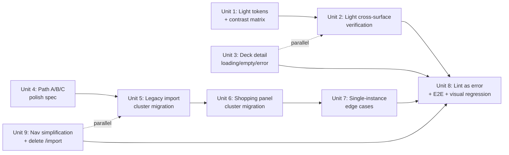

# feat: v1 Launch Readiness (Plan C)

## Overview

Plan C is the third and final v1 plan from the visual-identity brainstorm.
Plan A landed the foundation + core experience (tokens, dark theme,
onboarding, home, deck detail). Plan B landed Library + CSV Sources +
Reviews + the consolidated `/add-cards` hub. Plan C closes the v1 work
with six concrete bodies of work:

1. **Light theme completion** (R5 + R53) — tone-correct the light
   palette so every fg/bg pair clears WCAG AA on both themes, then
   verify the theme renders coherently across every authenticated and
   anonymous surface.
2. **Loading/empty/error state completion** (R58 + R59) — close the
   remaining gaps inventoried in Plan A's wake (deck detail loading
   text instead of skeleton; deck-detail "not found" inline `<p>`;
   onboarding `return null` flash; deck-detail mutations bypassing the
   Toast system; `ShoppingLine` internal error using
   `window.location.reload()`).
3. **Polish notes** (brainstorm "Polish Notes" section) — verify the
   onboarding roman-numerals treatment lands the brand voice and rework
   the Path A/B/C visual treatment so Path C reads as semantically
   distinct from A/B.
4. **Inline-style elimination** (R9 end state) — migrate the remaining
   `style={{}}` occurrences in `apps/web/src/` to CSS Modules,
   targeting the two legacy clusters (import-test-deck flow + Phase 1b
   shopping line) and 9 single-instance edge cases.
5. **Lint rule promoted to error + CI gate** — ESLint rule that blocks
   `style` prop on host JSX in `apps/web/src/**` as an error, plus a
   theme-toggle E2E spec that locks in the cross-device persistence
   contract.
6. **Navigation simplification** — delete the legacy `/import` route,
   drop `Import` from the primary nav, and add a "Track new deck" CTA
   on home routing to `/add-cards/fabrary` (the surviving Fabrary
   import surface). Updates R13 (nav inventory) and R60 (onboarding
   routing guard) to match.

**Validation posture.** Per
[`docs/validation-philosophy.md`](../validation-philosophy.md), Plan C
ships when the owner decides it ships. Validation is automated-first:
ESLint zero-violation, theme E2E green, visual regression baselines for
both themes captured at 1440×900 and 375×812. The earlier brainstorm's
"Gate 2 revisions" component is **explicitly out of scope** — Gate 2 as
a release-gate ceremony is retired.

## Problem Frame

After Plan A and Plan B land, the v1 product is functionally complete:
every requirement R1–R62a from the brainstorm is implemented except
for the items the brainstorm itself scoped to Plan C. Plan B
additionally introduced the consolidated `/add-cards` hub
(`/add-cards/manual`, `/add-cards/csv`, `/add-cards/fabrary`) which
supersedes the legacy `/_auth/import` route — the latter still ships in
the primary nav and duplicates the Fabrary flow under
`/add-cards/fabrary`.

What remains is the difference between **functional** and **shippable
to the friends circle / Cúpula DT release**:

- **Light theme is structurally present but visually broken.** The
  tokens block exists in `apps/web/src/styles/tokens.css` and the
  toggle in `/_auth/settings` works end-to-end (server-persisted via
  the Plan A `/api/users/me/settings` endpoint, optimistic localStorage
  flash prevention, and auth-response carry on first paint). However,
  `--ra-accent-body` in light mode is a `TODO Plan C` stub equal to
  `--ra-accent` (`#8f6a22`) which fails WCAG AA body on parchment by
  0.12 (4.38:1 vs. 4.5:1 required). No surface has been visually
  verified in light. Visual regression baselines exist for dark only.
- **Empty/loading/error coverage is partial.** Plan A and Plan B build
  most surfaces with proper skeletons + educational empty states +
  Toast consolidation. The deck detail route is the conspicuous gap:
  it renders `<p>Loading deck details...</p>` instead of a 3-column
  skeleton, `<p>Deck not found.</p>` instead of an educational empty
  state, and pipes mutation errors through inline
  `<p className="errorMsg">` instead of the Toast system that Plan A
  built for exactly this. The onboarding route renders `null` while
  `decksQuery` resolves, producing a perceptible blank flash. The
  legacy `ShoppingLine` ErrorState calls `window.location.reload()`
  instead of refetching the TanStack Query.
- **Polish items remain.** The brainstorm's polish notes (themed
  onboarding numerals + Path A/B/C semantic treatment) need a final
  pass. The onboarding numerals work is mostly already done — Plan A
  shipped Roman numerals (I / II / III) in Cinzel with diamond
  separators in
  `apps/web/src/components/onboarding/StepIndicator.tsx`. The Path C
  visual treatment is genuinely incomplete: today `PathBadge` in
  `TestDeckResult.tsx` renders three pills with hardcoded inline-style
  pastels (`#c6f6d5`/`#bee3f8`/`#fed7d7`) and the Path C banner in
  `decks.$deckId.tsx` is a single `<div role="status">`. None of this
  matches the brand system; Path C deserves a stronger semantic break
  from A/B.
- **Inline styles in `apps/web/src/` count ~154.** R9 specifies "zero
  inline `style={{}}` in `apps/web/src/`" as the end state of Plan C,
  with the lint rule promoted to error. The work concentrates in two
  legacy clusters plus a heterogeneous tail (a mix of CSS-var bridges,
  static layout, and boolean state toggles — not all CSS-var bridges
  as the first draft assumed):
  - **Test-deck-result cluster** (72 occurrences across 6 files, plus
    the orphaned `empty-home-state.tsx` (10) which is deleted, not
    migrated). Files: `TestDeckResult.tsx` (15), `path-c-result.tsx`
    (17), `breakdown-list.tsx` (13), `substitution-row.tsx` (11),
    `tracked-deck-card.tsx` (8), `readiness-header.tsx` (8). Note:
    `routes/_auth/import.tsx` (14) is **deleted** by Unit 9 — its
    inline styles disappear with the file, not migrated.
  - **Shopping panel cluster** (47 occurrences across 3 files):
    `ShoppingLine.tsx`, `ShoppingLineFetchControls.tsx`,
    `ShoppingLineVariantBreakdown.tsx` — wrapped by the Plan A
    `ShoppingPanel` but still inline-styled internally.
  - **Single-instance edge cases** (9 files, 1 occurrence each — but
    of 3 different kinds): genuine CSS-var bridges
    (`ReadinessHero.tsx`, `deck-detail/SubstitutionRow.tsx`),
    static layout passed through props (`Skeleton.tsx`, parts of
    `CardArt.tsx`, `DeckboxDecoration.tsx`), and boolean state
    toggles (`CardLightbox.tsx` opacity-on-load). Per-case bridge
    mechanism (data-attribute, ref-helper, or class toggle) is
    decided in Unit 7. **Note**: `CardArt.tsx` actually has 2-3
    distinct inline-style sites (cssVars container, image dims,
    SVG color) that all need migration; Unit 7's inventory reflects
    this. **Note**: `mark-owned-button.tsx` has 1 occurrence and
    is now classified as a single-instance, not part of the
    test-deck-result cluster.
- **`/import` is legacy and duplicates `/add-cards/fabrary`.** Plan B
  consolidated all card-adding flows under `/add-cards/{manual,csv,fabrary}`,
  and `/_auth/add-cards.fabrary.tsx` is the canonical Fabrary deck
  tracking surface. The original `/_auth/import.tsx` (14 inline styles,
  inline-styled UI from Phase 1a) survives only because primary nav
  and the onboarding R60 redirect target still reference it. With a
  "Track new deck" CTA on Home routing to `/add-cards/fabrary`, the
  navbar item becomes redundant and the route can be deleted outright.

The visual identity is locked. The brand system is locked. Plan B's
hub is the canonical add-cards entry. What's left is mechanical
execution + verification + the small navigation cleanup that Plan B's
consolidation enables.

## Requirements Trace

- **R5** — Light theme via `[data-theme="light"]`, server-persisted in
  `/api/users/me/settings`, localStorage flash prevention. Plan A
  shipped the toggle, the endpoint, the migration, and the
  auth-response extension. Plan C closes it: tone-corrected tokens for
  AA contrast, visual verification on every surface, baselines for
  visual regression.
- **R9** — Zero inline `style={{}}` in `apps/web/src/` as the end
  state of Plan C, lint rule as error.
- **R13 (revised)** — Primary nav inventory dropped from
  *Home · Library · Import · Reviews* (4 items) to
  *Home · Library · Reviews* (**3 items**). The "track a new deck"
  task — previously surfaced via the Import nav item — moves to a
  Home CTA routing into `/add-cards/fabrary`. The `/add-cards/*`
  hub remains reachable via: (a) the Home CTA, (b) the Home empty
  state CTA, (c) a new "Add cards" button on the Library page
  (placed near the existing "Manage CSVs" affordance), and (d)
  direct URL. The hub does not need a nav slot because its two
  dominant entry-points (track a new deck from Home, manage
  collection from Library) are already context-rooted in pages
  that own those tasks. `Library` keeps its existing "Manage CSVs"
  affordance into `/library-csv-sources`.
- **R53** — Light-theme contrast adjustments. Brainstorm explicitly
  flags the brass-on-parchment failure as a ship blocker for Plan C.
- **R58** — Educational empty states on every surface with a possible
  empty state. Deck detail is the remaining gap.
- **R59** — Loading and error state minimum coverage per surface. Deck
  detail skeleton, onboarding skeleton, mutation Toast routing, and
  ShoppingLine retry semantics are the remaining gaps.
- **R60 (revised)** — Returning-user routing: with `/import` deleted,
  the onboarding wizard's "users with any tracked decks who hit
  `/onboarding`" redirect target moves from `/import` to
  `/add-cards/fabrary` (or `/add-cards` index, decided in Unit 9).
- **Polish Notes** — themed onboarding numerals (verify) and Path
  A/B/C semantic treatment (rework).
- **Implementation Quality** (brainstorm Success Criteria) — "All
  routes render coherently in both themes with no visual regressions
  between 320 px and 1440 px".

### Inherited invariants Plan C must preserve

These existing brainstorm requirements are not Plan C deliverables but
are referenced in unit Requirements fields because Plan C must not
regress them:

- **R20** — Home shelf action hierarchy (View primary, Untrack
  demoted at 320 px). Unit 9 adds a "Track new deck" CTA to the home
  hero without violating this hierarchy.
- **R50–R52** — Responsive breakpoints (640/960/1280) and ≥ 44×44
  touch targets. Verified in Unit 2 across both themes.
- **R57** — Semantic landmarks. Unit 2 confirms shell landmarks
  survive light theme.
- **R61** — Optimistic-with-auto-save substitute decisions.
  Unit 3's mutation→Toast migration must preserve this contract.

## Scope Boundaries

- **Gate 2 ceremony revisions are out of scope.** The brainstorm Plan
  C text lists "Gate 2 revisions (if the Success-Criteria revision
  trigger fired)" as a component. This is explicitly retired by
  [`docs/validation-philosophy.md`](../validation-philosophy.md).
  Plan C does not coordinate, schedule, or execute any external human
  validation ceremony.
- **Manual deck builder ("pick from all FaB cards") is out of scope.**
  The owner has flagged a future capability where users assemble a
  tracked deck card-by-card from the catalog (split-panel like Library
  on the right + filterable card list on the left). This is a
  net-new feature of comparable scale to a Plan A unit — new route,
  new validation rules for deck composition (hero / weapon /
  equipment / mainboard), persistence of a tracked deck without a
  Fabrary URL, and likely engine touches. It does not belong in a
  "launch readiness" plan. Recorded as the **first item for a
  follow-up `ce:brainstorm`** after Plan C ships; not pre-decided
  here.
- **No new endpoints or entities.** All work is polish + verification
  + enforcement on what Plan A and Plan B already built.
- **Phase 1c surfaces stay deferred.** Discover, Historical readiness
  chart, fallback "3 closest decks", PT-BR autocomplete, Sbrauble
  store expansion — these are Phase 1c/2 per the brainstorm's Scope
  Boundaries section and remain so.
- **Substitution "modify" action stays deferred.** Per brainstorm Key
  Decisions, the card-picker UI for swapping a proposed proxy is a
  Phase 1c item, not a Plan C item.
- **"Final a11y tail" from the brainstorm Plan C text resolves to the
  work already in scope.** The phrase refers to: Unit 1's contrast
  tone fix, Unit 2's focus-ring + interactive-state verification
  across both themes, and Unit 3's preservation of the Toast
  accessibility contract (`aria-live="polite"`, focus return on
  dismiss). No additional dedicated a11y unit is scoped — the
  Plan A R51–R57 work shipped the foundation and Plan C verifies it
  survives the polish.
- **Backend changes are minimal.** Plan A landed the settings endpoint
  and the substitute_decision schema; Plan B landed the csv_source
  schema and reviews aggregate. Plan C ships no migrations and no new
  endpoints. The only backend touches are: (a) a possible test
  fixture update for E2E, (b) reading Plan A/B endpoints from the new
  theme E2E.
- **Visual regression infrastructure is in scope minimally.** If
  Playwright snapshot tests exist already, Plan C extends baselines
  for both themes. If not, Plan C ships the harness as part of the
  validation-primitives unit (Unit 8). Discovery happens in Unit 8 —
  not pre-decided here.

## Context & Research

### Relevant Code and Patterns

- **Tokens**: `apps/web/src/styles/tokens.css` — `:root, :root[data-theme="dark"]`
  block (L97–229) and `[data-theme="light"]` block (L238–346) are
  structurally complete. Light has the `TODO Plan C` for
  `--ra-accent-body` on L257–259.
- **Theme switching**:
  `apps/web/src/styles/theme-init.ts` (inline IIFE in `index.html` for
  flash-prevention), `apps/web/src/components/shell/ThemeToggle.tsx`
  (Radix ToggleGroup + optimistic localStorage + best-effort PATCH).
- **Settings endpoint**: `apps/api/src/users/users.controller.ts`
  L30–52 (`GET` + `PATCH /api/users/me/settings`). Migration:
  `apps/api/src/database/migrations/1776621087000-AddUserSettings.ts`.
  Auth response: `apps/api/src/auth/dtos/auth-response.dto.ts` carries
  `settings: { theme }`.
- **Modern Plan A patterns to mirror in legacy migrations**:
  `apps/web/src/components/deck-detail/SubstitutionRow.tsx` +
  `SubstitutionRow.module.css` — file-pair, kebab-cased class names,
  `var(--ra-*)` token reads. The file is structurally compliant
  except for one remaining `style={{ '--score': ... }}` CSS-var bridge
  that Unit 7 migrates. Use this file as the **structural** reference
  (file-pair, class naming, token reads), not as the inline-style
  reference. The `breakdown-list.tsx` legacy file the migration
  consumes does not yet have the file-pair structure.
- **Skeleton primitive**:
  `apps/web/src/components/ui/Skeleton/Skeleton.tsx` — shimmer with
  `prefers-reduced-motion` collapse, `role="status" aria-busy="true"`.
  Already used by `HomeSkeleton`, `LibrarySkeleton`,
  `CsvSourcesSkeleton`, `ReviewsRowListSkeleton`. Reuse for the
  missing deck detail and onboarding skeletons.
- **Toast system**:
  `apps/web/src/components/ui/Toast/ToastProvider.tsx` — Radix Toast,
  burst consolidation, Retry button, `returnFocusRef`. Already wired
  into the home retry, library retry, and reviews bulk-action error
  paths. Deck detail mutations and ShoppingLine error currently bypass
  this system.
- **Educational empty states**:
  `apps/web/src/components/home/EducationalEmptyState.tsx`,
  `apps/web/src/components/library/LibraryEmptyState.tsx`,
  `apps/web/src/components/csv-sources/CsvSourcesEmptyState.tsx`,
  `apps/web/src/components/reviews/ReviewsEmptyState.tsx`. Pattern:
  CSS Modules, brand-voiced copy, primary CTA, optional decorative
  ornament. Mirror this for the new `DeckDetailEmptyState`.
- **Onboarding step indicator** (already done):
  `apps/web/src/components/onboarding/StepIndicator.tsx` ships
  Roman numerals (I / II / III) in Cinzel with diamond separators —
  matches the brainstorm Polish Notes prescription. Plan C task is
  visual QA only, not a rebuild.
- **Add-cards hub (Plan B)**:
  `apps/web/src/routes/_auth/add-cards.index.tsx` (chooser),
  `add-cards.manual.tsx`, `add-cards.csv.tsx`, `add-cards.fabrary.tsx`.
  `add-cards.fabrary.tsx` is the canonical surviving Fabrary deck
  tracking surface; `/_auth/import.tsx` is the legacy duplicate
  scheduled for deletion in Unit 9.
- **Primary nav consumers**: `apps/web/src/components/shell/TopBar.tsx`
  and `apps/web/src/components/shell/BottomTabBar.tsx` — both still
  list `{ to: '/import', label: 'Import' }` and need the R13 update
  in Unit 9.
- **Path C banner** (current):
  `apps/web/src/routes/_auth/decks.$deckId.tsx` L200–213 — single
  `<div role="status" className={styles.pathCBanner}>`. The
  `PathBadge` in `TestDeckResult.tsx` L117 — three inline-styled
  pills. Both need Plan C treatment.
- **Inline-style consumers (target list)**:
  - Heavy: `ShoppingLine.tsx` (30), `path-c-result.tsx` (17),
    `TestDeckResult.tsx` (15),
    `routes/_auth/import.tsx` (14, **deleted by Unit 9**),
    `breakdown-list.tsx` (13), `substitution-row.tsx` (11),
    `ShoppingLineVariantBreakdown.tsx` (11),
    `empty-home-state.tsx` (10, dead, deleted by Unit 5),
    `tracked-deck-card.tsx` (8), `readiness-header.tsx` (8),
    `ShoppingLineFetchControls.tsx` (6).
  - Singles (9 files, mixed kinds — re-classified per Unit 7 review):
    `card-art/CardArt.tsx` (2-3 sites: cssVars container with 4 frame
    vars, `` width/height, SVG color),
    `card-art/CardLightbox.tsx` (boolean-state opacity-on-load —
    candidate for class toggle, not CSS-var bridge),
    `deck-detail/ReadinessHero.tsx` (genuine `--pct` CSS-var bridge),
    `deck-detail/SubstitutionRow.tsx` (genuine `--score` CSS-var
    bridge), `library/LibrarySearchAddBar.tsx` (pitch background — 4-
    value enum, `data-pitch` candidate not `setCssVar`),
    `mark-owned-button.tsx` (1 site, classified as single, not part of
    the test-deck cluster), `reviews/ReviewsRow.tsx` (decision-state
    enum, `data-*` candidate),
    `shell/DeckboxDecoration.tsx` (static layout — moves into the
    module CSS, no helper needed), `ui/Skeleton/Skeleton.tsx`
    (component sets its own CSS vars from props via ref+effect; the
    public `width` / `height` API is unchanged for callers).
    `AuthLayout.tsx` is **not** in this list — its sole match is a
    JSDoc comment, not a production inline style.
- **Contrast matrix doc**: `docs/design/v1/contrast-matrix.md` — dark
  theme complete, light theme parcial with the `--ra-accent` 4.38:1
  failure already documented as Plan C work.

### Institutional Learnings

- `docs/solutions/` does not contain a learning specifically about CSS
  Modules migration scale or ESLint forbid-component-props rollouts at
  this size. The Plan A migration set the precedent: file-pair
  (`Component.tsx` + `Component.module.css`), kebab-cased classes,
  `var(--ra-*)` for tokens. No learning needs to be invented here —
  the pattern is established.
- The validation-philosophy doc itself (2026-04-21) is the canonical
  learning relevant to this plan. It explicitly lists visual
  regression + smoke script + E2E as the replacements for "watch a
  tester navigate". Plan C operationalizes those for the theme-toggle
  path.

### External References

External research is **not** invoked for Plan C. Local patterns are
strong (file-pair CSS Modules across ~30 components, established
Toast infrastructure, established Skeleton primitive). The work is
mechanical execution following Plan A's example.

The one ESLint rule choice worth a note: `react/forbid-component-props`
(blocks props on user-defined components) versus `react/forbid-dom-props`
(blocks props on host elements like `<div>`). The brainstorm's
"zero inline `style={{}}`" target is on host JSX, so
`react/forbid-dom-props` is the correct rule. Decision finalized in
Unit 8.

## Key Technical Decisions

- **Light-theme `--ra-accent-body` derivation strategy**: pick the
  darkest value of `#8f6a22` that produces ≥ 4.5:1 on `--ra-bg-canvas`
  (`#f5f1e8`) AND ≥ 4.5:1 on `--ra-bg-surface` (`#ece6d3`). Empirical
  starting point: `#7d5e1d` (5.13:1 on canvas, 4.78:1 on surface —
  both pass). Final value confirmed in Unit 1 after on-screen
  verification. Keep `--ra-accent` (`#8f6a22`) unchanged for
  large-text and decorative use; the new `--ra-accent-body` is
  body-size-only.
- **Theme verification cadence**: dev-browser screenshot loop
  (per validation-philosophy.md) at 1440×900 + 375×812 across every
  surface, both themes. Captured into baselines under
  `apps/web/tests/visual/__snapshots__/`. CI runs Playwright snapshot
  diffs on every PR; baseline updates require explicit
  `--update-snapshots` in the PR.
- **Deck detail empty/loading components**: build inside
  `apps/web/src/components/deck-detail/` next to the existing
  `ReadinessHero` / `SubstitutionRow` siblings. Names:
  `DeckDetailSkeleton.tsx` + `DeckDetailEmptyState.tsx`. Reuse the
  `<Skeleton>` primitive from `components/ui/Skeleton/`.
- **Mutation error → Toast migration**: every mutation in
  `apps/web/src/routes/_auth/decks.$deckId.tsx` (`decideSubstitute`,
  `markOwned`, `clearRejections`) routes errors via
  `useToast().show({ kind: 'error', ... })` matching the contract
  Plan A built (`aria-live="polite"`, focus return on dismiss, burst
  consolidation). The inline `<p className={styles.errorMsg}>` paths
  are removed.
- **ShoppingLine error refactor**: replace `window.location.reload()`
  with the host route's TanStack Query invalidation (passed as a prop
  or read from a context). Optimistic refetch instead of full page
  reload. Plan C does **not** restructure the ShoppingLine internals
  beyond CSS Modules + the error-flow fix.
- **Path A/B/C semantic visual treatment**:
  - Path A — Plan A signature brass treatment, no badge needed
    (default success state, "play as written").
  - Path B — softer brass + "subbed" eyebrow, distinct from A's
    primary brass.
  - Path C — visually broken away from A/B: oxblood frame ornament,
    "approximation" label, distinct margin/separator. Specifically,
    Path C is **not** styled as another tab — it reads as a different
    affordance (per brainstorm Polish Notes "consider whether tabs
    are the right affordance or whether C deserves a stronger visual
    separation given its different semantic"). Concrete spec drafted
    in Unit 4.
- **Inline-style elimination is total — no allowlist**: the brainstorm
  R9 specifies "zero" and the lint rule is enforced as error.
  Migration mechanism is chosen **per-case during Unit 7's review**,
  not pre-decided here. The decision tree:
  - **Static layout** (e.g., `width: '100%'`, fixed margins): inline
    in the module CSS — no helper, no `data-*`, just a class.
  - **Boolean state** (e.g., `opacity: loaded ? 1 : 0`): class toggle
    plus a CSS rule — no `data-*` needed if a boolean class is enough.
  - **Low-cardinality enum** (pitch ∈ {1,2,3,null}, decision-state ∈
    {pending, approved, rejected}): `<div data-pitch={pitch}>` plus
    `[data-pitch="red"] { --card-pitch-color: var(--ra-pitch-red); }`.
    Preferred over `setCssVar` because no first-paint race.
  - **Continuous / arbitrary value** (computed widths, ring percent,
    confidence score): `setCssVar` ref helper — but only after Unit 7
    confirms ≥ 3 genuine consumers. With ≤ 2 consumers, inline the
    `useEffect` calls and skip the helper.
  - **Variable-form `style={cssVars}`**: identified during review as
    a separate sub-class. The `react/forbid-dom-props` rule does NOT
    catch this pattern (it only catches the literal prop name on host
    JSX, not values). Production sites today: `CardArt.tsx`,
    `CardLightbox.tsx`, `LibraryGrid.tsx` (the third was missed by
    the first-pass inventory). Plan C migrates these alongside
    literal-form `style={{}}` so the lint rule's narrower coverage
    doesn't leave a gap.

  **First-paint race risk**: the `useEffect`-based `setCssVar`
  pattern fires after paint, while inline `style={{ '--var': value }}`
  is synchronous with React's render. For components where the var
  controls visible geometry on first mount, prefer `data-*` selectors
  (synchronous) or accept the single-frame flash. Document the choice
  per file in Unit 7's PR.
- **Dead code deletion**: `apps/web/src/components/empty-home-state.tsx`
  and its test are deleted in Unit 5 — no consumer remains in
  production after the legacy import-flow migration. The Plan A
  `EducationalEmptyState` in `components/home/` supersedes it.
- **Lint rule scope**: `react/forbid-dom-props` with
  `forbid: ['style']` applied as **error** in `apps/web/src/**`, with
  NO file-level or component-level allowlist. Tests under
  `apps/web/src/**/__tests__/` also obey the rule (dev fixtures in
  `apps/web/tests/` are out of scope for the rule). Plan A's existing
  `apps/web/eslint.config.js` is the integration point.
  - **Required dependency**: `eslint-plugin-react` is **not currently
    installed** (only `eslint-plugin-react-hooks` and
    `eslint-plugin-react-refresh` are in `apps/web/package.json`).
    Unit 8 adds `eslint-plugin-react@^7.37` (flat-config compatible)
    to devDependencies and registers it in `eslint.config.js`. Without
    this dependency the rule throws "Definition for rule
    'react/forbid-dom-props' was not found" at lint time.
  - **Coverage limitation acknowledged**: the rule catches literal
    `style={{...}}` JSX attributes on host elements but not
    variable-form `style={cssVars}` or spread `{...rest}` cases. Plan
    C's strategy (above) is to migrate variable-form alongside
    literal-form so the rule's narrower coverage is a non-issue at
    enforcement time. If reintroduction prevention through linting is
    desired for variable-form too, a custom `no-restricted-syntax` AST
    rule blocking JSX attribute name="style" with non-undefined value
    can be added later — out of scope for Plan C.
- **Theme E2E placement**: new spec at
  `apps/api/src/__tests__/theme-persistence.e2e-spec.ts` (matches the
  established Plan B pattern in `plan-b-full-flow.e2e-spec.ts`; the
  earlier-draft path `apps/api/test/e2e/` does not exist in this
  repo) using supertest against the API. The frontend side of theme
  toggle is exercised in Playwright as part of the visual regression
  suite, not in the API E2E.
- **`/import` deletion (not redirect)**: Unit 9 deletes the
  `routes/_auth/import.tsx` file outright. No 301/302 redirect, no
  deprecation banner. Rationale: pre-launch product, no shared
  external links to preserve, Plan B's `/add-cards/fabrary` is the
  canonical replacement, and a redirect would carry the legacy
  inline-style cost into the lint enforcement. The 14 inline-style
  occurrences in `import.tsx` are eliminated by deletion, not
  migration.
- **R13 nav inventory after Unit 9**: primary nav becomes
  *Home · Library · Reviews* (3 items). The bottom tab bar mirrors
  the same three items at a generous target width per item (room for
  ~107 px each at 320 px viewport, well above R15's 64 px floor —
  this is a discoverability + thumb-target win, not a regression).
  The "Add cards" task is reachable from Home (CTA "Track new deck"
  + empty-state CTA) and from Library (new "Add cards" button). The
  brainstorm's R13 prose is updated as part of Unit 9's documentation
  deliverable.
- **R60 onboarding redirect target**: with `/import` deleted, the
  onboarding wizard's redirect for users with any tracked decks
  changes from `/import` to `/add-cards/fabrary`. `/add-cards` index
  was considered as an alternative but rejected — the redirect's
  intent is "let the user track another Fabrary deck", and the
  chooser would add an unnecessary click for the most common path.

## Open Questions

### Resolved During Planning

- **Q: Should light theme verification block on every surface or just
  the v1 critical journey?**
  A: Every surface. R5 + Implementation Quality say "all routes
  render coherently in both themes". Visual regression baselines
  cover both themes for: sign-in, sign-up, forgot-password,
  reset-password, check-your-email, verify-email, onboarding (each
  step + congrats state), home (empty, populated), deck detail
  (loading, populated, empty), library (empty, populated,
  filtered-empty), library-csv-sources (empty, populated,
  delta-modal-open), reviews (each tab), settings, add-cards
  (chooser, manual, csv, fabrary). After Unit 9 deletes `/import`,
  the inventory is 16 surfaces × 2 themes × 2 viewports = 64
  baselines.
- **Q: Does Plan C ship Phase 1c "outbound click telemetry" or
  decisions-acceptance telemetry?**
  A: No. Telemetry primitives are Phase 1c per
  `docs/plans/2026-04-18-001-feat-phase-1c-discover-history-telemetry-plan.md`
  and its addendum. Plan C does not pre-empt that work.
- **Q: Does the lint rule allow the `style={{ '--cssvar': value }}`
  bridge pattern as an exception?**
  A: No. Total elimination per R9. The CSS-var bridges are migrated
  via `setCssVar` refs or `data-*` attribute selectors per the Key
  Technical Decisions section.
- **Q: Plan B status at Plan C kickoff?**
  A: **Plan B is complete** (confirmed 2026-04-27 by code spot-check:
  `apps/api/src/reviews/`, `apps/api/src/collection/csv/`, migrations
  `AddCsvSourceAndCollectionCardSourceId` and `AddReviewAggregate`
  all present; Library / CSV Sources / Reviews / Add-cards routes
  all rendering). Plan B file frontmatter updated to
  `status: completed`. Plan C proceeds with all dependencies
  satisfied — no in-flight Plan B work to sequence around.
- **Q: Should `/import` be redirected or deleted?**
  A: Deleted. Pre-launch product, no shared links to preserve.
  Owner-confirmed 2026-04-27.

### Deferred to Implementation

- **Exact light-theme `--ra-accent-body` hex**: starting empirically at
  `#7d5e1d`. Final value confirmed in Unit 1 after on-screen
  verification on a real display + screenshot under both
  `prefers-color-scheme` branches.
- **Path C visual treatment final spec**: drafted in Unit 4 based on
  the oxblood-frame direction; iterated against
  `docs/design/v1/*.jsx` prototypes. Owner reviews the proposal
  before the migration unit consumes it.
- **CI integration timing for the lint-as-error promotion**: lint
  rule is added as error in Unit 8, but the CI gate may temporarily
  allow `apps/web/src/components/{ShoppingLine,TestDeckResult,...}.tsx`
  via `eslint-disable-next-line` only during the migration commits
  and removed file-by-file as each migration unit lands. Final CI
  gate rejects any remaining disables.
- **Visual regression harness**: Playwright is **not** currently
  installed (no `playwright.config.ts` exists anywhere in the repo).
  Unit 8 ships the harness bootstrap as part of the unit's scope —
  not a conditional. CI infrastructure (`/.github/workflows/`) also
  does not exist; Unit 8 creates it. Owner self-validation in Unit 2
  uses a simpler dev-browser screenshot script that does NOT require
  the Playwright harness.
- **Owner self-validation script in Unit 2 vs. CI snapshot suite in
  Unit 8 — clear ownership**: Unit 2 produces a
  `scripts/screenshot-all-surfaces.ts` for owner-driven screenshot
  capture (the artifact the owner reviews to sign off on Unit 2's
  light-theme verification). It is intentionally not the CI-locked
  snapshot suite. Unit 8 owns the Playwright snapshot suite at
  `apps/web/tests/visual/all-surfaces.spec.ts`. Two artifacts, two
  purposes; no overlap.

## High-Level Technical Design

> *This illustrates the intended approach and is directional guidance
> for review, not implementation specification. The implementing
> agent should treat it as context, not code to reproduce.*

### Plan C dependency graph



### Path A/B/C visual hierarchy (Unit 4 spec preview)

```text
            visual weight
   high  ←──────────────────→  low

  Path A: brass primary CTA, no badge        ▓▓▓▓▓▓▓▓▓▓
          (default "play as written" state)

  Path B: brass secondary, "subbed" eyebrow  ▓▓▓▓▓▓▓
          + count-of-subs label

  Path C: oxblood frame ornament,            ▓▓▓
          "approximation" eyebrow,
          margin break above (semantic
          separator, NOT another tab)
```

The principle: Path A and B share an affordance family (both are
"playable arrangements of cards you own"); Path C is a different
affordance ("a deck approximated by proximity, less reliable") and
should read as a separate kind of result, not the third tab in a row.

## Implementation Units

- [ ] **Unit 1: Light theme tone-corrected tokens + contrast matrix completion**

**Goal:** Fix the documented light-theme contrast failures (R5, R53)
so every fg/bg pair on light theme clears WCAG AA at body size, and
update `docs/design/v1/contrast-matrix.md` to reflect the resolved
state.

**Requirements:** R5, R53, Implementation Quality bar.

**Dependencies:** None — first unit, no blockers.

**Files:**
- Modify: `apps/web/src/styles/tokens.css`
- Modify: `docs/design/v1/contrast-matrix.md`
- Modify: `apps/web/src/styles/__tests__/contrast.spec.ts` —
  **already exists** with the structure this unit needs (hardcoded
  hex constants, pure-TS contrast computation, dark pairs covered,
  `describe.skip` block for the light-theme failures). Unit 1
  un-skips the light-theme block, updates the assertion for the new
  `--ra-accent-body` hex, and adds any newly-relevant fg/bg pairs.
  No new test file is created — the earlier-draft path
  `tokens-contrast.spec.ts` was based on a search miss.

**Approach:**
- Derive `--ra-accent-body` for light theme using a starting value of
  `#7d5e1d` and verifying ≥ 4.5:1 on both `--ra-bg-canvas` (`#f5f1e8`)
  and `--ra-bg-surface` (`#ece6d3`). Iterate ±0.05 luminance if either
  pair falls short.
- Audit any other light-theme pair flagged in the contrast-matrix doc
  as marginal (`--ra-fg-muted` 4.83:1 on canvas / 5.39:1 on surface
  passes but is close — reverify under the new accent-body change).
- Remove the inline `TODO Plan C` comment in `tokens.css` L257–259.
- Update `contrast-matrix.md`: mark light theme complete, replace the
  "Plan C work" section header with "Resolved 2026-04-XX", record the
  final hex of `--ra-accent-body` light, and note the test spec that
  enforces ongoing AA conformance.

**Patterns to follow:**
- Existing dark-theme tokens + their contrast-matrix entries — same
  format on the light side.
- `contrast.spec.ts`'s established approach: hardcoded hex constants
  matching the token values, pure-TS contrast computation, no
  CSS-file parsing (Vitest is configured with `css: false` so any
  approach that reads `tokens.css` at test time would not resolve
  `var()` indirections). When `tokens.css` changes, the test
  constants are updated alongside — this is the same single-edit
  discipline already in place.

**Test scenarios:**
- Happy path: `--ra-accent-body` light contrast ≥ 4.5:1 on
  `--ra-bg-canvas` and on `--ra-bg-surface`.
- Happy path: every fg/bg pair documented in `contrast-matrix.md` for
  light theme passes AA at body size (4.5:1).
- Edge case: large-text pair `--ra-accent` on `--ra-bg-canvas` light
  — assertion is ≥ 3.0:1 (large-text AA), with an explicit comment
  noting body-size use is forbidden via the `--ra-accent-body` token.
- Edge case: dark-theme pairs are unchanged by Unit 1 (regression
  guard — no dark contrast value drifts).

**Verification:**
- `pnpm --filter @rathe-arsenal/web test apps/web/src/styles/__tests__/contrast.spec.ts` passes (the previously-skipped light-theme block now runs and is green).
- `contrast-matrix.md` light-theme section shows zero remaining
  failures.
- Manual screenshot of `/_auth/settings` rendered with
  `[data-theme="light"]` shows brass-on-parchment body text legible
  at 16px on a calibrated display.

---

- [ ] **Unit 2: Light theme cross-surface verification**

**Goal:** Render every authenticated and anonymous surface in
`[data-theme="light"]` and confirm coherence — typography, spacing,
icon contrast, focus rings, hover/active states. Capture the baselines
that Unit 8 will lock with visual regression.

**Requirements:** R5, R50, R51, R52, R57, Implementation Quality bar.

**Dependencies:** Unit 1 (tokens must be tone-corrected before
verification produces a clean review). Plan B's Library / CSV
Sources / Reviews / Add-Cards surfaces are already merged
(confirmed 2026-04-27). Unit 9's nav update lands before the
baseline capture in Unit 8 so the captured shell shows the final
R13 inventory.

**Files:**
- Modify (as needed, surface by surface): any CSS Module file that
  contains a `[data-theme="light"]` override the verification reveals
  as broken — typically `:not()` selectors or shadow-mode-specific
  hardcoded rgba values that didn't survive the dark→light flip.
- Modify: `apps/web/src/components/shell/*.module.css` for shell-level
  drift (top bar, mobile tab bar).
- Modify: `apps/web/src/routes/_anon/*.module.css` for the auth
  split-panel surfaces (deckbox decoration light variant).
- Create (if no harness exists): `scripts/screenshot-all-surfaces.ts`
  — a Playwright-driven script that boots the test fixture, signs in,
  navigates each surface in sequence, captures both themes at both
  viewports.

**Approach:**
- Sign in as the test fixture user (`docs/dev-fixtures.md`), capture
  every surface in the inventory below at 1440×900 and 375×812, both
  themes.
- Surface inventory (16 routes after Unit 9 deletes `/import`):
  `/sign-in`, `/sign-up`, `/forgot-password`, `/reset-password`,
  `/check-your-email`, `/verify-email`, `/_auth/onboarding` (steps
  1, 2, 3, congrats), `/_auth/home` (empty, populated),
  `/_auth/decks/$deckId` (loading skeleton, populated, empty),
  `/_auth/library` (empty, populated, filtered-empty),
  `/_auth/library-csv-sources` (empty, populated, delta-modal-open),
  `/_auth/reviews` (pending tab, approved tab, rejected tab),
  `/_auth/settings`, `/_auth/add-cards` (chooser, manual, csv, fabrary).
- Diff each captured pair (dark vs light) by eye + with the eventual
  Playwright snapshot tool. Fix any token-level or component-level
  light drift inline as part of this unit.

**Patterns to follow:**
- The Plan A `tokens.css` light block — every change Unit 2 makes
  routes through tokens, never component-level hex values.
- Existing CSS Module conventions — `:focus-visible`, `:hover`,
  `[aria-current="page"]` selectors handle theme-aware state via
  `var(--ra-*)` already; Unit 2 only fixes leakage, not rebuilds.

**Test scenarios:**
- Happy path: every surface inventory entry renders without overlapping
  text, missing borders, or invisible icons in light theme.
- Edge case: focus ring (`:focus-visible`) on light theme is the 2px
  brass outline — verify on every interactive element type
  (button, link, input, tab, ToggleGroup item).
- Edge case: deckbox SVG
  (`apps/web/src/components/shell/DeckboxDecoration.tsx`) reads
  `currentColor` correctly under light theme — the oxblood gradient
  is preserved (it's a brand-token, not a theme-token).
- Edge case: `<CardArt>` pitch frames (R/Y/B) read identically across
  both themes (preserved per `.impeccable.md` aesthetic note).
- Integration: theme toggle on `/_auth/settings` produces no flash
  on the next route navigation (server-persisted value matches
  localStorage).

**Verification:**
- Per E3 decision (16 dark-only baselines at launch): owner-run
  screenshot pass via `scripts/screenshot-all-surfaces.ts` captures
  every surface in **both themes** at desktop + mobile (1440×900 +
  375×812) for the **manual review** below. These captures are NOT
  committed as visual regression baselines — they are review
  artifacts. Unit 8's CI-locked baselines are dark-desktop-only (16,
  see Unit 8).
- Owner self-validation pass per `docs/validation-philosophy.md` —
  "owner reviews the new light-theme rendering against the brand
  voice". Light theme verification is the explicit purpose of this
  unit; the captures above are the artifact the owner reviews.
- Any light-theme rendering issues found are fixed inline as part
  of Unit 2 (token tweaks or component-level CSS Module fixes routed
  through `var(--ra-*)`).

---

- [ ] **Unit 3: Deck detail loading + empty + error completion**

**Goal:** Replace the three remaining inline-text states on
`/_auth/decks/$deckId` with proper components, and route deck-detail
mutation errors through the Toast system.

**Requirements:** R58, R59, R61.

**Dependencies:** None — independent of light-theme work.

**Files:**
- Create: `apps/web/src/components/deck-detail/DeckDetailSkeleton.tsx`
- Create: `apps/web/src/components/deck-detail/DeckDetailSkeleton.module.css`
- Create: `apps/web/src/components/deck-detail/DeckDetailEmptyState.tsx`
- Create: `apps/web/src/components/deck-detail/DeckDetailEmptyState.module.css`
- Modify: `apps/web/src/routes/_auth/decks.$deckId.tsx`
- Modify: `apps/web/src/routes/_auth/decks.$deckId.module.css`
- Test: `apps/web/src/components/deck-detail/__tests__/DeckDetailSkeleton.spec.tsx`
- Test: `apps/web/src/components/deck-detail/__tests__/DeckDetailEmptyState.spec.tsx`
- Test: `apps/web/src/routes/_auth/__tests__/decks-deckId-mutations.spec.tsx`
  (covers the Toast routing for `decideSubstitute`, `markOwned`,
  `clearRejections`)

**Approach:**
- `DeckDetailSkeleton` mirrors the 3-column layout (R24): readiness
  hero placeholder + breakdown placeholders + shopping panel
  placeholder. At < 960 px collapses to single-column stack.
- `DeckDetailEmptyState` accepts a `kind: 'not-found' | 'computing'`
  prop and renders distinct copy + behavior per the two situations
  (per O1 decision):
  - **`kind="not-found"`** — the deckId in the URL doesn't match a
    tracked deck the user owns. Copy: heading "This deck isn't in
    your arsenal." + body "It may have been removed, or the link is
    stale." + primary CTA "Back to home" → `/_auth/home` + secondary
    CTA "Track a Fabrary deck" → `/add-cards/fabrary`.
  - **`kind="computing"`** — deck exists but `readinessSnapshot` is
    null (engine hasn't finished computing). Copy: heading "Computing
    readiness…" + body "We're checking what you can play. This takes
    a few seconds for new decks." + a small inline `<Skeleton>`
    instead of CTA. The route polls TanStack Query (existing refetch
    interval, ~3s) and auto-transitions to the populated layout when
    the snapshot lands. No manual "Check now" button — auto-refresh
    is the contract.
  - The route's branch logic: `if (deck === null) → kind="not-found"`,
    `else if (deck.readinessSnapshot === null) → kind="computing"`,
    `else → populated 3-column`.
- Mutation error routing: replace each
  `setError(message)` / `<p className={styles.errorMsg}>` pattern in
  `decks.$deckId.tsx` with `useToast().show({ kind: 'error', message,
  retry: () => mutation.mutate(...) })`. Burst consolidation already
  in place inside `ToastProvider` handles the bulk-rejection case.
- Loading text and "Deck not found" text removed entirely.

**Patterns to follow:**
- `apps/web/src/components/home/HomeSkeleton.tsx` (inline in
  `home.tsx`) + `apps/web/src/components/library/LibrarySkeleton.tsx`
  — same shimmer + role + aria contract.
- `apps/web/src/components/home/EducationalEmptyState.tsx` — copy
  tone + ornament + CTA shape.
- `apps/web/src/components/ui/Toast/ToastProvider.tsx` — `show()` API
  contract.

**Test scenarios:**
- Happy path: route renders `<DeckDetailSkeleton>` while query is
  pending; transitions to populated state on resolve.
- Happy path: route renders `<DeckDetailEmptyState kind="not-found">`
  when query resolves to `null` (deck deleted or stale URL); the
  primary CTA links to `/_auth/home` and the secondary CTA to
  `/add-cards/fabrary`.
- Happy path: route renders `<DeckDetailEmptyState kind="computing">`
  when query resolves with `readinessSnapshot === null`; the body
  text mentions readiness computation; no CTA-back-to-home is shown
  (the auto-refresh handles the transition).
- Integration: when `kind="computing"` is on screen and the query's
  next refetch returns a populated `readinessSnapshot`, the route
  re-renders to the 3-column layout without user action (auto-refresh
  contract).
- Error path: `decideSubstitute` mutation failure → Toast error with
  retry; original optimistic update reverts (R61 contract).
- Error path: `markOwned` mutation failure → Toast error with retry;
  card re-appears in not-owned list.
- Error path: `clearRejections` mutation failure → Toast error with
  retry; modified-view banner persists.
- Edge case: 5 mutation failures in 500ms (burst — e.g., user hits
  bulk-reject) → ONE consolidated Toast with "5 changes failed" +
  "Retry all" (per R59 burst contract).
- Integration: Toast `aria-live="polite"` announcement, focus return
  on dismiss to the trigger element (verified via testing-library
  + jest-dom).
- Edge case: `prefers-reduced-motion` reduces the skeleton shimmer
  to a static muted background (inherited from the `<Skeleton>`
  primitive).

**Verification:**
- `pnpm --filter @rathe-arsenal/web test` green for all three new
  test files.
- Manual: navigate to `/decks/INVALID_ID` and see the empty-state
  component, not the inline `<p>`.
- Manual: trigger a network failure on a substitute decision and
  see the Toast, not the inline error text.

---

- [ ] **Unit 4: Onboarding loading skeleton + Path A/B/C polish spec**

**Goal:** Two related polish items — close the onboarding loading
flash with a proper skeleton, and finalize the Path A/B/C visual
treatment spec ahead of the legacy migration in Unit 5.

**Requirements:** R59, R51, brainstorm Polish Notes.

**Dependencies:** None.

**Files:**
- Create: `apps/web/src/components/onboarding/OnboardingSkeleton.tsx`
- Create: `apps/web/src/components/onboarding/OnboardingSkeleton.module.css`
- Modify: `apps/web/src/routes/_auth/onboarding.tsx` (replace
  `return null` with `<OnboardingSkeleton />`)
- Test: `apps/web/src/components/onboarding/__tests__/OnboardingSkeleton.spec.tsx`
- Create: `docs/design/v1/path-abc-spec.md` — short spec doc covering
  the visual hierarchy decisions Unit 5/6 will execute. Includes:
  Path A treatment (brass primary), Path B treatment (brass secondary
  + "subbed" eyebrow), Path C treatment (oxblood frame ornament +
  margin break + "approximation" eyebrow), and the explicit rationale
  that Path C is not a tab.

**Approach:**
- `OnboardingSkeleton` matches the wizard shell: step indicator (3
  dots, current at step 1) + content placeholder + footer actions
  placeholder. Avoids rebuilding the indicator — just shows
  Plan A's `<StepIndicator>` with `currentStep={1}` over a content
  skeleton.
- Onboarding numerals (Roman I/II/III in Cinzel via
  `StepIndicator.tsx`) are validated visually as part of Unit 2's
  cross-surface pass. No code change here — `StepIndicator` already
  meets the Polish Notes prescription.
- `path-abc-spec.md` documents the rendered states with reference to
  Plan A's `decks.$deckId.tsx` Path C banner, the `TestDeckResult`
  `PathBadge`, and the `ShoppingLine` Path C variant. Includes
  hex/token references, copy text, and mockup screenshots from the
  design file (`docs/design/v1/*.jsx`). Owner reviews and signs off
  before Unit 5 begins.

**Patterns to follow:**
- `apps/web/src/components/onboarding/StepIndicator.tsx` (existing
  Roman-numerals indicator).
- Plan A's `apps/web/src/components/home/HomeSkeleton` shimmer
  pattern.
- Existing design specs in `docs/design/v1/` (e.g., the brand tokens
  file is the canonical reference for spec docs).

**Test scenarios:**
- Happy path: `OnboardingSkeleton` renders a step-1 indicator +
  content skeleton + footer skeleton; aria-busy="true" on the
  wrapper.
- Edge case: `prefers-reduced-motion` collapses shimmer (inherited
  from the `<Skeleton>` primitive).
- Documentation: `path-abc-spec.md` is reviewed by the owner;
  sign-off recorded as a commit-message line on the spec PR.

**Verification:**
- `pnpm --filter @rathe-arsenal/web test apps/web/src/components/onboarding/__tests__/OnboardingSkeleton.spec.tsx` passes.
- Manual: navigate to `/_auth/onboarding` with `decksQuery`
  artificially delayed and see the skeleton, not a blank flash.
- Owner has signed off on `docs/design/v1/path-abc-spec.md`.

---

- [ ] **Unit 5: Legacy test-deck cluster migration to CSS Modules**

**Goal:** Migrate the test-deck-result + path-c + breakdown-list
component family from inline styles to CSS Modules following the
Plan A pattern, executing the Path A/B/C polish spec from Unit 4.
Delete the orphan `empty-home-state.tsx` and its test.

**Requirements:** R9, brainstorm Polish Notes (Path A/B/C).

**Dependencies:** Unit 4 (Path A/B/C spec must be agreed before
`PathBadge` migration consumes it). The legacy `routes/_auth/import.tsx`
is not in this unit's file list because Unit 9 deletes it outright.

**Files:**
- Modify (each gets a paired `.module.css`) — 6 files, 72 inline-style
  occurrences total:
  - `apps/web/src/components/TestDeckResult.tsx` (15)
  - `apps/web/src/components/path-c-result.tsx` (17)
  - `apps/web/src/components/breakdown-list.tsx` (13)
  - `apps/web/src/components/substitution-row.tsx` (11) — note:
    legacy file at `components/` root, distinct from
    `components/deck-detail/SubstitutionRow.tsx` (Plan A modern).
  - `apps/web/src/components/tracked-deck-card.tsx` (8)
  - `apps/web/src/components/readiness-header.tsx` (8)
- Create (per file above, where missing): paired `.module.css` file.
- Delete:
  - `apps/web/src/components/empty-home-state.tsx` (10 inline styles
    — eliminated by deletion, not migrated)
  - `apps/web/src/components/__tests__/empty-home-state.test.tsx`
- Test: each migrated component gets a smoke test verifying it
  renders without error in both themes (a single test per component
  is sufficient — the visual regression suite in Unit 8 catches
  rendering drift).

**Note on `mark-owned-button.tsx`**: this file has 1 inline-style
occurrence (the `style={{ width: '100%' }}` on the button at the
"Mark owned" affordance) and is migrated as part of **Unit 7**
(single-instance edge cases), not here. The first-pass plan grouped
it with the legacy cluster; the per-file count classifies it as a
single, and the per-case migration mechanism in Unit 7 (likely a
plain CSS class — static layout, not a CSS-var bridge) is more
appropriate than a paired `.module.css` rebuild.

**Approach:**
- File-by-file: extract each `style={{...}}` into a class in the
  paired `.module.css` reading `var(--ra-*)`. Use `setCssVar` refs
  or `data-*` attribute selectors per the Key Technical Decisions
  rules.
- `PathBadge` (in `TestDeckResult.tsx`) is rebuilt to match Unit 4's
  spec: Path A no badge / Path B brass secondary eyebrow / Path C
  oxblood frame ornament. Hardcoded pastels (`#c6f6d5`/`#bee3f8`/
  `#fed7d7`) are replaced by `var(--ra-readiness-high)` (Path A) and
  `var(--ra-oxblood-*)` (Path C).
- Path C banner in `decks.$deckId.tsx` is also reworked here to match
  the spec — single source of truth for Path C treatment across
  consumers.
- `empty-home-state.tsx` deletion is verified by grepping for
  consumers — none should remain after Plan A's
  `EducationalEmptyState` superseded it. After Unit 9, the only
  other consumer (`__tests__/empty-home-state.test.tsx`) is also
  deleted.

**Patterns to follow:**
- `apps/web/src/components/deck-detail/SubstitutionRow.tsx` +
  `SubstitutionRow.module.css` — file-pair structure, CSS-var token
  reads, BEM-ish class names.
- `apps/web/src/components/home/DeckCard.module.css` — brass
  primary action + secondary action class hierarchy (Path A vs Path
  B badge weight reuses this pattern).

**Test scenarios:**
- Happy path: each migrated component renders matching its previous
  output (visual regression baseline diff is zero in Unit 8).
- Happy path: `PathBadge` renders the new Path A / B / C visuals per
  the Unit 4 spec.
- Edge case: `TestDeckResult` test-deck flow in `/add-cards/fabrary`
  (the only surviving consumer after Unit 9) renders the new
  `<PathBadge>` and the new `<PathCResult>` in their migrated forms,
  no inline styles remain.
- Edge case: `prefers-reduced-motion` is respected (any
  transition/animation removed earlier preserved as static).
- Integration: `empty-home-state.tsx` removal does not break any
  route — `tsc` clean,
  `pnpm --filter @rathe-arsenal/web build` succeeds.

**Verification:**
- `grep -c "style={{" apps/web/src/components/{TestDeckResult,path-c-result,breakdown-list,substitution-row,tracked-deck-card,readiness-header,mark-owned-button}.tsx`
  → all zero.
- `apps/web/src/components/empty-home-state.tsx` and its test do not
  exist.
- Visual regression unchanged in Unit 8 baselines (a manual review
  before Unit 8 captures the new baseline confirms no drift).
- `pnpm --filter @rathe-arsenal/web test` green.

---

- [ ] **Unit 6: Shopping panel cluster migration to CSS Modules**

**Goal:** Migrate the Phase 1b shopping line trio
(`ShoppingLine.tsx`, `ShoppingLineFetchControls.tsx`,
`ShoppingLineVariantBreakdown.tsx`) from inline styles to CSS Modules,
and replace the `window.location.reload()` error retry with TanStack
Query refetch + Toast.

**Requirements:** R9, R59 (error retry).

**Dependencies:** Unit 5 (sequenced to avoid double-migration of
`PathCResult`-related styles).

**Files:**
- Modify:
  - `apps/web/src/components/ShoppingLine.tsx` (30)
  - `apps/web/src/components/ShoppingLineFetchControls.tsx` (6)
  - `apps/web/src/components/ShoppingLineVariantBreakdown.tsx` (11)
- Create:
  - `apps/web/src/components/ShoppingLine.module.css`
  - `apps/web/src/components/ShoppingLineFetchControls.module.css`
  - `apps/web/src/components/ShoppingLineVariantBreakdown.module.css`
- Modify: `apps/web/src/components/deck-detail/ShoppingPanel.tsx` —
  pass an `onRetry: () => void` prop instead of relying on
  `window.location.reload()`. The host route invalidates the TanStack
  Query keys (`shopping-line`, `deck-detail`, etc.).
- Test: `apps/web/src/components/__tests__/ShoppingLine.spec.tsx`
  smoke test covering the migrated render + the retry-on-error flow.

**Approach:**
- Mechanical CSS Modules migration of the trio. Reuse Path A/B/C
  spec patterns from Unit 4/5 — `ShoppingLine` has Path-aware
  branches that inherit the hierarchy.
- Error refactor: `ErrorState` in `ShoppingLine.tsx` accepts
  `onRetry: () => void` and a `message: string`. The component
  invokes `onRetry()` on the retry button click. Toast surface is
  emitted by the host route on the failure event (TanStack `onError`
  callback) — `ShoppingLine` itself does not import the Toast hook
  to keep it portable across `decks.$deckId` and
  `/add-cards/fabrary` consumers.
- The `window.location.reload()` is removed in this unit; any tests
  asserting against it are updated to assert the new `onRetry`
  invocation.

**Patterns to follow:**
- `apps/web/src/components/deck-detail/ShoppingPanel.module.css` —
  the wrapper already uses CSS Modules; the inner `ShoppingLine`
  inherits the file-pair convention.
- Plan A Toast routing in `home.tsx` retry path.

**Test scenarios:**
- Happy path: `ShoppingLine` renders all three Path branches (A
  exact, B subbed, C approximation) with the new CSS Modules class
  output.
- Error path: `ShoppingLine` ErrorState calls `props.onRetry()`
  exactly once on retry click; does not call
  `window.location.reload`.
- Integration: `decks.$deckId.tsx` host wires `onRetry` to a
  TanStack Query `invalidateQueries(['shopping-line', deckId])`
  call, which triggers a refetch + Toast on subsequent failure.
- Edge case: variant fetch in-flight + retry click — `onRetry` is
  callable; Plan A's burst consolidation in ToastProvider handles
  any rapid re-failures.
- Edge case: ShoppingLine props with `kind: 'unscraped'` (per
  Plan A contract) renders the neutral fallback per R59 — verified
  unchanged.

**Verification:**
- `grep -c "style={{" apps/web/src/components/ShoppingLine*.tsx`
  → all zero.
- `grep -c "window.location.reload" apps/web/src/components/ShoppingLine.tsx`
  → zero.
- Manual: simulate a shopping-line API failure, click retry, observe
  TanStack Query refetch (Network panel) + Toast surface (DOM).
- `pnpm --filter @rathe-arsenal/web test` green.

---

- [ ] **Unit 7: Single-instance + variable-form inline-style cleanup**

**Goal:** Migrate the 9 single-instance literal `style={{...}}`
occurrences AND the variable-form `style={cssVars}` / `style={cardStyle}`
sites the first-pass inventory missed. This achieves literal R9 zero
across both forms — no allowlist, no exceptions.

**Requirements:** R9.

**Dependencies:** Unit 6 (unblocks Unit 8's lint-as-error promotion).

**Variable-form sites (added per E2 decision)**: the
`react/forbid-dom-props` rule does not catch `style={someVariable}`
patterns, so Plan C migrates them as part of the same unit even
though the lint rule wouldn't flag them after promotion. Sites:
`CardArt.tsx` (the `style={cssVars}` containers — same 4-frame-var
bridge already handled above), `CardLightbox.tsx`
(`style={cardStyle}`), `LibraryGrid.tsx` (a single inline expression
on `<ul>`). The CardArt cases are subsumed by the 2-3 inline-style
entry already in the file list; CardLightbox and LibraryGrid are
new Unit 7 targets.

**Files:**
- Create (conditional on consumer count, see Approach):
  `apps/web/src/lib/dom/setCssVar.ts` — small helper:
  `function setCssVar(el: HTMLElement | null, name: \`--\${string}\`, value: string | number | null): void`.
  Idempotent, ref-callable. ~10 lines.
- Modify (one inline-style → bridge mechanism per file, decided at
  per-case review):
  - `apps/web/src/components/card-art/CardArt.tsx` — **2-3 inline-style
    sites** (the cssVars container with 4 frame vars + `` size
    + SVG color). Pitch-color frame vars → `data-pitch={pitch}`
    attribute selector (4-value enum, no first-paint race). Image
    width/height → `setCssVar` or class with computed CSS vars. SVG
    color on non-root element → CSS class targeting the SVG group via
    inheritance from the container's `data-pitch` selector.
  - `apps/web/src/components/card-art/CardLightbox.tsx` —
    boolean-state opacity-on-load (`opacity: loaded ? 1 : 0`) → CSS
    class toggle, NOT a CSS-var bridge. **Plus** the variable-form
    `style={cardStyle}` site → migrate to `setCssVar` ref helper or
    inline class+vars (decide per the same per-case rules). The
    pre-existing perspective-rotate ref pattern stays.
  - `apps/web/src/components/deck-detail/ReadinessHero.tsx` —
    genuine `--pct` readiness-percent ring CSS var → `setCssVar` ref
    helper (continuous value).
  - `apps/web/src/components/deck-detail/SubstitutionRow.tsx` —
    genuine `--score` confidence-bar width CSS var → `setCssVar` ref
    helper (continuous value).
  - `apps/web/src/components/library/LibrarySearchAddBar.tsx` —
    pitch background (`pitchToColor(card.pitch)` returns one of 4
    `var(--ra-pitch-*)` values). **`data-pitch` attribute selector**,
    not `setCssVar` — the value space is enumerable.
  - `apps/web/src/components/reviews/ReviewsRow.tsx` — decision-state
    enum (pending / approved / rejected) → `data-state` attribute
    selector.
  - `apps/web/src/components/shell/DeckboxDecoration.tsx` —
    `width: '100%', maxWidth: 220` is static layout. Move into
    module CSS as a plain class. No helper needed.
  - `apps/web/src/components/ui/Skeleton/Skeleton.tsx` — `width` /
    `height` props bridge to CSS custom properties. The component
    sets its own `--ra-skeleton-width` / `--ra-skeleton-height` via
    a ref+effect using `setCssVar`. Public `width` / `height` props
    on the API are unchanged for callers; the migration is internal.
  - `apps/web/src/components/mark-owned-button.tsx` — single
    `style={{ width: '100%' }}` (static layout). Plain class in
    paired module CSS, no helper.
  - `apps/web/src/components/library/LibraryGrid.tsx` —
    variable-form `style={...}` on a `<ul>` (per E2). Migrate
    inline-class or `data-*` per the per-case classification.

  **Total**: 10 files, mixed mechanisms. `AuthLayout.tsx` from the
  earlier-draft list was a JSDoc comment match, not a production
  inline style — removed from the inventory. `LibraryGrid.tsx`
  added per E2 (variable-form coverage).

- Test: `apps/web/src/lib/dom/__tests__/setCssVar.spec.ts` (only if
  the helper is created) exercises set / change / unset (null) /
  null-element / zero-value cases.

**Approach:**
- **Per-case review FIRST**: read each file's inline-style usage,
  classify it (static layout / boolean state / low-cardinality enum /
  continuous value / cssVars container), then decide the migration
  mechanism. Static layout becomes plain CSS classes. Boolean state
  becomes class toggles. Low-cardinality enums become `data-*`
  selectors. Continuous values use `setCssVar` if and only if the
  per-case review surfaces ≥ 3 genuine consumers. With ≤ 2, inline
  the `useEffect` calls and skip the helper — premature abstraction
  is the bigger cost than ~6 lines of duplication.
- The expected 1-pass count of "genuine `setCssVar` consumers" is 2-3
  (`ReadinessHero`, `SubstitutionRow`, possibly `Skeleton`). If the
  count lands at 2, write inline `useEffect` and skip the helper. If
  3+, create the helper.
- **First-paint race awareness**: `useEffect`-based ref pattern fires
  after paint. For visible-on-mount geometry (`ReadinessHero` ring,
  `SubstitutionRow` confidence bar), prefer `data-*` selectors when
  the value space allows. When it doesn't (continuous), the
  single-frame flash is accepted — document it in the PR.

**Patterns to follow:**
- React ref pattern in
  `apps/web/src/components/card-art/CardLightbox.tsx` (existing
  perspective transform — partly already ref-based).
- Plan A's `data-pitch` / `data-state` attribute selectors used in
  `apps/web/src/components/home/DeckCard.module.css`.

**Test scenarios:**
- Happy path: `setCssVar(el, '--foo', 1.5)` calls
  `el.style.setProperty('--foo', '1.5')`.
- Happy path: `setCssVar(el, '--foo', null)` calls
  `el.style.removeProperty('--foo')`.
- Edge case: `setCssVar(null, ...)` is a no-op (does not throw).
- Edge case: `setCssVar(el, '--foo', 0)` calls
  `setProperty('--foo', '0')` (0 is a valid value, not
  falsy-coerced).
- Integration: `<CardArt pitch="red">` renders with
  `data-pitch="red"` and the CSS module's
  `[data-pitch="red"] { --card-pitch-color: var(--ra-pitch-red); }`
  resolves to the red token at runtime.

**Verification:**
- `grep -rn "style={{" apps/web/src/ --include="*.tsx"` → zero
  (literal-form).
- `grep -rn "style=\"" apps/web/src/ --include="*.tsx"` → zero
  (string-form).
- `grep -rnE "style=\{[a-zA-Z_]" apps/web/src/ --include="*.tsx"`
  → zero (variable-form `style={cssVars}`, `style={cardStyle}`,
  `style={someExpression}`). This catches the E2 sites the
  `react/forbid-dom-props` rule misses.
- `pnpm --filter @rathe-arsenal/web build` succeeds without lint
  warnings on the still-warning rule (Unit 8 promotes to error).
- All existing component tests pass.

---

- [ ] **Unit 8: ESLint rule promotion + theme E2E + visual regression baselines**

**Goal:** Enforce R9 zero-inline-style as a CI-blocking error, lock
in the theme-toggle persistence contract via E2E, and capture **16
dark-theme baselines at desktop viewport** for visual regression at
launch (per E3 decision — proportionate scope for a 47-person
community release). Light-theme baselines are deferred until
telemetry shows light-theme adoption ≥ some threshold; verified
manually in Unit 2 at launch.

**Requirements:** R9, R5 (persistence E2E), Implementation Quality
bar.

**Dependencies:** Units 3, 5, 6, 7, 9. Lint must not break CI on
existing files (Units 5/6/7 leave the codebase at literal zero
violations; Unit 9 deletes `/import`). Visual baselines must reflect
the final deck-detail states (Unit 3) and the post-rename shell
(Unit 9). The Mermaid graph at the top of the plan reflects the
full edge set.

**Files:**
- Modify: `apps/web/package.json` — add `eslint-plugin-react@^7.37`
  to devDependencies. **Required**: the rule `react/forbid-dom-props`
  lives in `eslint-plugin-react`, which is currently NOT installed
  (only `eslint-plugin-react-hooks` and `eslint-plugin-react-refresh`
  are). Without this dep the rule throws "Definition for rule
  'react/forbid-dom-props' was not found" at lint time.
- Modify: `apps/web/eslint.config.js` — register `eslint-plugin-react`
  as a flat-config plugin and add the rule with `forbid: ['style']`
  as `error`, scoped to the `apps/web/src/**` files glob. Verify
  flat-config compatibility by running lint on a single file before
  promoting the gate.
- Create: `.github/workflows/ci.yml` (or whichever CI surface the
  owner adopts at unit kickoff) — **`/.github/` does not currently
  exist in this repo**, so this is a CI bootstrap, not an extension.
  The workflow runs `pnpm install`, `pnpm --filter @rathe-arsenal/web lint`,
  the unit + integration test suites, and the Playwright snapshot
  diff. If the owner decides to defer CI bootstrap to Phase 1c, the
  lint rule still ships and is enforced by `pnpm lint` locally + a
  Husky pre-commit hook (alternative path, decided at unit kickoff).
- Create: `apps/web/playwright.config.ts`, `apps/web/tests/visual/`
  directory, theme-aware snapshot helpers (Playwright is **not**
  currently installed in any package; Unit 8 ships the harness
  bootstrap as part of unit scope).
- Create: `apps/web/tests/visual/all-surfaces.spec.ts` — Playwright
  spec iterating the surface inventory from Unit 2, capturing
  **16 baselines at dark theme + desktop viewport (1440×900) only**.
  One snapshot per surface, default state for surfaces with multiple
  states (home populated, deck-detail populated, library populated,
  csv-sources populated, reviews pending tab, onboarding step 1,
  add-cards chooser). Mobile viewport + light theme baselines are
  intentionally NOT captured at launch per E3.
- Create: `apps/api/src/__tests__/theme-persistence.e2e-spec.ts` —
  supertest spec at the path matching the established Plan B pattern
  (`plan-b-full-flow.e2e-spec.ts` lives in
  `apps/api/src/__tests__/`, not `apps/api/test/e2e/` — that
  directory does not exist in this repo). Coverage: (a) `GET /api/users/me/settings`
  returns the default `{ theme: 'dark' }` for a new user, (b) `PATCH
  /api/users/me/settings` with `{ theme: 'light' }` persists, (c)
  sign-in response after the PATCH carries `settings: { theme: 'light' }`,
  (d) PATCH with invalid `{ theme: 'sepia' }` returns 400.

**Approach:**
- Promote the lint rule from absent → `error` directly (no
  intermediate `warn` step) once Units 3/5/6/7/9 leave the codebase
  at literal zero violations. The CI gate fails on any reintroduction.
- Theme E2E is API-level (supertest) — exercises the persistence
  contract independently of the frontend. Frontend exercises the
  contract in the visual regression suite by toggling theme on
  `/_auth/settings` and reloading the page.
- Visual regression baselines: capture, commit, document
  baseline-update procedure in `docs/design/v1/visual-regression.md`
  (new). Baselines update only via `--update-snapshots` in an
  intentional PR.

**Patterns to follow:**
- Existing E2E layout in `apps/api/src/__tests__/` — supertest-driven,
  one spec per feature surface (e.g., `plan-b-full-flow.e2e-spec.ts`).
- No prior CI workflow exists — Plan C bootstraps it (or defers per
  owner choice).

**Test scenarios:**
- Happy path: theme-persistence E2E passes — full GET/PATCH/sign-in
  cycle preserves the user's theme choice.
- Error path: PATCH `/api/users/me/settings` with an invalid theme
  payload returns 400 with the standard error envelope.
- Lint: `pnpm --filter @rathe-arsenal/web lint` exits with code 0
  on the current tree.
- Lint regression: a synthetic re-introduction of inline
  `style` on a host element in any `apps/web/src/**.tsx` file fails
  CI (verified by reverting one Unit 5 file change and watching the
  lint job fail; this is manual exploration, not a committed
  regression).
- Visual: 16 dark-desktop baselines match on a fresh capture;
  subsequent PRs with no UI change see zero diff. Light-theme +
  mobile + multi-state baselines are intentionally out of scope at
  launch (E3 decision).
- A11y: **`prefers-reduced-motion` asserted equivalent, not
  captured** (per O3 decision). One unit-level test in
  `apps/web/src/components/ui/Skeleton/__tests__/Skeleton.spec.tsx`
  asserts that the shimmer animation collapses under
  `prefers-reduced-motion: reduce` (computed style
  `animation-duration === '0s'` or equivalent). One similar
  assertion on any other component with non-trivial motion (e.g.,
  `CardLightbox` perspective tilt). No additional Playwright
  baselines — capturing a separate snapshot set under reduced-motion
  would double the snapshot count without proportional value.
- Integration: the dark-desktop snapshot suite runs in CI under
  ~2 minutes (16 navigations × ~5s each + browser startup). No
  cross-theme toggle navigation in CI — that is exercised manually
  in Unit 2 + by the theme-persistence E2E (API-level).

**Verification:**
- CI green on a fresh PR with no source changes (the gate is
  hermetic).
- CI red on a synthetic regression PR that re-introduces an inline
  style (manually verified once, then reverted).
- `pnpm --filter @rathe-arsenal/api test:e2e theme-persistence`
  passes locally and in CI.
- 16 baseline screenshots committed and reviewable.

**Future expansion (out of Plan C scope, recorded for post-launch
followup)**: when telemetry surfaces show light-theme adoption ≥
some threshold (e.g., ≥ 3 distinct users with `theme: 'light'`
persisted), or when intentional UI work breaks the dark-desktop
baselines and shifts the maintenance economics, add the missing
baselines incrementally — light-theme on desktop first, then mobile
on dark, then mobile on light. This is a cheap incremental addition
once the harness exists.

---

- [ ] **Unit 9: Navigation simplification + delete `/import`**

**Goal:** Remove the legacy `/import` route, drop `Import` from the
primary nav (R13), and add a "Track new deck" CTA on Home routing
into `/add-cards/fabrary`. Update the onboarding R60 routing guard
target. This eliminates the navbar redundancy that Plan B's
`/add-cards` hub created.

**Requirements:** R13 (revised), R60 (revised), R20 (Home action
hierarchy).

**Dependencies:** None — independent of light-theme + polish work.
Sequenced before Unit 8 so that the lint enforcement and visual
baselines see the post-deletion shell.

**Files:**
- Delete:
  - `apps/web/src/routes/_auth/import.tsx`
  - `apps/web/src/routes/_auth/import.module.css` (if it exists)
  - any test under `apps/web/src/routes/_auth/__tests__/import.*`
    (verify before deletion)
- Create (per O5 decision — brand-voiced 404 surface):
  - `apps/web/src/components/shell/NotFoundState.tsx` — generic
    404 component reusable for any unmatched route. Brand-voiced
    copy: heading "Off the map." + body "This page isn't part of
    your arsenal." + primary CTA "Back to home" (when the user is
    authenticated, routes to `/_auth/home`; when not, routes to
    `/sign-in`). Uses the same ornament style as
    `EducationalEmptyState`. Single-file, ~40 lines.
  - `apps/web/src/components/shell/NotFoundState.module.css`
  - `apps/web/src/components/shell/__tests__/NotFoundState.spec.tsx`
- Modify (route surface — wire the 404 component):
  - `apps/web/src/routes/__root.tsx` — register the 404 catch-all
    via TanStack Router's `notFoundComponent` so the renderer mounts
    `<NotFoundState>` inside the appropriate shell (auth or anon)
    based on the user's session state. Also remove `'/import'`
    from the `AUTH_SHELL_PREFIXES` array (otherwise the deleted
    route's URL pattern would still trigger the authenticated shell
    on the 404 page, an inconsistent error presentation that
    pre-dates Plan C and resolves here).
  - `apps/web/src/components/shell/TopBar.tsx` — remove the
    `{ to: '/import', label: 'Import' }` nav entry **without
    replacement**. Primary nav drops to 3 items:
    `Home · Library · Reviews`.
  - `apps/web/src/components/shell/BottomTabBar.tsx` — drop to 3
    tabs matching TopBar; tab targets at 320 px viewport go from
    ≥ 64 px (4 items) to ≥ 107 px (3 items), a discoverability +
    thumb-target improvement.
  - `apps/web/src/routes/_auth/library.tsx` — add an "Add cards"
    button (brass-secondary weight, paired with the existing
    "Manage CSVs" affordance) routing to `/add-cards`. This makes
    the hub discoverable from the page that owns the "manage my
    collection" task without needing a nav slot.
  - `apps/web/src/routes/_auth/onboarding.tsx` — change the R60
    redirect target from `/import` to `/add-cards/fabrary`.
  - `apps/web/src/components/home/EducationalEmptyState.tsx` —
    **change** the primary CTA `<a href="/import">` to
    `<a href="/add-cards/fabrary">`. Currently the file hard-links
    to `/import` (line 84); a verify-only assumption was wrong in
    the first-pass plan.
  - `apps/web/src/components/home/PopulatedHomeHero.tsx` — **replace**
    (not supplement) the existing line-122 `<a href="/import">+ Import</a>`
    anchor with a brass-secondary "Track new deck" CTA routing to
    `/add-cards/fabrary` (per O2 decision). One affordance, not two.
    No special "import in-flight" state on home — when the user
    clicks the CTA they navigate to `/add-cards/fabrary`; on return
    home re-renders via TanStack Query invalidation (existing
    contract from Plan A). The CTA stays visible at all times — it
    is a "track another deck" affordance always available, not a
    dismissable banner.
- Modify (test files referencing `/import` or `Import` text):
  - `apps/web/src/components/shell/__tests__/TopBar.spec.tsx` —
    assertion updated to expect 4 nav items
    (Home / Library / [final label] / Reviews) and zero `/import`
    `data-to`.
  - `apps/web/src/components/shell/__tests__/BottomTabBar.spec.tsx`
    — same as TopBar.
  - `apps/web/src/components/shell/__tests__/AppShell.spec.tsx` —
    `expect(nav).toHaveTextContent('Import')` updated to the new
    label.
  - `apps/web/src/components/onboarding/__tests__/OnboardingWizard.spec.tsx`
    — `data-to='/import'` assertion (line 655) updated to
    `data-to='/add-cards/fabrary'`.
  - `apps/web/src/components/home/__tests__/EducationalEmptyState.spec.tsx`
    — `expect(importLink).toHaveAttribute('href', '/import')`
    (line 75) updated to the new href.
  - `apps/web/src/routes/_auth/__tests__/onboarding-redirect.spec.tsx`
    (new) — covers the updated R60 redirect behavior end-to-end.
  - `apps/web/src/components/home/__tests__/PopulatedHomeHero.spec.tsx`
    (new or extended) — covers the new "Track new deck" CTA
    presence and target.
- Modify: `docs/brainstorms/2026-04-19-v1-visual-identity-and-ux-requirements.md`
  — update R13 and R60 to reflect the new navigation. Mark the
  edits with a dated note: "(revised 2026-04-27 in Plan C, Unit 9)".
- Modify: TanStack Router auto-regenerates `routeTree.gen.ts` when
  `import.tsx` is deleted (the Vite plugin handles this). Confirm at
  build time that the generated tree no longer references the route.

**Approach:**
- File-by-file deletion + nav update + test fixes. Verify the consumer
  audit is complete via:
  - `grep -rn "/import" apps/web/src/ apps/api/src/ packages/ --include="*.ts" --include="*.tsx"`
    (no quote constraint — catches `'/import'`, `"/import"`, and
    `/import` in JSX text)
  - `grep -rn "Import" apps/web/src/components/shell/__tests__ apps/web/src/components/home/__tests__`
    (catches text-content assertions that test the rendered nav
    label)
- Home CTA: add a single secondary action ("Track new deck") in the
  hero or above the readiness shelves. Treatment is brass-secondary
  (per the Path A/B hierarchy from Unit 4) — distinct from the
  primary readiness action. On the empty home state, the existing
  CTA already routes to `/add-cards`; verify and leave as-is.
- Brainstorm doc edit: append the dated note to R13 and R60 instead
  of rewriting the prose. The brainstorm is historical; revisions
  are layered, not rewritten.

**Patterns to follow:**
- Existing nav definitions in `TopBar.tsx` and `BottomTabBar.tsx`.
- Existing CTA treatment in `PopulatedHomeHero` for the primary
  action, mirrored at secondary weight for "Track new deck".
- Plan A's brainstorm-edit pattern (revisions appended with dated
  notes — see how R26 was revised on 2026-04-19).

**Test scenarios:**
- Happy path: `TopBar` renders 3 nav items
  (Home / Library / Reviews). No "Import" or "Add Cards" text in the
  nav.
- Happy path: `BottomTabBar` renders 3 tab items, each ≥ 107 px wide
  on a 320 px viewport (verified by computed style or layout
  testing).
- Happy path: navigating to `/_auth/onboarding` with at least one
  tracked deck redirects to `/add-cards/fabrary`, not `/import`.
- Happy path: home populated CTA "Track new deck" links to
  `/add-cards/fabrary` and renders at brass-secondary weight.
- Happy path: home empty-state CTA links to `/add-cards/fabrary`
  (updated from `/import` per the Files list).
- Happy path: Library page renders an "Add cards" button linking
  to `/add-cards` near the existing "Manage CSVs" affordance.
- Error path: navigating to `/import` (or any other unmatched URL)
  renders `<NotFoundState>` inside the auth shell (when signed in)
  or anon shell (when not), with the brass-voiced "Off the map."
  copy and a Back-to-home CTA. No redirect; the 404 surface is the
  intentional behavior.
- Error path: anon user navigating to `/import` while signed out
  renders `<NotFoundState>` inside the anon shell with CTA routing
  to `/sign-in`.
- Integration: `grep -rn "/import" apps/web/src/ apps/api/src/ packages/ --include="*.ts" --include="*.tsx"`
  → zero matches after this unit.
- Integration: visual regression baseline (Unit 8) captures the new
  3-item navbar in both themes + both viewports.

**Verification:**
- `pnpm --filter @rathe-arsenal/web build` succeeds; no broken
  imports.
- `pnpm --filter @rathe-arsenal/web test` green.
- Manual: navigate to `/import` in the dev server; expect a 404 from
  TanStack Router.
- Manual: visit `/_auth/home` and click "Track new deck"; expect
  navigation to `/add-cards/fabrary`.
- Brainstorm R13 + R60 edits committed with the dated revision note.

## System-Wide Impact

- **Interaction graph**: Plan C touches the existing Toast surface
  and TanStack Query invalidation in `decks.$deckId.tsx` and
  `ShoppingLine`. Unit 9 touches the shell nav (TopBar + BottomTabBar)
  and the home hero. No new providers, no new contexts, no
  middleware changes.
- **Error propagation**: deck-detail mutations and ShoppingLine
  retries are routed through the Plan A Toast system, replacing
  inline `<p>` and `window.location.reload()`. Burst consolidation is
  already in `ToastProvider` and applies automatically.
- **State lifecycle risks**: light-theme tone fixes in tokens.css
  affect every component that reads `--ra-accent-body`. The risk is
  a regression in the dark-theme rendering — Unit 1's test spec
  asserts dark-theme contrast values are unchanged.
- **API surface parity**: zero new endpoints, zero new entities. The
  theme-persistence E2E exercises existing Plan A endpoints. Unit 9
  does not change any API contract — the deletion is a frontend
  route only.
- **Integration coverage**: the Playwright visual suite + the
  theme-persistence E2E + the existing E2E flow from Plan A/B
  together cover the v1 critical journey (sign-up → onboarding →
  home → deck detail → shopping → review → library → add-cards) in
  both themes.
- **Unchanged invariants**: dark-theme tokens (Unit 1 explicitly
  asserts no drift); the substitute_decision schema and reviews
  aggregate (Plan B); the `<CardArt>` enriched data contract
  (Plan A); the substitute decision optimistic-with-auto-save
  semantics (R61); the four-item-cap on primary nav (R15 — preserved
  by Unit 9's swap, not a new constraint).

## Risks & Dependencies

| Risk | Mitigation |
|------|------------|
| Light-theme tone fix breaks a dark-theme contrast pair somewhere unexpected | Unit 1 ships a token-level contrast test spec asserting every fg/bg pair on both themes; regression caught before merge. |
| ~~Plan B's surfaces not yet merged at Plan C kickoff~~ | **Resolved 2026-04-27**: Plan B is complete, all surfaces merged. Plan C proceeds with all dependencies satisfied. |
| `ShoppingLine.tsx` migration introduces a regression in the variant-fetch flow (Phase 1b shipped, complex) | Unit 6 is mechanical — extract to CSS Modules, no logic change. The retry-flow refactor is the only behavioral change and is covered by an explicit test scenario (`onRetry` is called instead of `window.location.reload`). |
| Visual regression flakiness from font loading or animation timing | Playwright config disables animations during snapshot capture; fonts preloaded via `<link rel="preconnect">` already in place; `await page.waitForLoadState('networkidle')` before each snapshot. |
| Inline-style elimination misses a usage hidden inside a string template or dynamic JSX prop | Unit 7's verification step grep covers both `style={{` and `style="`. **Known lint coverage gap**: `react/forbid-dom-props` does NOT catch variable-form `style={cssVars}` or spread cases. Plan C addresses this by migrating variable-form sites alongside literal-form (see Key Technical Decisions); the lint rule's narrower coverage is a non-issue at enforcement time because there are no remaining variable-form sites. A future custom AST rule could close the gap if reintroduction prevention becomes a concern — out of Plan C scope. |
| Owner unavailable for the path-abc-spec sign-off in Unit 4, blocking Unit 5 | Unit 4 spec is short (~1 page); owner reviews asynchronously. If sign-off slips, Unit 5 starts on the non-Path-A/B/C files (e.g., `breakdown-list.tsx`, `tracked-deck-card.tsx`) which are unblocked. |
| Deleting `/import` leaves a broken bookmark in someone's browser | Pre-launch product, owner-confirmed no redirect needed. Unit 9 ships `<NotFoundState>` (brand-voiced 404 inside the appropriate shell) so any stale link lands on a navigable error surface, not a bare TanStack Router 404. Post-launch, if a 404 lands in telemetry meaningfully, a one-line redirect can be added back without recomputing tokens or tests. |

## Documentation / Operational Notes

- `docs/design/v1/contrast-matrix.md` — updated by Unit 1 to reflect
  the resolved light theme.
- `docs/design/v1/path-abc-spec.md` — created by Unit 4 as the
  authoritative Path A/B/C visual spec.
- `docs/design/v1/visual-regression.md` — created by Unit 8 with the
  baseline-update procedure.
- `docs/brainstorms/2026-04-19-v1-visual-identity-and-ux-requirements.md`
  — Unit 9 appends dated revision notes to R13 and R60.
- `docs/phase-1-followups.md` — no new entries expected; Plan C
  closes existing R9/R53/R58/R59 ledger items rather than opening
  new ones. **One new pointer entry:** "Manual deck builder
  (Phase 1c+ brainstorm input) — owner flagged 2026-04-27 during
  Plan C scoping. Out of scope for v1. **Trigger to revisit:** after
  v1 ships and ≥ 2 weeks of Cúpula DT usage signals are observed
  (community feedback, decision-API telemetry), OR earlier if the
  owner explicitly elects to design it. When triggered, open a
  fresh `ce:brainstorm`. Do NOT add it to the in-flight v1 work."
- `CLAUDE.md` — update the "Active vs retired" section after Plan C
  ships: move Plan C to retired-active list, mark v1 complete.

## Sources & References

- **Origin document:** [docs/brainstorms/2026-04-19-v1-visual-identity-and-ux-requirements.md](../brainstorms/2026-04-19-v1-visual-identity-and-ux-requirements.md)
- **Plan A:** [docs/plans/2026-04-19-001-feat-v1-foundation-core-experience-plan.md](2026-04-19-001-feat-v1-foundation-core-experience-plan.md) (status: completed)
- **Plan B:** [docs/plans/2026-04-21-001-feat-v1-library-csv-reviews-plan.md](2026-04-21-001-feat-v1-library-csv-reviews-plan.md) (status: completed 2026-04-27)
- **Validation philosophy (overrides Gate 2 references):** [docs/validation-philosophy.md](../validation-philosophy.md)
- **Design context:** [`.impeccable.md`](../../.impeccable.md)
- **Contrast matrix (light-theme work in progress):** [docs/design/v1/contrast-matrix.md](../design/v1/contrast-matrix.md)
- **Tokens:** `apps/web/src/styles/tokens.css`
- **Theme initialization:** `apps/web/src/styles/theme-init.ts`
- **Settings endpoint (Plan A):** `apps/api/src/users/users.controller.ts`
- **Toast provider (Plan A):** `apps/web/src/components/ui/Toast/ToastProvider.tsx`
- **Skeleton primitive (Plan A):** `apps/web/src/components/ui/Skeleton/Skeleton.tsx`
- **Add-cards hub (Plan B):** `apps/web/src/routes/_auth/add-cards.index.tsx`, `add-cards.{manual,csv,fabrary}.tsx`
- **Phase 1 follow-ups ledger:** [docs/phase-1-followups.md](../phase-1-followups.md)
