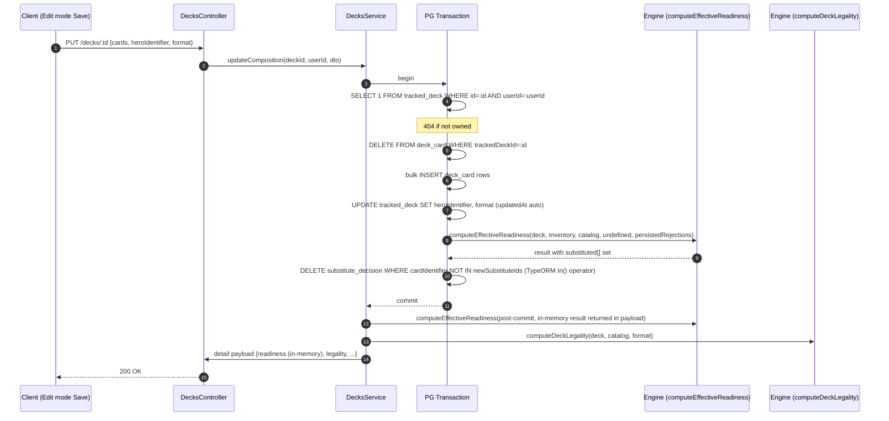
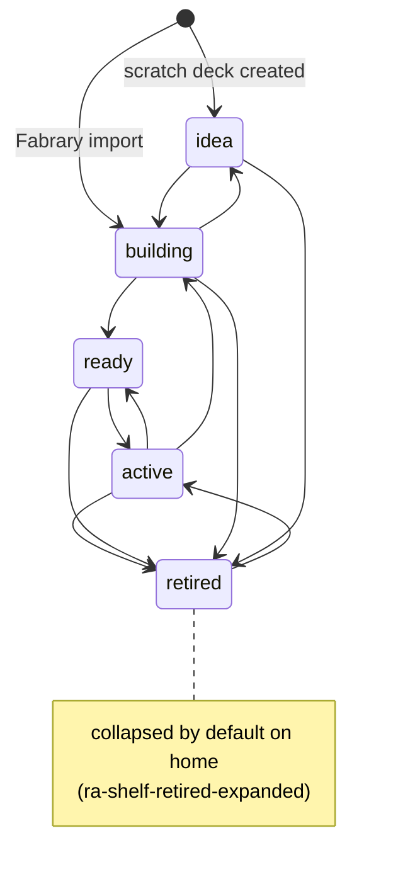
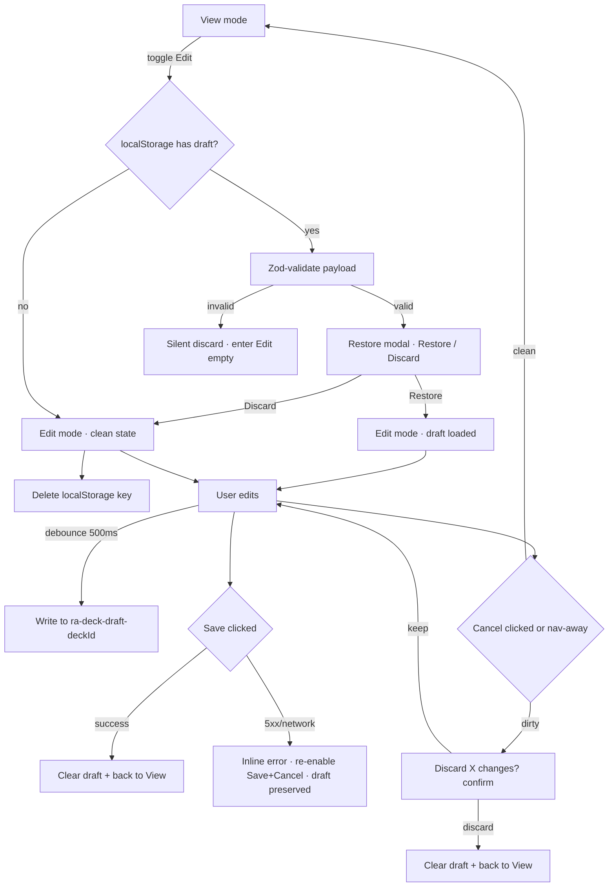

# feat: Deck Management v2 — editable decks, user categorization, detail redesign

## Summary

Reshape the deck lifecycle from system-driven and write-once into owner-edited and user-categorized: add `status` + free-form tag columns to `tracked_deck`, split deck writes into `PATCH /decks/:id` (immediate field changes) and `PUT /decks/:id` (atomic composition save, transactional, post-commit readiness/legality returned in-memory), introduce a new `packages/engine/src/legality/` module with two-layer rule sourcing for Classic Constructed / Blitz / Living Legend / Silver Age, expose a new `GET /catalog/heroes` endpoint + extend `/catalog/search` with per-card legality fields so the web app can render the HeroDropdown + Edit-mode cascade without bundling the engine, refactor `decks.$deckId.tsx` into a Library-style two-column shell with a single `<DeckCanvas mode>` component + localStorage draft persistence, extract `<DeckCardSearchAutocomplete>` from `LibrarySearchAddBar`, regroup the home around status shelves + tag filter chips, and rewrite `/decks/new` from a Fabrary-only flow into a two-card landing that supports scratch decks. Seventeen dependency-ordered implementation units (U1–U17, no phased delivery; the doc orders them so U17 lands before the U16 test pass).

---

## Problem Frame

Current Rathe Arsenal decks are write-once Fabrary imports bucketed by system-computed readiness. Trimming a card forces an external edit + reimport (losing swap decisions), users can't mark intent ("liga local", archived, draft), no scratch-deck creation exists, and the detail screen is an information-flat scroll. v2 reframes the deck as owner-edited and user-categorized, executed as a single coherent release. Full pain narrative lives in the [origin](../brainstorms/2026-05-11-v2-deck-management-requirements.md#problem-frame).

---

## Requirements

This plan carries forward the full requirement set (R1–R50) from the origin document. The R-IDs are stable and used throughout the implementation units below. Plan-local requirements:

- R-Plan-1. Every implementation unit lands as an atomic commit on a feature branch; merge-to-main is a single PR per the monolithic shape the owner selected.
- R-Plan-2. Every feature-bearing unit ships with the test scenarios listed in its `Test scenarios` block.
- R-Plan-3. The Playwright visual baselines for `home` and `decks/:id` are regenerated as part of U16; new surfaces (`/decks/new` two-path, deck-detail Edit mode) are added to the `ANON_SURFACES` / `AUTH_SURFACES` registry.
- R-Plan-4. No human gate or external validation session is part of this plan's definition of done (per [`docs/validation-philosophy.md`](../validation-philosophy.md)).

---

## Scope Boundaries

Carried verbatim from origin "Out of scope":

- Status auto-suggestion ("your deck reached 95% — mark as Ready?")
- `Duplicate as Idea` deck duplication
- `Export CSV`
- Soft-delete / archive of swap decisions (chose silent deletion per D7)
- Tag rename / tag housekeeping settings UI
- Legality support for Clash, Draft, Open, Sealed, UltimatePitFight (rejected at DTO)
- Bulk operations across multiple decks (multi-select tag, bulk status change)
- Telemetry events (until 5th non-owner active user)
- Optimistic-lock enforcement + 409 merge UI (D12 — schema in place for follow-up)
- "Active" mutual exclusivity, "main deck" concept
- Deck-detail "deckbox metaphor" visual
- Hero/format conversion as a separate guided flow

### Deferred to Follow-Up Work

- **U7-R1 broader fix** in `ReSolveService.rejectSubstitute` / `reSolveDryRun` — the R17 step 5/6 split bypasses the double engine pass for the new `PUT` path; the pre-existing concern in the reject-click code path remains open per [`docs/phase-1-followups.md`](../phase-1-followups.md). Trigger: reject-click latency > 250ms in dev-browser self-loop, OR community > 100 users.
- **Drop legacy `tracked_deck.hero` column** — kept through this plan for backward compat while callers migrate to `heroIdentifier`. Follow-up migration drops it once `pnpm grep` confirms no remaining reads.
- **Storage-prefix unification** — existing `rathe-arsenal:*` localStorage keys (jwt, theme) are not migrated to the `ra-*` prefix this plan introduces for v2 keys. Revisit when storage debt becomes painful.
- **Optimistic-lock + 409 merge UI** — D12 forward-compat schema (`tracked_deck.updatedAt`) is added now; the UI ships when community > 100 users or any overwrite incident is reported.
- **Per-user write-throttle keying for PATCH/PUT** — current global 120/min IP throttle is sufficient at beta scale (~1 user). Add `@Throttle({ default: { limit: 60, ttl: MINUTE_MS } })` keyed on `userId` (custom `ThrottlerGuard` extension) when community widens past 5 active non-owner users OR a single user reports tag/deck spam from another. Implementation in NestJS is straightforward — `getTracker(req) { return req.user.userId; }` — and ships in a single small PR.
- **Origin R8 + R23 brainstorm corrections** — surface back to the brainstorm doc: R8's "serialize on deck_tag row lock" claim is incorrect under PG READ COMMITTED (the explicit `SELECT ... FOR UPDATE` is required, per U4); R23's 2-param `computeDeckLegality` signature should be updated to 3-param `(deck, catalog, format)` to match the implementation. Both are doc-level edits, no behavior change.

---

## Context & Research

### Relevant Code and Patterns

**API**
- `apps/api/src/decks/decks.controller.ts` — current routes (`GET /decks`, `GET /decks/:deckId`, `DELETE /decks/:deckId`). Insertion point for `PATCH`, `PUT`, and new `POST /decks` scratch endpoint.
- `apps/api/src/decks/decks.service.ts` — `listForUser`, `getDetail`, `untrack` patterns. Insertion point for `updateMeta`, `updateComposition`, `createScratch`.
- `apps/api/src/decks/import/decks-import.service.ts` — **canonical transaction pattern** for v2 PUT: `dataSource.transaction(async (manager) => {...})` with `manager.create` / `manager.save` / `manager.delete` inside, and post-commit readiness compute caught with try/catch + Pino warn (failures non-fatal).
- `apps/api/src/auth/authz.service.ts` — `assertOwnsTrackedDeck` / `assertOwnsCollectionCard` use `NotFoundException` (404) for both missing and unauthorized; new `assertOwnsTag` follows this exact shape. (Note: `DecisionsService.assertOwnsDeck` uses `ForbiddenException`; that pattern is **not** the canonical one to copy.)
- `apps/api/src/auth/guards/owns-tracked-deck.guard.ts` — reads `params.trackedDeckId ?? params.deckId`; new PATCH/PUT routes use `:deckId` to align.
- `apps/api/src/decks/decisions/decisions.service.ts` — orphan-decision domain knowledge; `SubstituteDecisionEntity` is **keyed on the substitute identifier** (not the original), so R17 step 5's `DELETE … WHERE cardIdentifier NOT IN newSubstituteIds` references the substitute set.
- `apps/api/src/auth/decorators/current-user.decorator.ts` — `@CurrentUser()` returns `{ userId, email }`. Use everywhere instead of raw `@Req()`.
- `apps/api/src/database/migrations/1776621085000-ReplaceRejectedSubstituteWithDecision.ts` — `varchar + CHECK` enum pattern + `T+0/T+1000/T+2000` timestamp spacing convention; the new `tracked_deck.status` CHECK migration mirrors this verbatim.
- `apps/api/src/database/datasource.ts` — standalone datasource for CLI migration runs.
- `apps/api/src/database/entities/tracked-deck.entity.ts` — current entity shape; v2 adds `status`, `heroIdentifier`, `updatedAt`, swaps `fabraryUlid` to nullable.
- `apps/api/src/database/entities/substitute-decision.entity.ts` — `@UpdateDateColumn` precedent and varchar+CHECK precedent for `decision`.
- `apps/api/src/users/users.controller.ts` — only existing `PATCH` in the codebase (`PATCH /users/me/settings`); reference for new partial-update DTO shape.

**Engine**
- `packages/engine/src/readiness/compute.ts` — `computeEffectiveReadiness(deck, inventory, catalog, tolerance, excludedIdentifiers)`. Pure function; the PUT flow calls it twice (orphan cleanup inside transaction, snapshot insert after commit).
- `packages/engine/src/catalog/types.ts` — `ICatalogCard` currently exposes only `legalHeroes` from format-related fields; v2 extends to expose `legalFormats`, `bannedFormats`, `restrictedFormats`, `legalOverrides`, `rarity`, `young`, `specializations`.
- `packages/engine/src/catalog/catalog.ts` — `createCatalog` factory; new fields map verbatim from `@flesh-and-blood/cards` source records.
- `packages/engine/__tests__/no-framework-imports.spec.ts` — guards the pure-TS constraint; the new `legality/` module must not import from `@nestjs/*`, `react`, etc.

**Web**
- `apps/web/src/routes/_auth/-library.helpers.ts` — `validateLibrarySearch` pattern (manual `Array.isArray` + whitelist filter, not Zod). The home tag filter and the deck-detail `?edit=1` toggle reuse this shape.
- `apps/web/src/routes/_auth/decks.$deckId.tsx` — current single-column scroll; v2 refactors to a Library-style two-column shell.
- `apps/web/src/routes/_auth/decks.new.tsx` + `__tests__/-decks.new.spec.tsx` — current Fabrary-only "Track a deck" page; v2 replaces it with a two-card landing (test heading assertions update accordingly).
- `apps/web/src/components/library/LibrarySearchAddBar.tsx` — full WAI-ARIA combobox (debounce 250ms, ArrowUp/Down/Enter/Escape, `aria-controls` / `aria-expanded` / `aria-activedescendant`, click-outside, owned-quantity badge, `EMPTY_RESULTS` stable ref). U10 extracts the search/render/keyboard logic and strips the `useAddCardMutation` + `LIBRARY_QUERY_KEY` invalidation coupling.
- `apps/web/src/components/home/ReadinessShelves.tsx` — renamed to `StatusShelves` and regrouped by `status` per R9.
- `apps/web/src/components/home/PopulatedHomeHero.tsx` — `readyCount` derived from `effectivePercent >= 80` replaced by `activeLibraryCount` semantics (count of non-retired decks).
- `apps/web/src/components/deck-detail/SubstitutionRow.tsx` — accordion expand/collapse behavior from commits `dd645ab` / `6e01cdb`; extends to auto-collapse resolved swaps per R37.
- `apps/web/src/components/deck-detail/ShoppingPanel.tsx` — existing Radix Dialog mobile sheet pattern; sidebar inline expand on desktop, bottom sheet on mobile.
- `apps/web/src/components/delete-account-modal.tsx` — Radix `AlertDialog` + `requestAnimationFrame` focus-on-open precedent; the draft restore modal mirrors this.
- `apps/web/src/auth/AuthProvider.tsx` + `apps/web/src/styles/theme-init.ts` — existing `rathe-arsenal:*` localStorage keys; new v2 keys use the `ra-*` prefix per origin R16a/R34/R10.
- `apps/web/src/styles/tokens.css` — full palette already in place; v2 adds `--ra-status-{idea,building,ready,active,retired}` mapping to existing palette tokens. No new hex.
- `apps/web/src/api/decks.ts` + `apps/web/src/api/deck-detail.ts` — query key conventions (`DECKS_QUERY_KEY`, `deckDetailQueryKey`). U7 adds `TAGS_QUERY_KEY` and the PATCH/PUT/POST mutations with invalidation choreography.
- `apps/web/tests/visual/all-surfaces.spec.ts` — `ANON_SURFACES` / `AUTH_SURFACES` registry; U16 adds `/decks/new` and the deck-detail Edit-mode states.
- `apps/web/playwright.config.ts` — `visual-dark-desktop` (1440x900) + `e2e-chromium` projects; `webServer` intentionally omitted (dev server runs externally).

### Institutional Learnings

- **U7-R1** ([`docs/phase-1-followups.md`](../phase-1-followups.md)) — `ReSolveService` runs two engine passes per reject click. The v2 PUT bypasses this concern via the R17 step 5/6 split (step 5 inside transaction for orphan cleanup, step 6 outside for snapshot), **but does not resolve U7-R1** for the still-live `decisions.service.ts` reject-click path. Carried as Deferred to Follow-Up Work above.
- **`@flesh-and-blood/types` is authoritative for per-card legality** — banlists, hero "living legend" promotions, set rotations arrive via `pnpm update @flesh-and-blood/cards @flesh-and-blood/types`. The plan's legality engine reads `legalFormats`, `bannedFormats`, `legalOverrides`, `legalHeroes`, `rarity`, `young`, `specializations` directly; no manual transcription beyond the structural `rules.ts` constants file.
- **`varchar + CHECK` over native Postgres enum** is the project convention (`substitute_decision.decision` precedent). Cheap to evolve (`'idea','building','ready','active','retired'`) without a drop-and-recreate.
- **Visual regression suite is self-validation, not CI-gated** — `pnpm --filter @rathe-arsenal/web test:visual:update` regenerates baselines locally; U16 commits the regenerated PNGs alongside the implementation.
- **`.impeccable.md`** — `.ra-readiness-display` (Cinzel Decorative 900 brass) is reserved for `effectivePercent` and `ReadinessHero`; **not** for status labels or tag chips. Parchment is not a UI surface. No raw hex outside `tokens.css`.

### External References

- LSS Tournament Rules and Policy — [rules.fabtcg.com/en/trp/07-constructed-formats](https://rules.fabtcg.com/en/trp/07-constructed-formats/) (source of truth for `legality/rules.ts`)
- Per-format LSS rule pages: [classic-constructed](https://fabtcg.com/gameplay-formats/classic-constructed/), [blitz](https://fabtcg.com/gameplay-formats/blitz/), [official-blitz-update](https://fabtcg.com/articles/official-blitz-update/), [living-legend](https://fabtcg.com/living-legend/), [silver-age](https://fabtcg.com/gameplay-formats/silver-age/)
- TanStack Router `validateSearch` typed search params — used as in `_auth/-library.helpers.ts`

---

## Key Technical Decisions

- **6 sequential migration files in one logical sequence**: status column add → heroIdentifier column add → updatedAt column add (with `"updatedAt" = "trackedAt"` backfill) → tag tables (deck_tag + tracked_deck_tag) → fabraryUlid nullable + partial unique index swap → heroIdentifier value backfill (with pre-flight abort on unresolved hero names). Rationale: each step independently reversible via `down()`, matches the project's fine-grained migration cadence, and isolates the only abort-capable step (the value backfill) into its own file so retry is cheap.

- **Single `<DeckCanvas mode="view" | "edit">` component** (resolves origin "Deferred to planning" Q2). Rationale: slot grouping, section diamond rendering, and slot-icon row layout are identical across modes; mode prop is driven by `?edit=1` search param; transitions are non-animated swaps, not lifecycle-heavy. Avoids duplicating ~200 lines of slot/section logic across sibling components. **Implementation file is `apps/web/src/components/deck-detail/DeckCanvas.tsx`** (NOT separate `DeckCanvasView.tsx` + `DeckCanvasEdit.tsx`); the per-mode bodies live in two internal sub-components (`<ViewBody>` / `<EditBody>`) inside the same file, sharing the slot-grouping helper. Both modes import the same slot-icon, diamond-color, and slot-section primitives from the file scope.

- **Install `@radix-ui/react-select` for the status dropdown** to satisfy R19b's listbox-semantics requirement (status selection is value selection, not actions/navigation, so Radix's Select — which renders the trigger as `aria-haspopup="listbox"` with the popup carrying `role="listbox"` and items `role="option"` — is the semantically-correct primitive). Rationale: the already-installed `@radix-ui/react-dropdown-menu` would force `role="menu"` semantics on the trigger, requiring role overrides that fight Radix's own ARIA wiring. Adding `react-select` is ~7kb (gzipped, tree-shaken) and a one-time cost. **Install command is part of U8 — `pnpm --filter @rathe-arsenal/web add @radix-ui/react-select` runs before any TS file in U8 is written; the resulting `apps/web/package.json` + `pnpm-lock.yaml` diff is part of the U8 commit.**

- **`<TagAutocompleteCombobox>` built standalone from the `<DeckCardSearchAutocomplete>` ARIA combobox pattern** (vs. abstracting a shared base). Rationale: data shape (`string[]` of ≤200 tags client-side vs. `ICatalogCard[]` of ~17k entries server-side debounced), result rendering (text-only chip vs. card-with-thumb-and-quantity), and mutation handler ("Create [typed]" + attach vs. add-to-collection) diverge enough that a shared abstraction would be a leaky wrapper over two separate concerns.

- **`legality.category: 'legal' | 'incomplete' | 'illegal'`** (not boolean). Rationale: origin R25 explicitly distinguishes Incomplete (progress state, neutral muted-brass chip — typical for scratch decks mid-build) from Illegal (rule violation, red-muted chip). Boolean conflates them; three-state enum surfaces the distinction in the API payload and lets the badge render visuals from the same field that drives the engine result.

- **Test scope folded into per-unit `Test scenarios`** plus one dedicated unit (U16) for E2E + visual regression baseline updates. Rationale: matches the project's TDD posture ([`~/.claude-personal/CLAUDE.md`](~/.claude-personal/CLAUDE.md) — automated tests are first-class validation); a single "tests at the end" unit drifts from the unit it tests. E2E/visual are unit-spanning by nature and earn a separate U.

- **localStorage `ra-*` prefix for new v2 keys** (`ra-deck-draft-{deckId}`, `ra-deck-sidebar-expanded`, `ra-shelf-retired-expanded`). Rationale: origin R16a/R34/R10 use this prefix consistently. Existing `rathe-arsenal:*` keys (jwt, theme) stay unchanged. Drift flagged under Deferred to Follow-Up Work.

- **Status tokens layer onto existing palette**: `--ra-status-idea: var(--ra-fg-muted)`, `--ra-status-building: var(--ra-accent-dim)`, `--ra-status-ready: var(--ra-accent)`, `--ra-status-active: var(--ra-ready-high)`, `--ra-status-retired: var(--ra-fg-subtle)`. Rationale: `.impeccable.md` forbids new hex; aliasing introduces semantic naming without expanding the palette.

- **Draft persistence debounce 500ms** (carry from brainstorm Q3 default). Rationale: 500ms is fast enough that a tab-close mid-edit loses at most one keystroke flurry, slow enough that rapid typing doesn't thrash localStorage I/O. Tunable post-implementation if dev-browser self-loop reveals lag.

- **`HeroIdentifierExistsInCatalog` class-validator decorator wires the catalog singleton via constructor DI** (vs. importing the singleton statically). Rationale: matches NestJS dependency conventions and lets unit tests inject a mock catalog. Singleton import works at runtime but is harder to test in isolation.

- **API response carries denormalized `tags: readonly string[]` (names) on list + detail** (per origin R12a). Rationale: avoids an N+1 round-trip from the frontend to resolve tag IDs to names; the list endpoint joins once. Mutations (PATCH `addTagIds` / `removeTagIds`) still operate on IDs server-side.

- **`POST /decks` (scratch) is a dedicated endpoint** (vs. extending `POST /decks/import` with a nullable URL field). Rationale: import and scratch creation diverge on input shape (URL vs. hero+format), validation, and response semantics. Two endpoints is simpler than one mode-switched endpoint.

- **`computeDeckLegality(deck, catalog, format)` is a 3-parameter function** — `format` is an explicit argument so the Edit-mode cascade can probe legality against a *candidate* format different from the persisted one before Save. The origin spec (R23) lists a 2-param signature; the plan supersedes it. The 3-param form lets the same function back the server-side post-commit legality compute (where `format = deck.format`) and the client-side cascade panel (where `format = draftFormat`). When R23 is next edited in the brainstorm, the signature should be aligned to match.

- **HeroDropdown + cascade legality reads come from a new `GET /catalog/heroes` API endpoint, not from importing the engine on the web** — `@rathe-arsenal/engine` is server-only and `@flesh-and-blood/cards` is ~8.9MB uncompressed; bundling either client-side is unacceptable. The new endpoint returns a slim hero record set (`{ cardIdentifier, name, young, legalFormats, imageUrl }`) cached client-side via TanStack Query (`HEROES_QUERY_KEY`). The cascade per-card check uses three card fields (`legalFormats`, `legalHeroes`, `bannedFormats`) which the existing `GET /catalog/search` response is extended to surface — no engine bundle required. `computeDeckLegality` runs **only** server-side (in U6 PUT post-commit); the client never imports it.

- **PUT step 6 (post-commit snapshot) failure returns the in-memory readiness result in the response payload** — instead of relying on the (now-stale) snapshot row from `GET /decks/:id`, the service returns the engine result computed in-memory after commit. If the snapshot DB insert fails, the response is still authoritative; the snapshot table catches up on the next read or PUT. This avoids the "saved successfully but UI shows stale readiness" trap the import service's pattern would otherwise inherit.

- **LegalityBadge is inert (no popover trigger) when `category === 'legal'`** — the badge renders as a static chip with check icon. The popover-trigger affordance and `aria-haspopup="dialog"` only apply for `incomplete` and `illegal` (where there is information worth surfacing). Rationale: a "Deck is legal" popover with no further detail is empty content, and rendering the badge as a button at all-good state would mislead keyboard users into expecting more.

---

## Open Questions

### Resolved During Planning

- **Migration ordering** (origin Deferred to planning) → 6 files in T+0/T+1000/T+2000/... sequence per Key Technical Decisions above.
- **Component decomposition for editable canvas** (origin Deferred to planning) → single `<DeckCanvas mode>` component (one file `apps/web/src/components/deck-detail/DeckCanvas.tsx` with internal `<ViewBody>` / `<EditBody>` sub-components) per Key Technical Decisions.
- **Draft debounce window** (origin Deferred to planning) → 500ms.
- **Telemetry transport** (origin Deferred to planning) → out of scope per origin Telemetry section.
- **Status dropdown implementation** → `@radix-ui/react-select` (added to `apps/web/package.json` in U8 before any TS file is written) per Key Technical Decisions.
- **Tag autocomplete reuse** → standalone component per Key Technical Decisions (user-confirmed in synthesis).
- **`computeDeckLegality` signature** → 3-parameter form `(deck, catalog, format)` per Key Technical Decisions. Origin R23 will be aligned in a follow-up brainstorm edit.
- **HeroDropdown + cascade per-card legality data source** → new `GET /catalog/heroes` endpoint + extended `GET /catalog/search` response (adds `legalFormats`, `legalHeroes`, `bannedFormats` per card) per Key Technical Decisions. Web does NOT import `@rathe-arsenal/engine` or `@flesh-and-blood/cards`.
- **PUT post-commit snapshot failure UX** → response carries the in-memory readiness result; snapshot table is best-effort. Per Key Technical Decisions.
- **LegalityBadge legal-state interaction** → inert chip (no popover) when `category === 'legal'`. Per Key Technical Decisions.
- **Hero/format cascade location on mobile (<1280px) Edit** → cascade warning panel becomes a sticky banner at the top of the canvas (above the autocomplete); hero + format dropdowns become inline form fields directly above the autocomplete in the canvas. Sidebar stays hidden per R43. Spelled out in U12.
- **Discard-changes confirm dialog** → button labels are `Discard changes` (destructive, on the right) + `Keep editing` (safe default focus, on the left); `X` resolves to a literal count of net-changed entities (cards added/removed/qty-changed + hero swap + format swap, summed). Spelled out in U13.
- **Home `legality.category === 'incomplete'` icon** → renders as `✗` (same as `illegal`) on the home deck card, since R26 specifies a 2-state icon (✓ / ✗). Detail surface still distinguishes all three states via `LegalityBadge`. Spelled out in U9 + U14.

### Deferred to Implementation

- **N > 5 cascade threshold rationale** (origin Notes) — accept brainstorm heuristic; tune if dev-browser self-loop shows false positives.
- **Mobile header overflow when many tags + status dropdown + Edit button compete on small viewport** (origin Notes) — U11 visual designer iterates during implementation; defer to dev-browser screenshot review.
- **Implicit tag-deletion warning tooltip on the last-attached chip** (origin Notes) — UX nice-to-have, not blocking; revisit after dev-browser self-loop.
- **Per-user `tracked_deck` count cap** (origin Notes) — not v2 scope; revisit when community widens.
- **Throttler IP-vs-user keying clarification** (origin Notes) — existing global throttler config governs; explicit per-route keying not required for v2 endpoints.
- **`legality/` module file layout** (origin Notes) — subdirectory vs. single file; implementer decides based on rules.ts size (estimated ~150 lines + compute.ts ~120 + types.ts ~40, so subdirectory recommended).

---

## High-Level Technical Design

> *This illustrates the intended approach and is directional guidance for review, not implementation specification. The implementing agent should treat it as context, not code to reproduce.*

### PUT /decks/:id transactional shape (R17 + KTD orphan-cleanup split)

Note: step 5 (engine pass inside the transaction) is unavoidable because orphan-decision cleanup needs the new substitute set computed against the just-inserted `deck_card` rows. Step 6 (snapshot) runs after commit per origin R17 — eliminates the lock-holding-across-two-passes concern adversarial review raised in r2.

### Status state machine (no transitions are enforced server-side per D3)

All transitions are user-driven, equally legal. The diagram exists for reviewer mental-model only; no server-side state-machine enforcement (D3).

### Save flow + draft persistence interaction (R16a + R16b)

---

## Implementation Units

### U1. Schema migrations + TypeORM entities

**Goal:** Add `status`, `heroIdentifier`, `updatedAt` columns to `tracked_deck`; create `deck_tag` + `tracked_deck_tag` tables; swap `fabraryUlid` to nullable with partial unique index; backfill `heroIdentifier` with pre-flight abort. Update TypeORM entities + `DatabaseModule` registrations.

**Requirements:** R1, R2, R5, R8 (schema), R12a (entity shape), R24a (heroIdentifier + backfill), D8 (fabraryUlid nullable + partial index), D12 (updatedAt forward-compat).

**Dependencies:** None.

**Files:**
- Create: `apps/api/src/database/migrations/<T+0>-AddTrackedDeckStatusColumn.ts`
- Create: `apps/api/src/database/migrations/<T+1000>-AddTrackedDeckHeroIdentifierColumn.ts`
- Create: `apps/api/src/database/migrations/<T+2000>-AddTrackedDeckUpdatedAtColumn.ts`
- Create: `apps/api/src/database/migrations/<T+3000>-AddDeckTagsAndJoinTables.ts`
- Create: `apps/api/src/database/migrations/<T+4000>-MakeTrackedDeckFabraryUlidNullable.ts`
- Create: `apps/api/src/database/migrations/<T+5000>-BackfillTrackedDeckHeroIdentifier.ts`
- Create: `apps/api/src/database/entities/deck-tag.entity.ts`
- Create: `apps/api/src/database/entities/tracked-deck-tag.entity.ts`
- Modify: `apps/api/src/database/entities/tracked-deck.entity.ts` (add columns; swap `fabraryUlid` to nullable; **update class-level `@Index` to partial form** — `@Index(['userId', 'fabraryUlid'], { unique: true, where: '"fabraryUlid" IS NOT NULL' })` — so TypeORM `schema:log` matches the migration's partial unique index)
- Modify: `apps/api/src/decks/import/decks-import.service.ts` (set `heroIdentifier: deck.hero.cardIdentifier` in the `manager.create(TrackedDeckEntity, {...})` call so new Fabrary imports populate the column going forward — the Fabrary GraphQL response already returns `hero { cardIdentifier name }`)
- Modify: `apps/api/src/decks/import/__tests__/decks-import.service.spec.ts` (assert that imported decks have `heroIdentifier` set to the catalog identifier, not just `hero` display name)
- Modify: `apps/api/src/database/database.module.ts` (register new entities)
- Modify: `apps/api/src/database/datasource.ts` (entities array)
- Test: `apps/api/src/database/__tests__/migrations.spec.ts` (smoke — entity definitions parse + decorator metadata matches)

**Approach:**
- Status column: `varchar NOT NULL DEFAULT 'building'` + named CHECK constraint `CHK_tracked_deck_status_valid` enforcing the 5-value set. R2 flat default — all existing rows land at `'building'` regardless of `effectivePercent`.
- HeroIdentifier column: nullable to tolerate post-migration unmatched names (origin R24a) and to give the heroIdentifier-backfill migration somewhere to write.
- UpdatedAt column: `@UpdateDateColumn({ type: 'timestamptz' })` mirroring `SubstituteDecisionEntity`. Backfill `SET "updatedAt" = "trackedAt"` for existing rows so the column is non-null from day one.
- Tag tables: `deck_tag (id serial PK, userId uuid NOT NULL, name varchar(24) NOT NULL, createdAt timestamptz)` + unique index on `(userId, LOWER(name))`. `tracked_deck_tag (trackedDeckId, tagId, attachedAt)` with FK CASCADE on both sides + unique index on `(trackedDeckId, tagId)`.
- fabraryUlid swap: drop the existing unique index, alter column to nullable, create new partial unique index `WHERE fabraryUlid IS NOT NULL`. Keep the column type unchanged.
- HeroIdentifier backfill: pre-flight `SELECT DISTINCT hero FROM tracked_deck WHERE hero IS NOT NULL AND heroIdentifier IS NULL` and resolve each against `catalog.indices.byName` with `types.includes(Type.Hero)` disambiguation. **For each unresolved name, log a warning (`Pino warn` with the unresolved value) and skip that row's backfill — leave `heroIdentifier = NULL`.** Do NOT throw. Rationale: `database.module.ts` sets `migrationsRun: !isDev`, meaning a thrown migration aborts the NestJS boot in production — turning a single dirty row into a hard outage. The legality engine already treats `heroIdentifier IS NULL` as `category: 'illegal'` with a user-actionable reason ("Hero not recognized — please re-select in Edit mode"), so the failure mode is graceful and visible at the UI layer rather than at deploy time. Owner reviews the warn logs after deploy and either edits the affected rows in DB or asks the user to re-select the hero in Edit mode. Once resolved rows match, `UPDATE tracked_deck SET heroIdentifier = :mapped WHERE id = :id` per row inside the migration's queryRunner.
- **Engine build prerequisite**: T+5000 imports `catalog` from `@rathe-arsenal/engine`. The CLI migration runner uses `dist/database/datasource.js`, which transitively requires the engine package's compiled output. The migration runbook (Documentation / Operational Notes section below) requires `pnpm --filter @rathe-arsenal/engine build` to run before `migration:run` is invoked. Document this prerequisite in the migration's header comment as well.

**Patterns to follow:**
- `apps/api/src/database/migrations/1776621085000-ReplaceRejectedSubstituteWithDecision.ts` — varchar+CHECK + T+0/T+1000/T+2000 timestamp spacing.
- `apps/api/src/database/entities/substitute-decision.entity.ts` — `@UpdateDateColumn` + named CHECK precedent.

**Test scenarios:**
- Happy path: a fresh DB runs all 6 migrations clean; `tracked_deck.status='building'` on every pre-existing row.
- Happy path: heroIdentifier backfill resolves "Dorinthea Ironsong" → `dorinthea-ironsong` (its catalog cardIdentifier).
- Happy path: a Fabrary import after migration sets `tracked_deck.heroIdentifier` from the GraphQL `hero.cardIdentifier` field (covers the `decks-import.service.ts` modification).
- Error path: heroIdentifier backfill encounters an unresolved name → row is logged as warning and left with `heroIdentifier = NULL`; the migration completes successfully and the app boots; subsequent `GET /decks/:id` returns `legality.category='illegal'` with the documented reason for that deck.
- Edge case: fabraryUlid nullable swap on a table with mixed null/non-null fabraryUlid values respects the partial unique index (two scratch decks per user with NULL fabraryUlid don't violate the constraint).
- Edge case: TypeORM `@Index(['userId', 'fabraryUlid'], { unique: true, where: '"fabraryUlid" IS NOT NULL' })` decorator is in sync with the migration's partial index — `schema:log` returns zero pending changes (otherwise the entity decorator and the DB drift forever).
- Integration: entity-decorator metadata + migration schema match (TypeORM `schema:log` shows zero pending changes after migrations applied).

**Verification:** All 6 migrations run cleanly against a fresh DB and against a copy of the dev DB. `pnpm --filter @rathe-arsenal/api typeorm schema:log` reports no drift.

---

### U2. Legality engine + catalog field extension

**Goal:** Extend `ICatalogCard` with format-related fields from `@flesh-and-blood/types`; create `packages/engine/src/legality/` module with `rules.ts` (FORMAT_RULES constants for 4 supported formats) + `compute.ts` (`computeDeckLegality` returning `{ category, reasons }`) + `types.ts`.

**Requirements:** R23, R23a, R24, R24a (hero compatibility check).

**Dependencies:** None (engine-only, no DB).

**Files:**
- Modify: `packages/engine/src/catalog/types.ts` (extend `ICatalogCard` with `legalFormats`, `bannedFormats`, `restrictedFormats?`, `legalOverrides?`, `rarity`, `young?`, `specializations?`; **also extend the re-export block at the top of the file** — currently exports `Class, Hero, Keyword, Talent, Type` from `@flesh-and-blood/types`; add `Format`, `Rarity`, and `LegalOverride` so `legality/` can consume the upstream enum types directly)
- Modify: `packages/engine/src/catalog/catalog.ts` (extend `normalizeCard` with explicit named mappings + `Object.freeze` per existing pattern — see Approach below)
- Create: `packages/engine/src/legality/types.ts` (`TSupportedFormat`, `IFormatRules`, `IDeckLegalityResult`, `TLegalityCategory`)
- Create: `packages/engine/src/legality/rules.ts` (`FORMAT_RULES: Record<TSupportedFormat, IFormatRules>`)
- Create: `packages/engine/src/legality/compute.ts` (`computeDeckLegality(deck, catalog, format): IDeckLegalityResult` — 3-parameter signature per Key Technical Decisions)
- Create: `packages/engine/src/legality/index.ts` (barrel)
- Modify: `packages/engine/src/index.ts` (re-export legality module)
- Test: `packages/engine/__tests__/legality/compute.spec.ts`
- Test: `packages/engine/__tests__/legality/rules.spec.ts`

**Approach:**
- Catalog re-exports: add `Format`, `Rarity`, `LegalOverride` to the import + re-export block in `packages/engine/src/catalog/types.ts`. The legality module imports these from `@rathe-arsenal/engine` (via the catalog barrel), not from `@flesh-and-blood/types` directly, so the engine package keeps its dependency surface coherent.
- Catalog extension is a verbatim mapping from `@flesh-and-blood/types` Card record fields, but `normalizeCard` enumerates each field explicitly (matches the existing factory pattern — the existing `normalizeCard` does NOT spread, it builds a frozen object from named fields). Add 7 new mappings: `legalFormats: Object.freeze(raw.legalFormats ?? [])`, `bannedFormats: Object.freeze(raw.bannedFormats ?? [])`, `restrictedFormats: raw.restrictedFormats ? Object.freeze(raw.restrictedFormats) : undefined`, `legalOverrides: raw.legalOverrides ? Object.freeze(raw.legalOverrides) : undefined`, `rarity: raw.rarity`, `young: raw.young ?? false` (upstream is `true | undefined` for hero records — coerce to boolean), `specializations: raw.specializations ? Object.freeze(raw.specializations) : undefined`. Also extend the file's `IRawCard` interface with the same 7 fields. Run `pnpm --filter @rathe-arsenal/engine test` after the change — `gold-set-regression.spec.ts` catches behavioral drift.
- `rules.ts` is a frozen `Record<TSupportedFormat, IFormatRules>` literal sourced verbatim from origin R24 with LSS URL strings in the `source` field. Manually updated when LSS publishes a structural rule change (≤1×/year cadence).
- `compute.ts` implements the 7-step verdict logic from origin R24 sequentially. Hero requirement first (cheap fail), then card-pool total, then mainboard-size-vs-format (this is the `incomplete` branch — under minimum on CC/LL or != exact on Blitz/SA), then copy limits (with rarity-aware Legendary cap), then per-card legality (`legalFormats.includes(format) && !bannedFormats?.includes(format) && (legalHeroes.includes(hero) || legalOverrides matches || specializations.includes(hero))`), then Silver Age rarity whitelist, then `'legal'`.
- `reasons` is `readonly string[]` (plain human-readable strings). First reason becomes the badge subtitle in R25.

**Patterns to follow:**
- `packages/engine/src/readiness/compute.ts` — pure function, no async, immutable inputs, frozen output literal.
- `packages/engine/__tests__/no-framework-imports.spec.ts` — guards the pure-TS constraint; the new module obeys.

**Test scenarios:**
- Happy path (CC): hero `dorinthea-ironsong` (non-young, CC-legal — verified via `@flesh-and-blood/cards@^3.6.243`: `legalFormats: ['Classic Constructed', 'Living Legend', 'Open']`) + 60 mainboard cards under 80-card pool max, all legal-in-format, no copy exceedances → `category: 'legal'`.
- Happy path (Blitz singleton): hero `kayo-berserker-runt` (young, Blitz-legal — `legalFormats: ['Blitz', 'Clash', 'Open', 'Silver Age', 'Ultimate Pit Fight']`, `young: true`) + 40 cards with each `cardIdentifier` appearing exactly once → `'legal'`.
- Happy path (Silver Age): hero `kayo-berserker-runt` (young + Silver-Age-legal) + 40 cards all rarity ∈ {Common, Rare, Basic}, 2 max copies, all with `legalFormats.includes('Silver Age')` → `'legal'`.
- Edge case: 58/60 cards on CC → `'incomplete'` with reason mentioning the count.
- Edge case: empty deck (hero only, 0 mainboard) → `'incomplete'` (not `'illegal'`) — hero passes step 1, mainboard count fails step 3 incomplete branch.
- Error path: 4× non-legendary card on CC → `'illegal'`, reason names the card.
- Error path: young hero on CC → `'illegal'`, reason mentions hero requirement (step 1 fail).
- Error path: legendary card 2× on any format → `'illegal'`.
- Error path: banlisted card (per `bannedFormats.includes(format)`) → `'illegal'`.
- Error path: card with `legalHeroes` not including the deck's hero AND no matching `legalOverrides` → `'illegal'` ("Card X not legal with hero Y").
- Error path: Silver Age deck with a Majestic-rarity card → `'illegal'` (rarity whitelist violation).
- Error path: hero `briar-warden-of-thorns` (LL-only — `legalFormats: ['Living Legend', 'Open']`) + format `'Classic Constructed'` → `'illegal'` (step 1 hero requirement fail) — protects against future regressions where someone tests CC with a non-CC hero and expects incomplete.
- Integration: deck with heroIdentifier=NULL → `'illegal'` with reason "Hero not recognized — please re-select in Edit mode" (origin R24a).
- Integration: changing format on a CC-legal deck (hero `dorinthea-ironsong`, 60 cards) from CC → LL → both formats are legal for Dorinthea, deck stays `'legal'` (covers the legitimate "format swap on a multi-format hero" path).
- Integration: changing format on a CC-legal deck from CC → Blitz fails step 1 (hero not young) → `'illegal'` with hero-requirement reason. (Documents that a hero-requirement failure short-circuits before pool-max or mainboard-size checks; "incomplete" is unreachable when hero is already wrong.)

**Verification:** All test scenarios green. `pnpm --filter @rathe-arsenal/engine test` passes. `no-framework-imports.spec.ts` reports no leak.

---

### U3. AuthzService.assertOwnsTag + Tag CRUD endpoints

**Goal:** Add `assertOwnsTag` to `AuthzService` following the NotFoundException pattern. Create `TagsController` + `TagsService` exposing `GET /tags`, `POST /tags`, `DELETE /tags/:id` with ownership scoping, 200-tag-per-user hard cap, and 30/min throttle on `POST /tags`.

**Requirements:** R3a, R5 (200-cap + name validation + 30/min throttle).

**Dependencies:** U1 (DeckTagEntity).

**Files:**
- Modify: `apps/api/src/auth/authz.service.ts` (add `assertOwnsTag` — uses `@InjectRepository(DeckTagEntity)` matching the existing `assertOwnsTrackedDeck` / `assertOwnsCollectionCard` pattern)
- Modify: `apps/api/src/auth/auth.module.ts` (extend the existing `TypeOrmModule.forFeature([...])` array with `DeckTagEntity` — direct registration, NOT importing from `TagsModule`, to avoid an `AuthModule ↔ TagsModule` circular dependency since `TagsModule` will need to consume `AuthzService`)
- Create: `apps/api/src/tags/tags.module.ts`
- Create: `apps/api/src/tags/tags.controller.ts`
- Create: `apps/api/src/tags/tags.service.ts`
- Create: `apps/api/src/tags/dto/create-tag.dto.ts`
- Create: `apps/api/src/tags/dto/tag-response.dto.ts`
- Modify: `apps/api/src/app.module.ts` (register `TagsModule`)
- Test: `apps/api/src/tags/__tests__/tags.service.spec.ts`
- Test: `apps/api/src/tags/__tests__/tags.controller.int-spec.ts`
- Test: `apps/api/src/auth/__tests__/authz.service.spec.ts` (extend with assertOwnsTag cases)

**Approach:**
- `assertOwnsTag(userId, tagId)` queries `deck_tag` and throws `NotFoundException('Tag not found')` if absent or `tag.userId !== userId`. Logs `AUTHZ_DENIED` with `resource: 'DeckTag'` like the existing assertions.
- `POST /tags` DTO: `{ name }` only. `userId` always derived from JWT, never accepted from body. Validators: `@IsString()`, `@MaxLength(24)`, `@Matches(/^[\p{L}\p{N}\s\-_.,!?]+$/u)`. Server checks 200-cap before insert; reject with 422 + friendly message on overflow.
- `DELETE /tags/:id` invokes `assertOwnsTag` then `DELETE FROM deck_tag WHERE id = :id AND userId = :userId`. Cascade deletes the join rows via FK.
- `GET /tags` returns `WHERE userId = :userId ORDER BY LOWER(name)`.
- `POST /tags` rate-limited via `@Throttle({ default: { limit: 30, ttl: MINUTE_MS } })` on top of the existing global 120/min.

**Patterns to follow:**
- `apps/api/src/auth/authz.service.ts` (existing `assertOwnsTrackedDeck` / `assertOwnsCollectionCard`) — exact shape, NotFoundException.
- `apps/api/src/auth/auth.controller.ts` `@Throttle` usage for the 30/min limit.
- `apps/api/src/users/users.controller.ts` DTO + partial-update DTO style.

**Test scenarios:**
- Happy path: `POST /tags { name: "liga local" }` → 201 with `{ id, name, createdAt }`.
- Happy path: `GET /tags` returns only the current user's tags.
- Happy path: `DELETE /tags/:id` on owned tag → 204; the row is gone.
- Edge case: case-insensitive name uniqueness — `POST` "Liga Local" after "liga local" exists → 409 conflict (or 422 — match existing project convention).
- Edge case: 201st tag for a user → 422 with friendly message.
- Edge case: name with accented characters ("café") → 201 (regex includes `\p{L}`).
- Edge case: name with `<script>` payload → 400 (regex rejects `<`).
- Edge case: name 25 chars → 400 (`@MaxLength(24)` rejects).
- Error path: `DELETE /tags/:id` on a tag owned by another user → 404 (not 403).
- Error path: `POST /tags` with no name → 400 from class-validator.
- Integration: 31st `POST /tags` within 60s from one user → 429.
- Integration: tag rows survive deck deletion (decks have CASCADE on the join, not on the tag itself) — but if the deleted deck was the only attachment, U4's implicit-deletion logic runs (covered in U4 tests).

**Verification:** All integration + unit tests green; `pnpm --filter @rathe-arsenal/api test` + `test:int` pass.

---

### U4. PATCH /decks/:id endpoint (status, name, tag attach/detach)

**Goal:** New `PATCH /decks/:id` accepting `{ status?, name?, addTagIds?, removeTagIds? }`. Each field is independent and partial. Tag references validated against the current user. Implicit tag deletion when the last attachment is removed, using the TOCTOU-safe delete-count-conditional-delete sequence from origin R8.

**Requirements:** R3 (PATCH contract), R8 (TOCTOU-safe implicit deletion), R12a (response shape including new fields).

**Dependencies:** U1 (entities), U3 (tag ownership service).

**Files:**
- Modify: `apps/api/src/decks/decks.controller.ts` (add PATCH route)
- Modify: `apps/api/src/decks/decks.service.ts` (add `updateMeta` method)
- Create: `apps/api/src/decks/dto/update-deck-meta.dto.ts`
- Modify: `apps/api/src/decks/dto/tracked-deck-response.dto.ts` (add `status`, `tags`, `updatedAt`)
- Test: `apps/api/src/decks/__tests__/decks.service.update-meta.spec.ts`
- Test: `apps/api/src/decks/__tests__/decks.controller.patch.int-spec.ts`

**Approach:**
- Controller route: `@Patch(':deckId')` guarded by `OwnsTrackedDeckGuard`. Body validated against the DTO.
- DTO: all fields `@IsOptional()`. `status` validated by `@IsIn(['idea','building','ready','active','retired'])`. `name` validated by `@IsString() @MaxLength(120)` (concrete cap chosen to fit typical deck names plus annotation room — `TrackedDeckEntity.name` currently has no length constraint, so this DTO is the only enforcement layer). `addTagIds` / `removeTagIds` are `@IsArray() @ArrayMaxSize(50) @IsInt({each: true})`.
- Service `updateMeta` runs inside `dataSource.transaction`. **All `assertOwnsTag` calls happen INSIDE the same transaction** (not as pre-flight) so tag ownership cannot change between check and insert. For each provided field: status → simple `UPDATE`. Name → simple `UPDATE`. addTagIds → for each id, `await this.authzService.assertOwnsTag(userId, tagId, manager)` (passing the transaction's `EntityManager` so the lookup uses the same connection — extend `assertOwnsTag` signature in U3 if needed), then INSERT into `tracked_deck_tag` IGNORE-on-conflict. removeTagIds → for each id, the **TOCTOU-safe** sequence inside the transaction:
  1. `SELECT id FROM deck_tag WHERE id = :tagId AND userId = :userId FOR UPDATE` — acquires a row lock on `deck_tag` so concurrent transactions targeting the same tag serialize on this row (matches the brainstorm R8 intent; the brainstorm's claim that "the deck_tag row lock" is acquired implicitly is incorrect under PG READ COMMITTED — the explicit `FOR UPDATE` is required).
  2. `DELETE FROM tracked_deck_tag WHERE trackedDeckId = :id AND tagId = :tagId`.
  3. `SELECT COUNT(*) FROM tracked_deck_tag WHERE tagId = :tagId` (now safe — the lock acquired in step 1 prevents another transaction from observing this same `deck_tag` row in a count window).
  4. If count = 0, `DELETE FROM deck_tag WHERE id = :tagId AND userId = :userId` (defensive userId scope per R8).
  Note: surface this correction back to the brainstorm R8 prose in a follow-up edit.
- Response: full detail payload re-fetched after commit, shape matching `GET /decks/:id`.

**Patterns to follow:**
- `apps/api/src/users/users.controller.ts` for PATCH partial-update DTO shape.
- `apps/api/src/decks/import/decks-import.service.ts` for `dataSource.transaction` usage.

**Test scenarios:**
- Happy path: PATCH `{ status: 'active' }` → 200 with updated status.
- Happy path: PATCH `{ name: 'New name' }` → 200 with updated name.
- Happy path: PATCH `{ addTagIds: [1, 2] }` → 200, deck.tags includes both names.
- Happy path: PATCH `{ removeTagIds: [3] }` where tag 3 has 1 remaining attachment → 200, deck_tag row 3 is gone.
- Happy path: PATCH `{ status: 'ready', name: 'X', addTagIds: [1], removeTagIds: [2] }` (all four fields) → 200, atomic.
- Edge case: PATCH `{ addTagIds: [1, 1] }` → 200, single attachment (IGNORE-on-conflict).
- Edge case: removing a tag with 2+ attachments leaves the tag row intact.
- Edge case (cross-deck TOCTOU): two concurrent PATCHes each removing the last attachment of the SAME tag from DIFFERENT decks. Both transactions execute the `SELECT ... FOR UPDATE` on `deck_tag.id = :sharedTagId`. One acquires the lock first, completes its 4-step sequence (deletes the tag row), then commits and releases. The second transaction's `FOR UPDATE` returns 0 rows because the tag was already deleted — the service treats this as a no-op (the second tag-detach succeeded against a tag whose container row is already gone, which is the desired terminal state). The integration test asserts: (a) the `tracked_deck_tag` rows are both deleted, (b) the `deck_tag` row is deleted exactly once, (c) the second transaction does NOT throw a foreign-key panic.
- Edge case (same-tag-same-deck): `PATCH { removeTagIds: [3, 3] }` (duplicate id) — the FOR UPDATE + count sequence runs idempotently; the second iteration sees count=0 because the first iteration already removed the row, no-ops.
- Edge case: PATCH `{ name: 'a'.repeat(121) }` → 400 from class-validator (`@MaxLength(120)`).
- Error path: PATCH with `addTagIds: [<id of another user's tag>]` → 404 (NotFound per R3 final paragraph).
- Error path: PATCH with `status: 'archived'` → 400 from class-validator.
- Error path: PATCH on another user's deck → 404 (OwnsTrackedDeckGuard).
- Integration: PATCH on the same deck during an in-flight PUT (U6) — no optimistic-lock check in v2 per D12; tests assert last-write-wins behavior.

**Verification:** All scenarios green. Concurrent-detach TOCTOU test asserts the deck_tag row is gone exactly once (not deleted twice, no foreign-key panic on the second tx).

---

### U5. POST /decks scratch endpoint

**Goal:** New `POST /decks` accepting `{ heroIdentifier, format }` that creates an empty deck with `status='idea'`, `fabraryUlid=NULL`, `name='{heroDisplayName} — {format}'`. Returns the detail payload.

**Requirements:** R45 (scratch creation), D8 (fabraryUlid nullable).

**Dependencies:** U1 (nullable fabraryUlid + partial unique index).

**Files:**
- Modify: `apps/api/src/decks/decks.controller.ts` (add POST route)
- Modify: `apps/api/src/decks/decks.service.ts` (add `createScratch` method)
- Create: `apps/api/src/decks/dto/create-scratch-deck.dto.ts`
- Test: `apps/api/src/decks/__tests__/decks.service.create-scratch.spec.ts`
- Test: `apps/api/src/decks/__tests__/decks.controller.post.int-spec.ts`

**Approach:**
- DTO: `heroIdentifier: string` validated by `@IsString() @MaxLength(64) @Validate(HeroIdentifierExistsInCatalog)`. `format: TSupportedFormat` validated by `@IsIn(['Classic Constructed', 'Blitz', 'Living Legend', 'Silver Age'])`.
- Service `createScratch`: looks up the hero display name from the catalog, composes `name`, INSERTs the `tracked_deck` row with `status='idea'`, `fabraryUlid=NULL`, `hero=<displayName>` (preserved for backward-compat) + `heroIdentifier=<dto value>`, `format`, and 0 `deck_card` rows. Returns the detail payload (which will include `legality: 'incomplete'` since the deck has 0 mainboard cards).
- No tags attached on creation; the user adds them post-create via PATCH.

**Patterns to follow:**
- `apps/api/src/decks/import/decks-import.service.ts` for the `manager.create` + `manager.save` pattern inside transactions.

**Test scenarios:**
- Happy path: `POST /decks { heroIdentifier: 'dorinthea-ironsong', format: 'Classic Constructed' }` → 201 with the new deck's detail payload, status='idea', empty cards, `legality.category='incomplete'` (hero passes step 1 — Dorinthea is CC-legal — and the empty mainboard fails step 3 incomplete branch). **Important:** earlier drafts of this plan used `briar-warden-of-thorns` here, which is LL-only; that fixture would have produced `'illegal'`, not `'incomplete'`, masking a real test. Pick a CC-legal non-young hero; Dorinthea is the canonical choice.
- Happy path: `POST /decks { heroIdentifier: 'briar-warden-of-thorns', format: 'Living Legend' }` → 201, `legality.category='incomplete'` (Briar IS LL-legal — verifies the same scratch path works for LL-only heroes when the format matches).
- Edge case: same user creates 2 scratch decks with the same hero+format → both land cleanly (partial unique index only enforces uniqueness when `fabraryUlid IS NOT NULL`).
- Error path: `heroIdentifier` not in catalog → 400 from `HeroIdentifierExistsInCatalog`.
- Error path: `format: 'Clash'` → 400 from `@IsIn`.
- Error path: missing heroIdentifier → 400.
- Integration: created deck shows up in `GET /decks` under `status='idea'` with `tags: []` and `fabraryUlid: null`.

**Verification:** All scenarios green; the scratch deck navigates correctly when the web flow (U15) handles the redirect to `?edit=1`.

---

### U6. PUT /decks/:id composition endpoint

**Goal:** New `PUT /decks/:id` accepting `{ cards, heroIdentifier, format }` as the atomic composition save. Transactional flow per origin R17 (steps 1–5 in the transaction, snapshot + legality after commit). DTO bounded by `@ArrayMaxSize(150)`, per-card quantity bounds, format whitelist, hero existence.

**Requirements:** R17, R17 step 5 (orphan cleanup using substitute identifiers + persisted exclusions), R17 step 6 (snapshot outside transaction), R19a (5xx/network preserve client draft — pure HTTP error handling), R24 (format whitelist).

**Dependencies:** U1 (entity + updatedAt + heroIdentifier columns), U2 (computeDeckLegality).

**Files:**
- Modify: `apps/api/src/decks/decks.controller.ts` (add PUT route)
- Modify: `apps/api/src/decks/decks.service.ts` (add `updateComposition` method)
- Create: `apps/api/src/decks/dto/update-deck-composition.dto.ts`
- Create: `apps/api/src/decks/dto/deck-card-input.dto.ts`
- Create: `apps/api/src/decks/validators/hero-identifier-exists.validator.ts`
- Modify: `apps/api/src/decks/dto/tracked-deck-response.dto.ts` (add `legality: { category, reasons }`)
- Test: `apps/api/src/decks/__tests__/decks.service.update-composition.spec.ts`
- Test: `apps/api/src/decks/__tests__/decks.controller.put.int-spec.ts`
- Test: `apps/api/src/decks/__tests__/orphan-cleanup.spec.ts`

**Approach:**
- DTO: `cards` is `@IsArray() @ValidateNested({ each: true }) @ArrayMaxSize(150)` of `DeckCardInputDto { cardIdentifier: string (@MaxLength(64)), quantity: number (@Min(1) @Max(4)), slot: TSlot (@IsIn) }`. `heroIdentifier`: `@IsString() @MaxLength(64) @Validate(HeroIdentifierExistsInCatalog)`. `format`: `@IsIn([4 supported])`.
- `HeroIdentifierExistsInCatalog` is a class-validator constraint receiving the `CatalogService` via DI per Key Technical Decisions.
- Service `updateComposition` inside `dataSource.transaction`:
  1. SELECT 1 ownership check (404 if not owned)
  2. DELETE deck_card rows for this deck
  3. Bulk INSERT new deck_card rows
  4. UPDATE tracked_deck SET heroIdentifier, format (updatedAt auto via @UpdateDateColumn)
  5. Engine pass: `computeEffectiveReadiness(deck, inventory, catalog, undefined, persistedRejections)` (5-arg call — the engine signature is `(deck, inventory, catalog, tolerance: IPitchTolerance = DEFAULT_PITCH_TOLERANCE, excludedIdentifiers: ReadonlySet<string> = new Set())`; pass `undefined` for tolerance so the default applies, and the rejection set as the 5th arg). Existing call site `apps/api/src/substitution/substitution.service.ts` does the same. Collect substitute cardIdentifiers from `result.substituted.map(s => s.match.substitute.cardIdentifier)` into `newSubstituteIds`. Use TypeORM's `In()` operator (with `Not()`) for the orphan delete — never raw string-concatenated SQL: `manager.delete(SubstituteDecisionEntity, { trackedDeckId: id, cardIdentifier: Not(In([...newSubstituteIds])) })`. (When `newSubstituteIds` is empty, the delete becomes "delete all decisions for this deck" — which is the correct semantics.)
- Transaction commits.
- After commit (matching decks-import.service.ts pattern):
  6. Snapshot engine pass: `const readinessResult = computeEffectiveReadiness(...)` (5-arg, same shape as step 5). Wrap the snapshot row insert in try/catch + Pino warn (non-fatal). **Importantly:** the response payload uses `readinessResult` directly (the in-memory engine output), NOT a re-read of the snapshot table. If the snapshot insert fails, the user still gets fresh readiness in the 200 response; the snapshot table catches up on the next read or PUT.
  7. Legality pass: `computeDeckLegality(deck, catalog, format)` (3-arg per Key Technical Decisions; `format` is the just-saved value).
  8. Return the detail payload shape (matching `GET /decks/:id`), composing `readinessResult` + `legality` + the freshly-loaded `tracked_deck` row + the deck's tags + status. Do NOT round-trip through `getDetail()` for readiness — that would re-read the snapshot table and re-introduce the staleness window.
- No optimistic-lock check (D12) — concurrent PUTs are last-write-wins.

**Patterns to follow:**
- `apps/api/src/decks/import/decks-import.service.ts` — `dataSource.transaction` + post-commit non-fatal readiness compute.
- `apps/api/src/decks/decisions/decisions.service.ts` — substitute identifier semantics (`SubstituteDecisionEntity.cardIdentifier` IS the substitute).

**Test scenarios:**
- Happy path: PUT with 60 valid cards + CC + correct hero → 200 with readiness recomputed and `legality.category='legal'`.
- Happy path: PUT same body twice (idempotent) → both succeed; second is a no-op for deck_card content but bumps updatedAt.
- Happy path: PUT updates deck.updatedAt while leaving trackedAt unchanged.
- Edge case: PUT with empty cards array → 200; readiness is 0%; legality category='incomplete'.
- Edge case: PUT with mainboard 60 cards CC, includes a substitute that was previously approved → that decision survives (substitute is in the new substitute set).
- Edge case: PUT removes a card that previously had a substitute decision → orphan cleanup deletes that decision row.
- Edge case: PUT changes hero such that a previously substituted card has no substitute in the new engine pass → orphan cleanup deletes the obsolete substitute decision; persisted rejections still apply.
- Error path: PUT with 151 cards → 400 from `@ArrayMaxSize`.
- Error path: PUT with quantity=5 → 400 from `@Max(4)`.
- Error path: PUT with heroIdentifier not in catalog → 400 from validator.
- Error path: PUT with format='Clash' → 400.
- Error path: PUT on another user's deck → 404.
- Error path: PUT body 11MB (oversized payload) → 413 from existing body-size limit (verify the limit is enforced; tighten if needed).
- Integration: PUT triggers `updatedAt` auto-update via TypeORM `@UpdateDateColumn`; subsequent `GET /decks/:id` reflects the new timestamp.
- Integration: PUT after a deck has approved + rejected + pending decisions — orphan cleanup uses persisted rejections (matches R17 step 5 / 6 substitute set).
- Integration (snapshot fail): mock the `deck_readiness_snapshot` repository to throw on insert in step 6 → PUT response is still HTTP 200 with `readiness` reflecting the in-memory engine result (NOT a stale prior snapshot); subsequent `GET /decks/:id` may temporarily return the older snapshot row, but the user already saw the fresh number in the PUT response. Pino warn captured in test logger.
- Integration: PUT response shape — `readiness` field is sourced from the step-6 in-memory result, not from a `getDetail()` re-read. Verified by spying on the snapshot repository read method during PUT processing — it MUST NOT be called between commit and response.

**Verification:** All scenarios green. Step 5 transaction-internal engine pass observed via mocked `computeEffectiveReadiness` spy. Step 6 + 7 confirmed to run after the manager's `commitTransaction()` resolves.

---

### U7. Web API client + query keys for tags / PATCH / PUT / POST

**Goal:** Add `TAGS_QUERY_KEY` + tag queries/mutations; extend `decks.ts` and `deck-detail.ts` with PATCH/PUT/POST mutations and the correct TanStack Query invalidation choreography. Update `ITrackedDeckListItem` and `ITrackedDeckDetailResponse` types.

**Requirements:** R3, R12a, R17 (response shape), R45 (scratch creation), R-Plan-1.

**Dependencies:** U3, U4, U5, U6, U17 (API endpoints — including `/catalog/heroes` + extended `/catalog/search`).

**Files:**
- Create: `apps/web/src/api/tags.ts`
- Modify: `apps/web/src/api/decks.ts` (add PATCH/PUT/POST mutations, extend `ITrackedDeckListItem` with `status`, `tags`, `legality`, `updatedAt`)
- Modify: `apps/web/src/api/deck-detail.ts` (extend `ITrackedDeckDetailResponse` with `legality`, `heroIdentifier`, nullable `fabraryUlid`, `tags`, `status`, `updatedAt`)
- Modify: `apps/web/src/api/catalog.ts` (extend `ISearchCardResult` with `legalFormats: readonly string[]`, `legalHeroes: readonly string[]`, `bannedFormats: readonly string[]`; add `HEROES_QUERY_KEY = ['catalog-heroes'] as const` + `useHeroesQuery()` returning the slim hero list from `GET /catalog/heroes`)
- Test: `apps/web/src/api/__tests__/tags.spec.ts`
- Test: `apps/web/src/api/__tests__/decks.patch-put-post.spec.ts`
- Test: `apps/web/src/api/__tests__/catalog.heroes.spec.ts`

**Approach:**
- `TAGS_QUERY_KEY = ['tags'] as const`. `useTagsQuery`, `useCreateTagMutation` (invalidates TAGS_QUERY_KEY), `useDeleteTagMutation` (invalidates TAGS_QUERY_KEY + DECKS_QUERY_KEY + deckDetail).
- `usePatchDeckMutation` invalidates DECKS_QUERY_KEY + deckDetailQueryKey(deckId) + TAGS_QUERY_KEY (when addTagIds creates implicitly via U4 — actually U4 only accepts existing tag IDs; creation goes through tag CRUD; PATCH only attaches/detaches existing ids — but implicit deletion in U4 can remove a tag row, so still invalidate).
- `usePutDeckMutation` invalidates DECKS_QUERY_KEY + deckDetailQueryKey + LIBRARY_QUERY_KEY (readiness changes affect missing-count derivations).
- `useCreateScratchDeckMutation` invalidates DECKS_QUERY_KEY + returns the new deck for navigation.

**Patterns to follow:**
- `apps/web/src/api/decks.ts` existing query key + mutation shape.
- `apps/web/src/api/library.ts` `LIBRARY_QUERY_KEY` invalidation pattern.

**Test scenarios:**
- Happy path: useTagsQuery returns user's tags; cached for the session.
- Happy path: useCreateTagMutation on success invalidates `['tags']` and refetches.
- Happy path: usePatchDeckMutation on success invalidates the right keys.
- Happy path: usePutDeckMutation on success returns the new detail payload + invalidates list + detail + library.
- Error path: 422 from POST /tags (200-cap) surfaces via mutation error → caller can render the friendly message.
- Error path: 5xx from PUT preserves the caller's composition draft (the hook doesn't touch localStorage; that's U13's concern, but the hook surfaces the error correctly).
- Integration: mutation invalidations trigger refetches in components using the same query keys.

**Verification:** `pnpm --filter @rathe-arsenal/web test` green for new tests; manual smoke in dev-browser confirms invalidations propagate (status change on detail → home stats refresh).

---

### U8. Header components: StatusDropdown + DeckNameInline + TagChipRow + TagAutocompleteCombobox + status tokens

**Goal:** Build the four header-strip components for deck-detail. Add `--ra-status-*` semantic tokens. Status dropdown uses `@radix-ui/react-select` for `role="listbox"`. Tag autocomplete is a fresh WAI-ARIA combobox.

**Requirements:** R4 (status visual treatment), R6 (tag UI), R19b (status dropdown ARIA), R27 (header layout), R50 (accessibility floor).

**Dependencies:** U7 (mutations).

**Files:**
- Modify: `apps/web/package.json` (add `@radix-ui/react-select`)
- Modify: `apps/web/src/styles/tokens.css` (add `--ra-status-*` semantic tokens)
- Create: `apps/web/src/components/deck-detail/StatusDropdown.tsx`
- Create: `apps/web/src/components/deck-detail/StatusDropdown.module.css`
- Create: `apps/web/src/components/deck-detail/DeckNameInline.tsx`
- Create: `apps/web/src/components/deck-detail/DeckNameInline.module.css`
- Create: `apps/web/src/components/deck-detail/TagChipRow.tsx`
- Create: `apps/web/src/components/deck-detail/TagChipRow.module.css`
- Create: `apps/web/src/components/deck-detail/TagAutocompleteCombobox.tsx`
- Create: `apps/web/src/components/deck-detail/TagAutocompleteCombobox.module.css`
- Create: `apps/web/src/components/deck-detail/StatusBullet.tsx` (small shared component, used by StatusDropdown options and home deck cards)
- Test: `apps/web/src/components/deck-detail/__tests__/StatusDropdown.spec.tsx`
- Test: `apps/web/src/components/deck-detail/__tests__/DeckNameInline.spec.tsx`
- Test: `apps/web/src/components/deck-detail/__tests__/TagChipRow.spec.tsx`
- Test: `apps/web/src/components/deck-detail/__tests__/TagAutocompleteCombobox.spec.tsx`

**Approach:**
- **Install step (runs first in U8 commit)**: `pnpm --filter @rathe-arsenal/web add @radix-ui/react-select`. Commit the resulting `apps/web/package.json` + `pnpm-lock.yaml` diff alongside the U8 component code. Don't write the TS files until the install is committed — otherwise an implementer hits "module not found" on the very first import.
- Tokens: 5 new semantic aliases pointing to existing palette tokens per Key Technical Decisions.
- `StatusBullet`: 8px circle + colored fill from the status token + sibling text label (color + text pairing per R50). Used in dropdown options, header trigger, and deck card.
- `StatusDropdown`: Radix `Select` with custom theming. Trigger shows current status bullet + label. Items list all 5 statuses with bullet + label. Selecting fires `usePatchDeckMutation({ status })`. While in flight, trigger shows spinner + disabled. **On error: revert local optimistic state via mutation `onError`, then call `useToast().show({ kind: 'error', message: 'Could not update status — please try again.', retry: () => mutate({ status: nextStatus }) })`.** The toast hook lives at `apps/web/src/components/ui/Toast/useToast.ts` and is provided globally by `ToastProvider`. (This is the asymmetry between PATCH errors — toast — and Save errors per R19a — inline next to the Save button. Status changes are background "fire and forget" actions where toast is the right surface; Save is a high-intent foreground action where inline error is the right surface.)
- `DeckNameInline`: rendered as a `<button class="deck-name-display">{deck.name}</button>` (NOT a bare h1) outside Edit mode — buttons are natively keyboard-focusable, accept Enter/Space, and have implicit `role="button"`. Visual styling preserves the heading look while the semantic is interactive. Inside the button, an SR-only `<h1>` carries the document outline contribution: `<button>...><h1>{deck.name}</h1>{deck.name}</button>` — keeps the page heading discoverable to assistive tech without losing the keyboard affordance. Click or Enter/Space → switches to inline `<input aria-label="Deck name">` with current value pre-filled and focused via `requestAnimationFrame` (matches `DeleteAccountModal` pattern). Blur or Enter commits via `usePatchDeckMutation({ name })`. Empty blur restores the previous name without calling PATCH. Escape cancels and restores. After commit, focus returns to the display button. **In Edit mode** the display element renders as a static `<h1>` (not a button) so clicks pass through and keyboard tab order skips it — the click handler is unmounted, not just no-op'd, so screen readers don't announce a stale interactive role. Touch target ≥ 44×44 per `.impeccable.md` (the button has `min-block-size: 44px` even when text height is smaller).
- `TagChipRow`: renders chips + `+ add tag` button that, when clicked, mounts the `TagAutocompleteCombobox` inline. Each chip's text is rendered as a JSX text-node (`{tag.name}`) — **never** via raw HTML injection APIs (no `innerHTML` writes, no React `dangerously*` prop). The server-side regex (`/^[\p{L}\p{N}\s\-_.,!?]+$/u`, R5) excludes HTML metacharacters, but JSX text-node rendering is the load-bearing rendering-layer defense; the regex is defense-in-depth. Each chip has `× remove` button with `aria-label="Remove tag {name}"` calling `usePatchDeckMutation({ removeTagIds: [id] })`. The same text-node rule applies to `aria-label` interpolation (React handles attribute escaping) and to the `+N` overflow label (numeric-only, safe regardless).
- `TagAutocompleteCombobox`: WAI-ARIA combobox per R6. Local state for typed value. Filters `useTagsQuery` results client-side (case-insensitive). If no exact match, the last menu item is `Create "[typed value]"`. Enter on existing → `usePatchDeckMutation({ addTagIds: [id] })`. Enter on Create → `useCreateTagMutation({ name })` then chained `usePatchDeckMutation({ addTagIds: [newId] })`. Keyboard nav: ArrowUp/Down + Enter + Escape per origin spec. **Tag name rendering inside the dropdown items uses JSX text-node only** (same rule as TagChipRow). **Error states**:
  - `POST /tags` 422 (200-cap): inline error in the dropdown footer ("You've reached the 200-tag limit. Remove an unused tag first."). Dropdown stays open; typed text preserved; focus stays on input.
  - `POST /tags` 5xx / network failure: same inline-error treatment with a different message ("Couldn't create the tag — try again.") + a `Retry` button that re-fires the same mutation. Dropdown stays open; typed text preserved.
  - Chained partial failure (POST succeeded, PATCH addTagIds failed): the new tag now exists in the user's tag list but is not attached to this deck. Surface inline error ("Tag created but couldn't attach — pick it from the list.") and re-render the dropdown with the new tag matching by exact name (so the user sees it in the filtered list and can press Enter to attach). On the next user attach attempt, the path is "Enter on existing" rather than "Enter on Create."
  - PATCH addTagIds 5xx / network failure (existing tag attach): inline error ("Couldn't attach the tag — try again."). Dropdown stays open; typed text preserved.
  - All errors clear when the user types again, picks a different option, or successfully completes a subsequent action.

**Patterns to follow:**
- `apps/web/src/components/library/LibrarySearchAddBar.tsx` for combobox ARIA wiring.
- `apps/web/src/components/delete-account-modal.tsx` for `useEffect`-on-open reset patterns (the inline input reset on click) + `requestAnimationFrame` focus.
- `apps/web/src/components/ui/Toast/ToastContext.ts` + `useToast.ts` for the StatusDropdown error toast surface. `IToastPayload` already supports `{ kind: 'error', retry, returnFocusRef }` — pass `returnFocusRef` pointing at the StatusDropdown trigger so focus returns there after dismiss.

**Test scenarios:**
- Happy path (StatusDropdown): selecting "Active" fires the PATCH and reflects in trigger.
- Happy path (DeckNameInline · mouse): clicking the display button outside Edit shows the input pre-filled; Enter saves.
- Happy path (DeckNameInline · keyboard): Tab focuses the display button; Enter (or Space) opens the inline input; Tab/Enter on input commits; focus returns to the display button.
- Happy path (TagChipRow): clicking × removes the tag; the row re-renders without it.
- Happy path (TagAutocompleteCombobox): typing "lig" filters to "liga local"; Enter attaches; input clears; focus stays on the input.
- Happy path (TagAutocompleteCombobox): typing a novel name → "Create [name]" is last item; Enter creates + attaches in one user action; input clears.
- Edge case (DeckNameInline): empty blur restores the previous name without calling PATCH.
- Edge case (DeckNameInline): Escape inside the input cancels and restores.
- Edge case (DeckNameInline · Edit mode): the element renders as a static `<h1>` (no button role); pressing Tab while in Edit mode skips past it.
- Edge case (DeckNameInline · a11y): SR-only `<h1>` inside the button keeps the document heading outline contribution even though the visible element is a button.
- Edge case (StatusDropdown): while PATCH is in flight, the trigger is disabled and shows spinner.
- Edge case (TagAutocompleteCombobox): Escape closes the dropdown but preserves typed text.
- Edge case (TagAutocompleteCombobox): selecting an existing tag that's already attached → silent no-op (server IGNORE-on-conflict; UI doesn't show duplicate chip).
- Error path (TagAutocompleteCombobox): create fails with 422 (200-cap) → friendly inline error in the dropdown footer; dropdown stays open; typed text preserved.
- Error path (TagAutocompleteCombobox): create fails with 5xx → inline error + Retry button; clicking Retry re-fires the same `POST /tags`.
- Error path (TagAutocompleteCombobox): chained POST-then-PATCH partial failure → new tag appears in the filtered list with an inline error; subsequent Enter attaches it via the "existing" branch.
- Error path (TagAutocompleteCombobox): PATCH addTagIds 5xx on an existing tag → inline error; dropdown stays open; typed text preserved.
- Error path (StatusDropdown): PATCH fails → trigger reverts to previous status; `useToast().show(...)` called with `kind: 'error'`, message text, retry callback, and `returnFocusRef` pointing at the trigger.
- Error path (TagChipRow): chip name containing `<script>...` payload from a tampered payload that bypassed server regex → rendered as escaped text (no script execution); test asserts the rendered DOM text matches the literal string and no `<script>` element is created.
- Integration (a11y): `aria-label` set on every icon-only affordance per R50. StatusDropdown trigger has `aria-label="Change deck status — currently {status}"`. Tag chip × has `aria-label="Remove tag {name}"`. DeckNameInline button has `aria-label="Edit deck name — currently {name}"`. Inline input has `aria-label="Deck name"`.

**Verification:** Vitest tests green; manual dev-browser self-loop confirms keyboard navigation matches R6/R19b.

---

### U9. Home reorganization: StatusShelves + PopulatedHomeHero + tag filter chips + DeckCard updates

**Goal:** Rename `ReadinessShelves` to `StatusShelves` and regroup by status. Update `PopulatedHomeHero` to surface `activeLibraryCount` semantics. Add tag filter chip row above shelves with JSON-array URL encoding. Update home `DeckCard` with status bullet + legality icon + tag chip soft cap.

**Requirements:** R7 (tag soft cap on home card), R9 (status shelves + retired collapse), R10 (tag filter chips + JSON-array URL), R11 (deck card status display), R12, R12a (PopulatedHomeHero stats), R26 (home legality icon), R44 ("Add new deck" CTA rename).

**Dependencies:** U7 (extended `ITrackedDeckListItem`), U8 (StatusBullet shared component).

**Files:**
- Modify: `apps/web/src/routes/_auth/home.tsx` (consumes new validateSearch for tag filter, renames CTA)
- Create: `apps/web/src/routes/_auth/-home.helpers.ts` (new `validateHomeSearch` mirroring `validateLibrarySearch` for tag filter)
- Rename + modify: `apps/web/src/components/home/ReadinessShelves.tsx` → `StatusShelves.tsx`
- Rename + modify: `apps/web/src/components/home/ReadinessShelves.module.css` → `StatusShelves.module.css`
- Modify: `apps/web/src/components/home/PopulatedHomeHero.tsx` (activeLibraryCount semantics, non-retired denominator, "Add new deck" Link)
- Modify: `apps/web/src/components/home/DeckCard.tsx` (status bullet + label, tag chip soft cap, legality icon)
- Create: `apps/web/src/components/home/TagFilterChips.tsx`
- Create: `apps/web/src/components/home/TagFilterChips.module.css`
- Modify: `apps/web/src/components/home/__tests__/ReadinessShelves.spec.tsx` → `StatusShelves.spec.tsx` (or rewrite)
- Test: `apps/web/src/components/home/__tests__/TagFilterChips.spec.tsx`
- Test: `apps/web/src/routes/_auth/__tests__/-home.helpers.spec.ts`

**Approach:**
- `validateHomeSearch`: manual whitelist matching `validateLibrarySearch` shape. `tag: Array.isArray(raw.tag) ? raw.tag.filter(t => typeof t === 'string') : []`. JSON-array URL encoding handled by TanStack Router's default serializer (`?tag=%5B%22foo%22%5D`).
- `StatusShelves`: takes `decks: ITrackedDeckListItem[]` + `activeFilterTags: string[]`. Groups by `status` in order [active, ready, building, idea, retired]. Empty groups skip. Filters by tags (OR logic) when any are active. Retired shelf renders with a chevron toggle that reads/writes `ra-shelf-retired-expanded` (default `false`).
- **All-retired empty-state**: when every deck has `status === 'retired'`, the only shelf rendered is the (collapsed-by-default) Retired shelf, producing a near-empty home that confuses users. To handle this, `StatusShelves` renders a small empty-state block under the collapsed Retired shelf header: `
All your decks are retired. <button>Expand to view</button> · <Link to="/decks/new">Add new deck</Link>
`. The block disappears once the user expands the shelf or adds a non-retired deck. The block does NOT render when the user has zero decks total (that state is owned by the existing top-level empty-home component).
- `PopulatedHomeHero`: filters `decks` to non-retired for all three stats. `activeLibraryCount = decks.filter(d => d.status !== 'retired').length`. `avgReadiness = mean(effectivePercent across non-retired)`. `totalCardsMissing` already a prop today (rename / re-derive as needed). Renames the CTA "Track new deck" → "Add new deck" and uses TanStack `<Link to="/decks/new">`.
- `DeckCard`: adds status row below the deck name (`<StatusBullet>` + label in small caps). Tag chips render with soft cap of 4 visible + `+N` overflow. **Active filter tags promoted** to the visible 4 (filter context always visible). Legality icon (✓ / ✗) next to format pill.
- `TagFilterChips`: renders distinct tags across all user decks (or all user-owned tags from `useTagsQuery`) as toggle buttons. Selected chips highlight. Clear link when ≥1 active. Updates `tag` search param via `useNavigate`.

**Patterns to follow:**
- `apps/web/src/routes/_auth/-library.helpers.ts` `validateLibrarySearch` shape.
- `apps/web/src/components/home/ReadinessShelves.tsx` existing shelf-render pattern.

**Test scenarios:**
- Happy path (StatusShelves): 5 decks across all 5 statuses → 5 shelves render; retired starts collapsed.
- Happy path (StatusShelves): clicking the retired chevron expands and persists to localStorage.
- Happy path (TagFilterChips): clicking 1 chip filters decks; clicking 2nd chip ORs; clicking Clear removes all.
- Happy path (PopulatedHomeHero): activeLibraryCount counts only non-retired.
- Happy path (DeckCard): a deck with 6 tags shows 4 chips + "+2"; if the user has filter chip "liga local" active and the deck has "liga local" outside the first 4, "liga local" is promoted to visible.
- Happy path (DeckCard): `legality.category === 'legal'` renders ✓; both `'illegal'` AND `'incomplete'` render ✗ (origin R26 specifies a 2-state icon; the 3-state distinction lives on the detail surface via the LegalityBadge popover per U14). Commit explicitly — no TBD.
- Edge case (validateHomeSearch): `?tag=["foo"]` URL-encoded → ['foo']; `?tag=foo&tag=bar` → falls back to [] (TanStack default serializer takes last value).
- Edge case (validateHomeSearch): unknown tag name in URL → silently filtered out by the matching step (the user-owned tags list is the truth source).
- Edge case (StatusShelves): all decks retired → only the retired shelf renders, collapsed by default, with the empty-state block ("All your decks are retired. Expand to view · Add new deck") visible directly under the shelf header.
- Edge case (StatusShelves): user has zero decks total → top-level empty-home component renders (existing behavior); the retired-only empty-state block does NOT render (avoids two empty states stacking).
- Integration: navigating from home with active tag filter → deck detail → back → filter persists in URL.

**Verification:** Vitest green; dev-browser self-loop confirms the active filter chip is always visible on each deck card.

---

### U10. `<DeckCardSearchAutocomplete>` extraction from `LibrarySearchAddBar`

**Goal:** Extract the search/render/keyboard logic from `LibrarySearchAddBar` into a new standalone `<DeckCardSearchAutocomplete>` component without the library-mutation coupling. Add an inline slot picker segmented control. Used in U12 Edit canvas.

**Requirements:** R20 (component extraction + slot picker).

**Dependencies:** U17 (extended `/catalog/search` response with `legalFormats`/`legalHeroes`/`bannedFormats`) for the cascade integration in U12; pure web refactor otherwise.

**Prerequisite (slot icon assets):** SlotPicker uses 4 slot icons (sword / gem / shield / hero glyph) per origin R47. If these assets are not yet present in `apps/web/src/assets/icons/` (R47 explicitly defers their existence to "add as part of v2 (a separate sub-task in the plan)"), commit placeholder SVGs as the first step of U10 — single-color glyphs sourced from a permissively-licensed icon set (e.g., Lucide, Phosphor) and themed via `currentColor`. The visual designer can swap them later without touching the component code.

**Files:**
- Create: `apps/web/src/assets/icons/slot-mainboard.svg` (placeholder if absent)
- Create: `apps/web/src/assets/icons/slot-equipment.svg` (placeholder if absent)
- Create: `apps/web/src/assets/icons/slot-weapon.svg` (placeholder if absent)
- Create: `apps/web/src/assets/icons/slot-hero.svg` (placeholder if absent)
- Create: `apps/web/src/components/deck-card-search/DeckCardSearchAutocomplete.tsx`
- Create: `apps/web/src/components/deck-card-search/DeckCardSearchAutocomplete.module.css`
- Create: `apps/web/src/components/deck-card-search/SlotPicker.tsx` (inline segmented control)
- Create: `apps/web/src/components/deck-card-search/SlotPicker.module.css`
- Modify: `apps/web/src/components/library/LibrarySearchAddBar.tsx` — **commit to option (a)**: this becomes a thin wrapper that mounts `DeckCardSearchAutocomplete` and provides its own `onPick` handler (the library-mutation call + `LIBRARY_QUERY_KEY` invalidation). This dedup is part of U10 scope, not a separate decision. The alternative of letting both components live with duplicated ARIA logic creates permanent duplication; the dedup is cheap when done now.
- Modify: `apps/web/src/components/library/__tests__/LibrarySearchAddBar.test.tsx` (assertions on internal markup re-anchor to the new component composition; user-facing behavior preserved)
- Test: `apps/web/src/components/deck-card-search/__tests__/DeckCardSearchAutocomplete.spec.tsx`
- Test: `apps/web/src/components/deck-card-search/__tests__/SlotPicker.spec.tsx`

**Approach:**
- Component accepts `onPick(card, slot)` callback (no internal mutation). Manages search query, debounce (250ms), keyboard navigation, ARIA combobox semantics, `EMPTY_RESULTS` stable ref.
- The card payload passed to `onPick` carries the extended `ISearchCardResult` shape (now includes `legalFormats`, `legalHeroes`, `bannedFormats` per U17). U12's Edit-mode cascade reads these fields off the already-fetched cards in the draft; no separate fetch for cascade.
- `SlotPicker`: 4-option Radix `ToggleGroup` (already installed): `mainboard / equipment / weapon / hero`. Each option has slot icon (from `apps/web/src/assets/icons/slot-*.svg`) + visible label + `aria-label="{Slot} slot"` per R50. Default `mainboard`. Visible always (origin R20).
- `LibrarySearchAddBar` becomes a thin wrapper around `DeckCardSearchAutocomplete` (option (a) per Key Technical Decisions / Files list). The wrapper hard-codes the slot picker visibility to `false` (Library doesn't need a slot picker — it just adds to inventory) and supplies an `onPick` that invokes `useAddCardMutation` + invalidates `LIBRARY_QUERY_KEY`. All ARIA logic + debounce + keyboard handling moves into the shared component; the wrapper is ≤30 lines.

**Patterns to follow:**
- `apps/web/src/components/library/LibrarySearchAddBar.tsx` ARIA combobox + `useId` for stable IDs + click-outside.

**Test scenarios:**
- Happy path: type "Briar", arrow down + Enter → onPick called with the card + current slot.
- Happy path: change slot to "weapon" → onPick subsequent receives `slot: 'weapon'`.
- Edge case: empty query → no dropdown.
- Edge case: query < 2 chars → no fetch.
- Edge case: Escape closes the dropdown but preserves typed text.
- Integration: a11y — `aria-controls`, `aria-expanded`, `aria-activedescendant`, slot picker `aria-label` per slot.

**Verification:** Tests green; manual confirmation that `<DeckCardSearchAutocomplete>` works in isolation (mounted in a story-style demo route or in U12).

---

### U11. Deck-detail two-column shell (View mode)

**Goal:** Refactor `decks.$deckId.tsx` from the current single-column scroll into a Library-style two-column shell: full-width header strip + 280px sticky sidebar + canvas. Sidebar collapse below 1280px with `ra-deck-sidebar-expanded` localStorage. Header strip mounts the U8 components.

**Requirements:** R27–R34 (header + sidebar layout), R35–R39 (canvas redesign View mode), R41 (mobile header), R47–R50 (icons + a11y).

**Dependencies:** U7 (response shape), U8 (header components).

**Files:**
- Modify: `apps/web/src/routes/_auth/decks.$deckId.tsx` (massive refactor of the route component)
- Create: `apps/web/src/components/deck-detail/DeckDetailLayout.tsx` (two-column shell)
- Create: `apps/web/src/components/deck-detail/DeckDetailLayout.module.css`
- Create: `apps/web/src/components/deck-detail/DeckDetailHeader.tsx` (header strip composing U8 components)
- Create: `apps/web/src/components/deck-detail/DeckDetailHeader.module.css`
- Create: `apps/web/src/components/deck-detail/DeckDetailSidebar.tsx` (hero block + readiness block + shopping summary + fabrary link)
- Create: `apps/web/src/components/deck-detail/DeckDetailSidebar.module.css`
- Create: `apps/web/src/components/deck-detail/DeckCanvas.tsx` (single component with `mode: 'view' | 'edit'` prop per Key Technical Decisions — U11 ships the file with only the `<ViewBody>` sub-component implemented; U12 fills in `<EditBody>` and the mode dispatch)
- Create: `apps/web/src/components/deck-detail/DeckCanvas.module.css` (shared styles — slot grouping, section diamonds, slot icons)
- Create: `apps/web/src/components/deck-detail/SidebarCollapseToggle.tsx` (below-1280px show/hide details)
- Modify: `apps/web/src/components/deck-detail/SubstitutionRow.tsx` (auto-collapse resolved per R37)
- Modify: `apps/web/src/components/deck-detail/ShoppingPanel.tsx` (sidebar inline + bottom-sheet on mobile per R32)
- Modify: `apps/web/src/components/deck-detail/ModifiedViewBanner.tsx` (promoted to canvas top per R38)
- Test: `apps/web/src/components/deck-detail/__tests__/DeckDetailLayout.spec.tsx`
- Test: `apps/web/src/components/deck-detail/__tests__/DeckDetailSidebar.spec.tsx`
- Test: `apps/web/src/components/deck-detail/__tests__/DeckCanvas.view.spec.tsx` (View-mode behavior; Edit-mode tests added in U12)

**Approach:**
- Layout grid: `grid-template-columns: 280px 1fr` desktop, `1fr` mobile (sidebar becomes a card below header).
- Sidebar persistence: `ra-deck-sidebar-expanded` (boolean, default `true`). Below 1280px the sidebar is a collapsible card directly under the header.
- Header strip: breadcrumb `← Decks` + `DeckNameInline` (h1) + tag chip row (U8) below name + right-aligned action bar (StatusDropdown + Edit button + `⋯` overflow with Untrack).
- Sidebar blocks (View mode): hero block (art thumb + `catalog.byIdentifier[heroIdentifier].name` + format pill + legality badge slot — U14 fills this), readiness block (existing `.ra-readiness-display`), shopping summary line + expand (U11 mounts `ShoppingPanel`), fabrary link conditional on `fabraryUlid !== null`.
- Canvas View mode: three sections (Exact / Swaps / Not owned) with diamond color semantics per R35 + slot icons per R36 + auto-collapsed resolved swaps per R37 + `ModifiedViewBanner` promoted to canvas top per R38.
- Below 1280px in View mode: sidebar collapses to a card under header (default expanded, `▼ Hide details` toggle). Below 1280px in Edit mode (U12): sidebar hidden entirely (override of R34 per R43).

**Patterns to follow:**
- `apps/web/src/routes/_auth/library.tsx` for the two-column shell layout (the Library route is the shape reference per D9).
- Existing `decks.$deckId.tsx` for the data-fetching hooks (preserved).

**Test scenarios:**
- Happy path: View mode renders header + sidebar + canvas at 1440x900.
- Happy path: below 1280px, sidebar becomes a card; clicking `Hide details` collapses; reload preserves the state.
- Happy path: fabrary link absent when `fabraryUlid === null` (scratch deck).
- Happy path: legality badge slot rendered with the engine's category (verified more fully in U14 tests).
- Edge case: deck with 0 cards → canvas shows the empty state ("Will recompute on Save" placeholder + section diamonds at 0).
- Edge case: deck with all-resolved swaps → swap section auto-collapses.
- Integration: header `DeckNameInline` click triggers PATCH; UI reflects the new name; URL doesn't change.
- Integration: ModifiedViewBanner only renders when ≥1 rejection exists.

**Verification:** Vitest tests green; manual dev-browser self-loop at 1440x900, 1280, and mobile.

---

### U12. Edit mode (toggle + draft state + editable canvas + hero/format cascade)

**Goal:** Mount Edit mode on top of U11's shell. `?edit=1` search param via `validateSearch`. Header action bar swaps to Cancel/Save. The single `<DeckCanvas mode="edit">` component (extended from U11) switches its body to a grouped editable list. Hero/format dropdowns with client-side cascade warnings + N>5 threshold confirm + "Remove illegal cards" bulk affordance.

**Requirements:** R14 (toggle), R15 (composition draft scope), R16 (draft state + sidebar dimming), R20 (DeckCardSearchAutocomplete usage), R21 (hero/format cascade + threshold), R22 (empty deck edit), R40 (Edit canvas single grouped list).

**Dependencies:** U7, U8, U10 (DeckCardSearchAutocomplete), U11 (shell + `DeckCanvas.tsx`), U17 (`useHeroesQuery` + `/catalog/search` legality fields).

**Files:**
- Modify: `apps/web/src/routes/_auth/decks.$deckId.tsx` (extend `validateSearch` with `edit: '1' | undefined`)
- Modify: `apps/web/src/components/deck-detail/DeckCanvas.tsx` (add `<EditBody>` sub-component + the `mode` dispatch — both modes live in the same file per Key Technical Decisions; the shared `<SlotGroup>` / diamond / slot-icon helpers serve both)
- Modify: `apps/web/src/components/deck-detail/DeckCanvas.module.css` (Edit-mode styles added)
- Create: `apps/web/src/components/deck-detail/EditableCardRow.tsx` (per-row [− qty +] + [× remove] + slot icon)
- Create: `apps/web/src/components/deck-detail/EditableCardRow.module.css`
- Create: `apps/web/src/components/deck-detail/HeroDropdown.tsx` (consumes `useHeroesQuery` from U7/U17 — does NOT touch the engine; emits `heroIdentifier`)
- Create: `apps/web/src/components/deck-detail/HeroDropdown.module.css`
- Create: `apps/web/src/components/deck-detail/FormatDropdown.tsx`
- Create: `apps/web/src/components/deck-detail/CascadeWarningPanel.tsx` (desktop: sidebar non-blocking notice + "Remove illegal cards" affordance · mobile: sticky banner at canvas top)
- Create: `apps/web/src/hooks/useCompositionDraft.ts` (local draft state hook; persistence is added in U13)
- Create: `apps/web/src/hooks/useCascadeCheck.ts` (client-side per-card legality check — reads `legalFormats` / `legalHeroes` / `bannedFormats` off each card; does NOT import the engine)
- Modify: `apps/web/src/components/deck-detail/DeckDetailHeader.tsx` (Edit mode action bar swap: Cancel / Save)
- Modify: `apps/web/src/components/deck-detail/DeckDetailSidebar.tsx` (readiness block dims in Edit; cascade warning panel renders when N > 0 — desktop only)
- Test: `apps/web/src/components/deck-detail/__tests__/DeckCanvas.edit.spec.tsx` (Edit-mode behavior in the same file as View-mode tests added in U11)
- Test: `apps/web/src/components/deck-detail/__tests__/HeroDropdown.spec.tsx`
- Test: `apps/web/src/components/deck-detail/__tests__/CascadeWarningPanel.spec.tsx`
- Test: `apps/web/src/hooks/__tests__/useCompositionDraft.spec.ts`
- Test: `apps/web/src/hooks/__tests__/useCascadeCheck.spec.ts`

**Approach:**
- `validateSearch` returns `{ edit: search.edit === '1' ? '1' : undefined, ...rest }`. The route component reads `const { edit } = Route.useSearch()`. Toggle via `navigate({ search: (prev) => ({ ...prev, edit: '1' }) })`.
- `useCompositionDraft(deckId, initialPayload)`: returns `{ draft, setHero, setFormat, addCard, updateQuantity, removeCard, isDirty, changeCount, reset, applyDraft }`. `changeCount` returns the net delta (cards added/removed/qty-changed + hero swap + format swap) used by U13's discard-confirm dialog. Local React state only in U12; localStorage persistence added in U13.
- `DeckCanvas` (mode='edit' branch): renders `<DeckCardSearchAutocomplete>` at top + grouped editable rows by slot via the same `<SlotGroup>` helper View mode uses. Slot icons + per-row qty stepper.
- `HeroDropdown`: searchable combobox over `useHeroesQuery()` (the U17 endpoint result — slim hero list cached client-side). Filters by name as the user types. Emits `heroIdentifier` (the catalog cardIdentifier). Does NOT import the engine or `@flesh-and-blood/cards`; the hero set is small enough to ship via API once per session.
- `FormatDropdown`: 4-option Radix `Select` (the same package U8 installed). Emits format string.
- `useCascadeCheck(draft)`: pure client-side hook. For each card in the draft, checks `card.legalFormats.includes(draft.format) && !(card.bannedFormats ?? []).includes(draft.format) && (card.legalHeroes.includes(draft.heroIdentifier) || /* legalOverrides matches */)` — these three fields are surfaced via the extended `/catalog/search` response (U17). Returns `{ illegalCardIds: ReadonlySet<string>, count: number }`. Does NOT replicate the full 7-step engine verdict — only the per-card cascade subset relevant to the "this card won't be legal after the cascade" UI. The authoritative legality check still runs server-side in U6 post-commit.
- `CascadeWarningPanel`: consumes `useCascadeCheck(draft)`. On desktop (≥1280px), renders inside `DeckDetailSidebar` below the (dimmed) readiness block. On mobile (<1280px) the sidebar is hidden per R43, so the panel renders as a **sticky banner pinned to the canvas top** (above `<DeckCardSearchAutocomplete>`); the banner is collapsible (chevron) with state held in component memory (not persisted). Both surfaces carry the same "N cards may be illegal in {format}" prose + `[Remove illegal cards]` button.
- **Mobile (<1280px) Edit-mode layout** (resolves R43 vs. R21 collision):
  - Sidebar hidden entirely (R43 unchanged).
  - Hero + format dropdowns rendered as **inline form fields stacked vertically at the top of the canvas**, ABOVE the cascade banner and ABOVE the autocomplete. Order top-to-bottom: `[Hero dropdown]` · `[Format dropdown]` · `[Cascade banner if N>0]` · `[Autocomplete + slot picker]` · `[Editable card list]`.
  - Header action bar (Cancel · Save) stays at the top per R43, sticky.
- N > 5 confirm: a Radix AlertDialog gates Save in U13; cascade panel surfaces the count + "Remove illegal cards" inline action regardless of N (the inline affordance is always available; only the Save flow gates on the threshold).
- **Sidebar dim + cascade-panel layout (desktop)**: the dim overlay (`Will recompute on Save`) sits over the readiness block ONLY. The cascade panel renders BELOW the dimmed readiness block, not overlapped — both are stacked vertically inside the sidebar. CSS layout: sidebar is a `flex column gap: 16px`; the dim overlay is `position: absolute` scoped to its own block container, not the whole sidebar. The hero block, legality badge slot, shopping summary, fabrary link, and (when N>0) cascade panel all render at full opacity below the dimmed readiness block.

**Patterns to follow:**
- `apps/web/src/routes/_auth/-library.helpers.ts` `validateSearch` whitelist pattern.
- `apps/web/src/components/library/LibrarySearchAddBar.tsx` combobox pattern for HeroDropdown.

**Test scenarios:**
- Happy path: toggle Edit → action bar swaps to Cancel/Save; URL updates to `?edit=1`.
- Happy path: add a card via autocomplete → row appears in canvas.
- Happy path: qty stepper increments + decrements; reaches 0 → row auto-removes.
- Happy path: change format from CC to Blitz on a 60-card deck → cascade panel shows "20 cards may be illegal in Blitz" (counting cards that don't fit Blitz singleton + 40-card limit).
- Happy path: changing hero re-derives the cascade.
- Happy path (R22): scratch deck with 0 cards → canvas shows empty state with helper copy; Save button enabled.
- Edge case: deleting a card that has a pending substitute decision → row removes; cascade is unaffected client-side (orphan cleanup is server-side per U6).
- Edge case: changing format mid-edit recomputes cascade without resetting other draft state.
- Edge case (R21): N = 0 cascade → no warning panel rendered.
- Edge case (R21): "Remove illegal cards" bulk action removes all currently-flagged rows + focuses the autocomplete.
- Edge case (mobile <1280px Edit): sidebar hidden; hero + format dropdowns + cascade banner all visible at the top of the canvas in the documented stacking order; "Remove illegal cards" affordance still reachable inside the banner.
- Edge case (desktop sidebar layout): when readiness dim is active AND cascade panel is visible (N>0), the dim overlay covers ONLY the readiness block; the cascade panel below renders fully interactive (button focusable, text readable).
- Integration: in Edit mode, the h1 (DeckNameInline) is non-clickable.
- Integration: in Edit mode, status dropdown + tag chips remain interactive (they're not part of the composition draft — origin R15).
- Integration: `useCascadeCheck` does NOT import `@rathe-arsenal/engine` or `@flesh-and-blood/cards` — verified by the existing `no-framework-imports.spec.ts`-style check (extend to also assert that the web bundle does not include these packages).

**Verification:** Vitest tests green; manual dev-browser self-loop validates the cascade UX matches R21.

---

### U13. Draft persistence (localStorage + Zod) + restore modal + save semantics + navigation-away guards

**Goal:** Mirror the U12 composition draft to localStorage on every change (500ms debounce). On Edit-mode entry, if a draft exists, validate against a Zod schema and prompt to Restore/Discard via a Radix AlertDialog. Wire Save to `usePutDeckMutation`. Wire Cancel + nav-away guards (TanStack `useBlocker` + browser `beforeunload`).

**Requirements:** R16a (draft persistence + restore + Zod), R16b (Save clears draft), R17 (Save body shape), R18 (Cancel discard confirm when dirty), R18a (router beforeNavigate + beforeunload), R19 (in-flight Save disables Cancel/Save), R19a (5xx inline error preserves draft), R21 (Save proceeds with N≤5; N>5 confirm).

**Dependencies:** U6 (PUT endpoint), U7 (mutation), U12 (composition draft hook).

**Files:**
- Modify: `apps/web/src/hooks/useCompositionDraft.ts` (extend with localStorage persistence + Zod validation on load)
- Create: `apps/web/src/hooks/useCompositionDraft.schema.ts` (Zod schema for draft payload)
- Create: `apps/web/src/components/deck-detail/DraftRestoreModal.tsx` (Radix AlertDialog)
- Create: `apps/web/src/components/deck-detail/DraftRestoreModal.module.css`
- Create: `apps/web/src/components/deck-detail/DiscardChangesConfirm.tsx` (the dirty-Cancel + dirty-nav confirm dialog)
- Create: `apps/web/src/components/deck-detail/SaveCascadeConfirmModal.tsx` (the N>5 threshold confirm)
- Create: `apps/web/src/hooks/useNavigationAwayGuard.ts` (TanStack `useBlocker` + browser `beforeunload`)
- Modify: `apps/web/src/components/deck-detail/DeckDetailHeader.tsx` (Save wiring + inline error per R19a + in-flight disable per R19)
- Modify: `apps/web/src/routes/_auth/decks.$deckId.tsx` (mount DraftRestoreModal on Edit entry; mount NavigationAwayGuard)
- Modify: `apps/web/src/auth/AuthProvider.tsx` (extend `signOut` + `deleteAccount` to scan `localStorage` for `ra-deck-draft-*` keys and remove them all, alongside the existing `rathe-arsenal:jwt` cleanup)
- Test: `apps/web/src/hooks/__tests__/useCompositionDraft.persistence.spec.ts`
- Test: `apps/web/src/components/deck-detail/__tests__/DraftRestoreModal.spec.tsx`
- Test: `apps/web/src/components/deck-detail/__tests__/DiscardChangesConfirm.spec.tsx`
- Test: `apps/web/src/hooks/__tests__/useNavigationAwayGuard.spec.ts`
- Test: `apps/web/src/auth/__tests__/AuthProvider.signout-cleanup.spec.tsx`

**Approach:**
- Zod schema: `{ cards: array of { cardIdentifier: string (max 64), quantity: int (1..4), slot: enum }, heroIdentifier: string (max 64), format: enum of 4 supported, version: literal('v1') }`. Version field is forward-compat for schema drift.
- Persistence write: `useEffect` watches `draft` reference, debounced 500ms (use a small `useDebouncedValue` helper or inline `setTimeout` cleanup pattern). Writes JSON-serialized payload to `localStorage['ra-deck-draft-' + deckId]`.
- Persistence read on Edit entry: lazy-init reads localStorage, attempts `JSON.parse`, attempts `schema.safeParse`. On success → mount DraftRestoreModal. On parse/validate failure → silent discard (key removed). On no key → enter Edit clean.
- **DraftRestoreModal (a11y spec)**: Radix AlertDialog with two buttons. Layout: `[Discard] [Restore]` left-to-right (Restore is the safe primary action, rightmost). Default focus = `Restore` via `requestAnimationFrame(() => restoreButtonRef.current?.focus())` (matches `DeleteAccountModal` pattern). Tab order: `Restore` → `Discard` → loop. Escape closes as Discard (Radix `onEscapeKeyDown` → fire Discard handler). After dismiss (Restore OR Discard), focus returns to a `returnFocusRef` pointing at the **Edit-toggle button in the header action bar** — when the modal opens on Edit-mode entry, that button is the most recently interacted element. On mobile / touch devices, the modal renders full-width with the same focus rules; touch users tap the buttons directly. Both buttons have `aria-label` matching their visible text (no icon-only ambiguity). Heading: `Unsaved changes from your previous edit`. Body: `You have unsaved changes from a previous session. Restore them?`.
- **DiscardChangesConfirm (a11y spec)**: Radix AlertDialog with two buttons. Layout: `[Keep editing] [Discard changes]` left-to-right (`Keep editing` is the safe primary action, leftmost; `Discard changes` is the destructive secondary, rightmost — opposite layout from DraftRestoreModal because the destructive action in the discard flow is the explicit ask, not the default). Default focus = `Keep editing` so an accidental Enter does NOT destroy work. Tab order: `Keep editing` → `Discard changes` → loop. Escape closes as `Keep editing`. Heading: `Discard {N} changes?` where `N` is `draft.changeCount` (cards added/removed/qty-changed + hero swap + format swap, summed). Body: `Your unsaved edits to this deck will be lost.`. Touch target ≥ 44×44 on both buttons per `.impeccable.md`.
- Save semantics: button click runs `useCascadeCheck()` → if N > 5 → SaveCascadeConfirmModal; else direct `usePutDeckMutation`. On success: clear localStorage key, exit Edit (`navigate({ search: { edit: undefined } })`). On 5xx/network: re-enable buttons, surface inline error adjacent to Save ("Save failed — try again"), localStorage draft preserved.
- Cancel: if `isDirty` → DiscardChangesConfirm; on `Discard changes` → clear localStorage key + exit Edit. On `Keep editing` → return to Edit. If clean → exit immediately, no dialog.
- **NavigationAwayGuard**: uses TanStack Router's `useBlocker` hook (`import { useBlocker } from '@tanstack/react-router'`) — confirmed exported by v1.168.10 in `node_modules/@tanstack/react-router/dist/esm/useBlocker.js`. `useBlocker({ condition: () => isDirty && editMode === '1', blockerFn: () => { /* open DiscardChangesConfirm; resolve true on Discard, false on Keep */ } })`. (Earlier drafts of this plan referenced `router.subscribe('beforeLoad', ...)`; that event channel does not exist on the Router subscribe API — `useBlocker` is the supported primitive.) Mirror via `window.addEventListener('beforeunload', (e) => { if (isDirty) { e.preventDefault(); e.returnValue = ''; } })` for tab close / refresh — the browser shows its native prompt, which cannot be themed but provides the same protection.
- **Sign-out cleanup**: `AuthProvider.signOut` and `AuthProvider.deleteAccount` extend their existing localStorage cleanup to also remove every `ra-deck-draft-*` key. Implementation: `Object.keys(localStorage).filter(k => k.startsWith('ra-deck-draft-')).forEach(k => localStorage.removeItem(k))`. Rationale: deck composition is owner-generated content that should not persist across user sessions on a shared device. The `ra-deck-sidebar-expanded` and `ra-shelf-retired-expanded` preferences stay (they are per-user UX preferences, not content; the next user benefits from them being default values when their own preferences are unset).
- **Two-tab drafts (known limitation)**: localStorage is origin-scoped and shared across tabs. If the same deck is open in two tabs and Tab 1's Save succeeds, the `ra-deck-draft-{deckId}` key is cleared from both tabs' perspective; Tab 2's debounced write reinstates it next keystroke. If Tab 2 then crashes before its next write, its in-flight unsaved work is lost without a restore prompt (because Tab 1's Save consumed the slot). At single-user beta scale this is acceptable; documented under Risks & Dependencies for visibility. No code change to mitigate in v2.

**Patterns to follow:**
- `apps/web/src/components/delete-account-modal.tsx` for AlertDialog + focus precedent.
- `apps/web/src/styles/theme-init.ts` for "parse-then-fail-silent" localStorage read pattern.

**Test scenarios:**
- Happy path: edit + close tab + reopen → restore modal appears; Restore loads the composition draft.
- Happy path: edit + close + reopen → Discard removes the key; Edit enters clean.
- Happy path: Save success → localStorage key removed; user lands in View.
- Happy path: type → wait 500ms → localStorage reflects the composition draft state.
- Edge case: edit faster than 500ms multiple times → only one write per debounce window.
- Edge case: localStorage payload tampered to `{cards: "not an array"}` → Zod fails → silent discard; Edit enters clean.
- Edge case: localStorage payload from a different schema version (e.g., `version: 'v2'`) → Zod fails → discard.
- Edge case: cascade N = 6 → SaveCascadeConfirmModal blocks Save; confirm commits; cancel returns to Edit.
- Edge case: Cancel with `isDirty=false` → no confirm, exit immediately.
- Error path: PUT 500 → buttons re-enable; inline "Save failed — try again" appears next to Save; composition draft preserved in localStorage.
- Error path: navigation-away while dirty → DiscardChangesConfirm fires; `Discard changes` navigates + clears key; `Keep editing` stays in Edit.
- Error path: beforeunload while dirty → browser native prompt fires (covered by `e.preventDefault()` + `e.returnValue` pattern).
- Edge case (a11y DraftRestoreModal): Tab cycles Restore → Discard → Restore (focus trap); Escape fires Discard; after dismiss, focus returns to the Edit-toggle button.
- Edge case (a11y DiscardChangesConfirm): default focus on `Keep editing`; Tab cycles to `Discard changes` and back; Escape fires `Keep editing` (safe default); heading reflects `draft.changeCount` literally.
- Edge case (DiscardChangesConfirm count): user changes 2 card quantities + swaps hero → `changeCount === 3`; heading reads `Discard 3 changes?`.
- Edge case (NavigationAwayGuard `useBlocker`): with `isDirty=true` and edit='1', a TanStack router `navigate(...)` call triggers the blocker which opens DiscardChangesConfirm; resolving `Keep editing` cancels the navigation; resolving `Discard changes` lets it proceed.
- Integration (sign-out cleanup): user creates a draft on deck A → signs out → AuthProvider clears `ra-deck-draft-A`; signs back in → opens deck A in Edit mode → no restore prompt appears (clean entry).
- Integration: status dropdown + name rename + tag chip changes during Edit DO NOT trigger nav-away confirm (they're not part of the composition draft per R18a final paragraph; `useBlocker` condition reads `draft.isDirty`, which is unaffected by those mutations).
- Integration (two-tab race documented): Tab 1 + Tab 2 open same deck → both type into Edit → Tab 1 Save → Tab 2 next keystroke writes its draft back to localStorage with its own state → if Tab 2 then crashes, its work is lost; this is the documented known-limitation behavior, not a bug. Test asserts that the localStorage state after Tab 1 Save + Tab 2 keystroke matches Tab 2's current draft.

**Verification:** Vitest tests green; manual dev-browser self-loop with `localStorage.clear()` + tab close scenarios.

---

### U14. Legality badge UI (detail popover + home icon + edit-mode warnings)

**Goal:** Three-state legality chip in the deck-detail sidebar (Legal / Incomplete / Illegal). Click-triggered Radix Popover listing reasons. Home deck card legality icon (✓ / ✗). Per-row illegality warning icon in Edit canvas with tooltip.

**Requirements:** R25 (badge + three states + popover), R26 (home icon), R30 (sidebar block — covered by U11 sidebar but legality badge specifically), R21 (per-row warning icon), R50 (a11y labels).

**Dependencies:** U2 (legality engine + payload), U7 (response shape), U11 (sidebar slot), U12 (per-row warning slot).

**Files:**
- Create: `apps/web/src/components/deck-detail/LegalityBadge.tsx`
- Create: `apps/web/src/components/deck-detail/LegalityBadge.module.css`
- Create: `apps/web/src/components/deck-detail/LegalityReasonsPopover.tsx`
- Create: `apps/web/src/components/deck-detail/CardRowLegalityWarning.tsx` (Edit-mode per-row warning icon + Radix Tooltip)
- Modify: `apps/web/src/components/home/DeckCard.tsx` (already touched in U9 for status; add the legality icon next to format pill)
- Modify: `apps/web/src/components/deck-detail/DeckDetailSidebar.tsx` (mount LegalityBadge below format pill)
- Modify: `apps/web/src/components/deck-detail/EditableCardRow.tsx` (mount CardRowLegalityWarning when row is in the cascade-illegal set)
- Test: `apps/web/src/components/deck-detail/__tests__/LegalityBadge.spec.tsx`
- Test: `apps/web/src/components/deck-detail/__tests__/LegalityReasonsPopover.spec.tsx`

**Approach:**
- LegalityBadge renders one of three visual variants based on `legality.category`:
  - `legal`: **inert** green-tinted chip (`--ra-ready-high` border) with text "Legal {format-abbrev}" + check icon. **Not a button** — rendered as a `` with `aria-label="Deck is legal in {format}"`. No popover trigger, no `aria-haspopup`, no keyboard interaction. Rationale: a popover that says only "Deck is legal" is empty content and misleads keyboard users into expecting more.
  - `incomplete`: neutral muted-brass chip (`--ra-accent-dim` border) with text "Incomplete · X/Y cards" (X/Y derived from the first reason or from a structured field; if reasons format is structured, parse mainboard count; else fall back to "Incomplete"). **Button** (`role="button"` + native `<button>`); opens popover.
  - `illegal`: red-muted chip (`--ra-ready-low` border) with text "Illegal · {first reason short form}" + warning icon. **Button**; opens popover.
- **Popover keyboard a11y (incomplete + illegal branches only)**: the trigger button is focusable in normal tab order. Enter or Space opens the Radix Popover (`role="dialog"`, `aria-modal="false"`, anchored below the badge). Default focus inside the popover is the first focusable element (a "Close" button if present, else the first reason if rendered as a button — but reasons are static text, so focus rests on the popover root with `tabIndex={-1}` + `aria-labelledby` pointing at the popover heading). Tab moves through any interactive content inside; because `aria-modal="false"`, Tab does **not** trap — it escapes to the next page element after the popover. Escape closes the popover. **Focus return on close**: explicit `onCloseAutoFocus={(e) => { e.preventDefault(); triggerRef.current?.focus() }}` — Radix's default behavior already returns focus to the trigger; the explicit handler ensures parity across the keyboard-Escape, click-outside, and click-trigger-toggle paths.
- Empty `reasons[]` with `category !== 'legal'` displays the defensive fallback "Deck is incomplete — reason not available." inside the popover.
- Home DeckCard legality icon: ✓ for `legal`, ✗ for `incomplete | illegal`. No popover on home (origin R26: "surfaced only on detail").
- CardRowLegalityWarning: small warning icon at the row's right edge with `aria-label="Not legal in {format}"` + Radix Tooltip listing the per-card reason. Tooltip opens on focus + hover (Radix default); Escape dismisses.

**Patterns to follow:**
- Existing Radix Popover usage (`apps/web/src/components/ui/` if any popovers live there) — implementer surveys + matches.

**Test scenarios:**
- Happy path: legal deck → green inert chip (rendered as ``, NOT `<button>`); no `aria-haspopup`; no click handler; keyboard Tab skips it (it's not focusable).
- Happy path: incomplete deck (58/60) → neutral chip with "Incomplete · 58/60 cards"; click opens popover with reasons list.
- Happy path: illegal deck (4× card) → red chip with first-reason subtitle; click opens popover with full `reasons[]`.
- Happy path (keyboard incomplete): Tab focuses badge button; Enter opens popover; Escape closes; focus returns to badge button.
- Happy path (keyboard illegal): same as incomplete branch.
- Edge case: empty reasons with category 'illegal' → defensive fallback string inside the popover.
- Edge case (home): ✓ for legal, ✗ for incomplete and illegal.
- Edge case (a11y `legal` inert): screen reader announces "Deck is legal in Classic Constructed" via `aria-label` on the span; no "button" / "expandable" semantics.
- Edge case (popover focus return): click trigger → opens → click outside → closes → focus returns to trigger (the explicit `onCloseAutoFocus` handler).
- Integration (a11y): incomplete + illegal trigger has `aria-haspopup="dialog"`. CardRowLegalityWarning tooltip has `aria-describedby` wired to the row.

**Verification:** Vitest tests green; manual dev-browser self-loop confirms three visual states are visually distinct against `tokens.css` palette.

---

### U15. /decks/new two-path landing replacing Fabrary-only flow

**Goal:** Rewrite `decks.new.tsx` from a Fabrary-only "Track a deck" page into a two-card landing: "Import from Fabrary" (existing flow) + "Start from scratch" (hero combobox + format dropdown → POST /decks → navigate to `/decks/:id?edit=1`).

**Requirements:** R44 (CTA rename), R45 (two-card landing + scratch creation). Origin R45a is marked `(Removed.)` — its prior intent (idea decks live in the Idea shelf without a client guard) is now covered by R45's prose; no client-side guard is implemented here.

**Dependencies:** U5 (POST /decks), U7 (mutation + `useHeroesQuery`), U8 (FormatDropdown package + tokens), U12 (HeroDropdown component — re-used directly via import; same component, same `useHeroesQuery` data source), U17 (`/catalog/heroes` endpoint).

**Files:**
- Modify: `apps/web/src/routes/_auth/decks.new.tsx` (rewrite)
- Modify: `apps/web/src/routes/_auth/decks.new.module.css` (probably significant rewrite)
- Create: `apps/web/src/components/decks-new/ImportFabraryCard.tsx` (extracted from current decks.new.tsx)
- Create: `apps/web/src/components/decks-new/ImportFabraryCard.module.css`
- Create: `apps/web/src/components/decks-new/StartScratchCard.tsx` (hero combobox + format dropdown + Submit)
- Create: `apps/web/src/components/decks-new/StartScratchCard.module.css`
- Modify: `apps/web/src/routes/_auth/__tests__/-decks.new.spec.tsx` (rewrite assertions — heading changes from "Track a deck" to "Add new deck" + two-card structure)

**Approach:**
- Landing renders the two cards side-by-side on desktop, stacked on mobile.
- ImportFabraryCard: lifts the existing Fabrary URL input + import mutation + navigation.
- StartScratchCard: imports U12's `HeroDropdown` directly (no second component — the U12 implementation is already standalone and bound to `useHeroesQuery`, not to Edit-mode state) + the same `FormatDropdown` U12 uses + Submit button labeled "Start building", disabled until both fields set. On submit → `useCreateScratchDeckMutation` → on success `navigate({ to: '/decks/$deckId', params: { deckId }, search: { edit: '1' } })`.
- Existing `__tests__/-decks.new.spec.tsx` heading assertion must change. Re-write all impacted assertions.

**Patterns to follow:**
- Existing `decks.new.tsx` for the import form + mutation handling.
- U12's `HeroDropdown` is imported directly — do not create a second hero combobox.

**Test scenarios:**
- Happy path: page renders two cards.
- Happy path: ImportFabraryCard with valid URL → POST /decks/import → navigate to detail in View mode.
- Happy path: StartScratchCard with `dorinthea-ironsong` + Classic Constructed → POST /decks → navigate to `/decks/$deckId?edit=1` → Edit mode renders with empty canvas + `legality.category='incomplete'` on the sidebar badge.
- Happy path: "Start building" disabled until both fields are set.
- Edge case: hero combobox shows only hero-type cards (catalog filter).
- Edge case: format dropdown lists only 4 supported formats.
- Error path: POST /decks fails with 400 → inline error in StartScratchCard.
- Error path: POST /decks/import fails → existing import-error handling preserved.
- Integration: scratch deck shows in home Idea shelf after navigation back (no client-side guard, per origin R45 + r3 decision note).

**Verification:** Vitest tests green; manual dev-browser self-loop confirms the two paths land correctly.

---

### U17. Catalog API extension — `GET /catalog/heroes` + extended `/catalog/search` legality fields

**Goal:** Expose two new pieces of catalog data over HTTP so the web app can render `HeroDropdown` and the Edit-mode cascade legality check **without** importing `@rathe-arsenal/engine` or `@flesh-and-blood/cards` (combined ~9MB) client-side.

**Requirements:** R20 (cascade UI), R45 (HeroDropdown for scratch deck flow), KTD `HeroDropdown + cascade per-card legality data source`.

**Dependencies:** U2 (extended `ICatalogCard`).

**Files:**
- Create: `apps/api/src/catalog/catalog-heroes.controller.ts` (or extend the existing catalog controller — implementer picks based on file size)
- Modify: `apps/api/src/catalog/catalog.service.ts` (add `listHeroes()` returning slim hero records; extend `search()` response to include the 3 legality fields per card)
- Modify: `apps/api/src/catalog/dto/search-card-result.dto.ts` (add `legalFormats: string[]`, `legalHeroes: string[]`, `bannedFormats: string[]`)
- Create: `apps/api/src/catalog/dto/hero-list-item.dto.ts` (`{ cardIdentifier, name, young: boolean, legalFormats: string[], imageUrl }`)
- Test: `apps/api/src/catalog/__tests__/catalog-heroes.controller.int-spec.ts`
- Test: `apps/api/src/catalog/__tests__/catalog.service.search-legality-fields.spec.ts`

**Approach:**
- `GET /catalog/heroes` returns the full hero list once (currently ~143 records; estimated ~22KB JSON; cacheable for the session). Response items: `{ cardIdentifier, name, young, legalFormats, imageUrl }`. Filter source: `catalog.cards.filter(c => c.types.includes(Type.Hero))`. No pagination — the set is bounded and small.
- `GET /catalog/search` response items gain the three cascade-relevant fields (`legalFormats`, `legalHeroes`, `bannedFormats`). The web `<DeckCardSearchAutocomplete>` consumes them; the Edit-mode cascade in U12 reads them off the cards already in the draft (no extra network round-trip).
- Both endpoints reuse the existing `CatalogService` singleton; no engine surface change beyond U2's catalog field extensions.
- No throttle changes — existing 120/min IP throttle covers these read endpoints.

**Patterns to follow:**
- Existing catalog controller / service pair (under `apps/api/src/catalog/`).
- `apps/api/src/decks/decks.service.ts` `listForUser` for the slim-projection pattern (return only fields the UI needs).

**Test scenarios:**
- Happy path: `GET /catalog/heroes` returns ≥143 items, each with `cardIdentifier`, `name`, `young`, `legalFormats`, `imageUrl`.
- Happy path: `GET /catalog/search?q=briar` returns items each carrying `legalFormats`, `legalHeroes`, `bannedFormats`.
- Edge case: a hero with `young: undefined` upstream serializes as `young: false` (per U2 normalization).
- Edge case: a card with no `bannedFormats` serializes as `bannedFormats: []` (per U2 normalization).
- Integration: response payloads sized — `/catalog/heroes` JSON serialization stays under 30KB (sanity check; the slim projection is the whole point).

**Verification:** Integration tests green; `pnpm --filter @rathe-arsenal/api test:int` passes; the response shape lines up with `apps/web/src/api/catalog.ts` types (consumed by U7/U12/U15).

---

### U16. E2E + visual regression baseline updates

**Goal:** Write Playwright E2E flows covering the Success Criteria from the origin doc. Regenerate visual baselines for `home` and `decks/:id`. Add new surfaces (`/decks/new` two-path, deck-detail Edit-mode states) to `ANON_SURFACES` / `AUTH_SURFACES`.

**Requirements:** R-Plan-2, R-Plan-3, origin Success Criteria (all 6 user scenarios + the E2E + Visual regression listings).

**Dependencies:** All prior units (U1–U15 plus U17).

**Files:**
- Create: `apps/web/tests/e2e/deck-edit-flow.spec.ts`
- Create: `apps/web/tests/e2e/scratch-deck-flow.spec.ts`
- Create: `apps/web/tests/e2e/hero-cascade-flow.spec.ts`
- Create: `apps/web/tests/e2e/draft-restore-flow.spec.ts`
- Modify: `apps/web/tests/visual/all-surfaces.spec.ts` (add new surfaces)
- Regenerate: `apps/web/tests/visual/__snapshots__/*.png` (via `pnpm --filter @rathe-arsenal/web test:visual:update`)
- Modify: `docs/dev-fixtures.md` (add scratch-deck + status + tag fixture helpers if needed)

**Approach:**
- E2E flow 1 (deck-edit-flow): import fixture deck → mark Active → tag "liga local" → home filter chip → opens detail → toggle Edit → remove one card → Save → assert readiness recomputed + legality remains "Legal CC ✓".
- E2E flow 2 (scratch-deck-flow): /decks/new → Start from scratch → `Dorinthea Ironsong` + Classic Constructed (Dorinthea is CC-legal) → Edit → add 60 cards via autocomplete → Save → assert legality flips Incomplete → Legal.
- E2E flow 3 (hero-cascade-flow): edit a deck → change hero (forces 12 cards illegal in the cascade) → "Remove illegal cards" → Save → assert readiness recomputed.
- E2E flow 4 (draft-restore-flow): edit a deck → reload → restore prompt → Restore → assert draft state matches.
- Visual regression: regenerate `home.png` (status shelves + filter chips), `deck-detail.png` (full + legal + illegal + 0-cards variants), `deck-detail-edit.png` (empty deck + hero-cascade + save-error inline), `decks-new.png` (two-card landing).
- Add the 5 status-shelf permutations to home visuals (active-only / ready-only / mixed / retired-collapsed / retired-expanded) — implementer trims to a useful subset (suggest mixed + retired-collapsed as the canonical pair).

**Patterns to follow:**
- `apps/web/tests/e2e/swaps.spec.ts` for the E2E bootstrap pattern.
- `apps/web/tests/visual/all-surfaces.spec.ts` for the surface registry shape.
- `docs/dev-fixtures.md` for fixture user + deck imports.

**Test scenarios:**
- All four E2E flows green at headless + headed.
- Visual baselines regenerate cleanly (no diff on second run).
- New surfaces render at 1440x900 without overflow or token regressions.

**Verification:** `pnpm --filter @rathe-arsenal/web test:e2e` green; `pnpm --filter @rathe-arsenal/web test:visual` green after baseline update + commit.

---

## System-Wide Impact

- **Interaction graph:** PATCH `/decks/:id` invalidates web queries (`DECKS_QUERY_KEY`, `deckDetailQueryKey`, `TAGS_QUERY_KEY` when implicit deletion fires). PUT `/decks/:id` cascades through `computeEffectiveReadiness` (engine, in transaction + post-commit), orphan-decision cleanup (substitute_decision rows), legality compute (engine, post-commit). POST `/decks` (scratch) bypasses the engine paths at creation; first engine pass runs on the first PUT.
- **Error propagation:** API 4xx from validation surfaces via TanStack mutation `onError`; UI renders inline error per R19a. API 5xx leaves the client draft intact via R19a; the user can retry. Migration failure on heroIdentifier backfill aborts the migration transaction; no partial state.
- **State lifecycle risks:**
  - Concurrent PATCH on the same deck (e.g., two browser tabs) is last-write-wins (D12 — no optimistic-lock). Documented; acceptable at single-user beta scale.
  - TOCTOU on last-tag detach: U4 acquires an explicit `SELECT ... FOR UPDATE` on the `deck_tag.id` row inside the transaction BEFORE counting `tracked_deck_tag` attachments — the brainstorm R8 prose claimed the lock was implicit ("serialize on deck_tag row lock") which is false under PG READ COMMITTED; U4 corrects this with the explicit lock. Cross-deck concurrent last-detach of the same tag is handled (only one transaction sees count=0; the other's `FOR UPDATE` returns 0 rows after the first commit).
  - Draft persistence vs. server state: per D12, restore prompt is 2-way (no server-version comparison). Stale drafts simply overwrite on Save.
  - Two-tab draft race: localStorage is shared across tabs; Tab 1's Save clears `ra-deck-draft-{deckId}` even if Tab 2 has uncommitted edits. Tab 2's next debounced write reinstates its own draft, but a Tab 2 crash in the window between Tab 1's Save and Tab 2's next write loses Tab 2's work. Documented known limitation; acceptable at single-user beta scale.
  - Orphan substitute decisions on Save: handled in transaction step 5 using the substitute identifier set via TypeORM `Not(In([...]))` operator (parameterized).
  - localStorage cleanup on sign-out / account-deletion: AuthProvider clears all `ra-deck-draft-*` keys; per-user UX preferences (`ra-deck-sidebar-expanded`, `ra-shelf-retired-expanded`) stay.
- **API surface parity:** `ITrackedDeckListItem` gains `status`, `tags[]`, `legality`, `updatedAt`, nullable `fabraryUlid`, `heroIdentifier`. `ITrackedDeckDetailResponse` gains the same. `ISearchCardResult` gains `legalFormats`, `legalHeroes`, `bannedFormats` per card (U17). New endpoint `GET /catalog/heroes` returns slim hero records. Both list and detail endpoints carry consistent shape. Web types stay aligned via shared interface contracts.
- **Integration coverage:** Cross-layer integration tests in U6 (PUT) exercise the full transaction flow + orphan cleanup + post-commit response shape (readiness comes from in-memory result, not stale snapshot read). U13 draft persistence test exercises the localStorage + restore + save + clear cycle + sign-out cleanup. E2E in U16 exercises the full user journey.
- **Unchanged invariants:** `GET /decks` paginated/filtered shape (we only extend, never remove). `GET /decks/:id` shape extended only. Authentication / JWT / rate limiter global config untouched. `effectivePercent` semantics + `.ra-readiness-display` token usage untouched. The `decisions.service.ts` upsert / clearRejections paths unchanged. **Fabrary import service is updated in U1** to set `heroIdentifier` from the GraphQL `hero.cardIdentifier` field — without this, every new import post-migration would land with `heroIdentifier=NULL` (which the legality engine treats as illegal). Earlier drafts of this section claimed the import service was unchanged; that was wrong.

---

## Risks & Dependencies

| Risk | Likelihood | Impact | Mitigation |
|------|-----------|--------|------------|
| PUT latency exceeds acceptable threshold under realistic loads (2 readiness passes — 1 in tx, 1 post-commit in-memory — plus 1 legality pass post-commit; the post-commit readiness result is returned in the response, no extra DB round-trip) | Low | Medium | Pino timing logs added per engine call (U6); profile if dev-browser self-loop shows >500ms; the engine is pure-TS hash-table lookups so <100ms is the expected ceiling for ~60-card decks. |
| heroIdentifier backfill leaves unresolved rows with `heroIdentifier=NULL` | Low | Low | Migration logs warning per unresolved name (does NOT throw, per U1 strategy — throwing would crash NestJS boot under `migrationsRun: !isDev`). Affected decks render with the documented "Hero not recognized" legality reason; owner re-edits the hero in Edit mode or fixes DB. At single-user scale, blast radius is one deck per unresolved name. |
| Visual regression baseline churn larger than expected | High | Low | U16 explicitly regenerates baselines; PR review tolerates large `.png` diffs because the surfaces are intentionally redesigned. |
| ICatalogCard extension breaks existing readiness / substitution tests | Low | Medium | Engine tests run as part of U2; pre-existing `gold-set-regression.spec.ts` catches behavioral drift. Fields are additive (no rename); existing consumers ignore the new fields. |
| TOCTOU on concurrent last-tag detaches across decks for the same tag | Low | Low | U4 acquires `SELECT ... FOR UPDATE` on `deck_tag.id` inside the transaction before counting attachments. The brainstorm R8 prose ("serialize on deck_tag row lock") implied this lock existed implicitly; U4 makes it explicit. Cross-deck integration test exercises concurrent transactions. |
| @flesh-and-blood/types schema drift if LSS bumps the package mid-implementation | Low | Low | Pin to current `^3.6.243`; any banlist or hero promotion update lands as a separate `pnpm update` PR with engine tests as regression. |
| `decks.new.tsx` test file breakage from the rewrite | Certain | Low | U15 rewrites the test file alongside the route. |
| Localised UI strings (PT-BR) — origin uses "cartas" in R31 — diverge from rest of codebase | Low | Low | Existing copy mixes PT-BR + English (e.g., `Effective Ready · X/Y cartas`); plan honors origin's verbatim copy choice. Owner reviews during dev-browser self-loop. |
| @radix-ui/react-select dependency add increases bundle | Certain | Low | ~7kb gzipped, tree-shakeable; status dropdown is the only consumer initially. Acceptable for ARIA correctness. |
| Cascade computation client-side bundles `@flesh-and-blood/cards` (~8.9MB uncompressed) | Eliminated | — | Rejected. `useCascadeCheck` consumes the three legality fields (`legalFormats`, `legalHeroes`, `bannedFormats`) surfaced via the extended `/catalog/search` response (U17) — does NOT import the engine or the cards package. Authoritative legality runs server-side in U6 post-commit. |
| Authenticated user bypasses 120/min IP throttle by rotating IPs / sessions for PATCH/PUT writes | Low | Low | Documented; per-user throttle keying deferred until community widens past ~5 active non-owner users (see Deferred to Follow-Up Work). At single-user scale, blast radius is one user against their own decks. |
| Two-tab race destroys uncommitted draft in non-saving tab | Low | Low | Documented as known limitation in U13; localStorage is origin-scoped + shared across tabs by design. At single-user beta scale, simultaneous two-tab editing of the same deck is rare. |
| Fabrary import update (U1 import-service modify) regresses the existing import test suite | Low | Low | U1 explicitly updates `decks-import.service.spec.ts` alongside the service change; CI catches behavioral drift. |

---

## Documentation / Operational Notes

- **README** — update the "Active plans" pointer in [`CLAUDE.md`](../../CLAUDE.md) to reference this plan once it's open.
- **`docs/phase-1-followups.md`** — append a note that R17 step 5/6 split bypasses U7-R1 for the new PUT path but does not resolve it globally.
- **`docs/dev-fixtures.md`** — add helper documenting how to create a scratch deck via the API for testing (curl example pointing at POST /decks).
- **`docs/design/v1/tokens.css` reference** — note new `--ra-status-*` semantic aliases.
- **Migration runbook** — **engine build prerequisite**: run `pnpm --filter @rathe-arsenal/engine build` before `pnpm --filter @rathe-arsenal/api migration:run`. The T+5000 heroIdentifier backfill migration imports `catalog` from `@rathe-arsenal/engine`; the CLI migration runner uses compiled JS, so an unbuilt engine fails at import time. Migrations log warnings (NOT throws) for unresolved hero names; affected decks render with the documented "Hero not recognized" legality reason and owner re-edits the hero in Edit mode after deploy.
- **Visual regression** — U16 commits regenerated baselines under `apps/web/tests/visual/__snapshots__/` with the message convention `chore(web): update visual regression baselines — v2 deck management`.
- **Brainstorm doc sync** — after this plan ships, file a follow-up to align origin R8 (replace "serialize on deck_tag row lock" with the explicit `SELECT ... FOR UPDATE` sequence U4 implements) and origin R23 (signature `computeDeckLegality(deck, catalog)` → `computeDeckLegality(deck, catalog, format)`). Doc-only edits, no behavior change.

---

## Sources & References

- **Origin document:** [`docs/brainstorms/2026-05-11-v2-deck-management-requirements.md`](../brainstorms/2026-05-11-v2-deck-management-requirements.md)
- **Validation policy:** [`docs/validation-philosophy.md`](../validation-philosophy.md)
- **Design tokens + design system:** [`apps/web/src/styles/tokens.css`](../../apps/web/src/styles/tokens.css), [`.impeccable.md`](../../.impeccable.md), [`docs/design/v1/visual-regression.md`](./design/v1/visual-regression.md)
- **Phase 1 debt ledger:** [`docs/phase-1-followups.md`](./phase-1-followups.md) — U7-R1 entry
- **Dev fixtures + smoke:** [`docs/dev-fixtures.md`](./dev-fixtures.md)
- **LSS rules** (legality engine source of truth):
  - [rules.fabtcg.com/en/trp/07-constructed-formats](https://rules.fabtcg.com/en/trp/07-constructed-formats/)
  - [fabtcg.com/gameplay-formats/classic-constructed](https://fabtcg.com/gameplay-formats/classic-constructed/)
  - [fabtcg.com/gameplay-formats/blitz](https://fabtcg.com/gameplay-formats/blitz/) + [fabtcg.com/articles/official-blitz-update](https://fabtcg.com/articles/official-blitz-update/)
  - [fabtcg.com/living-legend](https://fabtcg.com/living-legend/)
  - [fabtcg.com/gameplay-formats/silver-age](https://fabtcg.com/gameplay-formats/silver-age/)
- **Related code anchors:** see Context & Research → Relevant Code and Patterns for the full inventory.
